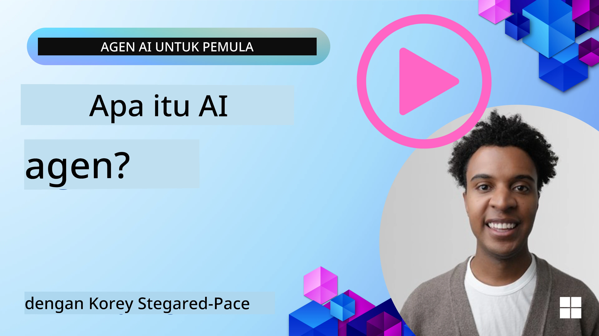
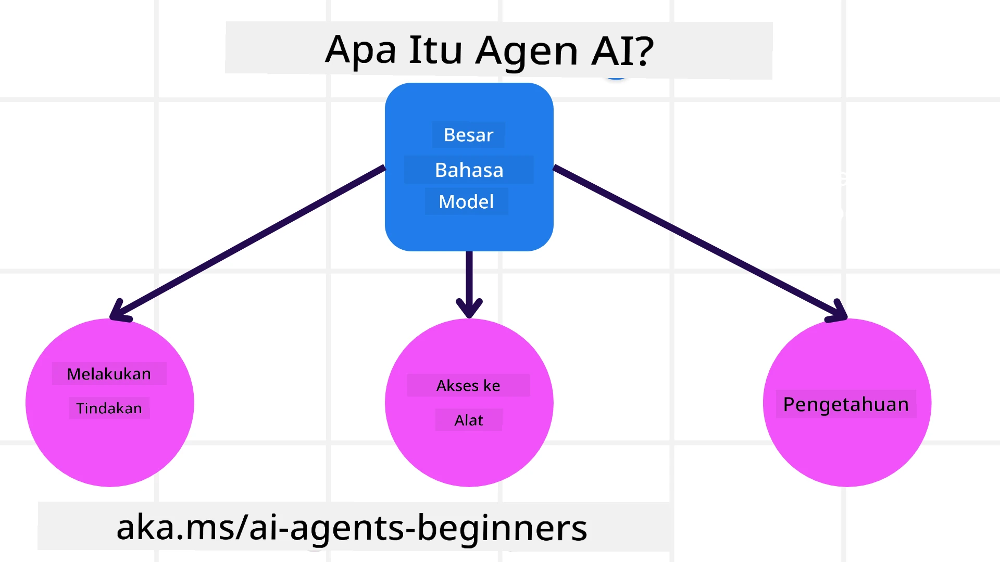
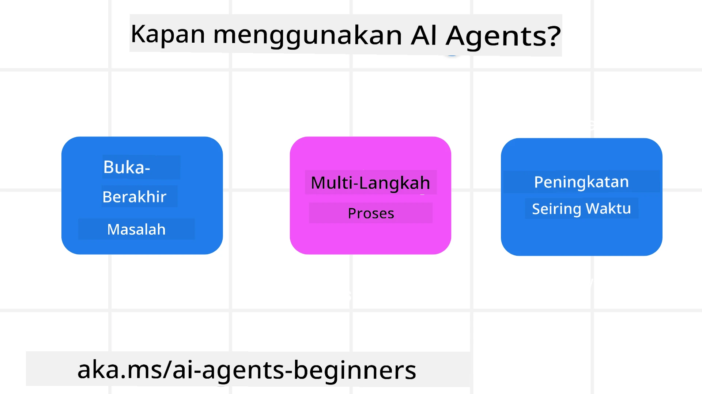

> _(Klik gambar di atas untuk menonton video untuk pelajaran ini)_

# Pengenalan AI Agents dan Kasus Penggunaan Agen

Selamat datang di kursus **AI Agents untuk Pemula**! Kursus ini memberikan Anda pengetahuan dasar — dan kode kerja nyata — untuk mulai membangun AI Agents dari nol.

Yuk sapa di <a href="https://discord.gg/kzRShWzttr" target="_blank">Komunitas Azure AI Discord</a> — penuh dengan pelajar dan pembangun AI yang senang menjawab pertanyaan.

Sebelum kita mulai membangun, mari pastikan kita benar-benar memahami apa itu AI Agent dan kapan masuk akal untuk menggunakannya.

---

## Pengenalan

Pelajaran ini mencakup:

- Apa itu AI Agents, dan berbagai jenis yang ada
- Jenis tugas apa yang paling cocok untuk AI Agents
- Blok bangunan inti yang akan Anda gunakan saat merancang solusi Agentic

## Tujuan Pembelajaran

Pada akhir pelajaran ini, Anda harus bisa:

- Menjelaskan apa itu AI Agent dan bagaimana bedanya dengan solusi AI biasa
- Mengetahui kapan harus menggunakan AI Agent (dan kapan tidak)
- Menggambar sketsa desain solusi Agentic dasar untuk masalah dunia nyata

---

## Mendefinisikan AI Agents dan Jenis AI Agents

### Apa itu AI Agents?

Berikut cara sederhana untuk memikirkannya:

> **AI Agents adalah sistem yang memungkinkan Large Language Models (LLMs) benar-benar *melakukan sesuatu* — dengan memberi mereka alat dan pengetahuan untuk bertindak di dunia, bukan hanya merespon prompt.**

Mari kita jelaskan sedikit:

- **Sistem** — AI Agent bukan hanya satu hal. Ini adalah kumpulan bagian yang bekerja sama. Pada intinya, setiap agen memiliki tiga bagian:
  - **Lingkungan** — Ruang tempat agen bekerja. Untuk agen pemesanan perjalanan, ini adalah platform pemesanan itu sendiri.
  - **Sensor** — Cara agen membaca kondisi lingkungan saat ini. Agen perjalanan kami mungkin memeriksa ketersediaan hotel atau harga penerbangan.
  - **Aktuator** — Cara agen mengambil tindakan. Agen perjalanan bisa memesan kamar, mengirim konfirmasi, atau membatalkan reservasi.

- **Large Language Models** — Agen sudah ada sebelum LLM, tapi LLMlah yang membuat agen modern sangat kuat. Mereka bisa memahami bahasa alami, berpikir tentang konteks, dan mengubah permintaan pengguna yang samar menjadi rencana tindakan yang konkret.

- **Melakukan Tindakan** — Tanpa sistem agen, LLM hanya menghasilkan teks. Dalam sistem agen, LLM bisa benar-benar *menjalankan* langkah-langkah — mencari database, memanggil API, mengirim pesan.

- **Akses ke Alat** — Alat yang dapat digunakan agen tergantung pada (1) lingkungan tempatnya berjalan dan (2) apa yang dipilih pengembang untuk diberikan. Agen perjalanan mungkin bisa mencari penerbangan tapi tidak mengedit catatan pelanggan — semuanya tergantung apa yang Anda sambungkan.

- **Memori + Pengetahuan** — Agen bisa memiliki memori jangka pendek (percakapan saat ini) dan memori jangka panjang (database pelanggan, interaksi sebelumnya). Agen perjalanan mungkin "mengingat" bahwa Anda lebih suka kursi di jendela.

---

### Jenis-jenis AI Agents

Tidak semua agen dibangun sama. Berikut rincian jenis utama, menggunakan agen pemesanan perjalanan sebagai contoh:

| **Jenis Agen** | **Apa yang Dilakukan** | **Contoh Agen Perjalanan** |
|---|---|---|
| **Simple Reflex Agents** | Mengikuti aturan yang diprogram keras — tanpa memori, tanpa perencanaan. | Melihat email keluhan → meneruskannya ke layanan pelanggan. Itu saja. |
| **Model-Based Reflex Agents** | Menyimpan model internal dunia dan memperbaruinya saat ada perubahan. | Melacak harga penerbangan historis dan menandai rute yang tiba-tiba mahal. |
| **Goal-Based Agents** | Memiliki tujuan dalam pikiran dan mencari cara mencapainya langkah demi langkah. | Memesan perjalanan lengkap (penerbangan, mobil, hotel) mulai dari lokasi Anda saat ini untuk sampai ke tujuan Anda. |
| **Utility-Based Agents** | Tidak hanya menemukan *solusi* — mencari yang *terbaik* dengan menimbang pengorbanan. | Menyeimbangkan biaya vs kenyamanan untuk menemukan perjalanan yang paling sesuai dengan preferensi Anda. |
| **Learning Agents** | Menjadi lebih baik dari waktu ke waktu dengan belajar dari umpan balik. | Menyesuaikan rekomendasi pemesanan di masa depan berdasarkan hasil survei setelah perjalanan. |
| **Hierarchical Agents** | Agen tingkat tinggi membagi pekerjaan menjadi subtugas dan mendelegasikan ke agen tingkat bawah. | Permintaan "batalkan perjalanan" dibagi menjadi: batalkan penerbangan, batalkan hotel, batalkan sewa mobil — masing-masing ditangani oleh sub-agen. |
| **Multi-Agent Systems (MAS)** | Beberapa agen independen bekerja bersama (atau bersaing). | Kooperatif: agen terpisah menangani hotel, penerbangan, dan hiburan. Kompetitif: banyak agen bersaing mengisi kamar hotel dengan harga terbaik. |

---

## Kapan Menggunakan AI Agents

Hanya karena Anda *bisa* menggunakan AI Agent bukan berarti Anda selalu *harus*. Berikut situasi di mana agen benar-benar unggul:

- **Masalah Terbuka** — Ketika langkah-langkah untuk menyelesaikan masalah tidak bisa diprogram sebelumnya. Anda perlu LLM mencari jalannya secara dinamis.
- **Proses Multi-Langkah** — Tugas yang membutuhkan menggunakan alat dalam beberapa putaran, bukan hanya pencarian atau generasi tunggal.
- **Perbaikan Seiring Waktu** — Ketika Anda ingin sistem menjadi lebih pintar berdasarkan umpan balik pengguna atau sinyal lingkungan.

Kita akan membahas lebih dalam kapan (dan kapan *tidak*) menggunakan AI Agents dalam pelajaran **Membangun AI Agents yang Dapat Dipercaya** nanti di kursus ini.

---

## Dasar-dasar Solusi Agentic

### Pengembangan Agen

Hal pertama yang Anda lakukan saat membangun agen adalah mendefinisikan *apa yang bisa dilakukan* — alat, tindakan, dan perilakunya.

Dalam kursus ini, kita menggunakan **Microsoft Foundry Agent Service** sebagai platform utama. Ini mendukung:

- Model dari penyedia seperti OpenAI, Mistral, dan Meta (Llama)
- Data berlisensi dari penyedia seperti Tripadvisor
- Definisi alat OpenAPI 3.0 yang distandarisasi

### Pola Agentic

Anda berkomunikasi dengan LLM melalui prompt. Dengan agen, Anda tidak selalu bisa membuat setiap prompt secara manual — agen perlu bertindak dalam banyak langkah. Di situlah **Pola Agentic** berperan. Mereka adalah strategi yang dapat digunakan ulang untuk memicu dan mengorkestrasi LLM dengan cara yang lebih skalabel dan andal.

Kursus ini disusun berdasarkan pola agentic yang paling umum dan berguna.

### Kerangka Agentic

Kerangka Agentic memberi pengembang templat siap pakai, alat, dan infrastruktur untuk membangun agen. Mereka memudahkan:

- Menghubungkan alat dan kemampuan
- Mengamati apa yang dilakukan agen (dan debug saat terjadi kesalahan)
- Bekerjasama antar banyak agen

Dalam kursus ini, kita fokus pada **Microsoft Agent Framework (MAF)** untuk membangun agen siap produksi.

---

## Contoh Kode

Siap melihat itu beraksi? Berikut contoh kode untuk pelajaran ini:

- 🐍 Python: [Agent Framework](./code_samples/01-python-agent-framework.ipynb)
- 🔷 .NET: [Agent Framework](./code_samples/01-dotnet-agent-framework.md)

---

## Ada Pertanyaan?

Bergabunglah dengan [Microsoft Foundry Discord](https://discord.com/invite/ATgtXmAS5D) untuk terhubung dengan pelajar lain, menghadiri jam kantor, dan dapatkan jawaban pertanyaan AI Agent Anda dari komunitas.

---

## Pelajaran Sebelumnya

[Persiapan Kursus](../00-course-setup/README.md)

## Pelajaran Selanjutnya

[Menjelajahi Kerangka Agentic](../02-explore-agentic-frameworks/README.md)

---

<!-- CO-OP TRANSLATOR DISCLAIMER START -->
**Penafian**:
Dokumen ini telah diterjemahkan menggunakan layanan terjemahan AI [Co-op Translator](https://github.com/Azure/co-op-translator). Meskipun kami berupaya untuk mencapai akurasi, harap diketahui bahwa terjemahan otomatis mungkin mengandung kesalahan atau ketidakakuratan. Dokumen asli dalam bahasa aslinya harus dianggap sebagai sumber yang sah. Untuk informasi penting, disarankan menggunakan terjemahan profesional oleh manusia. Kami tidak bertanggung jawab atas kesalahpahaman atau penafsiran yang keliru yang timbul dari penggunaan terjemahan ini.
<!-- CO-OP TRANSLATOR DISCLAIMER END -->