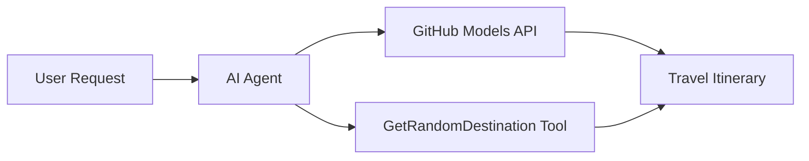

<!--
CO_OP_TRANSLATOR_METADATA:
{
  "original_hash": "23afd9be7b6ba5b69a44c3b6a78e07f6",
  "translation_date": "2025-11-06T10:05:30+00:00",
  "source_file": "01-intro-to-ai-agents/code_samples/01-dotnet-agent-framework.md",
  "language_code": "id"
}
-->
# 🌍 Agen Perjalanan AI dengan Microsoft Agent Framework (.NET)

## 📋 Gambaran Umum Skenario

Notebook ini menunjukkan cara membangun agen perencana perjalanan cerdas menggunakan Microsoft Agent Framework untuk .NET. Agen ini dapat secara otomatis menghasilkan rencana perjalanan sehari yang dipersonalisasi untuk destinasi acak di seluruh dunia.

**Kemampuan Utama:**
- 🎲 **Pemilihan Destinasi Acak**: Menggunakan alat khusus untuk memilih tempat liburan
- 🗺️ **Perencanaan Perjalanan Cerdas**: Membuat rencana perjalanan harian yang terperinci
- 🔄 **Streaming Real-time**: Mendukung respons langsung dan streaming
- 🛠️ **Integrasi Alat Khusus**: Menunjukkan cara memperluas kemampuan agen

## 🔧 Arsitektur Teknis

### Teknologi Inti
- **Microsoft Agent Framework**: Implementasi .NET terbaru untuk pengembangan agen AI
- **Integrasi Model GitHub**: Menggunakan layanan inferensi model AI dari GitHub
- **Kompatibilitas API OpenAI**: Memanfaatkan pustaka klien OpenAI dengan endpoint khusus
- **Konfigurasi Aman**: Pengelolaan kunci API berbasis lingkungan

### Komponen Utama
1. **AIAgent**: Orkestrator utama agen yang menangani alur percakapan
2. **Alat Khusus**: Fungsi `GetRandomDestination()` tersedia untuk agen
3. **Chat Client**: Antarmuka percakapan yang didukung oleh Model GitHub
4. **Dukungan Streaming**: Kemampuan menghasilkan respons secara real-time

### Pola Integrasi


## 🚀 Memulai

**Prasyarat:**
- .NET 10.0 atau lebih tinggi
- Token akses API Model GitHub
- Variabel lingkungan dikonfigurasi dalam file `.env`

**Variabel Lingkungan yang Diperlukan:**
```env
GITHUB_TOKEN=your_github_token
GITHUB_ENDPOINT=https://models.inference.ai.azure.com
GITHUB_MODEL_ID=gpt-4o-mini
```

Jalankan contoh kode di bawah ini secara berurutan untuk melihat agen perjalanan beraksi!

---

## Aplikasi File Tunggal .NET: Contoh Agen Perjalanan AI

Lihat `01-dotnet-agent-framework.cs` untuk contoh kode lengkap yang dapat dijalankan.

```bash
dotnet run 01-dotnet-agent-framework.cs
```

### Contoh Kode

```csharp
static string GetRandomDestination()
{
    var destinations = new List<string>
    {
        "Paris, France",
        "Tokyo, Japan",
        "New York City, USA",
        "Sydney, Australia",
        "Rome, Italy",
        "Barcelona, Spain",
        "Cape Town, South Africa",
        "Rio de Janeiro, Brazil",
        "Bangkok, Thailand",
        "Vancouver, Canada"
    };
    var random = new Random();
    int index = random.Next(destinations.Count);
    return destinations[index];
}

// Extract configuration from environment variables
var github_endpoint = Environment.GetEnvironmentVariable("GITHUB_ENDPOINT") ?? throw new InvalidOperationException("GITHUB_ENDPOINT is not set.");
var github_model_id = Environment.GetEnvironmentVariable("GITHUB_MODEL_ID") ?? "gpt-4o-mini";
var github_token = Environment.GetEnvironmentVariable("GITHUB_TOKEN") ?? throw new InvalidOperationException("GITHUB_TOKEN is not set.");

// Configure OpenAI Client Options
var openAIOptions = new OpenAIClientOptions()
{
    Endpoint = new Uri(github_endpoint)
};

// Initialize OpenAI Client with GitHub Models Configuration
var openAIClient = new OpenAIClient(new ApiKeyCredential(github_token), openAIOptions);

// Create AI Agent with Travel Planning Capabilities
AIAgent agent = openAIClient
    .GetChatClient(github_model_id)
    .CreateAIAgent(
        instructions: "You are a helpful AI Agent that can help plan vacations for customers at random destinations",
        tools: [AIFunctionFactory.Create(GetRandomDestination)]
    );

// Execute Agent: Plan a Day Trip (Non-Streaming)
Console.WriteLine(await agent.RunAsync("Plan me a day trip"));

// Execute Agent: Plan a Day Trip (Streaming Response)
await foreach (var update in agent.RunStreamingAsync("Plan me a day trip"))
{
    Console.Write(update);
}
```

---

**Penafian**:  
Dokumen ini telah diterjemahkan menggunakan layanan penerjemahan AI [Co-op Translator](https://github.com/Azure/co-op-translator). Meskipun kami berupaya untuk memberikan hasil yang akurat, harap diketahui bahwa terjemahan otomatis mungkin mengandung kesalahan atau ketidakakuratan. Dokumen asli dalam bahasa aslinya harus dianggap sebagai sumber yang otoritatif. Untuk informasi yang penting, disarankan menggunakan jasa penerjemahan manusia profesional. Kami tidak bertanggung jawab atas kesalahpahaman atau penafsiran yang timbul dari penggunaan terjemahan ini.