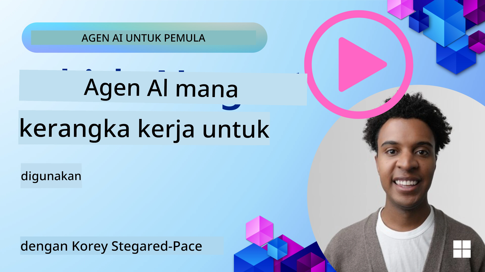

[](https://youtu.be/ODwF-EZo_O8?si=1xoy_B9RNQfrYdF7)

> _(Klik gambar di atas untuk melihat video pelajaran ini)_

# Jelajahi Kerangka Agen AI

Kerangka agen AI adalah platform perangkat lunak yang dirancang untuk menyederhanakan pembuatan, penyebaran, dan pengelolaan agen AI. Kerangka ini menyediakan pengembang dengan komponen bawaan, abstraksi, dan alat yang memperlancar pengembangan sistem AI yang kompleks.

Kerangka ini membantu pengembang fokus pada aspek unik dari aplikasi mereka dengan menyediakan pendekatan standar untuk tantangan umum dalam pengembangan agen AI. Mereka meningkatkan skala, aksesibilitas, dan efisiensi dalam membangun sistem AI.

## Pendahuluan 

Pelajaran ini akan mencakup:

- Apa itu Kerangka Agen AI dan apa yang memungkinkan pengembang capai?
- Bagaimana tim dapat menggunakan ini untuk dengan cepat membuat prototipe, mengiterasi, dan meningkatkan kemampuan agen mereka?
- Apa perbedaan antara kerangka dan alat yang dibuat oleh Microsoft (<a href="https://aka.ms/ai-agents-beginners/ai-agent-service" target="_blank">Layanan Azure AI Agent</a> dan <a href="https://learn.microsoft.com/azure/ai-services/openai/how-to/responses" target="_blank">Kerangka Agen Microsoft</a>)?
- Dapatkah saya mengintegrasikan alat ekosistem Azure saya yang sudah ada secara langsung, atau apakah saya membutuhkan solusi mandiri?
- Apa itu layanan Azure AI Agent dan bagaimana ini membantu saya?

## Tujuan pembelajaran

Tujuan pelajaran ini adalah membantu Anda memahami:

- Peran Kerangka Agen AI dalam pengembangan AI.
- Cara memanfaatkan Kerangka Agen AI untuk membangun agen cerdas.
- Kemampuan utama yang diaktifkan oleh Kerangka Agen AI.
- Perbedaan antara Kerangka Agen Microsoft dan Layanan Azure AI Agent.

## Apa itu Kerangka Agen AI dan apa yang memungkinkan pengembang lakukan?

Kerangka AI tradisional dapat membantu Anda mengintegrasikan AI ke dalam aplikasi Anda dan membuat aplikasi tersebut menjadi lebih baik dalam hal berikut:

- **Personalisasi**: AI dapat menganalisis perilaku dan preferensi pengguna untuk memberikan rekomendasi, konten, dan pengalaman yang dipersonalisasi.
Example: Layanan streaming seperti Netflix menggunakan AI untuk menyarankan film dan acara berdasarkan riwayat penayangan, meningkatkan keterlibatan dan kepuasan pengguna.
- **Otomatisasi dan Efisiensi**: AI dapat mengotomatiskan tugas berulang, menyederhanakan alur kerja, dan meningkatkan efisiensi operasional.
Example: Aplikasi layanan pelanggan menggunakan chatbot bertenaga AI untuk menangani pertanyaan umum, mengurangi waktu respons dan membebaskan agen manusia untuk masalah yang lebih kompleks.
- **Peningkatan Pengalaman Pengguna**: AI dapat meningkatkan pengalaman pengguna secara keseluruhan dengan menyediakan fitur cerdas seperti pengenalan suara, pemrosesan bahasa alami, dan teks prediktif.
Example: Asisten virtual seperti Siri dan Google Assistant menggunakan AI untuk memahami dan merespons perintah suara, mempermudah pengguna berinteraksi dengan perangkat mereka.

### Semua itu terdengar bagus, kan? Jadi mengapa kita membutuhkan Kerangka Agen AI?

Kerangka Agen AI mewakili sesuatu yang lebih dari sekadar kerangka AI. Mereka dirancang untuk memungkinkan pembuatan agen cerdas yang dapat berinteraksi dengan pengguna, agen lain, dan lingkungan untuk mencapai tujuan tertentu. Agen ini dapat menunjukkan perilaku otonom, membuat keputusan, dan menyesuaikan diri dengan kondisi yang berubah. Mari kita lihat beberapa kemampuan utama yang diaktifkan oleh Kerangka Agen AI:

- **Kolaborasi dan Koordinasi Agen**: Memungkinkan pembuatan beberapa agen AI yang dapat bekerja bersama, berkomunikasi, dan berkoordinasi untuk menyelesaikan tugas yang kompleks.
- **Otomatisasi dan Manajemen Tugas**: Menyediakan mekanisme untuk mengotomatisasi alur kerja multi-langkah, pendelegasian tugas, dan manajemen tugas dinamis antar agen.
- **Pemahaman Kontekstual dan Adaptasi**: Membekali agen dengan kemampuan untuk memahami konteks, menyesuaikan diri dengan lingkungan yang berubah, dan membuat keputusan berdasarkan informasi waktu nyata.

Jadi secara ringkas, agen memungkinkan Anda melakukan lebih banyak, membawa otomatisasi ke tingkat berikutnya, untuk menciptakan sistem yang lebih cerdas yang dapat menyesuaikan dan belajar dari lingkungan mereka.

## Bagaimana cara dengan cepat membuat prototipe, mengiterasi, dan meningkatkan kemampuan agen?

Ini adalah lanskap yang bergerak cepat, tetapi ada beberapa hal yang umum di sebagian besar Kerangka Agen AI yang dapat membantu Anda dengan cepat membuat prototipe dan mengiterasi yaitu komponen modular, alat kolaboratif, dan pembelajaran waktu nyata. Mari kita selami ini:

- **Gunakan Komponen Modular**: SDK menawarkan komponen bawaan seperti konektor AI dan Memori, pemanggilan fungsi menggunakan bahasa alami atau plugin kode, template prompt, dan lainnya.
- **Manfaatkan Alat Kolaboratif**: Rancang agen dengan peran dan tugas spesifik, memungkinkan mereka menguji dan menyempurnakan alur kerja kolaboratif.
- **Belajar secara Waktu Nyata**: Terapkan loop umpan balik di mana agen belajar dari interaksi dan menyesuaikan perilaku mereka secara dinamis.

### Gunakan Komponen Modular

SDK seperti Kerangka Agen Microsoft menawarkan komponen bawaan seperti konektor AI, definisi alat, dan manajemen agen.

**Bagaimana tim dapat menggunakan ini**: Tim dapat dengan cepat merangkai komponen ini untuk membuat prototipe fungsional tanpa memulai dari nol, memungkinkan eksperimen dan iterasi yang cepat.

**Bagaimana ini bekerja dalam praktik**: Anda dapat menggunakan parser bawaan untuk mengekstrak informasi dari masukan pengguna, modul memori untuk menyimpan dan mengambil data, dan generator prompt untuk berinteraksi dengan pengguna, semuanya tanpa harus membangun komponen ini dari awal.

**Example code**. Let's look at an example of how you can use the Microsoft Agent Framework with `AzureAIProjectAgentProvider` to have the model respond to user input with tool calling:

``` python
# Contoh Microsoft Agent Framework Python

import asyncio
import os
from typing import Annotated

from agent_framework.azure import AzureAIProjectAgentProvider
from azure.identity import AzureCliCredential


# Definisikan fungsi alat contoh untuk memesan perjalanan
def book_flight(date: str, location: str) -> str:
    """Book travel given location and date."""
    return f"Travel was booked to {location} on {date}"


async def main():
    provider = AzureAIProjectAgentProvider(credential=AzureCliCredential())
    agent = await provider.create_agent(
        name="travel_agent",
        instructions="Help the user book travel. Use the book_flight tool when ready.",
        tools=[book_flight],
    )

    response = await agent.run("I'd like to go to New York on January 1, 2025")
    print(response)
    # Contoh output: Penerbangan Anda ke New York pada 1 Januari 2025 telah berhasil dipesan. Selamat bepergian! ✈️🗽


if __name__ == "__main__":
    asyncio.run(main())
```

What you can see from this example is how you can leverage a pre-built parser to extract key information from user input, such as the origin, destination, and date of a flight booking request. This modular approach allows you to focus on the high-level logic.

### Manfaatkan Alat Kolaboratif

Kerangka seperti Kerangka Agen Microsoft memfasilitasi pembuatan beberapa agen yang dapat bekerja bersama.

**Bagaimana tim dapat menggunakan ini**: Tim dapat merancang agen dengan peran dan tugas spesifik, memungkinkan mereka menguji dan menyempurnakan alur kerja kolaboratif dan meningkatkan efisiensi sistem secara keseluruhan.

**Bagaimana ini bekerja dalam praktik**: Anda dapat membuat tim agen di mana setiap agen memiliki fungsi khusus, seperti pengambilan data, analisis, atau pengambilan keputusan. Agen-agen ini dapat berkomunikasi dan berbagi informasi untuk mencapai tujuan bersama, seperti menjawab pertanyaan pengguna atau menyelesaikan tugas.

**Example code (Kerangka Agen Microsoft)**:

```python
# Membuat beberapa agen yang bekerja sama menggunakan Microsoft Agent Framework

import os
from agent_framework.azure import AzureAIProjectAgentProvider
from azure.identity import AzureCliCredential

provider = AzureAIProjectAgentProvider(credential=AzureCliCredential())

# Agen Pengambilan Data
agent_retrieve = await provider.create_agent(
    name="dataretrieval",
    instructions="Retrieve relevant data using available tools.",
    tools=[retrieve_tool],
)

# Agen Analisis Data
agent_analyze = await provider.create_agent(
    name="dataanalysis",
    instructions="Analyze the retrieved data and provide insights.",
    tools=[analyze_tool],
)

# Menjalankan agen secara berurutan pada suatu tugas
retrieval_result = await agent_retrieve.run("Retrieve sales data for Q4")
analysis_result = await agent_analyze.run(f"Analyze this data: {retrieval_result}")
print(analysis_result)
```

What you see in the previous code is how you can create a task that involves multiple agents working together to analyze data. Each agent performs a specific function, and the task is executed by coordinating the agents to achieve the desired outcome. By creating dedicated agents with specialized roles, you can improve task efficiency and performance.

### Belajar secara Waktu Nyata

Kerangka lanjutan menyediakan kemampuan untuk pemahaman konteks waktu nyata dan adaptasi.

**Bagaimana tim dapat menggunakan ini**: Tim dapat menerapkan loop umpan balik di mana agen belajar dari interaksi dan menyesuaikan perilaku mereka secara dinamis, menghasilkan peningkatan dan penyempurnaan kemampuan secara berkelanjutan.

**Bagaimana ini bekerja dalam praktik**: Agen dapat menganalisis umpan balik pengguna, data lingkungan, dan hasil tugas untuk memperbarui basis pengetahuan mereka, menyesuaikan algoritme pengambilan keputusan, dan meningkatkan kinerja dari waktu ke waktu. Proses pembelajaran iteratif ini memungkinkan agen menyesuaikan diri dengan kondisi yang berubah dan preferensi pengguna, meningkatkan efektivitas sistem secara keseluruhan.

## Apa perbedaan antara Kerangka Agen Microsoft dan Layanan Azure AI Agent?

Ada banyak cara untuk membandingkan pendekatan ini, tetapi mari kita lihat beberapa perbedaan kunci dalam hal desain, kemampuan, dan kasus penggunaan yang ditargetkan:

## Kerangka Agen Microsoft (MAF)

Kerangka Agen Microsoft menyediakan SDK yang disederhanakan untuk membangun agen AI menggunakan `AzureAIProjectAgentProvider`. Ini memungkinkan pengembang membuat agen yang memanfaatkan model Azure OpenAI dengan pemanggilan alat bawaan, manajemen percakapan, dan keamanan tingkat perusahaan melalui identitas Azure.

**Kasus Penggunaan**: Membangun agen AI siap-produksi dengan penggunaan alat, alur kerja multi-langkah, dan skenario integrasi perusahaan.

Berikut beberapa konsep inti penting dari Kerangka Agen Microsoft:

- **Agen**. Sebuah agen dibuat melalui `AzureAIProjectAgentProvider` dan dikonfigurasi dengan nama, instruksi, dan alat. Agen dapat:
  - **Memproses pesan pengguna** dan menghasilkan respons menggunakan model Azure OpenAI.
  - **Memanggil alat** secara otomatis berdasarkan konteks percakapan.
  - **Mempertahankan status percakapan** di banyak interaksi.

  Here is a code snippet showing how to create an agent:

    ```python
    import os
    from agent_framework.azure import AzureAIProjectAgentProvider
    from azure.identity import AzureCliCredential

    provider = AzureAIProjectAgentProvider(credential=AzureCliCredential())
    agent = await provider.create_agent(
        name="my_agent",
        instructions="You are a helpful assistant.",
    )

    response = await agent.run("Hello, World!")
    print(response)
    ```

- **Alat**. Kerangka ini mendukung pendefinisian alat sebagai fungsi Python yang dapat dipanggil agen secara otomatis. Alat didaftarkan saat membuat agen:

    ```python
    def get_weather(location: str) -> str:
        """Get the current weather for a location."""
        return f"The weather in {location} is sunny, 72\u00b0F."

    agent = await provider.create_agent(
        name="weather_agent",
        instructions="Help users check the weather.",
        tools=[get_weather],
    )
    ```

- **Koordinasi Multi-Agen**. Anda dapat membuat beberapa agen dengan spesialisasi berbeda dan mengoordinasikan pekerjaan mereka:

    ```python
    planner = await provider.create_agent(
        name="planner",
        instructions="Break down complex tasks into steps.",
    )

    executor = await provider.create_agent(
        name="executor",
        instructions="Execute the planned steps using available tools.",
        tools=[execute_tool],
    )

    plan = await planner.run("Plan a trip to Paris")
    result = await executor.run(f"Execute this plan: {plan}")
    ```

- **Integrasi Identitas Azure**. Kerangka ini menggunakan `AzureCliCredential` (atau `DefaultAzureCredential`) untuk otentikasi yang aman tanpa kunci, menghilangkan kebutuhan untuk mengelola kunci API secara langsung.

## Layanan Azure AI Agent

Layanan Azure AI Agent adalah tambahan yang lebih baru, diperkenalkan di Microsoft Ignite 2024. Ini memungkinkan pengembangan dan penyebaran agen AI dengan model yang lebih fleksibel, seperti memanggil LLM sumber terbuka langsung seperti Llama 3, Mistral, dan Cohere.

Layanan Azure AI Agent menyediakan mekanisme keamanan perusahaan yang lebih kuat dan metode penyimpanan data, menjadikannya cocok untuk aplikasi perusahaan.

Ini bekerja langsung bersama Kerangka Agen Microsoft untuk membangun dan menyebarkan agen.

Layanan ini saat ini dalam Public Preview dan mendukung Python dan C# untuk membangun agen.

Using the Azure AI Agent Service Python SDK, we can create an agent with a user-defined tool:

```python
import asyncio
from azure.identity import DefaultAzureCredential
from azure.ai.projects import AIProjectClient

# Definisikan fungsi alat
def get_specials() -> str:
    """Provides a list of specials from the menu."""
    return """
    Special Soup: Clam Chowder
    Special Salad: Cobb Salad
    Special Drink: Chai Tea
    """

def get_item_price(menu_item: str) -> str:
    """Provides the price of the requested menu item."""
    return "$9.99"


async def main() -> None:
    credential = DefaultAzureCredential()
    project_client = AIProjectClient.from_connection_string(
        credential=credential,
        conn_str="your-connection-string",
    )

    agent = project_client.agents.create_agent(
        model="gpt-4o-mini",
        name="Host",
        instructions="Answer questions about the menu.",
        tools=[get_specials, get_item_price],
    )

    thread = project_client.agents.create_thread()

    user_inputs = [
        "Hello",
        "What is the special soup?",
        "How much does that cost?",
        "Thank you",
    ]

    for user_input in user_inputs:
        print(f"# User: '{user_input}'")
        message = project_client.agents.create_message(
            thread_id=thread.id,
            role="user",
            content=user_input,
        )
        run = project_client.agents.create_and_process_run(
            thread_id=thread.id, agent_id=agent.id
        )
        messages = project_client.agents.list_messages(thread_id=thread.id)
        print(f"# Agent: {messages.data[0].content[0].text.value}")


if __name__ == "__main__":
    asyncio.run(main())
```

### Konsep inti

Layanan Azure AI Agent memiliki konsep inti berikut:

- **Agen**. Layanan Azure AI Agent terintegrasi dengan Microsoft Foundry. Dalam AI Foundry, sebuah Agen AI berperan sebagai mikroservis "cerdas" yang dapat digunakan untuk menjawab pertanyaan (RAG), melakukan tindakan, atau sepenuhnya mengotomatisasi alur kerja. Ini dicapai dengan menggabungkan kekuatan model generatif AI dengan alat yang memungkinkannya mengakses dan berinteraksi dengan sumber data dunia nyata. Berikut adalah contoh agen:

    ```python
    agent = project_client.agents.create_agent(
        model="gpt-4o-mini",
        name="my-agent",
        instructions="You are helpful agent",
        tools=code_interpreter.definitions,
        tool_resources=code_interpreter.resources,
    )
    ```

    In this example, an agent is created with the model `gpt-4o-mini`, a name `my-agent`, and instructions `You are helpful agent`. The agent is equipped with tools and resources to perform code interpretation tasks.

- **Thread and messages**. Thread adalah konsep penting lainnya. Thread mewakili percakapan atau interaksi antara agen dan pengguna. Thread dapat digunakan untuk melacak kemajuan sebuah percakapan, menyimpan informasi konteks, dan mengelola status interaksi. Berikut adalah contoh thread:

    ```python
    thread = project_client.agents.create_thread()
    message = project_client.agents.create_message(
        thread_id=thread.id,
        role="user",
        content="Could you please create a bar chart for the operating profit using the following data and provide the file to me? Company A: $1.2 million, Company B: $2.5 million, Company C: $3.0 million, Company D: $1.8 million",
    )
    
    # Ask the agent to perform work on the thread
    run = project_client.agents.create_and_process_run(thread_id=thread.id, agent_id=agent.id)
    
    # Fetch and log all messages to see the agent's response
    messages = project_client.agents.list_messages(thread_id=thread.id)
    print(f"Messages: {messages}")
    ```

    In the previous code, a thread is created. Thereafter, a message is sent to the thread. By calling `create_and_process_run`, the agent is asked to perform work on the thread. Finally, the messages are fetched and logged to see the agent's response. The messages indicate the progress of the conversation between the user and the agent. It's also important to understand that the messages can be of different types such as text, image, or file, that is the agents work has resulted in for example an image or a text response for example. As a developer, you can then use this information to further process the response or present it to the user.

- **Integrasi dengan Kerangka Agen Microsoft**. Layanan Azure AI Agent bekerja mulus dengan Kerangka Agen Microsoft, yang berarti Anda dapat membangun agen menggunakan `AzureAIProjectAgentProvider` dan menyebarkannya melalui Agent Service untuk skenario produksi.

**Kasus Penggunaan**: Layanan Azure AI Agent dirancang untuk aplikasi perusahaan yang membutuhkan penyebaran agen AI yang aman, dapat diskalakan, dan fleksibel.

## Apa bedanya antara pendekatan-pendekatan ini?
 
Memang terdengar seperti ada tumpang tindih, tetapi ada beberapa perbedaan kunci dalam hal desain, kemampuan, dan kasus penggunaan yang ditargetkan:
 
- **Kerangka Agen Microsoft (MAF)**: Adalah SDK siap-produksi untuk membangun agen AI. Ini menyediakan API yang disederhanakan untuk membuat agen dengan pemanggilan alat, manajemen percakapan, dan integrasi identitas Azure.
- **Layanan Azure AI Agent**: Adalah platform dan layanan penyebaran di Azure Foundry untuk agen. Ini menawarkan konektivitas bawaan ke layanan seperti Azure OpenAI, Azure AI Search, Bing Search dan eksekusi kode.
 
Masih belum yakin mana yang harus dipilih?

### Kasus Penggunaan
 
Mari kita lihat apakah kami dapat membantu Anda dengan melalui beberapa kasus penggunaan umum:
 
> Q: I'm building production AI agent applications and want to get started quickly
>
>A: Kerangka Agen Microsoft adalah pilihan yang bagus. Ini menyediakan API Pythonic yang sederhana melalui `AzureAIProjectAgentProvider` yang memungkinkan Anda mendefinisikan agen dengan alat dan instruksi hanya dalam beberapa baris kode.

>Q: I need enterprise-grade deployment with Azure integrations like Search and code execution
>
> A: Layanan Azure AI Agent adalah pilihan terbaik. Ini adalah layanan platform yang menyediakan kemampuan bawaan untuk berbagai model, Azure AI Search, Bing Search dan Azure Functions. Ini mempermudah membangun agen Anda di Foundry Portal dan menyebarkannya dalam skala besar.
 
> Q: I'm still confused, just give me one option
>
> A: Mulailah dengan Kerangka Agen Microsoft untuk membangun agen Anda, dan kemudian gunakan Layanan Azure AI Agent ketika Anda perlu menyebarkan dan menskalakan mereka di produksi. Pendekatan ini memungkinkan Anda beriterasi dengan cepat pada logika agen Anda sambil memiliki jalur yang jelas menuju penyebaran perusahaan.
 
Let's summarize the key differences in a table:

| Framework | Focus | Core Concepts | Use Cases |
| --- | --- | --- | --- |
| Kerangka Agen Microsoft | SDK agen yang disederhanakan dengan pemanggilan alat | Agen, Alat, Identitas Azure | Membangun agen AI, penggunaan alat, alur kerja multi-langkah |
| Layanan Azure AI Agent | Model fleksibel, keamanan tingkat perusahaan, Pembuatan kode, Pemanggilan alat | Modularitas, Kolaborasi, Orkestrasi Proses | Penerapan agen AI yang aman, skalabel, dan fleksibel |

## Dapatkah saya mengintegrasikan alat ekosistem Azure saya yang sudah ada secara langsung, atau apakah saya membutuhkan solusi mandiri?
Jawabannya adalah ya, Anda dapat mengintegrasikan alat-alat ekosistem Azure yang sudah ada langsung dengan Azure AI Agent Service, terutama karena layanan ini dibangun untuk bekerja mulus dengan layanan Azure lainnya. Misalnya, Anda dapat mengintegrasikan Bing, Azure AI Search, dan Azure Functions. Ada juga integrasi mendalam dengan Microsoft Foundry.

Microsoft Agent Framework juga terintegrasi dengan layanan Azure melalui `AzureAIProjectAgentProvider` dan identitas Azure, memungkinkan Anda memanggil layanan Azure langsung dari alat agen Anda.

## Contoh Kode

- Python: [Kerangka Agen](./code_samples/02-python-agent-framework.ipynb)
- .NET: [Kerangka Agen](./code_samples/02-dotnet-agent-framework.md)

## Punya Pertanyaan Lebih Lanjut tentang Kerangka Agen AI?

Bergabunglah dengan [Microsoft Foundry Discord](https://aka.ms/ai-agents/discord) untuk bertemu dengan pelajar lain, menghadiri jam konsultasi, dan mendapatkan jawaban atas pertanyaan Anda tentang Agen AI.

## Referensi

- <a href="https://techcommunity.microsoft.com/blog/azure-ai-services-blog/introducing-azure-ai-agent-service/4298357" target="_blank">Layanan Agen Azure</a>
- <a href="https://learn.microsoft.com/azure/ai-services/openai/how-to/responses" target="_blank">Kerangka Agen Microsoft - Respons Azure OpenAI</a>
- <a href="https://learn.microsoft.com/azure/ai-services/agents/overview" target="_blank">Layanan Agen AI Azure</a>

## Pelajaran Sebelumnya

[Pengenalan Agen AI dan Kasus Penggunaan Agen](../01-intro-to-ai-agents/README.md)

## Pelajaran Berikutnya

[Memahami Pola Desain Agentik](../03-agentic-design-patterns/README.md)

---

<!-- CO-OP TRANSLATOR DISCLAIMER START -->
**Penafian**:
Dokumen ini telah diterjemahkan menggunakan layanan terjemahan AI [Co-op Translator](https://github.com/Azure/co-op-translator). Meskipun kami berupaya untuk akurasi, harap diperhatikan bahwa terjemahan otomatis mungkin mengandung kesalahan atau ketidakakuratan. Dokumen asli dalam bahasa aslinya harus dianggap sebagai sumber yang berwenang. Untuk informasi yang bersifat kritis, disarankan menggunakan terjemahan profesional oleh penerjemah manusia. Kami tidak bertanggung jawab atas kesalahpahaman atau salah tafsir yang timbul dari penggunaan terjemahan ini.
<!-- CO-OP TRANSLATOR DISCLAIMER END -->