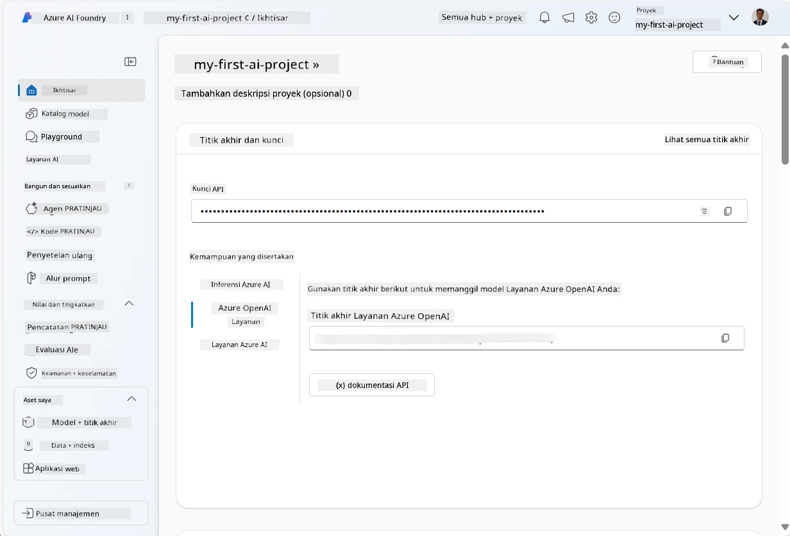
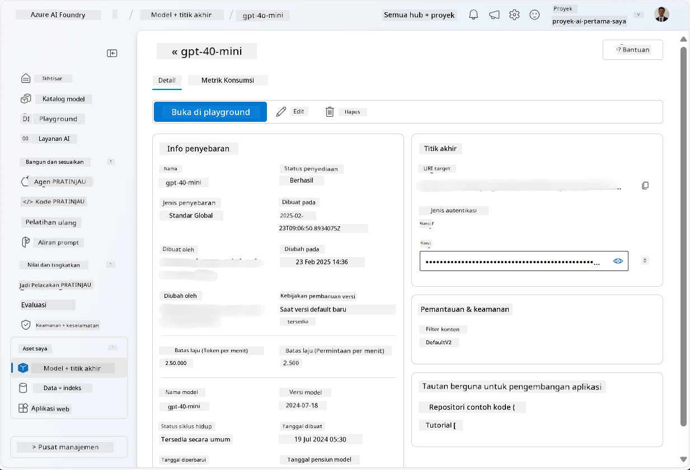
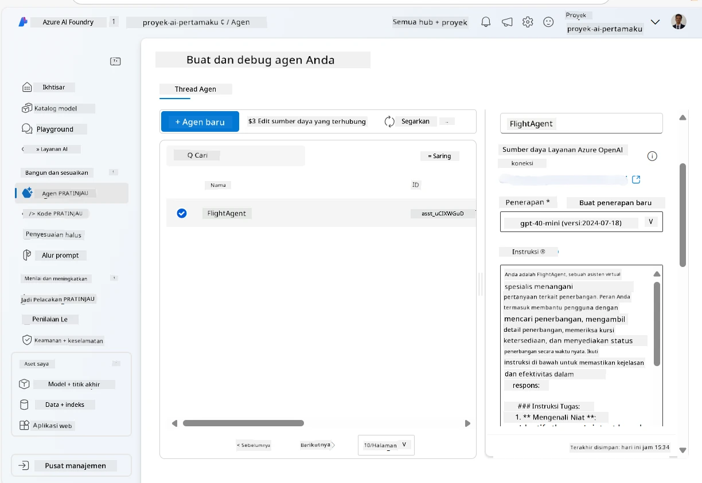
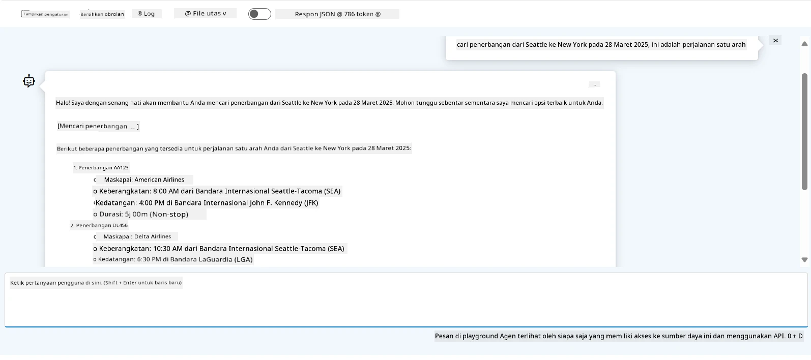

# Pengembangan Layanan Agen Microsoft Foundry

Dalam latihan ini, Anda menggunakan alat Layanan Agen Microsoft Foundry di [portal Microsoft Foundry](https://ai.azure.com/?WT.mc_id=academic-105485-koreyst) untuk membuat agen untuk Pemesanan Penerbangan. Agen tersebut akan dapat berinteraksi dengan pengguna dan memberikan informasi tentang penerbangan.

## Prasyarat

Untuk menyelesaikan latihan ini, Anda memerlukan hal-hal berikut:
1. Akun Azure dengan langganan aktif. [Buat akun secara gratis](https://azure.microsoft.com/free/?WT.mc_id=academic-105485-koreyst).
2. Anda memerlukan izin untuk membuat hub Microsoft Foundry atau memiliki satu yang dibuat untuk Anda.
    - Jika peran Anda adalah Kontributor atau Pemilik, Anda dapat mengikuti langkah-langkah dalam tutorial ini.

## Membuat hub Microsoft Foundry

> **Catatan:** Microsoft Foundry sebelumnya dikenal sebagai Azure AI Studio.

1. Ikuti panduan ini dari [Microsoft Foundry](https://learn.microsoft.com/en-us/azure/ai-studio/?WT.mc_id=academic-105485-koreyst) posting blog untuk membuat hub Microsoft Foundry.
2. Saat proyek Anda dibuat, tutup semua tips yang ditampilkan dan tinjau halaman proyek di portal Microsoft Foundry, yang seharusnya tampak mirip dengan gambar berikut:

    

## Menyebarkan model

1. Di panel kiri untuk proyek Anda, di bagian **Aset Saya**, pilih halaman **Model + titik akhir**.
2. Di halaman **Model + titik akhir**, pada tab **Penyebaran model**, di menu **+ Sebarkan model**, pilih **Sebarkan model dasar**.
3. Cari model `gpt-4o-mini` dalam daftar, lalu pilih dan konfirmasi.

    > **Catatan**: Mengurangi TPM membantu menghindari penggunaan kuota berlebihan yang tersedia dalam langganan yang Anda gunakan.

    

## Membuat agen

Sekarang setelah Anda menyebarkan model, Anda dapat membuat agen. Agen adalah model AI percakapan yang dapat digunakan untuk berinteraksi dengan pengguna.

1. Di panel kiri untuk proyek Anda, di bagian **Bangun & Sesuaikan**, pilih halaman **Agen**.
2. Klik **+ Buat agen** untuk membuat agen baru. Di bawah kotak dialog **Pengaturan Agen**:
    - Masukkan nama untuk agen, seperti `FlightAgent`.
    - Pastikan bahwa penyebaran model `gpt-4o-mini` yang Anda buat sebelumnya dipilih
    - Tetapkan **Instruksi** sesuai dengan prompt yang ingin Anda buat agen ikuti. Berikut adalah contoh:
    ```
    You are FlightAgent, a virtual assistant specialized in handling flight-related queries. Your role includes assisting users with searching for flights, retrieving flight details, checking seat availability, and providing real-time flight status. Follow the instructions below to ensure clarity and effectiveness in your responses:

    ### Task Instructions:
    1. **Recognizing Intent**:
       - Identify the user's intent based on their request, focusing on one of the following categories:
         - Searching for flights
         - Retrieving flight details using a flight ID
         - Checking seat availability for a specified flight
         - Providing real-time flight status using a flight number
       - If the intent is unclear, politely ask users to clarify or provide more details.
        
    2. **Processing Requests**:
        - Depending on the identified intent, perform the required task:
        - For flight searches: Request details such as origin, destination, departure date, and optionally return date.
        - For flight details: Request a valid flight ID.
        - For seat availability: Request the flight ID and date and validate inputs.
        - For flight status: Request a valid flight number.
        - Perform validations on provided data (e.g., formats of dates, flight numbers, or IDs). If the information is incomplete or invalid, return a friendly request for clarification.

    3. **Generating Responses**:
    - Use a tone that is friendly, concise, and supportive.
    - Provide clear and actionable suggestions based on the output of each task.
    - If no data is found or an error occurs, explain it to the user gently and offer alternative actions (e.g., refine search, try another query).
    
    ```
> [!NOTE]
> Untuk prompt yang lebih rinci, Anda dapat melihat [repositori ini](https://github.com/ShivamGoyal03/RoamMind) untuk informasi lebih lanjut.
    
> Selain itu, Anda dapat menambahkan **Basis Pengetahuan** dan **Tindakan** untuk meningkatkan kemampuan agen dalam memberikan lebih banyak informasi dan melakukan tugas otomatis berdasarkan permintaan pengguna. Untuk latihan ini, Anda dapat melewati langkah-langkah ini.
    


3. Untuk membuat agen multi-AI baru, cukup klik **Agen Baru**. Agen yang baru dibuat kemudian akan ditampilkan di halaman Agen.


## Uji agen

Setelah membuat agen, Anda dapat mengujinya untuk melihat bagaimana responnya terhadap pertanyaan pengguna di playground portal Microsoft Foundry.

1. Di bagian atas panel **Setup** untuk agen Anda, pilih **Coba di playground**.
2. Di panel **Playground**, Anda dapat berinteraksi dengan agen dengan mengetikkan pertanyaan di jendela obrolan. Misalnya, Anda dapat meminta agen mencari penerbangan dari Seattle ke New York pada tanggal 28.

    > **Catatan**: Agen mungkin tidak memberikan jawaban yang akurat, karena tidak ada data waktu nyata yang digunakan dalam latihan ini. Tujuannya adalah untuk menguji kemampuan agen dalam memahami dan merespons pertanyaan pengguna berdasarkan instruksi yang diberikan.

    

3. Setelah menguji agen, Anda dapat menyesuaikannya lebih lanjut dengan menambahkan lebih banyak niat, data pelatihan, dan tindakan untuk meningkatkan kemampuannya.

## Membersihkan sumber daya

Setelah Anda selesai menguji agen, Anda dapat menghapusnya untuk menghindari biaya tambahan.
1. Buka [portal Azure](https://portal.azure.com) dan lihat isi grup sumber daya tempat Anda menyebarkan sumber daya hub yang digunakan dalam latihan ini.
2. Pada toolbar, pilih **Hapus grup sumber daya**.
3. Masukkan nama grup sumber daya dan konfirmasikan bahwa Anda ingin menghapusnya.

## Sumber Daya

- [Dokumentasi Microsoft Foundry](https://learn.microsoft.com/en-us/azure/ai-studio/?WT.mc_id=academic-105485-koreyst)
- [Portal Microsoft Foundry](https://ai.azure.com/?WT.mc_id=academic-105485-koreyst)
- [Memulai dengan Microsoft Foundry](https://techcommunity.microsoft.com/blog/educatordeveloperblog/getting-started-with-azure-ai-studio/4095602?WT.mc_id=academic-105485-koreyst)
- [Dasar-dasar agen AI di Azure](https://learn.microsoft.com/en-us/training/modules/ai-agent-fundamentals/?WT.mc_id=academic-105485-koreyst)
- [Azure AI Discord](https://aka.ms/AzureAI/Discord)

---

<!-- CO-OP TRANSLATOR DISCLAIMER START -->
**Penafian**:
Dokumen ini telah diterjemahkan menggunakan layanan terjemahan AI [Co-op Translator](https://github.com/Azure/co-op-translator). Meskipun kami berupaya untuk mencapai akurasi, harap diketahui bahwa terjemahan otomatis mungkin mengandung kesalahan atau ketidakakuratan. Dokumen asli dalam bahasa aslinya harus dianggap sebagai sumber yang sah. Untuk informasi penting, disarankan menggunakan terjemahan profesional oleh manusia. Kami tidak bertanggung jawab atas kesalahpahaman atau penafsiran yang keliru yang timbul dari penggunaan terjemahan ini.
<!-- CO-OP TRANSLATOR DISCLAIMER END -->