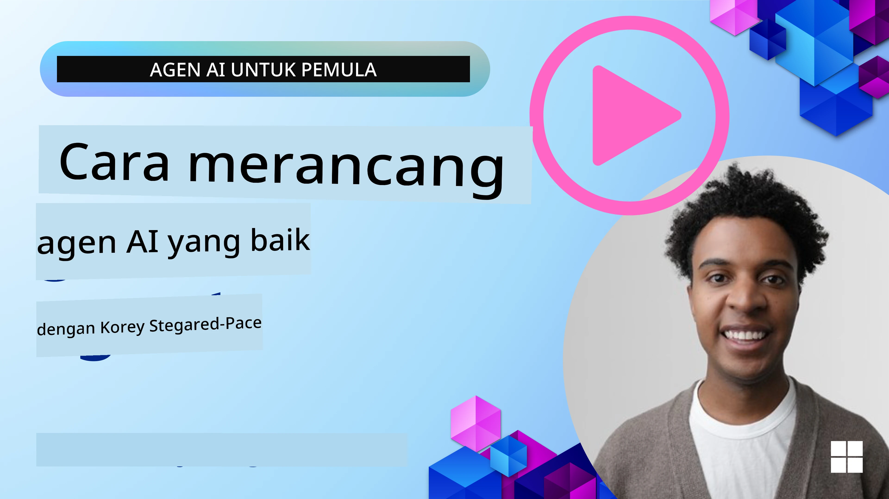
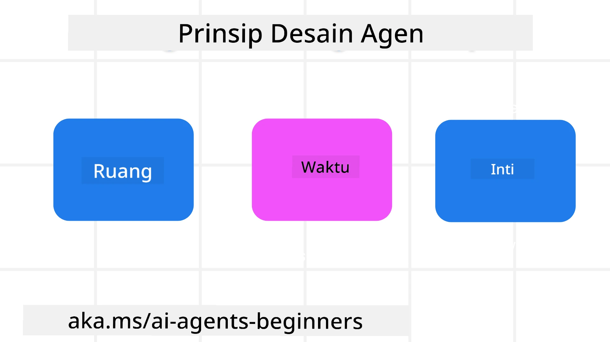

> _(Klik gambar di atas untuk menonton video pelajaran ini)_
# Prinsip Desain Agen AI

## Pendahuluan

Ada banyak cara untuk memikirkan pembangunan Sistem Agen AI. Mengingat ambiguitas adalah fitur dan bukan bug dalam desain AI Generatif, terkadang sulit bagi insinyur untuk menentukan dari mana harus memulai. Kami telah membuat seperangkat Prinsip Desain UX berfokus pada manusia untuk memungkinkan pengembang membangun sistem agen berorientasi pelanggan guna memenuhi kebutuhan bisnis mereka. Prinsip desain ini bukanlah arsitektur yang mengikat tapi lebih merupakan titik awal bagi tim yang sedang mendefinisikan dan membangun pengalaman agen.

Secara umum, agen harus:

- Memperluas dan meningkatkan kapasitas manusia (brainstorming, pemecahan masalah, otomatisasi, dll.)
- Mengisi kesenjangan pengetahuan (membantu saya memahami domain pengetahuan, terjemahan, dll.)
- Memfasilitasi dan mendukung kolaborasi dengan cara yang kita sebagai individu lebih suka dalam bekerja dengan orang lain
- Membuat kita menjadi versi terbaik dari diri kita (misalnya, pelatih hidup/pengatur tugas, membantu kita belajar pengaturan emosi dan keterampilan mindfulness, membangun ketahanan, dll.)

## Pelajaran Ini Akan Mencakup

- Apa itu Prinsip Desain Agen
- Beberapa pedoman yang harus diikuti saat menerapkan prinsip desain ini
- Contoh penggunaan prinsip desain tersebut

## Tujuan Pembelajaran

Setelah menyelesaikan pelajaran ini, Anda akan dapat:

1. Menjelaskan apa itu Prinsip Desain Agen
2. Menjelaskan pedoman penggunaan Prinsip Desain Agen
3. Memahami cara membangun agen menggunakan Prinsip Desain Agen

## Prinsip Desain Agen

### Agen (Ruang)

Ini adalah lingkungan di mana agen beroperasi. Prinsip-prinsip ini memandu bagaimana kita mendesain agen untuk terlibat dalam dunia fisik dan digital.

- **Menghubungkan, bukan meruntuhkan** – membantu menghubungkan orang dengan orang lain, acara, dan pengetahuan yang dapat ditindaklanjuti untuk memungkinkan kolaborasi dan koneksi.
- Agen membantu menghubungkan acara, pengetahuan, dan orang.
- Agen membawa orang lebih dekat bersama. Mereka tidak dirancang untuk menggantikan atau merendahkan orang.
- **Mudah diakses namun kadang tidak terlihat** – agen sebagian besar beroperasi di latar belakang dan hanya memberi dorongan saat relevan dan tepat.
  - Agen mudah ditemukan dan diakses oleh pengguna yang berwenang di perangkat atau platform apa pun.
  - Agen mendukung input dan output multimodal (suara, ucapan, teks, dll.).
  - Agen dapat beralih mulus antara latar depan dan latar belakang; antara proaktif dan reaktif, tergantung pada penginderaan kebutuhan pengguna.
  - Agen dapat beroperasi dalam bentuk tidak terlihat, namun jalur proses latar belakang dan kolaborasinya dengan Agen lain transparan dan dapat dikendalikan oleh pengguna.

### Agen (Waktu)

Ini adalah bagaimana agen beroperasi sepanjang waktu. Prinsip-prinsip ini memandu bagaimana kita mendesain agen yang berinteraksi melintasi masa lalu, sekarang, dan masa depan.

- **Masa lalu**: Mereflekasikan sejarah yang mencakup baik keadaan dan konteks.
  - Agen memberikan hasil yang lebih relevan berdasarkan analisis data historis yang lebih kaya dari sekadar kejadian, orang, atau keadaan saja.
  - Agen menciptakan koneksi dari peristiwa masa lalu dan aktif merefleksikan memori untuk terlibat dengan situasi saat ini.
- **Saat ini**: Memberi dorongan lebih dari sekadar pemberitahuan.
  - Agen mewujudkan pendekatan komprehensif dalam berinteraksi dengan orang. Ketika suatu peristiwa terjadi, Agen melampaui pemberitahuan statis atau formalitas statis lainnya. Agen dapat menyederhanakan alur atau menghasilkan petunjuk dinamis untuk menarik perhatian pengguna pada saat yang tepat.
  - Agen menyampaikan informasi berdasarkan lingkungan kontekstual, perubahan sosial dan budaya serta disesuaikan dengan maksud pengguna.
  - Interaksi Agen dapat berlangsung secara bertahap, berkembang/bertambah kompleks untuk memberdayakan pengguna dalam jangka panjang.
- **Masa depan**: Beradaptasi dan berkembang.
  - Agen beradaptasi dengan berbagai perangkat, platform, dan modalitas.
  - Agen beradaptasi dengan perilaku pengguna, kebutuhan aksesibilitas, dan dapat disesuaikan secara bebas.
  - Agen dibentuk oleh dan berkembang melalui interaksi pengguna yang berkelanjutan.

### Agen (Inti)

Ini adalah elemen kunci dalam inti desain agen.

- **Mengadopsi ketidakpastian tapi membangun kepercayaan**.
  - Tingkat ketidakpastian agen tertentu diharapkan. Ketidakpastian adalah elemen kunci desain agen.
  - Kepercayaan dan transparansi adalah lapisan dasar desain agen.
  - Manusia mengendalikan kapan Agen aktif/nonaktif dan status Agen selalu terlihat jelas.

## Pedoman untuk Menerapkan Prinsip Ini

Saat Anda menggunakan prinsip desain sebelumnya, gunakan pedoman berikut:

1. **Transparansi**: Beri tahu pengguna bahwa AI terlibat, bagaimana fungsinya (termasuk tindakan masa lalu), dan bagaimana memberikan umpan balik serta memodifikasi sistem.
2. **Kontrol**: Memungkinkan pengguna untuk menyesuaikan, menentukan preferensi dan personalisasi, serta memiliki kontrol atas sistem dan atributnya (termasuk kemampuan untuk melupakan).
3. **Konsistensi**: Usahakan pengalaman konsisten dan multimodal di berbagai perangkat dan titik akhir. Gunakan elemen UI/UX yang familiar jika memungkinkan (misalnya, ikon mikrofon untuk interaksi suara) dan kurangi beban kognitif pelanggan sebanyak mungkin (misalnya, respons singkat, bantuan visual, dan konten 'Pelajari Lebih Lanjut').

## Cara Mendesain Agen Perjalanan menggunakan Prinsip dan Pedoman Ini

Bayangkan Anda mendesain Agen Perjalanan, berikut cara Anda dapat mempertimbangkan penggunaan Prinsip dan Pedoman Desain:

1. **Transparansi** – Beri tahu pengguna bahwa Agen Perjalanan adalah Agen bertenaga AI. Berikan beberapa instruksi dasar untuk memulai (misalnya, pesan “Halo”, contoh perintah). Dokumentasikan dengan jelas di halaman produk. Tampilkan daftar perintah yang telah diajukan pengguna di masa lalu. Jelaskan dengan jelas cara memberikan umpan balik (jempol atas dan bawah, tombol Kirim Umpan Balik, dll.). Jelaskan dengan jelas jika Agen memiliki pembatasan penggunaan atau topik.
2. **Kontrol** – Pastikan jelas bagaimana pengguna dapat memodifikasi Agen setelah dibuat dengan hal-hal seperti Prompt Sistem. Memungkinkan pengguna memilih seberapa banyak Agen berbicara, gaya penulisannya, dan batasan apa pun tentang apa yang tidak boleh dibicarakan Agen. Izinkan pengguna melihat dan menghapus file atau data terkait, perintah, dan percakapan sebelumnya.
3. **Konsistensi** – Pastikan ikon untuk Bagikan Prompt, menambahkan file atau foto dan menandai seseorang atau sesuatu adalah standar dan mudah dikenali. Gunakan ikon penjepit kertas untuk menunjukkan unggah/berbagi file dengan Agen, dan ikon gambar untuk menunjukkan unggah grafik.

## Contoh Kode

- Python: [Agent Framework](./code_samples/03-python-agent-framework.ipynb)
- .NET: [Agent Framework](./code_samples/03-dotnet-agent-framework.md)

## Punya Pertanyaan Lebih Lanjut tentang Pola Desain Agen AI?

Bergabunglah dengan [Microsoft Foundry Discord](https://discord.com/invite/ATgtXmAS5D) untuk bertemu dengan pelajar lain, mengikuti jam kantor, dan mendapatkan jawaban tentang pertanyaan Agen AI Anda.

## Sumber Daya Tambahan

- <a href="https://openai.com" target="_blank">Praktik untuk Mengelola Sistem AI Agen | OpenAI</a>
- <a href="https://microsoft.com" target="_blank">Proyek Toolkit HAX - Microsoft Research</a>
- <a href="https://responsibleaitoolbox.ai" target="_blank">Kotak Alat AI Bertanggung Jawab</a>

## Pelajaran Sebelumnya

[Mengeksplorasi Kerangka Agen](../02-explore-agentic-frameworks/README.md)

## Pelajaran Berikutnya

[Pola Desain Penggunaan Alat](../04-tool-use/README.md)

---

<!-- CO-OP TRANSLATOR DISCLAIMER START -->
**Penafian**:
Dokumen ini telah diterjemahkan menggunakan layanan terjemahan AI [Co-op Translator](https://github.com/Azure/co-op-translator). Meskipun kami berupaya untuk mencapai akurasi, harap diketahui bahwa terjemahan otomatis mungkin mengandung kesalahan atau ketidakakuratan. Dokumen asli dalam bahasa aslinya harus dianggap sebagai sumber yang sah. Untuk informasi penting, disarankan menggunakan terjemahan profesional oleh manusia. Kami tidak bertanggung jawab atas kesalahpahaman atau penafsiran yang keliru yang timbul dari penggunaan terjemahan ini.
<!-- CO-OP TRANSLATOR DISCLAIMER END -->