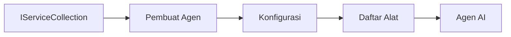

# 🎨 Pola Desain Agentic dengan Azure OpenAI (Responses API) (.NET)

## 📋 Tujuan Pembelajaran

Contoh ini menunjukkan pola desain kelas perusahaan untuk membangun agen cerdas menggunakan Microsoft Agent Framework di .NET dengan integrasi Azure OpenAI (Responses API). Anda akan belajar pola profesional dan pendekatan arsitektural yang membuat agen siap produksi, mudah dipelihara, dan dapat diskalakan.

### Pola Desain Perusahaan

- 🏭 **Factory Pattern**: Pembuatan agen yang standar dengan dependency injection
- 🔧 **Builder Pattern**: Konfigurasi dan setup agen secara fluent
- 🧵 **Thread-Safe Patterns**: Manajemen percakapan secara bersamaan
- 📋 **Repository Pattern**: Manajemen alat dan kapabilitas yang terorganisir

## 🎯 Manfaat Arsitektural Spesifik .NET

### Fitur Perusahaan

- **Strong Typing**: Validasi saat kompilasi dan dukungan IntelliSense
- **Dependency Injection**: Integrasi built-in container DI
- **Configuration Management**: Pola IConfiguration dan Options
- **Async/Await**: Dukungan pemrograman asynchronous kelas utama

### Pola Siap Produksi

- **Logging Integration**: Dukungan ILogger dan logging terstruktur
- **Health Checks**: Monitoring dan diagnostik bawaan
- **Configuration Validation**: Strong typing dengan anotasi data
- **Error Handling**: Manajemen exception terstruktur

## 🔧 Arsitektur Teknis

### Komponen Inti .NET

- **Microsoft.Extensions.AI**: Abstraksi layanan AI terpadu
- **Microsoft.Agents.AI**: Kerangka orkestrasi agen perusahaan
- **Azure OpenAI (Responses API)**: Pola klien API berperforma tinggi
- **Configuration System**: appsettings.json dan integrasi lingkungan

### Implementasi Pola Desain



## 🏗️ Pola Perusahaan yang Didemonstrasikan

### 1. **Pola Kreasi**

- **Agent Factory**: Pembuatan agen terpusat dengan konfigurasi konsisten
- **Builder Pattern**: API fluent untuk konfigurasi agen kompleks
- **Singleton Pattern**: Manajemen sumber daya dan konfigurasi bersama
- **Dependency Injection**: Kopling longgar dan dapat diuji

### 2. **Pola Perilaku**

- **Strategy Pattern**: Strategi eksekusi alat yang dapat dipertukarkan
- **Command Pattern**: Operasi agen yang dibungkus dengan undo/redo
- **Observer Pattern**: Manajemen siklus hidup agen berbasis event
- **Template Method**: Alur kerja eksekusi agen yang distandarkan

### 3. **Pola Struktural**

- **Adapter Pattern**: Lapisan integrasi Azure OpenAI (Responses API)
- **Decorator Pattern**: Peningkatan kapabilitas agen
- **Facade Pattern**: Antarmuka interaksi agen yang disederhanakan
- **Proxy Pattern**: Lazy loading dan caching untuk performa

## 📚 Prinsip Desain .NET

### Prinsip SOLID

- **Single Responsibility**: Setiap komponen memiliki satu tujuan jelas
- **Open/Closed**: Dapat diperluas tanpa modifikasi
- **Liskov Substitution**: Implementasi alat berbasis antarmuka
- **Interface Segregation**: Antarmuka yang terfokus dan kohesif
- **Dependency Inversion**: Bergantung pada abstraksi, bukan konkret

### Arsitektur Bersih

- **Domain Layer**: Abstraksi inti agen dan alat
- **Application Layer**: Orkestrasi agen dan alur kerja
- **Infrastructure Layer**: Integrasi Azure OpenAI (Responses API) dan layanan eksternal
- **Presentation Layer**: Interaksi pengguna dan pemformatan respons

## 🔒 Pertimbangan Perusahaan

### Keamanan

- **Manajemen Kredensial**: Penanganan API key yang aman dengan IConfiguration
- **Validasi Input**: Strong typing dan validasi anotasi data
- **Sanitasi Output**: Pemrosesan dan penyaringan respons yang aman
- **Audit Logging**: Pelacakan operasi yang komprehensif

### Performa

- **Pola Async**: Operasi I/O tanpa blokir
- **Connection Pooling**: Manajemen klien HTTP yang efisien
- **Caching**: Caching respons untuk peningkatan performa
- **Manajemen Sumber Daya**: Pola dispose dan pembersihan yang tepat

### Skalabilitas

- **Keamanan Thread**: Dukungan eksekusi agen bersamaan
- **Pooling Sumber Daya**: Pemanfaatan sumber daya yang efisien
- **Manajemen Beban**: Pembatasan laju dan penanganan backpressure
- **Monitoring**: Metrik performa dan pemeriksaan kesehatan

## 🚀 Deployment Produksi

- **Manajemen Konfigurasi**: Pengaturan spesifik lingkungan
- **Strategi Logging**: Logging terstruktur dengan ID korelasi
- **Penanganan Error**: Penanganan exception global dengan recovery tepat
- **Monitoring**: Application insights dan penghitung performa
- **Pengujian**: Tes unit, tes integrasi, dan pola load testing

Siap membangun agen cerdas kelas perusahaan dengan .NET? Mari arsitek sesuatu yang kuat! 🏢✨

## 🚀 Memulai

### Prasyarat

- [SDK .NET 10](https://dotnet.microsoft.com/download/dotnet/10.0) atau lebih tinggi
- Langganan [Azure](https://azure.microsoft.com/free/) dengan sumber daya Azure OpenAI dan deployment model
- [Azure CLI](https://learn.microsoft.com/cli/azure/install-azure-cli) — masuk dengan `az login`

### Variabel Lingkungan yang Diperlukan

```bash
# zsh/bash
export AZURE_OPENAI_ENDPOINT=https://<your-resource>.openai.azure.com
export AZURE_OPENAI_DEPLOYMENT=gpt-4o-mini
# Kemudian masuk agar AzureCliCredential dapat memperoleh token
az login
```

```powershell
# PowerShell
$env:AZURE_OPENAI_ENDPOINT = "https://<your-resource>.openai.azure.com"
$env:AZURE_OPENAI_DEPLOYMENT = "gpt-4o-mini"
# Kemudian masuk agar AzureCliCredential dapat mendapatkan token
az login
```

### Contoh Kode

Untuk menjalankan contoh kode,

```bash
# zsh/bash
chmod +x ./03-dotnet-agent-framework.cs
./03-dotnet-agent-framework.cs
```

Atau menggunakan dotnet CLI:

```bash
dotnet run ./03-dotnet-agent-framework.cs
```

Lihat [`03-dotnet-agent-framework.cs`](../../../../03-agentic-design-patterns/code_samples/03-dotnet-agent-framework.cs) untuk kode lengkap.

```csharp
#!/usr/bin/dotnet run

#:package Microsoft.Extensions.AI@10.*
#:package Microsoft.Agents.AI.OpenAI@1.*-*
#:package Azure.AI.OpenAI@2.1.0
#:package Azure.Identity@1.13.1

using System.ComponentModel;

using Microsoft.Agents.AI;
using Microsoft.Extensions.AI;

using Azure.AI.OpenAI;
using Azure.Identity;

// Tool Function: Random Destination Generator
// This static method will be available to the agent as a callable tool
// The [Description] attribute helps the AI understand when to use this function
// This demonstrates how to create custom tools for AI agents
[Description("Provides a random vacation destination.")]
static string GetRandomDestination()
{
    // List of popular vacation destinations around the world
    // The agent will randomly select from these options
    var destinations = new List<string>
    {
        "Paris, France",
        "Tokyo, Japan",
        "New York City, USA",
        "Sydney, Australia",
        "Rome, Italy",
        "Barcelona, Spain",
        "Cape Town, South Africa",
        "Rio de Janeiro, Brazil",
        "Bangkok, Thailand",
        "Vancouver, Canada"
    };

    // Generate random index and return selected destination
    // Uses System.Random for simple random selection
    var random = new Random();
    int index = random.Next(destinations.Count);
    return destinations[index];
}

// Azure OpenAI with the Responses API (stable v1 endpoint). Sign in with `az login`.
var azureEndpoint = Environment.GetEnvironmentVariable("AZURE_OPENAI_ENDPOINT")
    ?? throw new InvalidOperationException("AZURE_OPENAI_ENDPOINT is not set.");
var deployment = Environment.GetEnvironmentVariable("AZURE_OPENAI_DEPLOYMENT") ?? "gpt-4o-mini";

var azureClient = new AzureOpenAIClient(new Uri(azureEndpoint), new AzureCliCredential());

// Define Agent Identity and Comprehensive Instructions
// Agent name for identification and logging purposes
var AGENT_NAME = "TravelAgent";

// Detailed instructions that define the agent's personality, capabilities, and behavior
// This system prompt shapes how the agent responds and interacts with users
var AGENT_INSTRUCTIONS = """
You are a helpful AI Agent that can help plan vacations for customers.

Important: When users specify a destination, always plan for that location. Only suggest random destinations when the user hasn't specified a preference.

When the conversation begins, introduce yourself with this message:
"Hello! I'm your TravelAgent assistant. I can help plan vacations and suggest interesting destinations for you. Here are some things you can ask me:
1. Plan a day trip to a specific location
2. Suggest a random vacation destination
3. Find destinations with specific features (beaches, mountains, historical sites, etc.)
4. Plan an alternative trip if you don't like my first suggestion

What kind of trip would you like me to help you plan today?"

Always prioritize user preferences. If they mention a specific destination like "Bali" or "Paris," focus your planning on that location rather than suggesting alternatives.
""";

// Create AI Agent with Advanced Travel Planning Capabilities
// Get the Responses client for the deployment and create the AI agent
// Configure agent with name, detailed instructions, and available tools
// This demonstrates the .NET agent creation pattern with full configuration
AIAgent agent = azureClient
    .GetOpenAIResponseClient(deployment)
    .CreateAIAgent(
        name: AGENT_NAME,
        instructions: AGENT_INSTRUCTIONS,
        tools: [AIFunctionFactory.Create(GetRandomDestination)]
    );

// Create New Conversation Thread for Context Management
// Initialize a new conversation thread to maintain context across multiple interactions
// Threads enable the agent to remember previous exchanges and maintain conversational state
// This is essential for multi-turn conversations and contextual understanding
AgentThread thread = agent.GetNewThread();

// Execute Agent: First Travel Planning Request
// Run the agent with an initial request that will likely trigger the random destination tool
// The agent will analyze the request, use the GetRandomDestination tool, and create an itinerary
// Using the thread parameter maintains conversation context for subsequent interactions
await foreach (var update in agent.RunStreamingAsync("Plan me a day trip", thread))
{
    await Task.Delay(10);
    Console.Write(update);
}

Console.WriteLine();

// Execute Agent: Follow-up Request with Context Awareness
// Demonstrate contextual conversation by referencing the previous response
// The agent remembers the previous destination suggestion and will provide an alternative
// This showcases the power of conversation threads and contextual understanding in .NET agents
await foreach (var update in agent.RunStreamingAsync("I don't like that destination. Plan me another vacation.", thread))
{
    await Task.Delay(10);
    Console.Write(update);
}
```

---

<!-- CO-OP TRANSLATOR DISCLAIMER START -->
**Penafian**:
Dokumen ini telah diterjemahkan menggunakan layanan terjemahan AI [Co-op Translator](https://github.com/Azure/co-op-translator). Meskipun kami berupaya untuk mencapai akurasi, harap diketahui bahwa terjemahan otomatis mungkin mengandung kesalahan atau ketidakakuratan. Dokumen asli dalam bahasa aslinya harus dianggap sebagai sumber yang sah. Untuk informasi penting, disarankan menggunakan terjemahan profesional oleh manusia. Kami tidak bertanggung jawab atas kesalahpahaman atau penafsiran yang keliru yang timbul dari penggunaan terjemahan ini.
<!-- CO-OP TRANSLATOR DISCLAIMER END -->