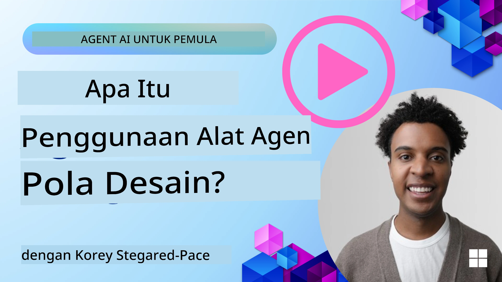
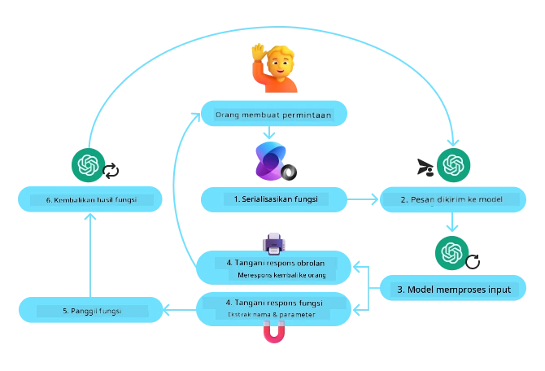
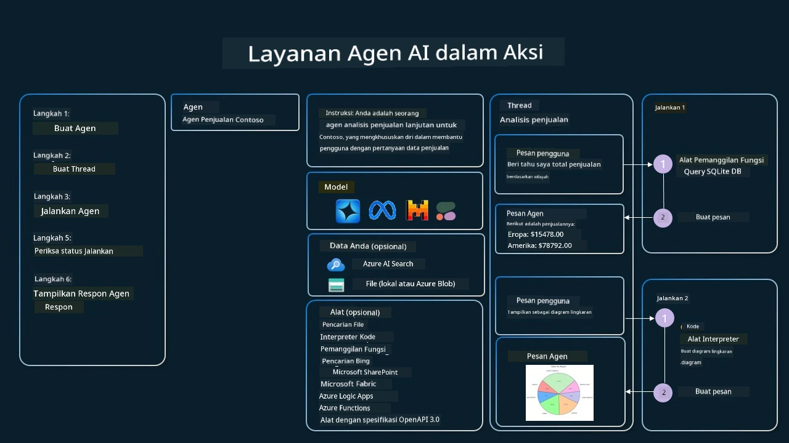

[](https://youtu.be/vieRiPRx-gI?si=cEZ8ApnT6Sus9rhn)

> _(Klik gambar di atas untuk melihat video pelajaran ini)_

# Pola Desain Penggunaan Alat

Alat menarik karena mereka memungkinkan agen AI memiliki cakupan kemampuan yang lebih luas. Alih-alih agen memiliki sekumpulan tindakan terbatas yang dapat dilakukan, dengan menambahkan alat, agen kini dapat melakukan berbagai tindakan. Dalam bab ini, kita akan melihat Pola Desain Penggunaan Alat, yang menjelaskan bagaimana agen AI dapat menggunakan alat tertentu untuk mencapai tujuan mereka.

## Pendahuluan

Dalam pelajaran ini, kita akan menjawab pertanyaan-pertanyaan berikut:

- Apa itu pola desain penggunaan alat?
- Dalam kasus penggunaan apa saja pola ini dapat diterapkan?
- Apa saja elemen/blok bangunan yang dibutuhkan untuk mengimplementasikan pola desain ini?
- Apa pertimbangan khusus untuk menggunakan Pola Desain Penggunaan Alat dalam membangun agen AI yang dapat dipercaya?

## Tujuan Pembelajaran

Setelah menyelesaikan pelajaran ini, Anda akan mampu:

- Mendefinisikan Pola Desain Penggunaan Alat dan tujuannya.
- Mengidentifikasi kasus penggunaan di mana Pola Desain Penggunaan Alat dapat diterapkan.
- Memahami elemen kunci yang dibutuhkan untuk mengimplementasikan pola desain ini.
- Mengenali pertimbangan untuk memastikan kepercayaan dalam agen AI yang menggunakan pola desain ini.

## Apa itu Pola Desain Penggunaan Alat?

**Pola Desain Penggunaan Alat** berfokus pada memberikan kemampuan kepada LLM untuk berinteraksi dengan alat eksternal guna mencapai tujuan tertentu. Alat adalah kode yang dapat dijalankan oleh agen untuk melakukan tindakan. Sebuah alat bisa berupa fungsi sederhana seperti kalkulator, atau panggilan API ke layanan pihak ketiga seperti pencarian harga saham atau prakiraan cuaca. Dalam konteks agen AI, alat dirancang untuk dijalankan oleh agen sebagai respons terhadap **panggilan fungsi yang dihasilkan model**.

## Dalam kasus penggunaan apa saja pola ini dapat diterapkan?

Agen AI dapat memanfaatkan alat untuk menyelesaikan tugas kompleks, mengambil informasi, atau membuat keputusan. Pola desain penggunaan alat sering digunakan dalam skenario yang memerlukan interaksi dinamis dengan sistem eksternal, seperti basis data, layanan web, atau interpreter kode. Kemampuan ini berguna untuk berbagai kasus penggunaan berikut:

- **Pengambilan Informasi Dinamis:** Agen dapat menanyakan API eksternal atau basis data untuk mengambil data terbaru (misalnya, menanyakan basis data SQLite untuk analisis data, mengambil harga saham atau informasi cuaca).
- **Eksekusi dan Interpretasi Kode:** Agen dapat menjalankan kode atau skrip untuk memecahkan masalah matematika, membuat laporan, atau melakukan simulasi.
- **Otomatisasi Alur Kerja:** Mengotomatisasi alur kerja yang berulang atau multi-langkah dengan mengintegrasikan alat seperti penjadwal tugas, layanan email, atau pipeline data.
- **Dukungan Pelanggan:** Agen dapat berinteraksi dengan sistem CRM, platform tiket, atau basis pengetahuan untuk menyelesaikan pertanyaan pengguna.
- **Pembuatan dan Pengeditan Konten:** Agen dapat memanfaatkan alat seperti pemeriksa tata bahasa, peringkas teks, atau evaluator keamanan konten untuk membantu tugas pembuatan konten.

## Apa saja elemen/blok bangunan yang dibutuhkan untuk mengimplementasikan pola desain penggunaan alat?

Blok bangunan ini memungkinkan agen AI melakukan banyak tugas. Mari kita lihat elemen kunci yang dibutuhkan untuk mengimplementasikan Pola Desain Penggunaan Alat:

- **Skema Fungsi/Alat**: Definisi rinci alat yang tersedia, termasuk nama fungsi, tujuan, parameter yang dibutuhkan, dan output yang diharapkan. Skema ini memungkinkan LLM memahami alat apa yang tersedia dan bagaimana merangkai permintaan yang valid.

- **Logika Eksekusi Fungsi**: Mengatur bagaimana dan kapan alat dipanggil berdasarkan niat pengguna dan konteks percakapan. Ini bisa mencakup modul perencana, mekanisme pengarah, atau alur kondisional yang menentukan penggunaan alat secara dinamis.

- **Sistem Penanganan Pesan**: Komponen yang mengelola alur percakapan antara input pengguna, respons LLM, panggilan alat, dan output alat.

- **Kerangka Integrasi Alat**: Infrastruktur yang menghubungkan agen ke berbagai alat, baik itu fungsi sederhana atau layanan eksternal yang kompleks.

- **Penanganan Kesalahan & Validasi**: Mekanisme untuk menangani kegagalan dalam eksekusi alat, memvalidasi parameter, dan mengelola respons yang tak terduga.

- **Manajemen Status**: Melacak konteks percakapan, interaksi alat sebelumnya, dan data persistensi agar konsistensi terjaga dalam interaksi multi-putaran.

Selanjutnya, mari kita lihat lebih detail tentang Pemanggilan Fungsi/Alat.
 
### Pemanggilan Fungsi/Alat

Pemanggilan fungsi adalah cara utama kita memungkinkan Model Bahasa Besar (LLM) berinteraksi dengan alat. Anda sering akan melihat 'Fungsi' dan 'Alat' digunakan secara bergantian karena 'fungsi' (blok kode yang dapat digunakan ulang) adalah 'alat' yang digunakan agen untuk menjalankan tugas. Agar kode fungsi dapat dipanggil, LLM harus membandingkan permintaan pengguna dengan deskripsi fungsi. Untuk ini, sebuah skema yang berisi deskripsi semua fungsi yang tersedia dikirim ke LLM. LLM kemudian memilih fungsi yang paling tepat untuk tugas tersebut dan mengembalikan nama serta argumennya. Fungsi yang dipilih dijalankan, responsnya dikirim kembali ke LLM, yang menggunakan informasi tersebut untuk menjawab permintaan pengguna.

Untuk pengembang mengimplementasikan pemanggilan fungsi untuk agen, Anda akan memerlukan:

1. Model LLM yang mendukung pemanggilan fungsi  
2. Skema yang berisi deskripsi fungsi  
3. Kode untuk setiap fungsi yang dideskripsikan  

Mari kita gunakan contoh mendapatkan waktu saat ini di sebuah kota untuk mengilustrasikan:

1. **Inisialisasi LLM yang mendukung pemanggilan fungsi:**

    Tidak semua model mendukung pemanggilan fungsi, jadi penting untuk memeriksa apakah LLM yang Anda gunakan mendukungnya. <a href="https://learn.microsoft.com/azure/ai-services/openai/how-to/function-calling" target="_blank">Azure OpenAI</a> mendukung pemanggilan fungsi. Kita dapat mulai dengan menginisialisasi klien Azure OpenAI. 

    ```python
    # Inisialisasi klien Azure OpenAI
    client = AzureOpenAI(
        azure_endpoint = os.getenv("AZURE_AI_PROJECT_ENDPOINT"), 
        api_key=os.getenv("AZURE_OPENAI_API_KEY"),  
        api_version="2024-05-01-preview"
    )
    ```

1. **Membuat Skema Fungsi**:

    Selanjutnya kita akan mendefinisikan skema JSON yang berisi nama fungsi, deskripsi tentang apa yang dilakukan fungsi, dan nama serta deskripsi parameter fungsi.  
    Kita kemudian mengirim skema ini ke klien yang sudah dibuat sebelumnya, bersama dengan permintaan pengguna untuk mengetahui waktu di San Francisco. Yang perlu diperhatikan adalah bahwa **panggilan alat** adalah yang dikembalikan, **bukan** jawaban akhir dari pertanyaan tersebut. Seperti disebut sebelumnya, LLM mengembalikan nama fungsi yang dipilih untuk tugas itu, dan argumen yang akan diteruskan ke fungsi tersebut.

    ```python
    # Deskripsi fungsi untuk model agar dapat membaca
    tools = [
        {
            "type": "function",
            "function": {
                "name": "get_current_time",
                "description": "Get the current time in a given location",
                "parameters": {
                    "type": "object",
                    "properties": {
                        "location": {
                            "type": "string",
                            "description": "The city name, e.g. San Francisco",
                        },
                    },
                    "required": ["location"],
                },
            }
        }
    ]
    ```
   
    ```python
  
    # Pesan pengguna awal
    messages = [{"role": "user", "content": "What's the current time in San Francisco"}] 
  
    # Panggilan API pertama: Minta model menggunakan fungsi
      response = client.chat.completions.create(
          model=deployment_name,
          messages=messages,
          tools=tools,
          tool_choice="auto",
      )
  
      # Memproses respons model
      response_message = response.choices[0].message
      messages.append(response_message)
  
      print("Model's response:")  

      print(response_message)
  
    ```

    ```bash
    Model's response:
    ChatCompletionMessage(content=None, role='assistant', function_call=None, tool_calls=[ChatCompletionMessageToolCall(id='call_pOsKdUlqvdyttYB67MOj434b', function=Function(arguments='{"location":"San Francisco"}', name='get_current_time'), type='function')])
    ```
  
1. **Kode fungsi yang diperlukan untuk menjalankan tugas:**

    Setelah LLM memilih fungsi mana yang perlu dijalankan, kode yang menjalankan tugas tersebut perlu diimplementasikan dan dieksekusi.  
    Kita dapat mengimplementasikan kode untuk mendapatkan waktu saat ini dalam Python. Kita juga perlu menulis kode untuk mengekstrak nama dan argumen dari response_message untuk mendapatkan hasil akhir.

    ```python
      def get_current_time(location):
        """Get the current time for a given location"""
        print(f"get_current_time called with location: {location}")  
        location_lower = location.lower()
        
        for key, timezone in TIMEZONE_DATA.items():
            if key in location_lower:
                print(f"Timezone found for {key}")  
                current_time = datetime.now(ZoneInfo(timezone)).strftime("%I:%M %p")
                return json.dumps({
                    "location": location,
                    "current_time": current_time
                })
      
        print(f"No timezone data found for {location_lower}")  
        return json.dumps({"location": location, "current_time": "unknown"})
    ```

     ```python
     # Menangani panggilan fungsi
      if response_message.tool_calls:
          for tool_call in response_message.tool_calls:
              if tool_call.function.name == "get_current_time":
     
                  function_args = json.loads(tool_call.function.arguments)
     
                  time_response = get_current_time(
                      location=function_args.get("location")
                  )
     
                  messages.append({
                      "tool_call_id": tool_call.id,
                      "role": "tool",
                      "name": "get_current_time",
                      "content": time_response,
                  })
      else:
          print("No tool calls were made by the model.")  
  
      # Panggilan API kedua: Dapatkan respons akhir dari model
      final_response = client.chat.completions.create(
          model=deployment_name,
          messages=messages,
      )
  
      return final_response.choices[0].message.content
     ```

     ```bash
      get_current_time called with location: San Francisco
      Timezone found for san francisco
      The current time in San Francisco is 09:24 AM.
     ```

Pemanggilan Fungsi adalah inti dari sebagian besar, jika tidak semua, desain penggunaan alat agen, namun mengimplementasikannya dari nol terkadang bisa menantang.  
Seperti yang kita pelajari di [Pelajaran 2](../../../02-explore-agentic-frameworks) kerangka kerja agentic menyediakan blok bangunan yang sudah dibuat sebelumnya untuk mengimplementasikan penggunaan alat.
 
## Contoh Penggunaan Alat dengan Kerangka Kerja Agentic

Berikut adalah beberapa contoh bagaimana Anda dapat mengimplementasikan Pola Desain Penggunaan Alat menggunakan berbagai kerangka kerja agentic:

### Microsoft Agent Framework

<a href="https://learn.microsoft.com/azure/ai-services/agents/overview" target="_blank">Microsoft Agent Framework</a> adalah kerangka kerja AI open-source untuk membangun agen AI. Kerangka ini menyederhanakan proses penggunaan pemanggilan fungsi dengan memungkinkan Anda mendefinisikan alat sebagai fungsi Python dengan dekorator `@tool`. Kerangka ini menangani komunikasi bolak-balik antara model dan kode Anda. Ia juga menyediakan akses ke alat yang sudah dibangun seperti Pencarian File dan Interpreter Kode melalui `AzureAIProjectAgentProvider`.

Diagram berikut menggambarkan proses pemanggilan fungsi dengan Microsoft Agent Framework:



Dalam Microsoft Agent Framework, alat didefinisikan sebagai fungsi yang didekorasi. Kita dapat mengubah fungsi `get_current_time` yang sebelumnya kita lihat menjadi alat dengan menggunakan dekorator `@tool`. Kerangka akan secara otomatis menyerialisasi fungsi dan parameternya, membuat skema untuk dikirim ke LLM.

```python
from agent_framework import tool
from agent_framework.azure import AzureAIProjectAgentProvider
from azure.identity import AzureCliCredential

@tool
def get_current_time(location: str) -> str:
    """Get the current time for a given location"""
    ...

# Buat klien
provider = AzureAIProjectAgentProvider(credential=AzureCliCredential())

# Buat agen dan jalankan dengan alat
agent = await provider.create_agent(name="TimeAgent", instructions="Use available tools to answer questions.", tools=get_current_time)
response = await agent.run("What time is it?")
```
  
### Azure AI Agent Service

<a href="https://learn.microsoft.com/azure/ai-services/agents/overview" target="_blank">Azure AI Agent Service</a> adalah kerangka kerja agentic yang lebih baru yang dirancang untuk memberdayakan pengembang membangun, menyebarkan, dan mengskalakan agen AI berkualitas tinggi serta dapat diperluas dengan aman tanpa perlu mengelola sumber daya komputasi dan penyimpanan yang mendasarinya. Ini sangat berguna untuk aplikasi perusahaan karena merupakan layanan yang dikelola penuh dengan keamanan tingkat perusahaan.

Jika dibandingkan dengan pengembangan menggunakan API LLM secara langsung, Azure AI Agent Service memberikan beberapa keuntungan, termasuk:

- Pemanggilan alat otomatis – tidak perlu mengurai panggilan alat, memanggil alat, dan menangani respons; semua ini sekarang dilakukan di sisi server  
- Data yang dikelola dengan aman – alih-alih mengelola status percakapan sendiri, Anda dapat mengandalkan thread untuk menyimpan semua informasi yang Anda butuhkan  
- Alat bawaannya – alat yang dapat Anda gunakan untuk berinteraksi dengan sumber data Anda, seperti Bing, Azure AI Search, dan Azure Functions.

Alat yang tersedia di Azure AI Agent Service dapat dibagi menjadi dua kategori:

1. Alat Pengetahuan:  
    - <a href="https://learn.microsoft.com/azure/ai-services/agents/how-to/tools/bing-grounding?tabs=python&pivots=overview" target="_blank">Grounding dengan Bing Search</a>  
    - <a href="https://learn.microsoft.com/azure/ai-services/agents/how-to/tools/file-search?tabs=python&pivots=overview" target="_blank">Pencarian File</a>  
    - <a href="https://learn.microsoft.com/azure/ai-services/agents/how-to/tools/azure-ai-search?tabs=azurecli%2Cpython&pivots=overview-azure-ai-search" target="_blank">Azure AI Search</a>

2. Alat Aksi:  
    - <a href="https://learn.microsoft.com/azure/ai-services/agents/how-to/tools/function-calling?tabs=python&pivots=overview" target="_blank">Pemanggilan Fungsi</a>  
    - <a href="https://learn.microsoft.com/azure/ai-services/agents/how-to/tools/code-interpreter?tabs=python&pivots=overview" target="_blank">Interpreter Kode</a>  
    - <a href="https://learn.microsoft.com/azure/ai-services/agents/how-to/tools/openapi-spec?tabs=python&pivots=overview" target="_blank">Alat yang didefinisikan OpenAPI</a>  
    - <a href="https://learn.microsoft.com/azure/ai-services/agents/how-to/tools/azure-functions?pivots=overview" target="_blank">Azure Functions</a>

Layanan Agen memungkinkan kita menggunakan alat ini bersama sebagai sebuah `toolset`. Ini juga memanfaatkan `threads` yang melacak riwayat pesan dari percakapan tertentu.

Bayangkan Anda adalah agen penjualan di perusahaan bernama Contoso. Anda ingin mengembangkan agen percakapan yang dapat menjawab pertanyaan tentang data penjualan Anda.

Gambar berikut menggambarkan bagaimana Anda dapat menggunakan Azure AI Agent Service untuk menganalisis data penjualan Anda:



Untuk menggunakan alat-alat ini dengan layanan tersebut kita dapat membuat klien dan mendefinisikan sebuah alat atau toolset. Untuk mengimplementasikan ini secara praktis kita dapat menggunakan kode Python berikut. LLM akan dapat melihat toolset tersebut dan memutuskan apakah menggunakan fungsi yang dibuat pengguna, `fetch_sales_data_using_sqlite_query`, atau Interpreter Kode bawaan tergantung pada permintaan pengguna.

```python 
import os
from azure.ai.projects import AIProjectClient
from azure.identity import DefaultAzureCredential
from fetch_sales_data_functions import fetch_sales_data_using_sqlite_query # fungsi fetch_sales_data_using_sqlite_query yang dapat ditemukan di file fetch_sales_data_functions.py.
from azure.ai.projects.models import ToolSet, FunctionTool, CodeInterpreterTool

project_client = AIProjectClient.from_connection_string(
    credential=DefaultAzureCredential(),
    conn_str=os.environ["PROJECT_CONNECTION_STRING"],
)

# Inisialisasi set alat
toolset = ToolSet()

# Inisialisasi agen pemanggilan fungsi dengan fungsi fetch_sales_data_using_sqlite_query dan menambahkannya ke set alat
fetch_data_function = FunctionTool(fetch_sales_data_using_sqlite_query)
toolset.add(fetch_data_function)

# Inisialisasi alat Interpreter Kode dan menambahkannya ke set alat.
code_interpreter = code_interpreter = CodeInterpreterTool()
toolset.add(code_interpreter)

agent = project_client.agents.create_agent(
    model="gpt-4o-mini", name="my-agent", instructions="You are helpful agent", 
    toolset=toolset
)
```

## Apa pertimbangan khusus untuk menggunakan Pola Desain Penggunaan Alat dalam membangun agen AI yang dapat dipercaya?

Kekhawatiran umum dengan SQL yang dihasilkan secara dinamis oleh LLM adalah keamanan, khususnya risiko injeksi SQL atau tindakan jahat, seperti penghapusan atau pengubahan basis data. Meskipun kekhawatiran ini valid, mereka dapat diatasi secara efektif dengan konfigurasi izin akses basis data yang tepat. Untuk sebagian besar basis data ini melibatkan pengaturan basis data sebagai read-only. Untuk layanan basis data seperti PostgreSQL atau Azure SQL, aplikasi harus diberikan peran read-only (SELECT).

Menjalankan aplikasi di lingkungan yang aman lebih meningkatkan perlindungan. Dalam skenario perusahaan, data biasanya diekstraksi dan diubah dari sistem operasional ke dalam basis data atau gudang data read-only dengan skema yang ramah pengguna. Pendekatan ini memastikan data aman, dioptimalkan untuk performa dan aksesibilitas, serta aplikasi memiliki akses terbatas dan hanya untuk baca.

## Kode Contoh

- Python: [Agent Framework](./code_samples/04-python-agent-framework.ipynb)
- .NET: [Agent Framework](./code_samples/04-dotnet-agent-framework.md)

## Punya Pertanyaan Lebih Lanjut tentang Pola Desain Penggunaan Alat?

Bergabunglah dengan [Microsoft Foundry Discord](https://aka.ms/ai-agents/discord) untuk bertemu dengan pelajar lain, mengikuti office hours, dan mendapatkan jawaban untuk pertanyaan Anda tentang Agen AI.

## Sumber Daya Tambahan

- <a href="https://microsoft.github.io/build-your-first-agent-with-azure-ai-agent-service-workshop/" target="_blank">Workshop Azure AI Agents Service</a>  
- <a href="https://github.com/Azure-Samples/contoso-creative-writer/tree/main/docs/workshop" target="_blank">Workshop Contoso Creative Writer Multi-Agent</a>  
- <a href="https://learn.microsoft.com/azure/ai-services/agents/overview" target="_blank">Ikhtisar Microsoft Agent Framework</a>

## Pelajaran Sebelumnya

[Memahami Pola Desain Agentic](../03-agentic-design-patterns/README.md)

## Pelajaran Selanjutnya
[Agentic RAG](../05-agentic-rag/README.md)

---

<!-- CO-OP TRANSLATOR DISCLAIMER START -->
**Penafian**:  
Dokumen ini telah diterjemahkan menggunakan layanan terjemahan AI [Co-op Translator](https://github.com/Azure/co-op-translator). Meskipun kami berusaha untuk ketepatan, harap maklum bahwa terjemahan otomatis mungkin mengandung kesalahan atau ketidakakuratan. Dokumen asli dalam bahasa aslinya harus dianggap sebagai sumber yang sah dan utama. Untuk informasi penting, disarankan menggunakan terjemahan profesional oleh penerjemah manusia. Kami tidak bertanggung jawab atas kesalahpahaman atau penafsiran yang keliru yang timbul dari penggunaan terjemahan ini.
<!-- CO-OP TRANSLATOR DISCLAIMER END -->