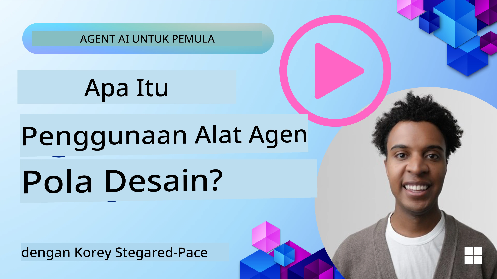
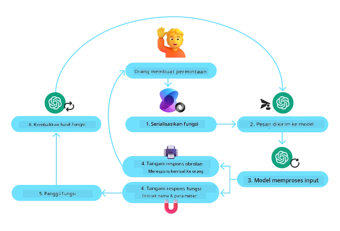
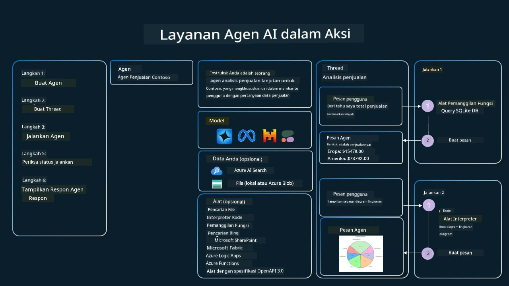

[](https://youtu.be/vieRiPRx-gI?si=cEZ8ApnT6Sus9rhn)

> _(Klik gambar di atas untuk menonton video pelajaran ini)_

# Pola Desain Penggunaan Alat

Alat menarik karena memungkinkan agen AI memiliki jangkauan kemampuan yang lebih luas. Alih-alih agen hanya memiliki satu set tindakan terbatas yang dapat dilakukan, dengan menambahkan alat, agen kini dapat melakukan berbagai tindakan. Dalam bab ini, kita akan melihat Pola Desain Penggunaan Alat, yang menjelaskan bagaimana agen AI dapat menggunakan alat tertentu untuk mencapai tujuan mereka.

## Pengantar

Dalam pelajaran ini, kami akan mencari jawaban atas pertanyaan berikut:

- Apa itu pola desain penggunaan alat?
- Apa kasus penggunaan yang dapat diterapkan?
- Apa elemen/blok bangunan yang dibutuhkan untuk mengimplementasikan pola desain ini?
- Apa pertimbangan khusus dalam menggunakan Pola Desain Penggunaan Alat untuk membangun agen AI yang dapat dipercaya?

## Tujuan Pembelajaran

Setelah menyelesaikan pelajaran ini, Anda akan dapat:

- Mendefinisikan Pola Desain Penggunaan Alat dan tujuannya.
- Mengidentifikasi kasus penggunaan di mana Pola Desain Penggunaan Alat dapat diterapkan.
- Memahami elemen utama yang diperlukan untuk mengimplementasikan pola desain ini.
- Mengenali pertimbangan untuk memastikan kepercayaan pada agen AI yang menggunakan pola desain ini.

## Apa itu Pola Desain Penggunaan Alat?

**Pola Desain Penggunaan Alat** berfokus pada memberikan kemampuan kepada LLM untuk berinteraksi dengan alat eksternal guna mencapai tujuan tertentu. Alat adalah kode yang dapat dijalankan oleh agen untuk melakukan tindakan. Sebuah alat bisa berupa fungsi sederhana seperti kalkulator, atau panggilan API ke layanan pihak ketiga seperti pencarian harga saham atau prakiraan cuaca. Dalam konteks agen AI, alat dirancang untuk dijalankan oleh agen sebagai respons terhadap **panggilan fungsi yang dihasilkan model**.

## Apa kasus penggunaan yang dapat diterapkan?

Agen AI dapat memanfaatkan alat untuk menyelesaikan tugas kompleks, mengambil informasi, atau membuat keputusan. Pola desain penggunaan alat sering digunakan dalam skenario yang memerlukan interaksi dinamis dengan sistem eksternal, seperti basis data, layanan web, atau interpreter kode. Kemampuan ini berguna untuk berbagai kasus penggunaan, termasuk:

- **Pengambilan Informasi Dinamis:** Agen bisa mengakses API eksternal atau basis data untuk mengambil data terkini (misalnya, mengakses database SQLite untuk analisis data, mengambil harga saham atau informasi cuaca).
- **Eksekusi dan Interpretasi Kode:** Agen dapat menjalankan kode atau skrip untuk menyelesaikan masalah matematika, menghasilkan laporan, atau melakukan simulasi.
- **Otomatisasi Alur Kerja:** Mengotomatisasi alur kerja berulang atau multi-langkah dengan mengintegrasikan alat seperti penjadwal tugas, layanan email, atau pipeline data.
- **Dukungan Pelanggan:** Agen dapat berinteraksi dengan sistem CRM, platform tiket, atau basis pengetahuan untuk menyelesaikan pertanyaan pengguna.
- **Pembuatan dan Penyuntingan Konten:** Agen dapat menggunakan alat seperti pemeriksa tata bahasa, peringkas teks, atau evaluator keamanan konten untuk membantu tugas pembuatan konten.

## Apa elemen/blok bangunan yang dibutuhkan untuk mengimplementasikan pola desain penggunaan alat?

Blok bangunan ini memungkinkan agen AI menjalankan berbagai tugas. Mari kita lihat elemen kunci yang dibutuhkan untuk mengimplementasikan Pola Desain Penggunaan Alat:

- **Skema Fungsi/Alat**: Definisi rinci dari alat yang tersedia, termasuk nama fungsi, tujuan, parameter yang dibutuhkan, dan keluaran yang diharapkan. Skema ini memungkinkan LLM memahami alat yang tersedia dan bagaimana menyusun permintaan yang valid.

- **Logika Eksekusi Fungsi**: Mengatur bagaimana dan kapan alat dipanggil berdasarkan niat pengguna dan konteks percakapan. Ini bisa mencakup modul perencana, mekanisme routing, atau alur kondisional yang menentukan penggunaan alat secara dinamis.

- **Sistem Penanganan Pesan**: Komponen yang mengelola alur percakapan antara masukan pengguna, respon LLM, panggilan alat, dan keluaran alat.

- **Kerangka Integrasi Alat**: Infrastruktur yang menghubungkan agen dengan berbagai alat, baik itu fungsi sederhana atau layanan eksternal yang kompleks.

- **Penanganan dan Validasi Kesalahan**: Mekanisme untuk menangani kegagalan dalam eksekusi alat, memvalidasi parameter, dan mengelola respon tak terduga.

- **Manajemen Status**: Melacak konteks percakapan, interaksi alat sebelumnya, dan data persisten untuk memastikan konsistensi di seluruh interaksi multi-gilir.

Selanjutnya, mari kita lihat Panggilan Fungsi/Alat secara lebih rinci.
 
### Panggilan Fungsi/Alat

Panggilan fungsi adalah cara utama kita memungkinkan Large Language Models (LLM) berinteraksi dengan alat. Anda sering melihat 'Fungsi' dan 'Alat' digunakan secara bergantian karena 'fungsi' (blok kode yang dapat digunakan ulang) adalah 'alat' yang digunakan agen untuk menjalankan tugas. Agar kode fungsi dapat dipanggil, LLM harus membandingkan permintaan pengguna dengan deskripsi fungsi. Untuk ini, sebuah skema yang berisi deskripsi semua fungsi yang tersedia dikirim ke LLM. LLM kemudian memilih fungsi yang paling sesuai untuk tugas tersebut dan mengembalikan nama serta argumennya. Fungsi yang dipilih dipanggil, responnya dikirim kembali ke LLM, yang menggunakan informasi tersebut untuk menanggapi permintaan pengguna.

Untuk pengembang yang ingin mengimplementasikan panggilan fungsi untuk agen, Anda akan membutuhkan:

1. Model LLM yang mendukung panggilan fungsi
2. Skema yang berisi deskripsi fungsi
3. Kode untuk masing-masing fungsi yang dideskripsikan

Mari kita gunakan contoh mendapatkan waktu saat ini di sebuah kota untuk mengilustrasikan:

1. **Inisialisasi LLM yang mendukung panggilan fungsi:**

    Tidak semua model mendukung panggilan fungsi, jadi penting untuk memeriksa bahwa LLM yang Anda gunakan mendukungnya.     <a href="https://learn.microsoft.com/azure/ai-services/openai/how-to/function-calling" target="_blank">Azure OpenAI</a> mendukung panggilan fungsi. Kita bisa mulai dengan memulai klien OpenAI menggunakan API **Responses Azure OpenAI** (endpoint stabil `/openai/v1/` — tidak perlu `api_version`). 

    ```python
    # Inisialisasi klien OpenAI untuk Azure OpenAI (API Responses, endpoint v1)
    client = OpenAI(
        base_url=f"{os.environ['AZURE_OPENAI_ENDPOINT'].rstrip('/')}/openai/v1/",
        api_key=os.environ["AZURE_OPENAI_API_KEY"],
    )
    deployment_name = os.environ["AZURE_OPENAI_DEPLOYMENT"]
    ```

1. **Buat Skema Fungsi**:

    Selanjutnya kita akan mendefinisikan skema JSON yang berisi nama fungsi, deskripsi fungsi, serta nama dan deskripsi parameter fungsi.
    Kita kemudian akan memberikan skema ini kepada klien yang telah dibuat sebelumnya, bersama dengan permintaan pengguna untuk mencari waktu di San Francisco. Yang penting dicatat adalah bahwa yang dikembalikan adalah **panggilan alat**, **bukan** jawaban akhir dari pertanyaan. Seperti yang disebutkan sebelumnya, LLM mengembalikan nama fungsi yang dipilih untuk tugas tersebut dan argumen yang akan diberikan.

    ```python
    # Deskripsi fungsi untuk model baca (format alat datar API Respon)
    tools = [
        {
            "type": "function",
            "name": "get_current_time",
            "description": "Get the current time in a given location",
            "parameters": {
                "type": "object",
                "properties": {
                    "location": {
                        "type": "string",
                        "description": "The city name, e.g. San Francisco",
                    },
                },
                "required": ["location"],
            },
        }
    ]
    ```
   
    ```python
  
    # Pesan pengguna awal
    messages = [{"role": "user", "content": "What's the current time in San Francisco"}]

    # Panggilan API pertama: Meminta model untuk menggunakan fungsi
    response = client.responses.create(
        model=deployment_name,
        input=messages,
        tools=tools,
        tool_choice="auto",
        store=False,
    )

    # API Respons mengembalikan panggilan alat sebagai item function_call di response.output.
    # Tambahkan mereka ke percakapan sehingga model memiliki konteks penuh pada giliran berikutnya.
    messages += response.output

    print("Model's response:")
    print(response.output)
  
    ```

    ```bash
    Model's response:
    [ResponseFunctionToolCall(arguments='{"location":"San Francisco"}', call_id='call_pOsKdUlqvdyttYB67MOj434b', name='get_current_time', type='function_call')]
    ```
  
1. **Kode fungsi yang dibutuhkan untuk melaksanakan tugas:**

    Setelah LLM memilih fungsi mana yang perlu dijalankan, kode untuk melaksanakan tugas tersebut harus diimplementasikan dan dieksekusi.
    Kita dapat mengimplementasikan kode untuk mendapatkan waktu saat ini menggunakan Python. Kita juga perlu menulis kode untuk mengekstrak nama dan argumen dari response_message untuk mendapatkan hasil akhir.

    ```python
      def get_current_time(location):
        """Get the current time for a given location"""
        print(f"get_current_time called with location: {location}")  
        location_lower = location.lower()
        
        for key, timezone in TIMEZONE_DATA.items():
            if key in location_lower:
                print(f"Timezone found for {key}")  
                current_time = datetime.now(ZoneInfo(timezone)).strftime("%I:%M %p")
                return json.dumps({
                    "location": location,
                    "current_time": current_time
                })
      
        print(f"No timezone data found for {location_lower}")  
        return json.dumps({"location": location, "current_time": "unknown"})
    ```

     ```python
    # Tangani pemanggilan fungsi
    tool_calls = [item for item in response.output if item.type == "function_call"]
    if tool_calls:
        for tool_call in tool_calls:
            if tool_call.name == "get_current_time":

                function_args = json.loads(tool_call.arguments)

                time_response = get_current_time(
                    location=function_args.get("location")
                )

                # Kembalikan hasil alat sebagai item function_call_output
                messages.append({
                    "type": "function_call_output",
                    "call_id": tool_call.call_id,
                    "output": time_response,
                })
    else:
        print("No tool calls were made by the model.")

    # Panggilan API kedua: Dapatkan respons akhir dari model
    final_response = client.responses.create(
        model=deployment_name,
        input=messages,
        tools=tools,
        store=False,
    )

    return final_response.output_text
     ```

     ```bash
      get_current_time called with location: San Francisco
      Timezone found for san francisco
      The current time in San Francisco is 09:24 AM.
     ```

Panggilan Fungsi adalah inti dari sebagian besar, jika tidak semua, desain penggunaan alat agen, namun mengimplementasikannya dari nol terkadang bisa menantang.
Seperti yang kita pelajari di [Pelajaran 2](../../../02-explore-agentic-frameworks) kerangka kerja agenis menyediakan blok bangunan yang sudah jadi untuk mengimplementasikan penggunaan alat.
 
## Contoh Penggunaan Alat dengan Kerangka Agen

Berikut beberapa contoh bagaimana Anda dapat mengimplementasikan Pola Desain Penggunaan Alat menggunakan berbagai kerangka agen:

### Kerangka Agen Microsoft

<a href="https://learn.microsoft.com/azure/ai-services/agents/overview" target="_blank">Kerangka Agen Microsoft</a> adalah kerangka AI open-source untuk membangun agen AI. Ini menyederhanakan proses penggunaan panggilan fungsi dengan memungkinkan Anda mendefinisikan alat sebagai fungsi Python dengan dekorator `@tool`. Kerangka ini menangani komunikasi bolak-balik antara model dan kode Anda. Kerangka ini juga menyediakan akses ke alat pra-bangun seperti Pencarian Berkas dan Interpreter Kode melalui `FoundryChatClient`.

Diagram berikut menggambarkan proses panggilan fungsi dengan Kerangka Agen Microsoft:



Dalam Kerangka Agen Microsoft, alat didefinisikan sebagai fungsi yang dihiasi dengan dekorator. Kita bisa mengubah fungsi `get_current_time` yang kita lihat sebelumnya menjadi alat dengan menggunakan dekorator `@tool`. Kerangka akan secara otomatis meng-serialize fungsi dan parameternya, membuat skema yang dikirim ke LLM.

```python
import os
from agent_framework import tool
from agent_framework.foundry import FoundryChatClient
from azure.identity import AzureCliCredential

@tool(approval_mode="never_require")
def get_current_time(location: str) -> str:
    """Get the current time for a given location"""
    ...

# Buat klien
provider = FoundryChatClient(
    project_endpoint=os.environ["AZURE_AI_PROJECT_ENDPOINT"],
    model=os.environ["AZURE_AI_MODEL_DEPLOYMENT_NAME"],
    credential=AzureCliCredential(),
)

# Buat agen dan jalankan dengan alat tersebut
agent = provider.as_agent(name="TimeAgent", instructions="Use available tools to answer questions.", tools=get_current_time)
response = await agent.run("What time is it?")
```
  
### Layanan Agen Microsoft Foundry

<a href="https://learn.microsoft.com/azure/ai-services/agents/overview" target="_blank">Layanan Agen Microsoft Foundry</a> adalah kerangka agen yang lebih baru yang dirancang untuk memberdayakan pengembang membangun, menerapkan, dan menskalakan agen AI berkualitas tinggi yang dapat diperluas dengan aman tanpa perlu mengelola sumber daya komputasi dan penyimpanan yang mendasarinya. Ini sangat berguna untuk aplikasi perusahaan karena layanan ini sepenuhnya dikelola dengan keamanan tingkat perusahaan.

Jika dibandingkan dengan pengembangan langsung dengan API LLM, Layanan Agen Microsoft Foundry memberikan beberapa keuntungan, termasuk:

- Panggilan alat otomatis – tidak perlu mengurai panggilan alat, menjalankan alat, dan menangani respon; semua ini kini dilakukan di sisi server
- Data yang dikelola dengan aman – alih-alih mengelola status percakapan sendiri, Anda bisa mengandalkan threads untuk menyimpan semua informasi yang Anda butuhkan
- Alat siap pakai – Alat yang dapat Anda gunakan untuk berinteraksi dengan sumber data Anda, seperti Bing, Azure AI Search, dan Azure Functions.

Alat yang tersedia di Layanan Agen Microsoft Foundry bisa dibagi menjadi dua kategori:

1. Alat Pengetahuan:
    - <a href="https://learn.microsoft.com/azure/ai-services/agents/how-to/tools/bing-grounding?tabs=python&pivots=overview" target="_blank">Penguatan dengan Bing Search</a>
    - <a href="https://learn.microsoft.com/azure/ai-services/agents/how-to/tools/file-search?tabs=python&pivots=overview" target="_blank">Pencarian Berkas</a>
    - <a href="https://learn.microsoft.com/azure/ai-services/agents/how-to/tools/azure-ai-search?tabs=azurecli%2Cpython&pivots=overview-azure-ai-search" target="_blank">Azure AI Search</a>

2. Alat Aksi:
    - <a href="https://learn.microsoft.com/azure/ai-services/agents/how-to/tools/function-calling?tabs=python&pivots=overview" target="_blank">Panggilan Fungsi</a>
    - <a href="https://learn.microsoft.com/azure/ai-services/agents/how-to/tools/code-interpreter?tabs=python&pivots=overview" target="_blank">Interpreter Kode</a>
    - <a href="https://learn.microsoft.com/azure/ai-services/agents/how-to/tools/openapi-spec?tabs=python&pivots=overview" target="_blank">Alat yang didefinisikan OpenAPI</a>
    - <a href="https://learn.microsoft.com/azure/ai-services/agents/how-to/tools/azure-functions?pivots=overview" target="_blank">Azure Functions</a>

Layanan Agen memungkinkan kita menggunakan alat-alat ini bersama sebagai sebuah `toolset`. Layanan ini juga menggunakan `threads` yang melacak riwayat pesan dari percakapan tertentu.

Bayangkan Anda adalah agen penjualan di sebuah perusahaan bernama Contoso. Anda ingin mengembangkan agen percakapan yang dapat menjawab pertanyaan tentang data penjualan Anda.

Gambar berikut menggambarkan bagaimana Anda bisa menggunakan Layanan Agen Microsoft Foundry untuk menganalisis data penjualan Anda:



Untuk menggunakan alat-alat ini dengan layanan, kita dapat membuat klien dan mendefinisikan alat atau set alat. Untuk mengimplementasikan ini secara praktis kita dapat menggunakan kode Python berikut. LLM akan dapat melihat set alat dan memutuskan apakah akan menggunakan fungsi buatan pengguna, `fetch_sales_data_using_sqlite_query`, atau Interpreter Kode pra-bangun tergantung permintaan pengguna.

```python 
import os
from azure.ai.projects import AIProjectClient
from azure.identity import DefaultAzureCredential
from fetch_sales_data_functions import fetch_sales_data_using_sqlite_query # fungsi fetch_sales_data_using_sqlite_query yang dapat ditemukan di file fetch_sales_data_functions.py.
from azure.ai.projects.models import ToolSet, FunctionTool, CodeInterpreterTool

project_client = AIProjectClient.from_connection_string(
    credential=DefaultAzureCredential(),
    conn_str=os.environ["PROJECT_CONNECTION_STRING"],
)

# Inisialisasi set alat
toolset = ToolSet()

# Inisialisasi agen pemanggilan fungsi dengan fungsi fetch_sales_data_using_sqlite_query dan menambahkannya ke set alat
fetch_data_function = FunctionTool(fetch_sales_data_using_sqlite_query)
toolset.add(fetch_data_function)

# Inisialisasi alat Interpreter Kode dan menambahkannya ke set alat.
code_interpreter = CodeInterpreterTool()toolset.add(code_interpreter)

agent = project_client.agents.create_agent(
    model="gpt-4o-mini", name="my-agent", instructions="You are helpful agent", 
    toolset=toolset
)
```

## Apa pertimbangan khusus dalam menggunakan Pola Desain Penggunaan Alat untuk membangun agen AI yang dapat dipercaya?

Kekhawatiran umum terkait SQL yang dihasilkan secara dinamis oleh LLM adalah keamanan, terutama risiko injeksi SQL atau tindakan jahat, seperti menghapus atau merusak database. Meskipun kekhawatiran ini valid, hal ini dapat diatasi secara efektif dengan mengonfigurasi izin akses database dengan benar. Untuk sebagian besar basis data, ini melibatkan pengaturan basis data sebagai baca-saja. Untuk layanan basis data seperti PostgreSQL atau Azure SQL, aplikasi harus diberikan peran baca-saja (SELECT).

Menjalankan aplikasi dalam lingkungan yang aman lebih jauh meningkatkan perlindungan. Dalam skenario perusahaan, data biasanya diekstrak dan ditransformasikan dari sistem operasional ke dalam basis data baca-saja atau gudang data dengan skema yang ramah pengguna. Pendekatan ini memastikan data aman, dioptimalkan untuk kinerja dan aksesibilitas, serta aplikasi memiliki akses terbatas berupa baca-saja.

## Kode Contoh

- Python: [Kerangka Agen](./code_samples/04-python-agent-framework.ipynb)
- .NET: [Kerangka Agen](./code_samples/04-dotnet-agent-framework.md)

## Punya Pertanyaan Lebih Lanjut tentang Pola Desain Penggunaan Alat?

Bergabung dengan [Microsoft Foundry Discord](https://discord.com/invite/ATgtXmAS5D) untuk bertemu dengan pelajar lain, menghadiri sesi kantor, dan mendapatkan jawaban atas pertanyaan Anda tentang Agen AI.

## Sumber Daya Tambahan

- <a href="https://microsoft.github.io/build-your-first-agent-with-azure-ai-agent-service-workshop/" target="_blank">Workshop Layanan Agen AI Azure</a>
- <a href="https://github.com/Azure-Samples/contoso-creative-writer/tree/main/docs/workshop" target="_blank">Workshop Penulis Kreatif Multi-Agen Contoso</a>
- <a href="https://learn.microsoft.com/azure/ai-services/agents/overview" target="_blank">Ringkasan Kerangka Agen Microsoft</a>


## Pelajaran Sebelumnya

[Memahami Pola Desain Agentik](../03-agentic-design-patterns/README.md)

## Pelajaran Berikutnya

[Agentic RAG](../05-agentic-rag/README.md)

---

<!-- CO-OP TRANSLATOR DISCLAIMER START -->
**Penafian**:
Dokumen ini telah diterjemahkan menggunakan layanan terjemahan AI [Co-op Translator](https://github.com/Azure/co-op-translator). Meskipun kami berupaya untuk mencapai akurasi, harap diketahui bahwa terjemahan otomatis mungkin mengandung kesalahan atau ketidakakuratan. Dokumen asli dalam bahasa aslinya harus dianggap sebagai sumber yang sah. Untuk informasi penting, disarankan menggunakan terjemahan profesional oleh manusia. Kami tidak bertanggung jawab atas kesalahpahaman atau penafsiran yang keliru yang timbul dari penggunaan terjemahan ini.
<!-- CO-OP TRANSLATOR DISCLAIMER END -->