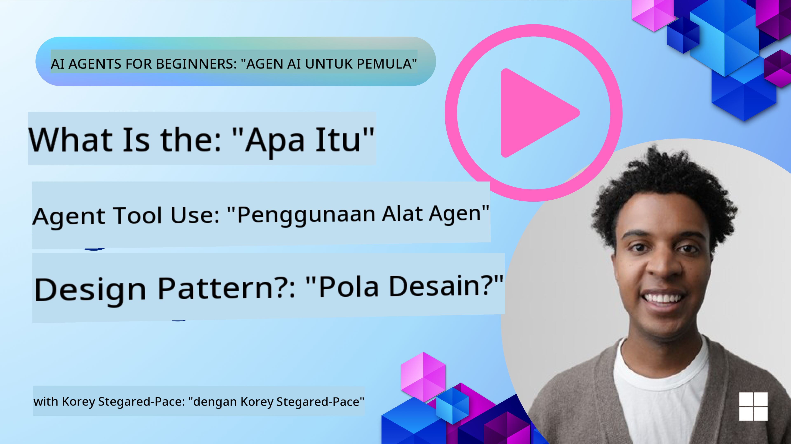
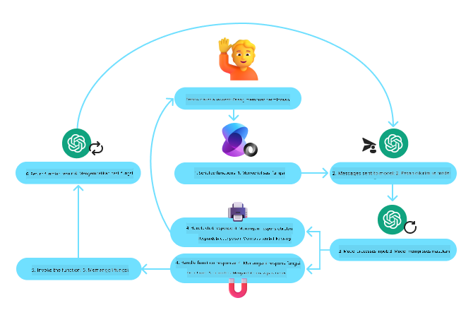
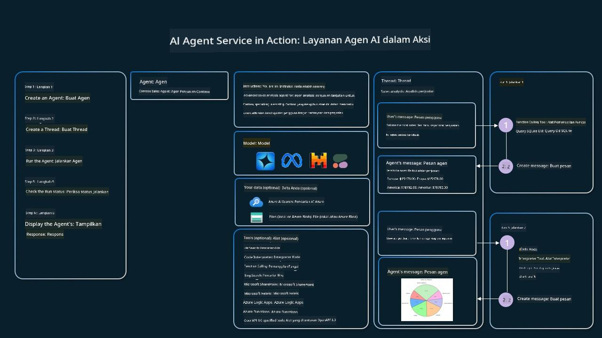

<!--
CO_OP_TRANSLATOR_METADATA:
{
  "original_hash": "e056335d729ba6e49571db7a6533825d",
  "translation_date": "2025-09-30T07:30:25+00:00",
  "source_file": "04-tool-use/README.md",
  "language_code": "id"
}
-->
[](https://youtu.be/vieRiPRx-gI?si=cEZ8ApnT6Sus9rhn)

> _(Klik gambar di atas untuk menonton video pelajaran ini)_

# Pola Desain Penggunaan Alat

Alat menarik karena memungkinkan agen AI memiliki kemampuan yang lebih luas. Alih-alih agen hanya memiliki sejumlah tindakan terbatas yang dapat dilakukan, dengan menambahkan alat, agen kini dapat melakukan berbagai macam tindakan. Dalam bab ini, kita akan melihat Pola Desain Penggunaan Alat, yang menjelaskan bagaimana agen AI dapat menggunakan alat tertentu untuk mencapai tujuannya.

## Pendahuluan

Dalam pelajaran ini, kita akan mencoba menjawab pertanyaan berikut:

- Apa itu pola desain penggunaan alat?
- Apa saja kasus penggunaan yang dapat diterapkan?
- Apa saja elemen/blok bangunan yang diperlukan untuk menerapkan pola desain ini?
- Apa saja pertimbangan khusus dalam menggunakan Pola Desain Penggunaan Alat untuk membangun agen AI yang dapat dipercaya?

## Tujuan Pembelajaran

Setelah menyelesaikan pelajaran ini, Anda akan dapat:

- Mendefinisikan Pola Desain Penggunaan Alat dan tujuannya.
- Mengidentifikasi kasus penggunaan di mana Pola Desain Penggunaan Alat dapat diterapkan.
- Memahami elemen kunci yang diperlukan untuk menerapkan pola desain ini.
- Mengenali pertimbangan untuk memastikan kepercayaan pada agen AI yang menggunakan pola desain ini.

## Apa itu Pola Desain Penggunaan Alat?

**Pola Desain Penggunaan Alat** berfokus pada memberikan kemampuan kepada LLM untuk berinteraksi dengan alat eksternal guna mencapai tujuan tertentu. Alat adalah kode yang dapat dijalankan oleh agen untuk melakukan tindakan. Alat dapat berupa fungsi sederhana seperti kalkulator, atau panggilan API ke layanan pihak ketiga seperti pencarian harga saham atau prakiraan cuaca. Dalam konteks agen AI, alat dirancang untuk dijalankan oleh agen sebagai respons terhadap **panggilan fungsi yang dihasilkan oleh model**.

## Apa saja kasus penggunaan yang dapat diterapkan?

Agen AI dapat memanfaatkan alat untuk menyelesaikan tugas kompleks, mengambil informasi, atau membuat keputusan. Pola desain penggunaan alat sering digunakan dalam skenario yang membutuhkan interaksi dinamis dengan sistem eksternal, seperti basis data, layanan web, atau interpreter kode. Kemampuan ini berguna untuk berbagai kasus penggunaan, termasuk:

- **Pengambilan Informasi Dinamis:** Agen dapat melakukan query ke API eksternal atau basis data untuk mengambil data terkini (misalnya, melakukan query ke basis data SQLite untuk analisis data, mengambil harga saham atau informasi cuaca).
- **Eksekusi dan Interpretasi Kode:** Agen dapat menjalankan kode atau skrip untuk menyelesaikan masalah matematika, menghasilkan laporan, atau melakukan simulasi.
- **Otomasi Alur Kerja:** Mengotomasi alur kerja yang berulang atau multi-langkah dengan mengintegrasikan alat seperti penjadwal tugas, layanan email, atau pipeline data.
- **Dukungan Pelanggan:** Agen dapat berinteraksi dengan sistem CRM, platform tiket, atau basis pengetahuan untuk menyelesaikan pertanyaan pengguna.
- **Pembuatan dan Pengeditan Konten:** Agen dapat memanfaatkan alat seperti pemeriksa tata bahasa, penyusun ringkasan teks, atau evaluator keamanan konten untuk membantu tugas pembuatan konten.

## Apa saja elemen/blok bangunan yang diperlukan untuk menerapkan pola desain penggunaan alat?

Blok bangunan ini memungkinkan agen AI untuk melakukan berbagai macam tugas. Mari kita lihat elemen kunci yang diperlukan untuk menerapkan Pola Desain Penggunaan Alat:

- **Skema Fungsi/Alat**: Definisi rinci tentang alat yang tersedia, termasuk nama fungsi, tujuan, parameter yang diperlukan, dan output yang diharapkan. Skema ini memungkinkan LLM memahami alat apa yang tersedia dan bagaimana membangun permintaan yang valid.

- **Logika Eksekusi Fungsi**: Mengatur bagaimana dan kapan alat dipanggil berdasarkan niat pengguna dan konteks percakapan. Ini dapat mencakup modul perencana, mekanisme routing, atau alur kondisional yang menentukan penggunaan alat secara dinamis.

- **Sistem Penanganan Pesan**: Komponen yang mengelola alur percakapan antara input pengguna, respons LLM, panggilan alat, dan output alat.

- **Kerangka Integrasi Alat**: Infrastruktur yang menghubungkan agen ke berbagai alat, baik itu fungsi sederhana atau layanan eksternal yang kompleks.

- **Penanganan Kesalahan & Validasi**: Mekanisme untuk menangani kegagalan dalam eksekusi alat, memvalidasi parameter, dan mengelola respons yang tidak terduga.

- **Manajemen Status**: Melacak konteks percakapan, interaksi alat sebelumnya, dan data yang persisten untuk memastikan konsistensi dalam interaksi multi-putaran.

Selanjutnya, mari kita lihat Panggilan Fungsi/Alat secara lebih rinci.

### Panggilan Fungsi/Alat

Panggilan fungsi adalah cara utama untuk memungkinkan Model Bahasa Besar (LLM) berinteraksi dengan alat. Anda sering melihat istilah 'Fungsi' dan 'Alat' digunakan secara bergantian karena 'fungsi' (blok kode yang dapat digunakan kembali) adalah 'alat' yang digunakan agen untuk melaksanakan tugas. Agar kode fungsi dapat dipanggil, LLM harus membandingkan permintaan pengguna dengan deskripsi fungsi. Untuk melakukan ini, skema yang berisi deskripsi semua fungsi yang tersedia dikirim ke LLM. LLM kemudian memilih fungsi yang paling sesuai untuk tugas tersebut dan mengembalikan nama dan argumennya. Fungsi yang dipilih dijalankan, responsnya dikirim kembali ke LLM, yang menggunakan informasi tersebut untuk merespons permintaan pengguna.

Untuk pengembang yang ingin menerapkan panggilan fungsi untuk agen, Anda akan membutuhkan:

1. Model LLM yang mendukung panggilan fungsi
2. Skema yang berisi deskripsi fungsi
3. Kode untuk setiap fungsi yang dijelaskan

Mari kita gunakan contoh mendapatkan waktu saat ini di sebuah kota untuk ilustrasi:

1. **Inisialisasi LLM yang mendukung panggilan fungsi:**

    Tidak semua model mendukung panggilan fungsi, jadi penting untuk memeriksa apakah LLM yang Anda gunakan mendukungnya. <a href="https://learn.microsoft.com/azure/ai-services/openai/how-to/function-calling" target="_blank">Azure OpenAI</a> mendukung panggilan fungsi. Kita dapat memulai dengan menginisialisasi klien Azure OpenAI.

    ```python
    # Initialize the Azure OpenAI client
    client = AzureOpenAI(
        azure_endpoint = os.getenv("AZURE_OPENAI_ENDPOINT"), 
        api_key=os.getenv("AZURE_OPENAI_API_KEY"),  
        api_version="2024-05-01-preview"
    )
    ```

1. **Buat Skema Fungsi**:

    Selanjutnya kita akan mendefinisikan skema JSON yang berisi nama fungsi, deskripsi tentang apa yang dilakukan fungsi, dan nama serta deskripsi parameter fungsi. 
    Kita kemudian akan mengambil skema ini dan mengirimkannya ke klien yang dibuat sebelumnya, bersama dengan permintaan pengguna untuk menemukan waktu di San Francisco. Yang penting untuk dicatat adalah bahwa yang dikembalikan adalah **panggilan alat**, **bukan** jawaban akhir atas pertanyaan tersebut. Seperti disebutkan sebelumnya, LLM mengembalikan nama fungsi yang dipilih untuk tugas tersebut, dan argumen yang akan diteruskan kepadanya.

    ```python
    # Function description for the model to read
    tools = [
        {
            "type": "function",
            "function": {
                "name": "get_current_time",
                "description": "Get the current time in a given location",
                "parameters": {
                    "type": "object",
                    "properties": {
                        "location": {
                            "type": "string",
                            "description": "The city name, e.g. San Francisco",
                        },
                    },
                    "required": ["location"],
                },
            }
        }
    ]
    ```
   
    ```python
  
    # Initial user message
    messages = [{"role": "user", "content": "What's the current time in San Francisco"}] 
  
    # First API call: Ask the model to use the function
      response = client.chat.completions.create(
          model=deployment_name,
          messages=messages,
          tools=tools,
          tool_choice="auto",
      )
  
      # Process the model's response
      response_message = response.choices[0].message
      messages.append(response_message)
  
      print("Model's response:")  

      print(response_message)
  
    ```

    ```bash
    Model's response:
    ChatCompletionMessage(content=None, role='assistant', function_call=None, tool_calls=[ChatCompletionMessageToolCall(id='call_pOsKdUlqvdyttYB67MOj434b', function=Function(arguments='{"location":"San Francisco"}', name='get_current_time'), type='function')])
    ```
  
1. **Kode fungsi yang diperlukan untuk melaksanakan tugas:**

    Sekarang setelah LLM memilih fungsi mana yang perlu dijalankan, kode yang melaksanakan tugas tersebut perlu diimplementasikan dan dijalankan. 
    Kita dapat mengimplementasikan kode untuk mendapatkan waktu saat ini dalam Python. Kita juga perlu menulis kode untuk mengekstrak nama dan argumen dari response_message untuk mendapatkan hasil akhir.

    ```python
      def get_current_time(location):
        """Get the current time for a given location"""
        print(f"get_current_time called with location: {location}")  
        location_lower = location.lower()
        
        for key, timezone in TIMEZONE_DATA.items():
            if key in location_lower:
                print(f"Timezone found for {key}")  
                current_time = datetime.now(ZoneInfo(timezone)).strftime("%I:%M %p")
                return json.dumps({
                    "location": location,
                    "current_time": current_time
                })
      
        print(f"No timezone data found for {location_lower}")  
        return json.dumps({"location": location, "current_time": "unknown"})
    ```

     ```python
     # Handle function calls
      if response_message.tool_calls:
          for tool_call in response_message.tool_calls:
              if tool_call.function.name == "get_current_time":
     
                  function_args = json.loads(tool_call.function.arguments)
     
                  time_response = get_current_time(
                      location=function_args.get("location")
                  )
     
                  messages.append({
                      "tool_call_id": tool_call.id,
                      "role": "tool",
                      "name": "get_current_time",
                      "content": time_response,
                  })
      else:
          print("No tool calls were made by the model.")  
  
      # Second API call: Get the final response from the model
      final_response = client.chat.completions.create(
          model=deployment_name,
          messages=messages,
      )
  
      return final_response.choices[0].message.content
     ```

     ```bash
      get_current_time called with location: San Francisco
      Timezone found for san francisco
      The current time in San Francisco is 09:24 AM.
     ```

Panggilan Fungsi adalah inti dari sebagian besar, jika tidak semua, desain penggunaan alat agen, namun menerapkannya dari awal terkadang bisa menjadi tantangan. 
Seperti yang kita pelajari dalam [Pelajaran 2](../../../02-explore-agentic-frameworks), kerangka kerja agentic menyediakan blok bangunan yang sudah dibuat sebelumnya untuk menerapkan penggunaan alat.

## Contoh Penggunaan Alat dengan Kerangka Kerja Agentic

Berikut adalah beberapa contoh bagaimana Anda dapat menerapkan Pola Desain Penggunaan Alat menggunakan berbagai kerangka kerja agentic:

### Semantic Kernel

<a href="https://learn.microsoft.com/azure/ai-services/agents/overview" target="_blank">Semantic Kernel</a> adalah kerangka kerja AI sumber terbuka untuk pengembang .NET, Python, dan Java yang bekerja dengan Model Bahasa Besar (LLM). Kerangka ini menyederhanakan proses penggunaan panggilan fungsi dengan secara otomatis mendeskripsikan fungsi Anda dan parameternya ke model melalui proses yang disebut <a href="https://learn.microsoft.com/semantic-kernel/concepts/ai-services/chat-completion/function-calling/?pivots=programming-language-python#1-serializing-the-functions" target="_blank">serialisasi</a>. Kerangka ini juga menangani komunikasi bolak-balik antara model dan kode Anda. Keuntungan lain dari menggunakan kerangka kerja agentic seperti Semantic Kernel adalah memungkinkan Anda mengakses alat yang sudah dibuat sebelumnya seperti <a href="https://github.com/microsoft/semantic-kernel/blob/main/python/samples/getting_started_with_agents/openai_assistant/step4_assistant_tool_file_search.py" target="_blank">Pencarian File</a> dan <a href="https://github.com/microsoft/semantic-kernel/blob/main/python/samples/getting_started_with_agents/openai_assistant/step3_assistant_tool_code_interpreter.py" target="_blank">Interpreter Kode</a>.

Diagram berikut menggambarkan proses panggilan fungsi dengan Semantic Kernel:



Dalam Semantic Kernel, fungsi/alat disebut <a href="https://learn.microsoft.com/semantic-kernel/concepts/plugins/?pivots=programming-language-python" target="_blank">Plugin</a>. Kita dapat mengubah fungsi `get_current_time` yang kita lihat sebelumnya menjadi plugin dengan mengubahnya menjadi kelas dengan fungsi di dalamnya. Kita juga dapat mengimpor dekorator `kernel_function`, yang menerima deskripsi fungsi. Ketika Anda kemudian membuat kernel dengan GetCurrentTimePlugin, kernel akan secara otomatis melakukan serialisasi fungsi dan parameternya, membuat skema untuk dikirim ke LLM dalam prosesnya.

```python
from semantic_kernel.functions import kernel_function

class GetCurrentTimePlugin:
    async def __init__(self, location):
        self.location = location

    @kernel_function(
        description="Get the current time for a given location"
    )
    def get_current_time(location: str = ""):
        ...

```

```python 
from semantic_kernel import Kernel

# Create the kernel
kernel = Kernel()

# Create the plugin
get_current_time_plugin = GetCurrentTimePlugin(location)

# Add the plugin to the kernel
kernel.add_plugin(get_current_time_plugin)
```
  
### Azure AI Agent Service

<a href="https://learn.microsoft.com/azure/ai-services/agents/overview" target="_blank">Azure AI Agent Service</a> adalah kerangka kerja agentic yang lebih baru yang dirancang untuk memberdayakan pengembang agar dapat membangun, menerapkan, dan menskalakan agen AI berkualitas tinggi dan dapat diperluas secara aman tanpa perlu mengelola sumber daya komputasi dan penyimpanan yang mendasarinya. Kerangka ini sangat berguna untuk aplikasi perusahaan karena merupakan layanan yang sepenuhnya dikelola dengan keamanan tingkat perusahaan.

Dibandingkan dengan pengembangan langsung menggunakan API LLM, Azure AI Agent Service memberikan beberapa keuntungan, termasuk:

- Panggilan alat otomatis – tidak perlu mem-parsing panggilan alat, menjalankan alat, dan menangani respons; semua ini sekarang dilakukan di sisi server
- Data yang dikelola secara aman – alih-alih mengelola status percakapan Anda sendiri, Anda dapat mengandalkan thread untuk menyimpan semua informasi yang Anda butuhkan
- Alat bawaan – Alat yang dapat Anda gunakan untuk berinteraksi dengan sumber data Anda, seperti Bing, Azure AI Search, dan Azure Functions.

Alat yang tersedia di Azure AI Agent Service dapat dibagi menjadi dua kategori:

1. Alat Pengetahuan:
    - <a href="https://learn.microsoft.com/azure/ai-services/agents/how-to/tools/bing-grounding?tabs=python&pivots=overview" target="_blank">Grounding dengan Bing Search</a>
    - <a href="https://learn.microsoft.com/azure/ai-services/agents/how-to/tools/file-search?tabs=python&pivots=overview" target="_blank">Pencarian File</a>
    - <a href="https://learn.microsoft.com/azure/ai-services/agents/how-to/tools/azure-ai-search?tabs=azurecli%2Cpython&pivots=overview-azure-ai-search" target="_blank">Azure AI Search</a>

2. Alat Tindakan:
    - <a href="https://learn.microsoft.com/azure/ai-services/agents/how-to/tools/function-calling?tabs=python&pivots=overview" target="_blank">Panggilan Fungsi</a>
    - <a href="https://learn.microsoft.com/azure/ai-services/agents/how-to/tools/code-interpreter?tabs=python&pivots=overview" target="_blank">Interpreter Kode</a>
    - <a href="https://learn.microsoft.com/azure/ai-services/agents/how-to/tools/openapi-spec?tabs=python&pivots=overview" target="_blank">Alat yang didefinisikan oleh OpenAPI</a>
    - <a href="https://learn.microsoft.com/azure/ai-services/agents/how-to/tools/azure-functions?pivots=overview" target="_blank">Azure Functions</a>

Agent Service memungkinkan kita untuk menggunakan alat-alat ini bersama-sama sebagai `toolset`. Kerangka ini juga memanfaatkan `threads` yang melacak riwayat pesan dari percakapan tertentu.

Bayangkan Anda adalah agen penjualan di sebuah perusahaan bernama Contoso. Anda ingin mengembangkan agen percakapan yang dapat menjawab pertanyaan tentang data penjualan Anda.

Gambar berikut menggambarkan bagaimana Anda dapat menggunakan Azure AI Agent Service untuk menganalisis data penjualan Anda:



Untuk menggunakan alat-alat ini dengan layanan, kita dapat membuat klien dan mendefinisikan alat atau toolset. Untuk menerapkannya secara praktis, kita dapat menggunakan kode Python berikut. LLM akan dapat melihat toolset dan memutuskan apakah akan menggunakan fungsi buatan pengguna, `fetch_sales_data_using_sqlite_query`, atau Interpreter Kode bawaan tergantung pada permintaan pengguna.

```python 
import os
from azure.ai.projects import AIProjectClient
from azure.identity import DefaultAzureCredential
from fetch_sales_data_functions import fetch_sales_data_using_sqlite_query # fetch_sales_data_using_sqlite_query function which can be found in a fetch_sales_data_functions.py file.
from azure.ai.projects.models import ToolSet, FunctionTool, CodeInterpreterTool

project_client = AIProjectClient.from_connection_string(
    credential=DefaultAzureCredential(),
    conn_str=os.environ["PROJECT_CONNECTION_STRING"],
)

# Initialize function calling agent with the fetch_sales_data_using_sqlite_query function and adding it to the toolset
fetch_data_function = FunctionTool(fetch_sales_data_using_sqlite_query)
toolset = ToolSet()
toolset.add(fetch_data_function)

# Initialize Code Interpreter tool and adding it to the toolset. 
code_interpreter = code_interpreter = CodeInterpreterTool()
toolset = ToolSet()
toolset.add(code_interpreter)

agent = project_client.agents.create_agent(
    model="gpt-4o-mini", name="my-agent", instructions="You are helpful agent", 
    toolset=toolset
)
```

## Apa saja pertimbangan khusus dalam menggunakan Pola Desain Penggunaan Alat untuk membangun agen AI yang dapat dipercaya?

Salah satu kekhawatiran umum dengan SQL yang dihasilkan secara dinamis oleh LLM adalah keamanan, terutama risiko injeksi SQL atau tindakan berbahaya, seperti menghapus atau mengubah basis data. Meskipun kekhawatiran ini valid, mereka dapat secara efektif diatasi dengan mengonfigurasi izin akses basis data dengan benar. Untuk sebagian besar basis data, ini melibatkan pengaturan basis data sebagai hanya-baca. Untuk layanan basis data seperti PostgreSQL atau Azure SQL, aplikasi harus diberi peran hanya-baca (SELECT).
Menjalankan aplikasi di lingkungan yang aman semakin meningkatkan perlindungan. Dalam skenario perusahaan, data biasanya diekstraksi dan diubah dari sistem operasional ke dalam basis data hanya-baca atau gudang data dengan skema yang ramah pengguna. Pendekatan ini memastikan bahwa data aman, dioptimalkan untuk kinerja dan aksesibilitas, serta aplikasi memiliki akses terbatas hanya-baca.

### Punya Pertanyaan Lebih Lanjut tentang Pola Desain Penggunaan Alat?

Bergabunglah dengan [Azure AI Foundry Discord](https://aka.ms/ai-agents/discord) untuk bertemu dengan pelajar lainnya, menghadiri sesi tanya jawab, dan mendapatkan jawaban atas pertanyaan Anda tentang AI Agents.

## Sumber Daya Tambahan

- <a href="https://microsoft.github.io/build-your-first-agent-with-azure-ai-agent-service-workshop/" target="_blank">Workshop Layanan Azure AI Agents</a>
- <a href="https://github.com/Azure-Samples/contoso-creative-writer/tree/main/docs/workshop" target="_blank">Workshop Multi-Agent Contoso Creative Writer</a>
- <a href="https://learn.microsoft.com/semantic-kernel/concepts/ai-services/chat-completion/function-calling/?pivots=programming-language-python#1-serializing-the-functions" target="_blank">Tutorial Pemanggilan Fungsi Semantic Kernel</a>
- <a href="https://github.com/microsoft/semantic-kernel/blob/main/python/samples/getting_started_with_agents/openai_assistant/step3_assistant_tool_code_interpreter.py" target="_blank">Semantic Kernel Code Interpreter</a>
- <a href="https://microsoft.github.io/autogen/dev/user-guide/core-user-guide/components/tools.html" target="_blank">Autogen Tools</a>

## Pelajaran Sebelumnya

[Memahami Pola Desain Agen](../03-agentic-design-patterns/README.md)

## Pelajaran Selanjutnya

[Agentic RAG](../05-agentic-rag/README.md)

---

**Penafian**:  
Dokumen ini telah diterjemahkan menggunakan layanan penerjemahan AI [Co-op Translator](https://github.com/Azure/co-op-translator). Meskipun kami berusaha untuk memberikan hasil yang akurat, harap diketahui bahwa terjemahan otomatis mungkin mengandung kesalahan atau ketidakakuratan. Dokumen asli dalam bahasa aslinya harus dianggap sebagai sumber yang otoritatif. Untuk informasi yang bersifat kritis, disarankan menggunakan jasa penerjemahan manusia profesional. Kami tidak bertanggung jawab atas kesalahpahaman atau penafsiran yang keliru yang timbul dari penggunaan terjemahan ini.