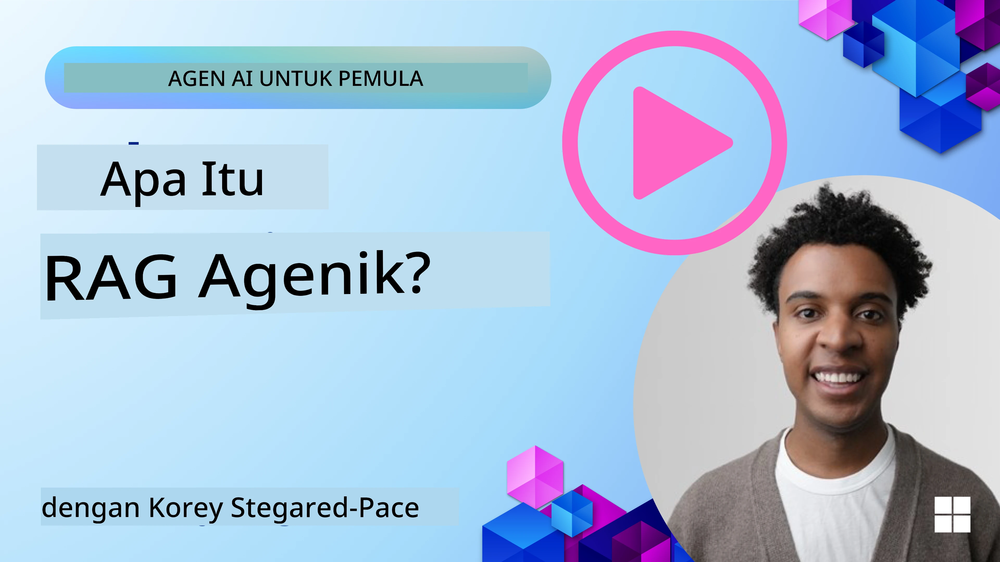
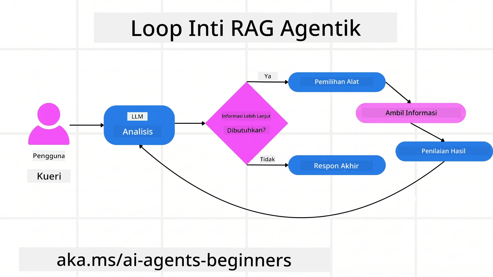
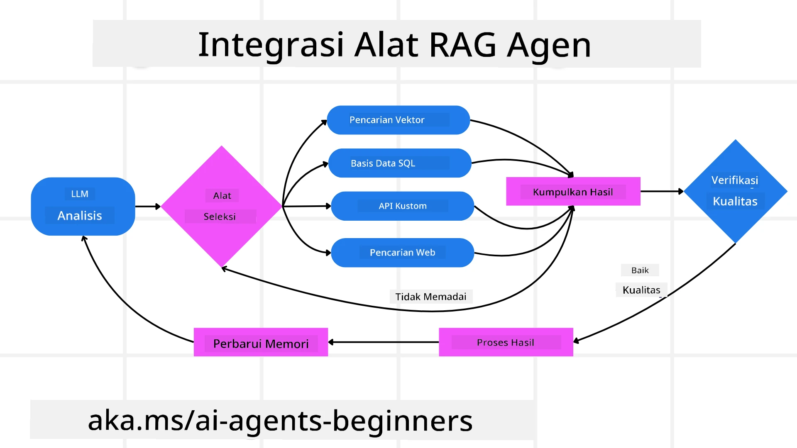
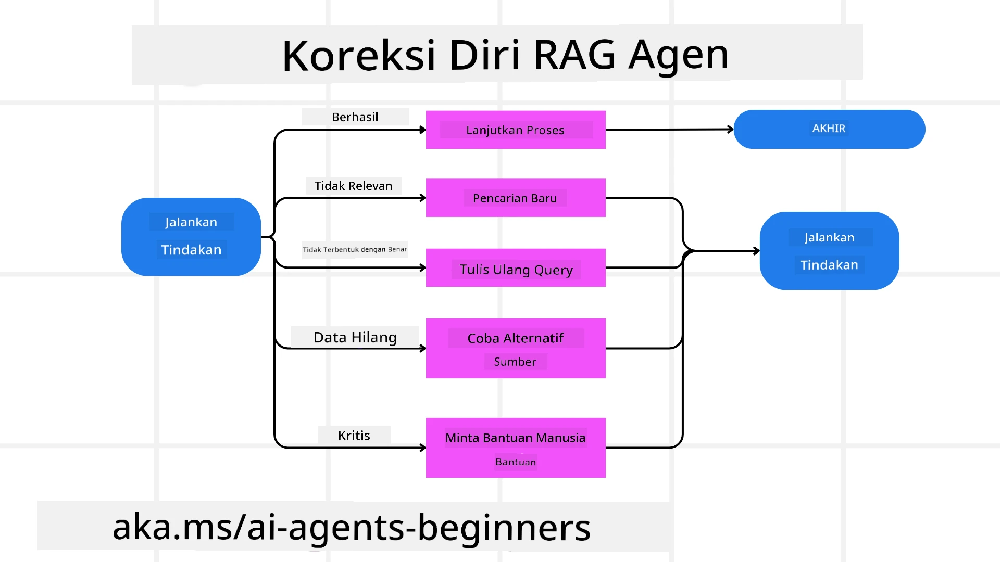
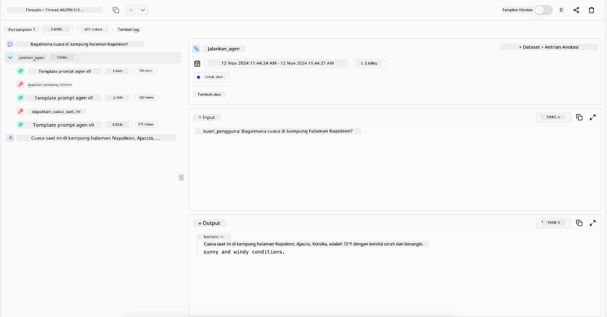

> _(Klik gambar di atas untuk melihat video dari pelajaran ini)_

# Agentic RAG

Pelajaran ini memberikan gambaran menyeluruh tentang Agentic Retrieval-Augmented Generation (Agentic RAG), sebuah paradigma AI yang sedang berkembang di mana model bahasa besar (LLM) secara mandiri merencanakan langkah selanjutnya sambil mengambil informasi dari sumber eksternal. Berbeda dengan pola pengambilan data statis lalu membaca, Agentic RAG melibatkan panggilan iteratif ke LLM, diselingi dengan panggilan alat atau fungsi dan output yang terstruktur. Sistem mengevaluasi hasil, menyempurnakan kueri, memanggil alat tambahan jika diperlukan, dan terus melakukan siklus ini hingga solusi yang memuaskan tercapai.

## Pendahuluan

Pelajaran ini akan membahas

- **Memahami Agentic RAG:** Pelajari tentang paradigma AI yang sedang berkembang di mana model bahasa besar (LLM) secara mandiri merencanakan langkah selanjutnya sambil mengambil informasi dari sumber data eksternal.
- **Memahami Gaya Maker-Checker Iteratif:** Pahami siklus panggilan iteratif ke LLM, diselingi dengan panggilan alat atau fungsi serta output terstruktur, yang dirancang untuk meningkatkan ketepatan dan menangani kueri yang tidak terbentuk dengan benar.
- **Menjelajahi Aplikasi Praktis:** Identifikasi skenario di mana Agentic RAG unggul, seperti lingkungan yang mengutamakan ketepatan, interaksi basis data yang kompleks, dan alur kerja yang panjang.

## Tujuan Pembelajaran

Setelah menyelesaikan pelajaran ini, Anda akan mengetahui/memahami:

- **Memahami Agentic RAG:** Pelajari tentang paradigma AI yang sedang berkembang di mana model bahasa besar (LLM) secara mandiri merencanakan langkah selanjutnya sambil mengambil informasi dari sumber data eksternal.
- **Gaya Maker-Checker Iteratif:** Pahami konsep siklus panggilan iteratif ke LLM, diselingi dengan panggilan alat atau fungsi dan output terstruktur, yang dirancang untuk meningkatkan ketepatan dan menangani kueri yang tidak terbentuk dengan benar.
- **Mengontrol Proses Penalaran:** Pahami kemampuan sistem untuk mengontrol proses penalarannya sendiri, mengambil keputusan tentang cara mendekati masalah tanpa bergantung pada jalur yang telah ditentukan sebelumnya.
- **Alur Kerja:** Pahami bagaimana model agentic secara mandiri memutuskan untuk mengambil laporan tren pasar, mengidentifikasi data pesaing, menghubungkan metrik penjualan internal, mensintesis temuan, dan mengevaluasi strategi.
- **Siklus Iteratif, Integrasi Alat, dan Memori:** Pelajari tentang ketergantungan sistem pada pola interaksi berulang, menjaga status dan memori sepanjang langkah untuk menghindari siklus berulang dan membuat keputusan yang lebih tepat.
- **Menangani Mode Kegagalan dan Koreksi Diri:** Jelajahi mekanisme koreksi diri yang kuat dari sistem, termasuk mengulangi dan mengajukan ulang kueri, menggunakan alat diagnostik, dan mengandalkan pengawasan manusia.
- **Batasan Agensi:** Pahami batasan Agentic RAG, yang berfokus pada otonomi domain-spesifik, ketergantungan infrastruktur, dan penghormatan terhadap batasan.
- **Kasus Penggunaan dan Nilai Praktis:** Identifikasi skenario di mana Agentic RAG unggul, seperti lingkungan yang mengutamakan ketepatan, interaksi basis data yang kompleks, dan alur kerja yang panjang.
- **Tata Kelola, Transparansi, dan Kepercayaan:** Pelajari pentingnya tata kelola dan transparansi, termasuk penalaran yang dapat dijelaskan, kontrol bias, dan pengawasan manusia.

## Apa itu Agentic RAG?

Agentic Retrieval-Augmented Generation (Agentic RAG) adalah paradigma AI yang sedang berkembang di mana model bahasa besar (LLM) secara mandiri merencanakan langkah selanjutnya sambil mengambil informasi dari sumber eksternal. Berbeda dengan pola pengambilan data statis lalu membaca, Agentic RAG melibatkan panggilan iteratif ke LLM, diselingi dengan panggilan alat atau fungsi dan output yang terstruktur. Sistem mengevaluasi hasil, menyempurnakan kueri, memanggil alat tambahan jika diperlukan, dan terus melakukan siklus ini hingga solusi yang memuaskan tercapai. Gaya “maker-checker” iteratif ini meningkatkan ketepatan, menangani kueri yang tidak terbentuk dengan benar, dan memastikan hasil berkualitas tinggi.

Sistem secara aktif mengontrol proses penalarannya, menulis ulang kueri yang gagal, memilih metode pengambilan yang berbeda, dan mengintegrasikan berbagai alat—seperti pencarian vektor di Azure AI Search, basis data SQL, atau API khusus—sebelum menyelesaikan jawabannya. Kualitas pembeda dari sistem agentic adalah kemampuannya untuk mengontrol proses penalarannya. Implementasi RAG tradisional bergantung pada jalur yang telah ditentukan sebelumnya, tetapi sistem agentic secara mandiri menentukan urutan langkah berdasarkan kualitas informasi yang ditemukan.

## Mendefinisikan Agentic Retrieval-Augmented Generation (Agentic RAG)

Agentic Retrieval-Augmented Generation (Agentic RAG) adalah paradigma yang sedang berkembang dalam pengembangan AI di mana LLM tidak hanya mengambil informasi dari sumber data eksternal tetapi juga secara mandiri merencanakan langkah selanjutnya. Berbeda dengan pola pengambilan data statis lalu membaca atau urutan prompt yang diprogram dengan cermat, Agentic RAG melibatkan siklus panggilan iteratif ke LLM, diselingi dengan panggilan alat atau fungsi dan output terstruktur. Pada setiap langkah, sistem mengevaluasi hasil yang diperoleh, memutuskan apakah akan menyempurnakan kueri, memanggil alat tambahan jika diperlukan, dan melanjutkan siklus ini hingga mencapai solusi yang memuaskan.

Gaya operasi “maker-checker” iteratif ini dirancang untuk meningkatkan ketepatan, menangani kueri yang tidak terbentuk dengan benar ke basis data terstruktur (misalnya NL2SQL), dan memastikan hasil yang seimbang dan berkualitas tinggi. Alih-alih bergantung sepenuhnya pada rantai prompt yang dirancang dengan hati-hati, sistem secara aktif mengontrol proses penalarannya. Sistem bisa menulis ulang kueri yang gagal, memilih metode pengambilan yang berbeda, dan mengintegrasikan berbagai alat—seperti pencarian vektor di Azure AI Search, basis data SQL, atau API khusus—sebelum menyelesaikan jawabannya. Ini menghilangkan kebutuhan akan kerangka kerja orkestrasi yang terlalu rumit. Sebaliknya, siklus sederhana “panggilan LLM → penggunaan alat → panggilan LLM → …” dapat menghasilkan output yang canggih dan berlandaskan kuat.

## Mengontrol Proses Penalaran

Kualitas pembeda yang membuat sistem menjadi “agentic” adalah kemampuannya mengontrol proses penalarannya. Implementasi RAG tradisional sering kali bergantung pada manusia untuk menentukan jalur bagi model: sebuah rantai pemikiran yang menguraikan apa yang harus diambil dan kapan.
Namun ketika sebuah sistem benar-benar agentic, ia secara internal memutuskan bagaimana mendekati masalah. Sistem itu tidak hanya menjalankan skrip; ia secara mandiri menentukan urutan langkah berdasarkan kualitas informasi yang ditemukan.
Sebagai contoh, jika diminta membuat strategi peluncuran produk, ia tidak hanya bergantung pada prompt yang menjelaskan seluruh alur kerja riset dan pengambilan keputusan. Sebaliknya, model agentic secara mandiri memutuskan untuk:

1. Mengambil laporan tren pasar terkini menggunakan Bing Web Grounding
2. Mengidentifikasi data pesaing yang relevan menggunakan Azure AI Search.
3. Menghubungkan metrik penjualan internal historis menggunakan Azure SQL Database.
4. Mensintesis temuan menjadi strategi terpadu yang diorkestrasikan melalui Azure OpenAI Service.
5. Mengevaluasi strategi untuk celah atau inkonsistensi, meminta putaran pengambilan data tambahan jika diperlukan.
Semua langkah ini—menyempurnakan kueri, memilih sumber, iterasi sampai “puas” dengan jawaban—diputuskan oleh model, bukan diprogram sebelumnya oleh manusia.

## Siklus Iteratif, Integrasi Alat, dan Memori

Sebuah sistem agentic bergantung pada pola interaksi berulang:

- **Panggilan Awal:** Tujuan pengguna (alias prompt pengguna) disajikan ke LLM.
- **Pemanggilan Alat:** Jika model mengidentifikasi informasi yang hilang atau instruksi yang ambigu, model memilih alat atau metode pengambilan—seperti kueri basis data vektor (misalnya Azure AI Search Hybrid search atas data pribadi) atau panggilan SQL terstruktur—untuk mengumpulkan konteks lebih.
- **Penilaian & Penyempurnaan:** Setelah meninjau data yang dikembalikan, model memutuskan apakah informasi tersebut cukup. Jika tidak, model menyempurnakan kueri, mencoba alat berbeda, atau mengubah pendekatannya.
- **Ulangi Sampai Puas:** Siklus ini berlanjut hingga model memastikan bahwa ia memiliki cukup kejelasan dan bukti untuk memberikan jawaban akhir yang beralasan dengan baik.
- **Memori & Status:** Karena sistem menjaga status dan memori di setiap langkah, sistem bisa mengingat upaya sebelumnya dan hasilnya, menghindari siklus berulang dan membuat keputusan yang lebih informasi saat melanjutkan.

Seiring waktu, ini menciptakan rasa pemahaman yang terus berkembang, memungkinkan model menavigasi tugas multi-langkah yang kompleks tanpa perlu intervensi manusia secara konstan atau mengubah prompt.

## Menangani Mode Kegagalan dan Koreksi Diri

Otonomi Agentic RAG juga melibatkan mekanisme koreksi diri yang kuat. Ketika sistem menemui jalan buntu—seperti mengambil dokumen yang tidak relevan atau menghadapi kueri yang tidak terbentuk dengan benar—ia dapat:

- **Mengulangi dan Mengajukan Ulang Kueri:** Alih-alih mengembalikan respons dengan nilai rendah, model mencoba strategi pencarian baru, menulis ulang kueri basis data, atau melihat set data alternatif.
- **Menggunakan Alat Diagnostik:** Sistem bisa memanggil fungsi tambahan yang dirancang untuk membantu mendebug langkah penalarannya atau mengkonfirmasi kebenaran data yang dipanggil. Alat seperti Azure AI Tracing akan penting untuk memungkinkan pengamatan dan pemantauan yang kuat.
- **Mengandalkan Pengawasan Manusia:** Untuk skenario berisiko tinggi atau yang sering gagal, model mungkin menandai ketidakpastian dan meminta panduan manusia. Setelah manusia memberikan umpan balik korektif, model dapat memasukkan pelajaran itu ke depannya.

Pendekatan iteratif dan dinamis ini memungkinkan model terus meningkat, memastikan bahwa ini bukan hanya sistem sekali-pakai tetapi yang belajar dari kesalahannya selama sesi berjalan.

## Batasan Agensi

Meski memiliki otonomi dalam sebuah tugas, Agentic RAG tidak dapat disamakan dengan Kecerdasan Umum Buatan. Kemampuan “agentic” nya terbatas pada alat, sumber data, dan kebijakan yang disediakan oleh pengembang manusia. Sistem tidak dapat menciptakan alatnya sendiri atau keluar dari batasan domain yang telah ditetapkan. Sebaliknya, sistem unggul dalam mengorkestrasi sumber daya yang tersedia secara dinamis.
Perbedaan utama dari bentuk AI yang lebih maju meliputi:

1. **Otonomi Domain-Spesifik:** Sistem Agentic RAG fokus pada pencapaian tujuan yang didefinisikan pengguna dalam domain yang dikenal, menggunakan strategi seperti penulisan ulang kueri atau pemilihan alat untuk meningkatkan hasil.
2. **Tergantung Infrastruktur:** Kemampuan sistem bergantung pada alat dan data yang diintegrasikan oleh pengembang. Sistem tidak bisa melewati batasan ini tanpa intervensi manusia.
3. **Menghormati Batasan:** Pedoman etika, aturan kepatuhan, dan kebijakan bisnis tetap sangat penting. Kebebasan agen selalu dibatasi oleh langkah-langkah keselamatan dan mekanisme pengawasan (semoga).

## Kasus Penggunaan dan Nilai Praktis

Agentic RAG unggul dalam skenario yang memerlukan penyempurnaan iteratif dan presisi:

1. **Lingkungan yang Mengutamakan Ketepatan:** Dalam pemeriksaan kepatuhan, analisis regulasi, atau riset hukum, model agentic dapat berulang kali memverifikasi fakta, berkonsultasi dengan berbagai sumber, dan menulis ulang kueri sampai menghasilkan jawaban yang benar-benar terverifikasi.
2. **Interaksi Basis Data Kompleks:** Saat menangani data terstruktur di mana kueri sering gagal atau perlu penyesuaian, sistem dapat secara mandiri menyempurnakan kueri menggunakan Azure SQL atau Microsoft Fabric OneLake, memastikan pengambilan akhir sesuai dengan niat pengguna.
3. **Alur Kerja Panjang:** Sesi yang berjalan lebih lama mungkin berkembang seiring munculnya informasi baru. Agentic RAG dapat selalu mengintegrasikan data baru, mengubah strategi seiring ia mempelajari lebih banyak tentang ruang masalah.

## Tata Kelola, Transparansi, dan Kepercayaan

Saat sistem ini menjadi lebih otonom dalam penalarannya, tata kelola dan transparansi menjadi sangat penting:

- **Penalaran yang Dapat Dijelaskan:** Model dapat menyediakan jejak audit kueri yang dibuat, sumber yang dikonsultasi, dan langkah penalaran yang diambil untuk mencapai kesimpulan. Alat seperti Azure AI Content Safety dan Azure AI Tracing / GenAIOps dapat membantu menjaga transparansi dan mengurangi risiko.
- **Kontrol Bias dan Pengambilan Seimbang:** Pengembang dapat mengatur strategi pengambilan untuk memastikan sumber data yang seimbang dan representatif diperhatikan, serta secara rutin mengaudit output untuk mendeteksi bias atau pola miring menggunakan model khusus untuk organisasi ilmu data canggih yang menggunakan Azure Machine Learning.
- **Pengawasan Manusia dan Kepatuhan:** Untuk tugas yang sensitif, tinjauan manusia tetap penting. Agentic RAG tidak menggantikan penilaian manusia dalam keputusan berisiko tinggi—melainkan memperkuatnya dengan menyediakan opsi yang lebih terverifikasi secara menyeluruh.

Memiliki alat yang menyediakan catatan jelas dari tindakan sangat penting. Tanpa itu, memperbaiki proses multi-langkah bisa sangat sulit. Lihat contoh berikut dari Literal AI (perusahaan di balik Chainlit) untuk sebuah Agent run:

## Kesimpulan

Agentic RAG merupakan evolusi alami dalam cara sistem AI menangani tugas kompleks yang intensif data. Dengan mengadopsi pola interaksi berulang, secara mandiri memilih alat, dan menyempurnakan kueri hingga menghasilkan hasil berkualitas tinggi, sistem ini melampaui pengikut prompt statis menjadi pengambil keputusan yang lebih adaptif dan sadar konteks. Meskipun tetap dibatasi oleh infrastruktur dan pedoman etika yang ditentukan manusia, kemampuan agentic ini memungkinkan interaksi AI yang lebih kaya, dinamis, dan pada akhirnya lebih berguna bagi perusahaan dan pengguna akhir.

### Punya Pertanyaan Lebih Lanjut tentang Agentic RAG?

Bergabunglah dengan [Microsoft Foundry Discord](https://discord.com/invite/ATgtXmAS5D) untuk bertemu dengan pembelajar lain, menghadiri jam kantor, dan mendapatkan jawaban atas pertanyaan Anda tentang AI Agents.

## Sumber Daya Tambahan

- <a href="https://learn.microsoft.com/training/modules/use-own-data-azure-openai" target="_blank">Implementasi Retrieval Augmented Generation (RAG) dengan Azure OpenAI Service: Pelajari cara menggunakan data Anda sendiri dengan Azure OpenAI Service. Modul Microsoft Learn ini menyediakan panduan komprehensif tentang implementasi RAG</a>
- <a href="https://learn.microsoft.com/azure/ai-studio/concepts/evaluation-approach-gen-ai" target="_blank">Evaluasi aplikasi AI generatif dengan Microsoft Foundry: Artikel ini membahas evaluasi dan perbandingan model pada dataset yang tersedia secara publik, termasuk aplikasi AI Agentic dan arsitektur RAG</a>
- <a href="https://weaviate.io/blog/what-is-agentic-rag" target="_blank">Apa itu Agentic RAG | Weaviate</a>
- <a href="https://ragaboutit.com/agentic-rag-a-complete-guide-to-agent-based-retrieval-augmented-generation/" target="_blank">Agentic RAG: Panduan Lengkap untuk Agent-Based Retrieval Augmented Generation – Berita dari generation RAG</a>

- <a href="https://huggingface.co/learn/cookbook/agent_rag" target="_blank">Agentic RAG: percepat RAG Anda dengan reformulasi kueri dan kueri mandiri! Buku Masak AI Open-Source Hugging Face</a>
- <a href="https://youtu.be/aQ4yQXeB1Ss?si=2HUqBzHoeB5tR04U" target="_blank">Menambahkan Lapisan Agentic ke RAG</a>
- <a href="https://www.youtube.com/watch?v=zeAyuLc_f3Q&t=244s" target="_blank">Masa Depan Asisten Pengetahuan: Jerry Liu</a>
- <a href="https://www.youtube.com/watch?v=AOSjiXP1jmQ" target="_blank">Cara Membangun Sistem Agentic RAG</a>
- <a href="https://ignite.microsoft.com/sessions/BRK102?source=sessions" target="_blank">Menggunakan Microsoft Foundry Agent Service untuk memperluas agen AI Anda</a>

### Makalah Akademik

- <a href="https://arxiv.org/abs/2303.17651" target="_blank">2303.17651 Self-Refine: Penyempurnaan Iteratif dengan Umpan Balik Diri</a>
- <a href="https://arxiv.org/abs/2303.11366" target="_blank">2303.11366 Reflexion: Agen Bahasa dengan Pembelajaran Penguatan Verbal</a>
- <a href="https://arxiv.org/abs/2305.11738" target="_blank">2305.11738 CRITIC: Model Bahasa Besar Bisa Memperbaiki Diri dengan Kritik Interaktif Alat</a>
- <a href="https://arxiv.org/abs/2501.09136" target="_blank">2501.09136 Agentic Retrieval-Augmented Generation: Survei tentang Agentic RAG</a>

## Pelajaran Sebelumnya

[Pola Desain Penggunaan Alat](../04-tool-use/README.md)

## Pelajaran Berikutnya

[Membangun Agen AI yang Dapat Dipercaya](../06-building-trustworthy-agents/README.md)

---

<!-- CO-OP TRANSLATOR DISCLAIMER START -->
**Penafian**:
Dokumen ini telah diterjemahkan menggunakan layanan terjemahan AI [Co-op Translator](https://github.com/Azure/co-op-translator). Meskipun kami berupaya untuk mencapai akurasi, harap diketahui bahwa terjemahan otomatis mungkin mengandung kesalahan atau ketidakakuratan. Dokumen asli dalam bahasa aslinya harus dianggap sebagai sumber yang sah. Untuk informasi penting, disarankan menggunakan terjemahan profesional oleh manusia. Kami tidak bertanggung jawab atas kesalahpahaman atau penafsiran yang keliru yang timbul dari penggunaan terjemahan ini.
<!-- CO-OP TRANSLATOR DISCLAIMER END -->