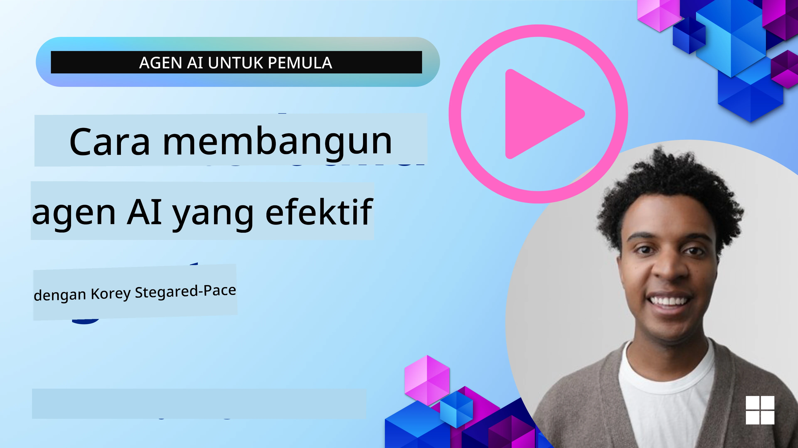
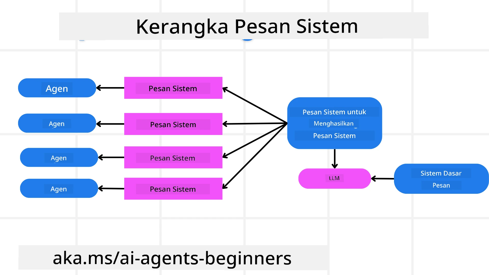
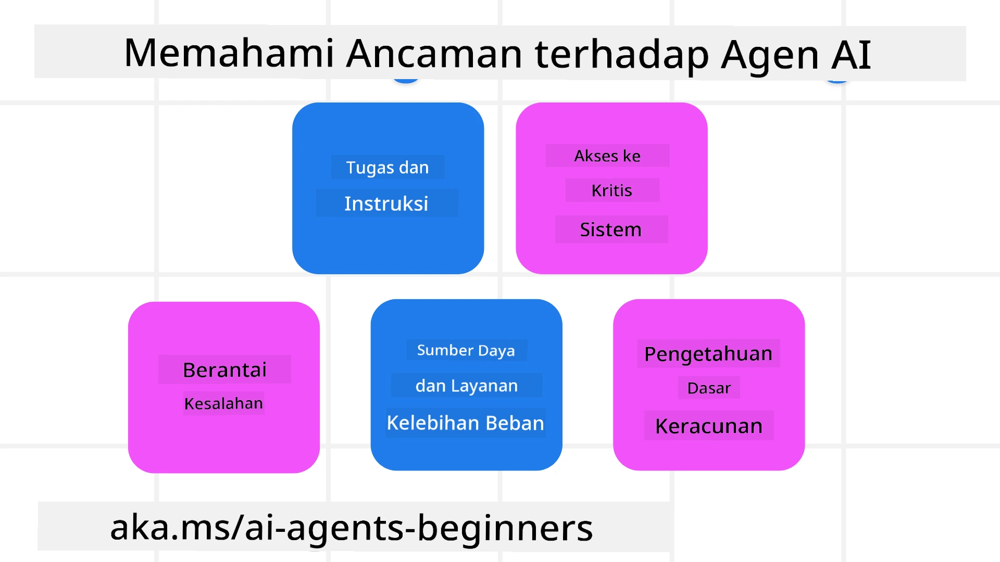
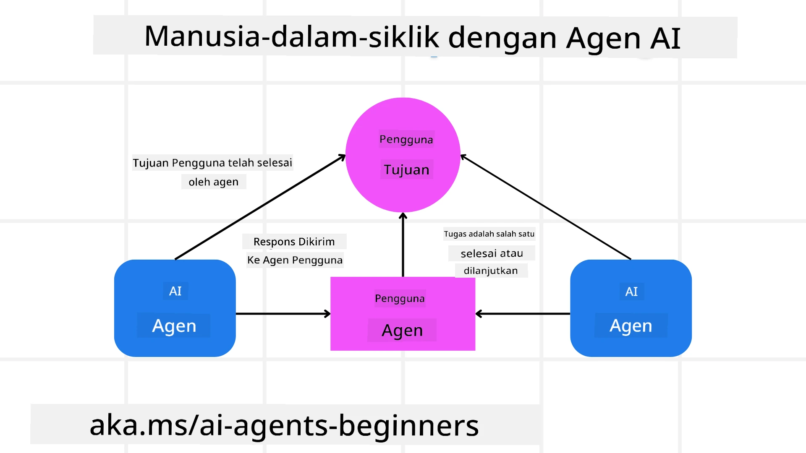

[](https://youtu.be/iZKkMEGBCUQ?si=Q-kEbcyHUMPoHp8L)

> _(Klik gambar di atas untuk menonton video pelajaran ini)_

# Membangun Agen AI yang Dapat Dipercaya

## Pendahuluan

Pelajaran ini akan membahas:

- Cara membangun dan menerapkan Agen AI yang aman dan efektif
- Pertimbangan keamanan penting saat mengembangkan Agen AI.
- Cara menjaga privasi data dan pengguna saat mengembangkan Agen AI.

## Tujuan Pembelajaran

Setelah menyelesaikan pelajaran ini, Anda akan mengetahui cara:

- Mengidentifikasi dan mengurangi risiko saat membuat Agen AI.
- Menerapkan langkah-langkah keamanan untuk memastikan data dan akses dikelola dengan benar.
- Membuat Agen AI yang menjaga privasi data dan memberikan pengalaman pengguna berkualitas.

## Keamanan

Mari kita lihat terlebih dahulu tentang membangun aplikasi agentik yang aman. Keamanan berarti agen AI berfungsi sesuai dengan rancangan. Sebagai pembangun aplikasi agentik, kita memiliki metode dan alat untuk memaksimalkan keamanan:

### Membangun Kerangka Pesan Sistem

Jika Anda pernah membuat aplikasi AI menggunakan Model Bahasa Besar (LLM), Anda tahu pentingnya merancang prompt sistem yang kuat atau pesan sistem. Prompt ini menetapkan aturan meta, instruksi, dan pedoman tentang bagaimana LLM akan berinteraksi dengan pengguna dan data.

Untuk Agen AI, prompt sistem bahkan lebih penting karena Agen AI memerlukan instruksi yang sangat spesifik untuk menyelesaikan tugas yang telah kita rancang.

Untuk membuat prompt sistem yang dapat diskalakan, kita dapat menggunakan kerangka pesan sistem untuk membangun satu atau lebih agen dalam aplikasi kita:



#### Langkah 1: Buat Pesan Sistem Meta

Meta prompt akan digunakan oleh LLM untuk menghasilkan prompt sistem bagi agen yang kita buat. Kita merancangnya sebagai template sehingga kita dapat membuat beberapa agen dengan efisien jika diperlukan.

Berikut adalah contoh pesan sistem meta yang akan kita berikan ke LLM:

```plaintext
You are an expert at creating AI agent assistants. 
You will be provided a company name, role, responsibilities and other
information that you will use to provide a system prompt for.
To create the system prompt, be descriptive as possible and provide a structure that a system using an LLM can better understand the role and responsibilities of the AI assistant. 
```

#### Langkah 2: Buat prompt dasar

Langkah selanjutnya adalah membuat prompt dasar untuk mendeskripsikan Agen AI. Anda harus menyertakan peran agen, tugas yang akan diselesaikan agen, dan tanggung jawab lain agen.

Berikut contohnya:

```plaintext
You are a travel agent for Contoso Travel that is great at booking flights for customers. To help customers you can perform the following tasks: lookup available flights, book flights, ask for preferences in seating and times for flights, cancel any previously booked flights and alert customers on any delays or cancellations of flights.  
```

#### Langkah 3: Berikan Pesan Sistem Dasar ke LLM

Sekarang kita dapat mengoptimalkan pesan sistem ini dengan memberikan pesan sistem meta sebagai pesan sistem dan pesan sistem dasar kita.

Ini akan menghasilkan pesan sistem yang lebih baik untuk membimbing agen AI kita:

```markdown
**Company Name:** Contoso Travel  
**Role:** Travel Agent Assistant

**Objective:**  
You are an AI-powered travel agent assistant for Contoso Travel, specializing in booking flights and providing exceptional customer service. Your main goal is to assist customers in finding, booking, and managing their flights, all while ensuring that their preferences and needs are met efficiently.

**Key Responsibilities:**

1. **Flight Lookup:**
    
    - Assist customers in searching for available flights based on their specified destination, dates, and any other relevant preferences.
    - Provide a list of options, including flight times, airlines, layovers, and pricing.
2. **Flight Booking:**
    
    - Facilitate the booking of flights for customers, ensuring that all details are correctly entered into the system.
    - Confirm bookings and provide customers with their itinerary, including confirmation numbers and any other pertinent information.
3. **Customer Preference Inquiry:**
    
    - Actively ask customers for their preferences regarding seating (e.g., aisle, window, extra legroom) and preferred times for flights (e.g., morning, afternoon, evening).
    - Record these preferences for future reference and tailor suggestions accordingly.
4. **Flight Cancellation:**
    
    - Assist customers in canceling previously booked flights if needed, following company policies and procedures.
    - Notify customers of any necessary refunds or additional steps that may be required for cancellations.
5. **Flight Monitoring:**
    
    - Monitor the status of booked flights and alert customers in real-time about any delays, cancellations, or changes to their flight schedule.
    - Provide updates through preferred communication channels (e.g., email, SMS) as needed.

**Tone and Style:**

- Maintain a friendly, professional, and approachable demeanor in all interactions with customers.
- Ensure that all communication is clear, informative, and tailored to the customer's specific needs and inquiries.

**User Interaction Instructions:**

- Respond to customer queries promptly and accurately.
- Use a conversational style while ensuring professionalism.
- Prioritize customer satisfaction by being attentive, empathetic, and proactive in all assistance provided.

**Additional Notes:**

- Stay updated on any changes to airline policies, travel restrictions, and other relevant information that could impact flight bookings and customer experience.
- Use clear and concise language to explain options and processes, avoiding jargon where possible for better customer understanding.

This AI assistant is designed to streamline the flight booking process for customers of Contoso Travel, ensuring that all their travel needs are met efficiently and effectively.

```

#### Langkah 4: Iterasi dan Perbaikan

Nilai dari kerangka pesan sistem ini adalah kemampuan untuk memperbesar pembuatan pesan sistem dari beberapa agen dengan lebih mudah serta memperbaiki pesan sistem Anda dari waktu ke waktu. Jarang sekali Anda memiliki pesan sistem yang langsung cocok pada penggunaan lengkap Anda. Dengan dapat melakukan tweak kecil dan perbaikan dengan mengubah pesan sistem dasar dan menjalankannya melalui sistem, Anda dapat membandingkan dan mengevaluasi hasil.

## Memahami Ancaman

Untuk membangun agen AI yang dapat dipercaya, penting untuk memahami dan mengurangi risiko serta ancaman terhadap agen AI Anda. Mari kita lihat beberapa ancaman berbeda terhadap agen AI dan bagaimana Anda dapat lebih baik merencanakan dan mempersiapkannya.



### Tugas dan Instruksi

**Deskripsi:** Penyerang berupaya mengubah instruksi atau tujuan agen AI melalui prompt atau manipulasi input.

**Mitigasi**: Jalankan pemeriksaan validasi dan penyaring input untuk mendeteksi prompt yang berpotensi berbahaya sebelum diproses oleh Agen AI. Karena serangan ini umumnya memerlukan interaksi yang sering dengan Agen, membatasi jumlah giliran dalam percakapan adalah cara lain untuk mencegah jenis serangan ini.

### Akses ke Sistem Kritis

**Deskripsi**: Jika agen AI memiliki akses ke sistem dan layanan yang menyimpan data sensitif, penyerang dapat mengganggu komunikasi antara agen dan layanan ini. Ini bisa berupa serangan langsung atau upaya tidak langsung untuk mendapatkan informasi tentang sistem ini melalui agen.

**Mitigasi**: Agen AI harus memiliki akses ke sistem hanya berdasarkan kebutuhan untuk mencegah jenis serangan ini. Komunikasi antara agen dan sistem juga harus aman. Menerapkan otentikasi dan kontrol akses adalah cara lain untuk melindungi informasi ini.

### Beban Berlebih pada Sumber Daya dan Layanan

**Deskripsi:** Agen AI dapat mengakses berbagai alat dan layanan untuk menyelesaikan tugas. Penyerang dapat memanfaatkan kemampuan ini untuk menyerang layanan tersebut dengan mengirimkan volume permintaan yang tinggi melalui Agen AI, yang mungkin menyebabkan kegagalan sistem atau biaya tinggi.

**Mitigasi:** Terapkan kebijakan untuk membatasi jumlah permintaan yang dapat dibuat oleh agen AI ke suatu layanan. Membatasi jumlah giliran percakapan dan permintaan ke agen AI Anda adalah cara lain untuk mencegah jenis serangan ini.

### Keracunan Basis Pengetahuan

**Deskripsi:** Jenis serangan ini tidak menargetkan agen AI secara langsung, tetapi menargetkan basis pengetahuan dan layanan lain yang digunakan oleh agen AI. Ini bisa melibatkan merusak data atau informasi yang digunakan agen AI untuk menyelesaikan tugas, yang mengarah pada respons yang bias atau tidak diinginkan kepada pengguna.

**Mitigasi:** Lakukan verifikasi rutin terhadap data yang akan digunakan agen AI dalam alur kerjanya. Pastikan bahwa akses ke data ini aman dan hanya diubah oleh individu terpercaya untuk menghindari jenis serangan ini.

### Kesalahan Beruntun

**Deskripsi:** Agen AI mengakses berbagai alat dan layanan untuk menyelesaikan tugas. Kesalahan yang disebabkan oleh penyerang dapat menyebabkan kegagalan sistem lain yang terkoneksi dengan agen AI, menyebabkan serangan menjadi lebih meluas dan lebih sulit untuk diatasi.

**Mitigasi**: Salah satu metode untuk menghindari ini adalah dengan menjalankan Agen AI dalam lingkungan terbatas, seperti mengerjakan tugas di dalam kontainer Docker, untuk mencegah serangan sistem langsung. Membuat mekanisme fallback dan logika retry ketika sistem tertentu merespons dengan kesalahan adalah cara lain untuk mencegah kegagalan sistem yang lebih besar.

## Manusia dalam Rangkaian

Cara efektif lain membangun sistem Agen AI yang dapat dipercaya adalah dengan menggunakan manusia dalam rangkaian (Human-in-the-loop). Ini menciptakan alur di mana pengguna dapat memberikan umpan balik kepada agen selama proses berjalan. Pengguna secara esensial bertugas sebagai agen dalam sistem multi-agen dan memberikan persetujuan atau menghentikan proses yang berjalan.



Berikut adalah cuplikan kode menggunakan Microsoft Agent Framework untuk menunjukkan bagaimana konsep ini diterapkan:

```python
import os
from agent_framework.azure import AzureAIProjectAgentProvider
from azure.identity import AzureCliCredential

# Buat penyedia dengan persetujuan human-in-the-loop
provider = AzureAIProjectAgentProvider(
    credential=AzureCliCredential(),
)

# Buat agen dengan langkah persetujuan manusia
response = provider.create_response(
    input="Write a 4-line poem about the ocean.",
    instructions="You are a helpful assistant. Ask for user approval before finalizing.",
)

# Pengguna dapat meninjau dan menyetujui respons
print(response.output_text)
user_input = input("Do you approve? (APPROVE/REJECT): ")
if user_input == "APPROVE":
    print("Response approved.")
else:
    print("Response rejected. Revising...")
```

## Kesimpulan

Membangun agen AI yang dapat dipercaya memerlukan desain yang hati-hati, langkah keamanan yang kuat, dan iterasi berkelanjutan. Dengan menerapkan sistem meta-prompt yang terstruktur, memahami ancaman potensial, dan menerapkan strategi mitigasi, pengembang dapat membuat agen AI yang aman dan efektif. Selain itu, menggabungkan pendekatan manusia dalam rangkaian memastikan agen AI tetap selaras dengan kebutuhan pengguna sambil meminimalkan risiko. Seiring perkembangan AI, menjaga sikap proaktif terhadap keamanan, privasi, dan pertimbangan etika akan menjadi kunci dalam membangun kepercayaan dan keandalan pada sistem yang digerakkan oleh AI.

## Contoh Kode

- [`code_samples/06-system-message-framework.ipynb`](code_samples/06-system-message-framework.ipynb): Demonstrasi langkah demi langkah kerangka kerja sistem pesan meta-prompt.
- [`code_samples/06-human-in-the-loop.ipynb`](code_samples/06-human-in-the-loop.ipynb): Pintu persetujuan sebelum tindakan, pengelompokan risiko, dan pencatatan audit untuk agen yang dapat dipercaya.

### Punya Pertanyaan Lebih Banyak tentang Membangun Agen AI yang Dapat Dipercaya?

Bergabunglah dengan [Microsoft Foundry Discord](https://aka.ms/ai-agents/discord) untuk bertemu dengan peserta belajar lain, mengikuti jam kantor, dan mendapatkan jawaban untuk pertanyaan tentang Agen AI Anda.

## Sumber Tambahan

- <a href="https://learn.microsoft.com/azure/ai-studio/responsible-use-of-ai-overview" target="_blank">Gambaran AI yang Bertanggung Jawab</a>
- <a href="https://learn.microsoft.com/azure/ai-studio/concepts/evaluation-approach-gen-ai" target="_blank">Evaluasi model Generatif AI dan aplikasi AI</a>
- <a href="https://learn.microsoft.com/azure/ai-services/openai/concepts/system-message?context=%2Fazure%2Fai-studio%2Fcontext%2Fcontext&tabs=top-techniques" target="_blank">Pesan sistem keamanan</a>
- <a href="https://blogs.microsoft.com/wp-content/uploads/prod/sites/5/2022/06/Microsoft-RAI-Impact-Assessment-Template.pdf?culture=en-us&country=us" target="_blank">Template Penilaian Risiko</a>

## Pelajaran Sebelumnya

[Agentik RAG](../05-agentic-rag/README.md)

## Pelajaran Berikutnya

[Polanya Perencanaan Desain](../07-planning-design/README.md)

---

<!-- CO-OP TRANSLATOR DISCLAIMER START -->
**Penafian**:
Dokumen ini telah diterjemahkan menggunakan layanan terjemahan AI [Co-op Translator](https://github.com/Azure/co-op-translator). Meskipun kami berupaya untuk mencapai akurasi, harap diketahui bahwa terjemahan otomatis mungkin mengandung kesalahan atau ketidakakuratan. Dokumen asli dalam bahasa aslinya harus dianggap sebagai sumber yang sah. Untuk informasi penting, disarankan menggunakan terjemahan profesional oleh manusia. Kami tidak bertanggung jawab atas kesalahpahaman atau penafsiran yang keliru yang timbul dari penggunaan terjemahan ini.
<!-- CO-OP TRANSLATOR DISCLAIMER END -->