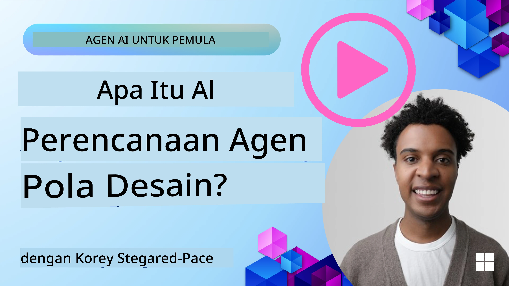
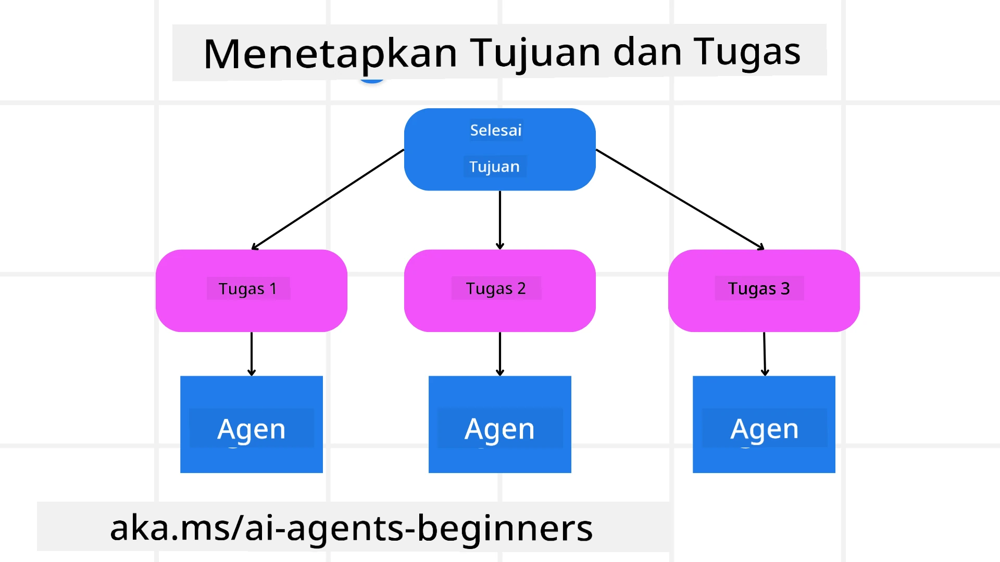

[](https://youtu.be/kPfJ2BrBCMY?si=9pYpPXp0sSbK91Dr)

> _(Klik gambar di atas untuk melihat video pelajaran ini)_

# Perencanaan Desain

## Pendahuluan

Pelajaran ini akan mencakup

* Mendefinisikan tujuan keseluruhan yang jelas dan memecah tugas kompleks menjadi tugas-tugas yang dapat dikelola.
* Memanfaatkan keluaran terstruktur untuk respons yang lebih andal dan dapat dibaca mesin.
* Menerapkan pendekatan berbasis peristiwa untuk menangani tugas dinamis dan masukan tak terduga.

## Tujuan Pembelajaran

Setelah menyelesaikan pelajaran ini, Anda akan memahami tentang:

* Mengidentifikasi dan menetapkan tujuan keseluruhan untuk agen AI, memastikan agen tersebut jelas tentang apa yang harus dicapai.
* Memecah tugas kompleks menjadi subtugas yang dapat dikelola dan mengaturnya dalam urutan logis.
* Membekali agen dengan alat yang tepat (misalnya, alat pencarian atau alat analitik data), memutuskan kapan dan bagaimana alat ini digunakan, serta menangani situasi tak terduga yang muncul.
* Mengevaluasi hasil subtugas, mengukur kinerja, dan mengulangi tindakan untuk meningkatkan keluaran akhir.

## Mendefinisikan Tujuan Keseluruhan dan Memecah Tugas



Sebagian besar tugas dunia nyata terlalu kompleks untuk ditangani dalam satu langkah. Agen AI memerlukan tujuan yang ringkas untuk memandu perencanaan dan tindakannya. Misalnya, pertimbangkan tujuan:

    "Buat itinerary perjalanan selama 3 hari."

Meskipun tampak sederhana untuk dinyatakan, tujuan ini masih perlu diperjelas. Semakin jelas tujuannya, semakin baik agen (dan kolaborator manusia) dapat fokus untuk mencapai hasil yang tepat, seperti membuat itinerary komprehensif dengan opsi penerbangan, rekomendasi hotel, dan saran aktivitas.

### Pemecahan Tugas

Tugas besar atau rumit menjadi lebih mudah dikelola ketika dibagi menjadi subtugas yang lebih kecil dan berorientasi tujuan.
Untuk contoh itinerary perjalanan, Anda dapat memecah tujuan menjadi:

* Pemesanan Penerbangan
* Pemesanan Hotel
* Penyewaan Mobil
* Personalisasi

Setiap subtugas kemudian dapat ditangani oleh agen atau proses khusus. Satu agen mungkin mengkhususkan diri dalam mencari penawaran penerbangan terbaik, agen lain fokus pada pemesanan hotel, dan seterusnya. Agen pengkoordinasi atau “downstream” kemudian dapat menggabungkan hasil ini menjadi satu itinerary yang terpadu untuk pengguna akhir.

Pendekatan modular ini juga memungkinkan peningkatan bertahap. Misalnya, Anda dapat menambahkan agen khusus untuk Rekomendasi Makanan atau Saran Aktivitas Lokal dan menyempurnakan itinerary seiring waktu.

### Keluaran Terstruktur

Large Language Models (LLM) dapat menghasilkan keluaran terstruktur (misalnya JSON) yang lebih mudah diparsing dan diproses oleh agen atau layanan downstream. Ini sangat berguna dalam konteks multi-agen, di mana kita dapat mengambil tindakan terhadap tugas-tugas ini setelah keluaran perencanaan diterima.

Potongan kode Python berikut menunjukkan agen perencana sederhana yang memecah tujuan menjadi subtugas dan menghasilkan rencana terstruktur:

```python
from pydantic import BaseModel
from enum import Enum
from typing import List, Optional, Union
import json
import os
from typing import Optional
from pprint import pprint
from agent_framework.foundry import FoundryChatClient
from azure.identity import AzureCliCredential

class AgentEnum(str, Enum):
    FlightBooking = "flight_booking"
    HotelBooking = "hotel_booking"
    CarRental = "car_rental"
    ActivitiesBooking = "activities_booking"
    DestinationInfo = "destination_info"
    DefaultAgent = "default_agent"
    GroupChatManager = "group_chat_manager"

# Model SubTugas Perjalanan
class TravelSubTask(BaseModel):
    task_details: str
    assigned_agent: AgentEnum  # kami ingin menetapkan tugas kepada agen

class TravelPlan(BaseModel):
    main_task: str
    subtasks: List[TravelSubTask]
    is_greeting: bool

provider = FoundryChatClient(
    project_endpoint=os.environ["AZURE_AI_PROJECT_ENDPOINT"],
    model=os.environ["AZURE_AI_MODEL_DEPLOYMENT_NAME"],
    credential=AzureCliCredential(),
)

# Definisikan pesan pengguna
system_prompt = """You are a planner agent.
    Your job is to decide which agents to run based on the user's request.
    Provide your response in JSON format with the following structure:
{'main_task': 'Plan a family trip from Singapore to Melbourne.',
 'subtasks': [{'assigned_agent': 'flight_booking',
               'task_details': 'Book round-trip flights from Singapore to '
                               'Melbourne.'}
    Below are the available agents specialised in different tasks:
    - FlightBooking: For booking flights and providing flight information
    - HotelBooking: For booking hotels and providing hotel information
    - CarRental: For booking cars and providing car rental information
    - ActivitiesBooking: For booking activities and providing activity information
    - DestinationInfo: For providing information about destinations
    - DefaultAgent: For handling general requests"""

user_message = "Create a travel plan for a family of 2 kids from Singapore to Melbourne"

response = client.create_response(input=user_message, instructions=system_prompt)

response_content = response.output_text
pprint(json.loads(response_content))
```

### Agen Perencana dengan Orkestrasi Multi-Agen

Dalam contoh ini, Semantic Router Agent menerima permintaan pengguna (misalnya, "Saya butuh rencana hotel untuk perjalanan saya.").

Agen perencana kemudian:

* Menerima Rencana Hotel: Agen perencana mengambil pesan pengguna dan, berdasarkan prompt sistem (termasuk detail agen yang tersedia), menghasilkan rencana perjalanan terstruktur.
* Mendaftar Agen dan Alat Mereka: Daftar agen memuat daftar agen (misalnya, untuk penerbangan, hotel, penyewaan mobil, dan aktivitas) beserta fungsi atau alat yang mereka tawarkan.
* Mengarahkan Rencana ke Agen Terkait: Berdasarkan jumlah subtugas, agen perencana mengirim pesan langsung ke agen khusus (untuk skenario tugas tunggal) atau mengoordinasikan melalui pengelola percakapan grup untuk kolaborasi multi-agen.
* Merangkum Hasil: Akhirnya, agen perencana merangkum rencana yang dihasilkan untuk memperjelas.
Potongan kode Python berikut mengilustrasikan langkah-langkah ini:

```python

from pydantic import BaseModel

from enum import Enum
from typing import List, Optional, Union

class AgentEnum(str, Enum):
    FlightBooking = "flight_booking"
    HotelBooking = "hotel_booking"
    CarRental = "car_rental"
    ActivitiesBooking = "activities_booking"
    DestinationInfo = "destination_info"
    DefaultAgent = "default_agent"
    GroupChatManager = "group_chat_manager"

# Model SubTugas Perjalanan

class TravelSubTask(BaseModel):
    task_details: str
    assigned_agent: AgentEnum # kami ingin menetapkan tugas kepada agen

class TravelPlan(BaseModel):
    main_task: str
    subtasks: List[TravelSubTask]
    is_greeting: bool
import json
import os
from typing import Optional

from agent_framework.foundry import FoundryChatClient
from azure.identity import AzureCliCredential

# Buat klien

provider = FoundryChatClient(
    project_endpoint=os.environ["AZURE_AI_PROJECT_ENDPOINT"],
    model=os.environ["AZURE_AI_MODEL_DEPLOYMENT_NAME"],
    credential=AzureCliCredential(),
)

from pprint import pprint

# Definisikan pesan pengguna

system_prompt = """You are a planner agent.
    Your job is to decide which agents to run based on the user's request.
    Below are the available agents specialized in different tasks:
    - FlightBooking: For booking flights and providing flight information
    - HotelBooking: For booking hotels and providing hotel information
    - CarRental: For booking cars and providing car rental information
    - ActivitiesBooking: For booking activities and providing activity information
    - DestinationInfo: For providing information about destinations
    - DefaultAgent: For handling general requests"""

user_message = "Create a travel plan for a family of 2 kids from Singapore to Melbourne"

response = client.create_response(input=user_message, instructions=system_prompt)

response_content = response.output_text

# Cetak konten respons setelah memuatnya sebagai JSON

pprint(json.loads(response_content))
```

Output berikut adalah hasil dari kode sebelumnya dan Anda dapat menggunakan keluaran terstruktur ini untuk mengarahkan ke `assigned_agent` dan merangkum rencana perjalanan kepada pengguna akhir.

```json
{
    "is_greeting": "False",
    "main_task": "Plan a family trip from Singapore to Melbourne.",
    "subtasks": [
        {
            "assigned_agent": "flight_booking",
            "task_details": "Book round-trip flights from Singapore to Melbourne."
        },
        {
            "assigned_agent": "hotel_booking",
            "task_details": "Find family-friendly hotels in Melbourne."
        },
        {
            "assigned_agent": "car_rental",
            "task_details": "Arrange a car rental suitable for a family of four in Melbourne."
        },
        {
            "assigned_agent": "activities_booking",
            "task_details": "List family-friendly activities in Melbourne."
        },
        {
            "assigned_agent": "destination_info",
            "task_details": "Provide information about Melbourne as a travel destination."
        }
    ]
}
```

Notebook contoh dengan potongan kode sebelumnya tersedia [di sini](./code_samples/07-python-agent-framework.ipynb).

### Perencanaan Iteratif

Beberapa tugas membutuhkan proses bolak-balik atau perencanaan ulang, di mana hasil dari satu subtugas memengaruhi yang berikutnya. Misalnya, jika agen menemukan format data tak terduga saat memesan penerbangan, ia mungkin perlu mengadaptasi strateginya sebelum melanjutkan ke pemesanan hotel.

Selain itu, umpan balik pengguna (misalnya manusia memutuskan mereka lebih memilih penerbangan yang lebih awal) dapat memicu perencanaan ulang parsial. Pendekatan dinamis dan iteratif ini memastikan solusi akhir sesuai dengan kendala dunia nyata dan preferensi pengguna yang berkembang.

Contoh kode

```python
import os
from agent_framework.foundry import FoundryChatClient
from azure.identity import AzureCliCredential
#.. sama seperti kode sebelumnya dan teruskan riwayat pengguna, rencana saat ini

system_prompt = """You are a planner agent to optimize the
    Your job is to decide which agents to run based on the user's request.
    Below are the available agents specialized in different tasks:
    - FlightBooking: For booking flights and providing flight information
    - HotelBooking: For booking hotels and providing hotel information
    - CarRental: For booking cars and providing car rental information
    - ActivitiesBooking: For booking activities and providing activity information
    - DestinationInfo: For providing information about destinations
    - DefaultAgent: For handling general requests"""

user_message = "Create a travel plan for a family of 2 kids from Singapore to Melbourne"

response = client.create_response(
    input=user_message,
    instructions=system_prompt,
    context=f"Previous travel plan - {TravelPlan}",
)
# .. rencanakan ulang dan kirim tugas ke agen terkait
```

Untuk perencanaan yang lebih komprehensif, lihatlah Blogpost Magnetic One <a href="https://www.microsoft.com/research/articles/magentic-one-a-generalist-multi-agent-system-for-solving-complex-tasks" target="_blank">di sini</a> untuk menyelesaikan tugas kompleks.

## Ringkasan

Dalam artikel ini kita telah melihat contoh bagaimana kita dapat membuat perencana yang dapat secara dinamis memilih agen yang tersedia yang didefinisikan. Keluaran dari Perencana memecah tugas dan menugaskan agen agar dapat dieksekusi. Diasumsikan agen memiliki akses ke fungsi/alat yang diperlukan untuk melaksanakan tugas. Selain agen, Anda dapat memasukkan pola lain seperti refleksi, perangkuman, dan obrolan round robin untuk menyesuaikan lebih lanjut.

## Sumber Daya Tambahan

Magnetic One - Sistem multi-agen generalis untuk menyelesaikan tugas kompleks dan telah mencapai hasil mengesankan pada beberapa tolok ukur agen yang menantang. Referensi: <a href="https://www.microsoft.com/research/articles/magentic-one-a-generalist-multi-agent-system-for-solving-complex-tasks" target="_blank">Magnetic One</a>. Dalam implementasi ini, pengorkestrasi membuat rencana khusus tugas dan mendelegasikan tugas-tugas ini kepada agen yang tersedia. Selain perencanaan, pengorkestrasi juga menggunakan mekanisme pelacakan untuk memantau kemajuan tugas dan merencanakan ulang bila diperlukan.

### Punya Pertanyaan Lebih Banyak tentang Pola Desain Perencanaan?

Bergabunglah dengan [Microsoft Foundry Discord](https://discord.com/invite/ATgtXmAS5D) untuk bertemu dengan pelajar lain, menghadiri jam kantor, dan mendapatkan jawaban atas pertanyaan tentang Agen AI.

## Pelajaran Sebelumnya

[Membangun Agen AI yang Dapat Dipercaya](../06-building-trustworthy-agents/README.md)

## Pelajaran Berikutnya

[Pola Desain Multi-Agen](../08-multi-agent/README.md)

---

<!-- CO-OP TRANSLATOR DISCLAIMER START -->
**Penafian**:
Dokumen ini telah diterjemahkan menggunakan layanan terjemahan AI [Co-op Translator](https://github.com/Azure/co-op-translator). Meskipun kami berupaya untuk mencapai akurasi, harap diketahui bahwa terjemahan otomatis mungkin mengandung kesalahan atau ketidakakuratan. Dokumen asli dalam bahasa aslinya harus dianggap sebagai sumber yang sah. Untuk informasi penting, disarankan menggunakan terjemahan profesional oleh manusia. Kami tidak bertanggung jawab atas kesalahpahaman atau penafsiran yang keliru yang timbul dari penggunaan terjemahan ini.
<!-- CO-OP TRANSLATOR DISCLAIMER END -->