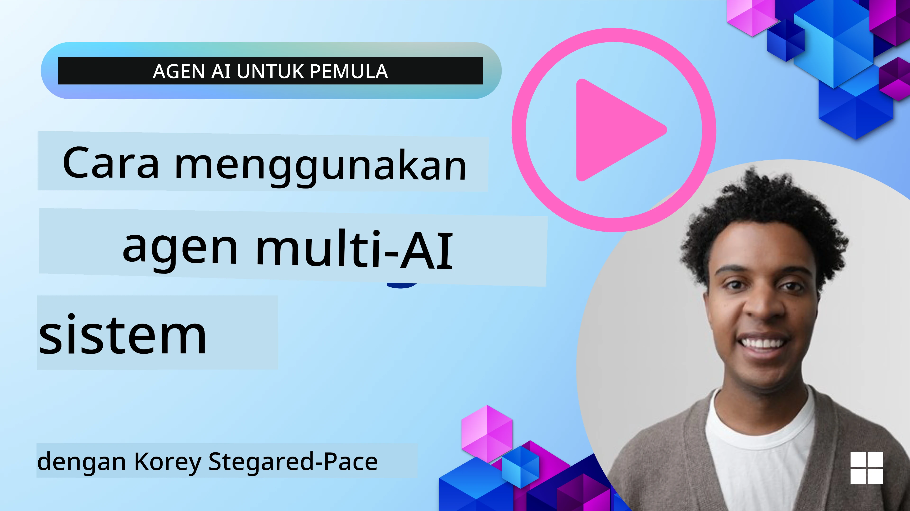
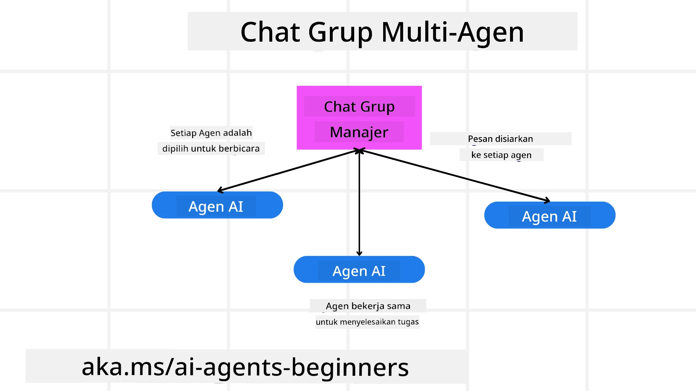
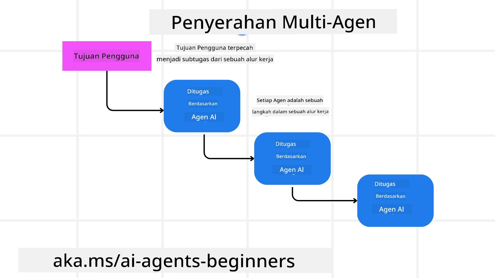
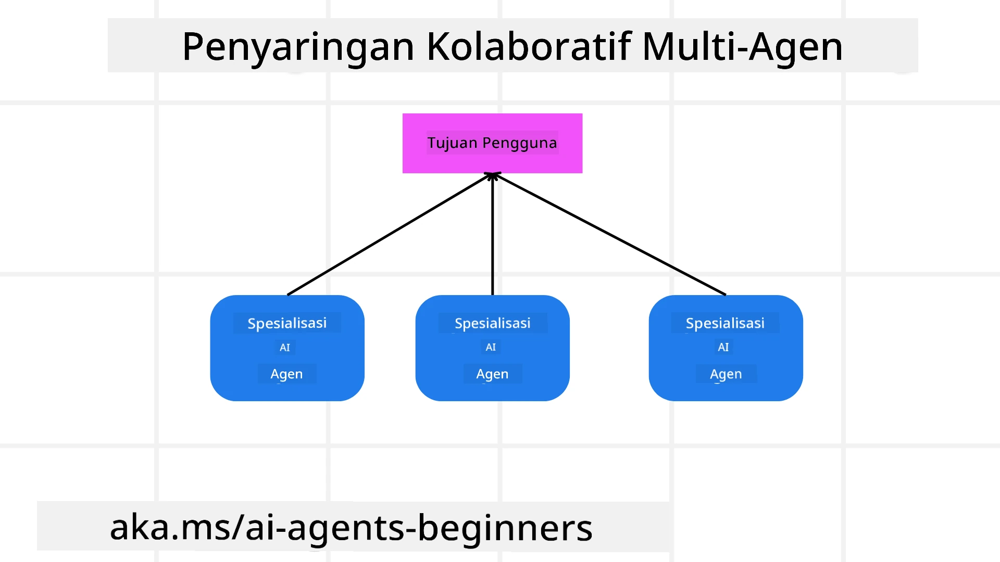

> _(Klik gambar di atas untuk melihat video dari pelajaran ini)_

# Pola desain multi-agen

Segera setelah Anda mulai mengerjakan proyek yang melibatkan banyak agen, Anda perlu mempertimbangkan pola desain multi-agen. Namun, mungkin belum langsung jelas kapan harus beralih ke multi-agen dan apa keuntungannya.

## Pendahuluan

Dalam pelajaran ini, kita akan mencoba menjawab pertanyaan berikut:

- Apa saja skenario di mana multi-agen dapat diterapkan?
- Apa keuntungan menggunakan multi-agen dibandingkan hanya dengan satu agen tunggal yang mengerjakan berbagai tugas?
- Apa saja blok bangunan dalam mengimplementasikan pola desain multi-agen?
- Bagaimana kita dapat memiliki visibilitas tentang bagaimana beberapa agen berinteraksi satu sama lain?

## Tujuan Pembelajaran

Setelah pelajaran ini, Anda harus mampu:

- Mengidentifikasi skenario di mana multi-agen dapat diterapkan
- Mengenali keuntungan menggunakan multi-agen dibandingkan agen tunggal.
- Memahami blok bangunan dalam mengimplementasikan pola desain multi-agen.

Apa gambaran besarnya?

*Multi agen adalah pola desain yang memungkinkan beberapa agen bekerja sama untuk mencapai tujuan bersama*.

Pola ini banyak digunakan di berbagai bidang, termasuk robotika, sistem otonom, dan komputasi terdistribusi.

## Skenario di Mana Multi-Agen Dapat Diterapkan

Jadi, skenario apa yang merupakan kasus penggunaan yang baik untuk menggunakan multi-agen? Jawabannya adalah ada banyak skenario di mana penggunaan beberapa agen sangat bermanfaat terutama dalam kasus berikut:

- **Beban kerja besar**: Beban kerja besar dapat dibagi menjadi tugas-tugas yang lebih kecil dan dialokasikan ke agen yang berbeda, memungkinkan pemrosesan paralel dan penyelesaian lebih cepat. Contohnya adalah dalam kasus tugas pemrosesan data besar.
- **Tugas kompleks**: Tugas kompleks, seperti beban kerja besar, dapat dipecah menjadi sub-tugas yang lebih kecil dan dialokasikan ke agen yang berbeda, masing-masing mengkhususkan diri pada aspek tertentu dari tugas tersebut. Contoh yang bagus adalah pada kendaraan otonom di mana agen berbeda menangani navigasi, deteksi rintangan, dan komunikasi dengan kendaraan lain.
- **Keahlian beragam**: Agen yang berbeda dapat memiliki keahlian yang beragam, memungkinkan mereka menangani aspek berbeda dari sebuah tugas lebih efektif dibandingkan dengan satu agen tunggal. Untuk kasus ini, contoh bagus adalah di bidang kesehatan di mana agen dapat mengelola diagnostik, rencana pengobatan, dan pemantauan pasien.

## Keuntungan Menggunakan Multi-Agen Dibandingkan Agen Tunggal

Sistem agen tunggal bisa bekerja baik untuk tugas sederhana, tetapi untuk tugas yang lebih kompleks, penggunaan beberapa agen dapat memberikan beberapa keuntungan:

- **Spesialisasi**: Setiap agen bisa mengkhususkan diri untuk tugas tertentu. Kurangnya spesialisasi dalam agen tunggal berarti Anda memiliki agen yang dapat melakukan semuanya tapi mungkin bingung apa yang harus dilakukan saat menghadapi tugas kompleks. Misalnya, agen itu mungkin malah mengerjakan tugas yang sebenarnya bukan keahliannya.
- **Skalabilitas**: Lebih mudah untuk mengskalakan sistem dengan menambahkan lebih banyak agen daripada membebani satu agen tunggal.
- **Toleransi Kesalahan**: Jika satu agen gagal, agen lain dapat terus berfungsi, memastikan keandalan sistem.

Mari ambil contoh, mari kita pesan perjalanan untuk seorang pengguna. Sistem agen tunggal harus menangani semua aspek proses pemesanan perjalanan, mulai dari mencari penerbangan hingga memesan hotel dan mobil sewaan. Untuk mencapai ini dengan satu agen, agen harus memiliki alat untuk menangani semua tugas ini. Ini bisa menghasilkan sistem yang kompleks dan monolitik yang sulit untuk dipelihara dan diskalakan. Sistem multi-agen, di sisi lain, dapat memiliki agen berbeda yang mengkhususkan diri dalam mencari penerbangan, memesan hotel, dan mobil sewaan. Ini membuat sistem lebih modular, lebih mudah dipelihara, dan dapat diskalakan.

Bandingkan ini dengan biro perjalanan yang dijalankan sebagai toko kecil milik keluarga dibandingkan biro perjalanan yang dijalankan sebagai waralaba. Toko milik keluarga akan memiliki satu agen yang menangani semua aspek proses pemesanan perjalanan, sedangkan waralaba akan memiliki agen berbeda yang menangani aspek berbeda dari proses pemesanan perjalanan.

## Blok Bangunan Untuk Mengimplementasikan Pola Desain Multi-Agen

Sebelum Anda dapat mengimplementasikan pola desain multi-agen, Anda perlu memahami blok bangunan yang menyusun pola ini.

Mari kita buat ini lebih konkret dengan lagi melihat contoh pemesanan perjalanan untuk seorang pengguna. Dalam kasus ini, blok bangunan tersebut meliputi:

- **Komunikasi Agen**: Agen untuk mencari penerbangan, memesan hotel, dan mobil sewaan perlu berkomunikasi dan berbagi informasi tentang preferensi dan batasan pengguna. Anda perlu memutuskan protokol dan metode untuk komunikasi ini. Secara konkrit, ini berarti agen pencari penerbangan perlu berkomunikasi dengan agen pemesan hotel untuk memastikan hotel dipesan pada tanggal yang sama dengan penerbangan. Itu berarti agen perlu berbagi informasi tentang tanggal perjalanan pengguna, yang berarti Anda perlu memutuskan *agen mana yang berbagi info dan bagaimana mereka berbagi info*.
- **Mekanisme Koordinasi**: Agen harus mengoordinasikan tindakan mereka untuk memastikan preferensi dan batasan pengguna terpenuhi. Preferensi pengguna bisa jadi ingin hotel dekat bandara sementara batasannya adalah mobil sewaan hanya tersedia di bandara. Ini berarti agen pemesan hotel perlu berkoordinasi dengan agen pemesan mobil sewaan untuk memastikan preferensi dan batasan pengguna terpenuhi. Ini berarti Anda perlu memutuskan *bagaimana agen mengoordinasikan tindakan mereka*.
- **Arsitektur Agen**: Agen harus memiliki struktur internal untuk membuat keputusan dan belajar dari interaksi mereka dengan pengguna. Ini berarti agen pencari penerbangan harus memiliki struktur internal untuk membuat keputusan tentang penerbangan mana yang akan direkomendasikan kepada pengguna. Ini berarti Anda perlu memutuskan *bagaimana agen membuat keputusan dan belajar dari interaksi mereka dengan pengguna*. Contoh bagaimana agen belajar dan meningkat bisa berupa agen pencari penerbangan menggunakan model pembelajaran mesin untuk merekomendasikan penerbangan berdasarkan preferensi masa lalu pengguna.
- **Visibilitas Interaksi Multi-Agen**: Anda perlu memiliki visibilitas tentang bagaimana beberapa agen berinteraksi satu sama lain. Ini berarti Anda perlu memiliki alat dan teknik untuk melacak aktivitas dan interaksi agen. Ini bisa berupa alat logging dan monitoring, alat visualisasi, dan metrik kinerja.
- **Pola Multi-Agen**: Ada pola berbeda untuk mengimplementasikan sistem multi-agen, seperti arsitektur terpusat, terdesentralisasi, dan hibrida. Anda perlu memutuskan pola mana yang paling sesuai dengan kasus penggunaan Anda.
- **Manusia dalam loop**: Dalam sebagian besar kasus, Anda akan memiliki manusia dalam loop dan Anda perlu menginstruksikan agen kapan harus meminta intervensi manusia. Ini bisa berupa pengguna yang meminta hotel atau penerbangan tertentu yang tidak direkomendasikan agen atau meminta konfirmasi sebelum memesan penerbangan atau hotel.

## Visibilitas Interaksi Multi-Agen

Penting bagi Anda untuk memiliki visibilitas tentang bagaimana beberapa agen berinteraksi satu sama lain. Visibilitas ini penting untuk debugging, optimisasi, dan memastikan efektivitas sistem secara keseluruhan. Untuk mencapai ini, Anda perlu memiliki alat dan teknik untuk melacak aktivitas dan interaksi agen. Ini bisa berupa alat logging dan monitoring, alat visualisasi, dan metrik kinerja.

Misalnya, dalam kasus memesan perjalanan untuk pengguna, Anda bisa memiliki dashboard yang menunjukkan status setiap agen, preferensi dan batasan pengguna, serta interaksi antar agen. Dashboard ini dapat menampilkan tanggal perjalanan pengguna, penerbangan yang direkomendasikan oleh agen penerbangan, hotel yang direkomendasikan oleh agen hotel, dan mobil sewaan yang direkomendasikan oleh agen mobil sewaan. Ini memberikan Anda pandangan jelas tentang bagaimana agen berinteraksi satu sama lain dan apakah preferensi dan batasan pengguna terpenuhi.

Mari kita lihat masing-masing aspek ini lebih detail.

- **Alat Logging dan Monitoring**: Anda ingin setiap tindakan yang diambil agen dicatat dalam log. Entri log bisa menyimpan informasi tentang agen yang mengambil tindakan, tindakan yang diambil, waktu tindakan diambil, dan hasil dari tindakan tersebut. Informasi ini kemudian dapat digunakan untuk debugging, optimisasi, dan lainnya.

- **Alat Visualisasi**: Alat visualisasi dapat membantu Anda melihat interaksi antar agen dengan cara yang lebih intuitif. Misalnya, Anda bisa memiliki grafik yang menunjukkan aliran informasi antar agen. Ini bisa membantu mengidentifikasi hambatan, ketidakefisienan, dan masalah lain dalam sistem.

- **Metrik Kinerja**: Metrik kinerja dapat membantu Anda melacak efektivitas sistem multi-agen. Misalnya, Anda bisa melacak waktu yang dibutuhkan untuk menyelesaikan sebuah tugas, jumlah tugas yang diselesaikan per satuan waktu, dan akurasi rekomendasi yang dibuat oleh agen. Informasi ini dapat membantu mengidentifikasi area yang perlu diperbaiki dan mengoptimalkan sistem.

## Pola Multi-Agen

Mari kita membahas beberapa pola konkret yang bisa digunakan untuk membuat aplikasi multi-agen. Berikut beberapa pola menarik yang patut dipertimbangkan:

### Obrolan grup

Pola ini berguna saat Anda ingin membuat aplikasi obrolan grup di mana banyak agen dapat berkomunikasi satu sama lain. Kasus penggunaan khas pola ini termasuk kolaborasi tim, dukungan pelanggan, dan jejaring sosial.

Dalam pola ini, setiap agen mewakili pengguna dalam obrolan grup, dan pesan dipertukarkan antar agen menggunakan protokol pesan. Agen dapat mengirim pesan ke obrolan grup, menerima pesan dari obrolan grup, dan merespon pesan dari agen lain.

Pola ini dapat diimplementasikan menggunakan arsitektur terpusat di mana semua pesan dialirkan melalui server pusat, atau arsitektur terdesentralisasi di mana pesan dipertukarkan secara langsung.

### Serah terima (Hand-off)

Pola ini berguna saat Anda ingin membuat aplikasi di mana beberapa agen dapat menyerahkan tugas satu sama lain.

Kasus penggunaan khas pola ini termasuk dukungan pelanggan, manajemen tugas, dan otomatisasi alur kerja.

Dalam pola ini, setiap agen mewakili tugas atau langkah dalam alur kerja, dan agen dapat menyerahkan tugas ke agen lain berdasarkan aturan yang sudah ditentukan.

### Penyaringan kolaboratif

Pola ini berguna saat Anda ingin membuat aplikasi di mana beberapa agen dapat berkolaborasi untuk membuat rekomendasi kepada pengguna.

Mengapa Anda ingin beberapa agen berkolaborasi adalah karena setiap agen bisa memiliki keahlian berbeda dan dapat memberikan kontribusi pada proses rekomendasi dengan cara yang berbeda.

Mari ambil contoh di mana pengguna ingin rekomendasi mengenai saham terbaik untuk dibeli di pasar saham.

- **Pakar industri**: Satu agen bisa jadi ahli di industri tertentu.
- **Analisis teknikal**: Agen lain bisa ahli dalam analisis teknikal.
- **Analisis fundamental**: dan agen lain bisa ahli dalam analisis fundamental. Dengan berkolaborasi, agen-agen ini dapat memberikan rekomendasi yang lebih komprehensif kepada pengguna.

## Skenario: Proses pengembalian dana

Pertimbangkan skenario di mana pelanggan mencoba mendapatkan pengembalian dana untuk sebuah produk, bisa ada banyak agen yang terlibat dalam proses ini tapi mari kita bagi agen spesifik untuk proses ini dan agen umum yang bisa digunakan di proses lain.

**Agen spesifik untuk proses pengembalian dana**:

Berikut adalah beberapa agen yang bisa terlibat dalam proses pengembalian dana:

- **Agen pelanggan**: Agen ini mewakili pelanggan dan bertanggung jawab untuk memulai proses pengembalian dana.
- **Agen penjual**: Agen ini mewakili penjual dan bertanggung jawab untuk memproses pengembalian dana.
- **Agen pembayaran**: Agen ini mewakili proses pembayaran dan bertanggung jawab untuk mengembalikan pembayaran pelanggan.
- **Agen penyelesaian**: Agen ini mewakili proses penyelesaian dan bertanggung jawab untuk menyelesaikan setiap masalah yang muncul selama proses pengembalian dana.
- **Agen kepatuhan**: Agen ini mewakili proses kepatuhan dan bertanggung jawab untuk memastikan bahwa proses pengembalian dana mematuhi regulasi dan kebijakan.

**Agen umum**:

Agen-agen ini dapat digunakan oleh bagian lain dari bisnis Anda.

- **Agen pengiriman**: Agen ini mewakili proses pengiriman dan bertanggung jawab untuk mengirimkan produk kembali ke penjual. Agen ini bisa digunakan baik untuk proses pengembalian dana maupun pengiriman umum produk melalui pembelian misalnya.
- **Agen umpan balik**: Agen ini mewakili proses umpan balik dan bertanggung jawab mengumpulkan umpan balik dari pelanggan. Umpan balik bisa didapat kapan saja dan tidak hanya saat proses pengembalian dana.
- **Agen eskalasi**: Agen ini mewakili proses eskalasi dan bertanggung jawab untuk menaikkan masalah ke tingkat dukungan yang lebih tinggi. Anda bisa menggunakan jenis agen ini untuk proses apa pun yang memerlukan eskalasi masalah.
- **Agen notifikasi**: Agen ini mewakili proses notifikasi dan bertanggung jawab untuk mengirimkan notifikasi kepada pelanggan di berbagai tahap proses pengembalian dana.
- **Agen analitik**: Agen ini mewakili proses analitik dan bertanggung jawab untuk menganalisis data terkait proses pengembalian dana.
- **Agen audit**: Agen ini mewakili proses audit dan bertanggung jawab untuk mengaudit proses pengembalian dana untuk memastikan bahwa proses berlangsung dengan benar.
- **Agen pelaporan**: Agen ini mewakili proses pelaporan dan bertanggung jawab membuat laporan terkait proses pengembalian dana.
- **Agen pengetahuan**: Agen ini mewakili proses pengetahuan dan bertanggung jawab untuk memelihara basis pengetahuan informasi terkait proses pengembalian dana. Agen ini bisa berpengetahuan baik soal pengembalian dana maupun bagian lain dari bisnis Anda.
- **Agen keamanan**: Agen ini mewakili proses keamanan dan bertanggung jawab untuk memastikan keamanan proses pengembalian dana.
- **Agen kualitas**: Agen ini mewakili proses kualitas dan bertanggung jawab untuk memastikan kualitas proses pengembalian dana.

Ada cukup banyak agen yang tercantum sebelumnya baik untuk proses pengembalian dana spesifik maupun untuk agen umum yang dapat digunakan di bagian lain dari bisnis Anda. Semoga ini memberi Anda gambaran bagaimana Anda dapat memutuskan agen mana yang akan digunakan dalam sistem multi-agen Anda.

## Tugas

Rancang sistem multi-agen untuk proses dukungan pelanggan. Identifikasi agen yang terlibat dalam proses, peran dan tanggung jawab mereka, serta bagaimana mereka berinteraksi satu sama lain. Pertimbangkan agen yang spesifik untuk proses dukungan pelanggan dan agen umum yang bisa digunakan di bagian lain dari bisnis Anda.
> Pikirkan terlebih dahulu sebelum Anda membaca solusi berikut, Anda mungkin membutuhkan lebih banyak agen daripada yang Anda kira.

> TIP: Pikirkan tentang berbagai tahap proses dukungan pelanggan dan juga pertimbangkan agen yang dibutuhkan untuk sistem apa pun.

## Solusi

[Solusi](./solution/solution.md)

## Pemeriksaan Pengetahuan

Pertanyaan: Kapan Anda harus mempertimbangkan menggunakan multi-agen?

- [ ] A1: Ketika Anda memiliki beban kerja kecil dan tugas yang sederhana.
- [ ] A2: Ketika Anda memiliki beban kerja besar
- [ ] A3: Ketika Anda memiliki tugas yang sederhana.

[Quiz Solusi](./solution/solution-quiz.md)

## Ringkasan

Dalam pelajaran ini, kami telah melihat pola desain multi-agen, termasuk skenario di mana multi-agen dapat diterapkan, keuntungan menggunakan multi-agen dibandingkan agen tunggal, blok bangunan dalam mengimplementasikan pola desain multi-agen, dan bagaimana memiliki visibilitas tentang bagaimana banyak agen saling berinteraksi satu sama lain.

### Punya Pertanyaan Lebih Lanjut tentang Pola Desain Multi-Agen?

Bergabunglah dengan [Microsoft Foundry Discord](https://aka.ms/ai-agents/discord) untuk bertemu dengan pembelajar lain, menghadiri jam kerja, dan mendapatkan jawaban atas pertanyaan Anda tentang AI Agents.

## Sumber Daya Tambahan

- <a href="https://learn.microsoft.com/azure/ai-services/agents/overview" target="_blank">Dokumentasi Kerangka Kerja Agen Microsoft</a>
- <a href="https://www.analyticsvidhya.com/blog/2024/10/agentic-design-patterns/" target="_blank">Pola desain agentic</a>

## Pelajaran Sebelumnya

[Perencanaan Desain](../07-planning-design/README.md)

## Pelajaran Selanjutnya

[Metakognisi dalam AI Agents](../09-metacognition/README.md)

---

<!-- CO-OP TRANSLATOR DISCLAIMER START -->
**Penafian**:  
Dokumen ini telah diterjemahkan menggunakan layanan terjemahan AI [Co-op Translator](https://github.com/Azure/co-op-translator). Meskipun kami berupaya untuk menjaga akurasi, harap diingat bahwa terjemahan otomatis mungkin mengandung kesalahan atau ketidakakuratan. Dokumen asli dalam bahasa aslinya harus dianggap sebagai sumber yang sah dan otoritatif. Untuk informasi penting, disarankan menggunakan penerjemahan profesional oleh manusia. Kami tidak bertanggung jawab atas kesalahpahaman atau kesalahan interpretasi yang timbul dari penggunaan terjemahan ini.
<!-- CO-OP TRANSLATOR DISCLAIMER END -->