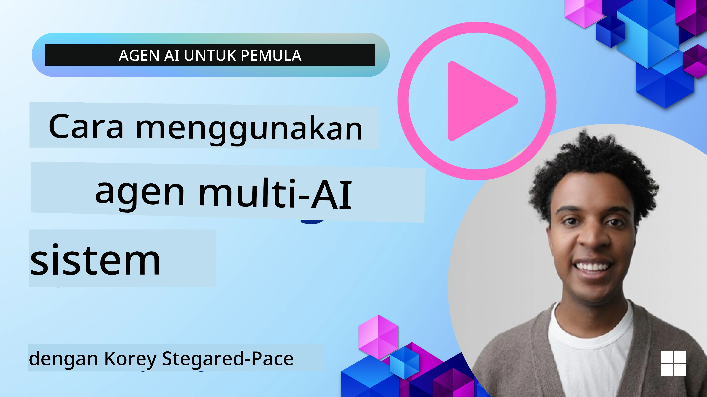
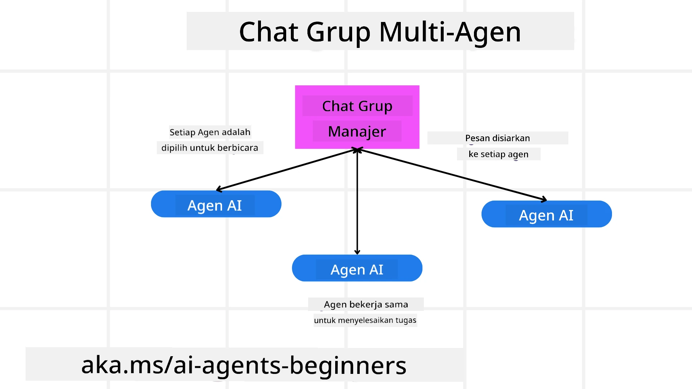
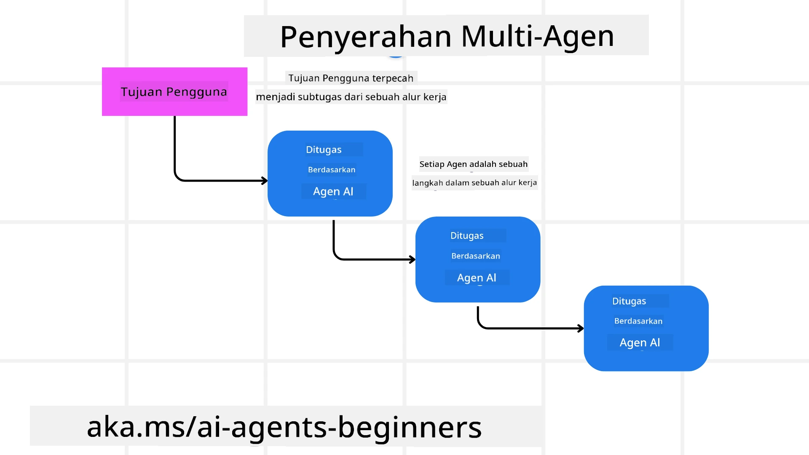
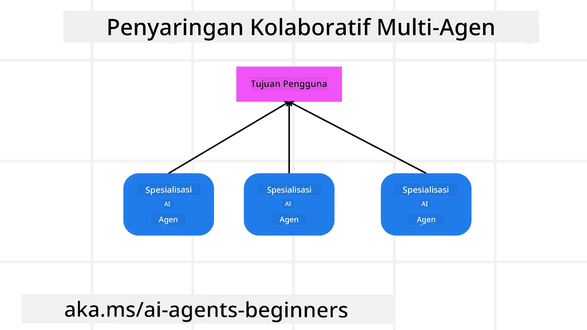

> _(Klik gambar di atas untuk menonton video pelajaran ini)_

# Pola desain multi-agen

Begitu Anda mulai mengerjakan proyek yang melibatkan banyak agen, Anda perlu mempertimbangkan pola desain multi-agen. Namun, mungkin tidak langsung jelas kapan harus beralih ke multi-agen dan apa keuntungannya.

## Pendahuluan

Dalam pelajaran ini, kita akan mencoba menjawab pertanyaan-pertanyaan berikut:

- Apa saja skenario di mana multi-agen dapat diterapkan?
- Apa keuntungan menggunakan multi-agen dibandingkan hanya satu agen tunggal yang melakukan banyak tugas?
- Apa saja blok pembangun untuk mengimplementasikan pola desain multi-agen?
- Bagaimana kita bisa mendapatkan visibilitas mengenai interaksi antar banyak agen?

## Tujuan Pembelajaran

Setelah pelajaran ini, Anda harus dapat:

- Mengidentifikasi skenario di mana multi-agen dapat diterapkan
- Mengenali keuntungan menggunakan multi-agen dibandingkan agen tunggal.
- Memahami blok pembangun dalam mengimplementasikan pola desain multi-agen.

Apa gambaran besarnya?

*Multi-agen adalah pola desain yang memungkinkan banyak agen bekerja bersama untuk mencapai tujuan bersama*.

Pola ini banyak digunakan di berbagai bidang, termasuk robotika, sistem otonom, dan komputasi terdistribusi.

## Skenario di mana Multi-Agen Diterapkan

Jadi, skenario apa yang merupakan kasus penggunaan yang baik untuk menggunakan multi-agen? Jawabannya adalah ada banyak skenario di mana penggunaan banyak agen bermanfaat, terutama dalam kasus-kasus berikut:

- **Beban kerja besar**: Beban kerja besar dapat dibagi menjadi tugas-tugas kecil dan diberikan ke agen berbeda, memungkinkan pemrosesan paralel dan penyelesaian lebih cepat. Contohnya adalah pada tugas pemrosesan data besar.
- **Tugas kompleks**: Tugas kompleks, seperti beban kerja besar, dapat dipecah menjadi subtugas lebih kecil dan diberikan ke agen berbeda, masing-masing mengkhususkan diri pada aspek tertentu dari tugas tersebut. Contoh yang baik adalah kendaraan otonom di mana berbagai agen mengelola navigasi, pendeteksian rintangan, dan komunikasi dengan kendaraan lain.
- **Keahlian beragam**: Agen berbeda dapat memiliki keahlian beragam, memungkinkan mereka menangani aspek tugas yang berbeda lebih efektif dibanding satu agen tunggal. Contoh yang baik adalah di bidang kesehatan di mana agen mengelola diagnosis, rencana perawatan, dan pemantauan pasien.

## Keuntungan Menggunakan Multi-Agen Dibanding Agen Tunggal

Sistem agen tunggal bisa bekerja baik untuk tugas sederhana, tetapi untuk tugas yang lebih kompleks, penggunaan banyak agen dapat memberikan beberapa keuntungan:

- **Spesialisasi**: Setiap agen dapat mengkhususkan diri untuk tugas tertentu. Kurangnya spesialisasi pada agen tunggal berarti Anda punya agen yang bisa melakukan segalanya tapi mungkin bingung melakukan apa saat menghadapi tugas kompleks. Misalnya, agen tersebut mungkin akhirnya melakukan tugas yang bukan keahliannya.
- **Skalabilitas**: Lebih mudah menskalakan sistem dengan menambah lebih banyak agen daripada membebani satu agen tunggal.
- **Toleransi Kesalahan**: Jika satu agen gagal, agen lain dapat terus berfungsi, memastikan keandalan sistem.

Mari kita ambil contoh, kita memesan perjalanan untuk seorang pengguna. Sistem agen tunggal harus menangani semua aspek proses pemesanan perjalanan, mulai dari mencari penerbangan, memesan hotel, hingga menyewa mobil. Untuk mencapai ini dengan satu agen, agen harus memiliki alat untuk menangani semua tugas ini. Ini bisa menghasilkan sistem yang kompleks dan monolitik yang sulit dipelihara dan diskalakan. Sistem multi-agen, di sisi lain, bisa memiliki agen berbeda yang mengkhususkan diri dalam mencari penerbangan, memesan hotel, dan menyewa mobil. Ini membuat sistem lebih modular, mudah dirawat, dan dapat diskalakan.

Bandingkan ini dengan biro perjalanan yang dijalankan sebagai toko kecil keluarga versus biro perjalanan yang dijalankan sebagai waralaba. Toko kecil keluarga memiliki satu agen yang menangani semua aspek proses pemesanan perjalanan, sementara waralaba memiliki agen berbeda yang menangani aspek berbeda proses pemesanan perjalanan.

## Blok Pembangun Mengimplementasikan Pola Desain Multi-Agen

Sebelum Anda mengimplementasikan pola desain multi-agen, Anda perlu memahami blok pembangun yang membentuk pola tersebut.

Mari kita buat ini lebih nyata dengan kembali melihat contoh pemesanan perjalanan untuk pengguna. Dalam kasus ini, blok pembangun mencakup:

- **Komunikasi Agen**: Agen untuk mencari penerbangan, memesan hotel, dan menyewa mobil perlu berkomunikasi dan berbagi informasi tentang preferensi dan kendala pengguna. Anda perlu memutuskan protokol dan metode komunikasi ini. Secara konkret, agen pencari penerbangan harus berkomunikasi dengan agen pemesan hotel untuk memastikan hotel dipesan pada tanggal yang sama dengan penerbangan. Ini berarti agen harus berbagi informasi tentang tanggal perjalanan pengguna, sehingga Anda perlu memutuskan *agen mana yang berbagi info dan bagaimana mereka berbagi info*.
- **Mekanisme Koordinasi**: Agen harus mengoordinasikan tindakannya untuk memastikan preferensi dan kendala pengguna terpenuhi. Preferensi pengguna bisa misalnya ingin hotel dekat bandara sedangkan kendala bisa mobil sewaan hanya tersedia di bandara. Ini berarti agen pemesan hotel harus berkoordinasi dengan agen pemesan mobil untuk memastikan preferensi dan kendala pengguna terpenuhi. Ini berarti Anda harus memutuskan *bagaimana agen mengoordinasikan tindakannya*.
- **Arsitektur Agen**: Agen harus memiliki struktur internal untuk membuat keputusan dan belajar dari interaksinya dengan pengguna. Ini berarti agen pencari penerbangan harus memiliki struktur internal untuk memutuskan penerbangan mana yang akan direkomendasikan. Ini berarti Anda harus memutuskan *bagaimana agen membuat keputusan dan belajar dari interaksi dengan pengguna*. Contoh bagaimana agen belajar dan meningkat adalah agen pencari penerbangan bisa menggunakan model pembelajaran mesin untuk merekomendasikan penerbangan berdasarkan preferensi pengguna sebelumnya.
- **Visibilitas Interaksi Multi-Agen**: Anda perlu memiliki visibilitas mengenai bagaimana banyak agen berinteraksi satu sama lain. Ini berarti Anda membutuhkan alat dan teknik untuk melacak aktivitas dan interaksi agen. Ini bisa berupa alat pencatatan dan pemantauan, alat visualisasi, dan metrik kinerja.
- **Pola Multi-Agen**: Ada pola berbeda untuk mengimplementasikan sistem multi-agen, seperti arsitektur terpusat, terdesentralisasi, dan hibrid. Anda perlu memilih pola yang paling cocok dengan kasus penggunaan Anda.
- **Manusia dalam lingkaran**: Dalam banyak kasus, ada manusia dalam lingkaran dan Anda perlu menginstruksikan agen kapan harus meminta intervensi manusia. Ini bisa berupa pengguna yang meminta hotel atau penerbangan spesifik yang belum direkomendasikan agen atau meminta konfirmasi sebelum memesan penerbangan atau hotel.

## Visibilitas dalam Interaksi Multi-Agen

Penting untuk memiliki visibilitas bagaimana banyak agen berinteraksi satu sama lain. Visibilitas ini penting untuk debugging, mengoptimalkan, dan memastikan efektivitas keseluruhan sistem. Untuk mencapai ini, Anda perlu alat dan teknik untuk melacak aktivitas dan interaksi agen. Ini bisa dalam bentuk alat pencatatan dan pemantauan, alat visualisasi, dan metrik kinerja.

Misalnya, dalam kasus pemesanan perjalanan untuk pengguna, Anda bisa memiliki dashboard yang menunjukkan status tiap agen, preferensi dan kendala pengguna, serta interaksi antar agen. Dashboard ini bisa menunjukkan tanggal perjalanan pengguna, penerbangan yang direkomendasikan agen penerbangan, hotel yang direkomendasikan agen hotel, dan mobil sewaan yang direkomendasikan agen penyewaan mobil. Ini memberikan gambaran jelas bagaimana agen berinteraksi satu sama lain dan apakah preferensi serta kendala pengguna terpenuhi.

Mari kita lihat masing-masing aspek ini lebih detail.

- **Alat Pencatatan dan Pemantauan**: Anda ingin setiap tindakan yang diambil agen dicatat. Sebuah entri log dapat menyimpan informasi tentang agen yang mengambil tindakan, tindakan yang diambil, waktu tindakan, dan hasil tindakan. Informasi ini kemudian bisa digunakan untuk debugging, pengoptimalan, dan lainnya.

- **Alat Visualisasi**: Alat visualisasi membantu Anda melihat interaksi antar agen dengan cara yang lebih intuitif. Misalnya, Anda dapat memiliki grafik yang menunjukkan aliran informasi antar agen. Ini dapat membantu mengidentifikasi hambatan, ketidakefisienan, dan masalah lain dalam sistem.

- **Metrik Kinerja**: Metrik kinerja membantu Anda melacak efektivitas sistem multi-agen. Misalnya, Anda dapat melacak waktu penyelesaian tugas, jumlah tugas yang diselesaikan per satuan waktu, dan akurasi rekomendasi dari agen. Informasi ini membantu mengidentifikasi area yang perlu diperbaiki dan mengoptimalkan sistem.

## Pola Multi-Agen

Mari kita telusuri beberapa pola konkret yang bisa digunakan untuk membuat aplikasi multi-agen. Berikut beberapa pola menarik yang layak dipertimbangkan:

### Obrolan Grup

Pola ini berguna saat Anda ingin membuat aplikasi obrolan grup di mana banyak agen dapat saling berkomunikasi. Kasus penggunaan umum pola ini termasuk kolaborasi tim, dukungan pelanggan, dan jejaring sosial.

Dalam pola ini, setiap agen mewakili pengguna dalam obrolan grup, dan pesan dipertukarkan antar agen menggunakan protokol perpesanan. Agen dapat mengirim pesan ke obrolan grup, menerima pesan dari grup, dan merespons pesan dari agen lain.

Pola ini dapat diimplementasikan menggunakan arsitektur terpusat di mana semua pesan dialirkan melalui server pusat, atau arsitektur terdesentralisasi di mana pesan dipertukarkan langsung.

### Serah Terima Tugas

Pola ini berguna ketika Anda ingin membuat aplikasi di mana banyak agen dapat menyerahkan tugas satu sama lain.

Kasus penggunaan umum pola ini termasuk dukungan pelanggan, manajemen tugas, dan otomatisasi alur kerja.

Dalam pola ini, setiap agen mewakili tugas atau langkah dalam alur kerja, dan agen dapat menyerahkan tugas ke agen lain berdasarkan aturan yang sudah ditetapkan.

### Pemfilteran Kolaboratif

Pola ini berguna ketika Anda ingin membuat aplikasi di mana banyak agen dapat berkolaborasi untuk memberikan rekomendasi kepada pengguna.

Mengapa Anda mau banyak agen berkolaborasi? Karena setiap agen mungkin memiliki keahlian berbeda dan bisa memberi kontribusi dalam proses rekomendasi dengan cara yang berbeda.

Mari kita ambil contoh: pengguna ingin rekomendasi saham terbaik yang akan dibeli di pasar saham.

- **Ahli industri**: Satu agen bisa ahli di industri tertentu.
- **Analisis teknis**: Agen lain bisa ahli dalam analisis teknis.
- **Analisis fundamental**: dan agen lain bisa ahli dalam analisis fundamental. Dengan berkolaborasi, agen-agen ini dapat memberikan rekomendasi yang lebih komprehensif untuk pengguna.

## Skenario: Proses Pengembalian Dana

Pertimbangkan skenario di mana pelanggan mencoba mendapatkan pengembalian dana untuk produk, bisa ada banyak agen yang terlibat dalam proses ini tapi mari kita bagi antara agen khusus untuk proses ini dan agen umum yang bisa dipakai di proses lain.

**Agen khusus untuk proses pengembalian dana**:

Berikut beberapa agen yang bisa terlibat dalam proses pengembalian dana:

- **Agen pelanggan**: Agen ini mewakili pelanggan dan bertanggung jawab memulai proses pengembalian dana.
- **Agen penjual**: Agen ini mewakili penjual dan bertanggung jawab memproses pengembalian dana.
- **Agen pembayaran**: Agen ini mewakili proses pembayaran dan bertanggung jawab mengembalikan pembayaran pelanggan.
- **Agen penyelesaian**: Agen ini mewakili proses penyelesaian masalah dan bertanggung jawab menyelesaikan masalah yang muncul selama proses pengembalian dana.
- **Agen kepatuhan**: Agen ini mewakili proses kepatuhan dan bertanggung jawab memastikan proses pengembalian dana sesuai peraturan dan kebijakan.

**Agen umum**:

Agen-agen ini dapat digunakan oleh bagian lain dari bisnis Anda.

- **Agen pengiriman**: Agen ini mewakili proses pengiriman dan bertanggung jawab mengirimkan produk kembali ke penjual. Agen ini bisa digunakan baik untuk proses pengembalian dana maupun pengiriman produk umum melalui pembelian misalnya.
- **Agen umpan balik**: Agen ini mewakili proses umpan balik dan bertanggung jawab mengumpulkan umpan balik dari pelanggan. Umpan balik bisa diberikan kapan saja, tidak hanya selama proses pengembalian dana.
- **Agen eskalasi**: Agen ini mewakili proses eskalasi dan bertanggung jawab menaikkan masalah ke tingkat dukungan yang lebih tinggi. Anda dapat menggunakan jenis agen ini untuk proses apa pun yang memerlukan eskalasi masalah.
- **Agen notifikasi**: Agen ini mewakili proses notifikasi dan bertanggung jawab mengirim notifikasi ke pelanggan pada berbagai tahap proses pengembalian dana.
- **Agen analitik**: Agen ini mewakili proses analitik dan bertanggung jawab menganalisis data terkait proses pengembalian dana.
- **Agen audit**: Agen ini mewakili proses audit dan bertanggung jawab mengaudit proses pengembalian dana untuk memastikan proses berjalan dengan benar.
- **Agen pelaporan**: Agen ini mewakili proses pelaporan dan bertanggung jawab membuat laporan tentang proses pengembalian dana.
- **Agen pengetahuan**: Agen ini mewakili proses pengetahuan dan bertanggung jawab memelihara basis pengetahuan mengenai informasi terkait proses pengembalian dana. Agen ini bisa berpengetahuan tentang pengembalian dana dan bagian lain dari bisnis Anda.
- **Agen keamanan**: Agen ini mewakili proses keamanan dan bertanggung jawab memastikan keamanan proses pengembalian dana.
- **Agen kualitas**: Agen ini mewakili proses kualitas dan bertanggung jawab memastikan kualitas proses pengembalian dana.

Ada cukup banyak agen yang tercantum sebelumnya baik untuk proses pengembalian dana khusus maupun agen umum yang dapat digunakan di bagian lain bisnis Anda. Semoga ini memberi Anda gambaran tentang bagaimana Anda bisa memutuskan agen mana yang digunakan dalam sistem multi-agen Anda.

## Tugas

Rancang sistem multi-agen untuk proses dukungan pelanggan. Identifikasi agen yang terlibat dalam proses, peran dan tanggung jawab mereka, serta bagaimana mereka berinteraksi satu sama lain. Pertimbangkan baik agen khusus untuk proses dukungan pelanggan maupun agen umum yang dapat digunakan di bagian lain bisnis Anda.

> Pikirkan terlebih dahulu sebelum Anda membaca solusi berikut, Anda mungkin memerlukan lebih banyak agen daripada yang Anda kira.

> TIP: Pikirkan tentang berbagai tahap proses dukungan pelanggan dan juga pertimbangkan agen yang dibutuhkan untuk sistem apapun.

## Solusi

[Solution](./solution/solution.md)

## Pemeriksaan Pengetahuan

### Pertanyaan 1

Skenario manakah yang paling cocok untuk sistem multi-agen?

- [ ] A1: Sebuah bot dukungan menjawab pertanyaan umum menggunakan satu basis pengetahuan dan seperangkat kecil alat.
- [ ] A2: Alur kerja pengembalian memerlukan peran terpisah untuk penipuan, pembayaran, dan kepatuhan, masing-masing dengan alatnya sendiri, dan hasilnya harus dikoordinasikan.
- [ ] A3: Permintaan klasifikasi sederhana yang sama datang ribuan kali setiap jam.

### Pertanyaan 2

Kapan biasanya agen tunggal adalah pilihan yang lebih baik?

- [ ] A1: Tugas dapat ditangani dengan satu set instruksi dan alat, tanpa serah terima khusus.
- [ ] A2: Agen memiliki akses ke lebih dari satu alat.
- [ ] A3: Alur kerja memerlukan peran terpisah dengan izin berbeda dan jejak audit independen.

[Solution quiz](./solution/solution-quiz.md)

## Ringkasan

Dalam pelajaran ini, kita telah melihat pola desain multi-agen, termasuk skenario di mana multi-agen dapat diterapkan, keuntungan menggunakan multi-agen dibanding agen tunggal, blok bangunan untuk mengimplementasikan pola desain multi-agen, dan bagaimana memiliki visibilitas tentang bagaimana banyak agen berinteraksi satu sama lain.

### Punya Pertanyaan Lebih Lanjut tentang Pola Desain Multi-Agen?

Bergabunglah dengan [Microsoft Foundry Discord](https://discord.com/invite/ATgtXmAS5D) untuk bertemu dengan pelajar lain, menghadiri jam kantor, dan mendapatkan jawaban atas pertanyaan AI Agents Anda.

## Sumber Tambahan

- <a href="https://learn.microsoft.com/azure/ai-services/agents/overview" target="_blank">Dokumentasi Microsoft Agent Framework</a>
- <a href="https://www.analyticsvidhya.com/blog/2024/10/agentic-design-patterns/" target="_blank">Pola desain Agentic</a>

## Pelajaran Sebelumnya

[Planning Design](../07-planning-design/README.md)

## Pelajaran Berikutnya

[Metacognition in AI Agents](../09-metacognition/README.md)

---

<!-- CO-OP TRANSLATOR DISCLAIMER START -->
**Penafian**:
Dokumen ini telah diterjemahkan menggunakan layanan terjemahan AI [Co-op Translator](https://github.com/Azure/co-op-translator). Meskipun kami berupaya untuk mencapai akurasi, harap diketahui bahwa terjemahan otomatis mungkin mengandung kesalahan atau ketidakakuratan. Dokumen asli dalam bahasa aslinya harus dianggap sebagai sumber yang sah. Untuk informasi penting, disarankan menggunakan terjemahan profesional oleh manusia. Kami tidak bertanggung jawab atas kesalahpahaman atau penafsiran yang keliru yang timbul dari penggunaan terjemahan ini.
<!-- CO-OP TRANSLATOR DISCLAIMER END -->