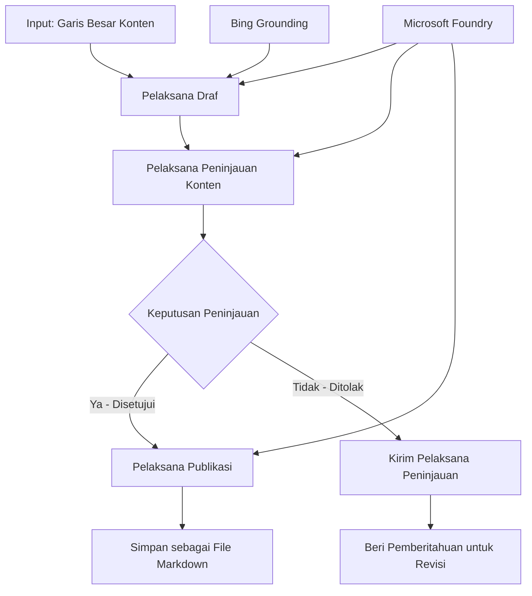

# 🔀 Alur Kerja Agen Kondisional dengan Microsoft Foundry (.NET)

## 📋 Tutorial Alur Kerja Berbasis Keputusan Cerdas

Notebook ini mendemonstrasikan **pola alur kerja kondisional** menggunakan Microsoft Foundry dan Microsoft Agent Framework untuk .NET. Anda akan belajar bagaimana membangun alur kerja canggih yang didorong keputusan dan secara cerdas mengarahkan pemrosesan berdasarkan analisis AI, aturan bisnis, dan kondisi dinamis untuk otomatisasi tingkat perusahaan.

## 🎯 Tujuan Pembelajaran

### 🧠 **Arsitektur Keputusan Cerdas**
- **Implementasi Logika Kondisional**: Membangun pohon keputusan kompleks dengan banyak cabang
- **Pengarahan Berbasis AI**: Menggunakan model Microsoft Foundry untuk membuat keputusan pengalihan cerdas
- **Adaptasi Alur Kerja Dinamis**: Memodifikasi perilaku alur kerja berdasarkan analisis dan kondisi saat runtime
- **Integrasi Aturan Perusahaan**: Menggabungkan logika bisnis dan persyaratan kepatuhan ke dalam alur kerja

### 🔀 **Pola Kondisional Lanjutan**
- **Pengambilan Keputusan Multi-Kriteria**: Mengevaluasi beberapa faktor untuk keputusan pengalihan
- **Pemrosesan Berbasis Konteks**: Membuat keputusan berdasarkan akumulasi konteks dan riwayat alur kerja
- **Modifikasi Alur Kerja Adaptif**: Menyesuaikan jalur pemrosesan secara dinamis berdasarkan kondisi waktu nyata
- **Integrasi Mesin Aturan**: Menerapkan engine aturan bisnis canggih dalam alur kerja

### 🏢 **Aplikasi Kondisional Perusahaan**
- **Klasifikasi & Pengarahan Dokumen**: Mengklasifikasi dan mengarahkan dokumen secara otomatis ke alur kerja yang sesuai
- **Triage Layanan Pelanggan**: Pengarahan cerdas permintaan pelanggan ke tim penanganan khusus
- **Pemrosesan Kepatuhan & Risiko**: Menerapkan validasi dan proses tinjauan berbeda berdasarkan penilaian risiko
- **Alur Kerja Penjaminan Kualitas**: Mengarahkan konten melalui proses tinjauan berdasarkan metrik kualitas

## ⚙️ Prasyarat & Pengaturan

### 📦 **Paket NuGet yang Diperlukan**

Paket lanjutan untuk pemrosesan alur kerja kondisional:

```xml
<!-- Core AI Framework -->
<PackageReference Include="Microsoft.Extensions.AI" Version="9.9.0" />

<!-- Azure AI Agents with Persistent State -->
<PackageReference Include="Azure.AI.Agents.Persistent" Version="1.2.0-beta.5" />

<!-- Azure Identity and Utilities -->
<PackageReference Include="Azure.Identity" Version="1.15.0" />
<PackageReference Include="System.Linq.Async" Version="6.0.3" />
<PackageReference Include="DotNetEnv" Version="3.1.1" />

<!-- Local Workflow Framework References -->
<!-- Microsoft.Agents.Workflows.dll - Advanced workflow orchestration -->
<!-- Microsoft.Agents.AI.AzureAI.dll - Microsoft Foundry integration -->
<!-- Microsoft.Agents.AI.dll - Core agent abstractions -->
```

### 🔑 **Konfigurasi Microsoft Foundry**

**Sumber Daya Azure yang Diperlukan:**
- Workspace Microsoft Foundry dengan model pemrosesan kondisional
- Langganan Azure dengan kuota dan izin komputasi yang sesuai
- Model AI yang dideploy untuk pengambilan keputusan dan analisis konten
- (Opsional) Koneksi Bing Search API untuk kemampuan grounding

**Konfigurasi Lingkungan (file .env):**
```env
# Microsoft Foundry Configuration
AZURE_AI_PROJECT_ENDPOINT=https://your-project.cognitiveservices.azure.com/
BING_CONNECTION_ID=your-bing-connection-id
```

**Pengaturan Otentikasi:**
```csharp
// Azure CLI or Managed Identity authentication
using Azure.Identity;
var credential = new AzureCliCredential();

// Load environment configuration
DotNetEnv.Env.Load("../../../.env");
```

### 🏗️ **Arsitektur Alur Kerja Kondisional**



**Komponen Kunci:**
- **Draft Executor**: Agen AI yang membuat draft konten awal dari kerangka
- **Content Review Executor**: Agen AI yang mengevaluasi kualitas dan kepatuhan draft
- **Conditional Routing**: Logika keputusan yang mengarahkan berdasarkan hasil tinjauan
- **Publish/Review Paths**: Jalur pemrosesan terpisah untuk konten yang disetujui vs ditolak
- **Manajemen Status**: Memelihara konteks konten dan tinjauan sepanjang alur kerja

## 🎨 **Pola Desain Alur Kerja Kondisional**

### 📋 **Produksi Konten dengan Gerbang Kualitas**
```
Outline → Draft Creation → Quality Review → {Approve: Publish | Reject: Revise}
```

### 🎯 **Pemrosesan Dokumen Berbasis Risiko**
```
Document → Risk Assessment → {Low: Standard | High: Enhanced Review}
```

### 🔍 **Pengarahan Layanan Pelanggan Cerdas**
```
Customer Query → Analysis → {Simple: FAQ Bot | Complex: Human Agent}
```

### 💼 **Alur Kerja Berbasis Kepatuhan**
```
Content → Compliance Check → {Pass: Publish | Fail: Legal Review}
```

## 🏢 **Manfaat Kondisional Perusahaan**

### 🎯 **Otomasi Cerdas**
- **Pengambilan Keputusan Pintar**: Keputusan pengalihan berbasis AI berdasarkan analisis konten dan konteks
- **Pemrosesan Adaptif**: Alur kerja yang otomatis menyesuaikan berdasarkan perubahan kondisi
- **Penegakan Aturan Bisnis**: Penerapan otomatis logika dan kebijakan bisnis kompleks
- **Pengarahan Berbasis Konteks**: Keputusan berdasarkan riwayat penuh alur kerja dan konteks yang terakumulasi

### 📈 **Keunggulan Operasional**
- **Alokasi Sumber Daya Optimal**: Mengarahkan pekerjaan ke spesialis dan proses paling tepat
- **Pengurangan Intervensi Manual**: Pengambilan keputusan otomatis meminimalkan kebutuhan pengarahan manusia
- **Waktu Penyelesaian Lebih Cepat**: Pengalihan langsung ke keahlian dan kemampuan pemrosesan yang sesuai
- **Penerapan Konsisten**: Penerapan seragam aturan bisnis dan kriteria keputusan

### 🛡️ **Manajemen Risiko & Kepatuhan**
- **Penilaian Risiko Otomatis**: Evaluasi berbasis AI terhadap tingkat risiko konten dan situasi
- **Penegakan Kepatuhan**: Pengarahan otomatis melalui proses regulasi yang diperlukan
- **Penerapan Protokol Keamanan**: Langkah-langkah keamanan diperkuat berdasarkan penilaian risiko
- **Pemeliharaan Jejak Audit**: Dokumentasi lengkap keputusan pengalihan dan alasan

### 📊 **Analitik & Perbaikan Berkelanjutan**
- **Analitik Keputusan**: Melacak efektivitas dan akurasi keputusan pengalihan
- **Pengenalan Pola**: Mengidentifikasi tren dan pola dalam keputusan pengalihan dari waktu ke waktu
- **Optimasi Performa**: Perbaikan berkelanjutan kriteria keputusan dan efisiensi pengalihan
- **Kecerdasan Bisnis**: Wawasan tentang karakteristik konten dan kebutuhan pemrosesan

### 🔧 **Keunggulan Teknis**
- **Manajemen Status Persisten**: Mempertahankan status kompleks selama eksekusi alur kerja
- **Arsitektur Skalable**: Menangani kebutuhan pemrosesan kondisional volume tinggi
- **Kemampuan Integrasi**: Integrasi mulus dengan sistem dan proses bisnis yang ada
- **Monitoring & Observabilitas**: Pelacakan komprehensif performa dan keputusan alur kerja

Mari bangun alur kerja perusahaan cerdas yang didorong keputusan dengan .NET! 🚀

## 💻 Menjalankan Kode

Implementasi lengkap tersedia di `04.dotnet-agent-framework-workflow-aifoundry-condition.cs`. Ini mendemonstrasikan **alur kerja produksi konten dengan gerbang kualitas**:

### 🏗️ **Arsitektur Alur Kerja**

```
Content Outline → Draft Creation → Quality Review → Conditional Routing:
                                                      ├─ Approved (>200 words) → Publish
                                                      └─ Rejected (<200 words) → Review Notification
```

**Agen dalam Alur Kerja:**
1. **Agen Evangelist**: Membuat draft tutorial dari kerangka dengan grounding Bing
2. **Agen Content Reviewer**: Mengevaluasi kualitas draft (jumlah kata, kelengkapan)
3. **Agen Publisher**: Menyimpan konten yang disetujui sebagai file Markdown dengan cap waktu

**Eksekutor Kustom:**
1. **DraftExecutor**: Mengorkestrasi pembuatan draft
2. **ContentReviewExecutor**: Melakukan penilaian kualitas
3. **PublishExecutor**: Menangani publikasi konten yang disetujui
4. **SendReviewExecutor**: Mengelola notifikasi konten yang ditolak

### 🚀 Menjalankan Contoh

**Prasyarat:**
- Workspace Microsoft Foundry dikonfigurasi
- Otentikasi Azure CLI (`az login`)
- (Opsional) Koneksi Bing Search untuk grounding

```bash
# Jadikan skrip dapat dieksekusi (Unix/Linux/macOS)
chmod +x 04.dotnet-agent-framework-workflow-aifoundry-condition.cs

# Jalankan alur kerja kondisional
./04.dotnet-agent-framework-workflow-aifoundry-condition.cs
```

Atau di Windows:
```powershell
dotnet run 04.dotnet-agent-framework-workflow-aifoundry-condition.cs
```

### 📝 Output yang Diharapkan

Alur kerja akan:
1. **Membuat Agen**: Menginisialisasi tiga agen Microsoft Foundry khusus
2. **Menghasilkan Draft**: Agen evangelist membuat draft tutorial dari kerangka
3. **Meninjau Konten**: Content Reviewer mengevaluasi kualitas draft
4. **Pengarahan Kondisional**:
   - **Jika disetujui (>200 kata)**: Publish executor menyimpan sebagai file Markdown
   - **Jika ditolak (<200 kata)**: Mengirim notifikasi tinjauan
5. **Menampilkan Hasil**: Menunjukkan hasil akhir alur kerja

### 🔧 Opsi Kustomisasi

**Ubah Kriteria Tinjauan:**
```csharp
const string ContentReviewerInstructions = @"
You are a content reviewer...
1. Check if content is more than 500 words (instead of 200)
2. Verify technical accuracy
3. Ensure proper formatting
...";
```

**Tambah Jalur Kondisional Lain:**
```csharp
var workflow = new WorkflowBuilder(draftExecutor)
    .AddEdge(draftExecutor, contentReviewerExecutor)
    .AddEdge(contentReviewerExecutor, publishExecutor, condition: GetCondition("Excellent"))
    .AddEdge(contentReviewerExecutor, editExecutor, condition: GetCondition("Good"))
    .AddEdge(contentReviewerExecutor, sendReviewerExecutor, condition: GetCondition("Poor"))
    .Build();
```

**Ubah Persyaratan Konten:**
```csharp
string OUTLINE_Content = @"
# Your Custom Topic
## Section 1
https://your-reference-url
## Section 2
...
";
```

### 🎯 Aplikasi Dunia Nyata

Pola alur kerja kondisional ini ideal untuk:
- **Sistem Manajemen Konten**: Alur editorial otomatis dengan gerbang kualitas
- **Pemrosesan Dokumen**: Mengarahkan dokumen berdasarkan klasifikasi dan kepatuhan
- **Dukungan Pelanggan**: Pengarahan tiket cerdas berdasarkan kompleksitas dan urgensi
- **Tinjauan Hukum**: Mengarahkan kontrak berdasarkan penilaian risiko dan nilai
- **Proses HR**: Mengarahkan aplikasi melalui alur saringan yang sesuai

### 🔍 Memahami Logika Kondisional

**Fungsi Kondisi:**
```csharp
public Func<object?, bool> GetCondition(string expectedResult) =>
    reviewResult => reviewResult is ReviewResult review && review.Result == expectedResult;
```

Fungsi ini membuat predikat yang:
1. Memeriksa apakah hasil bertipe `ReviewResult`
2. Membandingkan properti `Result` dengan nilai yang diharapkan
3. Mengembalikan true/false untuk menentukan pengalihan

**Tepi Alur Kerja dengan Kondisi:**
```csharp
.AddEdge(contentReviewerExecutor, publishExecutor, condition: GetCondition("Yes"))
.AddEdge(contentReviewerExecutor, sendReviewerExecutor, condition: GetCondition("No"))
```

### 📊 Fitur Lanjutan

**Validasi Skema JSON:**
Alur kerja menggunakan skema JSON untuk memastikan respons terstruktur:

```csharp
// Define response structure
public class ReviewResult
{
    [JsonPropertyName("review_result")]
    public string Result { get; set; } = string.Empty;
    
    [JsonPropertyName("reason")]
    public string Reason { get; set; } = string.Empty;
    
    [JsonPropertyName("draft_content")]
    public string DraftContent { get; set; } = string.Empty;
}

// Apply to agent
ResponseFormat = ChatResponseFormat.ForJsonSchema(
    AIJsonUtilities.CreateJsonSchema(typeof(ReviewResult)), 
    "ReviewResult", 
    "Review Result From DraftContent"
)
```

**Integrasi Grounding Bing:**
Agen Evangelist menggunakan grounding Bing untuk mengakses informasi waktu nyata:

```csharp
var bingGroundingConfig = new BingGroundingSearchConfiguration(bing_conn_id);
BingGroundingToolDefinition bingGroundingTool = new(
    new BingGroundingSearchToolParameters([bingGroundingConfig])
);
```

Ini memungkinkan agen mengikuti URL dalam kerangka dan mengekstrak informasi terkini.

### 🛡️ Penanganan Kesalahan

Alur kerja mencakup penanganan kesalahan yang kuat untuk konten yang ditolak:
- Kegagalan tinjauan memicu jalur alternatif
- Notifikasi memberikan alasan penolakan yang jelas
- Konten dipertahankan untuk revisi

### 🔄 Memperluas Alur Kerja

**Tambahkan Loop Revisi:**
Buat loop umpan balik yang secara otomatis membuat ulang draft konten:

```csharp
.AddEdge(contentReviewerExecutor, publishExecutor, condition: GetCondition("Yes"))
.AddEdge(contentReviewerExecutor, draftExecutor, condition: GetCondition("No")) // Loop back
```

**Implementasikan Peninjauan Multi-Level:**
Tambahkan beberapa tahap tinjauan dengan kriteria berbeda:

```csharp
.AddEdge(draftExecutor, technicalReviewer)
.AddEdge(technicalReviewer, editorialReviewer, condition: GetCondition("TechPass"))
.AddEdge(editorialReviewer, publishExecutor, condition: GetCondition("EditPass"))
```

Pola alur kerja kondisional ini menyediakan fondasi untuk membangun sistem otomatisasi perusahaan yang canggih dan cerdas! 🚀

---

<!-- CO-OP TRANSLATOR DISCLAIMER START -->
**Penafian**:
Dokumen ini telah diterjemahkan menggunakan layanan terjemahan AI [Co-op Translator](https://github.com/Azure/co-op-translator). Meskipun kami berupaya untuk mencapai akurasi, harap diketahui bahwa terjemahan otomatis mungkin mengandung kesalahan atau ketidakakuratan. Dokumen asli dalam bahasa aslinya harus dianggap sebagai sumber yang sah. Untuk informasi penting, disarankan menggunakan terjemahan profesional oleh manusia. Kami tidak bertanggung jawab atas kesalahpahaman atau penafsiran yang keliru yang timbul dari penggunaan terjemahan ini.
<!-- CO-OP TRANSLATOR DISCLAIMER END -->