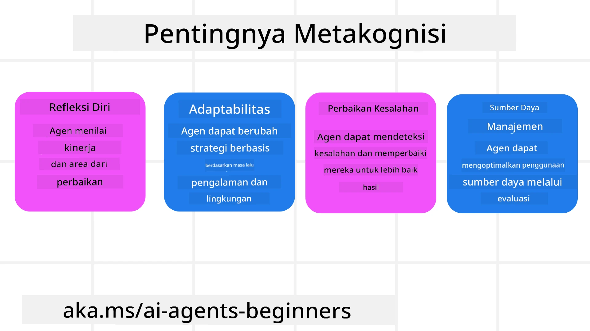
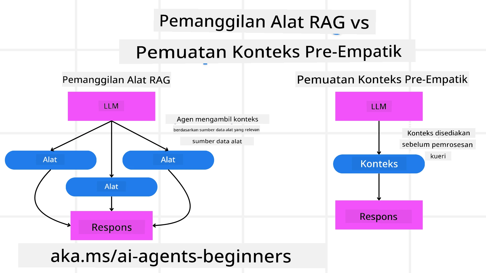

[](https://youtu.be/His9R6gw6Ec?si=3_RMb8VprNvdLRhX)

> _(Klik gambar di atas untuk melihat video dari pelajaran ini)_
# Metakognisi pada Agen AI

## Pendahuluan

Selamat datang di pelajaran tentang metakognisi pada agen AI! Bab ini dirancang untuk pemula yang ingin tahu bagaimana agen AI dapat berpikir tentang proses berpikir mereka sendiri. Di akhir pelajaran ini, Anda akan memahami konsep-konsep kunci dan dibekali dengan contoh praktis untuk menerapkan metakognisi dalam desain agen AI.

## Tujuan Pembelajaran

Setelah menyelesaikan pelajaran ini, Anda akan dapat:

1. Memahami implikasi dari loop penalaran dalam definisi agen.
2. Menggunakan teknik perencanaan dan evaluasi untuk membantu agen yang dapat memperbaiki diri sendiri.
3. Membuat agen Anda sendiri yang mampu memanipulasi kode untuk menyelesaikan tugas.

## Pengenalan tentang Metakognisi

Metakognisi merujuk pada proses kognitif tingkat tinggi yang melibatkan pemikiran tentang proses berpikir sendiri. Untuk agen AI, ini berarti mampu mengevaluasi dan menyesuaikan tindakan mereka berdasarkan kesadaran diri dan pengalaman masa lalu. Metakognisi, atau "berpikir tentang berpikir," adalah konsep penting dalam pengembangan sistem AI yang agen. Ini melibatkan sistem AI yang sadar akan proses internalnya sendiri dan mampu memantau, mengatur, serta menyesuaikan perilakunya sesuai. Sama seperti yang kita lakukan ketika kita membaca situasi atau melihat sebuah masalah. Kesadaran diri ini dapat membantu sistem AI membuat keputusan yang lebih baik, mengidentifikasi kesalahan, dan meningkatkan kinerjanya dari waktu ke waktu — sekali lagi menghubungkan kembali ke tes Turing dan perdebatan apakah AI akan mengambil alih.

Dalam konteks sistem AI agen, metakognisi dapat membantu mengatasi beberapa tantangan, seperti:
- Transparansi: Memastikan bahwa sistem AI dapat menjelaskan penalaran dan keputusan mereka.
- Penalaran: Meningkatkan kemampuan sistem AI untuk mensintesis informasi dan membuat keputusan yang tepat.
- Adaptasi: Memungkinkan sistem AI menyesuaikan diri dengan lingkungan baru dan kondisi yang berubah.
- Persepsi: Meningkatkan akurasi sistem AI dalam mengenali dan menginterpretasikan data dari lingkungannya.

### Apa itu Metakognisi?

Metakognisi, atau "berpikir tentang berpikir," adalah proses kognitif tingkat tinggi yang melibatkan kesadaran diri dan pengaturan diri dari proses kognitif seseorang. Dalam ranah AI, metakognisi memberdayakan agen untuk menilai dan menyesuaikan strategi serta tindakannya, yang mengarah pada kemampuan pemecahan masalah dan pengambilan keputusan yang lebih baik. Dengan memahami metakognisi, Anda dapat merancang agen AI yang tidak hanya lebih cerdas tetapi juga lebih adaptif dan efisien. Dalam metakognisi sejati, Anda akan melihat AI secara eksplisit menalar tentang penalarannya sendiri.

Contoh: “Saya memprioritaskan penerbangan yang lebih murah karena… Saya mungkin melewatkan penerbangan langsung, jadi saya akan memeriksa ulang.”.
Melacak bagaimana atau mengapa memilih rute tertentu.
- Menyadari bahwa telah membuat kesalahan karena terlalu bergantung pada preferensi pengguna dari waktu sebelumnya, sehingga mengubah strategi pengambilan keputusannya, bukan hanya rekomendasi akhir.
- Mendiagnosis pola seperti, “Setiap kali saya melihat pengguna menyebut 'terlalu ramai,' saya tidak hanya harus menghapus beberapa atraksi tetapi juga merefleksikan bahwa metode saya memilih 'atraksi teratas' salah jika saya selalu memberi peringkat berdasarkan popularitas.”

### Pentingnya Metakognisi pada Agen AI

Metakognisi memainkan peran penting dalam desain agen AI karena beberapa alasan:



- Refleksi Diri: Agen dapat menilai kinerjanya sendiri dan mengidentifikasi area yang perlu diperbaiki.
- Adaptabilitas: Agen dapat mengubah strategi berdasarkan pengalaman dan lingkungan yang berubah.
- Koreksi Kesalahan: Agen dapat mendeteksi dan memperbaiki kesalahan secara mandiri, menghasilkan hasil yang lebih akurat.
- Manajemen Sumber Daya: Agen dapat mengoptimalkan penggunaan sumber daya, seperti waktu dan daya komputasi, dengan merencanakan dan mengevaluasi tindakannya.

## Komponen Agen AI

Sebelum menyelami proses metakognitif, penting untuk memahami komponen dasar dari agen AI. Biasanya agen AI terdiri dari:

- Persona: Kepribadian dan karakteristik agen, yang menentukan bagaimana ia berinteraksi dengan pengguna.
- Alat: Kapabilitas dan fungsi yang dapat dilakukan agen.
- Keterampilan: Pengetahuan dan keahlian yang dimiliki agen.

Komponen-komponen ini bekerja bersama untuk menciptakan "unit keahlian" yang dapat melakukan tugas-tugas tertentu.

**Contoh**:
Pertimbangkan agen perjalanan, layanan agen yang tidak hanya merencanakan liburan Anda tetapi juga menyesuaikan jalur berdasarkan data waktu nyata dan pengalaman perjalanan pelanggan sebelumnya.

### Contoh: Metakognisi dalam Layanan Agen Perjalanan

Bayangkan Anda merancang layanan agen perjalanan yang didukung AI. Agen ini, "Travel Agent," membantu pengguna merencanakan liburan mereka. Untuk menggabungkan metakognisi, Travel Agent perlu mengevaluasi dan menyesuaikan tindakannya berdasarkan kesadaran diri dan pengalaman masa lalu. Berikut cara metakognisi dapat berperan:

#### Tugas Saat Ini

Tugas saat ini adalah membantu pengguna merencanakan perjalanan ke Paris.

#### Langkah-langkah Menyelesaikan Tugas

1. **Kumpulkan Preferensi Pengguna**: Tanyakan kepada pengguna tentang tanggal perjalanan, anggaran, minat (misalnya, museum, kuliner, belanja), dan persyaratan khusus.
2. **Ambil Informasi**: Cari opsi penerbangan, akomodasi, atraksi, dan restoran yang sesuai dengan preferensi pengguna.
3. **Buat Rekomendasi**: Sediakan rencana perjalanan yang dipersonalisasi dengan detail penerbangan, reservasi hotel, dan aktivitas yang disarankan.
4. **Sesuaikan Berdasarkan Umpan Balik**: Minta umpan balik pengguna atas rekomendasi dan lakukan penyesuaian yang diperlukan.

#### Sumber Daya yang Dibutuhkan

- Akses ke basis data pemesanan penerbangan dan hotel.
- Informasi tentang atraksi dan restoran di Paris.
- Data umpan balik pengguna dari interaksi sebelumnya.

#### Pengalaman dan Refleksi Diri

Travel Agent menggunakan metakognisi untuk mengevaluasi kinerjanya dan belajar dari pengalaman sebelumnya. Contohnya:

1. **Menganalisis Umpan Balik Pengguna**: Travel Agent meninjau umpan balik pengguna untuk mengetahui rekomendasi mana yang disukai dan mana yang tidak. Ia menyesuaikan saran masa depannya sesuai.
2. **Adaptabilitas**: Jika pengguna sebelumnya menyebut tidak suka tempat yang ramai, Travel Agent akan menghindari merekomendasikan tempat wisata populer pada jam sibuk di masa depan.
3. **Koreksi Kesalahan**: Jika Travel Agent pernah melakukan kesalahan dalam pemesanan sebelumnya, seperti menyarankan hotel yang penuh, ia belajar untuk memeriksa ketersediaan dengan lebih teliti sebelum memberikan rekomendasi.

#### Contoh Praktis untuk Pengembang

Berikut contoh kode sederhana bagaimana kode Travel Agent mungkin terlihat saat menggabungkan metakognisi:

```python
class Travel_Agent:
    def __init__(self):
        self.user_preferences = {}
        self.experience_data = []

    def gather_preferences(self, preferences):
        self.user_preferences = preferences

    def retrieve_information(self):
        # Cari penerbangan, hotel, dan atraksi berdasarkan preferensi
        flights = search_flights(self.user_preferences)
        hotels = search_hotels(self.user_preferences)
        attractions = search_attractions(self.user_preferences)
        return flights, hotels, attractions

    def generate_recommendations(self):
        flights, hotels, attractions = self.retrieve_information()
        itinerary = create_itinerary(flights, hotels, attractions)
        return itinerary

    def adjust_based_on_feedback(self, feedback):
        self.experience_data.append(feedback)
        # Analisis umpan balik dan sesuaikan rekomendasi di masa depan
        self.user_preferences = adjust_preferences(self.user_preferences, feedback)

# Contoh penggunaan
travel_agent = Travel_Agent()
preferences = {
    "destination": "Paris",
    "dates": "2025-04-01 to 2025-04-10",
    "budget": "moderate",
    "interests": ["museums", "cuisine"]
}
travel_agent.gather_preferences(preferences)
itinerary = travel_agent.generate_recommendations()
print("Suggested Itinerary:", itinerary)
feedback = {"liked": ["Louvre Museum"], "disliked": ["Eiffel Tower (too crowded)"]}
travel_agent.adjust_based_on_feedback(feedback)
```

#### Mengapa Metakognisi Penting

- **Refleksi Diri**: Agen dapat menganalisis kinerjanya dan mengidentifikasi area yang perlu ditingkatkan.
- **Adaptabilitas**: Agen dapat mengubah strategi berdasarkan umpan balik dan kondisi yang berubah.
- **Koreksi Kesalahan**: Agen dapat mendeteksi dan memperbaiki kesalahan secara mandiri.
- **Manajemen Sumber Daya**: Agen dapat mengoptimalkan penggunaan sumber daya, seperti waktu dan daya komputasi.

Dengan menggabungkan metakognisi, Travel Agent dapat memberikan rekomendasi perjalanan yang lebih personal dan akurat, sehingga meningkatkan pengalaman pengguna secara keseluruhan.

---

## 2. Perencanaan pada Agen

Perencanaan adalah komponen penting dari perilaku agen AI. Ini melibatkan merinci langkah-langkah yang diperlukan untuk mencapai tujuan, mempertimbangkan keadaan saat ini, sumber daya, dan kemungkinan hambatan.

### Elemen-elemen Perencanaan

- **Tugas Saat Ini**: Definisikan tugas secara jelas.
- **Langkah-langkah Menyelesaikan Tugas**: Pecah tugas menjadi langkah-langkah yang dapat dikelola.
- **Sumber Daya yang Dibutuhkan**: Identifikasi sumber daya yang diperlukan.
- **Pengalaman**: Manfaatkan pengalaman masa lalu untuk membantu perencanaan.

**Contoh**:
Berikut adalah langkah-langkah yang perlu dilakukan Travel Agent untuk membantu pengguna merencanakan perjalanan secara efektif:

### Langkah-langkah untuk Travel Agent

1. **Kumpulkan Preferensi Pengguna**
   - Tanyakan kepada pengguna tentang tanggal perjalanan, anggaran, minat, dan persyaratan khusus.
   - Contoh: "Kapan Anda berencana bepergian?" "Berapa kisaran anggaran Anda?" "Aktivitas apa yang Anda sukai saat liburan?"

2. **Ambil Informasi**
   - Cari opsi perjalanan yang relevan berdasarkan preferensi pengguna.
   - **Penerbangan**: Cari penerbangan yang tersedia sesuai anggaran dan tanggal perjalanan pengguna.
   - **Akomodasi**: Temukan hotel atau properti sewa yang cocok dengan preferensi lokasi, harga, dan fasilitas pengguna.
   - **Atraksi dan Restoran**: Identifikasi atraksi, aktivitas, dan pilihan bersantap yang populer dan sesuai dengan minat pengguna.

3. **Buat Rekomendasi**
   - Susun informasi yang diperoleh menjadi rencana perjalanan yang dipersonalisasi.
   - Berikan detail seperti opsi penerbangan, reservasi hotel, dan aktivitas yang disarankan, dengan memastikan rekomendasi sesuai dengan preferensi pengguna.

4. **Tampilkan Itinerary ke Pengguna**
   - Bagikan rencana perjalanan yang diusulkan kepada pengguna untuk ditinjau.
   - Contoh: "Ini adalah itinerary yang disarankan untuk perjalanan Anda ke Paris. Termasuk detail penerbangan, pemesanan hotel, dan daftar aktivitas serta restoran yang direkomendasikan. Beritahu saya pendapat Anda!"

5. **Kumpulkan Umpan Balik**
   - Tanyakan umpan balik pengguna tentang itinerary yang diusulkan.
   - Contoh: "Apakah Anda suka pilihan penerbangan ini?" "Apakah hotel ini sesuai kebutuhan Anda?" "Apakah ada aktivitas yang ingin Anda tambahkan atau hapus?"

6. **Sesuaikan Berdasarkan Umpan Balik**
   - Modifikasi itinerary berdasarkan umpan balik pengguna.
   - Lakukan perubahan yang diperlukan pada rekomendasi penerbangan, akomodasi, dan aktivitas agar lebih sesuai dengan preferensi pengguna.

7. **Konfirmasi Akhir**
   - Tampilkan ulang itinerary yang telah diperbarui kepada pengguna untuk konfirmasi akhir.
   - Contoh: "Saya telah melakukan penyesuaian berdasarkan umpan balik Anda. Ini adalah itinerary yang diperbarui. Apakah semuanya sudah sesuai?"

8. **Pesan dan Konfirmasi Reservasi**
   - Setelah pengguna menyetujui itinerary, lanjutkan dengan pemesanan penerbangan, akomodasi, dan aktivitas yang telah direncanakan.
   - Kirimkan detail konfirmasi kepada pengguna.

9. **Berikan Dukungan Berkelanjutan**
   - Tetap tersedia untuk membantu pengguna dengan perubahan atau permintaan tambahan sebelum dan selama perjalanan mereka.
   - Contoh: "Jika Anda membutuhkan bantuan lebih lanjut selama perjalanan, jangan ragu menghubungi saya kapan saja!"

### Contoh Interaksi

```python
class Travel_Agent:
    def __init__(self):
        self.user_preferences = {}
        self.experience_data = []

    def gather_preferences(self, preferences):
        self.user_preferences = preferences

    def retrieve_information(self):
        flights = search_flights(self.user_preferences)
        hotels = search_hotels(self.user_preferences)
        attractions = search_attractions(self.user_preferences)
        return flights, hotels, attractions

    def generate_recommendations(self):
        flights, hotels, attractions = self.retrieve_information()
        itinerary = create_itinerary(flights, hotels, attractions)
        return itinerary

    def adjust_based_on_feedback(self, feedback):
        self.experience_data.append(feedback)
        self.user_preferences = adjust_preferences(self.user_preferences, feedback)

# Contoh penggunaan dalam permintaan booing
travel_agent = Travel_Agent()
preferences = {
    "destination": "Paris",
    "dates": "2025-04-01 to 2025-04-10",
    "budget": "moderate",
    "interests": ["museums", "cuisine"]
}
travel_agent.gather_preferences(preferences)
itinerary = travel_agent.generate_recommendations()
print("Suggested Itinerary:", itinerary)
feedback = {"liked": ["Louvre Museum"], "disliked": ["Eiffel Tower (too crowded)"]}
travel_agent.adjust_based_on_feedback(feedback)
```

## 3. Sistem RAG Korektif

Pertama-tama mari kita mulai dengan memahami perbedaan antara Alat RAG dan Pemuatan Konteks Pre-emptive



### Retrieval-Augmented Generation (RAG)

RAG menggabungkan sistem pengambilan dengan model generatif. Ketika sebuah kueri dibuat, sistem pengambilan mengambil dokumen atau data relevan dari sumber eksternal, dan informasi yang diambil ini digunakan untuk memperkuat input ke model generatif. Ini membantu model menghasilkan respons yang lebih akurat dan relevan secara kontekstual.

Dalam sistem RAG, agen mengambil informasi relevan dari basis pengetahuan dan menggunakannya untuk menghasilkan respons atau tindakan yang sesuai.

### Pendekatan RAG Korektif

Pendekatan RAG Korektif fokus pada penggunaan teknik RAG untuk memperbaiki kesalahan dan meningkatkan akurasi agen AI. Ini melibatkan:

1. **Teknik Prompting**: Menggunakan prompt spesifik untuk membimbing agen dalam mengambil informasi relevan.
2. **Alat**: Menerapkan algoritma dan mekanisme yang memungkinkan agen mengevaluasi relevansi informasi yang diambil dan menghasilkan respons yang akurat.
3. **Evaluasi**: Secara terus-menerus menilai kinerja agen dan melakukan penyesuaian untuk meningkatkan akurasi dan efisiensi.

#### Contoh: RAG Korektif di Agen Pencari

Pertimbangkan agen pencari yang mengambil informasi dari web untuk menjawab pertanyaan pengguna. Pendekatan RAG Korektif mungkin melibatkan:

1. **Teknik Prompting**: Membuat kueri pencarian berdasarkan input pengguna.
2. **Alat**: Menggunakan pemrosesan bahasa alami dan algoritma pembelajaran mesin untuk memberi peringkat dan memfilter hasil pencarian.
3. **Evaluasi**: Menganalisis umpan balik pengguna untuk mengidentifikasi dan memperbaiki ketidakakuratan dalam informasi yang diambil.

### RAG Korektif dalam Travel Agent

RAG Korektif (Retrieval-Augmented Generation) meningkatkan kemampuan AI dalam mengambil dan menghasilkan informasi sekaligus memperbaiki ketidakakuratan. Mari lihat bagaimana Travel Agent dapat menggunakan pendekatan RAG Korektif untuk memberikan rekomendasi perjalanan yang lebih akurat dan relevan.

Ini melibatkan:

- **Teknik Prompting:** Menggunakan prompt spesifik untuk membimbing agen dalam mengambil informasi relevan.
- **Alat:** Menerapkan algoritma dan mekanisme yang memungkinkan agen mengevaluasi relevansi informasi yang diambil dan menghasilkan respons yang akurat.
- **Evaluasi:** Secara terus-menerus menilai kinerja agen dan melakukan penyesuaian untuk meningkatkan akurasi dan efisiensi.

#### Langkah-langkah Mengimplementasikan RAG Korektif pada Travel Agent

1. **Interaksi Awal dengan Pengguna**
   - Travel Agent mengumpulkan preferensi awal dari pengguna, seperti tujuan, tanggal perjalanan, anggaran, dan minat.
   - Contoh:

     ```python
     preferences = {
         "destination": "Paris",
         "dates": "2025-04-01 to 2025-04-10",
         "budget": "moderate",
         "interests": ["museums", "cuisine"]
     }
     ```

2. **Pengambilan Informasi**
   - Travel Agent mengambil informasi tentang penerbangan, akomodasi, atraksi, dan restoran berdasarkan preferensi pengguna.
   - Contoh:

     ```python
     flights = search_flights(preferences)
     hotels = search_hotels(preferences)
     attractions = search_attractions(preferences)
     ```

3. **Membuat Rekomendasi Awal**
   - Travel Agent menggunakan informasi yang diambil untuk membuat itinerary yang dipersonalisasi.
   - Contoh:

     ```python
     itinerary = create_itinerary(flights, hotels, attractions)
     print("Suggested Itinerary:", itinerary)
     ```

4. **Mengumpulkan Umpan Balik Pengguna**
   - Travel Agent meminta umpan balik pengguna atas rekomendasi awal.
   - Contoh:

     ```python
     feedback = {
         "liked": ["Louvre Museum"],
         "disliked": ["Eiffel Tower (too crowded)"]
     }
     ```

5. **Proses RAG Korektif**
   - **Teknik Prompting**: Travel Agent membuat kueri pencarian baru berdasarkan umpan balik pengguna.
     - Contoh:

       ```python
       if "disliked" in feedback:
           preferences["avoid"] = feedback["disliked"]
       ```

   - **Alat**: Travel Agent menggunakan algoritma untuk memberi peringkat dan memfilter hasil pencarian baru, menekankan relevansi berdasarkan umpan balik pengguna.
     - Contoh:

       ```python
       new_attractions = search_attractions(preferences)
       new_itinerary = create_itinerary(flights, hotels, new_attractions)
       print("Updated Itinerary:", new_itinerary)
       ```

   - **Evaluasi**: Travel Agent secara berkelanjutan menilai relevansi dan akurasi rekomendasinya dengan menganalisis umpan balik pengguna dan melakukan penyesuaian yang diperlukan.
     - Contoh:

       ```python
       def adjust_preferences(preferences, feedback):
           if "liked" in feedback:
               preferences["favorites"] = feedback["liked"]
           if "disliked" in feedback:
               preferences["avoid"] = feedback["disliked"]
           return preferences

       preferences = adjust_preferences(preferences, feedback)
       ```

#### Contoh Praktis

Berikut adalah contoh kode Python sederhana yang menggabungkan pendekatan RAG Korektif dalam Travel Agent:

```python
class Travel_Agent:
    def __init__(self):
        self.user_preferences = {}
        self.experience_data = []

    def gather_preferences(self, preferences):
        self.user_preferences = preferences

    def retrieve_information(self):
        flights = search_flights(self.user_preferences)
        hotels = search_hotels(self.user_preferences)
        attractions = search_attractions(self.user_preferences)
        return flights, hotels, attractions

    def generate_recommendations(self):
        flights, hotels, attractions = self.retrieve_information()
        itinerary = create_itinerary(flights, hotels, attractions)
        return itinerary

    def adjust_based_on_feedback(self, feedback):
        self.experience_data.append(feedback)
        self.user_preferences = adjust_preferences(self.user_preferences, feedback)
        new_itinerary = self.generate_recommendations()
        return new_itinerary

# Contoh penggunaan
travel_agent = Travel_Agent()
preferences = {
    "destination": "Paris",
    "dates": "2025-04-01 to 2025-04-10",
    "budget": "moderate",
    "interests": ["museums", "cuisine"]
}
travel_agent.gather_preferences(preferences)
itinerary = travel_agent.generate_recommendations()
print("Suggested Itinerary:", itinerary)
feedback = {"liked": ["Louvre Museum"], "disliked": ["Eiffel Tower (too crowded)"]}
new_itinerary = travel_agent.adjust_based_on_feedback(feedback)
print("Updated Itinerary:", new_itinerary)
```

### Pemuatan Konteks Pre-emptive


Pre-emptive Context Load melibatkan pemuatan konteks atau informasi latar belakang yang relevan ke dalam model sebelum memproses sebuah query. Ini berarti model memiliki akses ke informasi ini dari awal, yang dapat membantunya menghasilkan respons yang lebih terinformasi tanpa perlu mengambil data tambahan selama proses berlangsung.

Berikut adalah contoh sederhana tentang bagaimana pre-emptive context load mungkin terlihat untuk aplikasi agen perjalanan dalam Python:

```python
class TravelAgent:
    def __init__(self):
        # Muat terlebih dahulu destinasi populer dan informasinya
        self.context = {
            "Paris": {"country": "France", "currency": "Euro", "language": "French", "attractions": ["Eiffel Tower", "Louvre Museum"]},
            "Tokyo": {"country": "Japan", "currency": "Yen", "language": "Japanese", "attractions": ["Tokyo Tower", "Shibuya Crossing"]},
            "New York": {"country": "USA", "currency": "Dollar", "language": "English", "attractions": ["Statue of Liberty", "Times Square"]},
            "Sydney": {"country": "Australia", "currency": "Dollar", "language": "English", "attractions": ["Sydney Opera House", "Bondi Beach"]}
        }

    def get_destination_info(self, destination):
        # Ambil informasi destinasi dari konteks yang telah dimuat sebelumnya
        info = self.context.get(destination)
        if info:
            return f"{destination}:\nCountry: {info['country']}\nCurrency: {info['currency']}\nLanguage: {info['language']}\nAttractions: {', '.join(info['attractions'])}"
        else:
            return f"Sorry, we don't have information on {destination}."

# Contoh penggunaan
travel_agent = TravelAgent()
print(travel_agent.get_destination_info("Paris"))
print(travel_agent.get_destination_info("Tokyo"))
```

#### Penjelasan

1. **Inisialisasi (metode `__init__`)**: Kelas `TravelAgent` memuat sebelumnya sebuah kamus yang berisi informasi tentang destinasi populer seperti Paris, Tokyo, New York, dan Sydney. Kamus ini mencakup detail seperti negara, mata uang, bahasa, dan atraksi utama untuk setiap destinasi.

2. **Mengambil Informasi (metode `get_destination_info`)**: Ketika pengguna menanyakan tentang destinasi tertentu, metode `get_destination_info` mengambil informasi yang relevan dari kamus konteks yang telah dimuat sebelumnya.

Dengan memuat konteks terlebih dahulu, aplikasi agen perjalanan dapat merespons cepat pertanyaan pengguna tanpa harus mengambil informasi ini dari sumber eksternal secara real-time. Ini membuat aplikasi menjadi lebih efisien dan responsif.

### Membuat Rencana dengan Tujuan Sebelum Iterasi

Membuat rencana dengan tujuan melibatkan memulai dengan tujuan atau hasil target yang jelas. Dengan mendefinisikan tujuan ini di awal, model dapat menggunakannya sebagai prinsip panduan sepanjang proses iterasi. Ini membantu memastikan setiap iterasi semakin mendekati pencapaian hasil yang diinginkan, membuat proses menjadi lebih efisien dan terfokus.

Berikut adalah contoh bagaimana Anda dapat membuat rencana perjalanan dengan tujuan sebelum iterasi untuk agen perjalanan dalam Python:

### Skenario

Seorang agen perjalanan ingin merencanakan liburan yang disesuaikan untuk klien. Tujuannya adalah membuat itinerary perjalanan yang memaksimalkan kepuasan klien berdasarkan preferensi dan anggaran mereka.

### Langkah-langkah

1. Mendefinisikan preferensi dan anggaran klien.
2. Membuat rencana awal berdasarkan preferensi ini.
3. Melakukan iterasi untuk menyempurnakan rencana, mengoptimalkan kepuasan klien.

#### Kode Python

```python
class TravelAgent:
    def __init__(self, destinations):
        self.destinations = destinations

    def bootstrap_plan(self, preferences, budget):
        plan = []
        total_cost = 0

        for destination in self.destinations:
            if total_cost + destination['cost'] <= budget and self.match_preferences(destination, preferences):
                plan.append(destination)
                total_cost += destination['cost']

        return plan

    def match_preferences(self, destination, preferences):
        for key, value in preferences.items():
            if destination.get(key) != value:
                return False
        return True

    def iterate_plan(self, plan, preferences, budget):
        for i in range(len(plan)):
            for destination in self.destinations:
                if destination not in plan and self.match_preferences(destination, preferences) and self.calculate_cost(plan, destination) <= budget:
                    plan[i] = destination
                    break
        return plan

    def calculate_cost(self, plan, new_destination):
        return sum(destination['cost'] for destination in plan) + new_destination['cost']

# Contoh penggunaan
destinations = [
    {"name": "Paris", "cost": 1000, "activity": "sightseeing"},
    {"name": "Tokyo", "cost": 1200, "activity": "shopping"},
    {"name": "New York", "cost": 900, "activity": "sightseeing"},
    {"name": "Sydney", "cost": 1100, "activity": "beach"},
]

preferences = {"activity": "sightseeing"}
budget = 2000

travel_agent = TravelAgent(destinations)
initial_plan = travel_agent.bootstrap_plan(preferences, budget)
print("Initial Plan:", initial_plan)

refined_plan = travel_agent.iterate_plan(initial_plan, preferences, budget)
print("Refined Plan:", refined_plan)
```

#### Penjelasan Kode

1. **Inisialisasi (metode `__init__`)**: Kelas `TravelAgent` diinisialisasi dengan daftar destinasi potensial, masing-masing memiliki atribut seperti nama, biaya, dan jenis aktivitas.

2. **Membuat Rencana Awal (metode `bootstrap_plan`)**: Metode ini membuat rencana perjalanan awal berdasarkan preferensi dan anggaran klien. Rencana dibuat dengan mengiterasi daftar destinasi dan menambahkannya ke rencana jika sesuai dengan preferensi dan muat dalam anggaran.

3. **Memeriksa Kesesuaian Preferensi (metode `match_preferences`)**: Metode ini memeriksa apakah sebuah destinasi sesuai dengan preferensi klien.

4. **Melakukan Iterasi Rencana (metode `iterate_plan`)**: Metode ini menyempurnakan rencana awal dengan mencoba mengganti setiap destinasi dalam rencana dengan pilihan yang lebih sesuai, memperhatikan preferensi dan batasan anggaran klien.

5. **Menghitung Biaya (metode `calculate_cost`)**: Metode ini menghitung total biaya rencana saat ini, termasuk destinasi baru yang mungkin ditambahkan.

#### Contoh Penggunaan

- **Rencana Awal**: Agen perjalanan membuat rencana awal berdasarkan preferensi klien untuk wisata dan anggaran $2000.
- **Rencana yang Disempurnakan**: Agen perjalanan mengiterasi rencana, mengoptimalkan untuk preferensi dan anggaran klien.

Dengan membuat rencana berdasarkan tujuan yang jelas (misalnya, memaksimalkan kepuasan klien) dan melakukan iterasi untuk menyempurnakan rencana, agen perjalanan dapat membuat itinerary yang disesuaikan dan optimal bagi klien. Pendekatan ini memastikan rencana perjalanan selaras dengan preferensi dan anggaran klien sejak awal dan meningkat setiap iterasi.

### Memanfaatkan LLM untuk Re-ranking dan Scoring

Large Language Models (LLM) dapat digunakan untuk re-ranking dan scoring dengan menilai relevansi dan kualitas dokumen yang diambil atau respons yang dihasilkan. Berikut caranya:

**Pengambilan:** Langkah pengambilan awal mengumpulkan kumpulan dokumen calon atau respons berdasarkan query.

**Re-ranking:** LLM menilai kandidat ini dan mengurutkannya ulang berdasarkan relevansi dan kualitasnya. Langkah ini memastikan informasi yang paling relevan dan berkualitas tinggi ditampilkan pertama.

**Scoring:** LLM memberikan skor untuk setiap kandidat, mencerminkan relevansi dan kualitasnya. Ini membantu memilih respons atau dokumen terbaik untuk pengguna.

Dengan memanfaatkan LLM untuk re-ranking dan scoring, sistem dapat memberikan informasi yang lebih akurat dan relevan secara kontekstual, meningkatkan pengalaman pengguna secara keseluruhan.

Berikut adalah contoh bagaimana agen perjalanan dapat menggunakan Large Language Model (LLM) untuk re-ranking dan scoring destinasi perjalanan berdasarkan preferensi pengguna dalam Python:

#### Skenario - Perjalanan berdasarkan Preferensi

Seorang agen perjalanan ingin merekomendasikan destinasi perjalanan terbaik kepada klien berdasarkan preferensi mereka. LLM akan membantu melakukan re-ranking dan scoring destinasi untuk memastikan opsi yang paling relevan disajikan.

#### Langkah-langkah:

1. Mengumpulkan preferensi pengguna.
2. Mengambil daftar destinasi perjalanan potensial.
3. Menggunakan LLM untuk melakukan re-ranking dan scoring destinasi berdasarkan preferensi pengguna.

Berikut cara memperbarui contoh sebelumnya untuk menggunakan Azure OpenAI Services:

#### Persyaratan

1. Anda harus memiliki langganan Azure.
2. Membuat sumber daya Azure OpenAI dan mendapatkan kunci API Anda.

#### Contoh Kode Python

```python
import requests
import json

class TravelAgent:
    def __init__(self, destinations):
        self.destinations = destinations

    def get_recommendations(self, preferences, api_key, endpoint):
        # Buat prompt untuk Azure OpenAI
        prompt = self.generate_prompt(preferences)
        
        # Tentukan header dan payload untuk permintaan
        headers = {
            'Content-Type': 'application/json',
            'Authorization': f'Bearer {api_key}'
        }
        payload = {
            "prompt": prompt,
            "max_tokens": 150,
            "temperature": 0.7
        }
        
        # Panggil API Azure OpenAI untuk mendapatkan tujuan yang diurutkan ulang dan dinilai
        response = requests.post(endpoint, headers=headers, json=payload)
        response_data = response.json()
        
        # Ekstrak dan kembalikan rekomendasi
        recommendations = response_data['choices'][0]['text'].strip().split('\n')
        return recommendations

    def generate_prompt(self, preferences):
        prompt = "Here are the travel destinations ranked and scored based on the following user preferences:\n"
        for key, value in preferences.items():
            prompt += f"{key}: {value}\n"
        prompt += "\nDestinations:\n"
        for destination in self.destinations:
            prompt += f"- {destination['name']}: {destination['description']}\n"
        return prompt

# Contoh penggunaan
destinations = [
    {"name": "Paris", "description": "City of lights, known for its art, fashion, and culture."},
    {"name": "Tokyo", "description": "Vibrant city, famous for its modernity and traditional temples."},
    {"name": "New York", "description": "The city that never sleeps, with iconic landmarks and diverse culture."},
    {"name": "Sydney", "description": "Beautiful harbour city, known for its opera house and stunning beaches."},
]

preferences = {"activity": "sightseeing", "culture": "diverse"}
api_key = 'your_azure_openai_api_key'
endpoint = 'https://your-endpoint.com/openai/deployments/your-deployment-name/completions?api-version=2022-12-01'

travel_agent = TravelAgent(destinations)
recommendations = travel_agent.get_recommendations(preferences, api_key, endpoint)
print("Recommended Destinations:")
for rec in recommendations:
    print(rec)
```

#### Penjelasan Kode - Preference Booker

1. **Inisialisasi**: Kelas `TravelAgent` diinisialisasi dengan daftar destinasi perjalanan potensial, masing-masing memiliki atribut seperti nama dan deskripsi.

2. **Mendapatkan Rekomendasi (metode `get_recommendations`)**: Metode ini membuat prompt untuk layanan Azure OpenAI berdasarkan preferensi pengguna dan melakukan permintaan HTTP POST ke API Azure OpenAI untuk mendapatkan destinasi yang diurutkan ulang dan diberi skor.

3. **Membuat Prompt (metode `generate_prompt`)**: Metode ini membangun prompt untuk Azure OpenAI, termasuk preferensi pengguna dan daftar destinasi. Prompt ini mengarahkan model untuk mere-rank dan memberi skor destinasi berdasarkan preferensi yang diberikan.

4. **Panggilan API**: Library `requests` digunakan untuk membuat permintaan HTTP POST ke endpoint API Azure OpenAI. Respons berisi destinasi yang sudah di-ranking ulang dan diberi skor.

5. **Contoh Penggunaan**: Agen perjalanan mengumpulkan preferensi pengguna (misalnya, minat pada wisata dan budaya beragam) dan menggunakan layanan Azure OpenAI untuk mendapatkan rekomendasi destinasi perjalanan yang di-ranking ulang dan diberi skor.

Pastikan mengganti `your_azure_openai_api_key` dengan kunci API Azure OpenAI Anda yang sebenarnya dan `https://your-endpoint.com/...` dengan URL endpoint aktual dari penyebaran Azure OpenAI Anda.

Dengan memanfaatkan LLM untuk re-ranking dan scoring, agen perjalanan dapat memberikan rekomendasi perjalanan yang lebih personal dan relevan kepada klien, meningkatkan pengalaman mereka secara keseluruhan.

### RAG: Teknik Prompting vs Alat

Retrieval-Augmented Generation (RAG) bisa menjadi teknik prompting sekaligus alat dalam pengembangan agen AI. Memahami perbedaan keduanya dapat membantu Anda memanfaatkan RAG secara lebih efektif dalam proyek Anda.

#### RAG sebagai Teknik Prompting

**Apa itu?**

- Sebagai teknik prompting, RAG melibatkan formulasi query atau prompt spesifik untuk mengarahkan pengambilan informasi relevan dari korpus besar atau basis data. Informasi ini kemudian digunakan untuk memproduksi respons atau tindakan.

**Cara kerjanya:**

1. **Membuat Prompt:** Buat prompt atau query yang terstruktur dengan baik berdasarkan tugas yang harus dilakukan atau input pengguna.
2. **Mengambil Informasi:** Gunakan prompt untuk mencari data relevan dari basis pengetahuan atau dataset yang sudah ada.
3. **Menghasilkan Respons:** Gabungkan informasi yang diambil dengan model AI generatif untuk menghasilkan respons yang komprehensif dan koheren.

**Contoh di Agen Perjalanan**:

- Input Pengguna: "Saya ingin mengunjungi museum di Paris."
- Prompt: "Temukan museum terbaik di Paris."
- Informasi yang Diambil: Detail tentang Museum Louvre, Musée d'Orsay, dll.
- Respons yang Dihasilkan: "Berikut adalah beberapa museum terbaik di Paris: Museum Louvre, Musée d'Orsay, dan Centre Pompidou."

#### RAG sebagai Alat

**Apa itu?**

- Sebagai alat, RAG adalah sistem terintegrasi yang mengotomatisasi proses pengambilan dan generasi, memudahkan pengembang menerapkan fungsi AI kompleks tanpa perlu membuat prompt secara manual untuk setiap query.

**Cara kerjanya:**

1. **Integrasi:** Menanamkan RAG ke dalam arsitektur agen AI, memungkinkan agen secara otomatis menangani tugas pengambilan dan generasi.
2. **Otomatisasi:** Alat ini mengelola seluruh proses, mulai dari menerima input pengguna hingga menghasilkan respons akhir, tanpa perlu prompt eksplisit untuk setiap langkah.
3. **Efisiensi:** Meningkatkan performa agen dengan menyederhanakan proses pengambilan dan generasi, memungkinkan respons yang lebih cepat dan akurat.

**Contoh di Agen Perjalanan**:

- Input Pengguna: "Saya ingin mengunjungi museum di Paris."
- Alat RAG: Secara otomatis mengambil informasi tentang museum dan menghasilkan respons.
- Respons yang Dihasilkan: "Berikut adalah beberapa museum terbaik di Paris: Museum Louvre, Musée d'Orsay, dan Centre Pompidou."

### Perbandingan

| Aspek                  | Teknik Prompting                                          | Alat                                                 |
|------------------------|-----------------------------------------------------------|------------------------------------------------------|
| **Manual vs Otomatis** | Formulasi prompt manual untuk setiap query.               | Proses otomatis untuk pengambilan dan generasi.       |
| **Kontrol**            | Memberikan kontrol lebih atas proses pengambilan.         | Menyederhanakan dan mengotomatisasi pengambilan dan generasi.|
| **Fleksibilitas**      | Mengizinkan prompt yang disesuaikan berdasarkan kebutuhan.| Lebih efisien untuk implementasi berskala besar.      |
| **Kompleksitas**       | Memerlukan penyusunan dan penyesuaian prompt.             | Lebih mudah diintegrasikan dalam arsitektur agen AI.   |

### Contoh Praktis

**Contoh Teknik Prompting:**

```python
def search_museums_in_paris():
    prompt = "Find top museums in Paris"
    search_results = search_web(prompt)
    return search_results

museums = search_museums_in_paris()
print("Top Museums in Paris:", museums)
```

**Contoh Alat:**

```python
class Travel_Agent:
    def __init__(self):
        self.rag_tool = RAGTool()

    def get_museums_in_paris(self):
        user_input = "I want to visit museums in Paris."
        response = self.rag_tool.retrieve_and_generate(user_input)
        return response

travel_agent = Travel_Agent()
museums = travel_agent.get_museums_in_paris()
print("Top Museums in Paris:", museums)
```

### Mengevaluasi Relevansi

Mengevaluasi relevansi adalah aspek penting dari performa agen AI. Ini memastikan informasi yang diambil dan dihasilkan agen sesuai, akurat, dan berguna bagi pengguna. Mari kita jelajahi cara mengevaluasi relevansi dalam agen AI, termasuk contoh praktis dan tekniknya.

#### Konsep Kunci dalam Mengevaluasi Relevansi

1. **Kesadaran Konteks**:
   - Agen harus memahami konteks dari query pengguna untuk mengambil dan menghasilkan informasi yang relevan.
   - Contoh: Jika pengguna bertanya "restoran terbaik di Paris," agen harus mempertimbangkan preferensi pengguna, seperti jenis masakan dan anggaran.

2. **Akurasi**:
   - Informasi yang diberikan agen harus benar secara faktual dan terbaru.
   - Contoh: Merekomendasikan restoran yang saat ini buka dengan ulasan baik daripada opsi yang sudah usang atau tutup.

3. **Niat Pengguna**:
   - Agen harus menafsirkan niat pengguna di balik query untuk memberikan informasi yang paling relevan.
   - Contoh: Jika pengguna meminta "hotel ramah anggaran," agen harus memprioritaskan opsi yang terjangkau.

4. **Umpan Balik Berkelanjutan**:
   - Mengumpulkan dan menganalisis umpan balik pengguna secara berkelanjutan membantu agen menyempurnakan proses evaluasi relevansi.
   - Contoh: Menggabungkan rating dan feedback pengguna pada rekomendasi sebelumnya untuk memperbaiki respons di masa depan.

#### Teknik Praktis untuk Mengevaluasi Relevansi

1. **Pemberian Skor Relevansi**:
   - Memberikan skor relevansi untuk setiap item yang diambil berdasarkan seberapa baik item tersebut cocok dengan query dan preferensi pengguna.
   - Contoh:

     ```python
     def relevance_score(item, query):
         score = 0
         if item['category'] in query['interests']:
             score += 1
         if item['price'] <= query['budget']:
             score += 1
         if item['location'] == query['destination']:
             score += 1
         return score
     ```

2. **Penyaringan dan Pengurutan**:
   - Menyaring item yang tidak relevan dan mengurutkan sisanya berdasarkan skor relevansi.
   - Contoh:

     ```python
     def filter_and_rank(items, query):
         ranked_items = sorted(items, key=lambda item: relevance_score(item, query), reverse=True)
         return ranked_items[:10]  # Kembalikan 10 item relevan teratas
     ```

3. **Pemrosesan Bahasa Alami (NLP)**:
   - Menggunakan teknik NLP untuk memahami query pengguna dan mengambil informasi yang relevan.
   - Contoh:

     ```python
     def process_query(query):
         # Gunakan NLP untuk mengekstrak informasi kunci dari kueri pengguna
         processed_query = nlp(query)
         return processed_query
     ```

4. **Integrasi Umpan Balik Pengguna**:
   - Mengumpulkan umpan balik pengguna tentang rekomendasi yang diberikan dan menggunakannya untuk menyesuaikan evaluasi relevansi di masa depan.
   - Contoh:

     ```python
     def adjust_based_on_feedback(feedback, items):
         for item in items:
             if item['name'] in feedback['liked']:
                 item['relevance'] += 1
             if item['name'] in feedback['disliked']:
                 item['relevance'] -= 1
         return items
     ```

#### Contoh: Mengevaluasi Relevansi di Agen Perjalanan

Berikut adalah contoh praktis bagaimana Travel Agent dapat mengevaluasi relevansi rekomendasi perjalanan:

```python
class Travel_Agent:
    def __init__(self):
        self.user_preferences = {}
        self.experience_data = []

    def gather_preferences(self, preferences):
        self.user_preferences = preferences

    def retrieve_information(self):
        flights = search_flights(self.user_preferences)
        hotels = search_hotels(self.user_preferences)
        attractions = search_attractions(self.user_preferences)
        return flights, hotels, attractions

    def generate_recommendations(self):
        flights, hotels, attractions = self.retrieve_information()
        ranked_hotels = self.filter_and_rank(hotels, self.user_preferences)
        itinerary = create_itinerary(flights, ranked_hotels, attractions)
        return itinerary

    def filter_and_rank(self, items, query):
        ranked_items = sorted(items, key=lambda item: self.relevance_score(item, query), reverse=True)
        return ranked_items[:10]  # Mengembalikan 10 item relevan teratas

    def relevance_score(self, item, query):
        score = 0
        if item['category'] in query['interests']:
            score += 1
        if item['price'] <= query['budget']:
            score += 1
        if item['location'] == query['destination']:
            score += 1
        return score

    def adjust_based_on_feedback(self, feedback, items):
        for item in items:
            if item['name'] in feedback['liked']:
                item['relevance'] += 1
            if item['name'] in feedback['disliked']:
                item['relevance'] -= 1
        return items

# Contoh penggunaan
travel_agent = Travel_Agent()
preferences = {
    "destination": "Paris",
    "dates": "2025-04-01 to 2025-04-10",
    "budget": "moderate",
    "interests": ["museums", "cuisine"]
}
travel_agent.gather_preferences(preferences)
itinerary = travel_agent.generate_recommendations()
print("Suggested Itinerary:", itinerary)
feedback = {"liked": ["Louvre Museum"], "disliked": ["Eiffel Tower (too crowded)"]}
updated_items = travel_agent.adjust_based_on_feedback(feedback, itinerary['hotels'])
print("Updated Itinerary with Feedback:", updated_items)
```

### Pencarian dengan Niat

Pencarian dengan niat melibatkan memahami dan menafsirkan tujuan atau maksud di balik query pengguna untuk mengambil dan menghasilkan informasi yang paling relevan dan berguna. Pendekatan ini melampaui sekadar mencocokkan kata kunci dan fokus pada menangkap kebutuhan dan konteks sebenarnya dari pengguna.

#### Konsep Kunci dalam Pencarian dengan Niat

1. **Memahami Niat Pengguna**:
   - Niat pengguna dapat dikategorikan menjadi tiga tipe utama: informasional, navigasi, dan transaksional.
     - **Niat Informasional**: Pengguna mencari informasi tentang suatu topik (misalnya, "Apa museum terbaik di Paris?").
     - **Niat Navigasi**: Pengguna ingin menavigasi ke situs web atau halaman tertentu (misalnya, "Situs resmi Museum Louvre").
     - **Niat Transaksional**: Pengguna ingin melakukan transaksi, seperti memesan penerbangan atau melakukan pembelian (misalnya, "Pesan penerbangan ke Paris").

2. **Kesadaran Konteks**:
   - Menganalisis konteks query pengguna membantu mengidentifikasi niat mereka secara akurat. Ini termasuk mempertimbangkan interaksi sebelumnya, preferensi pengguna, dan detail spesifik dari query saat ini.

3. **Pemrosesan Bahasa Alami (NLP)**:
   - Teknik NLP digunakan untuk memahami dan menafsirkan query bahasa alami yang diberikan pengguna. Ini melibatkan tugas seperti pengenalan entitas, analisis sentimen, dan parsing query.

4. **Personalisasi**:
   - Mempersonalisasi hasil pencarian berdasarkan riwayat, preferensi, dan umpan balik pengguna meningkatkan relevansi informasi yang diambil.

#### Contoh Praktis: Pencarian dengan Niat di Agen Perjalanan

Mari kita ambil Travel Agent sebagai contoh untuk melihat bagaimana pencarian dengan niat dapat diimplementasikan.

1. **Mengumpulkan Preferensi Pengguna**

   ```python
   class Travel_Agent:
       def __init__(self):
           self.user_preferences = {}

       def gather_preferences(self, preferences):
           self.user_preferences = preferences
   ```

2. **Memahami Niat Pengguna**

   ```python
   def identify_intent(query):
       if "book" in query or "purchase" in query:
           return "transactional"
       elif "website" in query or "official" in query:
           return "navigational"
       else:
           return "informational"
   ```

3. **Kesadaran Konteks**


   ```python
   def analyze_context(query, user_history):
       # Gabungkan kueri saat ini dengan riwayat pengguna untuk memahami konteks
       context = {
           "current_query": query,
           "user_history": user_history
       }
       return context
   ```

4. **Cari dan Personalisasi Hasil**

   ```python
   def search_with_intent(query, preferences, user_history):
       intent = identify_intent(query)
       context = analyze_context(query, user_history)
       if intent == "informational":
           search_results = search_information(query, preferences)
       elif intent == "navigational":
           search_results = search_navigation(query)
       elif intent == "transactional":
           search_results = search_transaction(query, preferences)
       personalized_results = personalize_results(search_results, user_history)
       return personalized_results

   def search_information(query, preferences):
       # Contoh logika pencarian untuk intent informasional
       results = search_web(f"best {preferences['interests']} in {preferences['destination']}")
       return results

   def search_navigation(query):
       # Contoh logika pencarian untuk intent navigasi
       results = search_web(query)
       return results

   def search_transaction(query, preferences):
       # Contoh logika pencarian untuk intent transaksional
       results = search_web(f"book {query} to {preferences['destination']}")
       return results

   def personalize_results(results, user_history):
       # Contoh logika personalisasi
       personalized = [result for result in results if result not in user_history]
       return personalized[:10]  # Mengembalikan 10 hasil personalisasi teratas
   ```

5. **Contoh Penggunaan**

   ```python
   travel_agent = Travel_Agent()
   preferences = {
       "destination": "Paris",
       "interests": ["museums", "cuisine"]
   }
   travel_agent.gather_preferences(preferences)
   user_history = ["Louvre Museum website", "Book flight to Paris"]
   query = "best museums in Paris"
   results = search_with_intent(query, preferences, user_history)
   print("Search Results:", results)
   ```

---

## 4. Menghasilkan Kode sebagai Alat

Agen penghasil kode menggunakan model AI untuk menulis dan menjalankan kode, memecahkan masalah kompleks dan mengotomatiskan tugas.

### Agen Penghasil Kode

Agen penghasil kode menggunakan model AI generatif untuk menulis dan menjalankan kode. Agen ini dapat memecahkan masalah kompleks, mengotomatiskan tugas, dan memberikan wawasan berharga dengan menghasilkan dan menjalankan kode dalam berbagai bahasa pemrograman.

#### Aplikasi Praktis

1. **Generasi Kode Otomatis**: Menghasilkan potongan kode untuk tugas tertentu, seperti analisis data, web scraping, atau pembelajaran mesin.
2. **SQL sebagai RAG**: Menggunakan query SQL untuk mengambil dan memanipulasi data dari basis data.
3. **Pemecahan Masalah**: Membuat dan menjalankan kode untuk memecahkan masalah tertentu, seperti mengoptimalkan algoritma atau menganalisis data.

#### Contoh: Agen Penghasil Kode untuk Analisis Data

Bayangkan Anda sedang merancang agen penghasil kode. Berikut cara kerjanya:

1. **Tugas**: Menganalisis dataset untuk mengidentifikasi tren dan pola.
2. **Langkah-langkah**:
   - Memuat dataset ke dalam alat analisis data.
   - Menghasilkan query SQL untuk memfilter dan mengagregasi data.
   - Menjalankan query dan mengambil hasilnya.
   - Menggunakan hasil untuk menghasilkan visualisasi dan wawasan.
3. **Sumber Daya yang Dibutuhkan**: Akses ke dataset, alat analisis data, dan kemampuan SQL.
4. **Pengalaman**: Menggunakan hasil analisis sebelumnya untuk meningkatkan akurasi dan relevansi analisis berikutnya.

### Contoh: Agen Penghasil Kode untuk Agen Perjalanan

Dalam contoh ini, kita akan merancang agen penghasil kode, Agen Perjalanan, untuk membantu pengguna merencanakan perjalanan mereka dengan menghasilkan dan menjalankan kode. Agen ini dapat menangani tugas seperti mengambil opsi perjalanan, memfilter hasil, dan menyusun itinerary menggunakan AI generatif.

#### Gambaran Umum Agen Penghasil Kode

1. **Mengumpulkan Preferensi Pengguna**: Mengumpulkan input pengguna seperti tujuan, tanggal perjalanan, anggaran, dan minat.
2. **Menghasilkan Kode untuk Mengambil Data**: Menghasilkan potongan kode untuk mengambil data tentang penerbangan, hotel, dan atraksi.
3. **Menjalankan Kode yang Dihasilkan**: Menjalankan kode yang dihasilkan untuk mengambil informasi waktu nyata.
4. **Menghasilkan Itinerary**: Menyusun data yang diambil menjadi rencana perjalanan yang dipersonalisasi.
5. **Menyesuaikan Berdasarkan Umpan Balik**: Menerima umpan balik pengguna dan menghasilkan ulang kode jika perlu untuk menyempurnakan hasil.

#### Implementasi Langkah demi Langkah

1. **Mengumpulkan Preferensi Pengguna**

   ```python
   class Travel_Agent:
       def __init__(self):
           self.user_preferences = {}

       def gather_preferences(self, preferences):
           self.user_preferences = preferences
   ```

2. **Menghasilkan Kode untuk Mengambil Data**

   ```python
   def generate_code_to_fetch_data(preferences):
       # Contoh: Buat kode untuk mencari penerbangan berdasarkan preferensi pengguna
       code = f"""
       def search_flights():
           import requests
           response = requests.get('https://api.example.com/flights', params={preferences})
           return response.json()
       """
       return code

   def generate_code_to_fetch_hotels(preferences):
       # Contoh: Buat kode untuk mencari hotel
       code = f"""
       def search_hotels():
           import requests
           response = requests.get('https://api.example.com/hotels', params={preferences})
           return response.json()
       """
       return code
   ```

3. **Menjalankan Kode yang Dihasilkan**

   ```python
   def execute_code(code):
       # Jalankan kode yang dihasilkan menggunakan exec
       exec(code)
       result = locals()
       return result

   travel_agent = Travel_Agent()
   preferences = {
       "destination": "Paris",
       "dates": "2025-04-01 to 2025-04-10",
       "budget": "moderate",
       "interests": ["museums", "cuisine"]
   }
   travel_agent.gather_preferences(preferences)
   
   flight_code = generate_code_to_fetch_data(preferences)
   hotel_code = generate_code_to_fetch_hotels(preferences)
   
   flights = execute_code(flight_code)
   hotels = execute_code(hotel_code)

   print("Flight Options:", flights)
   print("Hotel Options:", hotels)
   ```

4. **Menghasilkan Itinerary**

   ```python
   def generate_itinerary(flights, hotels, attractions):
       itinerary = {
           "flights": flights,
           "hotels": hotels,
           "attractions": attractions
       }
       return itinerary

   attractions = search_attractions(preferences)
   itinerary = generate_itinerary(flights, hotels, attractions)
   print("Suggested Itinerary:", itinerary)
   ```

5. **Menyesuaikan Berdasarkan Umpan Balik**

   ```python
   def adjust_based_on_feedback(feedback, preferences):
       # Sesuaikan preferensi berdasarkan umpan balik pengguna
       if "liked" in feedback:
           preferences["favorites"] = feedback["liked"]
       if "disliked" in feedback:
           preferences["avoid"] = feedback["disliked"]
       return preferences

   feedback = {"liked": ["Louvre Museum"], "disliked": ["Eiffel Tower (too crowded)"]}
   updated_preferences = adjust_based_on_feedback(feedback, preferences)
   
   # Buat ulang dan jalankan kode dengan preferensi yang diperbarui
   updated_flight_code = generate_code_to_fetch_data(updated_preferences)
   updated_hotel_code = generate_code_to_fetch_hotels(updated_preferences)
   
   updated_flights = execute_code(updated_flight_code)
   updated_hotels = execute_code(updated_hotel_code)
   
   updated_itinerary = generate_itinerary(updated_flights, updated_hotels, attractions)
   print("Updated Itinerary:", updated_itinerary)
   ```

### Memanfaatkan kesadaran lingkungan dan penalaran

Berdasarkan skema tabel memang dapat meningkatkan proses pembuatan query dengan memanfaatkan kesadaran lingkungan dan penalaran.

Berikut ini contoh bagaimana hal tersebut dapat dilakukan:

1. **Memahami Skema**: Sistem akan memahami skema tabel dan menggunakan informasi ini untuk mendasari pembuatan query.
2. **Menyesuaikan Berdasarkan Umpan Balik**: Sistem akan menyesuaikan preferensi pengguna berdasarkan umpan balik dan menalar mengenai bidang apa dalam skema yang perlu diperbarui.
3. **Menghasilkan dan Menjalankan Query**: Sistem akan menghasilkan dan menjalankan query untuk mengambil data penerbangan dan hotel yang diperbarui berdasarkan preferensi baru.

Berikut contoh kode Python yang diperbarui yang menggabungkan konsep-konsep ini:

```python
def adjust_based_on_feedback(feedback, preferences, schema):
    # Sesuaikan preferensi berdasarkan umpan balik pengguna
    if "liked" in feedback:
        preferences["favorites"] = feedback["liked"]
    if "disliked" in feedback:
        preferences["avoid"] = feedback["disliked"]
    # Penalaran berdasarkan skema untuk menyesuaikan preferensi terkait lainnya
    for field in schema:
        if field in preferences:
            preferences[field] = adjust_based_on_environment(feedback, field, schema)
    return preferences

def adjust_based_on_environment(feedback, field, schema):
    # Logika kustom untuk menyesuaikan preferensi berdasarkan skema dan umpan balik
    if field in feedback["liked"]:
        return schema[field]["positive_adjustment"]
    elif field in feedback["disliked"]:
        return schema[field]["negative_adjustment"]
    return schema[field]["default"]

def generate_code_to_fetch_data(preferences):
    # Buat kode untuk mengambil data penerbangan berdasarkan preferensi yang diperbarui
    return f"fetch_flights(preferences={preferences})"

def generate_code_to_fetch_hotels(preferences):
    # Buat kode untuk mengambil data hotel berdasarkan preferensi yang diperbarui
    return f"fetch_hotels(preferences={preferences})"

def execute_code(code):
    # Simulasikan eksekusi kode dan kembalikan data tiruan
    return {"data": f"Executed: {code}"}

def generate_itinerary(flights, hotels, attractions):
    # Buat jadwal perjalanan berdasarkan penerbangan, hotel, dan atraksi
    return {"flights": flights, "hotels": hotels, "attractions": attractions}

# Contoh skema
schema = {
    "favorites": {"positive_adjustment": "increase", "negative_adjustment": "decrease", "default": "neutral"},
    "avoid": {"positive_adjustment": "decrease", "negative_adjustment": "increase", "default": "neutral"}
}

# Contoh penggunaan
preferences = {"favorites": "sightseeing", "avoid": "crowded places"}
feedback = {"liked": ["Louvre Museum"], "disliked": ["Eiffel Tower (too crowded)"]}
updated_preferences = adjust_based_on_feedback(feedback, preferences, schema)

# Hasilkan ulang dan jalankan kode dengan preferensi yang diperbarui
updated_flight_code = generate_code_to_fetch_data(updated_preferences)
updated_hotel_code = generate_code_to_fetch_hotels(updated_preferences)

updated_flights = execute_code(updated_flight_code)
updated_hotels = execute_code(updated_hotel_code)

updated_itinerary = generate_itinerary(updated_flights, updated_hotels, feedback["liked"])
print("Updated Itinerary:", updated_itinerary)
```

#### Penjelasan - Pemesanan Berdasarkan Umpan Balik

1. **Kesadaran Skema**: Kamus `schema` mendefinisikan bagaimana preferensi harus disesuaikan berdasarkan umpan balik. Ini mencakup bidang seperti `favorites` dan `avoid`, dengan penyesuaian yang sesuai.
2. **Menyesuaikan Preferensi (metode `adjust_based_on_feedback`)**: Metode ini menyesuaikan preferensi berdasarkan umpan balik pengguna dan skema.
3. **Penyesuaian Berbasis Lingkungan (metode `adjust_based_on_environment`)**: Metode ini menyesuaikan penyesuaian berdasarkan skema dan umpan balik.
4. **Menghasilkan dan Menjalankan Query**: Sistem menghasilkan kode untuk mengambil data penerbangan dan hotel yang diperbarui berdasarkan preferensi yang disesuaikan dan mensimulasikan eksekusi query ini.
5. **Menghasilkan Itinerary**: Sistem membuat itinerary yang diperbarui berdasarkan data penerbangan, hotel, dan atraksi yang baru.

Dengan membuat sistem sadar lingkungan dan bernalar berdasarkan skema, sistem dapat menghasilkan query yang lebih akurat dan relevan, menghasilkan rekomendasi perjalanan yang lebih baik dan pengalaman pengguna yang lebih dipersonalisasi.

### Menggunakan SQL sebagai Teknik Retrieval-Augmented Generation (RAG)

SQL (Structured Query Language) adalah alat yang kuat untuk berinteraksi dengan basis data. Ketika digunakan sebagai bagian dari pendekatan Retrieval-Augmented Generation (RAG), SQL dapat mengambil data relevan dari basis data untuk menginformasikan dan menghasilkan respons atau tindakan dalam agen AI. Mari kita eksplorasi bagaimana SQL dapat digunakan sebagai teknik RAG dalam konteks Agen Perjalanan.

#### Konsep Utama

1. **Interaksi Basis Data**:
   - SQL digunakan untuk query basis data, mengambil informasi relevan, dan memanipulasi data.
   - Contoh: Mengambil detail penerbangan, informasi hotel, dan atraksi dari basis data perjalanan.

2. **Integrasi dengan RAG**:
   - Query SQL dihasilkan berdasarkan input dan preferensi pengguna.
   - Data yang diambil kemudian digunakan untuk menghasilkan rekomendasi atau tindakan yang dipersonalisasi.

3. **Pembuatan Query Dinamis**:
   - Agen AI menghasilkan query SQL dinamis berdasarkan konteks dan kebutuhan pengguna.
   - Contoh: Menyesuaikan query SQL untuk memfilter hasil berdasarkan anggaran, tanggal, dan minat.

#### Aplikasi

- **Generasi Kode Otomatis**: Menghasilkan potongan kode untuk tugas tertentu.
- **SQL sebagai RAG**: Menggunakan query SQL untuk memanipulasi data.
- **Pemecahan Masalah**: Membuat dan menjalankan kode untuk memecahkan masalah.

**Contoh**:
Agen analisis data:

1. **Tugas**: Menganalisis dataset untuk menemukan tren.
2. **Langkah-langkah**:
   - Memuat dataset.
   - Menghasilkan query SQL untuk memfilter data.
   - Menjalankan query dan mengambil hasil.
   - Menghasilkan visualisasi dan wawasan.
3. **Sumber Daya**: Akses dataset, kemampuan SQL.
4. **Pengalaman**: Menggunakan hasil sebelumnya untuk meningkatkan analisis berikutnya.

#### Contoh Praktis: Menggunakan SQL di Agen Perjalanan

1. **Mengumpulkan Preferensi Pengguna**

   ```python
   class Travel_Agent:
       def __init__(self):
           self.user_preferences = {}

       def gather_preferences(self, preferences):
           self.user_preferences = preferences
   ```

2. **Menghasilkan Query SQL**

   ```python
   def generate_sql_query(table, preferences):
       query = f"SELECT * FROM {table} WHERE "
       conditions = []
       for key, value in preferences.items():
           conditions.append(f"{key}='{value}'")
       query += " AND ".join(conditions)
       return query
   ```

3. **Menjalankan Query SQL**

   ```python
   import sqlite3

   def execute_sql_query(query, database="travel.db"):
       connection = sqlite3.connect(database)
       cursor = connection.cursor()
       cursor.execute(query)
       results = cursor.fetchall()
       connection.close()
       return results
   ```

4. **Menghasilkan Rekomendasi**

   ```python
   def generate_recommendations(preferences):
       flight_query = generate_sql_query("flights", preferences)
       hotel_query = generate_sql_query("hotels", preferences)
       attraction_query = generate_sql_query("attractions", preferences)
       
       flights = execute_sql_query(flight_query)
       hotels = execute_sql_query(hotel_query)
       attractions = execute_sql_query(attraction_query)
       
       itinerary = {
           "flights": flights,
           "hotels": hotels,
           "attractions": attractions
       }
       return itinerary

   travel_agent = Travel_Agent()
   preferences = {
       "destination": "Paris",
       "dates": "2025-04-01 to 2025-04-10",
       "budget": "moderate",
       "interests": ["museums", "cuisine"]
   }
   travel_agent.gather_preferences(preferences)
   itinerary = generate_recommendations(preferences)
   print("Suggested Itinerary:", itinerary)
   ```

#### Contoh Query SQL

1. **Query Penerbangan**

   ```sql
   SELECT * FROM flights WHERE destination='Paris' AND dates='2025-04-01 to 2025-04-10' AND budget='moderate';
   ```

2. **Query Hotel**

   ```sql
   SELECT * FROM hotels WHERE destination='Paris' AND budget='moderate';
   ```

3. **Query Atraksi**

   ```sql
   SELECT * FROM attractions WHERE destination='Paris' AND interests='museums, cuisine';
   ```

Dengan memanfaatkan SQL sebagai bagian dari teknik Retrieval-Augmented Generation (RAG), agen AI seperti Agen Perjalanan dapat secara dinamis mengambil dan menggunakan data relevan untuk memberikan rekomendasi yang akurat dan dipersonalisasi.

### Contoh Metakognisi

Jadi untuk mendemonstrasikan implementasi metakognisi, mari buat agen sederhana yang *merefleksikan proses pengambilan keputusannya* saat memecahkan masalah. Untuk contoh ini, kita akan membangun sistem di mana agen mencoba mengoptimalkan pilihan hotel, tetapi kemudian mengevaluasi penalarannya sendiri dan menyesuaikan strateginya ketika membuat kesalahan atau pilihan yang kurang optimal.

Kita akan mensimulasikan ini menggunakan contoh dasar di mana agen memilih hotel berdasarkan kombinasi harga dan kualitas, tetapi akan "merefleksikan" keputusannya dan menyesuaikan sesuai.

#### Bagaimana ini menggambarkan metakognisi:

1. **Keputusan Awal**: Agen akan memilih hotel termurah, tanpa memahami pengaruh kualitas.
2. **Refleksi dan Evaluasi**: Setelah pilihan awal, agen akan memeriksa apakah hotel tersebut merupakan pilihan "buruk" menggunakan umpan balik pengguna. Jika menemukan bahwa kualitas hotel terlalu rendah, ia akan merefleksikan penalarannya.
3. **Menyesuaikan Strategi**: Agen menyesuaikan strateginya berdasarkan refleksi tersebut, beralih dari "termurah" ke "kualitas_tertinggi", sehingga meningkatkan proses pengambilan keputusan di iterasi berikutnya.

Berikut contohnya:

```python
class HotelRecommendationAgent:
    def __init__(self):
        self.previous_choices = []  # Menyimpan hotel yang dipilih sebelumnya
        self.corrected_choices = []  # Menyimpan pilihan yang telah diperbaiki
        self.recommendation_strategies = ['cheapest', 'highest_quality']  # Strategi yang tersedia

    def recommend_hotel(self, hotels, strategy):
        """
        Recommend a hotel based on the chosen strategy.
        The strategy can either be 'cheapest' or 'highest_quality'.
        """
        if strategy == 'cheapest':
            recommended = min(hotels, key=lambda x: x['price'])
        elif strategy == 'highest_quality':
            recommended = max(hotels, key=lambda x: x['quality'])
        else:
            recommended = None
        self.previous_choices.append((strategy, recommended))
        return recommended

    def reflect_on_choice(self):
        """
        Reflect on the last choice made and decide if the agent should adjust its strategy.
        The agent considers if the previous choice led to a poor outcome.
        """
        if not self.previous_choices:
            return "No choices made yet."

        last_choice_strategy, last_choice = self.previous_choices[-1]
        # Mari kita asumsikan kita memiliki umpan balik pengguna yang memberitahu apakah pilihan terakhir bagus atau tidak
        user_feedback = self.get_user_feedback(last_choice)

        if user_feedback == "bad":
            # Sesuaikan strategi jika pilihan sebelumnya tidak memuaskan
            new_strategy = 'highest_quality' if last_choice_strategy == 'cheapest' else 'cheapest'
            self.corrected_choices.append((new_strategy, last_choice))
            return f"Reflecting on choice. Adjusting strategy to {new_strategy}."
        else:
            return "The choice was good. No need to adjust."

    def get_user_feedback(self, hotel):
        """
        Simulate user feedback based on hotel attributes.
        For simplicity, assume if the hotel is too cheap, the feedback is "bad".
        If the hotel has quality less than 7, feedback is "bad".
        """
        if hotel['price'] < 100 or hotel['quality'] < 7:
            return "bad"
        return "good"

# Mensimulasikan daftar hotel (harga dan kualitas)
hotels = [
    {'name': 'Budget Inn', 'price': 80, 'quality': 6},
    {'name': 'Comfort Suites', 'price': 120, 'quality': 8},
    {'name': 'Luxury Stay', 'price': 200, 'quality': 9}
]

# Membuat agen
agent = HotelRecommendationAgent()

# Langkah 1: Agen merekomendasikan hotel menggunakan strategi "termurah"
recommended_hotel = agent.recommend_hotel(hotels, 'cheapest')
print(f"Recommended hotel (cheapest): {recommended_hotel['name']}")

# Langkah 2: Agen merefleksikan pilihan dan menyesuaikan strategi jika perlu
reflection_result = agent.reflect_on_choice()
print(reflection_result)

# Langkah 3: Agen merekomendasikan lagi, kali ini menggunakan strategi yang telah disesuaikan
adjusted_recommendation = agent.recommend_hotel(hotels, 'highest_quality')
print(f"Adjusted hotel recommendation (highest_quality): {adjusted_recommendation['name']}")
```

#### Kemampuan Metakognisi Agen

Kunci di sini adalah kemampuan agen untuk:
- Mengevaluasi pilihan sebelumnya dan proses pengambilan keputusannya.
- Menyesuaikan strateginya berdasarkan refleksi tersebut yaitu metakognisi dalam aksi.

Ini adalah bentuk sederhana metakognisi di mana sistem mampu menyesuaikan proses penalarannya berdasarkan umpan balik internal.

### Kesimpulan

Metakognisi adalah alat yang kuat yang dapat secara signifikan meningkatkan kemampuan agen AI. Dengan menggabungkan proses metakognitif, Anda dapat merancang agen yang lebih cerdas, adaptif, dan efisien. Gunakan sumber daya tambahan untuk lebih mengeksplorasi dunia menarik metakognisi dalam agen AI.

### Punya Pertanyaan Lebih Lanjut tentang Pola Desain Metakognisi?

Bergabunglah dengan [Microsoft Foundry Discord](https://discord.com/invite/ATgtXmAS5D) untuk bertemu dengan pelajar lain, menghadiri jam kantor, dan mendapatkan jawaban atas pertanyaan Agen AI Anda.

## Pelajaran Sebelumnya

[Pola Desain Multi-Agen](../08-multi-agent/README.md)

## Pelajaran Berikutnya

[Agen AI dalam Produksi](../10-ai-agents-production/README.md)

---

<!-- CO-OP TRANSLATOR DISCLAIMER START -->
**Penafian**:
Dokumen ini telah diterjemahkan menggunakan layanan terjemahan AI [Co-op Translator](https://github.com/Azure/co-op-translator). Meskipun kami berupaya untuk mencapai akurasi, harap diketahui bahwa terjemahan otomatis mungkin mengandung kesalahan atau ketidakakuratan. Dokumen asli dalam bahasa aslinya harus dianggap sebagai sumber yang sah. Untuk informasi penting, disarankan menggunakan terjemahan profesional oleh manusia. Kami tidak bertanggung jawab atas kesalahpahaman atau penafsiran yang keliru yang timbul dari penggunaan terjemahan ini.
<!-- CO-OP TRANSLATOR DISCLAIMER END -->