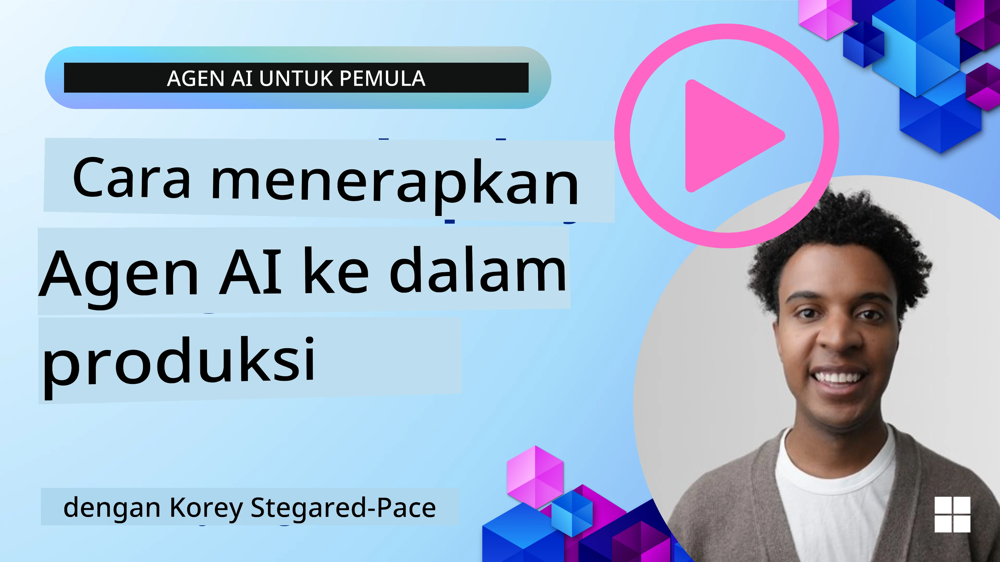

# Agen AI di Produksi: Observabilitas & Evaluasi

[](https://youtu.be/l4TP6IyJxmQ?si=reGOyeqjxFevyDq9)

Seiring agen AI bergerak dari prototipe eksperimental ke aplikasi dunia nyata, kemampuan untuk memahami perilaku mereka, memantau kinerja, dan mengevaluasi keluaran mereka secara sistematis menjadi penting.

## Tujuan Pembelajaran

Setelah menyelesaikan pelajaran ini, Anda akan tahu cara/memahami:
- Konsep inti observabilitas dan evaluasi agen
- Teknik untuk meningkatkan kinerja, biaya, dan efektivitas agen
- Apa dan bagaimana mengevaluasi agen AI Anda secara sistematis
- Cara mengendalikan biaya saat menerapkan agen AI ke produksi
- Cara menginstrumentasikan agen yang dibangun dengan AutoGen

Tujuannya adalah membekali Anda dengan pengetahuan untuk mengubah agen "kotak hitam" menjadi sistem yang transparan, dapat dikelola, dan dapat diandalkan.

_**Catatan:** Penting untuk menerapkan Agen AI yang aman dan dapat dipercaya. Lihat juga pelajaran [Membangun Agen AI yang Dapat Dipercaya](../06-building-trustworthy-agents/README.md)._

## Traces and Spans

Alat observabilitas seperti [Langfuse](https://langfuse.com/) atau [Microsoft Foundry](https://learn.microsoft.com/en-us/azure/ai-foundry/what-is-azure-ai-foundry) biasanya merepresentasikan jalannya agen sebagai traces dan spans.

- **Trace** merepresentasikan tugas agen lengkap dari awal sampai akhir (seperti menangani kueri pengguna).
- **Spans** adalah langkah-langkah individu di dalam trace (seperti memanggil model bahasa atau mengambil data).


Tanpa observabilitas, agen AI bisa terasa seperti "kotak hitam" — keadaan internal dan penalarannya tidak transparan, membuat sulit untuk mendiagnosis masalah atau mengoptimalkan kinerja. Dengan observabilitas, agen menjadi "kotak kaca", menawarkan transparansi yang penting untuk membangun kepercayaan dan memastikan mereka beroperasi sebagaimana dimaksud.

## Mengapa Observabilitas Penting di Lingkungan Produksi

Transisi agen AI ke lingkungan produksi memperkenalkan serangkaian tantangan dan kebutuhan baru. Observabilitas bukan lagi sesuatu yang "baik untuk dimiliki" tetapi kemampuan kritis:

*   **Debugging dan Analisis Akar Masalah**: Ketika agen gagal atau menghasilkan keluaran yang tidak terduga, alat observabilitas menyediakan trace yang diperlukan untuk menemukan sumber kesalahan. Ini sangat penting dalam agen kompleks yang mungkin melibatkan banyak panggilan LLM, interaksi alat, dan logika kondisional.
*   **Manajemen Latensi dan Biaya**: Agen AI sering bergantung pada LLM dan API eksternal lain yang ditagih per token atau per panggilan. Observabilitas memungkinkan pelacakan tepat dari panggilan-panggilan ini, membantu mengidentifikasi operasi yang terlalu lambat atau mahal. Ini memungkinkan tim untuk mengoptimalkan prompt, memilih model yang lebih efisien, atau merancang ulang alur kerja untuk mengelola biaya operasional dan memastikan pengalaman pengguna yang baik.
*   **Kepercayaan, Keamanan, dan Kepatuhan**: Dalam banyak aplikasi, penting untuk memastikan agen berperilaku aman dan etis. Observabilitas menyediakan jejak audit tindakan dan keputusan agen. Ini dapat digunakan untuk mendeteksi dan mengurangi isu seperti prompt injection, pembuatan konten berbahaya, atau penanganan informasi identitas pribadi (PII) yang tidak tepat. Misalnya, Anda dapat meninjau trace untuk memahami mengapa agen memberikan respons tertentu atau menggunakan alat spesifik.
*   **Loop Perbaikan Berkelanjutan**: Data observabilitas adalah dasar dari proses pengembangan iteratif. Dengan memantau bagaimana agen berkinerja di dunia nyata, tim dapat mengidentifikasi area untuk perbaikan, mengumpulkan data untuk fine-tuning model, dan memvalidasi dampak perubahan. Ini menciptakan loop umpan balik di mana wawasan produksi dari evaluasi online memberi informasi pada eksperimen dan penyempurnaan offline, sehingga meningkatkan kinerja agen secara bertahap.

## Metik Kunci yang Perlu Dilacak

Untuk memantau dan memahami perilaku agen, berbagai metrik dan sinyal harus dilacak. Meskipun metrik spesifik mungkin bervariasi berdasarkan tujuan agen, beberapa metrik bersifat universal penting.

Berikut beberapa metrik paling umum yang dipantau alat observabilitas:

**Latensi:** Seberapa cepat agen merespons? Waktu tunggu yang lama berdampak negatif pada pengalaman pengguna. Anda harus mengukur latensi untuk tugas dan langkah individu dengan menelusuri jalannya agen. Misalnya, agen yang membutuhkan 20 detik untuk semua panggilan model bisa dipercepat dengan menggunakan model yang lebih cepat atau menjalankan panggilan model secara paralel.

**Biaya:** Berapa biaya per jalannya agen? Agen AI bergantung pada panggilan LLM yang ditagih per token atau API eksternal. Penggunaan alat yang sering atau berbagai prompt dapat dengan cepat meningkatkan biaya. Misalnya, jika agen memanggil LLM lima kali untuk peningkatan kualitas yang marginal, Anda harus menilai apakah biaya tersebut sepadan atau apakah Anda bisa mengurangi jumlah panggilan atau menggunakan model yang lebih murah. Pemantauan waktu nyata juga dapat membantu mengidentifikasi lonjakan tak terduga (mis. bug yang menyebabkan loop API berlebihan).

**Kesalahan Permintaan:** Berapa banyak permintaan yang gagal dilakukan agen? Ini bisa mencakup kesalahan API atau panggilan alat yang gagal. Untuk membuat agen Anda lebih tangguh terhadap hal ini di produksi, Anda bisa menyiapkan fallback atau retry. Mis. jika penyedia LLM A down, Anda beralih ke penyedia LLM B sebagai cadangan.

**Umpan Balik Pengguna:** Mengimplementasikan evaluasi langsung dari pengguna memberikan wawasan berharga. Ini bisa termasuk peringkat eksplisit (👍suka/👎tidak suka, ⭐1-5 bintang) atau komentar tekstual. Umpan balik negatif yang konsisten harus memberi peringatan karena ini tanda bahwa agen tidak bekerja sebagaimana diharapkan.

**Umpan Balik Implisit Pengguna:** Perilaku pengguna memberikan umpan balik tidak langsung bahkan tanpa peringkat eksplisit. Ini bisa termasuk pengulangan pertanyaan segera, kueri berulang, atau mengklik tombol coba lagi. Mis. jika Anda melihat pengguna berulang kali menanyakan pertanyaan yang sama, ini tanda bahwa agen tidak bekerja sebagaimana diharapkan.

**Akurasi:** Seberapa sering agen menghasilkan keluaran yang benar atau diinginkan? Definisi akurasi bervariasi (mis. kebenaran pemecahan masalah, akurasi pengambilan informasi, kepuasan pengguna). Langkah pertama adalah mendefinisikan seperti apa keberhasilan untuk agen Anda. Anda dapat melacak akurasi melalui pemeriksaan otomatis, skor evaluasi, atau label penyelesaian tugas. Misalnya, menandai trace sebagai "succeeded" atau "failed".

**Metode Evaluasi Otomatis:** Anda juga dapat menyiapkan evaluasi otomatis. Misalnya, Anda dapat menggunakan LLM untuk memberi skor keluaran agen apakah itu membantu, akurat, atau tidak. Ada juga beberapa pustaka open source yang membantu Anda menilai berbagai aspek agen. Mis. [RAGAS](https://docs.ragas.io/) untuk agen RAG atau [LLM Guard](https://llm-guard.com/) untuk mendeteksi bahasa berbahaya atau prompt injection.

Dalam praktiknya, kombinasi metrik-metrik ini memberikan cakupan terbaik untuk kesehatan agen AI. Dalam [notebook contoh](./code_samples/10_autogen_evaluation.ipynb) pada bab ini, kami akan menunjukkan bagaimana metrik ini terlihat dalam contoh nyata tetapi pertama-tama, kita akan mempelajari bagaimana alur kerja evaluasi tipikal terlihat.

## Instrumentasikan Agen Anda

Untuk mengumpulkan data tracing, Anda perlu menginstrumentasikan kode Anda. Tujuannya adalah menginstrumentasikan kode agen untuk memancarkan trace dan metrik yang dapat ditangkap, diproses, dan divisualisasikan oleh platform observabilitas.

**OpenTelemetry (OTel):** [OpenTelemetry](https://opentelemetry.io/) telah muncul sebagai standar industri untuk observabilitas LLM. Ini menyediakan serangkaian API, SDK, dan alat untuk menghasilkan, mengumpulkan, dan mengekspor data telemetri.

Ada banyak pustaka instrumentasi yang membungkus framework agen yang ada dan memudahkan ekspor span OpenTelemetry ke alat observabilitas. Di bawah ini adalah contoh menginstrumentasikan agen AutoGen dengan [pustaka instrumentasi OpenLit](https://github.com/openlit/openlit):

```python
import openlit

openlit.init(tracer = langfuse._otel_tracer, disable_batch = True)
```

The [example notebook](./code_samples/10_autogen_evaluation.ipynb) in this chapter will demonstrate how to instrument your AutoGen agent.

**Pembuatan Span Manual:** Meskipun pustaka instrumentasi memberikan dasar yang baik, seringkali ada kasus di mana informasi yang lebih detail atau kustom diperlukan. Anda dapat membuat span secara manual untuk menambahkan logika aplikasi kustom. Lebih penting lagi, mereka dapat memperkaya span yang dibuat otomatis atau manual dengan atribut kustom (juga dikenal sebagai tag atau metadata). Atribut ini dapat mencakup data spesifik bisnis, perhitungan antara, atau konteks apa pun yang mungkin berguna untuk debugging atau analisis, seperti `user_id`, `session_id`, atau `model_version`.

Contoh membuat traces dan spans secara manual dengan [Langfuse Python SDK](https://langfuse.com/docs/sdk/python/sdk-v3): 

```python
from langfuse import get_client
 
langfuse = get_client()
 
span = langfuse.start_span(name="my-span")
 
span.end()
```

## Evaluasi Agen

Observabilitas memberi kita metrik, tetapi evaluasi adalah proses menganalisis data tersebut (dan melakukan pengujian) untuk menentukan seberapa baik agen AI berkinerja dan bagaimana ia dapat diperbaiki. Dengan kata lain, setelah Anda memiliki trace dan metrik itu, bagaimana Anda menggunakannya untuk menilai agen dan membuat keputusan?

Evaluasi rutin penting karena agen AI sering nondeterministik dan dapat berevolusi (melalui pembaruan atau perubahan perilaku model) – tanpa evaluasi, Anda tidak akan tahu apakah "agen pintar" Anda sebenarnya melakukan tugasnya dengan baik atau mengalami regresi.

Ada dua kategori evaluasi untuk agen AI: **evaluasi online** dan **evaluasi offline**. Keduanya berharga, dan saling melengkapi. Kami biasanya memulai dengan evaluasi offline, karena ini adalah langkah minimum yang diperlukan sebelum menerapkan agen apa pun.

### Evaluasi Offline


Ini melibatkan mengevaluasi agen dalam pengaturan terkontrol, biasanya menggunakan dataset pengujian, bukan kueri pengguna langsung. Anda menggunakan dataset kurasi di mana Anda tahu keluaran yang diharapkan atau perilaku yang benar, kemudian menjalankan agen Anda pada dataset tersebut.

Misalnya, jika Anda membangun agen pemecahan soal matematika, Anda mungkin memiliki [dataset pengujian](https://huggingface.co/datasets/gsm8k) berisi 100 soal dengan jawaban yang diketahui. Evaluasi offline sering dilakukan selama pengembangan (dan dapat menjadi bagian dari pipeline CI/CD) untuk memeriksa perbaikan atau mencegah regresi. Manfaatnya adalah bahwa ini **dapat diulang dan Anda dapat memperoleh metrik akurasi yang jelas karena Anda memiliki ground truth**. Anda juga dapat mensimulasikan kueri pengguna dan mengukur respons agen terhadap jawaban ideal atau menggunakan metrik otomatis seperti yang dijelaskan di atas.

Tantangan utama dengan evaluasi offline adalah memastikan dataset pengujian Anda komprehensif dan tetap relevan – agen mungkin berkinerja baik pada set uji tetap tetapi menghadapi kueri yang sangat berbeda di produksi. Oleh karena itu, Anda harus terus memperbarui set uji dengan kasus tepi baru dan contoh yang mencerminkan skenario dunia nyata​. Campuran dari kasus "smoke test" kecil dan set evaluasi yang lebih besar berguna: set kecil untuk pemeriksaan cepat dan set yang lebih besar untuk metrik kinerja yang lebih luas​.

### Evaluasi Online


Ini mengacu pada mengevaluasi agen di lingkungan hidup, dunia nyata, yaitu selama penggunaan sebenarnya di produksi. Evaluasi online melibatkan pemantauan kinerja agen pada interaksi pengguna nyata dan menganalisis hasilnya secara berkelanjutan.

Misalnya, Anda mungkin melacak tingkat keberhasilan, skor kepuasan pengguna, atau metrik lain pada lalu lintas langsung. Keuntungan evaluasi online adalah bahwa ini **menangkap hal-hal yang mungkin tidak Anda antisipasi di lingkungan lab** – Anda dapat mengamati drift model dari waktu ke waktu (jika efektivitas agen menurun saat pola input berubah) dan menangkap kueri atau situasi tak terduga yang tidak ada dalam data uji Anda​. Ini memberikan gambaran nyata tentang bagaimana agen berperilaku di lapangan.

Evaluasi online sering melibatkan pengumpulan umpan balik implisit dan eksplisit pengguna, seperti dibahas, dan mungkin menjalankan pengujian bayangan atau A/B test (di mana versi baru agen berjalan paralel untuk dibandingkan dengan versi lama). Tantangannya adalah seringkali sulit mendapatkan label atau skor yang dapat diandalkan untuk interaksi langsung – Anda mungkin mengandalkan umpan balik pengguna atau metrik hilir (seperti apakah pengguna mengklik hasil).

### Menggabungkan Keduanya

Evaluasi online dan offline tidak saling eksklusif; keduanya sangat saling melengkapi. Wawasan dari pemantauan online (mis. jenis kueri pengguna baru di mana agen berkinerja buruk) dapat digunakan untuk menambah dan meningkatkan dataset uji offline. Sebaliknya, agen yang berkinerja baik dalam uji offline kemudian dapat lebih percaya diri diterapkan dan dipantau secara online.

Bahkan, banyak tim mengadopsi loop:

_evaluasi offline -> terapkan -> pantau online -> kumpulkan kasus kegagalan baru -> tambahkan ke dataset offline -> perbaiki agen -> ulangi_.

## Masalah Umum

Saat Anda menerapkan agen AI ke produksi, Anda mungkin menghadapi berbagai tantangan. Berikut beberapa masalah umum dan solusi potensialnya:

| **Issue**    | **Potential Solution**   |
| ------------- | ------------------ |
| AI Agent not performing tasks consistently | - Refine the prompt given to the AI Agent; be clear on objectives.<br>- Identify where dividing the tasks into subtasks and handling them by multiple agents can help. |
| AI Agent running into continuous loops  | - Ensure you have clear termination terms and conditions so the Agent knows when to stop the process.<br>- For complex tasks that require reasoning and planning, use a larger model that is specialized for reasoning tasks. |
| AI Agent tool calls are not performing well   | - Test and validate the tool's output outside of the agent system.<br>- Refine the defined parameters, prompts, and naming of tools.  |
| Multi-Agent system not performing consistently | - Refine prompts given to each agent to ensure they are specific and distinct from one another.<br>- Build a hierarchical system using a "routing" or controller agent to determine which agent is the correct one. |

Banyak masalah ini dapat diidentifikasi lebih efektif dengan observabilitas yang diterapkan. Trace dan metrik yang kita bahas sebelumnya membantu menentukan tepat di mana dalam alur kerja agen masalah terjadi, membuat debugging dan optimisasi jauh lebih efisien.

## Mengelola Biaya
Berikut beberapa strategi untuk mengelola biaya penerapan agen AI ke produksi:

**Menggunakan Model yang Lebih Kecil:** Model Bahasa Kecil (SLMs) dapat berkinerja baik pada beberapa kasus penggunaan agen tertentu dan akan mengurangi biaya secara signifikan. Seperti disebutkan sebelumnya, membangun sistem evaluasi untuk menentukan dan membandingkan kinerja dibandingkan model yang lebih besar adalah cara terbaik untuk memahami seberapa baik SLMs akan bekerja pada kasus penggunaan Anda. Pertimbangkan menggunakan SLMs untuk tugas yang lebih sederhana seperti klasifikasi intent atau ekstraksi parameter, sementara menyimpan model yang lebih besar untuk penalaran yang kompleks.

**Menggunakan Model Router:** Strategi serupa adalah menggunakan beragam model dan ukuran. Anda dapat menggunakan LLM/SLM atau fungsi serverless untuk mengarahkan permintaan berdasarkan kompleksitas ke model yang paling sesuai. Ini juga akan membantu mengurangi biaya sekaligus memastikan kinerja pada tugas yang tepat. Misalnya, arahkan kueri sederhana ke model yang lebih kecil dan lebih cepat, dan hanya gunakan model besar yang mahal untuk tugas penalaran yang kompleks.

**Menyimpan Respons dalam Cache:** Mengidentifikasi permintaan dan tugas yang umum serta menyediakan responsnya sebelum mereka melewati sistem agen Anda adalah cara yang baik untuk mengurangi volume permintaan serupa. Anda bahkan dapat mengimplementasikan alur untuk mengidentifikasi seberapa mirip suatu permintaan dengan permintaan yang disimpan di cache menggunakan model AI yang lebih dasar. Strategi ini dapat secara signifikan mengurangi biaya untuk pertanyaan yang sering diajukan atau alur kerja umum.

## Mari lihat bagaimana ini bekerja dalam praktik

Dalam [notebook contoh pada bagian ini](./code_samples/10_autogen_evaluation.ipynb), kita akan melihat contoh bagaimana kita dapat menggunakan alat observabilitas untuk memantau dan mengevaluasi agen kita.


### Punya Pertanyaan Lagi tentang Agen AI di Produksi?

Bergabunglah dengan [Microsoft Foundry Discord](https://aka.ms/ai-agents/discord) untuk bertemu dengan pelajar lain, menghadiri jam kantor dan mendapatkan jawaban atas pertanyaan Anda tentang Agen AI.

## Pelajaran Sebelumnya

[Pola Desain Metakognisi](../09-metacognition/README.md)

## Pelajaran Berikutnya

[Protokol Agen](../11-agentic-protocols/README.md)

---

<!-- CO-OP TRANSLATOR DISCLAIMER START -->
Penafian:
Dokumen ini telah diterjemahkan menggunakan layanan terjemahan AI Co-op Translator (https://github.com/Azure/co-op-translator). Meskipun kami berupaya seakurat mungkin, harap diperhatikan bahwa terjemahan otomatis dapat mengandung kesalahan atau ketidakakuratan. Dokumen asli dalam bahasa aslinya harus dianggap sebagai sumber yang berwenang. Untuk informasi penting, disarankan menggunakan jasa penerjemah manusia profesional. Kami tidak bertanggung jawab atas segala kesalahpahaman atau penafsiran yang salah yang timbul dari penggunaan terjemahan ini.
<!-- CO-OP TRANSLATOR DISCLAIMER END -->