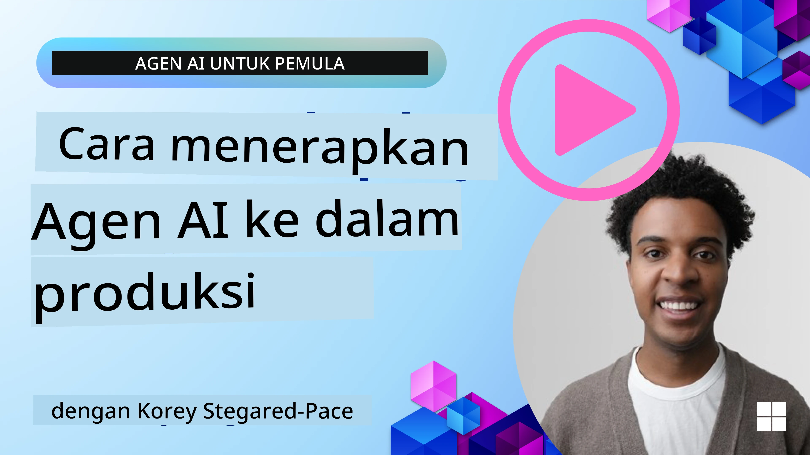

# Agen AI dalam Produksi: Observabilitas & Evaluasi

[](https://youtu.be/l4TP6IyJxmQ?si=reGOyeqjxFevyDq9)

Seiring agen AI bergerak dari prototipe eksperimental ke aplikasi dunia nyata, kemampuan untuk memahami perilaku mereka, memantau kinerja mereka, dan secara sistematis mengevaluasi keluaran mereka menjadi penting.

## Tujuan Pembelajaran

Setelah menyelesaikan pelajaran ini, Anda akan mengetahui/belum memahami:
- Konsep inti dari observabilitas dan evaluasi agen
- Teknik untuk meningkatkan kinerja, biaya, dan efektivitas agen
- Apa dan bagaimana mengevaluasi agen AI Anda secara sistematis
- Cara mengontrol biaya saat menerapkan agen AI ke produksi
- Cara menginstrumen agen yang dibangun dengan Microsoft Agent Framework

Tujuannya adalah untuk membekali Anda dengan pengetahuan untuk mengubah agen "kotak hitam" Anda menjadi sistem yang transparan, dapat dikelola, dan dapat diandalkan.

_**Catatan:** Penting untuk menerapkan Agen AI yang aman dan dapat dipercaya. Lihat juga pelajaran [Building Trustworthy AI Agents](../06-building-trustworthy-agents/README.md)._

## Jejak dan Rentang

Alat observabilitas seperti [Langfuse](https://langfuse.com/) atau [Microsoft Foundry](https://learn.microsoft.com/en-us/azure/ai-foundry/what-is-azure-ai-foundry) biasanya merepresentasikan proses agen sebagai jejak dan rentang.

- **Jejak** merepresentasikan tugas agen lengkap dari awal hingga akhir (seperti menangani permintaan pengguna).
- **Rentang** adalah langkah individu dalam jejak (seperti memanggil model bahasa atau mengambil data).


<!-- Image URL retained for illustration purposes -->

Tanpa observabilitas, agen AI bisa terasa seperti "kotak hitam" – keadaan internal dan proses berpikirnya tidak transparan, membuat sulit untuk mendiagnosis masalah atau mengoptimalkan kinerja. Dengan observabilitas, agen menjadi "kotak kaca," menawarkan transparansi yang penting untuk membangun kepercayaan dan memastikan mereka beroperasi sebagaimana mestinya.

## Mengapa Observabilitas Penting di Lingkungan Produksi

Memindahkan agen AI ke lingkungan produksi memperkenalkan serangkaian tantangan dan persyaratan baru. Observabilitas bukan lagi "keinginan" tapi kemampuan penting:

*   **Debugging dan Analisis Akar Masalah**: Saat agen gagal atau menghasilkan keluaran tak terduga, alat observabilitas menyediakan jejak yang dibutuhkan untuk menemukan sumber kesalahan. Ini sangat penting dalam agen kompleks yang mungkin melibatkan beberapa panggilan LLM, interaksi alat, dan logika kondisional.
*   **Manajemen Latensi dan Biaya**: Agen AI sering bergantung pada LLM dan API eksternal lain yang dibayar per token atau panggilan. Observabilitas memungkinkan pelacakan tepat dari panggilan ini, membantu mengidentifikasi operasi yang terlalu lambat atau mahal. Ini memungkinkan tim untuk mengoptimalkan prompt, memilih model yang lebih efisien, atau mendesain ulang alur kerja untuk mengelola biaya operasional dan memastikan pengalaman pengguna yang baik.
*   **Kepercayaan, Keamanan, dan Kepatuhan**: Dalam banyak aplikasi, penting untuk memastikan agen berperilaku dengan aman dan etis. Observabilitas menyediakan jejak audit dari tindakan dan keputusan agen. Ini dapat digunakan untuk mendeteksi dan mengurangi masalah seperti injeksi prompt, pembuatan konten berbahaya, atau penanganan data pribadi (PII) yang tidak tepat. Misalnya, Anda bisa meninjau jejak untuk memahami mengapa agen memberikan respons tertentu atau menggunakan alat spesifik.
*   **Siklus Peningkatan Berkelanjutan**: Data observabilitas adalah dasar dari proses pengembangan iteratif. Dengan memantau kinerja agen di dunia nyata, tim dapat mengidentifikasi area untuk perbaikan, mengumpulkan data untuk penyesuaian model, dan memvalidasi dampak perubahan. Ini menciptakan siklus umpan balik dimana wawasan produksi dari evaluasi online menginformasikan eksperimen offline dan penyempurnaan, menghasilkan kinerja agen yang semakin baik.

## Metrik Utama yang Harus Dipantau

Untuk memantau dan memahami perilaku agen, sejumlah metrik dan sinyal harus dipantau. Meskipun metrik spesifik bisa berbeda tergantung tujuan agen, beberapa penting secara universal.

Berikut beberapa metrik paling umum yang dipantau oleh alat observabilitas:

**Latensi:** Seberapa cepat agen merespons? Waktu tunggu yang lama berdampak negatif pada pengalaman pengguna. Anda harus mengukur latensi untuk tugas dan langkah individual dengan melacak jalannya agen. Misalnya, agen yang membutuhkan 20 detik untuk semua panggilan model dapat dipercepat dengan menggunakan model yang lebih cepat atau menjalankan panggilan model secara paralel.

**Biaya:** Berapa biaya per sesi agen? Agen AI bergantung pada panggilan LLM yang dihitung per token atau API eksternal. Penggunaan alat yang sering atau banyak prompt bisa dengan cepat menaikkan biaya. Contohnya, jika agen memanggil LLM lima kali untuk perbaikan kualitas kecil, Anda harus menilai apakah biaya tersebut sepadan atau bisa mengurangi jumlah panggilan atau menggunakan model yang lebih murah. Pemantauan waktu nyata juga membantu mengidentifikasi lonjakan tak terduga (misalnya, bug yang menyebabkan loop API berlebihan).

**Kesalahan Permintaan:** Berapa banyak permintaan yang gagal dilakukan agen? Ini bisa termasuk kesalahan API atau panggilan alat yang gagal. Agar agen lebih tangguh di produksi, Anda bisa mengatur fallback atau pengulangan. Misalnya, jika penyedia LLM A gagal, Anda beralih ke penyedia LLM B sebagai cadangan.

**Umpan Balik Pengguna:** Implementasi evaluasi pengguna langsung memberikan wawasan berharga. Ini bisa mencakup penilaian eksplisit (👍setuju/👎tidak setuju, ⭐1-5 bintang) atau komentar teks. Umpan balik negatif yang konsisten harus menjadi peringatan karena itu tanda agen tidak bekerja seperti yang diharapkan.

**Umpan Balik Pengguna Implisit:** Perilaku pengguna memberikan umpan balik tidak langsung bahkan tanpa penilaian eksplisit. Ini bisa termasuk pengulangan pertanyaan segera, pertanyaan berulang atau mengklik tombol ulang. Misalnya, jika Anda melihat pengguna terus-menerus menanyakan pertanyaan yang sama, ini tanda agen tidak bekerja seperti yang diinginkan.

**Akurasi:** Seberapa sering agen menghasilkan keluaran yang benar atau diinginkan? Definisi akurasi bervariasi (misalnya, ketepatan pemecahan masalah, ketepatan pengambilan informasi, kepuasan pengguna). Langkah pertama adalah menentukan seperti apa keberhasilan untuk agen Anda. Anda dapat memantau akurasi melalui pengecekan otomatis, skor evaluasi, atau label penyelesaian tugas. Misalnya, menandai jejak sebagai "berhasil" atau "gagal".

**Metrik Evaluasi Otomatis:** Anda juga dapat mengatur evaluasi otomatis. Misalnya, Anda bisa menggunakan LLM untuk menilai keluaran agen apakah membantu, akurat, atau tidak. Ada juga beberapa pustaka sumber terbuka yang membantu Anda menilai berbagai aspek agen. Misalnya [RAGAS](https://docs.ragas.io/) untuk agen RAG atau [LLM Guard](https://llm-guard.com/) untuk mendeteksi bahasa berbahaya atau injeksi prompt.

Dalam praktiknya, kombinasi metrik ini memberikan cakupan terbaik untuk kesehatan agen AI. Dalam [notebook contoh](./code_samples/10-expense_claim-demo.ipynb) bab ini, kami akan menunjukkan bagaimana metrik ini terlihat pada contoh nyata, tetapi terlebih dahulu kita akan pelajari bagaimana alur kerja evaluasi tipikal berlangsung.

## Instrumen Agen Anda

Untuk mengumpulkan data jejak, Anda perlu menginstrumen kode Anda. Tujuannya adalah menginstrumen kode agen untuk mengeluarkan jejak dan metrik yang dapat ditangkap, diproses, dan divisualisasikan oleh platform observabilitas.

**OpenTelemetry (OTel):** [OpenTelemetry](https://opentelemetry.io/) telah menjadi standar industri untuk observabilitas LLM. Ia menyediakan sekumpulan API, SDK, dan alat untuk menghasilkan, mengumpulkan, dan mengekspor data telemetri.

Ada banyak pustaka instrumentasi yang membungkus framework agen yang ada dan memudahkan ekspor rentang OpenTelemetry ke alat observabilitas. Microsoft Agent Framework terintegrasi dengan OpenTelemetry secara native. Berikut ini contoh menginstrumen agen MAF:

```python
from agent_framework.observability import get_tracer, get_meter

tracer = get_tracer()
meter = get_meter()

with tracer.start_as_current_span("agent_run"):
    # Eksekusi agen dilacak secara otomatis
    pass
```

[notebook contoh](./code_samples/10-expense_claim-demo.ipynb) dalam bab ini akan menunjukkan cara menginstrumen agen MAF Anda.

**Pembuatan Rentang Manual:** Walaupun pustaka instrumentasi menyediakan dasar yang baik, seringkali ada kasus dimana informasi yang lebih rinci atau khusus diperlukan. Anda dapat membuat rentang secara manual untuk menambahkan logika aplikasi khusus. Lebih penting lagi, rentang yang dibuat otomatis atau manual dapat diperkaya dengan atribut khusus (juga dikenal sebagai tag atau metadata). Atribut ini bisa berupa data spesifik bisnis, perhitungan antara, atau konteks apa pun yang berguna untuk debugging atau analisis, seperti `user_id`, `session_id`, atau `model_version`.

Contoh membuat jejak dan rentang secara manual dengan [Langfuse Python SDK](https://langfuse.com/docs/sdk/python/sdk-v3):

```python
from langfuse import get_client
 
langfuse = get_client()
 
span = langfuse.start_span(name="my-span")
 
span.end()
```

## Evaluasi Agen

Observabilitas memberi kita metrik, tetapi evaluasi adalah proses menganalisis data itu (dan melakukan pengujian) untuk menentukan seberapa baik agen AI berperforma dan bagaimana bisa diperbaiki. Dengan kata lain, setelah Anda memiliki jejak dan metrik itu, bagaimana Anda menggunakannya untuk menilai agen dan membuat keputusan?

Evaluasi secara rutin penting karena agen AI sering non-deterministik dan dapat berkembang (melalui pembaruan atau perilaku model yang bergeser) – tanpa evaluasi, Anda tidak tahu apakah "agen pintar" Anda benar-benar melakukan pekerjaannya dengan baik atau mengalami kemunduran.

Ada dua kategori evaluasi untuk agen AI: **evaluasi online** dan **evaluasi offline**. Keduanya berharga dan saling melengkapi. Biasanya kita mulai dengan evaluasi offline, karena ini langkah minimum yang diperlukan sebelum menerapkan agen apa pun.

### Evaluasi Offline


Ini melibatkan evaluasi agen dalam pengaturan yang terkendali, biasanya menggunakan dataset uji, bukan permintaan pengguna langsung. Anda menggunakan dataset yang dikurasi dimana Anda tahu keluaran yang diharapkan atau perilaku yang benar, lalu menjalankan agen Anda pada dataset tersebut.

Misalnya, jika Anda membuat agen pemecah soal matematika, Anda mungkin memiliki [dataset uji](https://huggingface.co/datasets/gsm8k) berisi 100 soal dengan jawaban yang diketahui. Evaluasi offline sering dilakukan selama pengembangan (dan bisa menjadi bagian dari pipeline CI/CD) untuk memeriksa perbaikan atau mencegah kemunduran. Keuntungannya adalah **hasilnya dapat diulangi dan Anda dapat memperoleh metrik akurasi yang jelas karena Anda memiliki kebenaran dasar**. Anda juga dapat mensimulasikan pertanyaan pengguna dan mengukur respons agen terhadap jawaban ideal atau menggunakan metrik otomatis seperti dijelaskan di atas.

Tantangan utama evaluasi offline adalah memastikan dataset uji Anda komprehensif dan tetap relevan – agen mungkin tampil baik pada set uji tetap tapi menemui pertanyaan yang sangat berbeda di produksi. Oleh karena itu, Anda harus terus memperbarui set uji dengan kasus tepi dan contoh baru yang mencerminkan skenario dunia nyata​. Campuran kasus kecil "smoke test" dan set evaluasi yang lebih besar sangat berguna: set kecil untuk pemeriksaan cepat dan yang besar untuk metrik kinerja yang lebih luas​.

### Evaluasi Online


Ini mengacu pada evaluasi agen di lingkungan hidup dan dunia nyata, yaitu selama penggunaan sebenarnya di produksi. Evaluasi online melibatkan pemantauan kinerja agen pada interaksi pengguna nyata dan analisis hasil secara berkelanjutan.

Misalnya, Anda mungkin memantau tingkat keberhasilan, skor kepuasan pengguna, atau metrik lain pada trafik nyata. Keuntungan evaluasi online adalah **menangkap hal-hal yang mungkin tidak Anda duga di laboratorium** – Anda bisa mengamati pergeseran model dari waktu ke waktu (jika efektivitas agen menurun saat pola input berubah) dan menangkap pertanyaan atau situasi tak terduga yang tidak ada di data uji​. Ini memberikan gambaran nyata bagaimana agen berperilaku di lapangan.

Evaluasi online sering melibatkan pengumpulan umpan balik pengguna implisit dan eksplisit, seperti dibahas, dan mungkin menjalankan tes bayangan atau tes A/B (dimana versi baru agen berjalan paralel untuk dibandingkan dengan versi lama). Tantangannya adalah sulit mendapatkan label atau skor yang andal untuk interaksi langsung – Anda mungkin bergantung pada umpan balik pengguna atau metrik hilir (misalnya apakah pengguna mengklik hasil).

### Menggabungkan keduanya

Evaluasi online dan offline tidak saling meniadakan; keduanya sangat melengkapi. Wawasan dari pemantauan online (misalnya tipe pertanyaan pengguna baru dimana agen tampil buruk) dapat digunakan untuk menambah dan memperbaiki dataset uji offline. Sebaliknya, agen yang tampil baik di uji offline dapat diterapkan dengan lebih percaya diri dan dipantau secara online.

Bahkan, banyak tim mengadopsi siklus:

_evaluasi offline -> deploy -> monitor online -> kumpulkan kasus kegagalan baru -> tambah ke dataset offline -> perbaiki agen -> ulangi_.

## Masalah Umum

Saat Anda menerapkan agen AI ke produksi, Anda mungkin menemui berbagai tantangan. Berikut beberapa masalah umum dan solusi potensialnya:

| **Masalah**    | **Solusi Potensial**   |
| ------------- | ------------------ |
| Agen AI tidak menjalankan tugas secara konsisten | - Perbaiki prompt yang diberikan ke Agen AI; jelaskan tujuan.<br>- Identifikasi jika membagi tugas menjadi subtugas dan ditangani beberapa agen dapat membantu. |
| Agen AI mengalami loop berulang  | - Pastikan Anda memiliki ketentuan penghentian yang jelas sehingga Agen tahu kapan proses berhenti.<br>- Untuk tugas kompleks yang memerlukan penalaran dan perencanaan, gunakan model yang lebih besar dan khusus untuk tugas penalaran. |
| Panggilan alat agen AI tidak berjalan baik   | - Uji dan validasi keluaran alat di luar sistem agen.<br>- Perbaiki parameter, prompt, dan penamaan alat yang ditentukan.  |
| Sistem Multi-Agen tidak konsisten | - Perbaiki prompt yang diberikan ke setiap agen agar spesifik dan berbeda satu sama lain.<br>- Bangun sistem hierarkis menggunakan agen "routing" atau controller untuk menentukan agen yang tepat. |

Banyak masalah ini dapat diidentifikasi lebih efektif dengan adanya observabilitas. Jejak dan metrik yang kita bahas sebelumnya membantu menemukan dengan tepat di mana masalah terjadi dalam alur kerja agen, membuat debugging dan optimasi lebih efisien.

## Mengelola Biaya


Berikut adalah beberapa strategi untuk mengelola biaya penerapan agen AI ke produksi:

**Menggunakan Model yang Lebih Kecil:** Small Language Models (SLM) dapat bekerja dengan baik pada kasus penggunaan agen tertentu dan akan mengurangi biaya secara signifikan. Seperti yang disebutkan sebelumnya, membangun sistem evaluasi untuk menentukan dan membandingkan kinerja dibandingkan model yang lebih besar adalah cara terbaik untuk memahami seberapa baik SLM akan bekerja pada kasus penggunaan Anda. Pertimbangkan menggunakan SLM untuk tugas yang lebih sederhana seperti klasifikasi intent atau ekstraksi parameter, sementara model yang lebih besar digunakan untuk penalaran yang kompleks.

**Menggunakan Model Router:** Strategi serupa adalah menggunakan berbagai model dan ukuran. Anda dapat menggunakan LLM/SLM atau fungsi tanpa server untuk mengarahkan permintaan berdasarkan kompleksitas ke model yang paling sesuai. Ini juga akan membantu mengurangi biaya sekaligus memastikan kinerja pada tugas yang tepat. Misalnya, arahkan kueri sederhana ke model yang lebih kecil dan lebih cepat, dan gunakan model besar yang mahal hanya untuk tugas penalaran yang kompleks.

**Caching Respon:** Mengidentifikasi permintaan dan tugas umum serta menyediakan respon sebelum mereka melalui sistem agen Anda adalah cara yang baik untuk mengurangi volume permintaan serupa. Anda bahkan dapat menerapkan alur untuk mengidentifikasi seberapa mirip suatu permintaan dengan permintaan yang sudah di-cache menggunakan model AI yang lebih dasar. Strategi ini dapat mengurangi biaya secara signifikan untuk pertanyaan yang sering diajukan atau alur kerja umum.

## Mari kita lihat bagaimana ini bekerja dalam praktik

Dalam [notebook contoh dari bagian ini](./code_samples/10-expense_claim-demo.ipynb), kita akan melihat contoh bagaimana kita dapat menggunakan alat observabilitas untuk memantau dan mengevaluasi agen kita.


### Punya Pertanyaan Lebih Lanjut tentang Agen AI di Produksi?

Bergabunglah dengan [Microsoft Foundry Discord](https://discord.com/invite/ATgtXmAS5D) untuk bertemu dengan pelajar lain, menghadiri jam kantor, dan mendapatkan jawaban untuk pertanyaan Anda tentang Agen AI.

## Pelajaran Sebelumnya

[Metacognition Design Pattern](../09-metacognition/README.md)

## Pelajaran Berikutnya

[Agentic Protocols](../11-agentic-protocols/README.md)

---

<!-- CO-OP TRANSLATOR DISCLAIMER START -->
**Penafian**:
Dokumen ini telah diterjemahkan menggunakan layanan terjemahan AI [Co-op Translator](https://github.com/Azure/co-op-translator). Meskipun kami berupaya untuk mencapai akurasi, harap diketahui bahwa terjemahan otomatis mungkin mengandung kesalahan atau ketidakakuratan. Dokumen asli dalam bahasa aslinya harus dianggap sebagai sumber yang sah. Untuk informasi penting, disarankan menggunakan terjemahan profesional oleh manusia. Kami tidak bertanggung jawab atas kesalahpahaman atau penafsiran yang keliru yang timbul dari penggunaan terjemahan ini.
<!-- CO-OP TRANSLATOR DISCLAIMER END -->