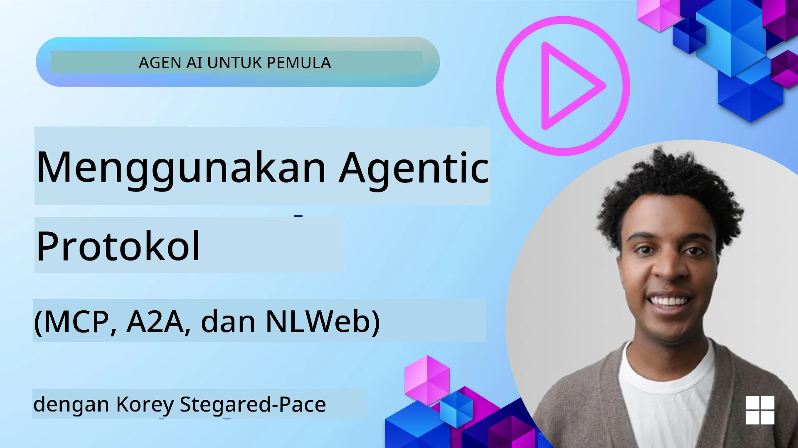
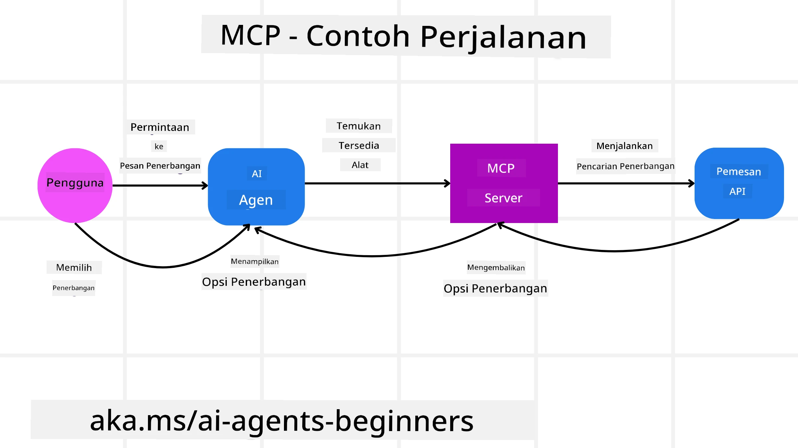
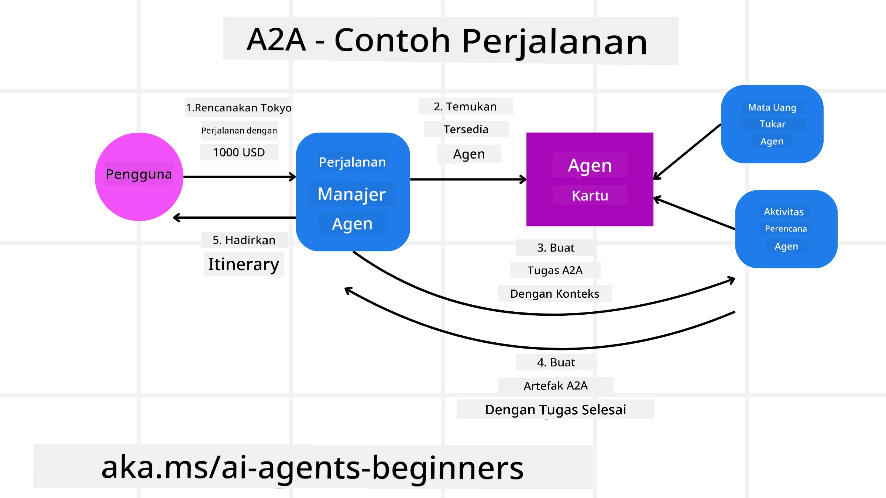
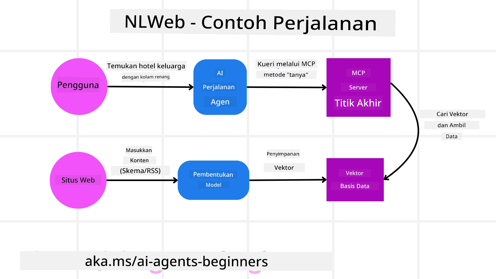

# Menggunakan Protokol Agentik (MCP, A2A dan NLWeb)

> _(Klik gambar di atas untuk melihat video pelajaran ini)_

Seiring meningkatnya penggunaan agen AI, kebutuhan akan protokol yang memastikan standardisasi, keamanan, dan mendukung inovasi terbuka juga meningkat. Dalam pelajaran ini, kita akan membahas 3 protokol yang bertujuan memenuhi kebutuhan ini - Model Context Protocol (MCP), Agent to Agent (A2A) dan Natural Language Web (NLWeb).

## Pengenalan

Dalam pelajaran ini, kita akan membahas:

• Bagaimana **MCP** memungkinkan Agen AI mengakses alat dan data eksternal untuk menyelesaikan tugas pengguna.

•  Bagaimana **A2A** memungkinkan komunikasi dan kolaborasi antar agen AI yang berbeda.

• Bagaimana **NLWeb** menghadirkan antarmuka bahasa alami ke situs web apa pun sehingga Agen AI dapat menemukan dan berinteraksi dengan konten tersebut.

## Tujuan Pembelajaran

• **Mengidentifikasi** tujuan inti dan manfaat MCP, A2A, dan NLWeb dalam konteks agen AI.

• **Menjelaskan** bagaimana masing-masing protokol memfasilitasi komunikasi dan interaksi antara LLM, alat, dan agen lain.

• **Mengenali** peran berbeda yang dimainkan setiap protokol dalam membangun sistem agenis yang kompleks.

## Model Context Protocol

**Model Context Protocol (MCP)** adalah standar terbuka yang menyediakan cara terstandarisasi bagi aplikasi untuk menyediakan konteks dan alat kepada LLM. Ini memungkinkan "adaptor universal" ke berbagai sumber data dan alat yang dapat dihubungkan oleh Agen AI dengan cara yang konsisten.

Mari kita lihat komponen MCP, manfaat dibandingkan penggunaan API langsung, dan contoh bagaimana agen AI mungkin menggunakan server MCP.

### Komponen Inti MCP

MCP beroperasi pada **arsitektur klien-server** dan komponen inti adalah:

• **Hosts** adalah aplikasi LLM (misalnya editor kode seperti VSCode) yang memulai koneksi ke Server MCP.

• **Clients** adalah komponen dalam aplikasi host yang mempertahankan koneksi satu-ke-satu dengan server.

• **Servers** adalah program ringan yang mengekspos kapabilitas spesifik.

Termasuk dalam protokol adalah tiga primitif inti yang merupakan kapabilitas Server MCP:

• **Tools**: Ini adalah aksi atau fungsi diskret yang dapat dipanggil oleh agen AI untuk melakukan tindakan. Misalnya, layanan cuaca mungkin mengekspos tool "get weather", atau server e-commerce mungkin mengekspos tool "purchase product". Server MCP mengiklankan nama tool, deskripsi, dan skema input/output masing-masing dalam daftar kapabilitas mereka.

• **Resources**: Ini adalah item data hanya-baca atau dokumen yang dapat disediakan oleh server MCP, dan klien dapat mengambilnya sesuai permintaan. Contohnya termasuk isi file, catatan database, atau file log. Resources bisa berupa teks (seperti kode atau JSON) atau biner (seperti gambar atau PDF).

• **Prompts**: Ini adalah templat yang telah ditentukan yang memberikan saran prompt, memungkinkan alur kerja yang lebih kompleks.

### Manfaat MCP

MCP menawarkan keuntungan signifikan bagi Agen AI:

• **Penemuan Tool Dinamis**: Agen dapat secara dinamis menerima daftar tool yang tersedia dari server beserta deskripsi apa yang dilakukan. Ini berbeda dengan API tradisional, yang sering memerlukan pengkodean statis untuk integrasi, berarti setiap perubahan API memerlukan pembaruan kode. MCP menawarkan pendekatan "integrasi sekali", yang menghasilkan kemampuan adaptasi yang lebih besar.

• **Interoperabilitas Antar LLM**: MCP bekerja lintas berbagai LLM, memberikan fleksibilitas untuk beralih model inti untuk mengevaluasi kinerja yang lebih baik.

• **Keamanan Terstandarisasi**: MCP memasukkan metode autentikasi standar, meningkatkan skalabilitas saat menambahkan akses ke server MCP tambahan. Ini lebih sederhana daripada mengelola berbagai kunci dan jenis autentikasi untuk berbagai API tradisional.

### Contoh MCP

Bayangkan seorang pengguna ingin memesan penerbangan menggunakan asisten AI yang didukung oleh MCP.

1. **Koneksi**: Asisten AI (klien MCP) terhubung ke server MCP yang disediakan oleh maskapai penerbangan.

2. **Penemuan Tool**: Klien menanyakan ke server MCP maskapai, "Tool apa saja yang tersedia?" Server merespons dengan tool seperti "search flights" dan "book flights".

3. **Pemanggilan Tool**: Anda kemudian meminta asisten AI, "Tolong cari penerbangan dari Portland ke Honolulu." Asisten AI, menggunakan LLM-nya, mengidentifikasi bahwa ia perlu memanggil tool "search flights" dan meneruskan parameter yang relevan (asal, tujuan) ke server MCP.

4. **Eksekusi dan Respon**: Server MCP, berperan sebagai pembungkus, melakukan panggilan aktual ke API pemesanan internal maskapai. Kemudian menerima informasi penerbangan (misalnya data JSON) dan mengirimkannya kembali ke asisten AI.

5. **Interaksi Lanjutan**: Asisten AI menyajikan opsi penerbangan. Setelah Anda memilih penerbangan, asisten mungkin memanggil tool "book flight" pada server MCP yang sama, menyelesaikan pemesanan.

## Agent-to-Agent Protocol (A2A)

Sementara MCP berfokus pada menghubungkan LLM ke alat, **Agent-to-Agent (A2A) protocol** melangkah lebih jauh dengan memungkinkan komunikasi dan kolaborasi antar agen AI yang berbeda. A2A menghubungkan agen AI di berbagai organisasi, lingkungan, dan tumpukan teknologi untuk menyelesaikan tugas bersama.

Kita akan memeriksa komponen dan manfaat A2A, beserta contoh bagaimana ini dapat diterapkan dalam aplikasi perjalanan kita.

### Komponen Inti A2A

A2A berfokus pada memungkinkan komunikasi antar agen dan membuat mereka bekerja bersama untuk menyelesaikan subtask pengguna. Setiap komponen protokol berkontribusi pada hal ini:

#### Agent Card

Mirip dengan bagaimana server MCP berbagi daftar tool, Agent Card memiliki:
- Nama Agen.
- **deskripsi tugas umum** yang dilakukannya.
- **daftar keterampilan spesifik** dengan deskripsi untuk membantu agen lain (atau bahkan pengguna manusia) memahami kapan dan mengapa mereka ingin memanggil agen tersebut.
- **Endpoint URL saat ini** dari agen
- **versi** dan **kapabilitas** agen seperti streaming respon dan notifikasi push.

#### Agent Executor

Agent Executor bertanggung jawab untuk **meneruskan konteks percakapan pengguna ke agen jarak jauh**, agen jarak jauh membutuhkan ini untuk memahami tugas yang harus diselesaikan. Dalam server A2A, sebuah agen menggunakan Large Language Model (LLM) miliknya sendiri untuk mengurai permintaan masuk dan mengeksekusi tugas menggunakan alat internalnya sendiri.

#### Artifact

Setelah agen jarak jauh menyelesaikan tugas yang diminta, produk kerjanya dibuat sebagai artifact. Sebuah artifact **mengandung hasil kerja agen**, **deskripsi apa yang diselesaikan**, dan **konteks teks** yang dikirim melalui protokol. Setelah artifact dikirim, koneksi dengan agen jarak jauh ditutup sampai diperlukan lagi.

#### Event Queue

Komponen ini digunakan untuk **menangani pembaruan dan meneruskan pesan**. Ini sangat penting dalam produksi untuk sistem agenis agar mencegah koneksi antar agen ditutup sebelum tugas selesai, terutama ketika waktu penyelesaian tugas bisa memakan waktu lebih lama.

### Manfaat A2A

• **Kolaborasi yang Ditingkatkan**: Ini memungkinkan agen dari vendor dan platform berbeda untuk berinteraksi, berbagi konteks, dan bekerja sama, memfasilitasi otomasi yang mulus di seluruh sistem yang secara tradisional terpisah.

• **Fleksibilitas Pemilihan Model**: Setiap agen A2A dapat memutuskan LLM mana yang digunakannya untuk melayani permintaan, memungkinkan model yang dioptimalkan atau disesuaikan per agen, berbeda dengan satu koneksi LLM tunggal dalam beberapa skenario MCP.

• **Autentikasi Terintegrasi**: Autentikasi diintegrasikan langsung ke dalam protokol A2A, menyediakan kerangka keamanan yang kuat untuk interaksi antar agen.

### Contoh A2A

Mari perluas skenario pemesanan perjalanan kita, tetapi kali ini menggunakan A2A.

1. **Permintaan Pengguna ke Multi-Agen**: Seorang pengguna berinteraksi dengan klien/agen A2A "Travel Agent", mungkin dengan mengatakan, "Tolong pesan seluruh perjalanan ke Honolulu untuk minggu depan, termasuk penerbangan, hotel, dan mobil sewaan".

2. **Orkestrasi oleh Travel Agent**: Travel Agent menerima permintaan kompleks ini. Ia menggunakan LLM-nya untuk merenungkan tugas dan menentukan bahwa ia perlu berinteraksi dengan agen khusus lainnya.

3. **Komunikasi Antar Agen**: Travel Agent kemudian menggunakan protokol A2A untuk terhubung ke agen hilir, seperti "Airline Agent", "Hotel Agent", dan "Car Rental Agent" yang dibuat oleh perusahaan berbeda.

4. **Eksekusi Tugas yang Didelegasikan**: Travel Agent mengirim tugas spesifik ke agen-agen khusus ini (mis., "Cari penerbangan ke Honolulu," "Pesan hotel," "Sewa mobil"). Masing-masing agen khusus ini, menjalankan LLM mereka sendiri dan memanfaatkan alat mereka sendiri (yang bisa jadi server MCP sendiri), melaksanakan bagian pemesanan yang spesifik.

5. **Respon Terpadu**: Setelah semua agen hilir menyelesaikan tugas mereka, Travel Agent menyusun hasilnya (detail penerbangan, konfirmasi hotel, pemesanan sewa mobil) dan mengirimkan respons komprehensif bergaya percakapan kembali ke pengguna.

## Natural Language Web (NLWeb)

Situs web telah lama menjadi cara utama bagi pengguna untuk mengakses informasi dan data di seluruh internet.

Mari kita lihat komponen berbeda dari NLWeb, manfaat NLWeb dan contoh bagaimana NLWeb bekerja dengan melihat aplikasi perjalanan kita.

### Komponen NLWeb

- **Aplikasi NLWeb (Kode Layanan Inti)**: Sistem yang memproses pertanyaan bahasa alami. Ia menghubungkan bagian-bagian berbeda dari platform untuk membuat respons. Anda bisa memikirkannya sebagai **mesin yang memberi daya pada fitur bahasa alami** dari sebuah situs web.

- **Protokol NLWeb**: Ini adalah **sekumpulan aturan dasar untuk interaksi bahasa alami** dengan sebuah situs web. Ia mengirimkan kembali respons dalam format JSON (sering menggunakan Schema.org). Tujuannya adalah menciptakan fondasi sederhana untuk "AI Web," dengan cara yang sama HTML memungkinkan berbagi dokumen secara online.

- **Server MCP (Model Context Protocol Endpoint)**: Setiap setup NLWeb juga berfungsi sebagai **server MCP**. Ini berarti ia dapat **berbagi tools (seperti metode “ask”) dan data** dengan sistem AI lainnya. Dalam praktiknya, ini membuat konten dan kemampuan situs web dapat digunakan oleh agen AI, memungkinkan situs menjadi bagian dari "ekosistem agen" yang lebih luas.

- **Model Embedding**: Model-model ini digunakan untuk **mengubah konten situs web menjadi representasi numerik yang disebut vektor** (embeddings). Vektor-vektor ini menangkap makna dengan cara yang dapat dibandingkan dan dicari oleh komputer. Mereka disimpan dalam basis data khusus, dan pengguna dapat memilih model embedding mana yang ingin digunakan.

- **Database Vektor (Mekanisme Pengambilan)**: Database ini **menyimpan embeddings dari konten situs web**. Ketika seseorang mengajukan pertanyaan, NLWeb memeriksa database vektor untuk dengan cepat menemukan informasi yang paling relevan. Ia memberikan daftar jawaban yang mungkin secara cepat, diurutkan berdasarkan kesamaan. NLWeb bekerja dengan berbagai sistem penyimpanan vektor seperti Qdrant, Snowflake, Milvus, Azure AI Search, dan Elasticsearch.

### NLWeb dengan Contoh

Pertimbangkan lagi situs web pemesanan perjalanan kita, tetapi kali ini, didukung oleh NLWeb.

1. **Ingesti Data**: Katalog produk situs perjalanan yang sudah ada (mis., daftar penerbangan, deskripsi hotel, paket tur) diformat menggunakan Schema.org atau dimuat melalui feed RSS. Alat NLWeb mengingesti data terstruktur ini, membuat embeddings, dan menyimpannya di database vektor lokal atau jarak jauh.

2. **Query Bahasa Alami (Manusia)**: Seorang pengguna mengunjungi situs dan, alih-alih menavigasi menu, mengetik ke dalam antarmuka obrolan: "Temukan saya hotel yang ramah keluarga di Honolulu dengan kolam renang untuk minggu depan".

3. **Pemrosesan NLWeb**: Aplikasi NLWeb menerima kueri ini. Ia mengirimkan kueri ke LLM untuk pemahaman dan secara bersamaan mencari database vektornya untuk daftar hotel yang relevan.

4. **Hasil yang Akurat**: LLM membantu menginterpretasikan hasil pencarian dari database, mengidentifikasi kecocokan terbaik berdasarkan kriteria "ramah keluarga," "kolam renang," dan "Honolulu," lalu memformat respons dalam bahasa alami. Yang penting, respons mengacu pada hotel-hotel nyata dari katalog situs, menghindari informasi yang dibuat-buat.

5. **Interaksi Agen AI**: Karena NLWeb berfungsi sebagai server MCP, agen perjalanan eksternal yang berbasis AI juga dapat terhubung ke instance NLWeb situs ini. Agen AI kemudian dapat menggunakan metode `ask("Adakah restoran ramah-vegan di area Honolulu yang direkomendasikan oleh hotel?")`. Instance NLWeb akan memproses ini, memanfaatkan basis data informasi restorannya (jika dimuat), dan mengembalikan respons JSON terstruktur.

### Punya Pertanyaan Lebih Lanjut tentang MCP/A2A/NLWeb?

Bergabunglah dengan [Microsoft Foundry Discord](https://aka.ms/ai-agents/discord) untuk bertemu dengan pelajar lain, menghadiri jam kantor dan mendapatkan jawaban atas pertanyaan Agen AI Anda.

## Sumber Daya

- [MCP for Beginners](https://aka.ms/mcp-for-beginners)  
- [MCP Documentation](https://learn.microsoft.com/python/api/overview/azure/ai-projects-readme)
- [NLWeb Repo](https://github.com/nlweb-ai/NLWeb)
- [Microsoft Agent Framework](https://aka.ms/ai-agents-beginners/agent-framewrok)

---

<!-- CO-OP TRANSLATOR DISCLAIMER START -->
**Penafian**:
Dokumen ini telah diterjemahkan menggunakan layanan terjemahan AI [Co-op Translator](https://github.com/Azure/co-op-translator). Meskipun kami berupaya mencapai keakuratan, harap diperhatikan bahwa terjemahan otomatis mungkin mengandung kesalahan atau ketidakakuratan. Dokumen asli dalam bahasa aslinya harus dianggap sebagai sumber yang otoritatif. Untuk informasi yang bersifat krusial, disarankan menggunakan terjemahan profesional oleh penerjemah manusia. Kami tidak bertanggung jawab atas setiap kesalahpahaman atau penafsiran yang timbul akibat penggunaan terjemahan ini.
<!-- CO-OP TRANSLATOR DISCLAIMER END -->