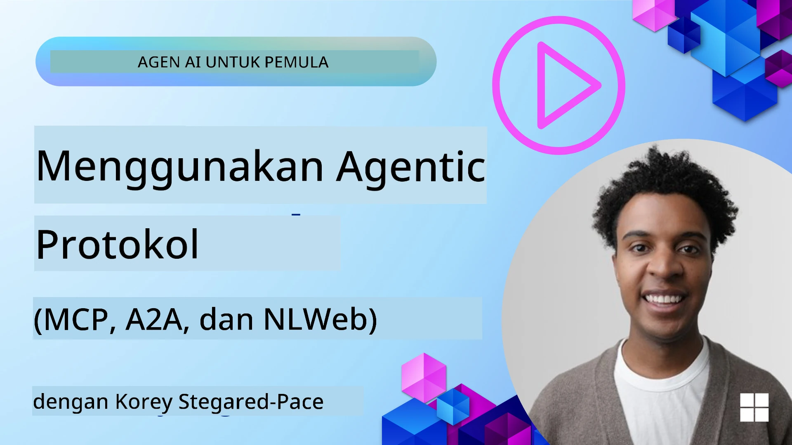
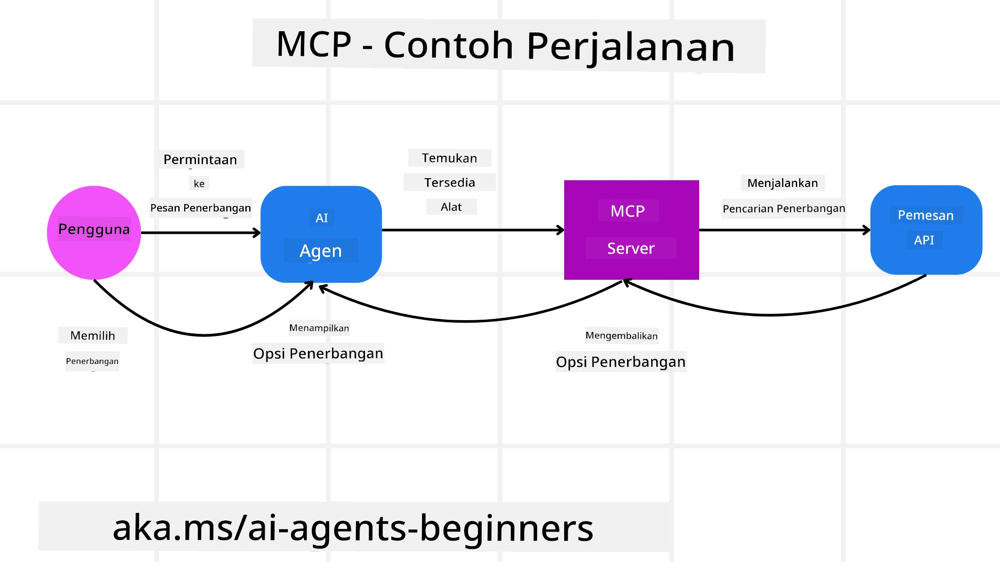
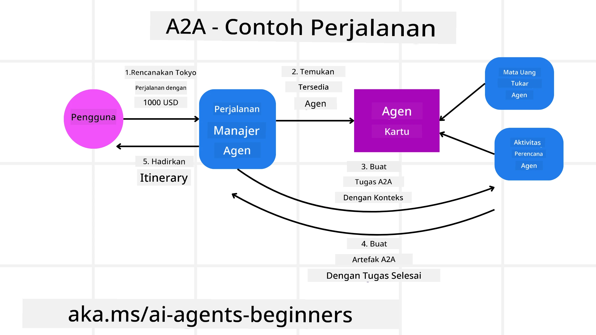
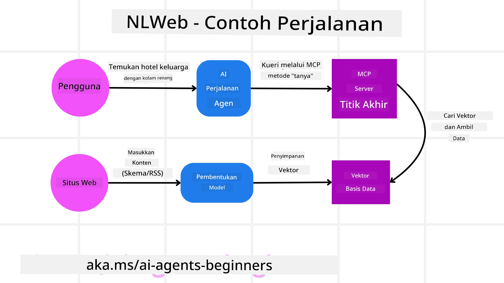

# Menggunakan Protokol Agentik (MCP, A2A dan NLWeb)

> _(Klik gambar di atas untuk melihat video pelajaran ini)_

Seiring dengan meningkatnya penggunaan agen AI, kebutuhan akan protokol yang memastikan standardisasi, keamanan, dan mendukung inovasi terbuka juga meningkat. Dalam pelajaran ini, kita akan membahas 3 protokol yang bertujuan memenuhi kebutuhan ini - Model Context Protocol (MCP), Agent to Agent (A2A) dan Natural Language Web (NLWeb).

## Pengantar

Dalam pelajaran ini, kita akan membahas:

• Bagaimana **MCP** memungkinkan Agen AI mengakses alat dan data eksternal untuk menyelesaikan tugas pengguna.

• Bagaimana **A2A** memungkinkan komunikasi dan kolaborasi antar agen AI yang berbeda.

• Bagaimana **NLWeb** menghadirkan antarmuka bahasa alami ke situs web mana pun yang memungkinkan Agen AI menemukan dan berinteraksi dengan konten.

## Tujuan Pembelajaran

• **Mengidentifikasi** tujuan utama dan manfaat MCP, A2A, dan NLWeb dalam konteks agen AI.

• **Menjelaskan** bagaimana setiap protokol memfasilitasi komunikasi dan interaksi antara LLM, alat, dan agen lainnya.

• **Mengenali** peran berbeda yang dimainkan setiap protokol dalam membangun sistem agentik yang kompleks.

## Model Context Protocol

**Model Context Protocol (MCP)** adalah standar terbuka yang menyediakan cara standar bagi aplikasi untuk menyediakan konteks dan alat ke LLM. Ini memungkinkan "adaptor universal" ke berbagai sumber data dan alat yang dapat dihubungkan oleh Agen AI dengan cara yang konsisten.

Mari kita lihat komponen MCP, manfaat dibanding penggunaan API langsung, dan contoh bagaimana agen AI mungkin menggunakan server MCP.

### Komponen Inti MCP

MCP beroperasi pada **arsitektur klien-server** dan komponen intinya adalah:

• **Host** adalah aplikasi LLM (misalnya editor kode seperti VSCode) yang memulai koneksi ke Server MCP.

• **Klien** adalah komponen dalam aplikasi host yang mempertahankan koneksi satu-satu dengan server.

• **Server** adalah program ringan yang mengekspos kapabilitas tertentu.

Termasuk dalam protokol adalah tiga primitif inti yang merupakan kapabilitas dari Server MCP:

• **Alat (Tools)**: Ini adalah tindakan atau fungsi diskret yang dapat dipanggil agen AI untuk melakukan aksi. Misalnya, layanan cuaca mungkin mengekspos alat "dapatkan cuaca", atau server e-commerce mengekspos alat "beli produk". Server MCP mengiklankan nama alat, deskripsi, dan skema input/output dalam daftar kapabilitasnya.

• **Sumber Daya (Resources)**: Ini adalah item data atau dokumen hanya-baca yang dapat disediakan server MCP, dan klien dapat mengambilnya sesuai permintaan. Contohnya termasuk isi file, catatan database, atau file log. Sumber daya bisa berupa teks (seperti kode atau JSON) atau biner (seperti gambar atau PDF).

• **Prompt**: Ini adalah template yang sudah ditentukan sebelumnya yang menyediakan saran prompt, memungkinkan alur kerja yang lebih kompleks.

### Manfaat MCP

MCP menawarkan keuntungan signifikan untuk Agen AI:

• **Penemuan Alat Dinamis**: Agen dapat secara dinamis menerima daftar alat yang tersedia dari server beserta deskripsi fungsinya. Ini berbeda dengan API tradisional yang sering membutuhkan pengkodean statis untuk integrasi, sehingga setiap perubahan API mengharuskan pembaruan kode. MCP menawarkan pendekatan "integrasi sekali", menghasilkan adaptabilitas yang lebih besar.

• **Interoperabilitas Antar LLM**: MCP bekerja lintas LLM yang berbeda, memberikan fleksibilitas untuk mengganti model inti untuk evaluasi kinerja yang lebih baik.

• **Keamanan Standar**: MCP menyertakan metode autentikasi standar, meningkatkan skalabilitas saat menambah akses ke server MCP tambahan. Ini lebih sederhana dibanding mengelola berbagai kunci dan tipe autentikasi untuk berbagai API tradisional.

### Contoh MCP

Bayangkan seorang pengguna ingin memesan penerbangan menggunakan asisten AI yang didukung oleh MCP.

1. **Koneksi**: Asisten AI (klien MCP) tersambung ke server MCP yang disediakan oleh maskapai penerbangan.

2. **Penemuan Alat**: Klien menanyakan ke server MCP maskapai, "Alat apa saja yang tersedia?" Server merespon dengan alat seperti "cari penerbangan" dan "pesan penerbangan".

3. **Pemanggilan Alat**: Pengguna kemudian meminta asisten AI, "Tolong cari penerbangan dari Portland ke Honolulu." Asisten AI, menggunakan LLM-nya, mengidentifikasi bahwa ia perlu memanggil alat "cari penerbangan" dan mengirim parameter relevan (asal, tujuan) ke server MCP.

4. **Eksekusi dan Respons**: Server MCP, berperan sebagai pembungkus, melakukan panggilan aktual ke API pemesanan internal maskapai. Selanjutnya menerima informasi penerbangan (misalnya data JSON) dan mengirimkannya kembali ke asisten AI.

5. **Interaksi Lanjutan**: Asisten AI menyajikan opsi penerbangan. Setelah pengguna memilih, asisten dapat memanggil alat "pesan penerbangan" pada server MCP yang sama, menyelesaikan pemesanan.

## Protokol Agen ke Agen (A2A)

Sementara MCP berfokus menghubungkan LLM ke alat, **protokol Agent-to-Agent (A2A)** melangkah lebih jauh dengan memungkinkan komunikasi dan kolaborasi antar agen AI yang berbeda. A2A menghubungkan agen AI lintas organisasi, lingkungan, dan tumpukan teknologi untuk menyelesaikan tugas bersama.

Kita akan memeriksa komponen dan manfaat A2A, beserta contoh bagaimana ini dapat diterapkan dalam aplikasi perjalanan kita.

### Komponen Inti A2A

A2A berfokus pada memungkinkan komunikasi antar agen dan membuat mereka bekerja sama menyelesaikan sub-tugas pengguna. Setiap komponen protokol berkontribusi pada ini:

#### Kartu Agen

Mirip seperti server MCP berbagi daftar alat, Kartu Agen memiliki:
- Nama Agen.
- **deskripsi tugas umum** yang diselesaikannya.
- **daftar keterampilan spesifik** dengan deskripsi untuk membantu agen lain (atau pengguna manusia) memahami kapan dan mengapa mereka ingin memanggil agen tersebut.
- **URL Endpoint saat ini** dari agen tersebut.
- **versi** dan **kapabilitas** agen seperti respons streaming dan notifikasi push.

#### Eksekutor Agen

Eksekutor Agen bertanggung jawab untuk **mengoper konteks chat pengguna ke agen jarak jauh**, agen jarak jauh memerlukan ini untuk memahami tugas yang harus diselesaikan. Pada server A2A, agen menggunakan Model Bahasa Besar (LLM) sendiri untuk menguraikan permintaan masuk dan menjalankan tugas menggunakan alat internalnya sendiri.

#### Artefak

Setelah agen jarak jauh menyelesaikan tugas yang diminta, produk kerjanya dibuat sebagai artefak. Artefak **berisi hasil kerja agen**, **deskripsi apa yang telah diselesaikan**, dan **konteks teks** yang dikirim melalui protokol. Setelah artefak dikirim, koneksi dengan agen jarak jauh ditutup hingga dibutuhkan lagi.

#### Antrian Event

Komponen ini digunakan untuk **menangani pembaruan dan meneruskan pesan**. Ini sangat penting dalam produksi untuk sistem agentik agar mencegah koneksi antar agen ditutup sebelum tugas selesai, terutama saat waktu penyelesaian tugas bisa memakan waktu lama.

### Manfaat A2A

• **Kolaborasi Ditingkatkan**: Memungkinkan agen dari berbagai vendor dan platform untuk berinteraksi, berbagi konteks, dan bekerja bersama, memfasilitasi otomatisasi mulus di antara sistem yang secara tradisional terpisah.

• **Fleksibilitas Pemilihan Model**: Setiap agen A2A dapat menentukan LLM yang digunakannya untuk layanan permintaan, memungkinkan model yang dioptimalkan atau disesuaikan per agen, berbeda dengan satu koneksi LLM dalam beberapa skenario MCP.

• **Autentikasi Terintegrasi**: Autentikasi langsung terintegrasi dalam protokol A2A, menyediakan kerangka keamanan yang kuat untuk interaksi agen.

### Contoh A2A

Mari kita perluas skenario pemesanan perjalanan kita, kali ini menggunakan A2A.

1. **Permintaan Pengguna ke Multi-Agen**: Pengguna berinteraksi dengan "Agen Perjalanan" klien/agen A2A, mungkin dengan mengatakan, "Tolong pesan seluruh perjalanan ke Honolulu untuk minggu depan, termasuk penerbangan, hotel, dan mobil sewaan".

2. **Orkestrasi oleh Agen Perjalanan**: Agen Perjalanan menerima permintaan kompleks ini. Agen menggunakan LLM-nya untuk memikirkan tugas dan menentukan bahwa ia perlu berinteraksi dengan agen spesialis.

3. **Komunikasi Antar Agen**: Agen Perjalanan kemudian menggunakan protokol A2A untuk terhubung ke agen hilir, seperti "Agen Maskapai", "Agen Hotel", dan "Agen Rental Mobil" yang dibuat oleh perusahaan berbeda.

4. **Pelaksanaan Tugas yang Didelegasikan**: Agen Perjalanan mengirimkan tugas spesifik ke agen spesialis tersebut (misalnya "Cari penerbangan ke Honolulu," "Pesan hotel," "Sewa mobil"). Masing-masing agen spesialis ini, menjalankan LLM sendiri dan menggunakan alat sendiri (yang bisa menjadi server MCP), melaksanakan bagian pemesanan spesifiknya.

5. **Respons Terkonsolidasi**: Setelah semua agen hilir menyelesaikan tugasnya, Agen Perjalanan mengompilasi hasil (detail penerbangan, konfirmasi hotel, pemesanan rental mobil) dan mengirim respons gaya chat yang komprehensif kembali ke pengguna.

## Natural Language Web (NLWeb)

Situs web telah lama menjadi cara utama bagi pengguna untuk mengakses informasi dan data di internet.

Mari kita lihat berbagai komponen NLWeb, manfaat NLWeb dan contoh bagaimana NLWeb bekerja dengan melihat aplikasi perjalanan kita.

### Komponen NLWeb

- **Aplikasi NLWeb (Kode Layanan Inti)**: Sistem yang memproses pertanyaan berbahasa alami. Ini menghubungkan bagian platform yang berbeda untuk membuat respons. Anda dapat menganggapnya sebagai **mesin yang menggerakkan fitur bahasa alami** dari sebuah situs web.

- **Protokol NLWeb**: Ini adalah **sekumpulan aturan dasar untuk interaksi bahasa alami** dengan situs web. Mengirim respons dalam format JSON (sering menggunakan Schema.org). Tujuannya adalah membuat dasar sederhana untuk “Web AI,” sama seperti HTML memungkinkan berbagi dokumen secara online.

- **Server MCP (Model Context Protocol Endpoint)**: Setiap pengaturan NLWeb juga berfungsi sebagai **server MCP**. Ini berarti dapat **berbagi alat (seperti metode “ask”) dan data** dengan sistem AI lain. Dalam praktiknya, ini membuat konten dan kemampuan situs web dapat digunakan oleh agen AI, memungkinkan situs menjadi bagian dari “ekosistem agen” yang lebih luas.

- **Model Embedding**: Model-model ini digunakan untuk **mengubah konten situs web menjadi representasi numerik yang disebut vektor** (embedding). Vektor ini menangkap makna dengan cara yang dapat dibandingkan dan dicari komputer. Mereka disimpan dalam database khusus, dan pengguna dapat memilih model embedding yang ingin dipakai.

- **Database Vektor (Mekanisme Pengambilan)**: Database ini **menyimpan embedding konten situs web**. Ketika seseorang mengajukan pertanyaan, NLWeb memeriksa database vektor untuk menemukan informasi paling relevan dengan cepat. Memberikan daftar jawaban yang mungkin, diurutkan berdasarkan kemiripan. NLWeb bekerja dengan sistem penyimpanan vektor berbeda seperti Qdrant, Snowflake, Milvus, Azure AI Search, dan Elasticsearch.

### NLWeb dengan Contoh

Pertimbangkan situs pemesanan perjalanan kita lagi, tapi kali ini didukung oleh NLWeb.

1. **Ingesti Data**: Katalog produk situs perjalanan yang sudah ada (misalnya daftar penerbangan, deskripsi hotel, paket tur) diformat menggunakan Schema.org atau dimuat lewat feed RSS. Alat NLWeb mengintepretasi data terstruktur ini, membuat embedding, dan menyimpannya di database vektor lokal atau jarak jauh.

2. **Query Bahasa Alami (Manusia)**: Pengguna mengunjungi situs dan, alih-alih menavigasi menu, mengetik di antarmuka chat: "Cari hotel ramah keluarga di Honolulu dengan kolam renang untuk minggu depan".

3. **Pemrosesan NLWeb**: Aplikasi NLWeb menerima query ini. Mengirim pertanyaan ke LLM untuk pemahaman dan sekaligus mencari database vektor untuk daftar hotel yang relevan.

4. **Hasil Akurat**: LLM membantu menafsirkan hasil pencarian dari database, mengidentifikasi kecocokan terbaik berdasarkan kriteria "ramah keluarga," "kolam renang," dan "Honolulu," lalu memformat respons dalam bahasa alami. Penting, respons merujuk pada hotel nyata dari katalog situs, menghindari informasi yang dibuat-buat.

5. **Interaksi Agen AI**: Karena NLWeb berperan sebagai server MCP, agen perjalanan AI eksternal juga dapat terhubung ke instance NLWeb situs ini. Agen AI kemudian dapat menggunakan metode MCP `ask` untuk menanyakan situs secara langsung: `ask("Adakah restoran ramah vegan di area Honolulu yang direkomendasikan oleh hotel?")`. Instance NLWeb akan memproses ini, memanfaatkan database info restoran (jika dimuat), dan mengembalikan respons JSON terstruktur.

### Masih Punya Pertanyaan tentang MCP/A2A/NLWeb?

Bergabunglah dengan [Microsoft Foundry Discord](https://discord.com/invite/ATgtXmAS5D) untuk bertemu dengan pelajar lain, menghadiri jam kantor, dan mendapatkan jawaban untuk pertanyaan Agen AI Anda.

## Sumber Daya

- [MCP untuk Pemula](https://aka.ms/mcp-for-beginners)  
- [Dokumentasi MCP](https://learn.microsoft.com/python/api/overview/azure/ai-projects-readme)
- [Repo NLWeb](https://github.com/nlweb-ai/NLWeb)
- [Microsoft Agent Framework](https://aka.ms/ai-agents-beginners/agent-framework)

---

<!-- CO-OP TRANSLATOR DISCLAIMER START -->
**Penafian**:
Dokumen ini telah diterjemahkan menggunakan layanan terjemahan AI [Co-op Translator](https://github.com/Azure/co-op-translator). Meskipun kami berupaya untuk mencapai akurasi, harap diketahui bahwa terjemahan otomatis mungkin mengandung kesalahan atau ketidakakuratan. Dokumen asli dalam bahasa aslinya harus dianggap sebagai sumber yang sah. Untuk informasi penting, disarankan menggunakan terjemahan profesional oleh manusia. Kami tidak bertanggung jawab atas kesalahpahaman atau penafsiran yang keliru yang timbul dari penggunaan terjemahan ini.
<!-- CO-OP TRANSLATOR DISCLAIMER END -->