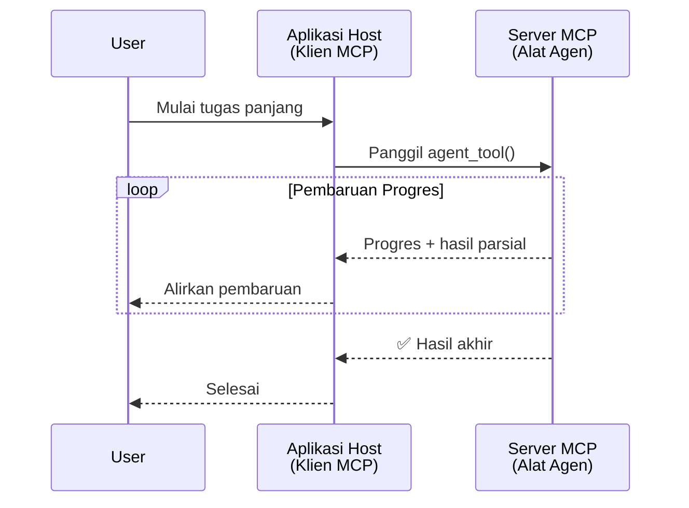
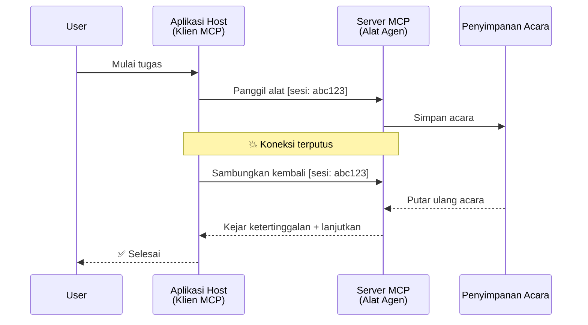
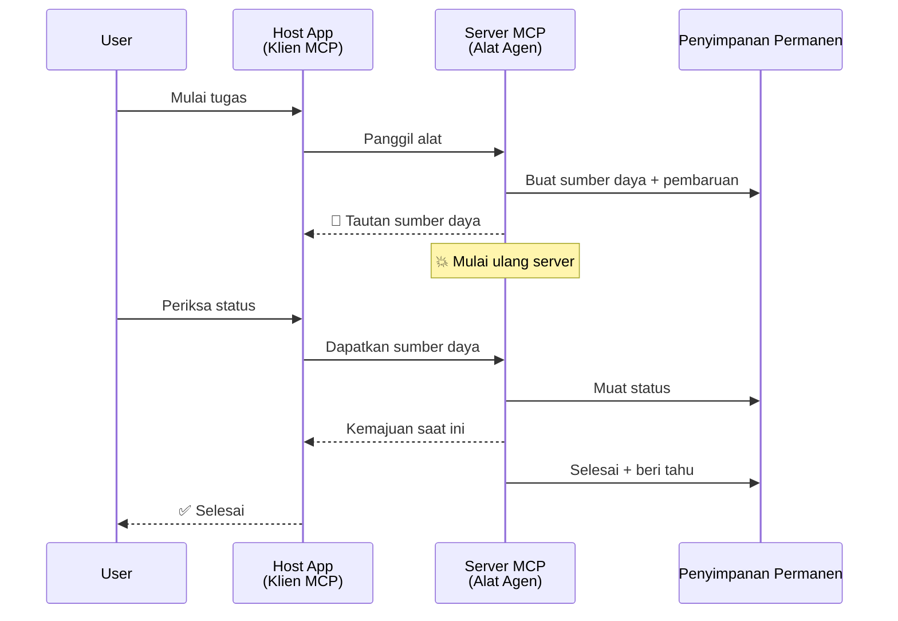
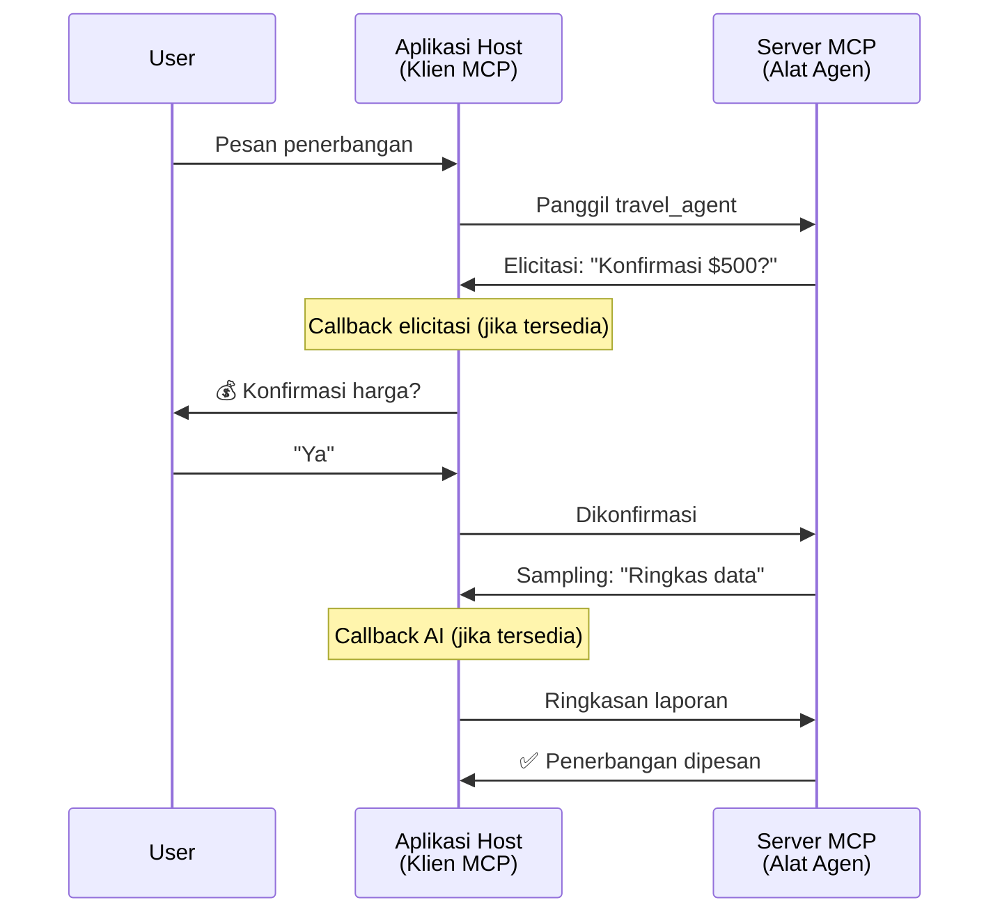
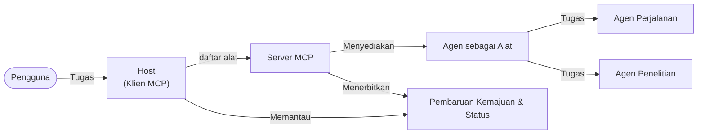

# Membangun Sistem Komunikasi Agen-ke-Agen dengan MCP

> TL;DR - Bisakah Anda Membangun Komunikasi Agent2Agent di MCP? Bisa!

MCP telah berkembang pesat melampaui tujuan awalnya yaitu "memberikan konteks kepada LLM". Dengan peningkatan terbaru termasuk [streaming yang dapat dilanjutkan](https://modelcontextprotocol.io/docs/concepts/transports#resumability-and-redelivery), [elicitation](https://modelcontextprotocol.io/specification/2025-06-18/client/elicitation), [sampling](https://modelcontextprotocol.io/specification/2025-06-18/client/sampling), dan notifikasi ([progress](https://modelcontextprotocol.io/specification/2025-06-18/basic/utilities/progress) dan [resources](https://modelcontextprotocol.io/specification/2025-06-18/schema#resourceupdatednotification)), MCP kini menyediakan fondasi yang kuat untuk membangun sistem komunikasi agen-ke-agen yang kompleks.

## Kesalahpahaman tentang Agen/Alat

Seiring semakin banyak pengembang mengeksplorasi alat dengan perilaku agen (berjalan dalam waktu lama, mungkin memerlukan masukan tambahan di tengah eksekusi, dan lain-lain), kesalahpahaman umum adalah bahwa MCP tidak cocok terutama karena contoh awal dari alat yang primitif hanya berfokus pada pola permintaan-tanggapan sederhana.

Persepsi ini sudah usang. Spesifikasi MCP telah ditingkatkan secara signifikan dalam beberapa bulan terakhir dengan kemampuan yang menutup celah untuk membangun perilaku agen yang berjalan lama:

- **Streaming & Hasil Parsial**: Pembaruan progres secara real-time selama eksekusi  
- **Kemampuan Dilanjutkan**: Klien bisa menyambung kembali dan melanjutkan setelah terputus  
- **Ketahanan**: Hasil bertahan setelah restart server (misalnya melalui tautan sumber daya)  
- **Multi-giliran**: Input interaktif di tengah eksekusi melalui elicitation dan sampling  

Fitur-fitur ini dapat dikombinasikan untuk memungkinkan aplikasi agenik dan multi-agen yang kompleks, semuanya dijalankan di atas protokol MCP.

Sebagai referensi, kita akan menyebut agen sebagai "alat" yang tersedia di server MCP. Ini mengimplikasikan adanya aplikasi host yang mengimplementasikan klien MCP yang membuat sesi dengan server MCP dan dapat memanggil agen tersebut.

## Apa yang Membuat Alat MCP “Agenik”?

Sebelum masuk ke implementasi, mari kita tetapkan kemampuan infrastruktur apa yang dibutuhkan untuk mendukung agen berjalan lama.

> Kita akan mendefinisikan agen sebagai entitas yang dapat beroperasi secara otonom dalam jangka waktu yang lama, sanggup menangani tugas kompleks yang mungkin memerlukan banyak interaksi atau penyesuaian berdasarkan umpan balik real-time.

### 1. Streaming & Hasil Parsial

Pola permintaan-tanggapan tradisional tidak bekerja untuk tugas yang berjalan lama. Agen perlu menyediakan:

- Pembaruan progres secara real-time  
- Hasil antara  

**Dukungan MCP**: Notifikasi pembaruan sumber daya memungkinkan streaming hasil parsial, meskipun ini memerlukan desain hati-hati agar tidak bertentangan dengan model permintaan/tanggapan 1:1 JSON-RPC.

| Fitur                     | Kasus Penggunaan                                                                                                                                                | Dukungan MCP                                                                             |
| -------------------------- | -------------------------------------------------------------------------------------------------------------------------------------------------------------- | --------------------------------------------------------------------------------------- |
| Pembaruan Progres Real-time | Pengguna meminta tugas migrasi kode. Agen streaming progres: "10% - Menganalisis dependensi... 25% - Mengonversi berkas TypeScript... 50% - Memperbarui impor..." | ✅ Notifikasi progres                                                                    |
| Hasil Parsial             | Tugas "Membuat buku" streaming hasil parsial, misalnya 1) Rangkuman alur cerita, 2) Daftar bab, 3) Setiap bab selesai. Host dapat memeriksa, membatalkan, atau mengalihkan kapan saja. | ✅ Notifikasi dapat “diperluas” untuk mencakup hasil parsial lihat proposal di PR 383, 776 |

<div align="center" style="font-style: italic; font-size: 0.95em; margin-bottom: 0.5em;">
<strong>Gambar 1:</strong> Diagram ini menggambarkan bagaimana agen MCP melakukan streaming pembaruan progres real-time dan hasil parsial ke aplikasi host selama tugas yang berjalan lama, memungkinkan pengguna memantau eksekusi secara langsung.
</div>



### 2. Kemampuan Dilanjutkan

Agen harus dapat menangani gangguan jaringan dengan baik:

- Menyambung kembali setelah (klien) terputus  
- Melanjutkan dari titik terakhir (pengiriman ulang pesan)  

**Dukungan MCP**: Transport StreamableHTTP MCP saat ini mendukung lanjutan sesi dan pengiriman ulang pesan dengan ID sesi dan ID acara terakhir. Catatan penting di sini adalah server harus mengimplementasikan EventStore yang memungkinkan pemutaran ulang acara saat klien tersambung kembali.  
Perlu dicatat ada proposal komunitas (PR #975) yang mengeksplorasi streaming yang dapat dilanjutkan secara transport-agnostik.

| Fitur       | Kasus Penggunaan                                                                                                                                            | Dukungan MCP                                                               |
| ------------ | ---------------------------------------------------------------------------------------------------------------------------------------------------------- | ------------------------------------------------------------------------- |
| Kemampuan Dilanjutkan | Klien terputus di tengah tugas jangka panjang. Saat tersambung kembali, sesi berlanjut dengan pemutaran ulang acara yang terlewat, melanjutkan tanpa hambatan dari tempat terakhir. | ✅ Transport StreamableHTTP dengan ID sesi, pemutaran ulang acara, dan EventStore |

<div align="center" style="font-style: italic; font-size: 0.95em; margin-bottom: 0.5em;">
<strong>Gambar 2:</strong> Diagram ini menunjukkan bagaimana transport StreamableHTTP MCP dan penyimpanan acara memungkinkan lanjutan sesi yang mulus: jika klien terputus, ia dapat menyambung kembali dan memutar ulang acara yang terlewat, melanjutkan tugas tanpa kehilangan progres.
</div>



### 3. Ketahanan

Agen yang berjalan lama membutuhkan status yang persistens:

- Hasil bertahan setelah restart server  
- Status dapat diperoleh secara terpisah  
- Pelacakan progres antar sesi  

**Dukungan MCP**: MCP kini mendukung tipe pengembalian tautan Resource untuk panggilan alat. Saat ini, pola yang mungkin adalah merancang alat yang membuat sumber daya dan langsung mengembalikan tautan sumber daya. Alat dapat terus menangani tugas di latar belakang dan memperbarui sumber daya. Sementara itu, klien dapat memilih untuk memeriksa status sumber daya ini demi memperoleh hasil parsial atau penuh (berdasarkan pembaruan yang diberikan server) atau berlangganan ke sumber daya untuk notifikasi pembaruan.

Satu keterbatasan di sini adalah bahwa polling sumber daya atau berlangganan pembaruan dapat mengonsumsi sumber daya dengan implikasi pada skala besar. Ada proposal komunitas terbuka (termasuk #992) yang mengeksplorasi kemungkinan menyertakan webhook atau pemicu yang dapat dipanggil server untuk memberitahu klien/aplikasi host tentang pembaruan.

| Fitur       | Kasus Penggunaan                                                                                                                              | Dukungan MCP                                                   |
| ---------- | --------------------------------------------------------------------------------------------------------------------------------------------- | ------------------------------------------------------------- |
| Ketahanan  | Server crash selama tugas migrasi data. Hasil dan progres bertahan setelah restart, klien dapat memeriksa status dan melanjutkan dari sumber daya persisten. | ✅ Tautan sumber daya dengan penyimpanan persisten dan notifikasi status |

Saat ini, pola umum adalah merancang alat yang membuat sumber daya dan langsung mengembalikan tautan sumber daya. Alat dapat menyelesaikan tugas secara latar belakang, mengeluarkan notifikasi sumber daya yang berfungsi sebagai pembaruan progres atau menyertakan hasil parsial, dan memperbarui konten dalam sumber daya sesuai kebutuhan.

<div align="center" style="font-style: italic; font-size: 0.95em; margin-bottom: 0.5em;">
<strong>Gambar 3:</strong> Diagram ini menunjukkan bagaimana agen MCP menggunakan sumber daya persisten dan notifikasi status untuk memastikan tugas berjalan lama bertahan setelah restart server, memungkinkan klien memeriksa progres dan mengambil hasil bahkan setelah kegagalan.
</div>



### 4. Interaksi Multi-Giliran

Agen sering memerlukan masukan tambahan di tengah eksekusi:

- Klarifikasi atau persetujuan manusia  
- Bantuan AI untuk keputusan kompleks  
- Penyesuaian parameter dinamis  

**Dukungan MCP**: Mendukung penuh melalui sampling (untuk input AI) dan elicitation (untuk input manusia).

| Fitur                  | Kasus Penggunaan                                                                                                                               | Dukungan MCP                                            |
| ----------------------- | ---------------------------------------------------------------------------------------------------------------------------------------------- | ------------------------------------------------------ |
| Interaksi Multi-Giliran | Agen pemesanan perjalanan meminta konfirmasi harga dari pengguna, lalu meminta AI merangkum data perjalanan sebelum menyelesaikan transaksi. | ✅ Elicitation untuk input manusia, sampling untuk input AI |

<div align="center" style="font-style: italic; font-size: 0.95em; margin-bottom: 0.5em;">
<strong>Gambar 4:</strong> Diagram ini menggambarkan bagaimana agen MCP dapat secara interaktif meminta input manusia atau bantuan AI di tengah eksekusi, mendukung alur kerja multi-giliran yang kompleks seperti konfirmasi dan pengambilan keputusan dinamis.
</div>



## Mengimplementasikan Agen Berjalan Lama di MCP - Tinjauan Kode

Sebagai bagian dari artikel ini, kami menyediakan [repository kode](https://github.com/victordibia/ai-tutorials/tree/main/MCP%20Agents) yang berisi implementasi penuh agen yang berjalan lama menggunakan SDK MCP Python dengan transport StreamableHTTP untuk lanjutan sesi dan pengiriman ulang pesan. Implementasi ini menunjukkan bagaimana kemampuan MCP dapat dikomposisikan untuk memungkinkan perilaku seperti agen yang canggih.

Secara khusus, kami mengimplementasikan server dengan dua alat agen utama:

- **Travel Agent** - Mensimulasikan layanan pemesanan perjalanan dengan konfirmasi harga melalui elicitation  
- **Research Agent** - Melakukan tugas riset dengan ringkasan berbantuan AI melalui sampling  

Kedua agen menunjukkan pembaruan progres real-time, konfirmasi interaktif, dan kemampuan lanjutan sesi penuh.

### Konsep Implementasi Kunci

Bagian-bagian berikut menunjukkan implementasi agen sisi server dan penanganan host klien untuk setiap kemampuan:

#### Streaming & Pembaruan Progres - Status Tugas Real-time

Streaming memungkinkan agen memberikan pembaruan progres secara real-time selama tugas berjalan lama, menjaga pengguna tetap mendapat informasi tentang status tugas dan hasil antara.

**Implementasi Server (agen mengirim notifikasi progres):**

```python
# Dari server/server.py - Agen perjalanan mengirimkan pembaruan kemajuan
for i, step in enumerate(steps):
    await ctx.session.send_progress_notification(
        progress_token=ctx.request_id,
        progress=i * 25,
        total=100,
        message=step,
        related_request_id=str(ctx.request_id)
    )
    await anyio.sleep(2)  # Simulasikan pekerjaan

# Alternatif: Catat pesan untuk pembaruan langkah demi langkah yang rinci
await ctx.session.send_log_message(
    level="info",
    data=f"Processing step {current_step}/{steps} ({progress_percent}%)",
    logger="long_running_agent",
    related_request_id=ctx.request_id,
)
```

**Implementasi Klien (host menerima pembaruan progres):**

```python
# Dari client/client.py - Klien yang menangani notifikasi waktu nyata
async def message_handler(message) -> None:
    if isinstance(message, types.ServerNotification):
        if isinstance(message.root, types.LoggingMessageNotification):
            console.print(f"📡 [dim]{message.root.params.data}[/dim]")
        elif isinstance(message.root, types.ProgressNotification):
            progress = message.root.params
            console.print(f"🔄 [yellow]{progress.message} ({progress.progress}/{progress.total})[/yellow]")

# Daftarkan penangan pesan saat membuat sesi
async with ClientSession(
    read_stream, write_stream,
    message_handler=message_handler
) as session:
```

#### Elicitation - Meminta Masukan Pengguna

Elicitation memungkinkan agen meminta masukan pengguna di tengah eksekusi. Ini penting untuk konfirmasi, klarifikasi, atau persetujuan selama tugas yang berjalan lama.

**Implementasi Server (agen meminta konfirmasi):**

```python
# Dari server/server.py - Agen perjalanan meminta konfirmasi harga
elicit_result = await ctx.session.elicit(
    message=f"Please confirm the estimated price of $1200 for your trip to {destination}",
    requestedSchema=PriceConfirmationSchema.model_json_schema(),
    related_request_id=ctx.request_id,
)

if elicit_result and elicit_result.action == "accept":
    # Lanjutkan dengan pemesanan
    logger.info(f"User confirmed price: {elicit_result.content}")
elif elicit_result and elicit_result.action == "decline":
    # Batalkan pemesanan
    booking_cancelled = True
```

**Implementasi Klien (host menyediakan callback elicitation):**

```python
# Dari client/client.py - Penanganan permintaan elicitation klien
async def elicitation_callback(context, params):
    console.print(f"💬 Server is asking for confirmation:")
    console.print(f"   {params.message}")

    response = console.input("Do you accept? (y/n): ").strip().lower()

    if response in ['y', 'yes']:
        return types.ElicitResult(
            action="accept",
            content={"confirm": True, "notes": "Confirmed by user"}
        )
    else:
        return types.ElicitResult(
            action="decline",
            content={"confirm": False, "notes": "Declined by user"}
        )

# Daftarkan callback saat membuat sesi
async with ClientSession(
    read_stream, write_stream,
    elicitation_callback=elicitation_callback
) as session:
```

#### Sampling - Meminta Bantuan AI

Sampling memungkinkan agen meminta bantuan LLM untuk keputusan kompleks atau pembuatan konten selama eksekusi. Ini mendukung alur kerja hibrida manusia-AI.

**Implementasi Server (agen meminta bantuan AI):**

```python
# Dari server/server.py - Agen riset meminta ringkasan AI
sampling_result = await ctx.session.create_message(
    messages=[
        SamplingMessage(
            role="user",
            content=TextContent(type="text", text=f"Please summarize the key findings for research on: {topic}")
        )
    ],
    max_tokens=100,
    related_request_id=ctx.request_id,
)

if sampling_result and sampling_result.content:
    if sampling_result.content.type == "text":
        sampling_summary = sampling_result.content.text
        logger.info(f"Received sampling summary: {sampling_summary}")
```

**Implementasi Klien (host menyediakan callback sampling):**

```python
# Dari client/client.py - Penanganan klien untuk permintaan sampling
async def sampling_callback(context, params):
    message_text = params.messages[0].content.text if params.messages else 'No message'
    console.print(f"🧠 Server requested sampling: {message_text}")

    # Dalam aplikasi nyata, ini bisa memanggil API LLM
    # Untuk tujuan demo, kami menyediakan respons tiruan
    mock_response = "Based on current research, MCP has evolved significantly..."

    return types.CreateMessageResult(
        role="assistant",
        content=types.TextContent(type="text", text=mock_response),
        model="interactive-client",
        stopReason="endTurn"
    )

# Daftarkan callback saat membuat sesi
async with ClientSession(
    read_stream, write_stream,
    sampling_callback=sampling_callback,
    elicitation_callback=elicitation_callback
) as session:
```

#### Kemampuan Dilanjutkan - Kontinuitas Sesi Saat Terputus

Kemampuan dilanjutkan memastikan bahwa tugas agen berjalan lama bisa bertahan saat klien terputus dan melanjutkan mulus saat tersambung kembali. Ini diimplementasikan melalui penyimpanan acara dan token lanjutan.

**Implementasi Penyimpanan Acara (server menyimpan status sesi):**

```python
# Dari server/event_store.py - Penyimpanan event sederhana dalam memori
class SimpleEventStore(EventStore):
    def __init__(self):
        self._events: list[tuple[StreamId, EventId, JSONRPCMessage]] = []
        self._event_id_counter = 0

    async def store_event(self, stream_id: StreamId, message: JSONRPCMessage) -> EventId:
        """Store an event and return its ID."""
        self._event_id_counter += 1
        event_id = str(self._event_id_counter)
        self._events.append((stream_id, event_id, message))
        return event_id

    async def replay_events_after(self, last_event_id: EventId, send_callback: EventCallback) -> StreamId | None:
        """Replay events after the specified ID for resumption."""
        start_index = None
        stream_id = None
        for index, (event_stream_id, event_id, _) in enumerate(self._events):
            if event_id == last_event_id:
                start_index = index + 1
                stream_id = event_stream_id
                break

        if start_index is None:
            return None

        # Putar ulang hanya event yang lebih baru dari stream asli sesi.
        for event_stream_id, event_id, message in self._events[start_index:]:
            if event_stream_id != stream_id:
                continue
            await send_callback(EventMessage(message, event_id))

        return stream_id

# Dari server/server.py - Mengoper penyimpanan event ke manajer sesi
def create_server_app(event_store: Optional[EventStore] = None) -> Starlette:
    server = ResumableServer()

    # Buat manajer sesi dengan penyimpanan event untuk kelanjutan
    session_manager = StreamableHTTPSessionManager(
        app=server,
        event_store=event_store,  # Penyimpanan event memungkinkan kelanjutan sesi
        json_response=False,
        security_settings=security_settings,
    )

    return Starlette(routes=[Mount("/mcp", app=session_manager.handle_request)])

# Penggunaan: Inisialisasi dengan penyimpanan event
event_store = SimpleEventStore()
app = create_server_app(event_store)
```

**Metadata Klien dengan Token Lanjutan (klien menyambung kembali pakai status tersimpan):**

```python
# Dari client/client.py - Pelanjutan klien dengan metadata
if existing_tokens and existing_tokens.get("resumption_token"):
    # Gunakan token pelanjutan yang ada untuk melanjutkan dari tempat terakhir
    metadata = ClientMessageMetadata(
        resumption_token=existing_tokens["resumption_token"],
    )
else:
    # Buat callback untuk menyimpan token pelanjutan saat diterima
    def enhanced_callback(token: str):
        protocol_version = getattr(session, 'protocol_version', None)
        token_manager.save_tokens(session_id, token, protocol_version, command, args)

    metadata = ClientMessageMetadata(
        on_resumption_token_update=enhanced_callback,
    )

# Kirim permintaan dengan metadata pelanjutan
result = await session.send_request(
    types.ClientRequest(
        types.CallToolRequest(
            method="tools/call",
            params=types.CallToolRequestParams(name=command, arguments=args)
        )
    ),
    types.CallToolResult,
    metadata=metadata,
)
```

Aplikasi host menyimpan ID sesi dan token lanjutan secara lokal, memungkinkan ia menyambung kembali ke sesi yang ada tanpa kehilangan progres atau status.

### Organisasi Kode

<div align="center" style="font-style: italic; font-size: 0.95em; margin-bottom: 0.5em;">
<strong>Gambar 5:</strong> Arsitektur sistem agen berbasis MCP  
</div>



**Berkas Kunci:**

- **`server/server.py`** - Server MCP yang dapat dilanjutkan dengan agen travel dan research yang menunjukkan elicitation, sampling, dan pembaruan progres  
- **`client/client.py`** - Aplikasi host interaktif dengan dukungan lanjutan, handler callback, dan manajemen token  
- **`server/event_store.py`** - Implementasi penyimpanan acara yang memungkinkan lanjutan sesi dan pengiriman ulang pesan  

## Memperluas ke Komunikasi Multi-Agen di MCP

Implementasi di atas dapat diperluas ke sistem multi-agen dengan meningkatkan kecerdasan dan cakupan aplikasi host:

- **Dekompisi Tugas Cerdas**: Host menganalisis permintaan kompleks pengguna dan memecahnya menjadi subtugas untuk agen khusus berbeda  
- **Koordinasi Multi-Server**: Host mempertahankan koneksi ke banyak server MCP, masing-masing menawarkan kemampuan agen berbeda  
- **Manajemen Status Tugas**: Host melacak progres di banyak tugas agen simultan, menangani ketergantungan dan urutan  
- **Ketahanan & Pengulangan**: Host menangani kegagalan, mengimplementasikan logika pengulangan, dan mengalihkan tugas saat agen tidak tersedia  
- **Sintesis Hasil**: Host menggabungkan output dari banyak agen menjadi hasil akhir yang koheren  

Host berkembang dari klien sederhana menjadi orkestrator cerdas, mengoordinasikan kemampuan agen terdistribusi sambil mempertahankan fondasi protokol MCP yang sama.

## Kesimpulan

Kemampuan MCP yang diperluas - notifikasi sumber daya, elicitation/sampling, streaming yang dapat dilanjutkan, dan sumber daya persisten - memungkinkan interaksi agen-ke-agen yang kompleks sambil menjaga kesederhanaan protokol.

## Memulai

Siap membangun sistem agent2agent Anda sendiri? Ikuti langkah-langkah berikut:

### 1. Jalankan Demo

```bash
# Mulai server dengan penyimpanan event untuk pelanjutan
python -m server.server --port 8006

# Di terminal lain, jalankan klien interaktif
python -m client.client --url http://127.0.0.1:8006/mcp
```

**Perintah yang tersedia dalam mode interaktif:**

- `travel_agent` - Pesan perjalanan dengan konfirmasi harga via elicitation  
- `research_agent` - Teliti topik dengan ringkasan berbantuan AI melalui sampling  
- `list` - Tampilkan semua alat yang tersedia  
- `clean-tokens` - Hapus token lanjutan  
- `help` - Tampilkan bantuan perintah secara detail  
- `quit` - Keluar dari klien  

### 2. Uji Kemampuan Lanjutan

- Mulai agen yang berjalan lama (misal, `travel_agent`)  
- Ganggu klien saat eksekusi (Ctrl+C)  
- Mulai ulang klien - secara otomatis melanjutkan dari tempat terakhir   

### 3. Jelajahi dan Perluas

- **Jelajahi contoh**: Cek [mcp-agents](https://github.com/victordibia/ai-tutorials/tree/main/MCP%20Agents) ini  
- **Bergabung dengan komunitas**: Ikut diskusi MCP di GitHub  
- **Ber eksperimen**: Mulai dengan tugas panjang sederhana dan tambahkan streaming, kemampuan dilanjutkan, dan koordinasi multi-agen secara bertahap  

Ini menunjukkan bagaimana MCP memungkinkan perilaku agen cerdas sambil mempertahankan kesederhanaan berbasis alat.

Secara keseluruhan, spesifikasi protokol MCP berkembang cepat; pembaca disarankan untuk meninjau situs dokumentasi resmi untuk pembaruan terbaru - https://modelcontextprotocol.io/introduction

---

<!-- CO-OP TRANSLATOR DISCLAIMER START -->
**Penafian**:
Dokumen ini telah diterjemahkan menggunakan layanan terjemahan AI [Co-op Translator](https://github.com/Azure/co-op-translator). Meskipun kami berupaya untuk mencapai akurasi, harap diketahui bahwa terjemahan otomatis mungkin mengandung kesalahan atau ketidakakuratan. Dokumen asli dalam bahasa aslinya harus dianggap sebagai sumber yang sah. Untuk informasi penting, disarankan menggunakan terjemahan profesional oleh manusia. Kami tidak bertanggung jawab atas kesalahpahaman atau penafsiran yang keliru yang timbul dari penggunaan terjemahan ini.
<!-- CO-OP TRANSLATOR DISCLAIMER END -->