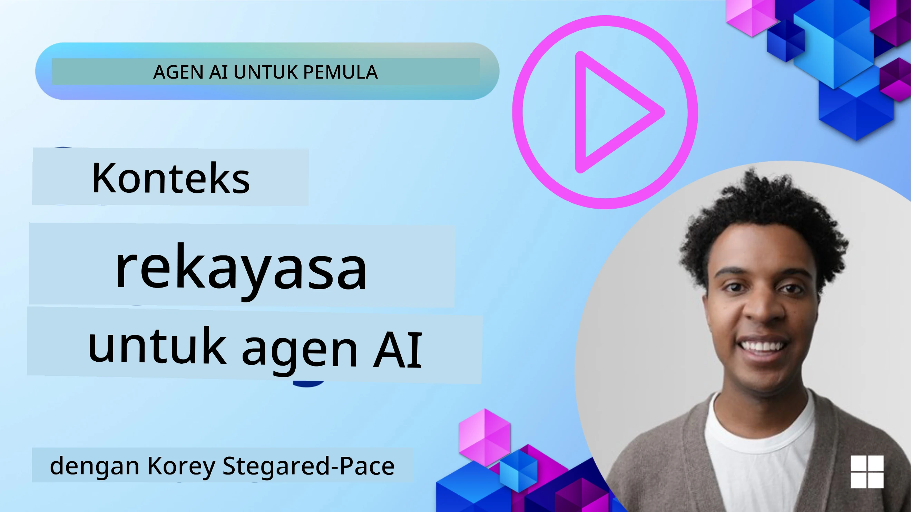
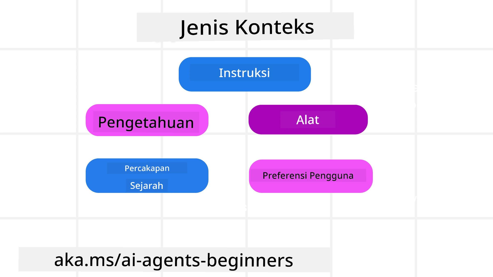
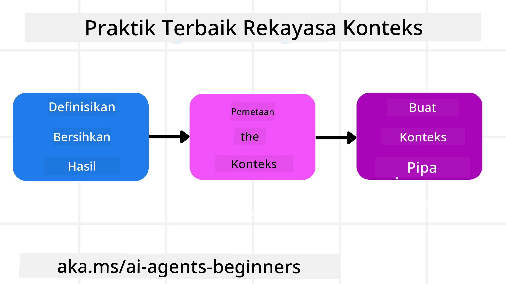

# Rekayasa Konteks untuk Agen AI

> _(Klik gambar di atas untuk melihat video pelajaran ini)_

Memahami kompleksitas aplikasi yang Anda bangun untuk agen AI sangat penting agar dapat membuatnya andal. Kita perlu membangun Agen AI yang secara efektif mengelola informasi untuk mengatasi kebutuhan kompleks di luar rekayasa prompt.

Dalam pelajaran ini, kita akan melihat apa itu rekayasa konteks dan perannya dalam membangun agen AI.

## Pendahuluan

Pelajaran ini akan membahas:

• **Apa itu Rekayasa Konteks** dan mengapa ini berbeda dari rekayasa prompt.

• **Strategi untuk Rekayasa Konteks yang efektif**, termasuk bagaimana menulis, memilih, mengompres, dan mengisolasi informasi.

• **Kegagalan Konteks Umum** yang dapat menggagalkan agen AI Anda dan cara memperbaikinya.

## Tujuan Pembelajaran

Setelah menyelesaikan pelajaran ini, Anda akan memahami bagaimana:

• **Mendefinisikan rekayasa konteks** dan membedakannya dari rekayasa prompt.

• **Mengidentifikasi komponen utama konteks** dalam aplikasi Large Language Model (LLM).

• **Menerapkan strategi untuk menulis, memilih, mengompres, dan mengisolasi konteks** untuk meningkatkan performa agen.

• **Mengenali kegagalan konteks umum** seperti poisoning, distraksi, kebingungan, dan benturan, serta menerapkan teknik mitigasi.

## Apa itu Rekayasa Konteks?

Untuk Agen AI, konteks adalah apa yang mendorong perencanaan Agen AI untuk mengambil tindakan tertentu. Rekayasa Konteks adalah praktik memastikan Agen AI memiliki informasi yang tepat untuk menyelesaikan langkah berikutnya dari tugas. Jendela konteks memiliki ukuran terbatas, jadi sebagai pembuat agen, kita perlu membangun sistem dan proses untuk mengelola penambahan, penghapusan, dan pemadatan informasi dalam jendela konteks.

### Rekayasa Prompt vs Rekayasa Konteks

Rekayasa prompt berfokus pada satu set instruksi statis untuk secara efektif mengarahkan Agen AI dengan aturan-aturan tertentu. Rekayasa konteks adalah cara mengelola set informasi yang dinamis, termasuk prompt awal, untuk memastikan Agen AI memiliki apa yang dibutuhkan seiring waktu. Ide utama rekayasa konteks adalah membuat proses ini dapat diulang dan dapat diandalkan.

### Jenis-jenis Konteks

Penting untuk diingat bahwa konteks bukan hanya satu hal. Informasi yang dibutuhkan Agen AI dapat berasal dari berbagai sumber dan tanggung jawab kita untuk memastikan agen memiliki akses ke sumber tersebut:

Jenis-jenis konteks yang mungkin perlu dikelola oleh agen AI meliputi:

• **Instruksi:** Ini seperti "aturan" agen – prompt, pesan sistem, contoh few-shot (menunjukkan AI cara melakukan sesuatu), dan deskripsi alat yang dapat digunakan. Ini adalah tempat fokus rekayasa prompt bersatu dengan rekayasa konteks.

• **Pengetahuan:** Meliputi fakta, informasi yang diambil dari basis data, atau memori jangka panjang yang telah dikumpulkan agen. Ini termasuk mengintegrasikan sistem Retrieval Augmented Generation (RAG) jika agen perlu mengakses berbagai penyimpanan pengetahuan dan basis data.

• **Alat:** Ini adalah definisi fungsi eksternal, API dan MCP Server yang dapat dipanggil agen, bersama dengan umpan balik (hasil) yang diterima dari penggunaannya.

• **Riwayat Percakapan:** Dialog yang berlangsung dengan pengguna. Seiring waktu, percakapan ini menjadi lebih panjang dan kompleks yang berarti mereka memakan ruang di jendela konteks.

• **Preferensi Pengguna:** Informasi yang dipelajari tentang suka atau tidak suka pengguna dari waktu ke waktu. Ini bisa disimpan dan dipanggil saat membuat keputusan penting untuk membantu pengguna.

## Strategi Rekayasa Konteks yang Efektif

### Strategi Perencanaan

Rekayasa konteks yang baik dimulai dengan perencanaan yang baik. Berikut adalah pendekatan yang akan membantu Anda mulai berpikir tentang cara menerapkan konsep rekayasa konteks:

1. **Definisikan Hasil yang Jelas** - Hasil dari tugas yang akan diberikan kepada Agen AI harus didefinisikan dengan jelas. Jawab pertanyaan - "Bagaimana dunia akan terlihat ketika Agen AI selesai dengan tugasnya?" Dengan kata lain, perubahan, informasi, atau respons apa yang harus dimiliki pengguna setelah berinteraksi dengan Agen AI.
2. **Peta Konteks** - Setelah Anda mendefinisikan hasil Agen AI, Anda perlu menjawab pertanyaan "Informasi apa yang dibutuhkan Agen AI untuk menyelesaikan tugas ini?". Dengan cara ini Anda dapat mulai memetakan konteks di mana informasi tersebut dapat ditemukan.
3. **Buat Pipeline Konteks** - Sekarang Anda tahu di mana informasi tersebut, Anda perlu menjawab pertanyaan "Bagaimana Agen akan mendapatkan informasi ini?". Ini dapat dilakukan dengan berbagai cara termasuk RAG, penggunaan server MCP dan alat lainnya.

### Strategi Praktis

Perencanaan itu penting tetapi setelah informasi mulai mengalir ke jendela konteks agen kita, kita memerlukan strategi praktis untuk mengelolanya:

#### Mengelola Konteks

Meski beberapa informasi akan ditambahkan ke jendela konteks secara otomatis, rekayasa konteks adalah tentang mengelola informasi ini secara lebih aktif yang dapat dilakukan dengan beberapa strategi:

 1. **Agent Scratchpad**  
 Ini memungkinkan Agen AI mencatat informasi relevan tentang tugas saat ini dan interaksi pengguna selama sesi tunggal. Ini harus berada di luar jendela konteks dalam sebuah file atau objek runtime yang dapat diambil agen selama sesi ini jika diperlukan.

 2. **Memori**  
 Scratchpad baik untuk mengelola informasi di luar jendela konteks dalam satu sesi. Memori memungkinkan agen menyimpan dan mengambil kembali informasi relevan lintas beberapa sesi. Ini bisa termasuk ringkasan, preferensi pengguna, dan umpan balik untuk perbaikan di masa depan.

 3. **Mengompres Konteks**  
 Saat jendela konteks tumbuh dan mendekati batasnya, teknik seperti merangkum dan memangkas dapat digunakan. Ini termasuk hanya menyimpan informasi yang paling relevan atau menghapus pesan yang lebih lama.
  
 4. **Sistem Multi-Agen**  
 Mengembangkan sistem multi-agen adalah bentuk rekayasa konteks karena setiap agen memiliki jendela konteksnya sendiri. Bagaimana konteks itu dibagikan dan diteruskan ke agen lain adalah hal lain yang harus direncanakan saat membangun sistem ini.
  
 5. **Lingkungan Sandbox**  
 Jika agen perlu menjalankan kode atau memproses sejumlah besar informasi dalam dokumen, ini dapat memerlukan banyak token untuk memproses hasilnya. Alih-alih menyimpan semua ini di jendela konteks, agen dapat menggunakan lingkungan sandbox yang mampu menjalankan kode ini dan hanya membaca hasil serta informasi relevan lainnya.
  
 6. **Objek Status Runtime**  
 Ini dilakukan dengan membuat kontainer informasi untuk mengelola situasi saat Agen perlu mengakses informasi tertentu. Untuk tugas yang kompleks, ini memungkinkan Agen menyimpan hasil dari setiap sub-tugas langkah demi langkah, memungkinkan konteks tetap terkait hanya dengan sub-tugas spesifik itu.

#### Memeriksa Konteks

Setelah Anda menerapkan salah satu strategi ini, ada baiknya memeriksa apa yang sebenarnya diterima panggilan model berikutnya. Pertanyaan debugging yang berguna adalah:

> Apakah agen memuat terlalu banyak konteks, konteks yang salah, atau melewatkan konteks yang dibutuhkan?

Anda tidak perlu mencatat prompt mentah, output alat, atau isi memori untuk menjawab pertanyaan itu. Dalam produksi, lebih baik rekam catatan inspeksi konteks kecil yang menangkap jumlah, id, hash, dan label kebijakan:

- **Seleksi:** Lacak berapa banyak potongan kandidat, alat, atau memori yang dipertimbangkan, berapa banyak yang dipilih, dan aturan atau skor mana yang menyebabkan lainnya disaring.
- **Kompresi:** Catat rentang sumber atau id jejak, id ringkasan, perkiraan jumlah token sebelum dan sesudah kompresi, dan apakah konten mentah dikecualikan dari panggilan berikutnya.
- **Isolasi:** Catat sub-tugas mana yang dijalankan di agen, sesi, atau sandbox terpisah, ringkasan terbatas apa yang dikembalikan, dan apakah output alat besar tetap di luar konteks agen induk.
- **Memori dan RAG:** Simpan id dokumen pengambilan, id memori, skor, id terpilih, dan status redaksi alih-alih teks lengkap yang diambil.
- **Keamanan dan privasi:** Lebih baik menggunakan hash, id, token bucket, dan label kebijakan daripada teks prompt sensitif, argumen alat, hasil alat, atau isi memori pengguna.

Tujuannya bukan untuk menyimpan lebih banyak konteks. Tujuannya adalah meninggalkan cukup bukti sehingga pengembang dapat mengetahui strategi konteks mana yang dijalankan dan apakah itu mengubah panggilan model berikutnya sesuai yang diinginkan.

### Contoh Rekayasa Konteks

Misalnya kita ingin agen AI untuk **"Memesan perjalanan ke Paris untuk saya."**

• Agen sederhana yang hanya menggunakan rekayasa prompt mungkin hanya menjawab: **"Oke, kapan Anda ingin pergi ke Paris?"**. Ia hanya memproses pertanyaan langsung Anda saat itu juga.

• Agen yang menggunakan strategi rekayasa konteks yang dibahas akan melakukan lebih banyak hal. Sebelum merespons, sistemnya mungkin:

  ◦ **Memeriksa kalender Anda** untuk tanggal yang tersedia (mengambil data real-time).

 ◦ **Mengingat preferensi perjalanan sebelumnya** (dari memori jangka panjang) seperti maskapai yang diinginkan, anggaran, atau apakah Anda lebih suka penerbangan langsung.

 ◦ **Mengidentifikasi alat yang tersedia** untuk pemesanan tiket dan hotel.

- Kemudian, contoh respons bisa jadi:  "Hai [Nama Anda]! Saya lihat Anda bebas pada minggu pertama Oktober. Apakah saya cari penerbangan langsung ke Paris dengan [Maskapai yang Dipilih] dalam anggaran biasa Anda sebesar [Anggaran]?" Respon kaya konteks ini menunjukkan kekuatan rekayasa konteks.

## Kegagalan Konteks Umum

### Context Poisoning

**Apa itu:** Ketika halusinasi (informasi salah yang dihasilkan oleh LLM) atau kesalahan masuk ke konteks dan terus dirujuk, menyebabkan agen mengejar tujuan yang tidak mungkin atau mengembangkan strategi yang ngawur.

**Apa yang harus dilakukan:** Terapkan **validasi konteks** dan **karantina**. Validasi informasi sebelum ditambahkan ke memori jangka panjang. Jika terdeteksi potensi poisoning, mulai thread konteks baru untuk mencegah penyebaran informasi buruk.

**Contoh Pemesanan Perjalanan:** Agen Anda berhalusinasi tentang **penerbangan langsung dari bandara lokal kecil ke kota internasional jauh** yang sebenarnya tidak menawarkan penerbangan internasional. Detail penerbangan yang tidak ada ini disimpan dalam konteks. Kemudian, saat Anda minta agen untuk memesan, ia terus mencoba mencari tiket untuk rute yang mustahil ini, menyebabkan kesalahan berulang.

**Solusi:** Terapkan langkah yang **memvalidasi keberadaan penerbangan dan rute dengan API waktu nyata** _sebelum_ menambahkan detail penerbangan ke konteks kerja agen. Jika validasi gagal, informasi salah tersebut "dikarantina" dan tidak digunakan lebih lanjut.

### Context Distraction

**Apa itu:** Saat konteks menjadi sangat besar sehingga model terlalu fokus pada riwayat yang terakumulasi alih-alih menggunakan apa yang dipelajari selama pelatihan, menyebabkan tindakan yang berulang atau tidak membantu. Model dapat mulai membuat kesalahan bahkan sebelum jendela konteks penuh.

**Apa yang harus dilakukan:** Gunakan **merangkum konteks**. Secara berkala kompres informasi yang terkumpul menjadi ringkasan lebih pendek, menyimpan detail penting sambil menghapus riwayat yang redundan. Ini membantu "mengatur ulang" fokus.

**Contoh Pemesanan Perjalanan:** Anda telah membahas berbagai destinasi impian selama waktu yang lama, termasuk cerita rinci tentang perjalanan backpacking Anda dua tahun lalu. Saat Anda akhirnya meminta **"cari penerbangan murah untuk bulan depan,"** agen tersendat pada detail lama yang tidak relevan dan terus bertanya tentang perlengkapan backpacking atau itinerary lama Anda, mengabaikan permintaan saat ini.

**Solusi:** Setelah sejumlah giliran atau saat konteks tumbuh terlalu besar, agen harus **merangkum bagian percakapan terbaru dan relevan** – fokus pada tanggal perjalanan dan tujuan saat ini – dan menggunakan ringkasan terkondensasi itu untuk panggilan LLM berikutnya, membuang obrolan historis yang kurang relevan.

### Context Confusion

**Apa itu:** Saat konteks yang tidak perlu, sering dalam bentuk banyaknya alat yang tersedia, menyebabkan model menghasilkan respons buruk atau memanggil alat yang tidak relevan. Model yang lebih kecil sangat rentan terhadap hal ini.

**Apa yang harus dilakukan:** Terapkan **manajemen muatan alat** menggunakan teknik RAG. Simpan deskripsi alat dalam basis data vektor dan pilih _hanya_ alat yang paling relevan untuk setiap tugas spesifik. Riset menunjukkan pembatasan pemilihan alat kurang dari 30.

**Contoh Pemesanan Perjalanan:** Agen Anda memiliki akses ke banyak alat: `book_flight`, `book_hotel`, `rent_car`, `find_tours`, `currency_converter`, `weather_forecast`, `restaurant_reservations`, dll. Anda bertanya, **"Apa cara terbaik untuk berkeliling Paris?"** Karena banyaknya alat, agen jadi bingung dan mencoba memanggil `book_flight` _di dalam_ Paris, atau `rent_car` meskipun Anda lebih suka transportasi umum, karena deskripsi alat mungkin tumpang tindih atau agen tidak bisa membedakan yang terbaik.

**Solusi:** Gunakan **RAG atas deskripsi alat**. Saat Anda bertanya tentang cara berkeliling Paris, sistem secara dinamis mengambil _hanya_ alat yang paling relevan seperti `rent_car` atau `public_transport_info` berdasarkan pertanyaan Anda, menyajikan "muatan" alat fokus ke LLM.

### Context Clash

**Apa itu:** Ketika ada informasi yang bertentangan dalam konteks, menyebabkan penalaran tidak konsisten atau respons akhir yang buruk. Ini sering terjadi ketika informasi datang bertahap, dan asumsi awal yang salah tetap ada dalam konteks.

**Apa yang harus dilakukan:** Gunakan **pruning konteks** dan **offloading**. Pruning berarti menghapus informasi usang atau bertentangan saat detail baru datang. Offloading memberi model ruang kerja "scratchpad" terpisah untuk memproses informasi tanpa mengacaukan konteks utama.
**Contoh Pemesanan Perjalanan:** Awalnya Anda memberi tahu agen Anda, **"Saya ingin terbang kelas ekonomi."** Kemudian dalam percakapan, Anda berubah pikiran dan berkata, **"Sebenarnya, untuk perjalanan ini, mari kita ambil kelas bisnis."** Jika kedua instruksi tersebut tetap ada dalam konteks, agen mungkin menerima hasil pencarian yang bertentangan atau bingung tentang preferensi mana yang harus diprioritaskan.

**Solusi:** Terapkan **pemangkasan konteks**. Ketika instruksi baru bertentangan dengan yang lama, instruksi lama dihapus atau secara eksplisit digantikan dalam konteks. Sebagai alternatif, agen dapat menggunakan **scratchpad** untuk menyelaraskan preferensi yang bertentangan sebelum memutuskan, memastikan hanya instruksi akhir yang konsisten yang membimbing tindakannya.

## Punya Pertanyaan Lebih Banyak Tentang Rekayasa Konteks?

Bergabunglah dengan [Microsoft Foundry Discord](https://aka.ms/ai-agents/discord) untuk bertemu dengan pelajar lain, menghadiri jam kantor, dan mendapatkan jawaban atas pertanyaan Anda tentang AI Agents.

---

<!-- CO-OP TRANSLATOR DISCLAIMER START -->
**Penafian**:
Dokumen ini telah diterjemahkan menggunakan layanan terjemahan AI [Co-op Translator](https://github.com/Azure/co-op-translator). Meskipun kami berupaya untuk mencapai akurasi, harap diketahui bahwa terjemahan otomatis mungkin mengandung kesalahan atau ketidakakuratan. Dokumen asli dalam bahasa aslinya harus dianggap sebagai sumber yang sah. Untuk informasi penting, disarankan menggunakan terjemahan profesional oleh manusia. Kami tidak bertanggung jawab atas kesalahpahaman atau penafsiran yang keliru yang timbul dari penggunaan terjemahan ini.
<!-- CO-OP TRANSLATOR DISCLAIMER END -->