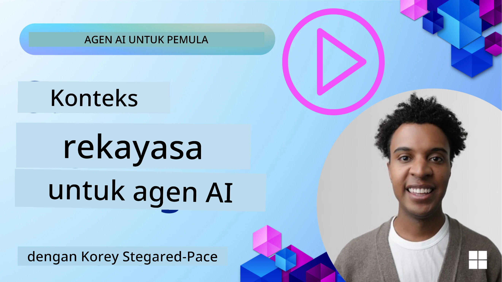
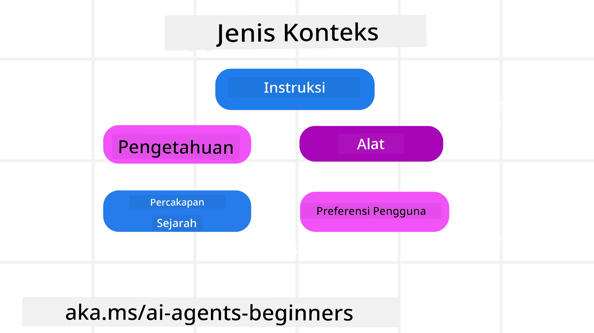
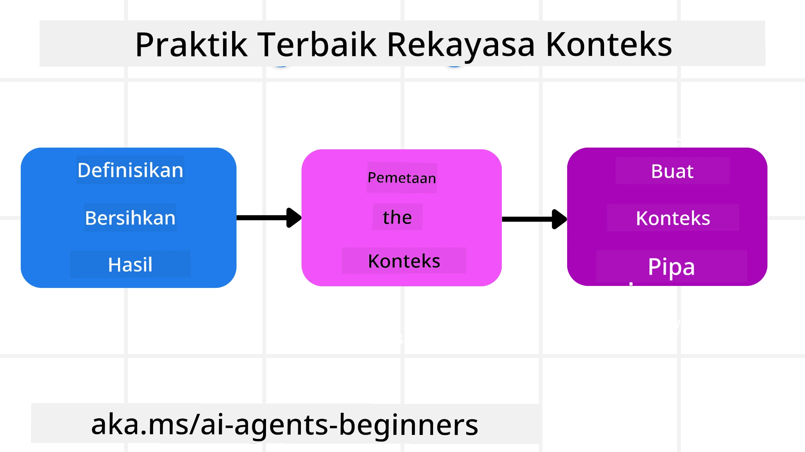

# Rekayasa Konteks untuk Agen AI

> _(Klik gambar di atas untuk menonton video pelajaran ini)_

Memahami kompleksitas aplikasi yang Anda bangun untuk agen AI penting untuk membuatnya dapat diandalkan. Kita perlu membangun Agen AI yang secara efektif mengelola informasi untuk memenuhi kebutuhan kompleks yang melampaui rekayasa prompt.

Dalam pelajaran ini, kita akan melihat apa itu rekayasa konteks dan perannya dalam membangun agen AI.

## Pengantar

Pelajaran ini akan membahas:

• **Apa itu Rekayasa Konteks** dan mengapa berbeda dengan rekayasa prompt.

• **Strategi untuk Rekayasa Konteks yang efektif**, termasuk cara menulis, memilih, mengompres, dan mengisolasi informasi.

• **Kegagalan Konteks yang Umum** yang dapat menggagalkan agen AI Anda dan cara memperbaikinya.

## Tujuan Pembelajaran

Setelah menyelesaikan pelajaran ini, Anda akan mengerti bagaimana:

• **Mendefinisikan rekayasa konteks** dan membedakannya dari rekayasa prompt.

• **Mengidentifikasi komponen utama konteks** dalam aplikasi Model Bahasa Besar (LLM).

• **Menerapkan strategi untuk menulis, memilih, mengompres, dan mengisolasi konteks** guna meningkatkan kinerja agen.

• **Mengenali kegagalan konteks umum** seperti kontaminasi, distraksi, kebingungan, dan konflik, serta menerapkan teknik mitigasi.

## Apa itu Rekayasa Konteks?

Untuk Agen AI, konteks adalah apa yang menggerakkan perencanaan Agen AI untuk mengambil tindakan tertentu. Rekayasa Konteks adalah praktik memastikan Agen AI memiliki informasi yang tepat untuk menyelesaikan langkah berikutnya dari tugas. Jendela konteks memiliki ukuran terbatas, jadi sebagai pembangun agen kita perlu membuat sistem dan proses untuk mengelola penambahan, penghapusan, dan pengompresan informasi dalam jendela konteks.

### Rekayasa Prompt vs Rekayasa Konteks

Rekayasa prompt fokus pada satu set instruksi statis untuk secara efektif memandu Agen AI dengan seperangkat aturan. Rekayasa konteks mengelola set informasi dinamis, termasuk prompt awal, untuk memastikan Agen AI memiliki apa yang dibutuhkan seiring waktu. Ide utama dari rekayasa konteks adalah membuat proses ini dapat diulang dan dapat diandalkan.

### Jenis Konteks

Penting untuk diingat bahwa konteks bukan hanya satu hal. Informasi yang dibutuhkan Agen AI dapat berasal dari berbagai sumber dan tugas kita memastikan agen dapat mengakses sumber-sumber tersebut:

Jenis konteks yang mungkin perlu dikelola agen AI meliputi:

• **Instruksi:** Ini seperti "aturan" agen – prompt, pesan sistem, contoh few-shot (menunjukkan AI bagaimana melakukan sesuatu), dan deskripsi alat yang bisa digunakan. Di sinilah fokus rekayasa prompt bergabung dengan rekayasa konteks.

• **Pengetahuan:** Meliputi fakta, informasi yang diambil dari database, atau memori jangka panjang yang dimiliki agen. Ini termasuk mengintegrasikan sistem Retrieval Augmented Generation (RAG) jika agen perlu mengakses berbagai toko pengetahuan dan database.

• **Alat:** Definisi fungsi eksternal, API, dan Server MCP yang dapat dipanggil agen, beserta umpan balik (hasil) yang diperoleh dari penggunaannya.

• **Riwayat Percakapan:** Dialog yang sedang berlangsung dengan pengguna. Seiring waktu, percakapan ini menjadi lebih panjang dan kompleks sehingga memakan ruang di jendela konteks.

• **Preferensi Pengguna:** Informasi yang dipelajari tentang kesukaan atau ketidaksukaan pengguna sepanjang waktu. Ini dapat disimpan dan digunakan ketika membuat keputusan penting untuk membantu pengguna.

## Strategi untuk Rekayasa Konteks yang Efektif

### Strategi Perencanaan

Rekayasa konteks yang baik dimulai dengan perencanaan yang baik. Berikut adalah pendekatan yang akan membantu Anda memulai berpikir tentang bagaimana menerapkan konsep rekayasa konteks:

1. **Tentukan Hasil yang Jelas** - Hasil tugas yang akan diberikan kepada Agen AI harus didefinisikan dengan jelas. Jawab pertanyaan - "Bagaimana dunia akan terlihat saat Agen AI selesai dengan tugasnya?" Dengan kata lain, perubahan, informasi, atau respons apa yang harus dimiliki pengguna setelah berinteraksi dengan Agen AI.
2. **Pemetaan Konteks** - Setelah Anda mendefinisikan hasil Agen AI, Anda perlu menjawab pertanyaan "Informasi apa yang diperlukan Agen AI untuk menyelesaikan tugas ini?". Dengan cara ini Anda dapat mulai memetakan konteks dari mana informasi tersebut dapat ditemukan.
3. **Buat Saluran Konteks** - Sekarang setelah Anda tahu di mana informasi itu berada, Anda perlu menjawab pertanyaan "Bagaimana Agen akan mendapatkan informasi ini?". Ini dapat dilakukan dengan berbagai cara termasuk RAG, penggunaan server MCP, dan alat lainnya.

### Strategi Praktis

Perencanaan penting tapi ketika informasi mulai mengalir ke jendela konteks agen kita, kita perlu strategi praktis untuk mengelolanya:

#### Mengelola Konteks

Walaupun beberapa informasi akan ditambahkan ke jendela konteks secara otomatis, rekayasa konteks adalah tentang mengambil peran lebih aktif atas informasi ini yang dapat dilakukan oleh beberapa strategi:

 1. **Catatan Agen**
 Ini memungkinkan Agen AI mencatat informasi relevan tentang tugas saat ini dan interaksi pengguna selama satu sesi. Ini harus ada di luar jendela konteks dalam sebuah file atau objek runtime yang dapat diambil oleh agen selama sesi ini jika diperlukan.

 2. **Memori**
 Catatan baik untuk mengelola informasi di luar jendela konteks sesi tunggal. Memori memungkinkan agen menyimpan dan mengambil informasi yang relevan di beberapa sesi. Ini bisa mencakup ringkasan, preferensi pengguna, dan umpan balik untuk perbaikan di masa depan.

 3. **Mengompres Konteks**
  Begitu jendela konteks tumbuh dan mendekati batasnya, teknik seperti merangkum dan memangkas dapat digunakan. Ini termasuk menjaga hanya informasi paling relevan atau menghapus pesan yang lebih lama.
  
 4. **Sistem Multi-Agen**
  Mengembangkan sistem multi-agen adalah bentuk rekayasa konteks karena setiap agen memiliki jendela konteksnya sendiri. Bagaimana konteks tersebut dibagikan dan diteruskan ke agen berbeda adalah hal lain yang perlu direncanakan saat membangun sistem ini.
  
 5. **Lingkungan Sandbox**
  Jika agen perlu menjalankan beberapa kode atau memproses banyak informasi dalam dokumen, ini dapat memakan banyak token untuk memproses hasilnya. Alih-alih menyimpan semuanya dalam jendela konteks, agen dapat menggunakan lingkungan sandbox yang mampu menjalankan kode ini dan hanya membaca hasil dan informasi relevan lainnya.
  
 6. **Objek Status Runtime**
   Ini dilakukan dengan membuat kontainer informasi untuk mengelola situasi ketika Agen perlu mengakses informasi tertentu. Untuk tugas kompleks, ini memungkinkan Agen menyimpan hasil setiap subtugas langkah demi langkah, sehingga konteks tetap terhubung hanya pada subtugas tersebut.

#### Memeriksa Konteks

Setelah Anda menerapkan salah satu strategi ini, ada baiknya memeriksa apa yang sebenarnya diterima panggilan model berikutnya. Pertanyaan debugging yang berguna adalah:

> Apakah agen memuat terlalu banyak konteks, konteks yang salah, atau melewatkan konteks yang dibutuhkan?

Anda tidak perlu mencatat prompt mentah, keluaran alat, atau isi memori untuk menjawab pertanyaan tersebut. Dalam produksi, lebih baik menggunakan catatan inspeksi konteks yang kecil yang menangkap hitungan, id, hash, dan label kebijakan:

- **Seleksi:** Lacak berapa banyak potongan calon, alat, atau memori yang dipertimbangkan, berapa banyak yang dipilih, dan aturan atau skor mana yang menyebabkan yang lain disaring.
- **Kompresi:** Catat rentang sumber atau id jejak, id ringkasan, perkiraan jumlah token sebelum dan setelah kompresi, dan apakah konten mentah dikecualikan dari panggilan berikutnya.
- **Isolasi:** Catat subtask mana yang dijalankan dalam agen, sesi, atau sandbox terpisah, ringkasan terbatas apa yang dikembalikan, dan apakah keluaran alat besar tetap di luar konteks agen induk.
- **Memori dan RAG:** Simpan id dokumen pengambilan, id memori, skor, id yang dipilih, dan status redaksi daripada teks lengkap yang diambil.
- **Keamanan dan privasi:** Gunakan hash, id, token bucket, dan label kebijakan daripada teks prompt yang sensitif, argumen alat, hasil alat, atau isi memori pengguna.

Tujuannya bukan untuk menyimpan lebih banyak konteks. Namun, meninggalkan cukup bukti agar pengembang dapat mengetahui strategi konteks mana yang dijalankan dan apakah itu mengubah panggilan model berikutnya sesuai dengan yang dimaksudkan.

### Contoh Rekayasa Konteks

Misalkan kita ingin agen AI **"Pesankan saya perjalanan ke Paris."**

• Agen sederhana yang hanya menggunakan rekayasa prompt mungkin hanya akan menjawab: **"Baik, kapan Anda ingin pergi ke Paris?"**. Ini hanya memproses pertanyaan langsung Anda pada saat pengguna bertanya.

• Agen yang menggunakan strategi rekayasa konteks yang dibahas akan melakukan lebih banyak hal. Sebelum merespons, sistem agen mungkin:

  ◦ **Periksa kalender Anda** untuk tanggal tersedia (mengambil data real-time).

 ◦ **Ingat preferensi perjalanan sebelumnya** (dari memori jangka panjang) seperti maskapai favorit, anggaran, atau apakah Anda lebih suka penerbangan langsung.

 ◦ **Identifikasi alat yang tersedia** untuk pemesanan penerbangan dan hotel.

- Kemudian, contoh respons bisa seperti:  "Hai [Nama Anda]! Saya lihat Anda bebas minggu pertama Oktober. Apakah saya cari penerbangan langsung ke Paris dengan [Maskapai Favorit] dalam anggaran Anda sebesar [Anggaran]?" Respons yang kaya dan sadar konteks ini menunjukkan kekuatan rekayasa konteks.

## Kegagalan Konteks yang Umum

### Kontaminasi Konteks

**Apa itu:** Ketika halusinasi (informasi palsu yang dihasilkan oleh LLM) atau kesalahan masuk ke dalam konteks dan sering dirujuk, menyebabkan agen mengejar tujuan yang mustahil atau mengembangkan strategi yang tidak masuk akal.

**Apa yang harus dilakukan:** Terapkan **validasi konteks** dan **karantina**. Validasi informasi sebelum ditambahkan ke memori jangka panjang. Jika kontaminasi potensial terdeteksi, mulai utas konteks baru untuk mencegah informasi buruk menyebar.

**Contoh Pemesanan Perjalanan:** Agen Anda berhalusinasi **penerbangan langsung dari bandara lokal kecil ke kota internasional jauh** yang sebenarnya tidak menyediakan penerbangan internasional. Detail penerbangan yang tidak ada ini disimpan ke dalam konteks. Nanti, saat Anda meminta agen memesan, ia terus mencoba mencari tiket untuk rute mustahil ini, menyebabkan kesalahan berulang.

**Solusi:** Terapkan langkah yang **memvalidasi keberadaan penerbangan dan rute dengan API real-time** _sebelum_ menambahkan detail penerbangan ke konteks kerja agen. Jika validasi gagal, informasi salah tersebut "dikarantina" dan tidak digunakan lebih lanjut.

### Distraksi Konteks

**Apa itu:** Ketika konteks menjadi sangat besar sehingga model terlalu fokus pada riwayat yang terkumpul daripada menggunakan apa yang dipelajari selama pelatihan, menyebabkan tindakan berulang atau tidak membantu. Model dapat mulai melakukan kesalahan bahkan sebelum jendela konteks penuh.

**Apa yang harus dilakukan:** Gunakan **perangkuman konteks**. Secara berkala kompres informasi yang terkumpul menjadi ringkasan yang lebih pendek, menjaga detail penting sambil menghapus riwayat yang berulang. Ini membantu "mengatur ulang" fokus.

**Contoh Pemesanan Perjalanan:** Anda telah membicarakan berbagai tujuan perjalanan impian dalam waktu lama, termasuk cerita rinci tentang perjalanan backpacking dua tahun lalu. Saat akhirnya Anda meminta **"carikan penerbangan murah untuk bulan depan,"** agen terjebak dalam detail lama yang tidak relevan dan terus menanyakan perlengkapan backpacking atau rencana perjalanan sebelumnya, mengabaikan permintaan Anda saat ini.

**Solusi:** Setelah sejumlah putaran tertentu atau saat konteks tumbuh terlalu besar, agen harus **merangkum bagian percakapan terbaru dan paling relevan** – fokus pada tanggal perjalanan dan tujuan saat ini – dan menggunakan ringkasan terkondensasi itu untuk panggilan LLM berikutnya, membuang percakapan sejarah yang kurang relevan.

### Kebingungan Konteks

**Apa itu:** Ketika konteks yang tidak perlu, sering berupa terlalu banyak alat yang tersedia, menyebabkan model menghasilkan respons buruk atau memanggil alat yang tidak relevan. Model yang lebih kecil sangat rentan terhadap ini.

**Apa yang harus dilakukan:** Terapkan **manajemen muatan alat** menggunakan teknik RAG. Simpan deskripsi alat dalam database vektor dan pilih _hanya_ alat paling relevan untuk setiap tugas spesifik. Penelitian menunjukkan membatasi pilihan alat kurang dari 30.

**Contoh Pemesanan Perjalanan:** Agen Anda memiliki akses ke puluhan alat: `book_flight`, `book_hotel`, `rent_car`, `find_tours`, `currency_converter`, `weather_forecast`, `restaurant_reservations`, dll. Anda bertanya, **"Cara terbaik berkeliling Paris apa?"** Karena banyaknya alat, agen bingung dan mencoba memanggil `book_flight` _di dalam_ Paris, atau `rent_car` meskipun Anda lebih suka transportasi umum, karena deskripsi alat tumpang tindih atau agen tidak bisa membedakan yang terbaik.

**Solusi:** Gunakan **RAG pada deskripsi alat**. Ketika Anda bertanya tentang berkeliling Paris, sistem secara dinamis mengambil _hanya_ alat yang paling relevan seperti `rent_car` atau `public_transport_info` berdasarkan kueri Anda, menyajikan "muatan" alat yang terfokus ke LLM.

### Konflik Konteks

**Apa itu:** Ketika ada informasi yang bertentangan dalam konteks, menyebabkan penalaran yang tidak konsisten atau hasil akhir yang buruk. Ini sering terjadi saat informasi datang bertahap, dan asumsi awal yang salah tetap ada dalam konteks.

**Apa yang harus dilakukan:** Gunakan **pemangkasan konteks** dan **offloading**. Pemangkasan berarti menghapus informasi yang sudah usang atau bertentangan saat detail baru datang. Offloading memberi model ruang kerja "catatan" terpisah untuk memproses informasi tanpa memenuhi konteks utama.

**Contoh Pemesanan Perjalanan:** Awalnya Anda memberi tahu agen Anda, **"Saya ingin terbang kelas ekonomi."** Kemudian dalam percakapan, Anda berubah pikiran dan berkata, **"Sebenarnya, untuk perjalanan ini, mari gunakan kelas bisnis."** Jika kedua instruksi tersebut tetap ada dalam konteks, agen mungkin menerima hasil pencarian yang bertentangan atau bingung tentang preferensi mana yang harus diutamakan.

**Solusi:** Terapkan **pemangkasan konteks**. Ketika instruksi baru bertentangan dengan yang lama, instruksi lama dihapus atau secara eksplisit diganti dalam konteks. Alternatifnya, agen dapat menggunakan **scratchpad** untuk menyelesaikan preferensi yang bertentangan sebelum memutuskan, memastikan hanya instruksi akhir yang konsisten yang mengarahkan tindakannya.

## Punya Pertanyaan Lebih Lanjut Tentang Rekayasa Konteks?

Bergabunglah dengan [Microsoft Foundry Discord](https://discord.com/invite/ATgtXmAS5D) untuk bertemu dengan pelajar lain, mengikuti jam kantor dan mendapatkan jawaban atas pertanyaan Anda tentang Agen AI.

---

<!-- CO-OP TRANSLATOR DISCLAIMER START -->
**Penafian**:
Dokumen ini telah diterjemahkan menggunakan layanan terjemahan AI [Co-op Translator](https://github.com/Azure/co-op-translator). Meskipun kami berupaya untuk mencapai akurasi, harap diketahui bahwa terjemahan otomatis mungkin mengandung kesalahan atau ketidakakuratan. Dokumen asli dalam bahasa aslinya harus dianggap sebagai sumber yang sah. Untuk informasi penting, disarankan menggunakan terjemahan profesional oleh manusia. Kami tidak bertanggung jawab atas kesalahpahaman atau penafsiran yang keliru yang timbul dari penggunaan terjemahan ini.
<!-- CO-OP TRANSLATOR DISCLAIMER END -->