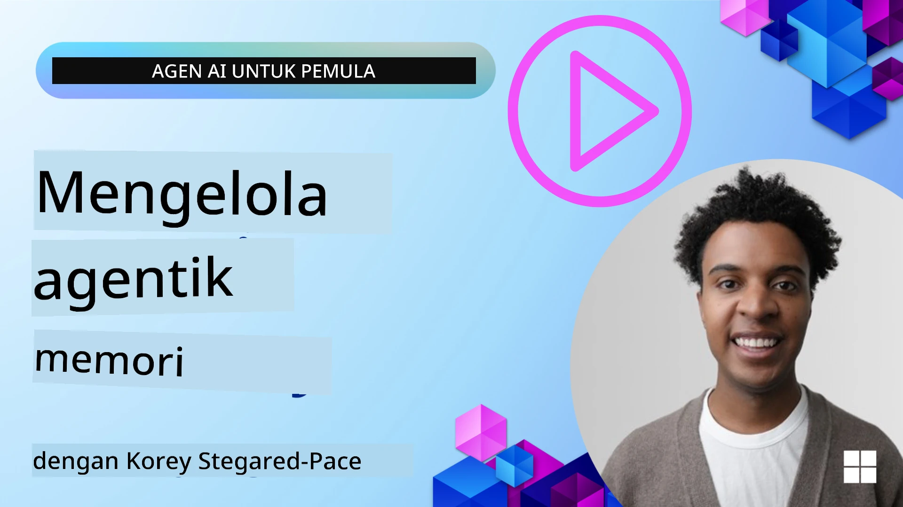

# Memori untuk Agen AI 

Saat membahas manfaat unik dari pembuatan Agen AI, dua hal yang terutama dibicarakan: kemampuan memanggil alat untuk menyelesaikan tugas dan kemampuan untuk berkembang seiring waktu. Memori adalah dasar dari penciptaan agen yang dapat meningkatkan dirinya sendiri yang dapat menciptakan pengalaman yang lebih baik bagi pengguna kita.

Dalam pelajaran ini, kita akan melihat apa itu memori untuk Agen AI dan bagaimana kita dapat mengelolanya serta menggunakannya untuk keuntungan aplikasi kita.

## Pendahuluan

Pelajaran ini akan membahas:

• **Memahami Memori Agen AI**: Apa itu memori dan mengapa penting untuk agen.

• **Implementasi dan Penyimpanan Memori**: Metode praktis untuk menambahkan kemampuan memori ke agen AI Anda, dengan fokus pada memori jangka pendek dan jangka panjang.

• **Membuat Agen AI Meningkatkan Diri Sendiri**: Bagaimana memori memungkinkan agen belajar dari interaksi masa lalu dan berkembang seiring waktu.

## Implementasi yang Tersedia

Pelajaran ini mencakup dua tutorial notebook yang komprehensif:

• **[13-agent-memory.ipynb](./13-agent-memory.ipynb)**: Mengimplementasikan memori menggunakan Mem0 dan Azure AI Search dengan Microsoft Agent Framework

• **[13-agent-memory-cognee.ipynb](./13-agent-memory-cognee.ipynb)**: Mengimplementasikan memori terstruktur menggunakan Cognee, secara otomatis membangun grafik pengetahuan yang didukung oleh embeddings, memvisualisasikan grafik, dan pengambilan cerdas

## Tujuan Pembelajaran

Setelah menyelesaikan pelajaran ini, Anda akan mengetahui cara:

• **Membedakan berbagai jenis memori agen AI**, termasuk memori kerja, jangka pendek, dan jangka panjang, serta bentuk khusus seperti memori persona dan episodik.

• **Mengimplementasikan dan mengelola memori jangka pendek dan jangka panjang untuk agen AI** menggunakan Microsoft Agent Framework, memanfaatkan alat seperti Mem0, Cognee, memori Whiteboard, dan integrasi dengan Azure AI Search.

• **Memahami prinsip di balik agen AI yang meningkatkan diri sendiri** dan bagaimana sistem pengelolaan memori yang kuat berkontribusi pada pembelajaran dan adaptasi berkelanjutan.

## Memahami Memori Agen AI

Pada intinya, **memori untuk agen AI mengacu pada mekanisme yang memungkinkan mereka menyimpan dan mengingat informasi**. Informasi ini bisa berupa detail spesifik tentang percakapan, preferensi pengguna, tindakan masa lalu, atau pola yang dipelajari.

Tanpa memori, aplikasi AI sering bersifat tanpa status (stateless), artinya setiap interaksi dimulai dari awal. Ini menyebabkan pengalaman pengguna yang berulang dan membuat frustasi di mana agen "melupakan" konteks atau preferensi sebelumnya.

### Mengapa Memori Penting?

Kecerdasan agen sangat terkait dengan kemampuannya mengingat dan memanfaatkan informasi masa lalu. Memori memungkinkan agen untuk:

• **Reflektif**: Belajar dari tindakan dan hasil masa lalu.

• **Interaktif**: Mempertahankan konteks selama percakapan yang sedang berlangsung.

• **Proaktif dan Reaktif**: Mengantisipasi kebutuhan atau merespons dengan tepat berdasarkan data historis.

• **Otonom**: Beroperasi lebih mandiri dengan menarik pengetahuan yang tersimpan.

Tujuan dari implementasi memori adalah membuat agen lebih **andal dan mampu**.

### Jenis Memori

#### Memori Kerja

Anggap ini seperti selembar kertas sketsa yang digunakan agen saat menjalankan satu tugas atau proses pemikiran yang sedang berjalan. Memori ini menyimpan informasi segera yang diperlukan untuk menghitung langkah berikutnya.

Untuk agen AI, memori kerja sering menangkap informasi paling relevan dari sebuah percakapan, bahkan jika riwayat obrolan lengkapnya panjang atau terpotong. Fokusnya adalah mengekstrak elemen kunci seperti kebutuhan, proposal, keputusan, dan tindakan.

**Contoh Memori Kerja**

Dalam agen pemesanan perjalanan, memori kerja mungkin menangkap permintaan pengguna saat ini, seperti "Saya ingin memesan perjalanan ke Paris". Kebutuhan spesifik ini disimpan dalam konteks langsung agen untuk membimbing interaksi saat ini.

#### Memori Jangka Pendek

Jenis memori ini menyimpan informasi selama durasi satu percakapan atau sesi. Ini adalah konteks dari obrolan saat ini, memungkinkan agen merujuk kembali ke giliran sebelumnya dalam dialog.

Dalam contoh SDK Python [Microsoft Agent Framework](https://github.com/microsoft/agent-framework), ini terkait dengan `AgentSession`, yang dibuat dengan `agent.create_session()`. Sesi ini merupakan memori jangka pendek bawaan framework: menyimpan konteks percakapan selama sesi yang sama digunakan kembali, tetapi konteks ini tidak dipertahankan saat sesi berakhir atau aplikasi dimulai ulang. Gunakan memori jangka panjang untuk fakta dan preferensi yang perlu bertahan antar sesi, biasanya melalui basis data, indeks vektor, atau penyimpanan persisten lainnya.

**Contoh Memori Jangka Pendek**

Jika pengguna bertanya, "Berapa harga tiket pesawat ke Paris?" dan kemudian melanjutkan dengan "Bagaimana dengan akomodasi di sana?", memori jangka pendek memastikan agen tahu bahwa "sana" merujuk ke "Paris" dalam percakapan yang sama.

#### Memori Jangka Panjang

Ini adalah informasi yang bertahan di banyak percakapan atau sesi. Ini memungkinkan agen mengingat preferensi pengguna, interaksi historis, atau pengetahuan umum selama periode waktu yang panjang. Ini penting untuk personalisasi.

**Contoh Memori Jangka Panjang**

Memori jangka panjang mungkin menyimpan bahwa "Ben suka ski dan kegiatan luar ruangan, suka kopi dengan pemandangan pegunungan, dan ingin menghindari jalur ski yang sulit karena cedera sebelumnya". Informasi ini, yang dipelajari dari interaksi sebelumnya, memengaruhi rekomendasi di sesi perencanaan perjalanan di masa depan, membuatnya sangat personal.

#### Memori Persona

Jenis memori khusus ini membantu agen mengembangkan "kepribadian" atau "persona" yang konsisten. Ini memungkinkan agen mengingat detail tentang dirinya sendiri atau peran yang dituju, membuat interaksi lebih lancar dan terfokus.

**Contoh Memori Persona**  
Jika agen perjalanan dirancang sebagai "ahli perencana ski," memori persona dapat memperkuat peran ini, memengaruhi responsnya agar sesuai dengan nada dan pengetahuan seorang ahli.

#### Memori Workflow/Episodik

Memori ini menyimpan urutan langkah yang diambil agen selama tugas kompleks, termasuk keberhasilan dan kegagalan. Seperti mengingat "episode" atau pengalaman masa lalu untuk belajar darinya.

**Contoh Memori Episodik**

Jika agen mencoba memesan penerbangan tertentu tapi gagal karena tidak tersedia, memori episodik dapat mencatat kegagalan ini, memungkinkan agen mencoba penerbangan alternatif atau memberitahu pengguna tentang masalah tersebut dengan cara yang lebih terinformasi saat mencoba kembali.

#### Memori Entitas

Ini melibatkan ekstraksi dan pengingatan entitas tertentu (seperti orang, tempat, atau benda) dan peristiwa dari percakapan. Memungkinkan agen membangun pemahaman terstruktur tentang elemen kunci yang dibahas.

**Contoh Memori Entitas**

Dari percakapan tentang perjalanan masa lalu, agen mungkin mengekstrak "Paris," "Menara Eiffel," dan "makan malam di restoran Le Chat Noir" sebagai entitas. Dalam interaksi mendatang, agen dapat mengingat "Le Chat Noir" dan menawarkan untuk membuat reservasi baru di sana.

#### Structured RAG (Retrieval Augmented Generation)

Meskipun RAG adalah teknik yang lebih luas, "Structured RAG" disorot sebagai teknologi memori yang kuat. Ini mengekstrak informasi padat dan terstruktur dari berbagai sumber (percakapan, email, gambar) dan menggunakannya untuk meningkatkan presisi, recall, dan kecepatan respons. Berbeda dengan RAG klasik yang hanya mengandalkan kesamaan semantik, Structured RAG bekerja dengan struktur informasi yang melekat.

**Contoh Structured RAG**

Alih-alih hanya mencocokkan kata kunci, Structured RAG bisa menguraikan detail penerbangan (tujuan, tanggal, waktu, maskapai) dari email dan menyimpannya secara terstruktur. Ini memungkinkan pertanyaan yang tepat seperti "Penerbangan apa yang saya pesan ke Paris pada hari Selasa?"

## Implementasi dan Penyimpanan Memori

Mengimplementasikan memori untuk agen AI melibatkan proses sistematis **manajemen memori**, termasuk menghasilkan, menyimpan, mengambil, mengintegrasikan, memperbarui, dan bahkan "melupakan" (atau menghapus) informasi. Pengambilan menjadi aspek yang sangat penting.

### Alat Memori Khusus

#### Mem0

Salah satu cara untuk menyimpan dan mengelola memori agen adalah menggunakan alat khusus seperti Mem0. Mem0 berfungsi sebagai lapisan memori persisten, memungkinkan agen mengingat interaksi relevan, menyimpan preferensi pengguna dan konteks faktual, serta belajar dari keberhasilan dan kegagalan seiring waktu. Gagasannya adalah agen tanpa status berubah menjadi agen dengan status.

Ini bekerja melalui **pipeline memori dua fase: ekstraksi dan pembaruan**. Pertama, pesan yang ditambahkan ke thread agen dikirim ke layanan Mem0, yang menggunakan Large Language Model (LLM) untuk merangkum riwayat percakapan dan mengekstrak memori baru. Selanjutnya, fase pembaruan yang dijalankan oleh LLM menentukan apakah akan menambah, memodifikasi, atau menghapus memori ini, menyimpannya dalam penyimpanan data hibrida yang bisa mencakup basis data vektor, grafik, dan key-value. Sistem ini juga mendukung berbagai jenis memori dan dapat menggabungkan memori grafik untuk mengelola hubungan antar entitas.

#### Cognee

Pendekatan kuat lainnya adalah menggunakan **Cognee**, memori semantik sumber terbuka untuk agen AI yang mengubah data terstruktur dan tidak terstruktur menjadi grafik pengetahuan yang dapat ditanyakan yang didukung oleh embeddings. Cognee menyediakan **arsitektur penyimpanan ganda** yang menggabungkan pencarian kesamaan vektor dengan hubungan grafik, memungkinkan agen memahami tidak hanya informasi apa yang mirip, tetapi bagaimana konsep saling berkaitan.

Ini unggul dalam **pengambilan hibrida** yang memadukan kesamaan vektor, struktur grafik, dan penalaran LLM - mulai dari pencarian potongan mentah hingga tanya jawab yang sadar grafik. Sistem ini mempertahankan **memori hidup** yang berkembang dan tumbuh sambil tetap bisa ditanyakan sebagai satu grafik terhubung, mendukung konteks sesi jangka pendek dan memori persisten jangka panjang.

Tutorial notebook Cognee ([13-agent-memory-cognee.ipynb](./13-agent-memory-cognee.ipynb)) menunjukkan cara membangun lapisan memori terpadu ini, dengan contoh praktis mengimpor berbagai sumber data, memvisualisasikan grafik pengetahuan, dan bertanya dengan berbagai strategi pencarian yang disesuaikan dengan kebutuhan agen tertentu.

### Menyimpan Memori dengan RAG

Selain alat memori khusus seperti mem0, Anda dapat memanfaatkan layanan pencarian yang kuat seperti **Azure AI Search sebagai backend untuk menyimpan dan mengambil memori**, terutama untuk Structured RAG.

Ini memungkinkan Anda menguatkan respons agen dengan data milik Anda sendiri, memastikan jawaban yang lebih relevan dan akurat. Azure AI Search bisa digunakan untuk menyimpan memori perjalanan spesifik pengguna, katalog produk, atau pengetahuan domain khusus lainnya.

Azure AI Search mendukung kemampuan seperti **Structured RAG**, yang unggul dalam mengekstrak dan mengambil informasi padat dan terstruktur dari kumpulan data besar seperti riwayat percakapan, email, atau bahkan gambar. Ini memberikan "presisi dan recall superhuman" dibandingkan dengan pendekatan penggal dan embedding teks tradisional.

## Membuat Agen AI Meningkatkan Diri Sendiri

Pola umum untuk agen yang meningkatkan diri sendiri melibatkan pengenalan **"agen pengetahuan"**. Agen terpisah ini mengamati percakapan utama antara pengguna dan agen utama. Perannya adalah untuk:

1. **Mengidentifikasi informasi berharga**: Menentukan apakah bagian dari percakapan layak disimpan sebagai pengetahuan umum atau preferensi pengguna tertentu.

2. **Mengekstrak dan merangkum**: Menyaring pembelajaran atau preferensi penting dari percakapan.

3. **Menyimpan dalam basis pengetahuan**: Menyimpan informasi yang diambil ini, sering kali di basis data vektor, agar dapat diambil kembali nanti.

4. **Meningkatkan kueri masa depan**: Ketika pengguna memulai kueri baru, agen pengetahuan mengambil informasi relevan yang tersimpan dan menambahkannya ke prompt pengguna, memberikan konteks penting untuk agen utama (mirip RAG).

### Optimasi untuk Memori

• **Manajemen Latensi**: Untuk menghindari memperlambat interaksi pengguna, model yang lebih murah dan cepat bisa digunakan pertama kali untuk memeriksa dengan cepat apakah informasi bernilai untuk disimpan atau diambil, hanya memanggil proses ekstraksi/pengambilan yang lebih kompleks jika perlu.

• **Pemeliharaan Basis Pengetahuan**: Untuk basis pengetahuan yang terus berkembang, informasi yang jarang digunakan dapat dipindahkan ke "cold storage" untuk mengelola biaya.

## Punya Pertanyaan Lebih Lanjut Tentang Memori Agen?

Bergabunglah di [Microsoft Foundry Discord](https://aka.ms/ai-agents/discord) untuk bertemu dengan pelajar lain, menghadiri sesi tanya jawab, dan mendapatkan jawaban atas pertanyaan Anda tentang Agen AI.

---

<!-- CO-OP TRANSLATOR DISCLAIMER START -->
**Penafian**:
Dokumen ini telah diterjemahkan menggunakan layanan terjemahan AI [Co-op Translator](https://github.com/Azure/co-op-translator). Meskipun kami berupaya untuk mencapai akurasi, harap diketahui bahwa terjemahan otomatis mungkin mengandung kesalahan atau ketidakakuratan. Dokumen asli dalam bahasa aslinya harus dianggap sebagai sumber yang sah. Untuk informasi penting, disarankan menggunakan terjemahan profesional oleh manusia. Kami tidak bertanggung jawab atas kesalahpahaman atau penafsiran yang keliru yang timbul dari penggunaan terjemahan ini.
<!-- CO-OP TRANSLATOR DISCLAIMER END -->