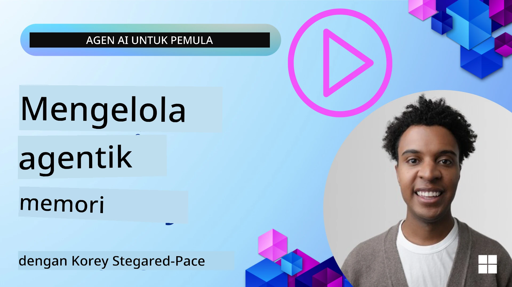

# Memori untuk Agen AI 

Saat membahas manfaat unik dari pembuatan Agen AI, dua hal utama yang dibicarakan: kemampuan memanggil alat untuk menyelesaikan tugas dan kemampuan untuk berkembang seiring waktu. Memori adalah dasar dalam menciptakan agen yang bisa memperbaiki dirinya sendiri dan memberikan pengalaman yang lebih baik bagi pengguna kita.

Dalam pelajaran ini, kita akan melihat apa itu memori untuk Agen AI dan bagaimana kita bisa mengelolanya serta menggunakannya untuk keuntungan aplikasi kita.

## Pendahuluan

Pelajaran ini akan membahas:

• **Memahami Memori Agen AI**: Apa itu memori dan mengapa penting bagi agen.

• **Menerapkan dan Menyimpan Memori**: Metode praktis untuk menambahkan kemampuan memori pada agen AI Anda, dengan fokus pada memori jangka pendek dan jangka panjang.

• **Membuat Agen AI yang Memperbaiki Diri Sendiri**: Bagaimana memori memungkinkan agen belajar dari interaksi sebelumnya dan memperbaiki diri seiring waktu.

## Implementasi yang Tersedia

Pelajaran ini mencakup dua tutorial notebook yang komprehensif:

• **[13-agent-memory.ipynb](./13-agent-memory.ipynb)**: Menerapkan memori menggunakan Mem0 dan Azure AI Search dengan Microsoft Agent Framework

• **[13-agent-memory-cognee.ipynb](./13-agent-memory-cognee.ipynb)**: Menerapkan memori terstruktur menggunakan Cognee, secara otomatis membangun grafik pengetahuan yang didukung oleh embeddings, memvisualisasikan grafik, dan pengambilan cerdas

## Tujuan Pembelajaran

Setelah menyelesaikan pelajaran ini, Anda akan mengetahui cara:

• **Membedakan berbagai jenis memori agen AI**, termasuk memori kerja, jangka pendek, dan jangka panjang, serta bentuk khusus seperti persona dan memori episodik.

• **Menerapkan dan mengelola memori jangka pendek dan jangka panjang untuk agen AI** menggunakan Microsoft Agent Framework, memanfaatkan alat seperti Mem0, Cognee, memori Whiteboard, dan integrasi dengan Azure AI Search.

• **Memahami prinsip di balik agen AI yang memperbaiki diri** dan bagaimana sistem manajemen memori yang kuat berkontribusi pada pembelajaran dan adaptasi berkelanjutan.

## Memahami Memori Agen AI

Pada intinya, **memori untuk agen AI merujuk pada mekanisme yang memungkinkan mereka menyimpan dan mengingat informasi**. Informasi ini bisa berupa detail spesifik tentang percakapan, preferensi pengguna, tindakan sebelumnya, atau pola yang telah dipelajari.

Tanpa memori, aplikasi AI sering kali tidak memiliki status, artinya setiap interaksi dimulai dari awal. Hal ini menyebabkan pengalaman pengguna yang berulang dan membuat frustrasi di mana agen "lupa" konteks atau preferensi sebelumnya.

### Mengapa Memori Penting?

kecerdasan agen sangat terkait dengan kemampuannya untuk mengingat dan menggunakan informasi masa lalu. Memori memungkinkan agen untuk:

• **Reflektif**: Belajar dari tindakan dan hasil sebelumnya.

• **Interaktif**: Mempertahankan konteks selama percakapan yang berlangsung.

• **Proaktif dan Reaktif**: Mengantisipasi kebutuhan atau merespon dengan tepat berdasarkan data historis.

• **Otonom**: Beroperasi lebih mandiri dengan memanfaatkan pengetahuan yang tersimpan.

Tujuan penerapan memori adalah membuat agen lebih **andal dan mampu**.

### Jenis-Jenis Memori

#### Memori Kerja

Anggap ini sebagai selembar kertas kosong yang digunakan agen selama tugas atau proses pemikiran yang sedang berlangsung. Ini memegang informasi langsung yang dibutuhkan untuk menghitung langkah berikutnya.

Untuk agen AI, memori kerja sering menangkap informasi paling relevan dari percakapan, bahkan jika riwayat chat lengkap panjang atau terpotong. Fokus pada ekstraksi elemen kunci seperti kebutuhan, usulan, keputusan, dan tindakan.

**Contoh Memori Kerja**

Dalam agen pemesanan perjalanan, memori kerja mungkin menangkap permintaan pengguna saat ini, seperti "Saya ingin memesan perjalanan ke Paris". Kebutuhan spesifik ini dipegang dalam konteks langsung agen untuk mengarahkan interaksi saat ini.

#### Memori Jangka Pendek

Jenis memori ini mempertahankan informasi selama satu percakapan atau sesi. Ini adalah konteks chat saat ini, memungkinkan agen merujuk kembali ke putaran sebelumnya dalam dialog.

Dalam contoh SDK Python [Microsoft Agent Framework](https://github.com/microsoft/agent-framework), ini terkait dengan `AgentSession`, yang dibuat dengan `agent.create_session()`. Sesi ini adalah memori jangka pendek bawaan framework: ia menyimpan konteks percakapan selama sesi yang sama digunakan ulang, tapi konteks ini tidak dipersistensikan saat sesi berakhir atau aplikasi dimulai ulang. Gunakan memori jangka panjang untuk fakta dan preferensi yang perlu bertahan antar sesi, biasanya melalui database, indeks vektor, atau penyimpanan persisten lain.

**Contoh Memori Jangka Pendek**

Jika pengguna bertanya, "Berapa harga penerbangan ke Paris?" lalu dilanjutkan dengan "Bagaimana dengan akomodasi di sana?", memori jangka pendek memastikan agen tahu "di sana" merujuk ke "Paris" dalam percakapan yang sama.

#### Memori Jangka Panjang

Ini adalah informasi yang bertahan melintasi beberapa percakapan atau sesi. Memungkinkan agen mengingat preferensi pengguna, interaksi historis, atau pengetahuan umum selama periode panjang. Ini penting untuk personalisasi.

**Contoh Memori Jangka Panjang**

Memori jangka panjang mungkin menyimpan bahwa "Ben suka ski dan aktivitas luar ruangan, menyukai kopi dengan pemandangan gunung, dan ingin menghindari jalur ski tingkat lanjut karena cedera masa lalu". Informasi ini, dipelajari dari interaksi sebelumnya, memengaruhi rekomendasi dalam sesi perencanaan perjalanan di masa depan, menjadikannya sangat personal.

#### Memori Persona

Jenis memori khusus ini membantu agen mengembangkan "kepribadian" atau "persona" yang konsisten. Memungkinkan agen mengingat detail tentang dirinya sendiri atau peran yang dimaksudkan, membuat interaksi lebih lancar dan fokus.

**Contoh Memori Persona**
Jika agen perjalanan dirancang sebagai "perencana ski ahli," memori persona mungkin memperkuat peran ini, memengaruhi responsnya agar sesuai dengan nada dan pengetahuan ahli.

#### Memori Alur Kerja/Episodik

Memori ini menyimpan urutan langkah yang diambil agen selama tugas kompleks, termasuk keberhasilan dan kegagalan. Ini seperti mengingat "episode" atau pengalaman masa lalu untuk belajar darinya.

**Contoh Memori Episodik**

Jika agen mencoba memesan penerbangan tertentu tetapi gagal karena ketidaktersediaan, memori episodik bisa merekam kegagalan ini, memungkinkan agen mencoba alternatif lain atau memberi tahu pengguna tentang masalah secara lebih terinformasi pada upaya berikutnya.

#### Memori Entitas

Ini melibatkan ekstraksi dan pengingatan entitas spesifik (seperti orang, tempat, atau benda) dan kejadian dari percakapan. Memungkinkan agen membangun pemahaman terstruktur tentang elemen utama yang dibahas.

**Contoh Memori Entitas**

Dari percakapan tentang perjalanan sebelumnya, agen mungkin mengekstrak "Paris," "Menara Eiffel," dan "makan malam di restoran Le Chat Noir" sebagai entitas. Dalam interaksi berikutnya, agen bisa mengingat "Le Chat Noir" dan menawarkan untuk membuat reservasi baru di sana.

#### Structured RAG (Retrieval Augmented Generation)

Meskipun RAG adalah teknik yang lebih luas, "Structured RAG" disorot sebagai teknologi memori yang kuat. Ini mengekstrak informasi padat dan terstruktur dari berbagai sumber (percakapan, email, gambar) dan menggunakannya untuk meningkatkan ketepatan, pengingatan, dan kecepatan dalam respons. Berbeda dengan RAG klasik yang hanya mengandalkan kesamaan semantik, Structured RAG bekerja dengan struktur informasi yang melekat.

**Contoh Structured RAG**

Alih-alih hanya mencocokkan kata kunci, Structured RAG dapat mengurai detail penerbangan (tujuan, tanggal, waktu, maskapai) dari sebuah email dan menyimpannya secara terstruktur. Ini memungkinkan kueri tepat seperti "Penerbangan apa yang saya pesan ke Paris pada hari Selasa?"

## Menerapkan dan Menyimpan Memori

Menerapkan memori untuk agen AI melibatkan proses sistematis **manajemen memori**, yang mencakup pembuatan, penyimpanan, pengambilan, integrasi, pembaruan, dan bahkan "melupakan" (atau menghapus) informasi. Pengambilan adalah aspek yang sangat penting.

### Alat Memori Khusus

#### Mem0

Salah satu cara untuk menyimpan dan mengelola memori agen adalah menggunakan alat khusus seperti Mem0. Mem0 berfungsi sebagai lapisan memori persisten, memungkinkan agen mengingat interaksi relevan, menyimpan preferensi pengguna dan konteks fakta, serta belajar dari keberhasilan dan kegagalan dari waktu ke waktu. Gagasannya adalah agen yang tanpa status menjadi agen yang memiliki status.

Ia bekerja melalui **pipeline memori dua fase: ekstraksi dan pembaruan**. Pertama, pesan yang ditambahkan ke thread agen dikirim ke layanan Mem0, yang menggunakan Large Language Model (LLM) untuk meringkas riwayat percakapan dan mengekstrak memori baru. Selanjutnya, fase pembaruan yang digerakkan oleh LLM menentukan apakah memori ini akan ditambahkan, dimodifikasi, atau dihapus, menyimpannya dalam penyimpanan data hibrida yang bisa mencakup database vektor, grafik, dan key-value. Sistem ini juga mendukung berbagai jenis memori dan dapat mengintegrasikan memori grafik untuk mengelola hubungan antar entitas.

#### Cognee

Pendekatan kuat lainnya adalah menggunakan **Cognee**, sebuah memori semantik sumber terbuka untuk agen AI yang mengubah data terstruktur dan tidak terstruktur menjadi grafik pengetahuan yang dapat diquery yang didukung oleh embeddings. Cognee menyediakan **arsitektur dual-store** yang menggabungkan pencarian kesamaan vektor dengan hubungan grafik, memungkinkan agen memahami tidak hanya informasi yang mirip, tapi juga bagaimana konsep saling berhubungan.

Ia unggul dalam **pengambilan hibrida** yang memadukan kesamaan vektor, struktur grafik, dan penalaran LLM - mulai dari pencarian potongan mentah hingga tanya jawab yang sadar grafik. Sistem ini mempertahankan **memori hidup** yang berkembang dan tumbuh sambil tetap bisa diquery sebagai satu grafik yang terhubung, mendukung konteks sesi jangka pendek dan memori persisten jangka panjang.

Tutorial notebook Cognee ([13-agent-memory-cognee.ipynb](./13-agent-memory-cognee.ipynb)) menunjukkan pembangunan lapisan memori terpadu ini, dengan contoh praktis memasukkan beragam sumber data, memvisualisasikan grafik pengetahuan, dan meng-query dengan strategi pencarian berbeda yang disesuaikan dengan kebutuhan agen tertentu.

### Menyimpan Memori dengan RAG

Selain alat memori khusus seperti Mem0, Anda dapat memanfaatkan layanan pencarian kuat seperti **Azure AI Search sebagai backend untuk menyimpan dan mengambil memori**, terutama untuk Structured RAG.

Ini memungkinkan Anda membumikan respons agen dengan data Anda sendiri, memastikan jawaban lebih relevan dan akurat. Azure AI Search dapat digunakan untuk menyimpan memori perjalanan spesifik pengguna, katalog produk, atau pengetahuan domain khusus lainnya.

Azure AI Search mendukung kemampuan seperti **Structured RAG**, yang unggul dalam mengekstrak dan mengambil informasi padat dan terstruktur dari dataset besar seperti riwayat percakapan, email, atau bahkan gambar. Ini memberikan "ketepatan dan pengingatan superhuman" dibandingkan pendekatan pemotongan teks dan embedding tradisional.

## Membuat Agen AI Memperbaiki Diri Sendiri

Pola umum untuk agen yang memperbaiki diri melibatkan memperkenalkan **"agen pengetahuan"**. Agen terpisah ini mengamati percakapan utama antara pengguna dan agen utama. Perannya adalah untuk:

1. **Mengidentifikasi informasi berharga**: Menentukan apakah bagian dari percakapan layak disimpan sebagai pengetahuan umum atau preferensi pengguna spesifik.

2. **Mengekstrak dan meringkas**: Mengambil pembelajaran atau preferensi penting dari percakapan.

3. **Menyimpan dalam basis pengetahuan**: Mempersistensikan informasi yang diekstrak ini, sering kali di database vektor, agar bisa diambil nanti.

4. **Menguatkan kueri masa depan**: Saat pengguna memulai kueri baru, agen pengetahuan mengambil informasi relevan yang disimpan dan menambahkannya ke prompt pengguna, memberikan konteks penting kepada agen utama (mirip dengan RAG).

### Optimalisasi untuk Memori

• **Manajemen Latensi**: Untuk menghindari memperlambat interaksi pengguna, model yang lebih murah dan cepat dapat digunakan awalnya untuk memeriksa dengan cepat apakah informasi berharga untuk disimpan atau diambil, hanya memanggil proses ekstraksi/pengambilan yang lebih kompleks jika diperlukan.

• **Pemeliharaan Basis Pengetahuan**: Untuk basis pengetahuan yang tumbuh, informasi yang jarang digunakan dapat dipindahkan ke "penyimpanan dingin" untuk mengelola biaya.

## Ada Pertanyaan Lain Tentang Memori Agen?

Bergabunglah dengan [Microsoft Foundry Discord](https://discord.com/invite/ATgtXmAS5D) untuk bertemu dengan pelajar lain, menghadiri jam kantor, dan mendapatkan jawaban atas pertanyaan Anda tentang Agen AI.

---

<!-- CO-OP TRANSLATOR DISCLAIMER START -->
**Penafian**:
Dokumen ini telah diterjemahkan menggunakan layanan terjemahan AI [Co-op Translator](https://github.com/Azure/co-op-translator). Meskipun kami berupaya untuk mencapai akurasi, harap diketahui bahwa terjemahan otomatis mungkin mengandung kesalahan atau ketidakakuratan. Dokumen asli dalam bahasa aslinya harus dianggap sebagai sumber yang sah. Untuk informasi penting, disarankan menggunakan terjemahan profesional oleh manusia. Kami tidak bertanggung jawab atas kesalahpahaman atau penafsiran yang keliru yang timbul dari penggunaan terjemahan ini.
<!-- CO-OP TRANSLATOR DISCLAIMER END -->