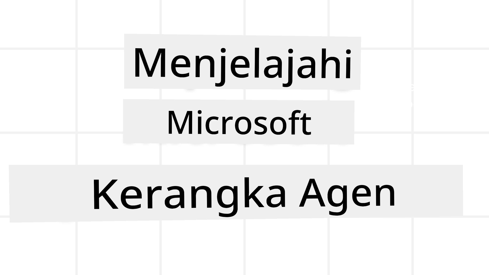
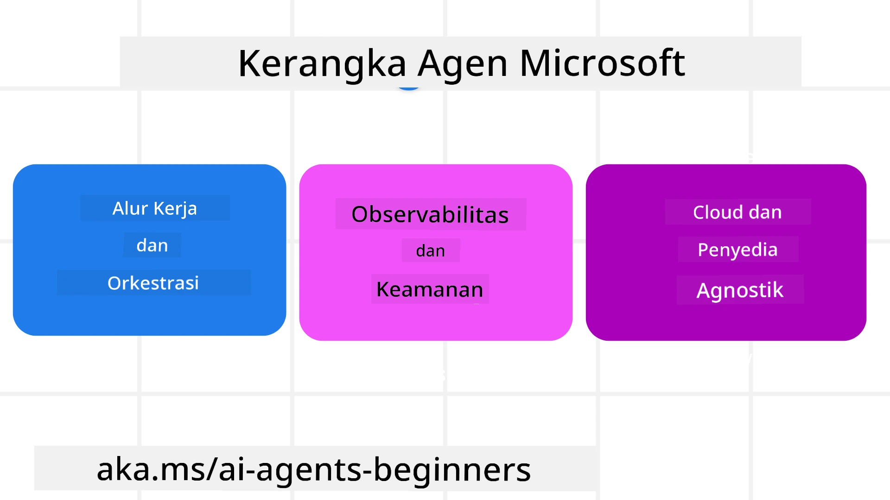

# Menjelajahi Microsoft Agent Framework



### Pendahuluan

Pelajaran ini akan membahas:

- Memahami Microsoft Agent Framework: Fitur Utama dan Nilai  
- Menjelajahi Konsep Kunci Microsoft Agent Framework
- Pola Lanjutan MAF: Alur Kerja, Middleware, dan Memori

## Tujuan Pembelajaran

Setelah menyelesaikan pelajaran ini, Anda akan mengetahui cara:

- Membangun AI Agent Siap Produksi menggunakan Microsoft Agent Framework
- Menerapkan fitur inti Microsoft Agent Framework ke Kasus Penggunaan Agentik Anda
- Menggunakan pola lanjutan termasuk alur kerja, middleware, dan observabilitas

## Contoh Kode

Contoh kode untuk [Microsoft Agent Framework (MAF)](https://aka.ms/ai-agents-beginners/agent-framewrok) dapat ditemukan di repositori ini di bawah file `xx-python-agent-framework` dan `xx-dotnet-agent-framework`.

## Memahami Microsoft Agent Framework



[Microsoft Agent Framework (MAF)](https://aka.ms/ai-agents-beginners/agent-framewrok) adalah kerangka kerja terintegrasi Microsoft untuk membangun AI agent. Ini menawarkan fleksibilitas untuk menangani berbagai macam kasus penggunaan agentik yang terlihat baik dalam produksi maupun lingkungan penelitian termasuk:

- **Orkestrasi Agen Berurutan** dalam skenario di mana alur kerja langkah-demi-langkah dibutuhkan.
- **Orkestrasi Konkuren** dalam skenario di mana agen perlu menyelesaikan tugas secara bersamaan.
- **Orkestrasi Grup Chat** dalam skenario di mana agen dapat berkolaborasi bersama dalam satu tugas.
- **Orkestrasi Serah Terima** dalam skenario di mana agen menyerahkan tugas ke satu sama lain saat subtugas selesai.
- **Orkestrasi Magnetik** dalam skenario di mana agen pengelola membuat dan memodifikasi daftar tugas dan mengatur koordinasi sub-agen untuk menyelesaikan tugas.

Untuk menyediakan AI Agent dalam Produksi, MAF juga menyertakan fitur untuk:

- **Observabilitas** melalui penggunaan OpenTelemetry di mana setiap tindakan AI Agent termasuk pemanggilan alat, langkah orkestrasi, alur penalaran dan pemantauan kinerja melalui dashboard Microsoft Foundry.
- **Keamanan** dengan menjalankan agen secara native pada Microsoft Foundry yang mencakup kontrol keamanan seperti akses berbasis peran, penanganan data pribadi dan keamanan konten bawaan.
- **Daya Tahan** karena thread dan alur kerja Agen dapat berhenti sementara, dilanjutkan, dan pulih dari kesalahan yang memungkinkan proses berjalan lebih lama.
- **Kontrol** karena alur kerja human-in-the-loop didukung di mana tugas ditandai memerlukan persetujuan manusia.

Microsoft Agent Framework juga berfokus pada interoperabilitas dengan:

- **Bersifat Cloud-agnostik** - Agen dapat berjalan di kontainer, on-premise dan di berbagai cloud berbeda.
- **Bersifat Provider-agnostik** - Agen dapat dibuat melalui SDK pilihan Anda termasuk Azure OpenAI dan OpenAI
- **Mengintegrasikan Standar Terbuka** - Agen dapat menggunakan protokol seperti Agent-to-Agent (A2A) dan Model Context Protocol (MCP) untuk menemukan dan menggunakan agen serta alat lain.
- **Plugin dan Konektor** - Koneksi dapat dibuat ke layanan data dan memori seperti Microsoft Fabric, SharePoint, Pinecone dan Qdrant.

Mari kita lihat bagaimana fitur-fitur ini diterapkan pada beberapa konsep inti Microsoft Agent Framework.

## Konsep Kunci Microsoft Agent Framework

### Agen


**Membuat Agen**

Pembuatan agen dilakukan dengan mendefinisikan layanan inferensi (Penyedia LLM),  
serangkaian instruksi untuk AI Agent diikuti, dan `name` yang ditetapkan:

```python
agent = AzureOpenAIChatClient(credential=AzureCliCredential()).create_agent( instructions="You are good at recommending trips to customers based on their preferences.", name="TripRecommender" )
```

Di atas menggunakan `Azure OpenAI` tetapi agen dapat dibuat menggunakan berbagai layanan termasuk `Microsoft Foundry Agent Service`:

```python
AzureAIAgentClient(async_credential=credential).create_agent( name="HelperAgent", instructions="You are a helpful assistant." ) as agent
```

OpenAI `Responses`, API `ChatCompletion`

```python
agent = OpenAIResponsesClient().create_agent( name="WeatherBot", instructions="You are a helpful weather assistant.", )
```

```python
agent = OpenAIChatClient().create_agent( name="HelpfulAssistant", instructions="You are a helpful assistant.", )
```

atau agen jarak jauh menggunakan protokol A2A:

```python
agent = A2AAgent( name=agent_card.name, description=agent_card.description, agent_card=agent_card, url="https://your-a2a-agent-host" )
```

**Menjalankan Agen**

Agen dijalankan menggunakan metode `.run` atau `.run_stream` untuk respons non-streaming atau streaming.

```python
result = await agent.run("What are good places to visit in Amsterdam?")
print(result.text)
```

```python
async for update in agent.run_stream("What are the good places to visit in Amsterdam?"):
    if update.text:
        print(update.text, end="", flush=True)

```

Setiap jalankan agen juga dapat memiliki opsi untuk menyesuaikan parameter seperti `max_tokens` yang digunakan oleh agen, `tools` yang dapat dipanggil agen, dan bahkan `model` itu sendiri yang digunakan untuk agen.

Ini berguna dalam kasus di mana model atau alat tertentu diperlukan untuk menyelesaikan tugas pengguna.

**Alat**

Alat dapat didefinisikan baik saat mendefinisikan agen:

```python
def get_attractions( location: Annotated[str, Field(description="The location to get the top tourist attractions for")], ) -> str: """Get the top tourist attractions for a given location.""" return f"The top attractions for {location} are." 


# Saat membuat ChatAgent secara langsung

agent = ChatAgent( chat_client=OpenAIChatClient(), instructions="You are a helpful assistant", tools=[get_attractions]

```

dan juga saat menjalankan agen:

```python

result1 = await agent.run( "What's the best place to visit in Seattle?", tools=[get_attractions] # Alat yang disediakan hanya untuk run ini )
```

**Thread Agen**

Thread Agen digunakan untuk menangani percakapan multi-tahap. Thread dapat dibuat dengan:

- Menggunakan `get_new_thread()` yang memungkinkan thread disimpan untuk penggunaan jangka panjang
- Membuat thread secara otomatis ketika menjalankan agen dan thread hanya bertahan selama jalankan saat ini.

Untuk membuat thread, kode terlihat seperti ini:

```python
# Buat sebuah thread baru.
thread = agent.get_new_thread() # Jalankan agen dengan thread tersebut.
response = await agent.run("Hello, I am here to help you book travel. Where would you like to go?", thread=thread)

```

Anda kemudian dapat men-serialize thread untuk disimpan dan digunakan nanti:

```python
# Buat thread baru.
thread = agent.get_new_thread() 

# Jalankan agen dengan thread tersebut.

response = await agent.run("Hello, how are you?", thread=thread) 

# Serialisasikan thread untuk penyimpanan.

serialized_thread = await thread.serialize() 

# Deserialisasikan status thread setelah dimuat dari penyimpanan.

resumed_thread = await agent.deserialize_thread(serialized_thread)
```

**Middleware Agen**

Agen berinteraksi dengan alat dan LLM untuk menyelesaikan tugas pengguna. Dalam beberapa skenario, kita ingin menjalankan atau melacak di antara interaksi tersebut. Middleware agen memungkinkan kita melakukan ini melalui:

*Function Middleware*

Middleware ini memungkinkan kita mengeksekusi tindakan di antara agen dan fungsi/alat yang akan dipanggil. Contoh penggunaannya adalah saat Anda ingin melakukan pencatatan pada pemanggilan fungsi.

Dalam kode di bawah `next` menentukan apakah middleware berikutnya atau fungsi sebenarnya harus dipanggil.

```python
async def logging_function_middleware(
    context: FunctionInvocationContext,
    next: Callable[[FunctionInvocationContext], Awaitable[None]],
) -> None:
    """Function middleware that logs function execution."""
    # Pra-pemrosesan: Catat sebelum eksekusi fungsi
    print(f"[Function] Calling {context.function.name}")

    # Lanjutkan ke middleware berikutnya atau eksekusi fungsi
    await next(context)

    # Pasca-pemrosesan: Catat setelah eksekusi fungsi
    print(f"[Function] {context.function.name} completed")
```

*Chat Middleware*

Middleware ini memungkinkan kita mengeksekusi atau mencatat tindakan antara agen dan permintaan antara LLM.

Ini berisi informasi penting seperti `messages` yang dikirim ke layanan AI.

```python
async def logging_chat_middleware(
    context: ChatContext,
    next: Callable[[ChatContext], Awaitable[None]],
) -> None:
    """Chat middleware that logs AI interactions."""
    # Pra-pemrosesan: Catat sebelum panggilan AI
    print(f"[Chat] Sending {len(context.messages)} messages to AI")

    # Lanjutkan ke middleware atau layanan AI berikutnya
    await next(context)

    # Pasca-pemrosesan: Catat setelah respons AI
    print("[Chat] AI response received")

```

**Memori Agen**

Seperti yang dibahas di pelajaran `Agentic Memory`, memori adalah elemen penting untuk memungkinkan agen beroperasi dalam konteks berbeda. MAF menawarkan beberapa jenis memori berbeda:

*Penyimpanan Dalam Memori*

Ini adalah memori yang disimpan dalam thread selama runtime aplikasi.

```python
# Buat sebuah thread baru.
thread = agent.get_new_thread() # Jalankan agen dengan thread tersebut.
response = await agent.run("Hello, I am here to help you book travel. Where would you like to go?", thread=thread)
```

*Pesan Persisten*

Memori ini digunakan saat menyimpan riwayat percakapan antar sesi yang berbeda. Didefinisikan menggunakan `chat_message_store_factory` :

```python
from agent_framework import ChatMessageStore

# Buat penyimpanan pesan khusus
def create_message_store():
    return ChatMessageStore()

agent = ChatAgent(
    chat_client=OpenAIChatClient(),
    instructions="You are a Travel assistant.",
    chat_message_store_factory=create_message_store
)

```

*Memori Dinamis*

Memori ini ditambahkan ke konteks sebelum agen dijalankan. Memori ini dapat disimpan dalam layanan eksternal seperti mem0:

```python
from agent_framework.mem0 import Mem0Provider

# Menggunakan Mem0 untuk kemampuan memori lanjutan
memory_provider = Mem0Provider(
    api_key="your-mem0-api-key",
    user_id="user_123",
    application_id="my_app"
)

agent = ChatAgent(
    chat_client=OpenAIChatClient(),
    instructions="You are a helpful assistant with memory.",
    context_providers=memory_provider
)

```

**Observabilitas Agen**

Observabilitas penting untuk membangun sistem agentik yang dapat diandalkan dan mudah dipelihara. MAF terintegrasi dengan OpenTelemetry untuk menyediakan tracing dan meter untuk observabilitas yang lebih baik.

```python
from agent_framework.observability import get_tracer, get_meter

tracer = get_tracer()
meter = get_meter()
with tracer.start_as_current_span("my_custom_span"):
    # melakukan sesuatu
    pass
counter = meter.create_counter("my_custom_counter")
counter.add(1, {"key": "value"})
```

### Alur Kerja

MAF menyediakan alur kerja yang merupakan langkah-langkah yang telah ditentukan untuk menyelesaikan tugas dan melibatkan AI agent sebagai komponen dalam langkah-langkah tersebut.

Alur kerja terdiri dari beberapa komponen yang memungkinkan kontrol alur yang lebih baik. Alur kerja juga memungkinkan **orkestrasi multi-agen** dan **checkpointing** untuk menyimpan status alur kerja.

Komponen inti dari alur kerja adalah:

**Executor**

Executor menerima pesan input, melaksanakan tugas yang ditugaskan, dan kemudian menghasilkan pesan keluaran. Ini memajukan alur kerja menuju penyelesaian tugas yang lebih besar. Executor bisa berupa agen AI atau logika khusus.

**Edges**

Edges digunakan untuk mendefinisikan alur pesan dalam alur kerja. Ini bisa berupa:

*Direct Edges* - Koneksi satu-ke-satu sederhana antara executor:

```python
from agent_framework import WorkflowBuilder

builder = WorkflowBuilder()
builder.add_edge(source_executor, target_executor)
builder.set_start_executor(source_executor)
workflow = builder.build()
```

*Conditional Edges* - Diaktifkan setelah kondisi tertentu terpenuhi. Contohnya, ketika kamar hotel tidak tersedia, executor dapat menyarankan opsi lain.

*Switch-case Edges* - Mengarahkan pesan ke executor berbeda berdasarkan kondisi yang ditentukan. Misalnya, jika pelanggan perjalanan memiliki akses prioritas dan tugas mereka akan ditangani melalui alur kerja berbeda.

*Fan-out Edges* - Mengirim satu pesan ke beberapa target.

*Fan-in Edges* - Mengumpulkan beberapa pesan dari executor berbeda dan mengirim ke satu target.

**Events**

Untuk memberikan observabilitas yang lebih baik ke dalam alur kerja, MAF menawarkan event bawaan untuk eksekusi termasuk:

- `WorkflowStartedEvent`  - Eksekusi alur kerja dimulai
- `WorkflowOutputEvent` - Alur kerja menghasilkan output
- `WorkflowErrorEvent` - Alur kerja mengalami kesalahan
- `ExecutorInvokeEvent`  - Executor mulai memproses
- `ExecutorCompleteEvent`  -  Executor selesai memproses
- `RequestInfoEvent` - Sebuah permintaan dibuat

## Pola Lanjutan MAF

Bagian di atas membahas konsep kunci Microsoft Agent Framework. Saat Anda membangun agen yang lebih kompleks, berikut adalah beberapa pola lanjutan yang perlu dipertimbangkan:

- **Kombinasi Middleware**: Rangkai beberapa handler middleware (pencatatan, otentikasi, pembatasan laju) menggunakan middleware fungsi dan chat untuk kendali halus perilaku agen.
- **Checkpointing Alur Kerja**: Gunakan event alur kerja dan serialisasi untuk menyimpan dan melanjutkan proses agen yang berjalan lama.
- **Pemilihan Alat Dinamis**: Gabungkan RAG pada deskripsi alat dengan pendaftaran alat MAF untuk menghadirkan hanya alat yang relevan per kueri.
- **Serah Terima Multi-Agen**: Gunakan edges alur kerja dan pengalihan bersyarat untuk mengatur serah terima antara agen spesialis.

## Contoh Kode

Contoh kode untuk Microsoft Agent Framework dapat ditemukan di repositori ini di bawah file `xx-python-agent-framework` dan `xx-dotnet-agent-framework`.

## Punya Pertanyaan Lebih Lanjut tentang Microsoft Agent Framework?

Bergabunglah di [Microsoft Foundry Discord](https://aka.ms/ai-agents/discord) untuk bertemu dengan pelajar lain, menghadiri jam kantor, dan mendapatkan jawaban atas pertanyaan AI Agents Anda.

---

<!-- CO-OP TRANSLATOR DISCLAIMER START -->
**Penafian**:  
Dokumen ini telah diterjemahkan menggunakan layanan terjemahan AI [Co-op Translator](https://github.com/Azure/co-op-translator). Meskipun kami berupaya untuk mencapai akurasi, harap diingat bahwa terjemahan otomatis dapat mengandung kesalahan atau ketidakakuratan. Dokumen asli dalam bahasa aslinya harus dianggap sebagai sumber yang paling sahih. Untuk informasi yang penting, disarankan menggunakan terjemahan profesional oleh manusia. Kami tidak bertanggung jawab atas kesalahpahaman atau penafsiran yang salah yang timbul dari penggunaan terjemahan ini.
<!-- CO-OP TRANSLATOR DISCLAIMER END -->