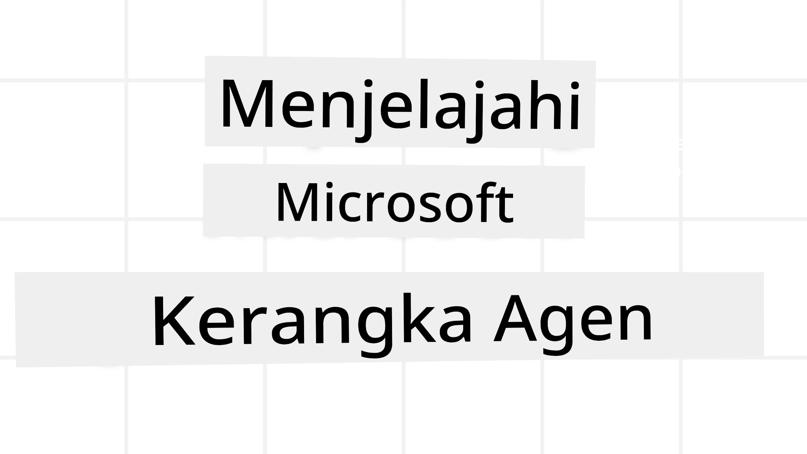
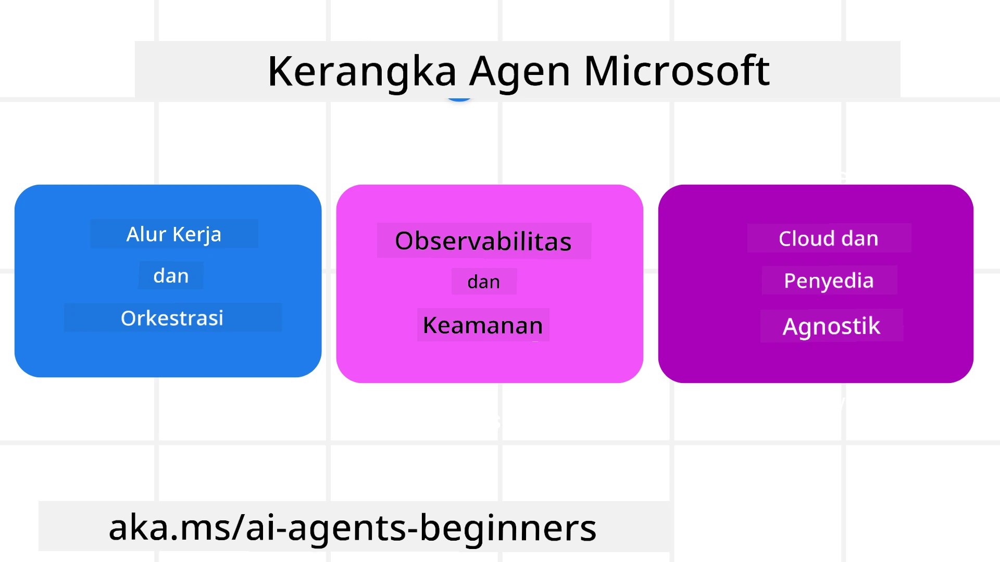
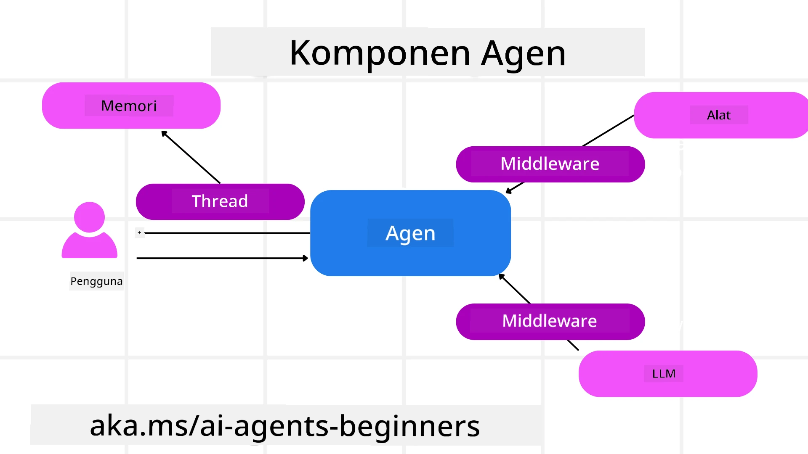

# Menjelajahi Microsoft Agent Framework



### Pendahuluan

Pelajaran ini akan mencakup:

- Memahami Microsoft Agent Framework: Fitur Utama dan Nilainya  
- Menjelajahi Konsep Kunci dari Microsoft Agent Framework
- Pola MAF Lanjutan: Alur Kerja, Middleware, dan Memori

## Tujuan Pembelajaran

Setelah menyelesaikan pelajaran ini, Anda akan tahu cara:

- Membangun Agen AI Siap Produksi menggunakan Microsoft Agent Framework
- Menerapkan fitur inti dari Microsoft Agent Framework ke kasus penggunaan Agentic Anda
- Menggunakan pola lanjutan termasuk alur kerja, middleware, dan observabilitas

## Contoh Kode 

Contoh kode untuk [Microsoft Agent Framework (MAF)](https://learn.microsoft.com/en-us/agent-framework/overview/?wt.mc_id=youtube_26688_organicsocial_reactor&pivots=programming-language-python) dapat ditemukan di repositori ini di bawah file `xx-python-agent-framework` dan `xx-dotnet-agent-framework`.

## Memahami Microsoft Agent Framework



[Microsoft Agent Framework (MAF)](https://learn.microsoft.com/en-us/agent-framework/overview/?wt.mc_id=youtube_26688_organicsocial_reactor&pivots=programming-language-python) adalah kerangka kerja terpadu Microsoft untuk membangun agen AI. Ini menawarkan fleksibilitas untuk menangani berbagai macam kasus penggunaan agentik yang terlihat baik di lingkungan produksi maupun penelitian termasuk:

- **Orkestrasi Agen Berurutan** dalam skenario di mana alur kerja langkah demi langkah diperlukan.
- **Orkestrasi Konkuren** dalam skenario di mana agen perlu menyelesaikan tugas secara bersamaan.
- **Orkestrasi Grup Obrolan** dalam skenario di mana agen dapat berkolaborasi bersama pada satu tugas.
- **Orkestrasi Serah Terima** dalam skenario di mana agen menyerahkan tugas satu sama lain saat subtugas selesai.
- **Orkestrasi Magnetik** dalam skenario di mana agen manajer membuat dan memodifikasi daftar tugas dan menangani koordinasi subagen untuk menyelesaikan tugas.

Untuk menghadirkan Agen AI dalam Produksi, MAF juga menyertakan fitur untuk:

- **Observabilitas** melalui penggunaan OpenTelemetry di mana setiap tindakan Agen AI termasuk pemanggilan alat, langkah orkestrasi, aliran penalaran dan pemantauan kinerja melalui dasbor Microsoft Foundry.
- **Keamanan** dengan hosting agen secara native di Microsoft Foundry yang meliputi kontrol keamanan seperti akses berbasis peran, penanganan data pribadi dan keselamatan konten bawaan.
- **Daya Tahan** karena utas dan alur kerja Agen dapat dijeda, dilanjutkan, dan dipulihkan dari kesalahan yang memungkinkan proses berjalan lebih lama.
- **Kontrol** karena alur kerja manusia dalam loop didukung di mana tugas ditandai sebagai memerlukan persetujuan manusia.

Microsoft Agent Framework juga berfokus pada interoperabilitas dengan:

- **Bersifat Cloud-agnostik** - Agen dapat berjalan dalam container, di lokal dan di berbagai cloud yang berbeda.
- **Bersifat Provider-agnostik** - Agen dapat dibuat melalui SDK pilihan Anda termasuk Azure OpenAI dan OpenAI
- **Mengintegrasikan Standar Terbuka** - Agen dapat memanfaatkan protokol seperti Agent-to-Agent (A2A) dan Model Context Protocol (MCP) untuk menemukan dan menggunakan agen serta alat lain.
- **Plugin dan Konektor** - Koneksi dapat dibuat ke layanan data dan memori seperti Microsoft Fabric, SharePoint, Pinecone dan Qdrant.

Mari kita lihat bagaimana fitur-fitur ini diterapkan pada beberapa konsep inti dari Microsoft Agent Framework.

## Konsep Kunci Microsoft Agent Framework

### Agen



**Membuat Agen**

Pembuatan agen dilakukan dengan mendefinisikan layanan inferensi (Penyedia LLM), satu
set instruksi untuk Agen AI ikuti, dan sebuah `name` yang ditetapkan:

```python
agent = AzureOpenAIChatClient(credential=AzureCliCredential()).create_agent( instructions="You are good at recommending trips to customers based on their preferences.", name="TripRecommender" )
```

Berikut menggunakan `Azure OpenAI` tetapi agen dapat dibuat menggunakan berbagai layanan termasuk `Microsoft Foundry Agent Service`:

```python
AzureAIAgentClient(async_credential=credential).create_agent( name="HelperAgent", instructions="You are a helpful assistant." ) as agent
```

OpenAI `Responses`, API `ChatCompletion`

```python
agent = OpenAIResponsesClient().create_agent( name="WeatherBot", instructions="You are a helpful weather assistant.", )
```

```python
agent = OpenAIChatClient().create_agent( name="HelpfulAssistant", instructions="You are a helpful assistant.", )
```

atau [MiniMax](https://platform.minimaxi.com/), yang menyediakan API kompatibel OpenAI dengan jendela konteks besar (hingga 204K token):

```python
agent = OpenAIChatClient(base_url="https://api.minimax.io/v1", api_key=os.environ["MINIMAX_API_KEY"], model_id="MiniMax-M3").create_agent( name="HelpfulAssistant", instructions="You are a helpful assistant.", )
```

atau agen jarak jauh menggunakan protokol A2A:

```python
agent = A2AAgent( name=agent_card.name, description=agent_card.description, agent_card=agent_card, url="https://your-a2a-agent-host" )
```

**Menjalankan Agen**

Agen dijalankan menggunakan metode `.run` atau `.run_stream` baik untuk respons non-streaming atau streaming.

```python
result = await agent.run("What are good places to visit in Amsterdam?")
print(result.text)
```

```python
async for update in agent.run_stream("What are the good places to visit in Amsterdam?"):
    if update.text:
        print(update.text, end="", flush=True)

```

Setiap jalankan agen juga dapat memiliki opsi untuk menyesuaikan parameter seperti `max_tokens` yang digunakan agen, `tools` yang dapat dipanggil agen, dan bahkan `model` itu sendiri yang digunakan oleh agen.

Ini berguna dalam kasus di mana model atau alat tertentu diperlukan untuk menyelesaikan tugas pengguna.

**Alat**

Alat dapat didefinisikan baik saat mendefinisikan agen:

```python
def get_attractions( location: Annotated[str, Field(description="The location to get the top tourist attractions for")], ) -> str: """Get the top tourist attractions for a given location.""" return f"The top attractions for {location} are." 


# Saat membuat ChatAgent secara langsung

agent = ChatAgent( chat_client=OpenAIChatClient(), instructions="You are a helpful assistant", tools=[get_attractions]

```

dan juga saat menjalankan agen:

```python

result1 = await agent.run( "What's the best place to visit in Seattle?", tools=[get_attractions] # Alat hanya disediakan untuk run ini )
```

**Utas Agen**

Utas Agen digunakan untuk menangani percakapan multi-putaran. Utas dapat dibuat dengan cara:

- Menggunakan `get_new_thread()` yang memungkinkan utas disimpan dari waktu ke waktu
- Membuat utas secara otomatis saat menjalankan agen dan hanya memiliki utas selama jalankan saat ini.

Untuk membuat utas, kodenya seperti berikut:

```python
# Buat sebuah thread baru.
thread = agent.get_new_thread() # Jalankan agen dengan thread tersebut.
response = await agent.run("Hello, I am here to help you book travel. Where would you like to go?", thread=thread)

```

Anda kemudian dapat serialisasi utas untuk disimpan guna penggunaan di kemudian hari:

```python
# Buat sebuah thread baru.
thread = agent.get_new_thread() 

# Jalankan agen dengan thread tersebut.

response = await agent.run("Hello, how are you?", thread=thread) 

# Serialisasikan thread untuk penyimpanan.

serialized_thread = await thread.serialize() 

# Deserialisasikan status thread setelah dimuat dari penyimpanan.

resumed_thread = await agent.deserialize_thread(serialized_thread)
```

**Middleware Agen**

Agen berinteraksi dengan alat dan LLM untuk menyelesaikan tugas pengguna. Dalam skenario tertentu, kita ingin mengeksekusi atau melacak di antara interaksi tersebut. Middleware agen memungkinkan kita melakukan ini melalui:

*Middleware Fungsi*

Middleware ini memungkinkan kita mengeksekusi sebuah aksi antara agen dan fungsi/alat yang akan dipanggilnya. Contoh penggunaannya adalah saat Anda ingin melakukan pencatatan pada pemanggilan fungsi.

Pada kode di bawah `next` mendefinisikan apakah middleware berikutnya atau fungsi sebenarnya yang harus dipanggil.

```python
async def logging_function_middleware(
    context: FunctionInvocationContext,
    next: Callable[[FunctionInvocationContext], Awaitable[None]],
) -> None:
    """Function middleware that logs function execution."""
    # Pra-pemrosesan: Catat sebelum eksekusi fungsi
    print(f"[Function] Calling {context.function.name}")

    # Lanjutkan ke middleware berikutnya atau eksekusi fungsi
    await next(context)

    # Pasca pemrosesan: Catat setelah eksekusi fungsi
    print(f"[Function] {context.function.name} completed")
```

*Middleware Obrolan*

Middleware ini memungkinkan kita mengeksekusi atau mencatat aksi antara agen dan permintaan antara LLM .

Ini berisi informasi penting seperti `messages` yang dikirim ke layanan AI.

```python
async def logging_chat_middleware(
    context: ChatContext,
    next: Callable[[ChatContext], Awaitable[None]],
) -> None:
    """Chat middleware that logs AI interactions."""
    # Pra-pemrosesan: Log sebelum pemanggilan AI
    print(f"[Chat] Sending {len(context.messages)} messages to AI")

    # Lanjutkan ke middleware atau layanan AI berikutnya
    await next(context)

    # Pasca-pemrosesan: Log setelah respons AI
    print("[Chat] AI response received")

```

**Memori Agen**

Seperti yang dibahas di pelajaran `Agentic Memory`, memori adalah elemen penting untuk memungkinkan agen beroperasi dalam konteks berbeda. MAF menawarkan beberapa jenis memori:

*Penyimpanan Dalam Memori (In-Memory Storage)*

Ini adalah memori yang disimpan dalam utas selama runtime aplikasi.

```python
# Buat sebuah thread baru.
thread = agent.get_new_thread() # Jalankan agen dengan thread tersebut.
response = await agent.run("Hello, I am here to help you book travel. Where would you like to go?", thread=thread)
```

*Pesan Persisten*

Memori ini digunakan saat menyimpan riwayat percakapan di berbagai sesi. Ini didefinisikan menggunakan `chat_message_store_factory` :

```python
from agent_framework import ChatMessageStore

# Buat penyimpanan pesan kustom
def create_message_store():
    return ChatMessageStore()

agent = ChatAgent(
    chat_client=OpenAIChatClient(),
    instructions="You are a Travel assistant.",
    chat_message_store_factory=create_message_store
)

```

*Memori Dinamis*

Memori ini ditambahkan ke konteks sebelum agen dijalankan. Memori ini dapat disimpan di layanan eksternal seperti mem0:

```python
from agent_framework.mem0 import Mem0Provider

# Menggunakan Mem0 untuk kemampuan memori tingkat lanjut
memory_provider = Mem0Provider(
    api_key="your-mem0-api-key",
    user_id="user_123",
    application_id="my_app"
)

agent = ChatAgent(
    chat_client=OpenAIChatClient(),
    instructions="You are a helpful assistant with memory.",
    context_providers=memory_provider
)

```

**Observabilitas Agen**

Observabilitas penting untuk membangun sistem agentik yang dapat diandalkan dan mudah dipelihara. MAF terintegrasi dengan OpenTelemetry untuk menyediakan pelacakan dan meter untuk observabilitas yang lebih baik.

```python
from agent_framework.observability import get_tracer, get_meter

tracer = get_tracer()
meter = get_meter()
with tracer.start_as_current_span("my_custom_span"):
    # lakukan sesuatu
    pass
counter = meter.create_counter("my_custom_counter")
counter.add(1, {"key": "value"})
```

### Alur Kerja

MAF menawarkan alur kerja yang merupakan langkah-langkah yang sudah ditentukan sebelumnya untuk menyelesaikan sebuah tugas dan mencakup agen AI sebagai komponen dalam langkah-langkah tersebut.

Alur kerja terdiri dari berbagai komponen yang memungkinkan alur kontrol yang lebih baik. Alur kerja juga memungkinkan **orkestrasi multi-agen** dan **checkpointing** untuk menyimpan status alur kerja.

Komponen inti dari alur kerja adalah:

**Eksekutor**

Eksekutor menerima pesan input, melakukan tugas yang ditugaskan, dan kemudian menghasilkan pesan output. Ini mendorong alur kerja menuju penyelesaian tugas yang lebih besar. Eksekutor bisa berupa agen AI atau logika kustom.

**Edges**

Edges digunakan untuk menentukan alur pesan dalam alur kerja. Ini dapat berupa:

*Direct Edges* - Koneksi sederhana satu-ke-satu antar eksekutor:

```python
from agent_framework import WorkflowBuilder

builder = WorkflowBuilder()
builder.add_edge(source_executor, target_executor)
builder.set_start_executor(source_executor)
workflow = builder.build()
```

*Conditional Edges* - Diaktifkan setelah kondisi tertentu terpenuhi. Misalnya, ketika kamar hotel tidak tersedia, eksekutor dapat menyarankan opsi lain.

*Switch-case Edges* - Mengarahkan pesan ke eksekutor berbeda berdasarkan kondisi yang ditentukan. Misalnya, jika pelanggan perjalanan memiliki akses prioritas, tugas mereka akan ditangani melalui alur kerja lain.

*Fan-out Edges* - Mengirim satu pesan ke beberapa target.

*Fan-in Edges* - Mengumpulkan beberapa pesan dari eksekutor berbeda dan mengirim ke satu target.

**Peristiwa (Events)**

Untuk memberikan observabilitas yang lebih baik ke dalam alur kerja, MAF menawarkan peristiwa bawaan untuk eksekusi termasuk:

- `WorkflowStartedEvent`  - Eksekusi alur kerja dimulai
- `WorkflowOutputEvent` - Alur kerja menghasilkan output
- `WorkflowErrorEvent` - Alur kerja menemui kesalahan
- `ExecutorInvokeEvent`  - Eksekutor mulai memproses
- `ExecutorCompleteEvent`  -  Eksekutor selesai memproses
- `RequestInfoEvent` - Permintaan dikeluarkan

## Pola MAF Lanjutan

Bagian di atas membahas konsep kunci Microsoft Agent Framework. Saat Anda membangun agen yang lebih kompleks, berikut beberapa pola lanjutan yang perlu dipertimbangkan:

- **Komposisi Middleware**: Rantai beberapa penangan middleware (logging, otentikasi, pembatasan laju) menggunakan middleware fungsi dan obrolan untuk kontrol halus atas perilaku agen.
- **Checkpointing Alur Kerja**: Gunakan peristiwa alur kerja dan serialisasi untuk menyimpan dan melanjutkan proses agen yang berjalan lama.
- **Seleksi Alat Dinamis**: Gabungkan RAG atas deskripsi alat dengan registrasi alat MAF untuk hanya menyajikan alat yang relevan per kueri.
- **Serah Terima Multi-Agen**: Gunakan edges alur kerja dan routing bersyarat untuk mengorkestrasi serah terima antar agen khusus.

## Hosting Agen LangChain / LangGraph di Microsoft Foundry

Microsoft Agent Framework adalah **framework-interoperable** — Anda tidak terbatas pada agen yang ditulis dengan MAF. Jika Anda sudah memiliki agen yang dibangun dengan **LangChain** atau **LangGraph**, Anda dapat menjalankannya sebagai **agen hosted Foundry Microsoft** sehingga Foundry mengelola runtime, sesi, skala, identitas, dan endpoint protokol untuk Anda, sementara logika agen Anda tetap di LangGraph.

Ini dilakukan dengan paket `langchain_azure_ai.agents.hosting`, yang mengekspos grafik LangGraph terkompilasi melalui protokol yang sama yang digunakan agen hosted Foundry.

**1. Pasang tambahan hosting:**

```bash
pip install -U "langchain-azure-ai[hosting]>=1.2.4" azure-identity
```

Tambahan `hosting` memasang pustaka protokol Foundry: `azure-ai-agentserver-responses` (endpoint `/responses` kompatibel OpenAI) dan `azure-ai-agentserver-invocations` (endpoint `/invocations` umum).

**2. Pilih protokol hosting:**

| Protokol | Kelas Host | Endpoint | Digunakan ketika |
|----------|-----------|----------|----------|
| **Responses** | `ResponsesHostServer` | `/responses` | Anda ingin chat kompatibel OpenAI, streaming, riwayat respons, dan threading percakapan — default yang direkomendasikan untuk agen percakapan. |
| **Invocations** | `InvocationsHostServer` | `/invocations` | Anda membutuhkan bentuk JSON kustom, endpoint gaya webhook, atau pemrosesan non-percakapan. |

Karena **API Responses adalah API utama untuk pengembangan gaya agen di Foundry**, mulailah dengan `ResponsesHostServer` untuk kebanyakan agen.

**3. Konfigurasikan variabel lingkungan** (`az login` terlebih dahulu agar `DefaultAzureCredential` dapat mengautentikasi):

```bash
export FOUNDRY_PROJECT_ENDPOINT="https://<resource>.services.ai.azure.com/api/projects/<project>"
export FOUNDRY_MODEL_NAME="gpt-5-mini"
```

Ketika agen nanti berjalan sebagai agen hosted di Foundry, platform secara otomatis menyuntikkan `FOUNDRY_PROJECT_ENDPOINT`.

**4. Ekspos agen LangGraph melalui protokol Responses:**

```python
import os

from azure.ai.projects import AIProjectClient
from azure.identity import DefaultAzureCredential, get_bearer_token_provider
from langchain.agents import create_agent
from langchain_openai import ChatOpenAI
from langchain_azure_ai.agents.hosting import ResponsesHostServer

_AZURE_AI_SCOPE = "https://ai.azure.com/.default"


def build_chat_model() -> ChatOpenAI:
    project_endpoint = os.environ["FOUNDRY_PROJECT_ENDPOINT"].rstrip("/")
    deployment = os.environ.get("FOUNDRY_MODEL_NAME", "gpt-5-mini")
    credential = DefaultAzureCredential()
    project = AIProjectClient(endpoint=project_endpoint, credential=credential)
    openai_client = project.get_openai_client()
    token_provider = get_bearer_token_provider(credential, _AZURE_AI_SCOPE)

    # ChatOpenAI di sini menargetkan endpoint OpenAI-kompatibel (Responses) dari proyek Foundry.
    return ChatOpenAI(
        model=deployment,
        base_url=str(openai_client.base_url),
        api_key=token_provider,
    )


def main() -> None:
    graph = create_agent(build_chat_model(), tools=[])
    port = int(os.environ.get("PORT", "8088"))
    ResponsesHostServer(graph).run(port=port)


if __name__ == "__main__":
    main()
```

Jalankan secara lokal dengan `python main.py`, lalu kirim permintaan Responses ke `http://localhost:8088/responses`.

**Perilaku kunci:**

- **Percakapan**: Klien melanjutkan percakapan dengan mengirim `previous_response_id` atau ID `conversation`. Jika grafik Anda dikompilasi dengan checkpointer LangGraph, Foundry mengaitkan status percakapan ke checkpoint (gunakan checkpointer tahan lama di produksi; `MemorySaver` cukup untuk pengujian lokal).
- **Manusia dalam loop**: Jika grafik menggunakan LangGraph `interrupt()`, `ResponsesHostServer` menampilkan interupsi yang tertunda sebagai item `function_call` / `mcp_approval_request` Responses, dan klien melanjutkan dengan `function_call_output` / `mcp_approval_response` yang sesuai.
- **Sebar ke Foundry**: Gunakan Azure Developer CLI — `azd ext install azure.ai.agents`, `azd ai agent init -m <manifest>`, `azd ai agent run` (lokal, memerlukan Docker), lalu `azd provision` dan `azd deploy`. Penyebaran agen hosted memerlukan peran **Foundry Project Manager**.

Versi runnable dari contoh ini ada di [code-samples/14-langchain-hosted-agent.py](../../../14-microsoft-agent-framework/code-samples/14-langchain-hosted-agent.py). Untuk walkthrough lengkap (protokol Invocations, skema permintaan kustom, dan troubleshooting), lihat [Host LangGraph agents as Foundry hosted agents](https://learn.microsoft.com/azure/foundry/how-to/develop/langchain-hosted-agents).

## Contoh Kode 

Contoh kode untuk Microsoft Agent Framework dapat ditemukan di repositori ini di bawah file `xx-python-agent-framework` dan `xx-dotnet-agent-framework`.

## Ada Pertanyaan Lagi Tentang Microsoft Agent Framework?

Bergabunglah dengan [Microsoft Foundry Discord](https://discord.com/invite/ATgtXmAS5D) untuk bertemu dengan pelajar lain, menghadiri jam kantor, dan mendapatkan jawaban untuk pertanyaan Agen AI Anda.
## Pelajaran Sebelumnya

[Memori untuk Agen AI](../13-agent-memory/README.md)

## Pelajaran Berikutnya

[Membangun Agen Penggunaan Komputer (CUA)](../15-browser-use/README.md)

---

<!-- CO-OP TRANSLATOR DISCLAIMER START -->
**Penafian**:
Dokumen ini telah diterjemahkan menggunakan layanan terjemahan AI [Co-op Translator](https://github.com/Azure/co-op-translator). Meskipun kami berupaya untuk mencapai akurasi, harap diketahui bahwa terjemahan otomatis mungkin mengandung kesalahan atau ketidakakuratan. Dokumen asli dalam bahasa aslinya harus dianggap sebagai sumber yang sah. Untuk informasi penting, disarankan menggunakan terjemahan profesional oleh manusia. Kami tidak bertanggung jawab atas kesalahpahaman atau penafsiran yang keliru yang timbul dari penggunaan terjemahan ini.
<!-- CO-OP TRANSLATOR DISCLAIMER END -->