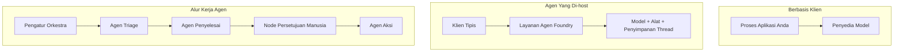
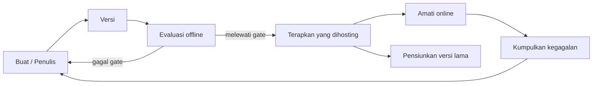
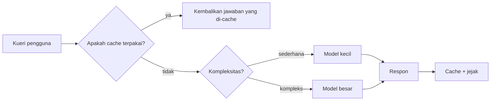
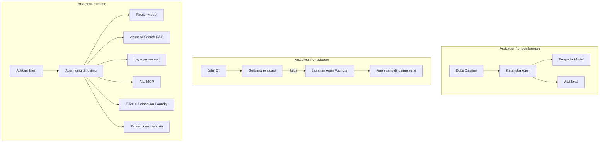

# Menerapkan Agen Skala Besar dengan Microsoft Foundry


Sampai titik ini dalam kursus, Anda telah membangun agen yang berjalan di laptop Anda, di dalam notebook, dijalankan dengan `az login` dan sejumlah variabel lingkungan. Itu adalah cara yang tepat untuk belajar. Itu bukan cara yang tepat untuk menjalankan agen yang diandalkan ribuan pelanggan pada pukul 3 pagi.

Pelajaran ini membahas kesenjangan antara "berfungsi di mesin saya" dan "berfungsi, dengan andal dan terjangkau, di produksi." Kita menutup kesenjangan itu menggunakan **Microsoft Foundry** dan **Microsoft Foundry Agent Service**, dan kita melakukannya dengan membangun agen dukungan pelanggan nyata yang memiliki alat, pengambilan, memori, evaluasi, dan pemantauan.

## Pendahuluan

Pelajaran ini akan membahas:

- Perbedaan antara **agen prototipe** dan **agen yang diterapkan**, dan mengapa transisi ini sebagian besar tentang segala sesuatu *di sekitar* model.
- **Pola penerapan** untuk agen: di-host oleh klien, di-host oleh layanan (Hosted Agents), dan diorkestrasi oleh alur kerja.
- **Siklus hidup agen** di Microsoft Foundry — buat, versi, terapkan, evaluasi, amati, pensiunkan.
- **Strategi penskalaan**: perutean model, caching, konkurensi, dan desain tanpa status.
- **Observabilitas** dengan OpenTelemetry dan pelacakan Foundry.
- **Optimasi biaya** melalui seleksi model, perutean, dan gerbang evaluasi.
- **Pertimbangan perusahaan**: tata kelola, persetujuan manusia, dan menjalankan server MCP dengan aman di produksi.

## Tujuan Pembelajaran

Setelah menyelesaikan pelajaran ini, Anda akan tahu cara:

- Memilih pola penerapan yang tepat untuk beban kerja agen tertentu.
- Menerapkan agen ke Microsoft Foundry Agent Service sehingga versi, tata kelola, dan observabilitasnya terjaga.
- Menginstrumentasikan agen untuk pelacakan dan menghubungkan pipeline evaluasi yang berjalan sebelum setiap rilis.
- Menerapkan perutean model dan caching untuk menjaga latensi dan biaya tetap terkendali dalam skala besar.
- Menambahkan gerbang persetujuan manusia untuk tindakan berisiko tinggi dan mengintegrasikan server MCP secara aman di produksi.

## Prasyarat

Pelajaran ini mengasumsikan Anda sudah menyelesaikan pelajaran-pelajaran sebelumnya dan nyaman dengan:

- Membangun agen dengan [Microsoft Agent Framework](../14-microsoft-agent-framework/README.md) (Pelajaran 14).
- [Penggunaan Alat](../04-tool-use/README.md) (Pelajaran 4) dan [Agentic RAG](../05-agentic-rag/README.md) (Pelajaran 5).
- [Memori Agen](../13-agent-memory/README.md) (Pelajaran 13) dan [Protokol Agentic / MCP](../11-agentic-protocols/README.md) (Pelajaran 11).
- [Observabilitas dan Evaluasi](../10-ai-agents-production/README.md) (Pelajaran 10) — pelajaran ini membangun langsung atasnya.

Anda juga akan membutuhkan:

- **Langganan Azure** dan **proyek Microsoft Foundry** dengan setidaknya satu model chat yang diterapkan.
- **Azure CLI** yang sudah diautentikasi (`az login`).
- Python 3.12+ dan paket dalam repositori [`requirements.txt`](../../../requirements.txt).

## Dari Prototipe ke Produksi: Apa Sebenarnya yang Berubah

Agen prototipe dan agen produksi berbagi loop inti yang sama — berpikir, memanggil alat, merespons. Yang berubah adalah segala sesuatu yang membungkus loop itu. Model mungkin hanya 20% dari agen produksi; 80% lainnya adalah kerangka operasionalnya.

| Perhatian | Prototipe | Produksi |
| --- | --- | --- |
| **Hosting** | Berjalan di notebook Anda | Berjalan sebagai layanan yang di-host, versi, dan diluncurkan |
| **Identitas** | Token `az login` Anda | Identitas terkelola dengan RBAC yang dibatasi |
| **Status** | Dalam memori, hilang saat restart | Disimpan secara eksternal (penyimpanan thread, layanan memori) |
| **Gagal** | Anda melihat traceback | Coba ulang, fallback, dead-letter, peringatan |
| **Biaya** | "Hanya beberapa sen" | Dilacak per permintaan, diarahkan, di-cache, dianggarkan |
| **Kualitas** | Anda memeriksa hasil | Dievaluasi secara otomatis sebelum setiap rilis |
| **Kepercayaan** | Anda menyetujui setiap tindakan | Kebijakan + manusia dalam lingkaran untuk tindakan berisiko |

Ingat tabel ini. Setiap bagian di bawah ini terkait dengan salah satu baris ini.

## Pola Penerapan Agen

Ada tiga pola yang akan Anda gunakan, sering kali secara kombinasi.

### 1. Agen yang Dihosting oleh Klien

Objek agen hidup di dalam proses aplikasi *Anda*. Kode Anda memanggil penyedia model secara langsung; loop penalaran berjalan di layanan Anda. Inilah yang dilakukan setiap pelajaran sebelumnya.

- **Gunakan saat** Anda membutuhkan kontrol penuh atas loop, middleware khusus, atau Anda menyematkan agen di backend yang sudah ada.
- **Kompromi**: Anda mengelola penskalaan, status, dan ketahanan sendiri.

### 2. Agen yang Dihosting (Foundry Agent Service)

Agen *didaftrkan sebagai sumber daya* di Microsoft Foundry. Foundry meng-host loop penalaran, menyimpan thread, menegakkan keamanan konten dan RBAC, serta membuat agen terlihat di portal Foundry. Aplikasi Anda menjadi klien tipis yang membuat thread dan membaca respons.

- **Gunakan saat** Anda menginginkan daya tahan, observabilitas bawaan, tata kelola, dan permukaan operasional yang lebih sedikit.
- **Kompromi**: kontrol tingkat rendah yang lebih sedikit untuk runtime yang dikelola.

### 3. Alur Kerja Agen

Beberapa agen (dan alat) disusun menjadi grafik dengan alur kontrol eksplisit — langkah berurutan, cabang, node persetujuan manusia, dan titik pemeriksaan tahan lama yang dapat berhenti dan dilanjutkan. Ini adalah kemampuan **Workflows** Microsoft Agent Framework yang diterapkan dalam skala penerapan.

- **Gunakan saat** satu tugas melibatkan beberapa agen khusus atau memerlukan langkah persetujuan di tengah.
- **Kompromi**: lebih banyak bagian bergerak; memerlukan observabilitas tingkat orkestrasi.



## Siklus Hidup Agen di Microsoft Foundry

Menerapkan agen bukanlah `push` sekali waktu. Itu adalah sebuah loop, dan sangat mirip dengan siklus rilis perangkat lunak karena memang itu yang terjadi.



Ide utama, diambil dari [Pelajaran 10](../10-ai-agents-production/README.md): **evaluasi offline adalah gerbang, bukan pemikiran setelahnya.** Versi agen baru tidak dikirim kecuali melewati ambang evaluasi Anda. Observabilitas online selanjutnya mengirimkan kegagalan dunia nyata kembali ke set tes offline Anda. Itulah seluruh loop-nya.

## Strategi Penskalaan

Menskala agen berbeda dengan menskala API web tanpa status, karena setiap permintaan dapat memicu banyak panggilan model dan alat yang mahal. Empat teknik memikul sebagian besar beban.

**Penanganan permintaan tanpa status.** Jangan simpan status per pengguna dalam memori proses Anda. Simpan thread percakapan di penyimpanan thread Foundry atau layanan memori agar instance mana pun dapat menangani permintaan apa pun. Ini memungkinkan penskalaan horizontal — tambah instance, tanpa sesi yang melekat.

**Perutean model.** Tidak setiap permintaan membutuhkan model paling mumpuni (dan paling mahal) Anda. Rute permintaan sederhana — klasifikasi maksud, jawaban fakta singkat — ke model kecil yang cepat, dan simpan model besar untuk penalaran sejati. **Model Router** Foundry bisa melakukan ini untuk Anda, atau Anda bisa membuat klasifikator ringan sendiri. Anda akan membangun versi DIY di lab.

**Caching respons.** Banyak pertanyaan dukungan hampir duplikat ("bagaimana saya mereset kata sandi?"). Cache jawaban untuk pertanyaan umum dan sajikan tanpa harus memanggil model. Bahkan tingkat cache hit yang sederhana secara signifikan mengurangi biaya dan latensi.

**Konkurensi dan tekanan balik.** Penyedia model memiliki batas kecepatan. Batasi konkurensi Anda, gunakan coba ulang dengan jeda eksponensial, dan gagal dengan anggun (respons antrean "kami sedang mengatasinya" lebih baik daripada 500).



## Observabilitas di Produksi

Anda tidak dapat mengoperasikan sesuatu yang tidak bisa Anda lihat. Seperti dibahas di Pelajaran 10, Microsoft Agent Framework mengeluarkan jejak **OpenTelemetry** secara native — setiap panggilan model, pemanggilan alat, dan langkah orkestrasi menjadi span. Di produksi Anda mengekspor span ini ke Microsoft Foundry (atau backend kompatibel OTel mana pun) sehingga Anda dapat:

- Melacak satu keluhan pelanggan secara menyeluruh di setiap panggilan model dan alat.
- Memantau latensi p50/p95 dan biaya per permintaan dari waktu ke waktu.
- Memberi peringatan pada lonjakan tingkat kesalahan dan anomali biaya sebelum pengguna Anda (atau tim keuangan Anda) menyadarinya.

```python
from agent_framework.observability import get_tracer

tracer = get_tracer()

with tracer.start_as_current_span("support_request") as span:
    span.set_attribute("customer.tier", "enterprise")
    span.set_attribute("routed.model", "gpt-5-nano")
    # eksekusi agen dilacak secara otomatis di dalam rentang ini
```

Atribut seperti `customer.tier` dan `routed.model` adalah apa yang mengubah tumpukan jejak menjadi pertanyaan yang bisa dijawab ("apakah pelanggan perusahaan terlalu sering diarahkan ke model kecil?").

## Optimasi Biaya

Biaya dalam agen produksi didominasi oleh token. Tiga tuas, berdasarkan dampak:

1. **Ukuran model yang tepat.** Model kecil yang melewati gerbang evaluasi hampir selalu lebih murah daripada model besar yang juga lulus. Gunakan evaluasi untuk *membuktikan* model kecil cukup baik daripada default ke model terbesar karena kehati-hatian.
2. **Rute berdasarkan kompleksitas.** Seperti di atas — bayar harga model besar hanya untuk permintaan yang memerlukan penalaran model besar.
3. **Cache secara agresif.** Panggilan model termurah adalah yang tidak pernah Anda lakukan.

Gerbang evaluasi dan kontrol biaya adalah disiplin yang sama dilihat dari dua sudut: evaluasi memberi tahu Anda *lantai kualitas*, perutean dan caching menjaga Anda sedekat mungkin dengan *biaya* lantai itu.

## Pertimbangan Penerapan di Perusahaan

**Tata kelola.** Hosted Agents mewarisi RBAC, keamanan konten, dan pencatatan audit Foundry. Berikan setiap agen identitas terkelola dengan hak paling sedikit yang dibutuhkan — akses hanya baca ke basis pengetahuan, akses terbatas ke API tiket, tidak lebih.

**Manusia dalam lingkaran.** Beberapa tindakan terlalu penting untuk diotomatisasi langsung — mengeluarkan pengembalian dana, menghapus akun, meningkat ke tim hukum. Microsoft Agent Framework mendukung alat dengan **persetujuan diperlukan**: agen mengusulkan tindakan, eksekusi berhenti, manusia menyetujui atau menolak, dan alur kerja dilanjutkan. Anda sudah melihat primitif ini di [Pelajaran 6](../06-building-trustworthy-agents/README.md); di sini Anda menerapkannya.

**MCP di produksi.** [MCP](../11-agentic-protocols/README.md) memungkinkan agen Anda menggunakan alat eksternal melalui antarmuka standar. Di produksi, anggap setiap server MCP sebagai batas yang tidak dipercaya: tetapkan versi server, jalankan dengan identitas terbatas, validasi hasilnya, dan jangan pernah mengekspos rahasia kepadanya. Server MCP adalah ketergantungan, dan ketergantungan diperbaiki, diaudit, dan dibatasi.



Ketiga diagram itu — pengembangan, penerapan, runtime — adalah agen yang sama pada tiga tahap kehidupannya. Lab berikutnya akan membimbing Anda membangunnya.

## Lab Praktik: Agen Dukungan Pelanggan Siap Produksi

Buka [`code_samples/16-python-agent-framework.ipynb`](./code_samples/16-python-agent-framework.ipynb) dan kerjakan hingga selesai. Anda akan merakit **agen dukungan pelanggan Contoso** dengan setiap perhatian produksi yang terintegrasi:

1. **Pemanggilan alat** — melihat status pesanan dan membuka tiket dukungan.
2. **RAG** — menjawab pertanyaan kebijakan dari basis pengetahuan (Azure AI Search, dengan fallback dalam memori agar notebook berjalan tanpa sumber daya Search).
3. **Memori** — mengingat pelanggan di seluruh putaran percakapan.
4. **Perutean model** — klasifikator kompleksitas mengarahkan setiap permintaan ke model kecil atau besar.
5. **Caching respons** — pertanyaan berulang disajikan dari cache.
6. **Persetujuan manusia** — pengembalian dana di atas ambang batas berhenti menunggu persetujuan manusia.
7. **Pipeline evaluasi** — set tes offline kecil menilai agen dan berfungsi sebagai gerbang rilis.
8. **Observabilitas** — pelacakan OpenTelemetry di sekitar setiap permintaan.

### Panduan

Notebook diatur agar setiap perhatian produksi adalah bagian yang mandiri dan dapat dijalankan. Inti dari itu adalah penangan permintaan routing-plus-caching:

```python
async def handle_support_request(query: str, customer_id: str) -> str:
    # 1. Layani dari cache ketika kita bisa.
    cached = response_cache.get(normalize(query))
    if cached:
        return cached

    # 2. Rute berdasarkan kompleksitas untuk mengontrol biaya.
    model = "gpt-5-nano" if is_simple(query) else "gpt-5-mini"

    # 3. Jalankan agen di dalam span jejak untuk observabilitas.
    with tracer.start_as_current_span("support_request") as span:
        span.set_attribute("routed.model", model)
        span.set_attribute("customer.id", customer_id)
        response = await support_agent.run(query, model=model)

    # 4. Cache dan kembalikan.
    response_cache.set(normalize(query), response.text)
    return response.text
```

Gerbang evaluasi yang menjaga rilis tampak seperti ini:

```python
async def evaluation_gate(agent, test_cases, threshold: float = 0.8) -> bool:
    passed = 0
    for case in test_cases:
        result = await agent.run(case["input"])
        if score_response(result.text, case["expected"]) >= 0.8:
            passed += 1
    pass_rate = passed / len(test_cases)
    print(f"Evaluation pass rate: {pass_rate:.0%} (gate: {threshold:.0%})")
    return pass_rate >= threshold  # hanya deploy jika gerbang lulus
```

Baca setiap baris — notebook sengaja menjaga primitif kecil agar tidak ada yang tersembunyi di balik panggilan framework.

## Memvalidasi Agen yang Diterapkan dengan Smoke Test

Gerbang evaluasi di atas berjalan *offline* terhadap objek agen Anda. Setelah agen diterapkan sebagai Hosted Agent, Anda memerlukan cek lain yang lebih murah: **apakah endpoint yang diterapkan benar-benar menjawab?**

Menerapkan "dengan sukses" hanya membuktikan control plane menerima definisi — itu tidak membuktikan agen merespons. Ketergantungan yang hilang, perutean model yang buruk, atau koneksi yang kedaluwarsa bisa meninggalkan penerapan hijau yang tidak mengembalikan apa pun. **Smoke test** menangkap itu dalam hitungan detik, pada setiap penerapan, tanpa biaya evaluasi penuh.

Repositori ini menyediakan pipeline smoke-test siap pakai yang dibangun dengan GitHub Action [AI Smoke Test](https://github.com/marketplace/actions/ai-smoke-test):

- **Katalog** — [`tests/lesson-16-smoke-tests.json`](../../../tests/lesson-16-smoke-tests.json) berisi prompt dan asersi untuk agen dukungan Contoso (jawaban kebijakan berbasis sumber, pencarian pesanan, tetap pada topik, dan kontinuitas thread multi-putaran). Katalog untuk agen pelajaran lain ada berdampingan — lihat [`tests/README.md`](../tests/README.md).
- **Alur Kerja** — [`.github/workflows/smoke-test.yml`](../../../.github/workflows/smoke-test.yml) login dengan Azure OIDC dan mengirim setiap prompt ke endpoint Responses agen, gagal jika ada asersi yang tidak terpenuhi.

```yaml
- name: Smoke-test hosted agent
  uses: JFolberth/ai-smoketest@v1
  with:
    project_endpoint: ${{ inputs.project_endpoint }}
    agent_name: ContosoSupportAgent
    tests_file: tests/lesson-16-smoke-tests.json
```


Jalankan dari tab **Actions** setelah agen Anda dikerahkan, dengan memberikan endpoint proyek Foundry Anda dan nama agen. Identitas federasi membutuhkan peran **Azure AI User** pada ruang lingkup proyek Foundry. Pikirkan lapisan-lapisan seperti sebuah piramida: tes asap (dapat dijangkau dan merespons?) dijalankan pada setiap penyebaran, evaluasi offline (cukup baik untuk dikirim?) dijalankan sebelum promosi, dan evaluasi online (bagaimana kinerjanya di lapangan?) dijalankan secara terus menerus.

## Pemeriksaan Pengetahuan

Uji pemahaman Anda sebelum melanjutkan ke tugas.

**1. Sekitar berapa banyak dari agen produksi yang merupakan "model," dan apa sisanya?**

<details>
<summary>Jawaban</summary>

Model adalah minoritas dari sistem — sering disebut sekitar 20%. Sisanya adalah kerangka operasional: hosting dan versioning, identitas dan RBAC, state yang dieksternalisasi, penanganan kegagalan, pelacakan biaya, evaluasi, dan kontrol human-in-the-loop. Berpindah ke produksi sebagian besar tentang membangun segala sesuatu *di sekitar* loop penalaran.
</details>

**2. Kapan Anda memilih Hosted Agent dibandingkan agen yang dihosting oleh klien?**

<details>
<summary>Jawaban</summary>

Ketika Anda menginginkan runtime yang dikelola dengan daya tahan bawaan (thread yang bertahan dan dapat dilanjutkan), observabilitas, keamanan konten, dan RBAC, dan Anda bersedia menukar sebagian kontrol tingkat rendah atas loop penalaran dengan area operasional yang lebih kecil. Agen yang dihosting klien lebih disukai ketika Anda memerlukan kontrol penuh atas loop atau menanamkan agen tersebut dalam backend yang sudah ada.
</details>

**3. Mengapa agen yang dapat diskalakan harus bersifat stateless dalam memori prosesnya sendiri?**

<details>
<summary>Jawaban</summary>

Agar setiap instance dapat menangani permintaan apa pun, yang memungkinkan penskalaan horizontal tanpa sesi lengket. State percakapan per pengguna dieksternalisasi ke penyimpanan thread atau layanan memori. Jika state berada di memori proses, Anda akan kehilangannya saat restart dan tidak bisa mendistribusikan beban secara bebas.
</details>

**4. Masalah apa yang diselesaikan oleh model routing, dan bagaimana kaitannya dengan evaluasi?**

<details>
<summary>Jawaban</summary>

Routing mengirim permintaan sederhana ke model kecil, murah, dan cepat dan mengalokasikan model besar untuk penalaran asli, mengontrol baik latensi maupun biaya. Ini berkaitan dengan evaluasi karena evaluasi adalah apa yang *membuktikan* model kecil itu cukup baik untuk kelas permintaan tertentu — routing tanpa evaluasi hanyalah tebakan.
</details>

**5. Apa itu "evaluation gate" dan di mana posisinya dalam siklus hidup?**

<details>
<summary>Jawaban</summary>

Evaluation gate menjalankan serangkaian tes offline terhadap versi agen baru dan memblokir penyebaran kecuali tingkat kelulusannya melewati ambang batas. Ini berada di antara "version" dan "deploy" dalam siklus hidup, menjadikan kualitas sebagai prasyarat untuk rilis alih-alih sesuatu yang diperiksa setelah pengiriman.
</details>

**6. Mengapa server MCP harus diperlakukan sebagai batas yang tidak terpercaya dalam produksi?**

<details>
<summary>Jawaban</summary>

Karena itu adalah ketergantungan eksternal yang dipanggil oleh agen Anda. Anda harus menetapkan versinya, menjalankannya dengan identitas terbatasi, memvalidasi outputnya, membatasi tingkatnya, dan tidak pernah mengungkapkan rahasia kepadanya — disiplin yang sama seperti yang Anda lakukan pada setiap ketergantungan pihak ketiga. Outputnya mengalir ke dalam penalaran agen Anda, jadi kepercayaan tanpa validasi adalah risiko keamanan.
</details>

**7. Perubahan tunggal apa yang biasanya memiliki dampak terbesar pada biaya agen produksi, dan mengapa?**

<details>
<summary>Jawaban</summary>

Menyesuaikan ukuran model — menggunakan model terkecil yang masih melewati evaluation gate Anda. Biaya didominasi oleh token, dan model yang lebih kecil yang memenuhi standar kualitas hampir selalu lebih murah daripada model yang lebih besar. Caching dan routing kemudian mengurangi biaya lebih jauh, tetapi memilih model dasar yang tepat memiliki efek terbesar tingkat pertama.
</details>

**8. Peran apa yang dimainkan atribut span seperti `customer.tier` dan `routed.model` dalam observabilitas?**

<details>
<summary>Jawaban</summary>

Mereka mengubah jejak mentah menjadi pertanyaan bisnis yang bisa dijawab. Tanpa atribut Anda memiliki dinding spans; dengan atribut Anda bisa bertanya "apakah pelanggan perusahaan terlalu sering diarahkan ke model kecil?" atau "model mana yang menangani permintaan kami yang paling lambat?" Atribut adalah cara Anda memotong telemetri berdasarkan dimensi yang penting bagi operasi Anda.
</details>

## Tugas

Ambil agen dukungan pelanggan dari lab dan perkuat untuk skenario tertentu: **agen dukungan tagihan berlangganan untuk perusahaan SaaS.**

Kiriman Anda harus:

1. **Ganti alat-alat** dengan alat yang relevan untuk tagihan: `get_subscription_status`, `get_invoice`, dan `issue_credit` (kredit di atas $50 memerlukan persetujuan manusia).
2. **Tambahkan tiga dokumen RAG** yang mencakup kebijakan pengembalian dana perusahaan, siklus penagihan, dan kebijakan pembatalan.
3. **Perluas set evaluasi** menjadi minimal delapan kasus, termasuk setidaknya dua yang *harus* memicu jalur persetujuan manusia, dan konfirmasi evaluation gate Anda lolos atau gagal dengan benar.
4. **Tambahkan satu laporan biaya**: setelah menjalankan sepuluh kueri campuran melalui agen, cetak berapa banyak yang menuju model kecil, berapa banyak ke model besar, dan berapa banyak yang dilayani dari cache.

Tulis paragraf singkat (dalam sel markdown) yang menjelaskan aturan model-routing mana yang Anda pilih dan bagaimana Anda akan memvalidasinya dengan lalu lintas nyata. Tidak ada jawaban tunggal yang benar — Anda dinilai berdasarkan apakah perhatian produksi dirangkai secara koheren.

## Ringkasan

Dalam pelajaran ini Anda memindahkan agen dari prototipe ke produksi dengan Microsoft Foundry:

- Lompatan ke produksi sebagian besar tentang **kerangka operasional** di sekitar model — hosting, identitas, state, penanganan kegagalan, biaya, kualitas, dan kepercayaan.
- Anda mempelajari tiga **pola penyebaran** — client-hosted, Hosted Agents, dan Agent Workflows — dan kapan masing-masing sesuai.
- Anda mengikuti **siklus hidup agen**, di mana evaluasi offline **berperan sebagai gerbang rilis** dan observabilitas online memberi umpan balik kegagalan ke set tes.
- Anda menerapkan **strategi penskalaan** — desain stateless, model routing, caching, dan concurrency terbatas — dan menghubungkannya ke **optimasi biaya**.
- Anda menghubungkan **kontrol enterprise**: RBAC, persetujuan human-in-the-loop, dan integrasi MCP yang aman untuk produksi.
- Anda membangun **agen dukungan pelanggan siap produksi** yang menggabungkan seluruh perhatian ini dalam kode yang dapat dijalankan.

Pelajaran berikutnya mengambil perjalanan sebaliknya: alih-alih menskalakan agen ke cloud, Anda akan membawanya *turun* ke satu mesin pengembang dan menjalankannya sepenuhnya secara lokal.

## Sumber Daya Tambahan

- <a href="https://learn.microsoft.com/azure/ai-foundry/what-is-azure-ai-foundry" target="_blank">Dokumentasi Microsoft Foundry</a>
- <a href="https://learn.microsoft.com/azure/ai-foundry/agents/overview" target="_blank">Tinjauan Layanan Agen Microsoft Foundry</a>
- <a href="https://learn.microsoft.com/en-us/agent-framework/overview/?wt.mc_id=youtube_26688_organicsocial_reactor&pivots=programming-language-python" target="_blank">Microsoft Agent Framework</a>
- <a href="https://learn.microsoft.com/azure/ai-foundry/concepts/model-router" target="_blank">Model Router di Microsoft Foundry</a>
- <a href="https://learn.microsoft.com/azure/search/search-what-is-azure-search" target="_blank">Azure AI Search</a>
- <a href="https://opentelemetry.io/" target="_blank">OpenTelemetry</a>
- <a href="https://github.com/marketplace/actions/ai-smoke-test" target="_blank">AI Smoke Test GitHub Action</a>
- <a href="https://modelcontextprotocol.io/" target="_blank">Model Context Protocol (MCP)</a>

## Pelajaran Sebelumnya

[Membangun Agent Penggunaan Komputer (CUA)](../15-browser-use/README.md)

## Pelajaran Berikutnya

[Membuat Agen AI Lokal](../17-creating-local-ai-agents/README.md)

---

<!-- CO-OP TRANSLATOR DISCLAIMER START -->
**Penafian**:
Dokumen ini telah diterjemahkan menggunakan layanan terjemahan AI [Co-op Translator](https://github.com/Azure/co-op-translator). Meskipun kami berupaya untuk mencapai akurasi, harap diketahui bahwa terjemahan otomatis mungkin mengandung kesalahan atau ketidakakuratan. Dokumen asli dalam bahasa aslinya harus dianggap sebagai sumber yang sah. Untuk informasi penting, disarankan menggunakan terjemahan profesional oleh manusia. Kami tidak bertanggung jawab atas kesalahpahaman atau penafsiran yang keliru yang timbul dari penggunaan terjemahan ini.
<!-- CO-OP TRANSLATOR DISCLAIMER END -->