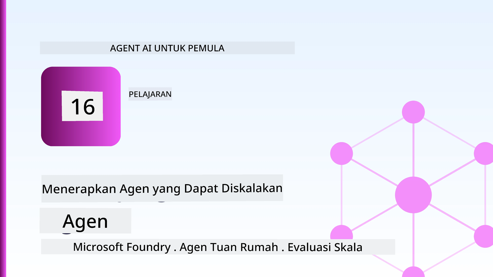
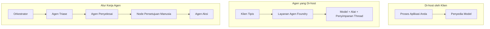
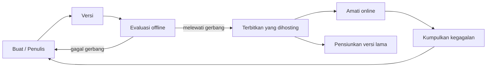
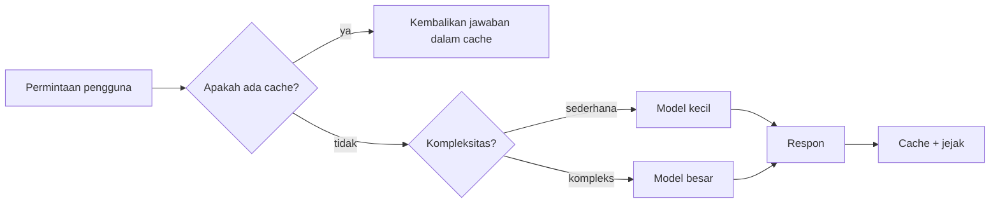
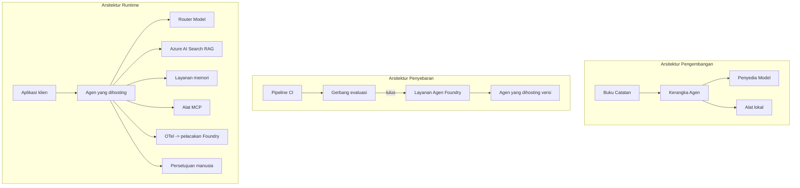

# Menerapkan Agen yang Dapat Diskalakan dengan Microsoft Foundry



Sampai titik ini dalam kursus, Anda telah membangun agen yang berjalan di laptop Anda, di dalam notebook, didorong oleh `az login` dan beberapa variabel lingkungan. Itulah cara yang tepat untuk belajar. Namun, itu bukan cara yang tepat untuk menjalankan agen yang bergantung pada ribuan pelanggan pada pukul 3 pagi.

Pelajaran ini mengenai kesenjangan antara "berfungsi di mesin saya" dan "berfungsi dengan andal dan terjangkau di produksi." Kami menutup kesenjangan itu menggunakan **Microsoft Foundry** dan **Microsoft Foundry Agent Service**, dan kami melakukannya dengan membangun agen dukungan pelanggan nyata yang memiliki alat, pengambilan, memori, evaluasi, dan pemantauan.

## Pendahuluan

Pelajaran ini akan membahas:

- Perbedaan antara **agen prototipe** dan **agen terpasang**, dan mengapa transisi ini sebagian besar tentang segala sesuatu *di sekitar* model.
- **Pola penerapan** untuk agen: di-host oleh klien, di-host oleh layanan (Hosted Agents), dan di-orchestrasi alur kerja.
- **Siklus hidup agen** di Microsoft Foundry — buat, versi, pasang, evaluasi, observasi, pensiun.
- **Strategi penskalaan**: pengalihan model, caching, konkurensi, dan desain tanpa status.
- **Observabilitas** dengan OpenTelemetry dan pelacakan Foundry.
- **Optimasi biaya** melalui pemilihan model, pengalihan, dan gerbang evaluasi.
- **Pertimbangan perusahaan**: tata kelola, persetujuan manusia, dan menjalankan server MCP dengan aman di produksi.

## Tujuan Pembelajaran

Setelah menyelesaikan pelajaran ini, Anda akan tahu cara:

- Memilih pola penerapan yang tepat untuk beban kerja agen tertentu.
- Menerapkan agen ke Microsoft Foundry Agent Service sehingga agen tersebut memiliki versi, diatur, dan dapat diamati.
- Menginstrumen agen untuk pelacakan dan menghubungkan pipeline evaluasi yang berjalan sebelum setiap rilis.
- Menerapkan pengalihan model dan caching untuk menjaga latensi dan biaya tetap terkendali pada skala besar.
- Menambahkan gerbang persetujuan manusia untuk tindakan berisiko tinggi dan mengintegrasikan server MCP dengan cara yang aman untuk produksi.

## Prasyarat

Pelajaran ini mengasumsikan Anda telah menyelesaikan pelajaran sebelumnya dan nyaman dengan:

- Membangun agen dengan [Microsoft Agent Framework](../14-microsoft-agent-framework/README.md) (Pelajaran 14).
- [Penggunaan Alat](../04-tool-use/README.md) (Pelajaran 4) dan [Agentic RAG](../05-agentic-rag/README.md) (Pelajaran 5).
- [Memori Agen](../13-agent-memory/README.md) (Pelajaran 13) dan [Protokol Agentic / MCP](../11-agentic-protocols/README.md) (Pelajaran 11).
- [Observabilitas dan Evaluasi](../10-ai-agents-production/README.md) (Pelajaran 10) — pelajaran ini dibangun langsung di atasnya.

Anda juga akan membutuhkan:

- Sebuah **langganan Azure** dan sebuah **proyek Microsoft Foundry** dengan setidaknya satu model chat yang telah diterapkan.
- **Azure CLI** yang sudah terotentikasi (`az login`).
- Python 3.12+ dan paket-paket dalam repositori [`requirements.txt`](../../../requirements.txt).

## Dari Prototipe ke Produksi: Apa yang Sebenarnya Berubah

Agen prototipe dan agen produksi berbagi loop inti yang sama — berpikir, memanggil alat, merespon. Yang berubah adalah segala sesuatu yang mengelilingi loop itu. Model mungkin hanya 20% dari agen produksi; 80% lainnya adalah kerangka operasional.

| Perhatian | Prototipe | Produksi |
| --- | --- | --- |
| **Hosting** | Berjalan di notebook Anda | Berjalan sebagai layanan yang di-host, memiliki versi dan diluncurkan secara bertahap |
| **Identitas** | Token `az login` Anda | Identitas terkelola dengan RBAC terbatas |
| **Status** | Dalam memori, hilang saat restart | Dieksternalisasi (penyimpanan thread, layanan memori) |
| **Kegagalan** | Anda melihat traceback | Melakukan pengulangan, fallback, dead-letter, pemberitahuan |
| **Biaya** | "Hanya beberapa sen" | Dilacak per permintaan, dialihkan, di-cache, dianggarkan |
| **Kualitas** | Anda lihat output secara langsung | Dievaluasi otomatis sebelum setiap rilis |
| **Kepercayaan** | Anda menyetujui setiap tindakan | Kebijakan + manusia dalam loop untuk tindakan berisiko |

Ingat tabel ini. Setiap bagian di bawah ini terkait dengan satu baris dari tabel tersebut.

## Pola Penerapan Agen

Ada tiga pola yang akan Anda gunakan, seringkali secara kombinasi.

### 1. Agen yang Di-host oleh Klien

Objek agen berada di dalam proses aplikasi *Anda*. Kode Anda memanggil penyedia model secara langsung; loop penalaran berjalan di layanan Anda. Inilah yang dilakukan oleh setiap pelajaran sebelumnya.

- **Gunakan saat** Anda membutuhkan kontrol penuh atas loop, middleware khusus, atau Anda menyematkan agen di backend yang sudah ada.
- **Kompromi**: Anda harus mengelola penskalaan, status, dan ketahanan sendiri.

### 2. Agen yang Di-host (Foundry Agent Service)

Agen *terdaftar sebagai sumber daya* di Microsoft Foundry. Foundry meng-host loop penalaran, menyimpan thread, menegakkan keamanan konten dan RBAC, serta membuat agen terlihat di portal Foundry. Aplikasi Anda menjadi klien tipis yang membuat thread dan membaca respons.

- **Gunakan saat** Anda menginginkan daya tahan, observabilitas bawaan, tata kelola, dan area operasional yang lebih kecil.
- **Kompromi**: kontrol tingkat rendah lebih sedikit sebagai gantinya runtime yang dikelola.

### 3. Alur Kerja Agen

Beberapa agen (dan alat) digabungkan ke dalam sebuah grafik dengan alur kontrol eksplisit — langkah berurutan, percabangan, node persetujuan manusia, dan checkpoint tahan lama yang dapat jeda dan dilanjutkan. Ini adalah kemampuan **Workflows** Microsoft Agent Framework yang diterapkan pada skala penerapan.

- **Gunakan saat** satu tugas melibatkan beberapa agen khusus atau membutuhkan langkah persetujuan di tengah.
- **Kompromi**: lebih banyak bagian bergerak; membutuhkan observabilitas tingkat orkestrasi.



## Siklus Hidup Agen di Microsoft Foundry

Menerapkan agen bukan sekadar melakukan `push` sekali. Itu adalah sebuah loop, dan sangat mirip dengan siklus rilis perangkat lunak karena memang itu yang sebenarnya.



Ide utama, yang dibawa dari [Pelajaran 10](../10-ai-agents-production/README.md): **evaluasi offline adalah gerbang, bukan setelahnya.** Versi baru agen tidak dikirim kecuali memenuhi ambang evaluasi Anda. Observabilitas online kemudian mengirimkan kegagalan dunia nyata kembali ke set tes offline Anda. Itu adalah seluruh loop.

## Strategi Penskalaan

Menskala agen berbeda dari menskala API web tanpa status, karena setiap permintaan dapat memicu beberapa panggilan model dan alat yang mahal. Empat teknik menanggung sebagian besar beban.

**Penanganan permintaan tanpa status.** Jangan menyimpan status per pengguna dalam memori proses Anda. Simpan thread percakapan dalam penyimpanan thread Foundry atau layanan memori sehingga instance mana saja bisa menangani permintaan apa saja. Inilah yang memungkinkan Anda mengskalakan secara horizontal — menambah instance, tanpa sesi lengket.

**Pengalihan model.** Tidak setiap permintaan membutuhkan model Anda yang paling mampu (dan paling mahal). Alihkan permintaan sederhana — klasifikasi niat, jawaban fakta singkat — ke model kecil dan cepat, dan simpan model besar untuk penalaran sebenarnya. **Model Router** Foundry dapat melakukan ini untuk Anda, atau Anda dapat membuat classifier ringan sendiri. Anda akan membangun versi DIY dalam lab.

**Caching respons.** Banyak kueri dukungan hampir duplikat ("bagaimana cara mereset kata sandi saya?"). Cache jawaban untuk pertanyaan umum dan sajikan tanpa harus memanggil model sama sekali. Bahkan tingkat cache hit yang sederhana secara berarti mengurangi biaya dan latensi.

**Konkurensi dan tekanan balik.** Penyedia model memiliki batas laju. Batasi konkurensi Anda, gunakan pengulangan dengan exponential backoff, dan gagal dengan anggun (respon antrean "kami sedang mengerjakannya" lebih baik daripada 500).



## Observabilitas dalam Produksi

Anda tidak dapat mengoperasikan sesuatu yang tidak dapat Anda lihat. Seperti yang dibahas di Pelajaran 10, Microsoft Agent Framework secara native mengeluarkan pelacakan **OpenTelemetry** — setiap panggilan model, panggilan alat, dan langkah orkestrasi menjadi sebuah span. Di produksi Anda mengekspor span itu ke Microsoft Foundry (atau backend kompatibel OTel manapun) sehingga Anda bisa:

- Melacak satu keluhan pelanggan dari ujung ke ujung melalui setiap panggilan model dan alat.
- Mengamati latensi p50/p95 dan biaya per permintaan dari waktu ke waktu.
- Memberi peringatan pada lonjakan tingkat kesalahan dan anomali biaya sebelum pengguna Anda (atau tim keuangan Anda) menyadarinya.

```python
from agent_framework.observability import get_tracer

tracer = get_tracer()

with tracer.start_as_current_span("support_request") as span:
    span.set_attribute("customer.tier", "enterprise")
    span.set_attribute("routed.model", "gpt-5-nano")
    # eksekusi agen dilacak secara otomatis di dalam rentang ini
```

Atribut seperti `customer.tier` dan `routed.model` adalah yang mengubah deretan pelacakan menjadi pertanyaan yang dapat dijawab ("apakah pelanggan perusahaan terlalu sering dialihkan ke model kecil?").

## Optimasi Biaya

Biaya dalam agen produksi didominasi oleh token. Ada tiga tuas, berdasarkan urutan dampaknya:

1. **Ukuran model yang tepat.** Model kecil yang melewati gerbang evaluasi Anda hampir selalu lebih murah daripada model besar yang juga lulus. Gunakan evaluasi untuk *membuktikan* model kecil cukup baik daripada memilih model terbesar secara default karena kehati-hatian.
2. **Pengalihan berdasarkan kompleksitas.** Seperti di atas — bayar harga model besar hanya untuk permintaan yang memerlukan penalaran model besar.
3. **Cache dengan agresif.** Panggilan model termurah adalah yang tidak pernah Anda lakukan.

Gerbang evaluasi dan pengendalian biaya adalah disiplin yang sama dilihat dari dua sisi: evaluasi memberi Anda *lantai kualitas*, pengalihan dan caching membuat Anda sedekat mungkin dengan *biaya* lantai itu.

## Pertimbangan Penerapan Perusahaan

**Tata kelola.** Hosted Agents mewarisi RBAC, keamanan konten, dan pencatatan audit Foundry. Berikan setiap agen identitas terkelola dengan hak paling terbatas yang diperlukan — akses baca saja ke basis pengetahuan, akses terbatas ke API tiket, tidak lebih.

**Manusia dalam loop.** Beberapa tindakan terlalu penting untuk diotomatisasi langsung — mengeluarkan pengembalian dana, menghapus akun, meningkatkan ke tim hukum. Microsoft Agent Framework mendukung alat dengan **persetujuan diperlukan**: agen mengusulkan tindakan, eksekusi berhenti, manusia menyetujui atau menolak, dan alur kerja dilanjutkan. Anda melihat primitifnya di [Pelajaran 6](../06-building-trustworthy-agents/README.md); di sini Anda menerapkannya.

**MCP di produksi.** [MCP](../11-agentic-protocols/README.md) memungkinkan agen Anda menggunakan alat eksternal melalui antarmuka standar. Di produksi, perlakukan setiap server MCP sebagai batas tak dipercaya: patok versi server, jalankan dengan identitas terbatas, validasi hasilnya, dan jangan pernah mengungkapkan rahasia kepadanya. Server MCP adalah dependensi, dan dependensi diperlukan patch, audit, dan pembatasan laju.



Ketiga diagram itu — pengembangan, penerapan, runtime — adalah agen yang sama pada tiga tahap kehidupannya. Lab berikut mengajak Anda membangunnya.

## Lab Praktik: Agen Dukungan Pelanggan Siap Produksi

Buka [`code_samples/16-python-agent-framework.ipynb`](./code_samples/16-python-agent-framework.ipynb) dan kerjakan dari awal sampai akhir. Anda akan merakit **agen dukungan pelanggan Contoso** dengan semua perhatian produksi terhubung:

1. **Panggilan alat** — memeriksa status pesanan dan membuka tiket dukungan.
2. **RAG** — menjawab pertanyaan kebijakan dari basis pengetahuan (Azure AI Search, dengan fallback di memori sehingga notebook berjalan tanpa resource Search).
3. **Memori** — mengingat pelanggan sepanjang giliran percakapan.
4. **Pengalihan model** — classifier kompleksitas mengalihkan setiap permintaan ke model kecil atau besar.
5. **Caching respons** — pertanyaan berulang disajikan dari cache.
6. **Persetujuan manusia** — pengembalian dana di atas ambang batas berhenti untuk persetujuan manusia.
7. **Pipeline evaluasi** — set tes offline kecil menilai agen dan berfungsi sebagai gerbang rilis.
8. **Observabilitas** — pelacakan OpenTelemetry pada setiap permintaan.

### Panduan Langkah demi Langkah

Notebook diorganisasikan sehingga setiap perhatian produksi adalah bagian yang berdiri sendiri dan dapat dijalankan. Intinya adalah handler permintaan routing-plus-caching:

```python
async def handle_support_request(query: str, customer_id: str) -> str:
    # 1. Layani dari cache jika memungkinkan.
    cached = response_cache.get(normalize(query))
    if cached:
        return cached

    # 2. Rute berdasarkan kompleksitas untuk mengontrol biaya.
    model = "gpt-5-nano" if is_simple(query) else "gpt-5-mini"

    # 3. Jalankan agen di dalam jejak span untuk observabilitas.
    with tracer.start_as_current_span("support_request") as span:
        span.set_attribute("routed.model", model)
        span.set_attribute("customer.id", customer_id)
        response = await support_agent.run(query, model=model)

    # 4. Cache dan kembalikan.
    response_cache.set(normalize(query), response.text)
    return response.text
```

Gerbang evaluasi yang menjaga rilis terlihat seperti ini:

```python
async def evaluation_gate(agent, test_cases, threshold: float = 0.8) -> bool:
    passed = 0
    for case in test_cases:
        result = await agent.run(case["input"])
        if score_response(result.text, case["expected"]) >= 0.8:
            passed += 1
    pass_rate = passed / len(test_cases)
    print(f"Evaluation pass rate: {pass_rate:.0%} (gate: {threshold:.0%})")
    return pass_rate >= threshold  # hanya melakukan deploy jika gerbang lulus
```

Baca setiap baris — notebook membuat primitifnya sengaja kecil agar tidak ada yang tersembunyi di balik panggilan framework.

## Memvalidasi Agen yang Diterapkan dengan Smoke Tests

Gerbang evaluasi di atas berjalan *offline* terhadap objek agen Anda. Setelah agen diterapkan sebagai Hosted Agent, Anda memerlukan pemeriksaan lain yang lebih murah: **apakah endpoint yang diterapkan benar-benar menjawab?**

Menerapkan "berhasil" hanya membuktikan bahwa kontrol plane menerima definisinya — tidak membuktikan agen merespons. Dependensi yang hilang, pengalihan model yang buruk, atau koneksi kedaluwarsa dapat meninggalkan penerapan hijau yang tidak mengembalikan apa pun. **Smoke test** menangkap itu dalam hitungan detik, setiap kali diterapkan, tanpa biaya evaluasi penuh.

Repositori ini menyediakan pipeline smoke-test siap pakai yang dibangun di atas [AI Smoke Test](https://github.com/marketplace/actions/ai-smoke-test) GitHub Action:

- **Katalog** — [`tests/lesson-16-smoke-tests.json`](../../../tests/lesson-16-smoke-tests.json) berisi prompt dan pernyataan untuk agen dukungan Contoso (jawaban kebijakan yang didasarkan, pencarian pesanan, tetap pada topik, dan kontinuitas thread multi-turn). Katalog untuk agen pelajaran lain hidup berdampingan dengannya — lihat [`tests/README.md`](../tests/README.md).
- **Alur kerja** — [`.github/workflows/smoke-test.yml`](../../../.github/workflows/smoke-test.yml) masuk dengan Azure OIDC dan POST setiap prompt ke endpoint Responses agen, gagal pekerjaan jika ada pernyataan yang tidak cocok.

```yaml
- name: Smoke-test hosted agent
  uses: JFolberth/ai-smoketest@v1
  with:
    project_endpoint: ${{ inputs.project_endpoint }}
    agent_name: ContosoSupportAgent
    tests_file: tests/lesson-16-smoke-tests.json
```


Jalankan dari tab **Actions** setelah agen Anda diterapkan, dengan memasukkan endpoint proyek Foundry dan nama agen Anda. Identitas federasi memerlukan peran **Azure AI User** pada cakupan proyek Foundry. Pikirkan lapisan-lapisan ini seperti piramida: uji asap (apakah dapat dijangkau dan merespons?) dijalankan pada setiap penerapan, evaluasi offline (apakah cukup baik untuk dikirim?) dijalankan sebelum promosi, dan evaluasi online (bagaimana kinerjanya di lapangan?) dijalankan secara terus-menerus.

## Pemeriksaan Pengetahuan

Uji pemahaman Anda sebelum beralih ke tugas.

**1. Kira-kira seberapa besar bagian agen produksi yang merupakan "model," dan bagaimana dengan sisanya?**

<details>
<summary>Jawaban</summary>

Model adalah bagian minoritas dari sistem — sering dikutip sekitar 20%. Sisanya adalah kerangka operasional: hosting dan versi, identitas dan RBAC, status yang dieksternalisasi, penanganan kegagalan, pelacakan biaya, evaluasi, dan kontrol human-in-the-loop. Beralih ke produksi sebagian besar tentang membangun segala sesuatu *di sekitar* siklus penalaran.
</details>

**2. Kapan Anda memilih Hosted Agent daripada agen yang dihosting klien?**

<details>
<summary>Jawaban</summary>

Saat Anda menginginkan runtime yang dikelola dengan ketahanan bawaan (thread yang bertahan dan dapat dilanjutkan), observabilitas, keamanan konten, dan RBAC, dan Anda bersedia menukar kontrol tingkat rendah dari siklus penalaran untuk mengurangi area operasi. Agen dihosting klien lebih disukai saat Anda memerlukan kontrol penuh atas siklus atau menyematkan agen dalam backend yang sudah ada.
</details>

**3. Mengapa agen yang dapat diskalakan harus tanpa status dalam memori prosesnya sendiri?**

<details>
<summary>Jawaban</summary>

Supaya setiap instance dapat menangani permintaan apa pun, yang memungkinkan penskalaan horizontal tanpa sesi tetap. Status percakapan per pengguna dieksternalisasi ke penyimpanan thread atau layanan memori. Jika status ada di memori proses, Anda akan kehilangannya saat restart dan tidak bisa mendistribusikan beban dengan bebas.
</details>

**4. Masalah apa yang diselesaikan routing model, dan bagaimana kaitannya dengan evaluasi?**

<details>
<summary>Jawaban</summary>

Routing mengarahkan permintaan sederhana ke model kecil yang murah dan cepat serta menyimpan model besar untuk penalaran yang sesungguhnya, mengendalikan latensi dan biaya. Ini terkait dengan evaluasi karena evaluasi adalah apa yang *membuktikan* model kecil cukup baik untuk kelas permintaan tertentu — routing tanpa evaluasi hanyalah tebakan.
</details>

**5. Apa itu "pintu evaluasi" dan di mana letaknya dalam siklus hidup?**

<details>
<summary>Jawaban</summary>

Pintu evaluasi menjalankan set tes offline terhadap versi agen baru dan memblokir penerapan kecuali tingkat kelulusan melewati ambang batas. Ini terletak antara "versi" dan "penerapan" dalam siklus hidup, membuat kualitas sebagai prasyarat rilis daripada sesuatu yang diperiksa setelah pengiriman.
</details>

**6. Mengapa server MCP harus diperlakukan sebagai batas tidak terpercaya dalam produksi?**

<details>
<summary>Jawaban</summary>

Karena itu adalah ketergantungan eksternal yang dipanggil oleh agen Anda. Anda harus menetapkan versinya, menjalankannya dengan identitas terbatas, memvalidasi outputnya, membatasi laju, dan tidak pernah mengekspos rahasia kepadanya — disiplin yang sama yang Anda terapkan untuk setiap ketergantungan pihak ketiga. Outputnya mengalir ke dalam penalaran agen Anda, jadi kepercayaan tanpa validasi adalah risiko keamanan.
</details>

**7. Perubahan tunggal apa yang biasanya memiliki dampak terbesar pada biaya agen produksi, dan mengapa?**

<details>
<summary>Jawaban</summary>

Menyesuaikan ukuran model — menggunakan model terkecil yang masih lolos pintu evaluasi Anda. Biaya didominasi oleh token, dan model yang lebih kecil yang memenuhi standar kualitas hampir selalu lebih murah daripada yang lebih besar. Caching dan routing kemudian mengurangi biaya lebih lanjut, tapi memilih model dasar yang tepat memiliki efek orde pertama terbesar.
</details>

**8. Peran apa yang dimainkan atribut span seperti `customer.tier` dan `routed.model` dalam observabilitas?**

<details>
<summary>Jawaban</summary>

Mereka mengubah jejak mentah menjadi pertanyaan bisnis yang bisa dijawab. Tanpa atribut Anda hanya memiliki tumpukan span; dengan atribut Anda bisa bertanya "apakah pelanggan enterprise terlalu sering diarahkan ke model kecil?" atau "model mana yang menangani permintaan kami yang terlambat paling lambat?" Atribut adalah cara Anda memotong telemetri berdasarkan dimensi yang penting untuk operasi Anda.
</details>

## Tugas

Ambil agen dukungan pelanggan dari lab dan persiapkan untuk skenario tertentu: **agen dukungan penagihan langganan untuk perusahaan SaaS.**

Pengajuan Anda harus:

1. **Ganti alat-alat** dengan yang relevan untuk penagihan: `get_subscription_status`, `get_invoice`, dan `issue_credit` (kredit di atas $50 memerlukan persetujuan manusia).
2. **Tambahkan tiga dokumen RAG** yang mencakup kebijakan pengembalian dana perusahaan, siklus penagihan, dan kebijakan pembatalan.
3. **Perluas set evaluasi** menjadi setidaknya delapan kasus, termasuk setidaknya dua yang *seharusnya* memicu jalur persetujuan manusia, dan pastikan pintu evaluasi Anda benar-benar lolos atau gagal.
4. **Tambahkan satu laporan biaya**: setelah menjalankan sepuluh kueri campuran melalui agen, cetak berapa banyak yang pergi ke model kecil, berapa banyak ke model besar, dan berapa banyak yang dilayani dari cache.

Tulis paragraf singkat (dalam sel markdown) yang menjelaskan aturan routing model mana yang Anda pilih dan bagaimana Anda akan memvalidasinya dengan lalu lintas nyata. Tidak ada jawaban tunggal yang benar — Anda dinilai berdasarkan apakah perhatian produksi terhubung secara koheren.

## Ringkasan

Dalam pelajaran ini Anda memindahkan agen dari prototipe ke produksi dengan Microsoft Foundry:

- Lonjakan ke produksi sebagian besar tentang **kerangka operasional** di sekitar model — hosting, identitas, status, penanganan kegagalan, biaya, kualitas, dan kepercayaan.
- Anda mempelajari tiga **pola penerapan** — dihosting klien, Hosted Agents, dan Agent Workflows — dan kapan masing-masing cocok.
- Anda mempelajari **siklus hidup agen**, di mana evaluasi offline **berfungsi sebagai pintu rilis** dan observabilitas online mengalirkan kegagalan kembali ke set tes.
- Anda menerapkan **strategi penskalaan** — desain tanpa status, routing model, caching, dan konkurensi terbatas — dan menghubungkannya ke **optimasi biaya**.
- Anda memasang **kontrol perusahaan**: RBAC, persetujuan human-in-the-loop, dan integrasi MCP yang aman untuk produksi.
- Anda membangun **agen dukungan pelanggan siap produksi** yang mengikat semua perhatian ini bersama dalam kode yang dapat dijalankan.

Pelajaran berikutnya melakukan perjalanan sebaliknya: alih-alih memperbesar agen ke dalam cloud, Anda akan membawanya *turun* ke mesin pengembang tunggal dan menjalankannya sepenuhnya secara lokal.

## Sumber Daya Tambahan

- <a href="https://learn.microsoft.com/azure/ai-foundry/what-is-azure-ai-foundry" target="_blank">Dokumentasi Microsoft Foundry</a>
- <a href="https://learn.microsoft.com/azure/ai-foundry/agents/overview" target="_blank">Ikhtisar Layanan Agen Microsoft Foundry</a>
- <a href="https://learn.microsoft.com/en-us/agent-framework/overview/?wt.mc_id=youtube_26688_organicsocial_reactor&pivots=programming-language-python" target="_blank">Microsoft Agent Framework</a>
- <a href="https://learn.microsoft.com/azure/ai-foundry/concepts/model-router" target="_blank">Model Router di Microsoft Foundry</a>
- <a href="https://learn.microsoft.com/azure/search/search-what-is-azure-search" target="_blank">Azure AI Search</a>
- <a href="https://opentelemetry.io/" target="_blank">OpenTelemetry</a>
- <a href="https://github.com/marketplace/actions/ai-smoke-test" target="_blank">AI Smoke Test GitHub Action</a>
- <a href="https://modelcontextprotocol.io/" target="_blank">Model Context Protocol (MCP)</a>

## Pelajaran Sebelumnya

[Membangun Agen Penggunaan Komputer (CUA)](../15-browser-use/README.md)

## Pelajaran Berikutnya

[Membuat Agen AI Lokal](../17-creating-local-ai-agents/README.md)

---

<!-- CO-OP TRANSLATOR DISCLAIMER START -->
**Penafian**:
Dokumen ini telah diterjemahkan menggunakan layanan terjemahan AI [Co-op Translator](https://github.com/Azure/co-op-translator). Meskipun kami berupaya untuk mencapai akurasi, harap diketahui bahwa terjemahan otomatis mungkin mengandung kesalahan atau ketidakakuratan. Dokumen asli dalam bahasa aslinya harus dianggap sebagai sumber yang sah. Untuk informasi penting, disarankan menggunakan terjemahan profesional oleh manusia. Kami tidak bertanggung jawab atas kesalahpahaman atau penafsiran yang keliru yang timbul dari penggunaan terjemahan ini.
<!-- CO-OP TRANSLATOR DISCLAIMER END -->