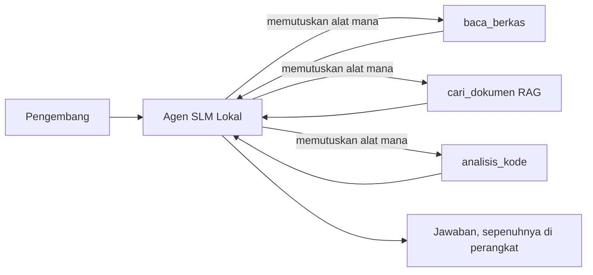
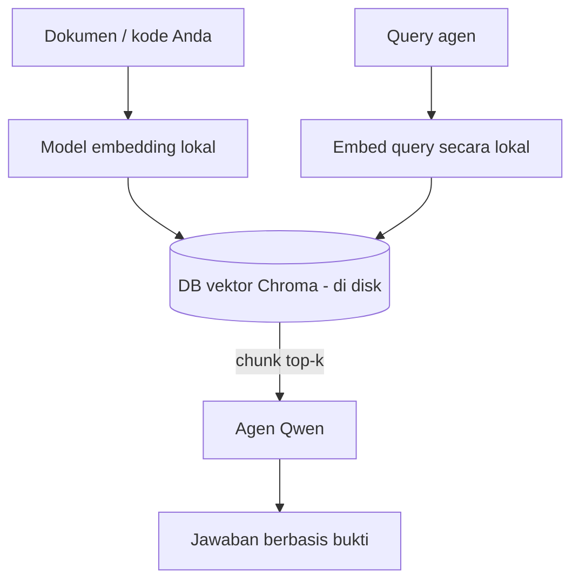
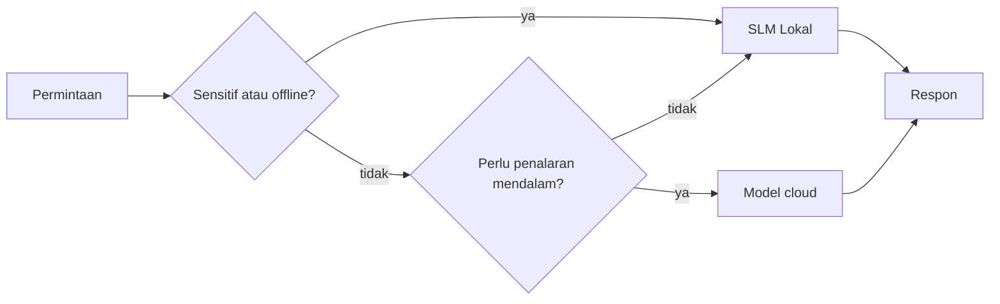

# Membuat Agen AI Lokal Menggunakan Microsoft Foundry Local dan Qwen


Pelajaran sebelumnya memperbesar agen ke *cloud*. Pelajaran ini membawanya *ke bawah* ke satu mesin tunggal. Pada akhirnya Anda akan memiliki asisten teknik yang berfungsi yang dapat bernalar, memanggil alat, membaca file Anda, dan mencari dokumentasi Anda — **tanpa satu pun panggilan inferensi cloud.**

Mengapa Anda menginginkan itu? Tiga alasan yang sering muncul dalam pekerjaan teknik nyata:

- **Privasi.** Kode dan dokumen tidak pernah meninggalkan mesin. Tidak ada prompt, cuplikan, atau data pelanggan yang melewati batas jaringan.
- **Biaya.** Inferensi lokal tidak memiliki tagihan per-token. Anda dapat iterasi sepanjang hari dengan harga listrik.
- **Offline.** Di pesawat, di fasilitas aman, atau saat pemadaman, agen tetap bekerja.

Kekurangannya adalah Anda menukar model cloud mutakhir dengan **Model Bahasa Kecil (SLM)** yang berjalan di CPU, GPU, atau NPU Anda. Pelajaran ini tentang membangun agen yang *baik* dalam batasan tersebut daripada berpura-pura batasan itu tidak ada.

## Pendahuluan

Pelajaran ini akan membahas:

- **Model Bahasa Kecil (SLM)** — apa itu, di mana mereka unggul, dan di mana mereka tidak.
- **Microsoft Foundry Local** — runtime yang mengunduh dan menyajikan model secara lokal melalui **API kompatibel OpenAI**.
- **Model pemanggilan fungsi Qwen** — SLM yang secara andal menghasilkan panggilan alat, yang memungkinkan agen lokal (bukan hanya chat lokal).
- **Alat lokal, RAG lokal, dan MCP lokal** — memberikan kemampuan agen tanpa cloud.
- **Pola hibrida** — kapan menyimpan di lokal dan kapan mengandalkan cloud.

## Tujuan Pembelajaran

Setelah menyelesaikan pelajaran ini, Anda akan tahu bagaimana:

- Menjelaskan trade-off SLM dan memilih kasus penggunaan agen lokal yang tepat.
- Menyajikan model Qwen secara lokal dengan Foundry Local dan menghubungkannya melalui endpoint kompatibel OpenAI.
- Membangun agen pemanggil alat yang berjalan sepenuhnya di workstation Anda.
- Menambahkan RAG lokal di atas dokumen Anda sendiri menggunakan database vektor lokal (Chroma).
- Menghubungkan agen ke server MCP lokal dan menganalisis desain hibrida lokal/cloud.

## Prasyarat

Pelajaran ini mengasumsikan Anda telah menyelesaikan pelajaran sebelumnya dan nyaman dengan:

- [Penggunaan Alat](../04-tool-use/README.md) (Pelajaran 4) dan [Agentic RAG](../05-agentic-rag/README.md) (Pelajaran 5).
- [Protokol Agentic / MCP](../11-agentic-protocols/README.md) (Pelajaran 11).
- [Microsoft Agent Framework](../14-microsoft-agent-framework/README.md) (Pelajaran 14).

Anda juga memerlukan:

- Workstation pengembang. **8 GB RAM adalah minimum realistis**; 16 GB+ lebih nyaman. GPU atau NPU membantu tetapi tidak wajib.
- **Microsoft Foundry Local** terpasang (lihat bagian pengaturan di bawah).
- Python 3.12+ dan paket dalam repositori [`requirements.txt`](../../../requirements.txt), plus `foundry-local-sdk`, `openai`, dan `chromadb` untuk pelajaran ini.

## Model Bahasa Kecil: Alat yang Tepat untuk Kerja Lokal

Model cloud mutakhir memiliki ratusan miliar parameter dan pusat data di belakangnya. SLM memiliki beberapa miliar parameter dan harus muat di RAM laptop Anda. Perbedaan ini menetapkan ekspektasi yang jelas.

**SLM unggul dalam:**

- Tugas terstruktur dan terbatas — klasifikasi, ekstraksi, ringkasan dokumen yang diketahui.
- **Pemanggilan alat** — memutuskan fungsi mana yang dipanggil dan dengan argumen apa.
- Iterasi cepat, murah, dan privat pada data Anda sendiri.

**SLM kurang bagus dalam:**

- Penalaran terbuka dan multi-langkah atas konteks besar.
- Pengetahuan dunia luas (mereka melihat lebih sedikit dan lebih sering lupa).

Strategi terbaik untuk agen lokal adalah: **biarkan SLM mengoordinasi, dan biarkan alat melakukan pekerjaan berat.** Model tidak perlu *tahu* basis kode Anda — ia perlu tahu kapan memanggil `read_file` dan `search_docs`. Itu sesuai dengan kekuatan SLM.



## Microsoft Foundry Local

**Microsoft Foundry Local** adalah runtime ringan yang mengunduh, mengelola, dan menyajikan model sepenuhnya di mesin Anda. Fitur terpenting bagi kita adalah ia mengekspos **endpoint HTTP kompatibel OpenAI** — yang berarti SDK OpenAI dan klien OpenAI dari Microsoft Agent Framework bekerja dengannya hanya dengan mengganti `base_url`. Semua yang Anda pelajari tentang membangun agen langsung bisa dipakai; hanya endpointnya yang berpindah dari cloud ke `localhost`.

Foundry Local juga otomatis memilih build model terbaik untuk hardware Anda — build CPU, build CUDA/GPU, atau build NPU — jadi Anda tidak perlu mengoptimalkan per mesin secara manual.

### Pengaturan

Pasang Foundry Local (lihat [dokumentasi](https://learn.microsoft.com/azure/ai-foundry/foundry-local/) untuk OS Anda), lalu pastikan berjalan:

```bash
# Instal (contoh; ikuti dokumen untuk platform Anda)
winget install Microsoft.FoundryLocal      # Windows
# brew install microsoft/foundrylocal/foundrylocal   # macOS

# Unduh dan jalankan model Qwen, lalu mulai layanan lokal
foundry model run qwen2.5-7b-instruct
foundry service status
```

Setelah layanan aktif, Anda memiliki endpoint OpenAI-kompatibel lokal (biasanya `http://localhost:PORT/v1`). Notebook menggunakan `foundry-local-sdk` untuk otomatis menemukan endpoint, jadi Anda tidak perlu mengkodekan port secara keras.

## Pemanggilan Fungsi Qwen: Mengapa Penting

Agen hanya agen jika dapat memanggil alat. Banyak SLM bisa chatting tetapi menghasilkan panggilan alat yang tidak andal dan tidak terformat dengan benar. Model **Qwen** dilatih untuk pemanggilan fungsi dan secara konsisten mengeluarkan struktur panggilan alat yang baik — inilah yang mengubah model chat lokal menjadi agen *lokal*.

Alurnya adalah loop pemanggilan alat standar yang sudah Anda kenal, hanya berjalan di perangkat:


## RAG Lokal

Pencarian dokumentasi adalah tempat agen lokal berguna. Alih-alih berharap SLM menghapal dokumen framework Anda, Anda menyematkan dokumen itu ke dalam **database vektor lokal** dan membiarkan agen mengambil bagian yang relevan sesuai permintaan.

Kita menggunakan **Chroma**, penyimpanan vektor tersemat yang berjalan di proses yang sama tanpa server pengelola. Jalur data sepenuhnya lokal: model embedding lokal → vektor lokal → pengambilan lokal → SLM lokal.



Ini adalah pola Agentic RAG yang sama dari Pelajaran 5 — satu-satunya perubahan adalah semua komponen berjalan di mesin Anda.

## Server MCP Lokal

[MCP](../11-agentic-protocols/README.md) adalah transport, bukan layanan cloud. Server MCP dapat berjalan sebagai proses lokal di `stdio`, mengekspos alat ke agen Anda melalui protokol standar. Ini memungkinkan Anda menggunakan ulang ekosistem server MCP yang terus berkembang — akses filesystem, operasi git, kueri database — sepenuhnya offline.

Postur keamanan berbeda dari cloud, tetapi tidak hilang: server MCP lokal tetap berjalan dengan izin pengguna Anda, jadi batasi cakupan yang dapat diaksesnya (direktori proyek, bukan seluruh folder home Anda) dan anggap outputnya sebagai input yang perlu divalidasi.

## Pola Hibrida Cloud-dan-Lokal

Lokal-pertama tidak berarti hanya lokal. Sistem matang melakukan routing berdasarkan sensitivitas dan kesulitan:

| Situasi | Tempat menjalankan |
| --- | --- |
| Kode/data sensitif, atau offline | **SLM Lokal** |
| Tugas sederhana, terbatas | **SLM Lokal** (murah, cepat) |
| Penalaran multi-langkah sulit pada data tidak sensitif | **Model Cloud** |
| Semua kondisi saat pemadaman | **SLM Lokal** (degradasi anggun) |

Ini mencerminkan ide **routing model** dari Pelajaran 16 — kecuali salah satu "model" kini adalah mesin Anda sendiri. Desain tangguh beralih ke lokal saat cloud tidak tersedia, jadi agen menurun kualitasnya secara bertahap daripada gagal total.



## Lab Praktik: Asisten Teknik Lokal

Buka [`code_samples/17-local-agent-foundry-local.ipynb`](./code_samples/17-local-agent-foundry-local.ipynb) dan kerjakan. Anda akan membangun **asisten teknik lokal** yang berjalan sepenuhnya di workstation Anda dan dapat:

1. **Memanggil alat** — melalui pemanggilan fungsi Qwen lewat Foundry Local.
2. **Melakukan operasi file lokal** — mendaftar dan membaca file dalam direktori proyek.
3. **Menganalisis kode** — melaporkan metrik sederhana pada berkas sumber.
4. **Mencari dokumentasi** — RAG lokal di atas folder dokumen dengan Chroma.
5. **Menggunakan MCP** — terhubung ke server MCP lokal (dengan lompatan anggun jika tidak dikonfigurasi).

Tidak ada inferensi cloud yang digunakan sama sekali.

### Panduan Langkah demi Langkah

Asisten terhubung ke Foundry Local melalui endpoint kompatibel OpenAI, jadi kode agen hampir sama dengan pelajaran cloud — hanya klien yang berubah:

```python
from foundry_local import FoundryLocalManager
from openai import OpenAI

# Foundry Local menemukan/mengunduh model dan memberi kita endpoint lokal.
manager = FoundryLocalManager(\"qwen2.5-7b-instruct\")
client = OpenAI(base_url=manager.endpoint, api_key=manager.api_key)  # api_key adalah placeholder lokal
```

Alat-alatnya adalah fungsi Python biasa yang dibatasi ke direktori proyek:

```python
def read_file(path: str) -> str:
    \"\"\"Read a file, but only inside the sandboxed project directory.\"\"\"
    full = (PROJECT_ROOT / path).resolve()
    if PROJECT_ROOT not in full.parents and full != PROJECT_ROOT:
        return \"Access denied: path is outside the project directory.\"
    return full.read_text(encoding=\"utf-8\")
```

Perhatikan pemeriksaan sandbox — bahkan secara lokal, alat yang membaca jalur sembarangan adalah risiko. Notebook menjaga setiap alat dibatasi ke akar proyek tunggal.

## Pemeriksaan Pengetahuan

Uji pemahaman Anda sebelum melanjutkan ke tugas.

**1. Berikan dua alasan konkret untuk menjalankan agen secara lokal daripada di cloud.**

<details>
<summary>Jawaban</summary>

Dua dari: **privasi** (kode dan data tidak pernah meninggalkan mesin), **biaya** (tidak ada tagihan inferensi per-token), dan **kemampuan offline** (berfungsi tanpa jaringan — di pesawat, fasilitas aman, atau saat pemadaman). Batasan regulasi/kepatuhan yang melarang pengiriman data ke luar perangkat sering menjadi pemicu alasan privasi.
</details>

**2. Apa pembagian kerja yang dianjurkan antara SLM dan alatnya dalam agen lokal, dan mengapa?**

<details>
<summary>Jawaban</summary>

Biarkan SLM **mengatur** (memutuskan alat mana yang dipanggil dan dengan argumen apa) dan biarkan **alat melakukan pekerjaan berat** (membaca file, mengambil dokumen, menghitung hasil). SLM kuat di keputusan terbatas seperti pemilihan alat tapi lemah pada pengetahuan luas dan penalaran multi-langkah panjang, jadi mengandalkan alat sesuai dengan kekuatannya.
</details>

**3. Apa yang memungkinkan kode agen cloud dapat digunakan ulang dengan Foundry Local?**

<details>
<summary>Jawaban</summary>

Foundry Local mengekspos **endpoint HTTP kompatibel OpenAI**. SDK OpenAI dan klien OpenAI dari Agent Framework bekerja dengannya dengan hanya mengganti `base_url` (dan menggunakan kunci API lokal placeholder). Semua kode agen lainnya tetap sama.
</details>

**4. Mengapa khusus digunakan model pemanggilan fungsi Qwen dan bukan sembarang SLM?**

<details>
<summary>Jawaban</summary>

Karena agen harus menghasilkan **panggilan alat** yang dapat diandalkan dan terformat dengan benar. Banyak SLM bisa chatting tetapi menghasilkan struktur panggilan alat yang tidak konsisten atau salah format. Model Qwen dilatih untuk pemanggilan fungsi dan menghasilkan panggilan alat konsisten, yang mengubah model chat lokal menjadi agen lokal yang bekerja.
</details>

**5. Dalam jalur RAG lokal, komponen mana yang berjalan di mesin?**

<details>
<summary>Jawaban</summary>

Semua: model embedding, database vektor (Chroma, di disk), langkah pengambilan, dan SLM. Dokumen di-embedding secara lokal, disimpan secara lokal, diambil secara lokal, dan dianalisis oleh model lokal — tidak ada komponen yang menyentuh cloud.
</details>

**6. Server MCP lokal berjalan di mesin Anda. Apakah itu otomatis aman? Tindakan pencegahan apa yang harus Anda lakukan?**

<details>
<summary>Jawaban</summary>

Tidak. Server MCP lokal berjalan dengan izin pengguna Anda, jadi dapat mengakses apa pun yang Anda bisa. Batasi cakupannya sesuai kebutuhan (misalnya direktori proyek saja, bukan seluruh folder home Anda) dan anggap outputnya sebagai input yang harus divalidasi sebelum dilakukan tindakan.
</details>

**7. Jelaskan aturan routing hibrida yang masuk akal yang mencakup model lokal.**

<details>
<summary>Jawaban</summary>

Arahkan permintaan sensitif atau offline ke SLM lokal; arahkan tugas sederhana terbatas ke SLM lokal untuk kecepatan dan biaya; arahkan penalaran multi-langkah sulit pada data tidak sensitif ke model cloud; dan fallback ke SLM lokal jika cloud tidak tersedia agar agen menurun secara anggun, bukan gagal total. Ini adalah routing model (Pelajaran 16) dengan mesin lokal sebagai salah satu model.
</details>

**8. Berapa angka minimal RAM realistis untuk menjalankan agen lokal di pelajaran ini, dan apa keuntungan lebih banyak RAM?**

<details>
<summary>Jawaban</summary>

Sekitar **8 GB** adalah minimum realistis; 16 GB+ lebih nyaman. Lebih banyak RAM memungkinkan Anda menjalankan model yang lebih besar, lebih kapabel, dan mempertahankan lebih banyak konteks di memori. GPU atau NPU mempercepat inferensi tapi tidak wajib — Foundry Local memilih build CPU jika tidak ada akselerator tersedia.
</details>

## Tugas

Kembangkan asisten teknik lokal menjadi **peninjau dokumentasi lokal** untuk proyek kecil pilihan Anda (gunakan salah satu folder pelajaran di repo ini jika Anda mau).

Pengiriman Anda harus:

1. **Mengindeks folder dokumen/kode nyata** ke Chroma (minimal lima file).
2. **Menambahkan alat `find_todos`** yang memindai proyek untuk komentar `TODO`/`FIXME` dan mengembalikannya dengan nama file dan nomor baris — dengan pemeriksaan sandbox sama seperti `read_file`.

3. **Ajukan tiga pertanyaan kepada agen** yang memaksanya menggabungkan alat: satu pertanyaan RAG murni, satu yang memerlukan pembacaan file tertentu, dan satu yang memerlukan pencarian TODO.
4. **Ukur waktu**: catat waktu setiap dari tiga respons dan tuliskan di dalam sel markdown. Beri komentar apakah latensi tersebut dapat diterima untuk alur kerja yang Anda inginkan.

Kemudian tulis paragraf singkat tentang **apa yang akan Anda pindahkan ke cloud dan apa yang akan Anda simpan secara lokal** untuk pemeriksa ini, dan alasannya. Anda dinilai berdasarkan apakah komponen lokal terhubung dengan benar dan apakah pemikiran hibrida Anda masuk akal — bukan berdasarkan kualitas model.

## Ringkasan

Dalam pelajaran ini Anda membangun agen yang berjalan sepenuhnya di mesin Anda sendiri:

- **SLM** menukar keluasan dengan privasi, biaya, dan operasi offline — dan bersinar ketika mereka **mengorkestrasi alat** daripada membawa semua pengetahuan sendiri.
- **Foundry Local** melayani model di perangkat di balik **endpoint yang kompatibel dengan OpenAI**, sehingga kode agen cloud Anda dapat dipindahkan dengan satu baris perubahan.
- **Model pemanggilan fungsi Qwen** memungkinkan pemanggilan alat lokal yang andal — dan dengan demikian *agen* lokal — menjadi mungkin.
- **Local RAG** (Chroma) dan **MCP lokal** memberikan kemampuan agen tanpa meninggalkan mesin.
- **Pola hibrida** memungkinkan Anda mengarahkan berdasarkan sensitivitas dan tingkat kesulitan, dengan lokal sebagai fallback yang elegan.

Ini menyelesaikan lengkungan penerapan: Pelajaran 16 memperbesar agen ke Microsoft Foundry, dan pelajaran ini memperkecilnya ke satu workstation. Pelajaran berikutnya membahas menjaga keamanan agen yang dikerahkan.

## Sumber Daya Tambahan

- <a href="https://learn.microsoft.com/azure/ai-foundry/foundry-local/" target="_blank">Dokumentasi Microsoft Foundry Local</a>
- <a href="https://learn.microsoft.com/azure/ai-foundry/what-is-azure-ai-foundry" target="_blank">Dokumentasi Microsoft Foundry</a>
- <a href="https://learn.microsoft.com/en-us/agent-framework/overview/?wt.mc_id=youtube_26688_organicsocial_reactor&pivots=programming-language-python" target="_blank">Microsoft Agent Framework</a>
- <a href="https://qwen.readthedocs.io/en/latest/framework/function_call.html" target="_blank">Dokumentasi pemanggilan fungsi Qwen</a>
- <a href="https://modelcontextprotocol.io/" target="_blank">Model Context Protocol (MCP)</a>
- <a href="https://docs.trychroma.com/" target="_blank">Basis data vektor Chroma</a>

## Pelajaran Sebelumnya

[Deploying Scalable Agents](../16-deploying-scalable-agents/README.md)

## Pelajaran Berikutnya

[Securing AI Agents](../18-securing-ai-agents/README.md)

---

<!-- CO-OP TRANSLATOR DISCLAIMER START -->
**Penafian**:
Dokumen ini telah diterjemahkan menggunakan layanan terjemahan AI [Co-op Translator](https://github.com/Azure/co-op-translator). Meskipun kami berupaya untuk mencapai akurasi, harap diketahui bahwa terjemahan otomatis mungkin mengandung kesalahan atau ketidakakuratan. Dokumen asli dalam bahasa aslinya harus dianggap sebagai sumber yang sah. Untuk informasi penting, disarankan menggunakan terjemahan profesional oleh manusia. Kami tidak bertanggung jawab atas kesalahpahaman atau penafsiran yang keliru yang timbul dari penggunaan terjemahan ini.
<!-- CO-OP TRANSLATOR DISCLAIMER END -->