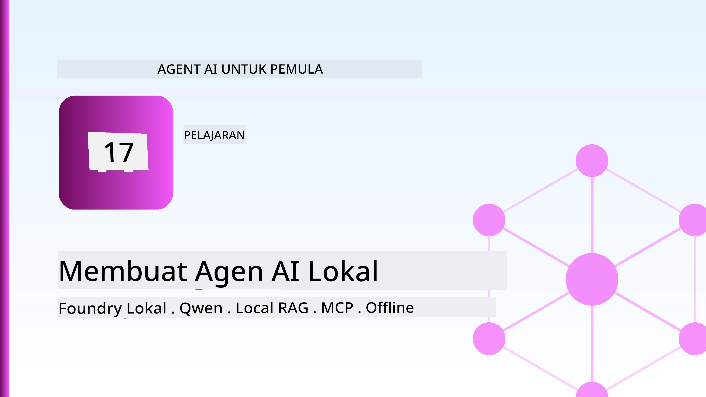
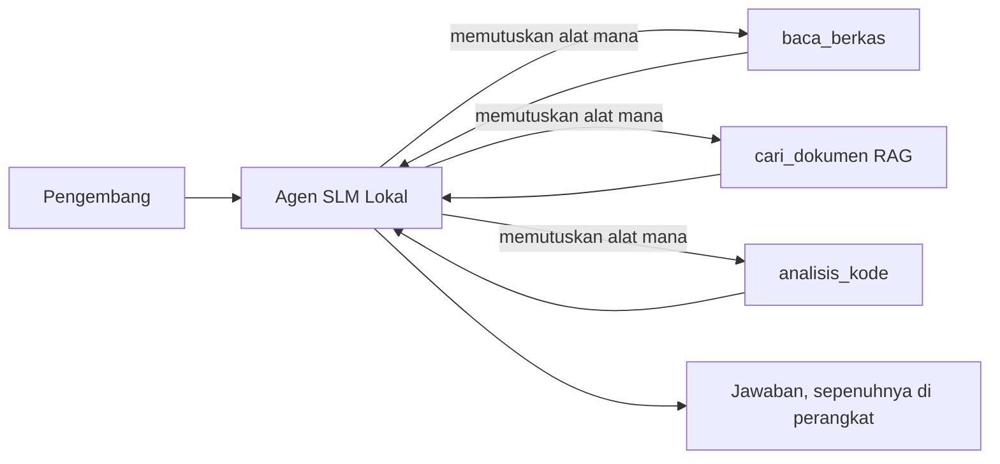
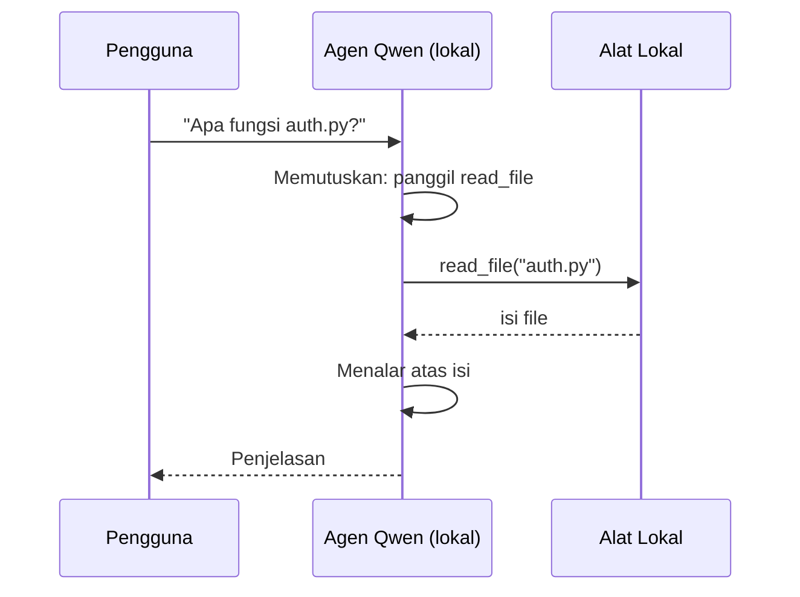
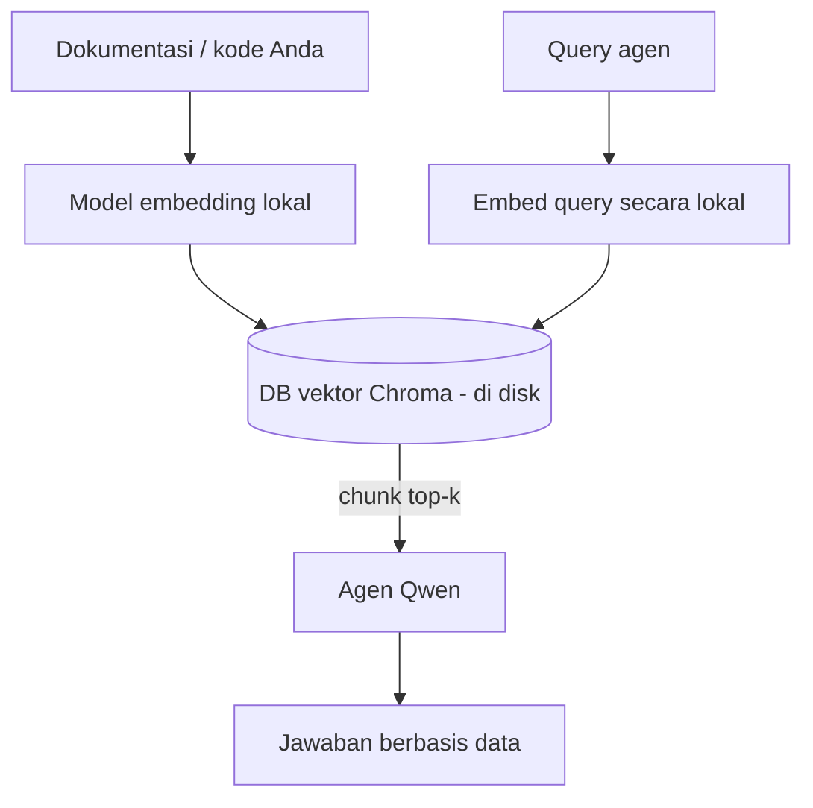
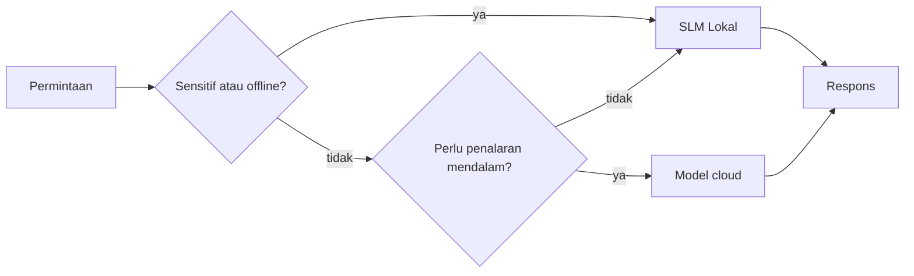

# Membuat Agen AI Lokal Menggunakan Microsoft Foundry Local dan Qwen



Pelajaran sebelumnya memperbesar agen ke cloud. Pelajaran ini membawa mereka turun ke satu mesin. Pada akhirnya, Anda akan memiliki asisten teknik yang berfungsi yang dapat bernalar, memanggil alat, membaca file Anda, dan mencari dokumentasi Anda — **tanpa satu pun panggilan inferensi cloud.**

Mengapa Anda menginginkannya? Tiga alasan yang sering muncul dalam pekerjaan teknik nyata:

- **Privasi.** Kode dan dokumen tidak pernah meninggalkan mesin. Tidak ada prompt, tidak ada potongan kode, tidak ada data pelanggan yang melewati batas jaringan.
- **Biaya.** Inferensi lokal tidak memiliki tagihan per-token. Anda dapat beriterasi sepanjang hari dengan harga listrik saja.
- **Offline.** Di pesawat, di fasilitas aman, atau selama pemadaman, agen tetap berfungsi.

Namun Anda menukar model cloud frontier dengan **Small Language Model (SLM)** yang berjalan pada CPU, GPU, atau NPU Anda. Pelajaran ini membahas membangun agen yang *baik* dalam batasan tersebut daripada berpura-pura batasan itu tidak ada.

## Pengantar

Pelajaran ini akan membahas:

- **Small Language Models (SLM)** — apa itu, di mana kelebihannya, dan di mana tidak.
- **Microsoft Foundry Local** — runtime yang mengunduh dan menyajikan model di perangkat melalui **API kompatibel OpenAI**.
- **Model pemanggilan fungsi Qwen** — SLM yang secara andal menghasilkan panggilan alat, yang membuat agen lokal (bukan hanya chat lokal) memungkinkan.
- **Alat lokal, RAG lokal, dan MCP lokal** — memberikan kemampuan agen tanpa cloud.
- **Pola hybrid** — kapan mempertahankan lokal dan kapan menggunakan cloud.

## Tujuan Pembelajaran

Setelah menyelesaikan pelajaran ini, Anda akan tahu cara:

- Menjelaskan trade-off SLM dan memilih kasus penggunaan agen lokal yang tepat.
- Melayani model Qwen secara lokal dengan Foundry Local dan menghubungkannya melalui endpoint kompatibel OpenAI.
- Membangun agen pemanggilan alat yang berjalan sepenuhnya di workstation Anda.
- Menambahkan RAG lokal di atas dokumen Anda sendiri menggunakan basis data vektor lokal (Chroma).
- Menghubungkan agen ke server MCP lokal dan bernalar tentang desain hybrid lokal/cloud.

## Prasyarat

Pelajaran ini mengasumsikan Anda telah menyelesaikan pelajaran sebelumnya dan nyaman dengan:

- [Penggunaan Alat](../04-tool-use/README.md) (Pelajaran 4) dan [Agentic RAG](../05-agentic-rag/README.md) (Pelajaran 5).
- [Protokol Agentic / MCP](../11-agentic-protocols/README.md) (Pelajaran 11).
- [Microsoft Agent Framework](../14-microsoft-agent-framework/README.md) (Pelajaran 14).

Anda juga memerlukan:

- Workstation pengembang. **8 GB RAM adalah minimum yang realistis**; 16 GB+ lebih nyaman. GPU atau NPU membantu tetapi tidak wajib.
- **Microsoft Foundry Local** terpasang (lihat bagian setup di bawah).
- Python 3.12+ dan paket-paket dalam repo [`requirements.txt`](../../../requirements.txt), plus `foundry-local-sdk`, `openai`, dan `chromadb` untuk pelajaran ini.

## Small Language Models: Alat yang Tepat untuk Kerja Lokal

Model cloud frontier memiliki ratusan miliar parameter dan pusat data di belakangnya. SLM memiliki beberapa miliar parameter dan harus muat di RAM laptop Anda. Perbedaan itu menetapkan ekspektasi yang jelas.

**SLM unggul dalam:**

- Tugas terstruktur dan terbatas — klasifikasi, ekstraksi, ringkasan dokumen yang diketahui.
- **Pemanggilan alat** — memutuskan fungsi mana yang dipanggil dan dengan argumen apa.
- Iterasi cepat, murah, dan privat pada data Anda sendiri.

**SLM lebih lemah pada:**

- Penalaran multi-langkah terbuka melintasi konteks besar.
- Pengetahuan dunia luas (mereka melihat lebih sedikit, dan lebih cepat lupa).

Strategi menang untuk agen lokal adalah: **biarkan SLM mengorkestrasi, dan biarkan alat melakukan pekerjaan berat.** Model tidak perlu *mengetahui* basis kode Anda — cukup tahu kapan memanggil `read_file` dan `search_docs`. Itu sesuai dengan kekuatan SLM.



## Microsoft Foundry Local

**Microsoft Foundry Local** adalah runtime ringan yang mengunduh, mengelola, dan menyajikan model sepenuhnya di mesin Anda. Fitur terpentingnya bagi kita adalah menyediakan **endpoint HTTP kompatibel OpenAI** — yang berarti SDK OpenAI dan klien OpenAI di Microsoft Agent Framework bekerja dengannya hanya dengan mengubah `base_url`. Semua yang Anda pelajari tentang membangun agen langsung bisa diterapkan; hanya endpoint yang berpindah dari cloud ke `localhost`.

Foundry Local juga secara otomatis memilih build model terbaik untuk perangkat keras Anda — build CPU, build CUDA/GPU, atau build NPU — jadi Anda tidak perlu optimasi per mesin secara manual.

### Setup

Pasang Foundry Local (lihat [dokumentasi](https://learn.microsoft.com/azure/ai-foundry/foundry-local/) untuk OS Anda), lalu konfirmasi berjalan:

```bash
# Instal (contoh; ikuti dokumentasi untuk platform Anda)
winget install Microsoft.FoundryLocal      # Windows
# brew install microsoft/foundrylocal/foundrylocal   # macOS

# Unduh dan jalankan model Qwen, lalu mulai layanan lokal
foundry model run qwen2.5-7b-instruct
foundry service status
```

Setelah layanan berjalan, Anda memiliki endpoint lokal kompatibel OpenAI (biasanya `http://localhost:PORT/v1`). Notebook menggunakan `foundry-local-sdk` untuk menemukan endpoint otomatis, sehingga Anda tidak perlu meng-kode port secara keras.

## Pemanggilan Fungsi Qwen: Mengapa Penting

Agen hanya agen jika dapat memanggil alat. Banyak SLM bisa chat tapi menghasilkan panggilan alat yang tidak andal dan tidak terformat dengan benar. Model **Qwen** dilatih untuk pemanggilan fungsi dan menghasilkan struktur pemanggilan alat yang baik secara konsisten — yang mengubah model chat lokal menjadi agen lokal.

Alurnya adalah loop pemanggilan alat standar yang sudah Anda kenal, hanya saja berjalan di perangkat:



## RAG Lokal

Pencarian dokumentasi adalah tempat agen lokal berguna. Alih-alih berharap SLM menghafal dokumentasi framework Anda, Anda menanam dokumen itu ke dalam **basis data vektor lokal** dan membiarkan agen mengambil potongan relevan sesuai permintaan.

Kami menggunakan **Chroma**, penyimpanan vektor embedded yang berjalan dalam proses tanpa server yang harus diatur. Pipelines sepenuhnya lokal: model embedding lokal → vektor lokal → pengambilan lokal → SLM lokal.



Ini adalah pola Agentic RAG yang sama dari Pelajaran 5 — satu-satunya perubahan adalah semua komponennya berjalan di mesin Anda.

## Server MCP Lokal

[MCP](../11-agentic-protocols/README.md) adalah transport, bukan layanan cloud. Server MCP bisa berjalan sebagai proses lokal di `stdio`, mengekspos alat ke agen Anda melalui protokol standar. Ini memungkinkan pemanfaatan ekosistem server MCP yang terus berkembang — akses sistem file, operasi git, query basis data — sepenuhnya offline.

Postur keamanan berbeda dari cloud, tapi tidak hilang: server MCP lokal tetap berjalan dengan izin pengguna Anda, jadi batasi cakupan apa yang bisa disentuh (direktori proyek, bukan seluruh folder home Anda) dan anggap outputnya sebagai input untuk divalidasi.

## Pola Hybrid Cloud-dan-Lokal

Lokal-pertama tidak berarti hanya-lokal. Sistem matang mengarahkan berdasarkan sensitivitas dan kesulitan:

| Situasi | Tempat dijalankan |
| --- | --- |
| Kode/data sensitif, atau offline | **SLM Lokal** |
| Tugas sederhana dan terbatas | **SLM Lokal** (murah, cepat) |
| Penalaran multi-langkah sulit pada data tak sensitif | **Model Cloud** |
| Segalanya, saat pemadaman | **SLM Lokal** (degradasi nanggung) |

Ini mencerminkan ide **routing model** dari Pelajaran 16 — kecuali salah satu "model" sekarang adalah mesin Anda sendiri. Desain tangguh fallback ke lokal saat cloud tidak tersedia, sehingga agen menurun kualitasnya daripada gagal total.



## Lab Praktik: Asisten Teknik Lokal

Buka [`code_samples/17-local-agent-foundry-local.ipynb`](./code_samples/17-local-agent-foundry-local.ipynb) dan kerjakan. Anda akan membangun **asisten teknik lokal** yang berjalan sepenuhnya di workstation Anda dan dapat:

1. **Memanggil alat** — melalui pemanggilan fungsi Qwen melalui Foundry Local.
2. **Melakukan operasi file lokal** — daftar dan baca file dalam direktori proyek.
3. **Menganalisis kode** — melaporkan metrik dasar pada file sumber.
4. **Mencari dokumentasi** — RAG lokal atas folder docs menggunakan Chroma.
5. **Menggunakan MCP** — sambungkan ke server MCP lokal (dengan lewati santai jika tidak dikonfigurasi).

Tak ada inferensi cloud yang digunakan kapanpun.

### Panduan

Asisten tersambung ke Foundry Local melalui endpoint kompatibel OpenAI, sehingga kode agen hampir identik dengan pelajaran cloud — hanya kliennya yang berubah:

```python
from foundry_local import FoundryLocalManager
from openai import OpenAI

# Foundry Local menemukan/mengunduh model dan memberi kita endpoint lokal.
manager = FoundryLocalManager(\"qwen2.5-7b-instruct\")
client = OpenAI(base_url=manager.endpoint, api_key=manager.api_key)  # api_key adalah placeholder lokal
```

Alat adalah fungsi Python biasa yang dibatasi ke direktori proyek:

```python
def read_file(path: str) -> str:
    \"\"\"Read a file, but only inside the sandboxed project directory.\"\"\"
    full = (PROJECT_ROOT / path).resolve()
    if PROJECT_ROOT not in full.parents and full != PROJECT_ROOT:
        return \"Access denied: path is outside the project directory.\"
    return full.read_text(encoding=\"utf-8\")
```

Perhatikan pemeriksaan sandbox — bahkan secara lokal, alat yang membaca jalur sembarangan adalah risiko. Notebook membatasi setiap alat ke satu root proyek.

## Pemeriksaan Pengetahuan

Uji pemahaman Anda sebelum melanjutkan ke tugas.

**1. Berikan dua alasan konkret untuk menjalankan agen secara lokal dibanding di cloud.**

<details>
<summary>Jawaban</summary>

Dua dari: **privasi** (kode dan data tidak pernah keluar mesin), **biaya** (tidak ada tagihan inferensi per-token), dan **kemampuan offline** (berfungsi tanpa jaringan — di pesawat, di fasilitas aman, atau saat pemadaman). Regulasi/patuh kepatuhan yang melarang pengiriman data keluar perangkat adalah pendorong umum alasan privasi.
</details>

**2. Apa pembagian kerja yang direkomendasikan antara SLM dan alatnya dalam agen lokal, dan mengapa?**

<details>
<summary>Jawaban</summary>

Biarkan SLM **mengorkestrasi** (memutuskan alat mana yang dipanggil dan dengan argumen apa) dan biarkan **alat melakukan pekerjaan berat** (membaca file, mengambil dokumen, menghitung hasil). SLM kuat dalam keputusan terbatas seperti pemilihan alat tapi lemah dalam pengetahuan luas dan penalaran multi-langkah panjang, jadi mengandalkan alat memanfaatkan kekuatannya.
</details>

**3. Apa yang membuat kode agen cloud dapat digunakan kembali dengan Foundry Local?**

<details>
<summary>Jawaban</summary>

Foundry Local menyediakan **endpoint HTTP kompatibel OpenAI**. SDK OpenAI dan klien OpenAI di Agent Framework bekerja dengan mengubah hanya `base_url` (dan menggunakan kunci API placeholder lokal). Semua kode agen lainnya tetap sama.
</details>

**4. Mengapa kita secara khusus menggunakan model pemanggilan fungsi Qwen daripada SLM manapun?**

<details>
<summary>Jawaban</summary>

Karena agen harus menghasilkan **panggilan alat** yang dapat diandalkan dan terformat dengan baik. Banyak SLM bisa chat tapi mengeluarkan struktur panggilan alat yang salah atau tidak konsisten. Model Qwen dilatih untuk pemanggilan fungsi dan menghasilkan panggilan alat yang konsisten, yang mengubah model chat lokal menjadi agen lokal yang berfungsi.
</details>

**5. Dalam pipeline RAG lokal, komponen mana yang berjalan di mesin?**

<details>
<summary>Jawaban</summary>

Semua: model embedding, basis data vektor (Chroma, di disk), langkah pengambilan, dan SLM. Dokumen di-embedding secara lokal, disimpan lokal, diambil lokal, dan dianalisis oleh model lokal — tidak ada komponen yang menyentuh cloud.
</details>

**6. Server MCP lokal berjalan di mesin Anda. Apakah itu otomatis aman? Tindakan pencegahan apa yang masih harus Anda lakukan?**

<details>
<summary>Jawaban</summary>

Tidak. Server MCP lokal berjalan dengan izin pengguna Anda, jadi bisa mengakses apa saja yang bisa Anda akses. Batasi cakupan ke yang dibutuhkan (misalnya satu direktori proyek bukan seluruh folder home Anda) dan anggap outputnya sebagai input yang harus divalidasi sebelum diproses.
</details>

**7. Jelaskan aturan routing hybrid yang masuk akal yang memasukkan model lokal.**

<details>
<summary>Jawaban</summary>

Arahkan permintaan sensitif atau offline ke SLM lokal; arahkan tugas sederhana dan terbatas ke SLM lokal untuk kecepatan dan biaya; arahkan penalaran multi-langkah sulit pada data tak sensitif ke model cloud; dan fallback ke SLM lokal jika cloud tidak tersedia sehingga agen menurun dengan baik dan tidak gagal total. Ini adalah routing model (Pelajaran 16) dengan mesin lokal sebagai salah satu model.
</details>

**8. Berapa RAM minimum realistis untuk menjalankan agen lokal dalam pelajaran ini, dan apa keuntungan RAM lebih banyak?**

<details>
<summary>Jawaban</summary>

Sekitar **8 GB** adalah minimum realistis; 16 GB+ lebih nyaman. RAM lebih banyak memungkinkan menjalankan model lebih besar dan lebih kapabel serta menyimpan konteks lebih banyak di memori. GPU atau NPU mempercepat inferensi tapi tidak wajib — Foundry Local memilih build CPU jika akselerator tidak tersedia.
</details>

## Tugas

Perluas asisten teknik lokal menjadi **peninjau dokumentasi lokal** untuk proyek kecil pilihan Anda (gunakan salah satu folder pelajaran dari repo ini jika suka).

Pengiriman Anda harus:

1. **Mengindeks folder docs/kode nyata** ke Chroma (minimal lima file).
2. **Menambahkan alat `find_todos`** yang memindai proyek untuk komentar `TODO`/`FIXME` dan mengembalikan dengan nama file dan nomor baris — sambil mempertahankan pemeriksaan sandbox sama seperti `read_file`.

3. **Tanyakan tiga pertanyaan kepada agen** yang memaksanya menggabungkan alat: satu pertanyaan RAG murni, satu yang memerlukan membaca file tertentu, dan satu yang memerlukan menemukan TODO.
4. **Ukur waktu**: catat waktu setiap tiga respons dan tuliskan dalam sel markdown. Berikan komentar apakah latensinya dapat diterima untuk alur kerja yang Anda inginkan.

Kemudian tulis paragraf singkat tentang **apa yang akan Anda pindahkan ke cloud dan apa yang akan Anda simpan secara lokal** untuk penilai ini, dan mengapa. Anda dinilai apakah komponen lokal terhubung dengan benar dan apakah penalaran hibrida Anda tepat — bukan pada kualitas model.

## Ringkasan

Dalam pelajaran ini Anda membangun agen yang berjalan sepenuhnya di mesin Anda sendiri:

- **SLM** menukar jangkauan dengan privasi, biaya, dan operasi offline — dan unggul ketika mereka **mengorkestrasi alat** daripada membawa semua pengetahuan sendiri.
- **Foundry Local** melayani model secara lokal di perangkat di belakang **endpoint kompatibel OpenAI**, sehingga kode agen cloud Anda dapat dipindahkan dengan satu baris perubahan.
- **Model pemanggil fungsi Qwen** membuat pemanggilan alat lokal yang andal — dan dengan demikian *agen* lokal — menjadi mungkin.
- **RAG Lokal** (Chroma) dan **MCP lokal** memberikan kemampuan agen tanpa meninggalkan mesin.
- **Pola hibrida** memungkinkan Anda mengarahkan berdasarkan sensitivitas dan kesulitan, dengan lokal sebagai fallback yang baik.

Ini menyelesaikan siklus penerapan: Pelajaran 16 mengembangkan agen ke Microsoft Foundry, dan pelajaran ini menyusutkan mereka ke satu workstation. Pelajaran berikutnya membahas menjaga keamanan agen yang diterapkan.

## Sumber Tambahan

- <a href="https://learn.microsoft.com/azure/ai-foundry/foundry-local/" target="_blank">Dokumentasi Microsoft Foundry Local</a>
- <a href="https://learn.microsoft.com/azure/ai-foundry/what-is-azure-ai-foundry" target="_blank">Dokumentasi Microsoft Foundry</a>
- <a href="https://learn.microsoft.com/en-us/agent-framework/overview/?wt.mc_id=youtube_26688_organicsocial_reactor&pivots=programming-language-python" target="_blank">Microsoft Agent Framework</a>
- <a href="https://qwen.readthedocs.io/en/latest/framework/function_call.html" target="_blank">Dokumentasi pemanggilan fungsi Qwen</a>
- <a href="https://modelcontextprotocol.io/" target="_blank">Model Context Protocol (MCP)</a>
- <a href="https://docs.trychroma.com/" target="_blank">Basis data vektor Chroma</a>

## Pelajaran Sebelumnya

[Menerapkan Agen Skalabel](../16-deploying-scalable-agents/README.md)

## Pelajaran Berikutnya

[Mengamankan Agen AI](../18-securing-ai-agents/README.md)

---

<!-- CO-OP TRANSLATOR DISCLAIMER START -->
**Penafian**:
Dokumen ini telah diterjemahkan menggunakan layanan terjemahan AI [Co-op Translator](https://github.com/Azure/co-op-translator). Meskipun kami berupaya untuk mencapai akurasi, harap diketahui bahwa terjemahan otomatis mungkin mengandung kesalahan atau ketidakakuratan. Dokumen asli dalam bahasa aslinya harus dianggap sebagai sumber yang sah. Untuk informasi penting, disarankan menggunakan terjemahan profesional oleh manusia. Kami tidak bertanggung jawab atas kesalahpahaman atau penafsiran yang keliru yang timbul dari penggunaan terjemahan ini.
<!-- CO-OP TRANSLATOR DISCLAIMER END -->