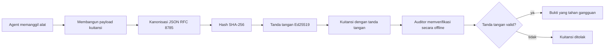
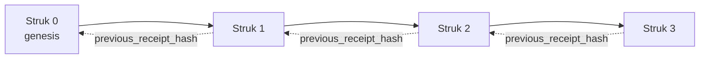

[Watch the lesson video: Mengamankan Agen AI dengan Tanda Terima Kriptografi](https://youtu.be/PLACEHOLDER_VIDEO_ID)

> _(Video pelajaran dan thumbnail akan ditambahkan oleh tim konten Microsoft setelah penggabungan, sesuai pola pelajaran 14 / 15.)_

# Mengamankan Agen AI dengan Tanda Terima Kriptografi

## Pendahuluan

Pelajaran ini akan membahas:

- Mengapa jejak audit untuk agen AI penting untuk kepatuhan, debugging, dan kepercayaan.
- Apa itu tanda terima kriptografi dan bagaimana bedanya dengan baris log yang tidak bertanda tangan.
- Cara menghasilkan tanda terima yang ditandatangani untuk panggilan alat agen dalam Python biasa.
- Cara memverifikasi tanda terima secara offline dan mendeteksi perubahan.
- Cara menghubungkan tanda terima sehingga penghapusan atau pengurutan ulang satu tanda terima merusak rantai.
- Apa yang dibuktikan oleh tanda terima dan apa yang secara eksplisit tidak dibuktikan.

## Tujuan Pembelajaran

Setelah menyelesaikan pelajaran ini, Anda akan mengetahui cara:

- Mengidentifikasi mode kegagalan yang memotivasi asal-usul kriptografi untuk tindakan agen.
- Menghasilkan tanda terima yang ditandatangani Ed25519 atas muatan JSON kanonik.
- Memverifikasi tanda terima secara mandiri menggunakan hanya kunci publik penanda tangan.
- Mendeteksi pemalsuan dengan menjalankan ulang verifikasi pada tanda terima yang dimodifikasi.
- Membangun urutan tanda terima berantai hash dan menjelaskan mengapa rantai itu penting.
- Mengenali batas antara apa yang dibuktikan tanda terima (atribusi, integritas, urutan) dan apa yang tidak dibuktikan (kebenaran tindakan, ketepatan kebijakan).

## Masalah: Jejak Audit Agen Anda

Bayangkan Anda telah menerapkan agen AI untuk Contoso Travel. Agen ini membaca permintaan pelanggan, memanggil API penerbangan untuk mencari opsi, dan memesan kursi atas nama pelanggan. Kuartal lalu, agen memproses 50.000 pemesanan.

Hari ini auditor datang. Mereka mengajukan pertanyaan sederhana: "Tunjukkan apa yang dilakukan agen Anda."

Anda menyerahkan file log. Auditor melihatnya dan mengajukan pertanyaan lebih sulit: "Bagaimana saya tahu log ini tidak diedit?"

Inilah masalah jejak audit. Sebagian besar penerapan agen hari ini bergantung pada:

- **Log aplikasi**: ditulis oleh agen itu sendiri, dapat diedit oleh siapa saja yang memiliki akses sistem berkas.
- **Layanan log cloud**: terbukti dapat dideteksi perubahan pada tingkat platform tetapi hanya jika auditor mempercayai operator platform.
- **Log transaksi database**: cocok untuk perubahan database tetapi tidak untuk panggilan alat sembarangan.

Tidak satu pun dari ini dapat menjawab pertanyaan auditor tanpa membuat auditor mempercayai seseorang (Anda, penyedia cloud Anda, vendor database Anda). Untuk penggunaan internal, kepercayaan itu sering diterima. Untuk beban kerja yang diatur (keuangan, kesehatan, apa pun yang tunduk pada EU AI Act), hal itu tidak bisa diterima.

Tanda terima kriptografi menyelesaikan ini dengan membuat setiap tindakan agen dapat diverifikasi secara mandiri. Auditor tidak perlu mempercayai Anda. Mereka hanya memerlukan kunci publik Anda dan tanda terima itu sendiri.

## Apa Itu Tanda Terima Kriptografi?

Tanda terima adalah objek JSON yang merekam apa yang dilakukan agen, ditandatangani dengan tanda tangan digital.



Tanda terima minimal terlihat seperti ini:

```json
{
  "type": "agent.tool_call.v1",
  "agent_id": "contoso-travel-bot",
  "tool_name": "lookup_flights",
  "tool_args_hash": "sha256:a3f9c1...",
  "result_hash": "sha256:7b2e1d...",
  "policy_id": "contoso-travel-policy-v3",
  "timestamp": "2026-04-25T14:30:00Z",
  "sequence": 47,
  "previous_receipt_hash": "sha256:9d4e6a...",
  "signature": {
    "alg": "EdDSA",
    "sig": "c5af83...",
    "public_key": "8f3b2c..."
  }
}
```

Tiga properti yang melakukan pekerjaan:

1. **Tanda tangan**. Tanda terima ditandatangani oleh gateway agen menggunakan kunci privat Ed25519. Siapa pun dengan kunci publik yang bersesuaian dapat memverifikasi tanda tangan secara offline. Mengubah bidang apa pun membuat tanda tangan tidak valid.

2. **Pengkodean kanonik**. Sebelum penandatanganan, tanda terima diserialisasi menggunakan JSON Canonicalization Scheme (JCS, RFC 8785). Ini memastikan bahwa dua implementasi yang menghasilkan tanda terima yang sama secara logis menghasilkan keluaran byte-identik. Tanpa kanonisasi, serializer JSON yang berbeda menghasilkan tanda tangan berbeda untuk konten yang sama.

3. **Rantai hash**. Bidang `previous_receipt_hash` menghubungkan setiap tanda terima ke tanda terima sebelumnya. Menghapus atau mengubah urutan tanda terima merusak setiap tanda terima yang datang setelahnya. Pemalsuan menjadi terlihat di tingkat rantai bahkan jika tanda tangan individu dilewati.

Ketiga properti ini memberikan tiga jaminan:

- **Atribusi**: kunci ini menandatangani konten ini.
- **Integritas**: konten tidak berubah sejak penandatanganan.
- **Pengurutan**: tanda terima ini datang setelah tanda terima tertentu dalam rantai.

## Menghasilkan Tanda Terima dalam Python

Anda tidak perlu perpustakaan khusus untuk menghasilkan tanda terima. Primitif kriptografi tersedia luas dan logikanya hanya beberapa puluh baris Python.

Latihan langsung di `code_samples/18-signed-receipts.ipynb` membimbing seluruh alur. Versi ringkas:

```python
import json
import hashlib
import base64
from nacl import signing
from jcs import canonicalize  # JSON kanonik RFC 8785

def b64url_nopad(data: bytes) -> str:
    return base64.urlsafe_b64encode(data).decode("ascii").rstrip("=")

def sha256_canonical(obj) -> str:
    """SHA-256 of a Python object's JCS-canonical JSON form."""
    return f"sha256:{hashlib.sha256(canonicalize(obj)).hexdigest()}"

# Hasilkan atau muat kunci tanda tangan (dalam produksi, simpan di brankas kunci)
signing_key = signing.SigningKey.generate()
verify_key = signing_key.verify_key

# Bangun payload tanda terima (belum ada tanda tangan)
tool_args = {"origin": "SYD", "destination": "LAX"}
tool_result = [{"flight": "QF11", "price": 1850, "stops": 0}]

payload = {
    "type": "agent.tool_call.v1",
    "agent_id": "contoso-travel-bot",
    "tool_name": "lookup_flights",
    "tool_args_hash": sha256_canonical(tool_args),
    "result_hash": sha256_canonical(tool_result),
    "policy_id": "contoso-travel-policy-v3",
    "timestamp": "2026-04-25T14:30:00Z",
    "sequence": 0,
    "previous_receipt_hash": None,
}

# Kanonisasikan, hash, tanda tangani.
canonical_bytes = canonicalize(payload)
message_hash = hashlib.sha256(canonical_bytes).digest()
signature_bytes = signing_key.sign(message_hash).signature

# Lampirkan objek tanda tangan terstruktur.
receipt = {
    **payload,
    "signature": {
        "alg": "EdDSA",
        "sig": b64url_nopad(signature_bytes),
        "public_key": b64url_nopad(bytes(verify_key)),
    },
}
```

Itu seluruh pipeline penandatanganan. Latihan di notebook membahas setiap langkah.

## Memverifikasi Tanda Terima dan Mendeteksi Pemalsuan

Verifikasi adalah operasi kebalikan:

```python
import base64
import hashlib
from nacl import signing
from nacl.exceptions import BadSignatureError
from jcs import canonicalize

def b64url_decode(s: str) -> bytes:
    padding = "=" * ((4 - len(s) % 4) % 4)
    return base64.urlsafe_b64decode(s + padding)

def verify_receipt(receipt: dict) -> bool:
    # Tanda tangan adalah objek terstruktur: {"alg", "sig", "public_key"}.
    sig_obj = receipt.get("signature")
    if not sig_obj or sig_obj.get("alg") != "EdDSA":
        return False

    # Rekonstruksi payload yang benar-benar ditandatangani (semua kecuali tanda tangan).
    payload = {k: v for k, v in receipt.items() if k != "signature"}

    canonical_bytes = canonicalize(payload)
    message_hash = hashlib.sha256(canonical_bytes).digest()

    try:
        verify_key = signing.VerifyKey(b64url_decode(sig_obj["public_key"]))
        verify_key.verify(message_hash, b64url_decode(sig_obj["sig"]))
        return True
    except BadSignatureError:
        return False
```

Fungsi ini menerima tanda terima dan mengembalikan `True` jika tanda tangan valid, `False` jika tidak. Tanpa panggilan jaringan, tanpa ketergantungan layanan, tanpa kepercayaan pada pihak ketiga.

Untuk melihat deteksi pemalsuan beraksi, notebook membahas:

1. Menghasilkan tanda terima valid dan mengonfirmasi verifikasi.
2. Memodifikasi satu byte pada bidang `tool_args_hash`.
3. Menjalankan ulang verifikasi dan melihat kegagalan.

Ini adalah demonstrasi praktis bahwa tanda terima dapat mendeteksi pemalsuan: modifikasi apa pun, sekecil apa pun, merusak tanda tangan.

## Menghubungkan Tanda Terima untuk Agen Multi-Langkah

Satu tanda terima yang ditandatangani melindungi satu tindakan. Rangkaian tanda terima melindungi urutan.



Setiap tanda terima merekam hash dari tanda terima sebelumnya. Untuk menghapus tanda terima 2 secara diam-diam, penyerang harus:

- Mengubah bidang `previous_receipt_hash` pada tanda terima 3 (merusak tanda tangan tanda terima 3), ATAU
- Memalsukan tanda tangan baru pada tanda terima 3 yang dimodifikasi (memerlukan kunci privat agen).

Jika kunci privat berada di brankas kunci perangkat keras dan Anda mempublikasikan kunci publik bersama setiap tanda terima, kedua serangan itu tidak mungkin dilakukan tanpa terdeteksi.

Notebook membahas:

1. Membangun rantai tiga tanda terima.
2. Memverifikasi bahwa setiap `previous_receipt_hash` tanda terima cocok dengan hash aktual tanda terima sebelumnya.
3. Memalsukan satu tanda terima di tengah dan melihat rantai rusak tepat pada titik itu.

Begitulah cara Anda membuat jejak audit yang dapat diverifikasi auditor eksternal tanpa harus mempercayai Anda.

## Apa yang Dibuktikan oleh Tanda Terima (dan Apa yang Tidak)

Ini adalah bagian terpenting dalam pelajaran ini. Tanda terima kuat tetapi kekuatannya terbatas.

**Tanda terima membuktikan tiga hal:**

1. **Atribusi**: kunci tertentu menandatangani muatan tertentu.
2. **Integritas**: muatan tidak berubah sejak penandatanganan.
3. **Pengurutan**: tanda terima ini datang setelah tanda terima lain dalam rantai hash.

**Tanda terima TIDAK membuktikan:**

1. **Kebenaran**: bahwa tindakan agen adalah tindakan yang benar. Tanda terima dapat ditandatangani untuk jawaban yang salah sama rapihnya dengan jawaban yang benar.
2. **Kepatuhan kebijakan**: bahwa kebijakan yang disebut di `policy_id` benar-benar dievaluasi, atau bahwa kebijakan itu akan mengizinkan tindakan ini jika diperiksa. Tanda terima merekam klaim, bukan penegakan.
3. **Identitas selain kunci**: tanda terima mengatakan "kunci ini menandatangani konten ini." Tidak mengatakan "manusia ini mengotorisasi ini." Menghubungkan kunci ke orang atau organisasi memerlukan infrastruktur identitas terpisah (direktori, registri kunci publik, dll.).
4. **Kejujuran input**: jika agen menerima prompt yang dimanipulasi dan bertindak atasnya, tanda terima dengan setia merekam tindakan itu. Tanda terima adalah proses lanjutan dari validasi input, bukan penggantinya.

Batas ini penting karena dua alasan:

- Menjelaskan untuk apa tanda terima berguna: membuat perilaku agen dapat diaudit dan sulit dipalsukan, bahkan lintas batas organisasi.
- Menjelaskan lapisan tambahan yang masih dibutuhkan: validasi input (Pelajaran 6), penegakan kebijakan (dibahas singkat di bawah), dan infrastruktur identitas (di luar cakupan pelajaran ini).

Kesalahan umum adalah menganggap "kami punya tanda terima" berarti "kami diawasi dengan baik." Tidak benar. Tanda terima adalah fondasi. Tata kelola adalah sistem yang Anda bangun di atasnya.

## Referensi Produksi

Kode Python dalam pelajaran ini sengaja dibuat minimal agar Anda bisa membaca setiap baris dan memahami secara tepat apa yang terjadi. Dalam produksi, Anda punya dua opsi:

1. **Bangun langsung dengan primitif kriptografi.** 50 baris kode yang Anda lihat di atas cukup untuk banyak kasus penggunaan. PyNaCl (Ed25519) dan paket `jcs` (JSON kanonik) adalah perpustakaan yang terawat dan diaudit dengan baik.

2. **Gunakan perpustakaan tanda terima produksi.** Beberapa proyek open-source menerapkan pola yang sama dengan fitur tambahan (rotasi kunci, verifikasi batch, distribusi JWK Set, integrasi dengan mesin kebijakan):
   - Format tanda terima yang digunakan dalam pelajaran ini mengikuti IETF Internet-Draft (`draft-farley-acta-signed-receipts`) yang saat ini dalam proses standar.
   - Microsoft Agent Governance Toolkit menggabungkan tanda terima dengan keputusan kebijakan berbasis Cedar; lihat Tutorial 33 di repositori tersebut untuk contoh ujung-ke-ujung.
   - Paket `protect-mcp` (npm) dan `@veritasacta/verify` (npm) menyediakan implementasi Node untuk penandatanganan tanda terima dan verifikasi offline, ditujukan untuk membungkus server MCP dengan jejak audit yang sulit dipalsukan.
   - SDK Python **[nobulex](https://github.com/arian-gogani/nobulex)** (`pip install nobulex`) menyediakan pola penandatanganan Ed25519 + JCS yang sama dalam Python dengan integrasi LangChain dan CrewAI, termasuk vektor uji silang yang dipublikasikan dan peta kepatuhan yang disumbangkan melalui [OWASP PR #2210](https://github.com/OWASP/CheatSheetSeries/pull/2210).

Keputusan antara membuat sendiri dan menggunakan perpustakaan sebanding dengan keputusan antara menulis perpustakaan JWT Anda sendiri dan menggunakan yang telah diuji: keduanya masuk akal; perpustakaan menghemat waktu dan mengurangi permukaan audit; pendekatan dari nol memaksa Anda memahami setiap primitif. Pelajaran ini mengajarkan cara dari nol sehingga Anda punya dasar untuk memilih salah satu.

## Uji Pengetahuan

Uji pemahaman Anda sebelum melanjutkan ke latihan praktik.

**1. Sebuah tanda terima ditandatangani dengan kunci privat Ed25519 agen. Auditor hanya memiliki kunci publik. Apakah auditor dapat memverifikasi tanda terima secara offline?**

<details>
<summary>Jawaban</summary>

Ya. Verifikasi Ed25519 hanya memerlukan kunci publik dan byte yang ditandatangani. Tanpa panggilan jaringan, tanpa ketergantungan layanan. Ini adalah properti yang membuat tanda terima berguna di lingkungan audit air-gapped, multi-organisasi, atau yang kepercayaannya rendah.
</details>

**2. Penyerang mengubah bidang `policy_id` tanda terima untuk mengklaim bahwa itu diatur oleh kebijakan yang lebih permisif. Tanda tangan adalah atas muatan asli. Apa yang terjadi saat verifikasi?**

<details>
<summary>Jawaban</summary>

Verifikasi gagal. Tanda tangan dihitung atas byte kanonik muatan asli; mengubah bidang apa pun mengubah byte kanonik, yang mengubah hash SHA-256, menjadikan tanda tangan tidak valid. Penyerang memerlukan kunci privat untuk membuat tanda tangan baru yang valid, yang tidak mereka miliki.
</details>

**3. Mengapa tanda terima menyertakan `tool_args_hash` dan `result_hash` daripada argumen mentah dan hasilnya?**

<details>
<summary>Jawaban</summary>

Dua alasan. Pertama, tanda terima mungkin perlu diarsipkan atau dikirim di lingkungan di mana bocornya konten mentah (PII, data bisnis) menjadi masalah. Hash menjaga tanda terima kecil dan konten tetap privat; auditor memverifikasi bahwa hash cocok dengan salinan terpisah dari konten sebenarnya. Kedua, hash memiliki ukuran tetap; tanda terima dengan hash memiliki ukuran terbatas tanpa tergantung besar kecilnya input dan output.
</details>

**4. Bidang `previous_receipt_hash` menghubungkan setiap tanda terima dengan pendahulunya. Jika seorang penyerang diam-diam menghapus satu tanda terima di tengah rantai, apa yang menjadi tidak valid?**

<details>
<summary>Jawaban</summary>

Setiap tanda terima yang datang setelah tanda terima yang dihapus. Bidang `previous_receipt_hash` mereka tidak lagi cocok dengan rantai sebenarnya (karena tanda terima yang dirujuk tidak ada, atau rantai sekarang menunjuk ke pendahulu berbeda). Untuk menyembunyikan penghapusan, penyerang harus menandatangani ulang setiap tanda terima berikutnya, yang memerlukan kunci privat.
</details>

**5. Sebuah tanda terima terverifikasi bersih. Apakah itu membuktikan tindakan agen benar, wajar, atau sesuai dengan kebijakan?**

<details>
<summary>Jawaban</summary>

Tidak. Tanda terima yang valid membuktikan tiga hal: atribusi (kunci ini menandatangani konten ini), integritas (konten tidak berubah), dan pengurutan (tanda terima ini datang setelah tanda terima lain). Itu TIDAK membuktikan bahwa tindakan benar, bahwa kebijakan di `policy_id` benar-benar dievaluasi, atau agen mengikuti setiap aturan. Tanda terima membuat perilaku agen dapat diaudit, bukan pasti benar. Ini adalah batas terpenting dalam pelajaran.
</details>

## Latihan Praktik

Buka `code_samples/18-signed-receipts.ipynb` dan selesaikan keempat bagian:

1. **Bagian 1**: Tandatangani tanda terima pertama Anda dan verifikasi.
2. **Bagian 2**: Memalsukan tanda terima dan amati kegagalan verifikasi.
3. **Bagian 3**: Bangun rantai tiga tanda terima dan verifikasi integritas rantai.
4. **Bagian 4**: Terapkan pola pada agen yang dibangun dengan Microsoft Agent Framework: bungkus panggilan alat dengan penandatanganan tanda terima, lalu verifikasi tanda terima secara mandiri.
**Tantangan lanjutan 1:** perpanjang skema tanda terima dengan bidang tambahan pilihan Anda sendiri (misalnya, ID permintaan untuk pelacakan), perbarui logika penandatanganan kanonik untuk menyertakannya, dan pastikan tanda terima tetap dapat di-verifikasi secara bolak-balik. Kemudian ubah bidang tersebut setelah penandatanganan dan pastikan verifikasi gagal. Ini memaksa Anda untuk memahami bagaimana setiap byte dari pengodean kanonik berkontribusi pada tanda tangan.

**Tantangan lanjutan 2:** hash SHA-256 dua tanda terima Anda bersama-sama (gabungkan byte kanoniknya dalam urutan deterministik) dan sematkan hasil digest sebagai bidang baru pada tanda terima ketiga sebelum menandatanganinya. Verifikasi bahwa ketiga tanda terima masih dapat di-verifikasi bolak-balik. Anda baru saja membangun bukti inklusi satu langkah: siapa saja yang memegang tanda terima ketiga dapat membuktikan bahwa dua tanda terima pertama ada saat tanda terima ketiga ditandatangani, tanpa perlu mengungkap isi mereka. Ini adalah pola yang digunakan tanda terima pengungkapan selektif dalam skala besar (komitmen Merkle, RFC 6962).

## Kesimpulan

Tanda terima kriptografi memberikan agen AI jejak audit yang:

- **Dapat diverifikasi secara mandiri**: siapa pun dengan kunci publik dapat memverifikasi, tanpa ketergantungan layanan.
- **Bukti pengubahan**: setiap modifikasi membatalkan tanda tangan.
- **Portabel**: tanda terima adalah file JSON kecil; dapat diarsipkan, dikirim, dan diverifikasi di mana saja.
- **Sesuai standar**: dibangun di atas Ed25519 (RFC 8032), JCS (RFC 8785), dan SHA-256, semua merupakan primitif yang banyak digunakan.

Mereka bukan pengganti untuk validasi input, penegakan kebijakan, atau infrastruktur identitas. Mereka adalah fondasi untuk lapisan-lapisan tersebut. Saat Anda menerapkan agen dalam beban kerja yang diatur, alur kerja multi-organisasi, atau lingkungan di mana auditor masa depan tidak dapat diasumsikan mempercayai Anda, tanda terima adalah cara Anda membuat jejak audit yang jujur.

Poin terpenting: tanda terima membuktikan siapa yang mengatakan apa, kapan. Mereka tidak membuktikan bahwa apa yang dikatakan itu benar atau tepat. Pegang perbedaan itu dengan tegas. Ini adalah perbedaan antara sistem asal usul yang jujur dan yang menyesatkan.

## Daftar Periksa Produksi

Saat Anda siap lulus dari pelajaran ini untuk menerapkan agen bertanda terima dalam lingkungan nyata:

- [ ] **Pindahkan kunci penandatanganan dari laptop pengembang.** Gunakan Azure Key Vault, AWS KMS, atau modul keamanan perangkat keras. Kunci privat yang menandatangani tanda terima Anda tidak boleh pernah tersimpan di kontrol sumber atau dalam bentuk teks biasa di mesin aplikasi.
- [ ] **Publikasikan kunci publik verifikasi.** Auditor membutuhkannya untuk memverifikasi secara offline. Pola standar adalah Set JWK di URL yang dikenal (RFC 7517), misalnya `https://your-org.example.com/.well-known/agent-keys.json`.
- [ ] **Tancapkan rantai secara eksternal.** Secara berkala tulis hash kepala rantai terbaru ke log transparansi (Sigstore Rekor, otoritas waktu RFC 3161, atau sistem internal kedua) agar pihak eksternal dapat mengonfirmasi "rantai ini ada pada waktu ini."
- [ ] **Simpan tanda terima secara tidak dapat diubah.** Penyimpanan blob yang hanya dapat ditambah (Azure Storage dengan kebijakan ketidakberubahan, AWS S3 Object Lock) mencegah orang dalam mengubah sejarah di lapisan penyimpanan.
- [ ] **Tentukan kebijakan retensi.** Banyak rezim kepatuhan mengharuskan retensi multi-tahun. Rencanakan pertumbuhan tanda terima (setiap tanda terima sekitar 500 byte; agen yang melakukan 10K panggilan per hari menghasilkan sekitar 1,8 GB per tahun).
- [ ] **Dokumentasikan apa yang tidak dicakup tanda terima.** Tanda terima membuktikan atribusi, integritas, dan urutan. Buku panduan Anda harus dengan jelas mencantumkan kontrol tambahan apa (validasi input, penegakan kebijakan, pembatasan laju, infrastruktur identitas) yang berdampingan dengan tanda terima dalam postur tata kelola Anda.

### Punya Pertanyaan Lebih Lanjut tentang Mengamankan Agen AI?

Bergabunglah dengan [Microsoft Foundry Discord](https://aka.ms/ai-agents/discord) untuk bertemu dengan pelajar lain, menghadiri jam kantor, dan mendapatkan jawaban atas pertanyaan Agen AI Anda.

## Lebih Lanjut dari Pelajaran Ini

Pelajaran ini mencakup penandatanganan tanda terima tunggal dan urutan rantai hash. Primitif yang sama menyusun beberapa pola lanjutan lain yang mungkin Anda temui saat postur tata kelola Anda berkembang:

- **Pengungkapan selektif.** Saat bidang tanda terima dikomit secara independen (pohon Merkle gaya RFC 6962), Anda dapat mengungkap bidang tertentu kepada auditor tertentu dan membuktikan sisanya tidak berubah tanpa mengeksposnya. Berguna ketika tanda terima yang sama harus memenuhi audit komprehensif (yang menginginkan kelengkapan) dan regulasi minimisasi data seperti GDPR (yang menginginkan auditor melihat sesedikit mungkin).
- **Pencabutan tanda terima.** Jika kunci penandatanganan dikompromikan, Anda butuh cara menandai semua tanda terima yang ditandatangani dengan kunci itu sebagai tidak terpercaya dari titik waktu tertentu ke depan. Pola standar: kunci penandatanganan berdurasi pendek plus daftar pencabutan yang dipublikasikan, atau log transparansi dengan entri pencabutan.
- **Tanda terima tanda tangan bilateral / terpisah.** Beberapa implementasi memisahkan payload yang ditandatangani menjadi setengah sebelum eksekusi (`authorization_*`) dan sesudah eksekusi (`result_*`) dengan tanda tangan independen, berguna saat keputusan otorisasi dan hasil yang diamati diproduksi oleh aktor berbeda atau waktu berbeda. Ini menyusun secara aditif di atas format tanda terima yang diajarkan dalam pelajaran ini.
- **Komposisi payload.** Tanda terima menyegel byte apa pun yang Anda letakkan dalam `result_hash`. Payload dunia nyata seringkali lebih kaya daripada hasil panggilan alat tunggal: penalaran pra-keputusan (prediksi model, opsi yang dipertimbangkan, bukti dan kelengkapannya, postur risiko, rantai akuntabilitas, hasil gerbang) semuanya bisa berada di dalam payload, disegel oleh satu tanda terima. Ini menjaga format tanda terima minimal sambil memungkinkan evolusi skema payload domain per domain.
- **Kesesuaian antar-implementasi.** Beberapa implementasi independen dari format tanda terima yang sama (Python, TypeScript, Rust, Go) saling memverifikasi terhadap vektor uji bersama. Jika Anda membuat implementasi sendiri, validasi terhadap vektor yang diterbitkan mengonfirmasi kompatibilitas protokol.
- **Migrasi pasca-kuantum.** Ed25519 banyak digunakan sekarang tetapi tidak kebal kuantum. Format tanda terima bersifat algoritma-agile: bidang `signature.alg` dapat memuat `ML-DSA-65` (standar tanda tangan pasca-kuantum NIST) saat Anda perlu bermigrasi. Rencanakan periode transisi di mana tanda terima ditandatangani ganda.

## Sumber Daya Tambahan

- <a href="https://datatracker.ietf.org/doc/draft-farley-acta-signed-receipts/" target="_blank">IETF Internet-Draft: Tanda Terima Keputusan Bertanda untuk Kontrol Akses Mesin ke Mesin</a>
- <a href="https://learn.microsoft.com/azure/ai-studio/responsible-use-of-ai-overview" target="_blank">Ikhtisar AI Bertanggung Jawab (Azure AI)</a>
- <a href="https://datatracker.ietf.org/doc/html/rfc8032" target="_blank">RFC 8032: Algoritma Tanda Tangan Digital Kurva Edwards (EdDSA)</a>
- <a href="https://datatracker.ietf.org/doc/html/rfc8785" target="_blank">RFC 8785: Skema Kanonisasi JSON (JCS)</a>
- <a href="https://datatracker.ietf.org/doc/html/rfc6962" target="_blank">RFC 6962: Transparansi Sertifikat</a> (Konstruksi pohon Merkle yang digunakan oleh tanda terima pengungkapan selektif)
- <a href="https://github.com/microsoft/agent-governance-toolkit/blob/main/docs/tutorials/33-offline-verifiable-receipts.md" target="_blank">Microsoft Agent Governance Toolkit, Tutorial 33: Tanda Terima Keputusan yang Bisa Diverifikasi Offline</a>
- <a href="https://github.com/ScopeBlind/agent-governance-testvectors" target="_blank">Vektor uji kesesuaian antarimplementasi</a> untuk format tanda terima yang digunakan dalam pelajaran ini (Apache-2.0)
- <a href="https://pynacl.readthedocs.io/" target="_blank">Dokumentasi PyNaCl</a> (Ed25519 dalam Python)

## Pelajaran Sebelumnya

[Membangun Agen Pengguna Komputer (CUA)](../15-browser-use/README.md)

## Pelajaran Berikutnya

_(Akan ditentukan oleh pemelihara kurikulum)_

---

<!-- CO-OP TRANSLATOR DISCLAIMER START -->
**Penafian**:
Dokumen ini telah diterjemahkan menggunakan layanan terjemahan AI [Co-op Translator](https://github.com/Azure/co-op-translator). Meskipun kami berupaya untuk mencapai akurasi, harap diketahui bahwa terjemahan otomatis mungkin mengandung kesalahan atau ketidakakuratan. Dokumen asli dalam bahasa aslinya harus dianggap sebagai sumber yang sah. Untuk informasi penting, disarankan menggunakan terjemahan profesional oleh manusia. Kami tidak bertanggung jawab atas kesalahpahaman atau penafsiran yang keliru yang timbul dari penggunaan terjemahan ini.
<!-- CO-OP TRANSLATOR DISCLAIMER END -->