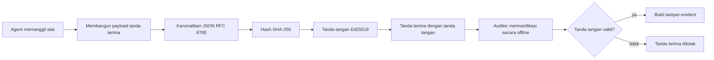
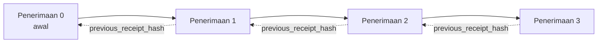

[Watch the lesson video: Mengamankan Agen AI dengan Resi Kriptografi](https://youtu.be/PLACEHOLDER_VIDEO_ID)

> _(Video pelajaran dan thumbnail akan ditambahkan oleh tim konten Microsoft setelah penggabungan, sesuai pola pelajaran 14 / 15.)_

# Mengamankan Agen AI dengan Resi Kriptografi

## Pendahuluan

Pelajaran ini akan membahas:

- Mengapa jejak audit untuk agen AI penting untuk kepatuhan, debugging, dan kepercayaan.
- Apa itu resi kriptografi dan bagaimana bedanya dengan baris log yang tidak ditandatangani.
- Cara membuat resi bertanda tangan untuk panggilan alat agen dalam Python biasa.
- Cara memverifikasi resi secara offline dan mendeteksi pemalsuan.
- Cara menghubungkan rantai resi sehingga menghapus atau mengubah urutan salah satunya akan merusak rantai.
- Apa yang dibuktikan oleh resi dan apa yang secara eksplisit tidak dibuktikan.

## Tujuan Pembelajaran

Setelah menyelesaikan pelajaran ini, Anda akan tahu bagaimana untuk:

- Mengidentifikasi mode kegagalan yang memotivasi asal-usul kriptografi untuk tindakan agen.
- Membuat resi yang ditandatangani Ed25519 atas muatan JSON kanonik.
- Memverifikasi resi secara mandiri menggunakan hanya kunci publik penandatangan.
- Mendeteksi pemalsuan dengan menjalankan kembali verifikasi pada resi yang dimodifikasi.
- Membangun urutan resi yang terhubung melalui hash dan menjelaskan mengapa rantai itu penting.
- Mengenali batas antara apa yang dibuktikan oleh resi (atribusi, integritas, pengurutan) dan apa yang tidak dibuktikan (kebenaran tindakan, ketepatan kebijakan).

## Masalah: Jejak Audit Agen Anda

Bayangkan Anda telah menerapkan agen AI untuk Contoso Travel. Agen tersebut membaca permintaan pelanggan, memanggil API penerbangan untuk mencari opsi, dan memesan kursi atas nama pelanggan. Kuartal lalu, agen memproses 50.000 pemesanan.

Hari ini datang seorang auditor. Mereka bertanya pertanyaan sederhana: "Tunjukkan apa yang dilakukan agen Anda."

Anda menyerahkan file log Anda. Auditor melihatnya dan mengajukan pertanyaan yang lebih sulit: "Bagaimana saya tahu log ini tidak diedit?"

Ini adalah masalah jejak audit. Sebagian besar penerapan agen hari ini bergantung pada:

- **Log aplikasi**: ditulis oleh agen itu sendiri, bisa diedit oleh siapa saja yang memiliki akses sistem file.
- **Layanan logging cloud**: tahan terhadap pemalsuan di tingkat platform tetapi hanya jika auditor mempercayai penyedia platform.
- **Log transaksi basis data**: cocok untuk perubahan basis data tetapi tidak untuk panggilan alat sewenang-wenang.

Tidak satu pun dari ini bisa menjawab pertanyaan auditor tanpa mengharuskan auditor mempercayai seseorang (Anda, penyedia cloud Anda, vendor basis data Anda). Untuk penggunaan internal, kepercayaan itu sering dapat diterima. Untuk beban kerja yang diatur (keuangan, kesehatan, apapun yang tunduk pada Undang-undang AI UE), tidak demikian.

Resi kriptografi menyelesaikan ini dengan membuat setiap tindakan agen dapat diverifikasi secara mandiri. Auditor tidak perlu mempercayai Anda. Mereka hanya memerlukan kunci publik Anda dan resi itu sendiri.

## Apa itu Resi Kriptografi?

Resi adalah objek JSON yang merekam apa yang dilakukan agen, ditandatangani dengan tanda tangan digital.



Resi minimal terlihat seperti ini:

```json
{
  "type": "agent.tool_call.v1",
  "agent_id": "contoso-travel-bot",
  "tool_name": "lookup_flights",
  "tool_args_hash": "sha256:a3f9c1...",
  "result_hash": "sha256:7b2e1d...",
  "policy_id": "contoso-travel-policy-v3",
  "timestamp": "2026-04-25T14:30:00Z",
  "sequence": 47,
  "previous_receipt_hash": "sha256:9d4e6a...",
  "signature": {
    "alg": "EdDSA",
    "sig": "c5af83...",
    "public_key": "8f3b2c..."
  }
}
```

Tiga properti yang melakukan pekerjaan:

1. **Tanda tangan**. Resi ditandatangani oleh gateway agen menggunakan kunci privat Ed25519. Siapa saja dengan kunci publik yang sesuai dapat memverifikasi tanda tangan secara offline. Pemalsuan pada bidang apa pun akan membatalkan tanda tangan.

2. **Pengodean kanonik**. Sebelum menandatangani, resi diserialisasi menggunakan Skema Kanonisasi JSON (JCS, RFC 8785). Ini memastikan bahwa dua implementasi yang menghasilkan resi logis yang sama menghasilkan output byte-identik. Tanpa kanonisasi, serializer JSON berbeda akan menghasilkan tanda tangan berbeda untuk konten yang sama.

3. **Penghubungan hash**. Kolom `previous_receipt_hash` menghubungkan setiap resi ke yang sebelumnya. Menghapus atau mengubah urutan resi akan merusak setiap resi yang datang setelahnya. Pemalsuan menjadi terlihat pada tingkat rantai meskipun tanda tangan individual dilewati.

Ketiga properti ini bersama-sama memberikan tiga jaminan:

- **Atribusi**: kunci ini yang menandatangani konten ini.
- **Integritas**: konten tidak berubah sejak penandatanganan.
- **Pengurutan**: resi ini datang setelah resi itu dalam rantai.

## Membuat Resi dalam Python

Anda tidak memerlukan pustaka khusus untuk membuat resi. Primitif kriptografi tersedia secara luas dan logikanya hanya beberapa puluh baris Python.

Latihan langsung dalam `code_samples/18-signed-receipts.ipynb` membahas alur lengkap. Versi rangkuman:

```python
import json
import hashlib
import base64
from nacl import signing
from jcs import canonicalize  # RFC 8785 JSON kanonik

def b64url_nopad(data: bytes) -> str:
    return base64.urlsafe_b64encode(data).decode("ascii").rstrip("=")

def sha256_canonical(obj) -> str:
    """SHA-256 of a Python object's JCS-canonical JSON form."""
    return f"sha256:{hashlib.sha256(canonicalize(obj)).hexdigest()}"

# Hasilkan atau muat kunci tanda tangan (di produksi, simpan di gudang kunci)
signing_key = signing.SigningKey.generate()
verify_key = signing_key.verify_key

# Bangun muatan struk (belum ada tanda tangan)
tool_args = {"origin": "SYD", "destination": "LAX"}
tool_result = [{"flight": "QF11", "price": 1850, "stops": 0}]

payload = {
    "type": "agent.tool_call.v1",
    "agent_id": "contoso-travel-bot",
    "tool_name": "lookup_flights",
    "tool_args_hash": sha256_canonical(tool_args),
    "result_hash": sha256_canonical(tool_result),
    "policy_id": "contoso-travel-policy-v3",
    "timestamp": "2026-04-25T14:30:00Z",
    "sequence": 0,
    "previous_receipt_hash": None,
}

# Kanonkan, hash, tanda tangani.
canonical_bytes = canonicalize(payload)
message_hash = hashlib.sha256(canonical_bytes).digest()
signature_bytes = signing_key.sign(message_hash).signature

# Lampirkan objek tanda tangan terstruktur.
receipt = {
    **payload,
    "signature": {
        "alg": "EdDSA",
        "sig": b64url_nopad(signature_bytes),
        "public_key": b64url_nopad(bytes(verify_key)),
    },
}
```

Itulah keseluruhan pipeline penandatanganan. Latihan dalam notebook membahas setiap langkah.

## Memverifikasi Resi dan Mendeteksi Pemalsuan

Verifikasi adalah operasi kebalikan:

```python
import base64
import hashlib
from nacl import signing
from nacl.exceptions import BadSignatureError
from jcs import canonicalize

def b64url_decode(s: str) -> bytes:
    padding = "=" * ((4 - len(s) % 4) % 4)
    return base64.urlsafe_b64decode(s + padding)

def verify_receipt(receipt: dict) -> bool:
    # Tanda tangan adalah objek terstruktur: {"alg", "sig", "public_key"}.
    sig_obj = receipt.get("signature")
    if not sig_obj or sig_obj.get("alg") != "EdDSA":
        return False

    # Rekonstruksi payload yang sebenarnya ditandatangani (semua kecuali tanda tangan).
    payload = {k: v for k, v in receipt.items() if k != "signature"}

    canonical_bytes = canonicalize(payload)
    message_hash = hashlib.sha256(canonical_bytes).digest()

    try:
        verify_key = signing.VerifyKey(b64url_decode(sig_obj["public_key"]))
        verify_key.verify(message_hash, b64url_decode(sig_obj["sig"]))
        return True
    except BadSignatureError:
        return False
```

Fungsi ini menerima resi dan mengembalikan `True` jika tanda tangan valid, `False` jika tidak. Tidak ada panggilan jaringan, tidak ada ketergantungan layanan, tidak perlu mempercayai pihak ketiga manapun.

Untuk melihat deteksi pemalsuan dalam praktik, notebook membahas:

1. Membuat resi yang valid dan mengonfirmasi itu terverifikasi.
2. Memodifikasi satu byte pada kolom `tool_args_hash`.
3. Menjalankan ulang verifikasi dan melihatnya gagal.

Ini adalah demonstrasi praktis bahwa resi tahan pemalsuan: modifikasi apa pun, sekecil apa pun, merusak tanda tangan.

## Menghubungkan Rantai Resi untuk Agen Multi-Langkah

Satu resi bertanda tangan melindungi satu tindakan. Rantai resi melindungi sebuah urutan.



Setiap resi merekam hash dari resi sebelumnya. Untuk menghapus resi ke-2 secara diam-diam, penyerang harus:

- Memodifikasi kolom `previous_receipt_hash` pada resi ke-3 (merusak tanda tangan resi ke-3), ATAU
- Memalsukan tanda tangan baru pada resi ke-3 yang dimodifikasi (memerlukan kunci privat agen).

Jika kunci privat ada dalam tempat penyimpanan kunci perangkat keras dan Anda menerbitkan kunci publik dengan setiap resi, tidak ada serangan yang layak dilakukan tanpa terdeteksi.

Notebook membahas:

1. Membangun rantai tiga resi.
2. Memverifikasi bahwa `previous_receipt_hash` setiap resi cocok dengan hash aktual resi sebelumnya.
3. Memalsukan satu resi di tengah dan melihat rantai putus persis di titik itu.

Begitulah Anda membuat jejak audit yang dapat diverifikasi oleh auditor eksternal tanpa harus mempercayai Anda.

## Apa yang Dibuktikan Resi (dan Apa yang Tidak)

Ini adalah bagian terpenting dari pelajaran ini. Resi kuat tetapi kekuatannya terbatas.

**Resi membuktikan tiga hal:**

1. **Atribusi**: kunci tertentu menandatangani muatan tertentu.
2. **Integritas**: muatan tidak berubah sejak tanda tangan.
3. **Pengurutan**: resi ini datang setelah resi itu dalam rantai hash.

**Resi TIDAK membuktikan:**

1. **Kebenaran**: bahwa tindakan agen adalah tindakan yang benar. Resi dapat ditandatangani untuk jawaban yang salah sama bersihnya dengan jawaban yang benar.
2. **Kepatuhan kebijakan**: bahwa kebijakan yang dirujuk dalam `policy_id` benar-benar dievaluasi, atau bahwa kebijakan tersebut akan mengizinkan tindakan ini jika diperiksa. Resi merekam apa yang diklaim, bukan apa yang ditegakkan.
3. **Identitas selain dari kunci**: resi menyatakan "kunci ini menandatangani konten ini." Tidak menyatakan "manusia ini mengotorisasi ini." Menghubungkan kunci ke orang atau organisasi membutuhkan infrastruktur identitas terpisah (direktori, registri kunci publik, dll).
4. **Kebenaran input**: jika agen menerima prompt yang dimanipulasi dan bertindak atasnya, resi merekam tindakan itu dengan setia. Resi berada di bawah validasi input, bukan pengganti untuk itu.

Batas ini penting karena dua alasan:

- Memberitahu Anda untuk apa resi berguna: membuat perilaku agen dapat diaudit dan tahan pemalsuan, bahkan melintasi batas organisasi.
- Memberitahu Anda lapisan tambahan apa yang masih dibutuhkan: validasi input (Pelajaran 6), penegakan kebijakan (dibahas singkat di bawah), dan infrastruktur identitas (di luar lingkup pelajaran ini).

Kesalahan umum adalah menganggap bahwa "kita punya resi" berarti "kita diatur." Tidak demikian. Resi adalah fondasi. Tata kelola adalah sistem yang Anda bangun di atasnya.

## Referensi Produksi

Kode Python dalam pelajaran ini sengaja minimal agar Anda bisa membaca setiap baris dan memahami persis apa yang terjadi. Dalam produksi, Anda punya dua opsi:

1. **Membangun langsung pada primitif kriptografi.** 50 baris yang Anda lihat di atas sudah cukup untuk banyak kasus penggunaan. PyNaCl (Ed25519) dan paket `jcs` (JSON kanonik) adalah pustaka yang terawat baik dan diaudit.

2. **Menggunakan pustaka resi produksi.** Beberapa proyek open-source mengimplementasikan pola yang sama dengan fitur tambahan (rotasi kunci, verifikasi batch, distribusi JWK Set, integrasi dengan mesin kebijakan):
   - Format resi yang digunakan dalam pelajaran ini mengikuti IETF Internet-Draft (`draft-farley-acta-signed-receipts`) yang sedang diproses sebagai standar.
   - Microsoft Agent Governance Toolkit menggabungkan resi dengan keputusan kebijakan berbasis Cedar; lihat Tutorial 33 di repositori itu untuk contoh menyeluruh.
   - Paket `protect-mcp` (npm) dan `@veritasacta/verify` (npm) menyediakan implementasi Node untuk penandatanganan resi dan verifikasi offline, untuk membungkus server MCP mana pun dengan jejak audit tahan pemalsuan.

Keputusan antara membangun sendiri dan menggunakan pustaka mencerminkan keputusan antara menulis pustaka JWT sendiri dan menggunakan yang sudah teruji: keduanya masuk akal; pustaka menghemat waktu dan mengurangi permukaan audit; pendekatan dari nol memaksa Anda memahami setiap primitif. Pelajaran ini mengajarkan jalur dari nol sehingga Anda memiliki fondasi untuk kedua pilihan.

## Pemeriksaan Pengetahuan

Uji pemahaman Anda sebelum melanjutkan ke latihan praktik.

**1. Resi ditandatangani dengan kunci privat Ed25519 agen. Auditor hanya memiliki kunci publik. Bisakah auditor memverifikasi resi secara offline?**

<details>
<summary>Jawaban</summary>

Ya. Verifikasi Ed25519 hanya memerlukan kunci publik dan byte yang ditandatangani. Tidak perlu panggilan jaringan, tidak ada ketergantungan layanan. Ini adalah properti yang membuat resi berguna dalam lingkungan audit terisolasi, multi-organisasi, atau dengan tingkat kepercayaan rendah.
</details>

**2. Penyerang memodifikasi kolom `policy_id` resi untuk mengklaim bahwa tindakan diatur oleh kebijakan yang lebih permisif. Tanda tangan dibuat atas muatan asli. Apa yang terjadi saat verifikasi?**

<details>
<summary>Jawaban</summary>

Verifikasi gagal. Tanda tangan dibuat atas byte kanonik muatan asli; memodifikasi bidang apa pun mengubah byte kanonik, yang mengubah hash SHA-256, sehingga tanda tangan menjadi tidak valid. Penyerang harus memiliki kunci privat untuk membuat tanda tangan valid baru, yang tidak mereka miliki.
</details>

**3. Mengapa resi menyertakan `tool_args_hash` dan `result_hash` daripada argumen dan hasil mentah?**

<details>
<summary>Jawaban</summary>

Ada dua alasan. Pertama, resi mungkin perlu diarsipkan atau dikirim dalam lingkungan di mana kebocoran konten mentah (data pribadi, data bisnis) bermasalah. Hash menjaga resi kecil dan konten tetap privat; auditor memverifikasi bahwa hash cocok dengan salinan konten sebenarnya yang disimpan terpisah. Kedua, hash memiliki ukuran tetap; resi dengan hash terbatas ukurannya tidak peduli seberapa besar input dan output.
</details>

**4. Kolom `previous_receipt_hash` menghubungkan setiap resi ke pendahulunya. Jika penyerang secara diam-diam menghapus satu resi di tengah rantai, apa yang menjadi tidak valid?**

<details>
<summary>Jawaban</summary>

Setiap resi yang datang setelah resi yang dihapus. Kolom `previous_receipt_hash` mereka tidak lagi cocok dengan rantai aktual (karena resi yang mereka referensikan tidak ada, atau rantai sekarang menunjuk pada pendahulu berbeda). Untuk menyembunyikan penghapusan, penyerang harus menandatangani ulang setiap resi berikutnya, yang membutuhkan kunci privat.
</details>

**5. Resi selesai diverifikasi dengan bersih. Apakah itu membuktikan bahwa tindakan agen benar, tepat, atau patuh kebijakan?**

<details>
<summary>Jawaban</summary>

Tidak. Resi yang valid membuktikan tiga hal: atribusi (kunci ini menandatangani konten ini), integritas (konten tidak berubah), dan pengurutan (resi ini datang setelah resi itu). Resi TIDAK membuktikan bahwa tindakan itu benar, kebijakan dalam `policy_id` benar-benar dievaluasi, atau agen mengikuti semua aturan. Resi membuat perilaku agen dapat diaudit, bukan selalu benar. Ini adalah batas paling penting dalam pelajaran.
</details>

## Latihan Praktik

Buka `code_samples/18-signed-receipts.ipynb` dan selesaikan keempat bagian:

1. **Bagian 1**: Tandatangani resi pertama Anda dan verifikasi.
2. **Bagian 2**: Ubah resi dan amati verifikasi gagal.
3. **Bagian 3**: Bangun rantai tiga resi dan verifikasi integritas rantai.
4. **Bagian 4**: Terapkan pola pada agen yang dibangun dengan Microsoft Agent Framework: bungkus panggilan alat dengan penandatanganan resi, lalu verifikasi resi secara mandiri.

**Tantangan tambahan 1:** perpanjang skema resi dengan kolom tambahan pilihan Anda sendiri (misalnya, ID permintaan untuk pelacakan), perbarui logika penandatanganan kanonik untuk menyertakannya, dan pastikan resi masih dapat lolos verifikasi bolak-balik. Kemudian ubah kolom itu setelah tanda tangan dan pastikan verifikasi gagal. Ini memaksa Anda memahami bagaimana setiap byte pengodean kanonik berkontribusi pada tanda tangan.
**Tantangan Stretch 2:** SHA-256-hash dua tanda terima Anda bersama-sama (gabungkan byte kanonik mereka dalam urutan deterministik) dan sematkan ringkasan yang dihasilkan sebagai bidang baru pada tanda terima ketiga sebelum menandatanganinya. Verifikasi bahwa ketiga tanda terima tersebut masih dapat diproses bolak-balik. Anda baru saja membangun bukti inklusi satu langkah: siapa pun yang memegang tanda terima ketiga dapat membuktikan bahwa dua tanda terima pertama ada pada saat ditandatangani, tanpa perlu mengungkapkan isinya. Inilah pola yang digunakan tanda terima pengungkapan selektif dalam skala besar (komitmen Merkle, RFC 6962).

## Kesimpulan

Tanda terima kriptografis memberikan agen AI jejak audit yang:

- **Dapat diverifikasi secara independen**: pihak manapun dengan kunci publik dapat memverifikasi, tanpa ketergantungan layanan.
- **Tampak jika dirusak**: modifikasi apa pun akan membatalkan tanda tangan.
- **Portabel**: tanda terima adalah berkas JSON kecil; dapat diarsipkan, ditransmisikan, dan diverifikasi di mana saja.
- **Sesuai standar**: dibangun di atas Ed25519 (RFC 8032), JCS (RFC 8785), dan SHA-256, semua merupakan primitif yang digunakan luas.

Mereka bukan pengganti untuk validasi input, penegakan kebijakan, atau infrastruktur identitas. Mereka adalah fondasi untuk lapisan-lapisan tersebut. Ketika Anda menerapkan agen ke dalam beban kerja yang diatur, alur kerja multi-organisasi, atau pengaturan di mana auditor masa depan tidak dapat diasumsikan mempercayai Anda, tanda terima adalah cara Anda membuat jejak audit menjadi jujur.

Pengambilan poin paling penting: tanda terima membuktikan siapa yang mengatakan apa dan kapan. Mereka tidak membuktikan bahwa apa yang dikatakan itu benar atau tepat. Pegang perbedaan itu dengan ketat. Ini adalah perbedaan antara sistem asal-usul yang jujur dan yang menyesatkan.

## Daftar Periksa Produksi

Saat Anda siap untuk naik tingkat dari pelajaran ini ke mengerahkan agen yang ditandatangani tanda terima di lingkungan nyata:

- [ ] **Pindahkan kunci penandatanganan dari laptop pengembang.** Gunakan Azure Key Vault, AWS KMS, atau modul keamanan perangkat keras. Kunci privat yang menandatangani tanda terima Anda tidak boleh pernah disimpan di kontrol sumber atau dalam bentuk teks biasa di mesin aplikasi.
- [ ] **Publikasikan kunci publik verifikasi.** Auditor memerlukannya untuk memverifikasi secara offline. Pola standar adalah JWK Set di URL yang dikenal (RFC 7517), misalnya `https://your-org.example.com/.well-known/agent-keys.json`.
- [ ] **Tambatkan rantai secara eksternal.** Secara berkala tulis hash kepala rantai terbaru ke log transparansi (Sigstore Rekor, otoritas timestamp RFC 3161, atau sistem internal kedua) sehingga pihak eksternal dapat mengkonfirmasi "rantai ini ada pada waktu tersebut."
- [ ] **Simpan tanda terima secara tidak dapat diubah.** Penyimpanan blob hanya-tambah (Azure Storage dengan kebijakan imutabilitas, AWS S3 Object Lock) mencegah orang dalam mengubah sejarah di lapisan penyimpanan.
- [ ] **Putuskan tentang retensi.** Banyak rezim kepatuhan mengharuskan retensi bertahun-tahun. Rencanakan pertumbuhan tanda terima (setiap tanda terima sekitar 500 byte; agen yang melakukan 10 ribu panggilan per hari menghasilkan sekitar 1,8 GB per tahun).
- [ ] **Dokumentasikan apa yang tidak dicakup tanda terima.** Tanda terima membuktikan atribusi, integritas, dan urutan. Panduan operasi Anda harus secara eksplisit mencantumkan kontrol tambahan apa (validasi input, penegakan kebijakan, pembatasan laju, infrastruktur identitas) yang berdampingan dengan tanda terima dalam sikap tata kelola Anda.

### Punya Pertanyaan Lebih Lanjut tentang Mengamankan Agen AI?

Bergabunglah dengan [Microsoft Foundry Discord](https://aka.ms/ai-agents/discord) untuk bertemu dengan pelajar lain, menghadiri jam kantor, dan mendapatkan jawaban atas pertanyaan Agen AI Anda.

## Lebih Jauh dari Pelajaran Ini

Pelajaran ini mencakup penandatanganan tanda terima tunggal dan urutan berantai hash. Primitif yang sama menyusun beberapa pola lanjutan yang mungkin Anda temui seiring kematangan sikap tata kelola Anda:

- **Pengungkapan selektif.** Ketika bidang tanda terima dikomit secara independen (pohon Merkle gaya RFC 6962), Anda dapat mengungkap bidang tertentu kepada auditor tertentu dan membuktikan sisanya tidak berubah tanpa mengeksposnya. Berguna ketika tanda terima yang sama harus memenuhi audit komprehensif (yang menginginkan kelengkapan) dan peraturan minimisasi data seperti GDPR (yang ingin auditor melihat sesedikit mungkin).
- **Pencabutan tanda terima.** Jika kunci penandatanganan dikompromikan, Anda memerlukan cara untuk menandai semua tanda terima yang ditandatangani oleh kunci tersebut sebagai tidak terpercaya sejak waktu tertentu. Pola standar: kunci tanda tangan jangka pendek plus daftar pencabutan yang diterbitkan, atau log transparansi dengan entri pencabutan.
- **Tanda terima tanda tangan bilateral/belah.** Beberapa implementasi membagi payload yang ditandatangani menjadi setengah pra-eksekusi (`authorization_*`) dan setengah pasca-eksekusi (`result_*`) dengan tanda tangan independen, berguna ketika keputusan otorisasi dan hasil yang diamati dibuat oleh aktor berbeda atau pada waktu berbeda. Ini dapat disusun secara tambahan di atas format tanda terima yang diajarkan dalam pelajaran ini.
- **Komposisi payload.** Tanda terima menutup byte apa pun yang Anda letakkan di `result_hash`. Payload dunia nyata sering kali lebih kaya daripada hasil panggilan alat tunggal: penalaran pra-keputusan (prediksi model, opsi yang dipertimbangkan, bukti dan kelengkapannya, sikap risiko, rantai akuntabilitas, hasil gerbang) semua dapat hidup di dalam payload yang disegel oleh satu tanda terima. Ini menjaga format tanda terima minimal sembari memungkinkan skema payload berkembang per domain.
- **Konformansi lintas implementasi.** Beberapa implementasi mandiri dari format tanda terima yang sama (Python, TypeScript, Rust, Go) saling memverifikasi terhadap vektor uji bersama. Jika Anda membangun implementasi sendiri, validasi terhadap vektor yang diterbitkan memastikan kompatibilitas antar platform.
- **Migrasi pasca-kuantum.** Ed25519 banyak digunakan saat ini tapi tidak tahan kuantum. Format tanda terima bersifat algoritma-agil: bidang `signature.alg` dapat membawa `ML-DSA-65` (standar tanda tangan pasca-kuantum NIST) ketika Anda perlu melakukan migrasi. Rencanakan periode transisi di mana tanda terima ditandatangani ganda.

## Sumber Daya Tambahan

- <a href="https://datatracker.ietf.org/doc/draft-farley-acta-signed-receipts/" target="_blank">IETF Internet-Draft: Tanda Terima Keputusan yang Ditandatangani untuk Kontrol Akses Mesin-ke-Mesin</a>
- <a href="https://learn.microsoft.com/azure/ai-studio/responsible-use-of-ai-overview" target="_blank">Gambaran Umum AI Bertanggung Jawab (Azure AI)</a>
- <a href="https://datatracker.ietf.org/doc/html/rfc8032" target="_blank">RFC 8032: Algoritma Tanda Tangan Digital Kurva Edwards (EdDSA)</a>
- <a href="https://datatracker.ietf.org/doc/html/rfc8785" target="_blank">RFC 8785: Skema Kanonisasi JSON (JCS)</a>
- <a href="https://datatracker.ietf.org/doc/html/rfc6962" target="_blank">RFC 6962: Transparansi Sertifikat</a> (konstruk pohon Merkle yang digunakan oleh tanda terima pengungkapan selektif)
- <a href="https://github.com/microsoft/agent-governance-toolkit/blob/main/docs/tutorials/33-offline-verifiable-receipts.md" target="_blank">Microsoft Agent Governance Toolkit, Tutorial 33: Tanda Terima Keputusan yang Dapat Diverifikasi Secara Offline</a>
- <a href="https://github.com/ScopeBlind/agent-governance-testvectors" target="_blank">Vektor uji konformansi lintas implementasi</a> untuk format tanda terima yang digunakan dalam pelajaran ini (Apache-2.0)
- <a href="https://pynacl.readthedocs.io/" target="_blank">Dokumentasi PyNaCl</a> (Ed25519 di Python)

## Pelajaran Sebelumnya

[Building Computer Use Agents (CUA)](../15-browser-use/README.md)

## Pelajaran Selanjutnya

_(Akan ditentukan oleh pemelihara kurikulum)_

---

<!-- CO-OP TRANSLATOR DISCLAIMER START -->
**Penafian**:
Dokumen ini telah diterjemahkan menggunakan layanan terjemahan AI [Co-op Translator](https://github.com/Azure/co-op-translator). Meskipun kami berupaya untuk mencapai akurasi, harap diketahui bahwa terjemahan otomatis mungkin mengandung kesalahan atau ketidakakuratan. Dokumen asli dalam bahasa aslinya harus dianggap sebagai sumber yang sah. Untuk informasi penting, disarankan menggunakan terjemahan profesional oleh manusia. Kami tidak bertanggung jawab atas kesalahpahaman atau penafsiran yang keliru yang timbul dari penggunaan terjemahan ini.
<!-- CO-OP TRANSLATOR DISCLAIMER END -->