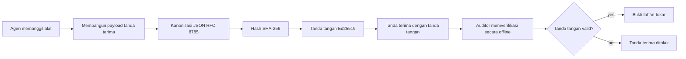
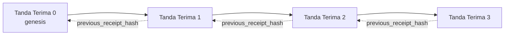

[Tonton video pelajaran: Mengamankan Agen AI dengan Tanda Terima Kriptografi](https://youtu.be/PLACEHOLDER_VIDEO_ID)

> _(Video pelajaran dan thumbnail akan ditambahkan oleh tim konten Microsoft setelah penggabungan, mengikuti pola pelajaran 14 / 15.)_

# Mengamankan Agen AI dengan Tanda Terima Kriptografi

## Pendahuluan

Pelajaran ini akan membahas:

- Mengapa jejak audit untuk agen AI penting untuk kepatuhan, debugging, dan kepercayaan.
- Apa itu tanda terima kriptografi dan bagaimana bedanya dengan baris log tanpa tanda tangan.
- Cara menghasilkan tanda terima bertanda tangan untuk panggilan alat agen dalam Python biasa.
- Cara memverifikasi tanda terima secara offline dan mendeteksi manipulasi.
- Cara menghubungkan tanda terima sehingga menghapus atau mengubah urutan salah satunya merusak rantai.
- Apa yang dibuktikan tanda terima dan apa yang secara eksplisit tidak dibuktikan.

## Tujuan Pembelajaran

Setelah menyelesaikan pelajaran ini, Anda akan tahu cara:

- Mengidentifikasi mode kegagalan yang memotivasi asal usul kriptografi untuk tindakan agen.
- Menghasilkan tanda terima bertanda tangan Ed25519 atas payload JSON kanonik.
- Memverifikasi tanda terima secara independen menggunakan hanya kunci publik penandatangan.
- Mendeteksi manipulasi dengan menjalankan ulang verifikasi pada tanda terima yang dimodifikasi.
- Membangun rangkaian tanda terima berantai hash dan menjelaskan mengapa rantai itu penting.
- Mengenali batas antara apa yang dibuktikan tanda terima (atribusi, integritas, pengurutan) dan apa yang tidak (kebenaran tindakan, keabsahan kebijakan).

## Masalah: Jejak Audit Agen Anda

Bayangkan Anda telah menerapkan agen AI untuk Contoso Travel. Agen tersebut membaca permintaan pelanggan, memanggil API penerbangan untuk mencari opsi, dan memesan kursi atas nama pelanggan. Kuartal lalu, agen memproses 50.000 pemesanan.

Hari ini seorang auditor datang. Mereka bertanya pertanyaan sederhana: "Tunjukkan apa yang telah dilakukan agen Anda."

Anda menyerahkan file log Anda. Auditor melihatnya dan mengajukan pertanyaan yang lebih sulit: "Bagaimana saya tahu log ini tidak diedit?"

Inilah masalah jejak audit. Kebanyakan penerapan agen saat ini mengandalkan:

- **Log aplikasi**: ditulis oleh agen itu sendiri, dapat diedit oleh siapa saja yang memiliki akses sistem file.
- **Layanan pencatatan cloud**: bukti manipulasi tingkat platform namun hanya jika auditor mempercayai operator platform.
- **Log transaksi basis data**: cocok untuk perubahan basis data tetapi tidak untuk panggilan alat arbitrer.

Tidak ada yang bisa menjawab pertanyaan auditor tanpa membuat auditor mempercayai seseorang (Anda, penyedia cloud Anda, vendor basis data Anda). Untuk penggunaan internal, kepercayaan itu sering dapat diterima. Untuk beban kerja yang diatur (keuangan, kesehatan, apa pun yang tunduk pada Undang-Undang AI UE), tidak demikian.

Tanda terima kriptografi menyelesaikan ini dengan membuat setiap tindakan agen dapat diverifikasi secara independen. Auditor tidak perlu mempercayai Anda. Mereka hanya membutuhkan kunci publik Anda dan tanda terimanya sendiri.

## Apa itu Tanda Terima Kriptografi?

Tanda terima adalah objek JSON yang merekam apa yang dilakukan agen, ditandatangani dengan tanda tangan digital.


```mermaid
flowchart LR
    A[Agen memanggil alat] --> B[Membangun payload tanda terima]
    B --> C[Kanonisasi JSON RFC 8785]
    C --> D[Hash SHA-256]
    D --> E[Tanda tangan Ed25519]
    E --> F[Tanda terima dengan tanda tangan]
    F --> G[Auditor memverifikasi secara offline]
    G --> H{Tanda tangan valid?}
    H -- yes --> I[Bukti tahan-tukar]
    H -- no --> J[Tanda terima ditolak]
```

Tanda terima minimal terlihat seperti ini:

```json
{
  "type": "agent.tool_call.v1",
  "agent_id": "contoso-travel-bot",
  "tool_name": "lookup_flights",
  "tool_args_hash": "sha256:a3f9c1...",
  "result_hash": "sha256:7b2e1d...",
  "policy_id": "contoso-travel-policy-v3",
  "timestamp": "2026-04-25T14:30:00Z",
  "sequence": 47,
  "previous_receipt_hash": "sha256:9d4e6a...",
  "signature": {
    "alg": "EdDSA",
    "sig": "c5af83...",
    "public_key": "8f3b2c..."
  }
}
```

Tiga properti yang menjalankan fungsi ini:

1. **Tanda tangan**. Tanda terima ditandatangani oleh gateway agen menggunakan kunci privat Ed25519. Siapa pun yang memiliki kunci publik terkait dapat memverifikasi tanda tangan secara offline. Manipulasi pada bidang apa pun membatalkan tanda tangan.

2. **Enkoding kanonik**. Sebelum menandatangani, tanda terima diserialisasi menggunakan Skema Kanonisasi JSON (JCS, RFC 8785). Ini memastikan bahwa dua implementasi yang menghasilkan tanda terima logis yang sama menghasilkan output byte-identik. Tanpa kanonisasi, serializer JSON yang berbeda akan menghasilkan tanda tangan berbeda untuk konten yang sama.

3. **Rantai hash**. Bidang `previous_receipt_hash` menghubungkan setiap tanda terima ke yang sebelumnya. Menghapus atau mengubah urutan tanda terima merusak setiap tanda terima berikutnya. Manipulasi menjadi terlihat pada level rantai meskipun tanda tangan per individu dapat dibypass.

Bersama-sama properti ini memberikan tiga jaminan:

- **Atribusi**: kunci ini menandatangani konten ini.
- **Integritas**: konten tidak berubah sejak penandatanganan.
- **Pengurutan**: tanda terima ini datang setelah tanda terima lain dalam rantai.

## Membuat Tanda Terima di Python

Anda tidak memerlukan perpustakaan khusus untuk membuat tanda terima. Primitif kriptografi tersedia luas dan logikanya hanya beberapa puluh baris Python.

Latihan praktis di `code_samples/18-signed-receipts.ipynb` berjalan melalui seluruh alur. Versi ringkasnya:

```python
import json
import hashlib
import base64
from nacl import signing
from jcs import canonicalize  # JSON kanonik RFC 8785

def b64url_nopad(data: bytes) -> str:
    return base64.urlsafe_b64encode(data).decode("ascii").rstrip("=")

def sha256_canonical(obj) -> str:
    """SHA-256 of a Python object's JCS-canonical JSON form."""
    return f"sha256:{hashlib.sha256(canonicalize(obj)).hexdigest()}"

# Hasilkan atau muat kunci penandatanganan (di produksi, simpan di brankas kunci)
signing_key = signing.SigningKey.generate()
verify_key = signing_key.verify_key

# Bangun muatan tanda terima (belum ada tanda tangan)
tool_args = {"origin": "SYD", "destination": "LAX"}
tool_result = [{"flight": "QF11", "price": 1850, "stops": 0}]

payload = {
    "type": "agent.tool_call.v1",
    "agent_id": "contoso-travel-bot",
    "tool_name": "lookup_flights",
    "tool_args_hash": sha256_canonical(tool_args),
    "result_hash": sha256_canonical(tool_result),
    "policy_id": "contoso-travel-policy-v3",
    "timestamp": "2026-04-25T14:30:00Z",
    "sequence": 0,
    "previous_receipt_hash": None,
}

# Kanonisasikan, hash, tanda tangani.
canonical_bytes = canonicalize(payload)
message_hash = hashlib.sha256(canonical_bytes).digest()
signature_bytes = signing_key.sign(message_hash).signature

# Lampirkan objek tanda tangan terstruktur.
receipt = {
    **payload,
    "signature": {
        "alg": "EdDSA",
        "sig": b64url_nopad(signature_bytes),
        "public_key": b64url_nopad(bytes(verify_key)),
    },
}
```

Itu adalah keseluruhan alur penandatanganan. Latihan dalam notebook membahas setiap langkah.

## Memverifikasi Tanda Terima dan Mendeteksi Manipulasi

Verifikasi adalah operasi invers:

```python
import base64
import hashlib
from nacl import signing
from nacl.exceptions import BadSignatureError
from jcs import canonicalize

def b64url_decode(s: str) -> bytes:
    padding = "=" * ((4 - len(s) % 4) % 4)
    return base64.urlsafe_b64decode(s + padding)

def verify_receipt(receipt: dict) -> bool:
    # Tanda tangan adalah objek terstruktur: {"alg", "sig", "public_key"}.
    sig_obj = receipt.get("signature")
    if not sig_obj or sig_obj.get("alg") != "EdDSA":
        return False

    # Rekonstruksi payload yang sebenarnya ditandatangani (semua kecuali tanda tangan).
    payload = {k: v for k, v in receipt.items() if k != "signature"}

    canonical_bytes = canonicalize(payload)
    message_hash = hashlib.sha256(canonical_bytes).digest()

    try:
        verify_key = signing.VerifyKey(b64url_decode(sig_obj["public_key"]))
        verify_key.verify(message_hash, b64url_decode(sig_obj["sig"]))
        return True
    except BadSignatureError:
        return False
```

Fungsi ini mengambil tanda terima dan mengembalikan `True` jika tanda tangan valid, `False` jika tidak. Tidak ada panggilan jaringan, tidak bergantung pada layanan, tanpa kebutuhan mempercayai pihak ketiga.

Untuk melihat deteksi manipulasi dalam praktik, notebook membahas:

1. Membuat tanda terima yang valid dan memastikan verifikasi berhasil.
2. Mengubah satu byte di bidang `tool_args_hash`.
3. Menjalankan ulang verifikasi dan melihatnya gagal.

Ini adalah demonstrasi praktis bahwa tanda terima tahan manipulasi: setiap modifikasi, sekecil apa pun, merusak tanda tangan.

## Menghubungkan Rantai Tanda Terima untuk Agen Multi-Langkah

Satu tanda terima bertanda tangan melindungi satu tindakan. Rangkaian tanda terima melindungi sebuah urutan.


```mermaid
flowchart LR
    R0[Tanda Terima 0<br/>genesis] --> R1[Tanda Terima 1]
    R1 --> R2[Tanda Terima 2]
    R2 --> R3[Tanda Terima 3]
    R1 -. previous_receipt_hash .-> R0
    R2 -. previous_receipt_hash .-> R1
    R3 -. previous_receipt_hash .-> R2
```

Setiap tanda terima merekam hash dari tanda terima sebelumnya. Untuk menghapus tanda terima 2 secara diam-diam, penyerang harus:

- Mengubah bidang `previous_receipt_hash` dari tanda terima 3 (merusak tanda tangan tanda terima 3), ATAU
- Membuat tanda tangan baru pada tanda terima 3 yang dimodifikasi (memerlukan kunci privat agen).

Jika kunci privat ada di dalam brankas kunci perangkat keras dan Anda mempublikasikan kunci publik dengan setiap tanda terima, kedua serangan tersebut tidak mungkin tanpa terdeteksi.

Notebook membahas:

1. Membangun rantai tiga tanda terima.
2. Memverifikasi bahwa `previous_receipt_hash` setiap tanda terima sesuai dengan hash aktual dari tanda terima sebelumnya.
3. Memanipulasi satu tanda terima di tengah dan melihat rantai rusak tepat pada titik itu.

Ini cara Anda membuat jejak audit yang auditor eksternal dapat verifikasi tanpa mempercayai Anda.

## Apa yang Dibuktikan Tanda Terima (dan Apa yang Tidak)

Ini adalah bagian terpenting dari pelajaran ini. Tanda terima sangat kuat tetapi kekuatannya terbatas.

**Tanda terima membuktikan tiga hal:**

1. **Atribusi**: kunci tertentu menandatangani payload tertentu.
2. **Integritas**: payload tidak berubah sejak penandatanganan.
3. **Pengurutan**: tanda terima ini datang setelah tanda terima lain dalam rantai hash.

**Tanda terima TIDAK membuktikan:**

1. **Kebenaran**: bahwa tindakan agen adalah tindakan yang benar. Tanda terima dapat ditandatangani untuk jawaban yang salah sama halusnya dengan jawaban yang benar.
2. **Kepatuhan kebijakan**: bahwa kebijakan yang dirujuk di `policy_id` benar-benar dievaluasi, atau bahwa kebijakan itu akan mengizinkan tindakan ini jika diperiksa. Tanda terima merekam apa yang diklaim, bukan apa yang ditegakkan.
3. **Identitas di luar kunci**: tanda terima mengatakan "kunci ini menandatangani konten ini." Tidak mengatakan "manusia ini mengotorisasi ini." Menghubungkan kunci dengan orang atau organisasi memerlukan infrastruktur identitas terpisah (direktori, registri kunci publik, dll.).
4. **Kejujuran input**: jika agen menerima prompt yang dimanipulasi dan bertindak berdasarkan itu, tanda terima merekam tindakan itu secara setia. Tanda terima adalah hasil dari validasi input, bukan penggantinya.

Batas ini penting karena dua alasan:

- Memberitahu Anda apa kegunaan tanda terima: membuat perilaku agen dapat diaudit dan tahan manipulasi, bahkan lintas batas organisasi.
- Memberitahu Anda lapisan tambahan apa yang masih Anda butuhkan: validasi input (Pelajaran 6), penegakan kebijakan (dibahas singkat di bawah), dan infrastruktur identitas (di luar cakupan pelajaran ini).

Kesalahan umum adalah mengira bahwa "kami punya tanda terima" berarti "kami diatur." Tidak demikian. Tanda terima adalah fondasi. Tata kelola adalah sistem yang Anda bangun di atasnya.

## Referensi Produksi

Kode Python dalam pelajaran ini sengaja minimal agar Anda bisa membaca setiap baris dan memahami apa yang terjadi. Dalam produksi, Anda punya dua opsi:

1. **Bangun langsung pada primitif kriptografi.** 50 baris yang Anda lihat di atas cukup untuk banyak kasus penggunaan. PyNaCl (Ed25519) dan paket `jcs` (JSON kanonik) adalah pustaka yang terawat dan diaudit dengan baik.

2. **Gunakan perpustakaan tanda terima produksi.** Beberapa proyek open-source mengimplementasikan pola yang sama dengan fitur tambahan (rotasi kunci, verifikasi batch, distribusi JWK Set, integrasi dengan mesin kebijakan):
   - Format tanda terima yang digunakan di pelajaran ini mengikuti Internet-Draft IETF (`draft-farley-acta-signed-receipts`) yang saat ini dalam proses standar.
   - Microsoft Agent Governance Toolkit menggabungkan tanda terima dengan keputusan kebijakan berbasis Cedar; lihat Tutorial 33 di repositori tersebut untuk contoh ujung-ke-ujung.
   - Paket `protect-mcp` (npm) dan `@veritasacta/verify` (npm) menyediakan implementasi Node untuk penandatanganan tanda terima dan verifikasi offline, dimaksudkan untuk membungkus server MCP mana saja dengan jejak audit tahan manipulasi.
   - **[nobulex](https://github.com/arian-gogani/nobulex)** SDK Python (`pip install nobulex`) menyediakan pola penandatanganan Ed25519 + JCS yang sama di Python dengan integrasi LangChain dan CrewAI, termasuk vektor uji validasi silang yang dipublikasikan dan pemetaan kepatuhan yang disumbangkan via [OWASP PR #2210](https://github.com/OWASP/CheatSheetSeries/pull/2210).

Keputusan antara membuat sendiri dan menggunakan perpustakaan mencerminkan keputusan antara menulis perpustakaan JWT sendiri dan menggunakan yang telah diuji: keduanya masuk akal; perpustakaan menghemat waktu dan mengurangi permukaan audit; pendekatan dari awal memaksa Anda memahami setiap primitif. Pelajaran ini mengajarkan pendekatan dari awal sehingga Anda punya fondasi untuk kedua pilihan.

## Pemeriksaan Pengetahuan

Uji pemahaman Anda sebelum melanjutkan ke latihan praktik.

**1. Tanda terima ditandatangani dengan kunci privat Ed25519 agen. Auditor hanya memiliki kunci publik. Apakah auditor dapat memverifikasi tanda terima secara offline?**

<details>
<summary>Jawaban</summary>

Ya. Verifikasi Ed25519 hanya membutuhkan kunci publik dan byte yang ditandatangani. Tidak ada panggilan jaringan, tidak ada ketergantungan layanan. Ini adalah properti yang membuat tanda terima berguna dalam pengaturan audit udara-terisolasi, multi-organisasi, atau kepercayaan rendah.
</details>

**2. Penyerang memodifikasi bidang `policy_id` dari tanda terima untuk mengklaim bahwa itu diatur oleh kebijakan yang lebih permisif. Tanda tangan dibuat atas payload asli. Apa yang terjadi saat verifikasi?**

<details>
<summary>Jawaban</summary>

Verifikasi gagal. Tanda tangan dihitung atas byte kanonik dari payload asli; memodifikasi bidang apa pun mengubah byte kanonik, yang mengubah hash SHA-256, yang membuat tanda tangan tidak valid. Penyerang memerlukan kunci privat untuk membuat tanda tangan baru yang valid, yang tidak mereka miliki.
</details>

**3. Mengapa tanda terima menyertakan `tool_args_hash` dan `result_hash` daripada argumen dan hasil mentah?**

<details>
<summary>Jawaban</summary>

Dua alasan. Pertama, tanda terima mungkin perlu diarsipkan atau dikirimkan di lingkungan di mana bocornya konten mentah (PII, data bisnis) adalah masalah. Peng-hash membuat tanda terima kecil dan konten tetap privat; auditor memverifikasi bahwa hash cocok dengan salinan terpisah dari konten sebenarnya. Kedua, hash berukuran tetap; tanda terima dengan hash ukurannya terbatas terlepas dari besar input dan output.
</details>

**4. Bidang `previous_receipt_hash` menghubungkan setiap tanda terima ke pendahulunya. Jika penyerang menghapus satu tanda terima secara diam-diam dari tengah rantai, apa yang menjadi tidak valid?**

<details>
<summary>Jawaban</summary>

Setiap tanda terima setelah tanda terima yang dihapus. Bidang `previous_receipt_hash` mereka tidak lagi cocok dengan rantai aktual (karena tanda terima yang direferensikan sudah tidak ada, atau rantai sekarang menunjuk pada pendahulu yang berbeda). Untuk menyembunyikan penghapusan, penyerang harus menandatangani ulang setiap tanda terima berikutnya, yang memerlukan kunci privat.
</details>

**5. Tanda terima diverifikasi dengan bersih. Apakah itu membuktikan tindakan agen benar, masuk akal, atau mematuhi kebijakan?**

<details>
<summary>Jawaban</summary>

Tidak. Tanda terima valid membuktikan tiga hal: atribusi (kunci ini menandatangani konten ini), integritas (konten tidak berubah), dan pengurutan (tanda terima ini datang setelah tanda terima lain). Tanda terima TIDAK membuktikan bahwa tindakan itu benar, bahwa kebijakan yang disebut dalam `policy_id` benar-benar dievaluasi, atau bahwa agen mengikuti setiap aturan. Tanda terima membuat perilaku agen dapat diaudit, bukan selalu benar. Ini adalah batas paling penting dalam pelajaran.
</details>

## Latihan Praktik

Buka `code_samples/18-signed-receipts.ipynb` dan selesaikan keempat bagian:

1. **Bagian 1**: Tandatangani tanda terima pertama Anda dan verifikasi.
2. **Bagian 2**: Manipulasi tanda terima dan amati verifikasi gagal.
3. **Bagian 3**: Bangun rantai tiga tanda terima dan verifikasi integritas rantai.
4. **Bagian 4**: Terapkan pola ini pada agen yang dibangun dengan Microsoft Agent Framework: bungkus panggilan alat dengan penandatanganan tanda terima, lalu verifikasi tanda terima secara independen.


**Tantangan stretch 1:** perluas skema tanda terima dengan bidang tambahan pilihan Anda sendiri (misalnya, ID permintaan untuk penelusuran), perbarui logika penandatanganan kanonik untuk menyertakannya, dan konfirmasi bahwa tanda terima masih dapat berputar ulang melalui verifikasi. Kemudian modifikasi bidang setelah penandatanganan dan konfirmasi verifikasi gagal. Ini memaksa Anda untuk memahami bagaimana setiap byte dari pengkodean kanonik berkontribusi pada tanda tangan.

**Tantangan stretch 2:** SHA-256-hash dua tanda terima Anda bersama-sama (gabungkan byte kanonik mereka dalam urutan deterministik) dan sematkan digest yang dihasilkan sebagai bidang baru pada tanda terima ketiga sebelum menandatanganinya. Verifikasi bahwa ketiga tanda terima masih dapat berputar ulang. Anda baru saja membuat bukti inklusi satu langkah: siapa pun yang memegang tanda terima ketiga dapat membuktikan bahwa dua tanda terima pertama ada saat itu ditandatangani, tanpa perlu mengungkapkan isinya. Ini adalah pola yang digunakan tanda terima pengungkapan selektif secara skala (komitmen Merkle, RFC 6962).

## Kesimpulan

Tanda terima kriptografi memberikan agen AI jejak audit yang:

- **Dapat diverifikasi secara independen**: pihak mana pun dengan kunci publik dapat memverifikasi, tanpa ketergantungan layanan.
- **Tampak jika dirusak**: setiap modifikasi membatalkan tanda tangan.
- **Portabel**: tanda terima adalah file JSON kecil; dapat diarsipkan, dikirim, dan diverifikasi di mana saja.
- **Sesuai standar**: dibangun di atas Ed25519 (RFC 8032), JCS (RFC 8785), dan SHA-256, semua primitif yang banyak digunakan.

Mereka bukan pengganti validasi input, penegakan kebijakan, atau infrastruktur identitas. Mereka adalah fondasi untuk lapisan tersebut. Saat Anda menerapkan agen di beban kerja yang diatur, alur kerja multi-organisasi, atau pengaturan di mana auditor masa depan tidak dapat diasumsikan mempercayai Anda, tanda terima adalah cara Anda membuat jejak audit jujur.

Hal yang paling penting: tanda terima membuktikan siapa mengatakan apa, kapan. Mereka tidak membuktikan bahwa apa yang dikatakan benar atau tepat. Pegang perbedaan itu dengan erat. Ini adalah perbedaan antara sistem asal-usul yang jujur dan yang menyesatkan.

## Daftar Periksa Produksi

Saat Anda siap untuk naik kelas dari pelajaran ini ke penerapan agen bertanda terima di lingkungan nyata:

- [ ] **Pindahkan kunci penandatanganan dari laptop pengembang.** Gunakan Azure Key Vault, AWS KMS, atau modul keamanan perangkat keras. Kunci privat yang menandatangani tanda terima Anda tidak boleh pernah disimpan di kontrol sumber atau dalam teks jelas di mesin aplikasi.
- [ ] **Publikasikan kunci publik verifikasi.** Auditor membutuhkannya untuk verifikasi offline. Pola standar adalah Set JWK di URL yang dikenal (RFC 7517), misalnya, `https://your-org.example.com/.well-known/agent-keys.json`.
- [ ] **Anchor rantai secara eksternal.** Secara berkala tulis hash kepala rantai terbaru ke log transparansi (Sigstore Rekor, otoritas timestamp RFC 3161, atau sistem internal kedua) sehingga pihak eksternal dapat mengonfirmasi "rantai ini ada pada waktu ini."
- [ ] **Simpan tanda terima secara tidak dapat diubah.** Penyimpanan blob hanya tambahan (Azure Storage dengan kebijakan ketidakberubahan, AWS S3 Object Lock) mencegah orang dalam menulis ulang sejarah di lapisan penyimpanan.
- [ ] **Tentukan retensi.** Banyak rezim kepatuhan mensyaratkan retensi beberapa tahun. Rencanakan pertumbuhan tanda terima (setiap tanda terima sekitar 500 byte; agen yang membuat 10K panggilan per hari menghasilkan sekitar 1,8 GB per tahun).
- [ ] **Dokumentasikan apa yang tidak dicakup tanda terima.** Tanda terima membuktikan atribusi, integritas, dan pengurutan. Buku pedoman Anda harus secara eksplisit mencantumkan kontrol tambahan apa (validasi input, penegakan kebijakan, pembatasan laju, infrastruktur identitas) yang ada bersama tanda terima dalam sikap tata kelola Anda.

### Punya Pertanyaan Lebih Lanjut tentang Mengamankan Agen AI?

Bergabunglah di [Microsoft Foundry Discord](https://aka.ms/ai-agents/discord) untuk bertemu dengan pelajar lain, menghadiri jam kantor, dan mendapatkan jawaban atas pertanyaan Agen AI Anda.

## Di Luar Pelajaran Ini

Pelajaran ini mencakup penandatanganan tanda terima tunggal dan urutan rantai hash. Primitif yang sama membentuk beberapa pola lebih lanjut yang mungkin Anda temui saat sikap tata kelola Anda matang:

- **Pengungkapan selektif.** Saat bidang tanda terima dikomit secara independen (pohon Merkle gaya RFC 6962), Anda dapat mengungkapkan bidang tertentu kepada auditor tertentu dan membuktikan sisanya tidak berubah tanpa mengeksposnya. Berguna ketika tanda terima yang sama harus memenuhi audit komprehensif (yang menginginkan kelengkapan) dan regulasi minimisasi data seperti GDPR (yang ingin auditor melihat sesedikit mungkin).
- **Pencabutan tanda terima.** Jika kunci penandatanganan dikompromikan, Anda perlu cara menandai semua tanda terima yang ditandatangani oleh kunci itu sebagai tidak dipercaya mulai dari waktu tertentu. Pola standar: kunci penandatanganan berumur pendek plus daftar pencabutan yang dipublikasikan, atau log transparansi dengan entri pencabutan.
- **Tanda terima tanda tangan bilateral / terpisah.** Beberapa implementasi membagi payload yang ditandatangani menjadi pre-eksekusi (`authorization_*`) dan post-eksekusi (`result_*`) dengan tanda tangan independen, berguna ketika keputusan otorisasi dan hasil yang diamati dihasilkan oleh aktor berbeda atau pada waktu berbeda. Ini menambah komposisi di atas format tanda terima yang diajarkan dalam pelajaran ini.
- **Komposisi payload.** Tanda terima menyegel byte apa pun yang Anda letakkan di `result_hash`. Payload dunia nyata seringkali lebih kaya daripada hasil panggilan alat tunggal: penalaran pra-keputusan (prediksi model, opsi yang dipertimbangkan, bukti dan kelengkapannya, sikap risiko, rantai akuntabilitas, hasil gerbang) semuanya dapat hidup di dalam payload, disegel oleh tanda terima tunggal. Ini menjaga format tanda terima minimal sambil membiarkan skema payload berkembang domain per domain.
- **Kepatuhan lintas implementasi.** Beberapa implementasi independen dari format tanda terima yang sama (Python, TypeScript, Rust, Go) melakukan verifikasi silang terhadap vektor uji bersama. Jika Anda membuat implementasi sendiri, validasi terhadap vektor yang dipublikasikan mengonfirmasi kompatibilitas kabel.
- **Migrasi pasca-kuantum.** Ed25519 banyak digunakan saat ini tetapi tidak tahan kuantum. Format tanda terima bersifat algoritma-lincah: bidang `signature.alg` dapat membawa `ML-DSA-65` (standar tanda tangan pasca-kuantum NIST) saat Anda perlu bermigrasi. Rencanakan periode transisi di mana tanda terima ditandatangani ganda.

## Sumber Daya Tambahan

- <a href="https://datatracker.ietf.org/doc/draft-farley-acta-signed-receipts/" target="_blank">IETF Internet-Draft: Tanda Terima Keputusan Bertanda Tangan untuk Kontrol Akses Mesin-ke-Mesin</a>
- <a href="https://learn.microsoft.com/azure/ai-studio/responsible-use-of-ai-overview" target="_blank">Ikhtisar AI yang Bertanggung Jawab (Azure AI)</a>
- <a href="https://datatracker.ietf.org/doc/html/rfc8032" target="_blank">RFC 8032: Algoritma Tanda Tangan Digital Kurva Edwards (EdDSA)</a>
- <a href="https://datatracker.ietf.org/doc/html/rfc8785" target="_blank">RFC 8785: Skema Kanonisasi JSON (JCS)</a>
- <a href="https://datatracker.ietf.org/doc/html/rfc6962" target="_blank">RFC 6962: Transparansi Sertifikat</a> (konstruksi pohon Merkle yang digunakan oleh tanda terima pengungkapan selektif)
- <a href="https://github.com/microsoft/agent-governance-toolkit/blob/main/docs/tutorials/33-offline-verifiable-receipts.md" target="_blank">Microsoft Agent Governance Toolkit, Tutorial 33: Tanda Terima Keputusan yang Dapat Diverifikasi Offline</a>
- <a href="https://github.com/ScopeBlind/agent-governance-testvectors" target="_blank">Vektor uji kepatuhan lintas implementasi</a> untuk format tanda terima yang digunakan dalam pelajaran ini (Apache-2.0)
- <a href="https://pynacl.readthedocs.io/" target="_blank">Dokumentasi PyNaCl</a> (Ed25519 di Python)

## Pelajaran Sebelumnya

[Membangun Agen Penggunaan Komputer (CUA)](../15-browser-use/README.md)

---

<!-- CO-OP TRANSLATOR DISCLAIMER START -->
**Penafian**:
Dokumen ini telah diterjemahkan menggunakan layanan terjemahan AI [Co-op Translator](https://github.com/Azure/co-op-translator). Meskipun kami berupaya untuk mencapai akurasi, harap diketahui bahwa terjemahan otomatis mungkin mengandung kesalahan atau ketidakakuratan. Dokumen asli dalam bahasa aslinya harus dianggap sebagai sumber yang sah. Untuk informasi penting, disarankan menggunakan terjemahan profesional oleh manusia. Kami tidak bertanggung jawab atas kesalahpahaman atau penafsiran yang keliru yang timbul dari penggunaan terjemahan ini.
<!-- CO-OP TRANSLATOR DISCLAIMER END -->