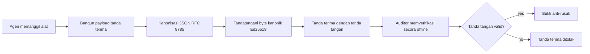
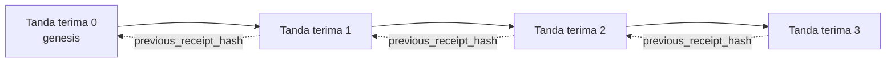

[Tonton video pelajaran: Mengamankan Agen AI dengan Tanda Terima Kriptografi](https://youtu.be/PLACEHOLDER_VIDEO_ID)

> _(Video pelajaran dan thumbnail akan ditambahkan oleh tim konten Microsoft setelah penggabungan, sesuai pola pelajaran 14 / 15.)_

# Mengamankan Agen AI dengan Tanda Terima Kriptografi

## Pendahuluan

Pelajaran ini akan membahas:

- Mengapa jejak audit untuk agen AI penting untuk kepatuhan, debugging, dan kepercayaan.
- Apa itu tanda terima kriptografi dan bagaimana bedanya dengan baris log yang tidak ditandatangani.
- Cara membuat tanda terima bertanda tangan untuk pemanggilan alat agen dalam Python biasa.
- Cara memverifikasi tanda terima secara offline dan mendeteksi pemalsuan.
- Cara menghubungkan tanda terima sehingga penghapusan atau pengurutan ulang satu tanda terima merusak rantai.
- Apa yang dibuktikan oleh tanda terima dan apa yang secara eksplisit tidak dibuktikan.

## Tujuan Pembelajaran

Setelah menyelesaikan pelajaran ini, Anda akan mengetahui cara:

- Mengidentifikasi mode kegagalan yang memotivasi asal-usul kriptografi untuk tindakan agen.
- Membuat tanda terima yang ditandatangani Ed25519 atas muatan JSON kanonik.
- Memverifikasi tanda terima secara independen hanya menggunakan kunci publik penandatangan.
- Mendeteksi pemalsuan dengan menjalankan ulang verifikasi pada tanda terima yang dimodifikasi.
- Membangun urutan tanda terima yang terhubung hash dan menjelaskan mengapa rantai itu penting.
- Mengenali batas antara apa yang dibuktikan tanda terima (atribusi, integritas, pengurutan) dan apa yang tidak (kebenaran tindakan, kewajaran kebijakan).

## Masalah: Jejak Audit Agen Anda

Bayangkan Anda telah menerapkan agen AI untuk Contoso Travel. Agen tersebut membaca permintaan pelanggan, memanggil API penerbangan untuk mencari opsi, dan memesan kursi atas nama pelanggan. Kuartal lalu, agen memproses 50.000 pemesanan.

Hari ini seorang auditor datang. Mereka bertanya pertanyaan sederhana: "Tunjukkan apa yang telah dilakukan agen Anda."

Anda menyerahkan berkas log Anda. Auditor melihatnya dan mengajukan pertanyaan yang lebih sulit: "Bagaimana saya tahu log ini tidak diedit?"

Inilah masalah jejak audit. Sebagian besar penerapan agen saat ini mengandalkan:

- **Log aplikasi**: ditulis oleh agen itu sendiri, dapat diedit oleh siapa saja yang memiliki akses sistem berkas.
- **Layanan logging cloud**: sulit dipalsukan di tingkat platform, tapi hanya jika auditor mempercayai operator platform.
- **Log transaksi basis data**: cocok untuk perubahan basis data tapi tidak untuk pemanggilan alat sembarangan.

Tidak satu pun dari ini dapat menjawab pertanyaan auditor tanpa memerlukan kepercayaan auditor kepada seseorang (Anda, penyedia cloud Anda, vendor basis data Anda). Untuk penggunaan internal, kepercayaan itu sering dapat diterima. Untuk beban kerja yang diatur (keuangan, kesehatan, apa saja yang tunduk pada EU AI Act), itu tidak dapat diterima.

Tanda terima kriptografi menyelesaikan ini dengan membuat setiap tindakan agen dapat diverifikasi secara independen. Auditor tidak perlu mempercayai Anda. Mereka hanya perlu kunci publik Anda dan tanda terimanya sendiri.

## Apa itu Tanda Terima Kriptografi?

Tanda terima adalah objek JSON yang mencatat apa yang dilakukan agen, ditandatangani dengan tanda tangan digital.


```mermaid
flowchart LR
    A[Agen memanggil alat] --> B[Bangun payload tanda terima]
    B --> C[Kanonisasi JSON RFC 8785]
    C --> E[Tandatangani byte kanonik Ed25519]
    E --> F[Tanda terima dengan tanda tangan]
    F --> G[Auditor memverifikasi secara offline]
    G --> H{Tanda tangan valid?}
    H -- yes --> I[Bukti anti-rusak]
    H -- no --> J[Tanda terima ditolak]
```

Tanda terima minimal terlihat seperti ini:

```json
{
  "type": "agent.tool_call.v1",
  "agent_id": "contoso-travel-bot",
  "tool_name": "lookup_flights",
  "tool_args_hash": "sha256:a3f9c1...",
  "result_hash": "sha256:7b2e1d...",
  "policy_id": "contoso-travel-policy-v3",
  "timestamp": "2026-04-25T14:30:00Z",
  "sequence": 47,
  "previous_receipt_hash": "sha256:9d4e6a...",
  "signature": {
    "alg": "EdDSA",
    "sig": "c5af83...",
    "public_key": "8f3b2c..."
  }
}
```

Tiga properti yang menjalankan fungsi:

1. **Tanda tangan**. Tanda terima ditandatangani oleh gateway agen menggunakan kunci privat Ed25519. Siapa saja yang memiliki kunci publik yang sesuai dapat memverifikasi tanda tangan secara offline. Pemalsuan pada bidang apa pun akan membuat tanda tangan tidak valid.

2. **Pengodean kanonik**. Sebelum penandatanganan, tanda terima diserialisasi menggunakan JSON Canonicalization Scheme (JCS, RFC 8785). Ini memastikan dua implementasi yang menghasilkan tanda terima logis yang sama menghasilkan output byte-identik. Tanpa kanonisasi, serialisasi JSON yang berbeda akan menghasilkan tanda tangan yang berbeda untuk isi yang sama.

3. **Penghubungan hash**. Bidang `previous_receipt_hash` menghubungkan setiap tanda terima dengan tanda terima sebelumnya. Menghapus atau mengurut ulang tanda terima akan merusak setiap tanda terima yang datang setelahnya. Pemalsuan menjadi terlihat di tingkat rantai meskipun tanda tangan individu bisa dilewati.

Ketiga properti ini memberikan tiga jaminan:

- **Atribusi**: kunci ini menandatangani isi ini.
- **Integritas**: isi tidak berubah sejak penandatanganan.
- **Pengurutan**: tanda terima ini datang setelah tanda terima itu dalam rantai.

## Membuat Tanda Terima di Python

Anda tidak memerlukan pustaka khusus untuk membuat tanda terima. Primitif kriptografi tersedia secara luas dan logikanya hanya beberapa puluh baris Python.

Latihan langsung di `code_samples/18-signed-receipts.ipynb` menjelaskan keseluruhan alur. Versi ringkasnya:

```python
import json
import hashlib
import base64
from nacl import signing
from jcs import canonicalize  # JSON kanonik RFC 8785

def b64url_nopad(data: bytes) -> str:
    return base64.urlsafe_b64encode(data).decode("ascii").rstrip("=")

def sha256_canonical(obj) -> str:
    """SHA-256 of a Python object's JCS-canonical JSON form."""
    return f"sha256:{hashlib.sha256(canonicalize(obj)).hexdigest()}"

# Hasilkan atau muat kunci penandatanganan (di produksi, simpan di gudang kunci)
signing_key = signing.SigningKey.generate()
verify_key = signing_key.verify_key

# Bangun payload tanda terima (belum ada tanda tangan)
tool_args = {"origin": "SYD", "destination": "LAX"}
tool_result = [{"flight": "QF11", "price": 1850, "stops": 0}]

payload = {
    "type": "agent.tool_call.v1",
    "agent_id": "contoso-travel-bot",
    "tool_name": "lookup_flights",
    "tool_args_hash": sha256_canonical(tool_args),
    "result_hash": sha256_canonical(tool_result),
    "policy_id": "contoso-travel-policy-v3",
    "timestamp": "2026-04-25T14:30:00Z",
    "sequence": 0,
    "previous_receipt_hash": None,
}

# Kanonkan dan tanda tangani byte JCS secara langsung. PureEdDSA melakukan hashing secara internal.
canonical_bytes = canonicalize(payload)
signature_bytes = signing_key.sign(canonical_bytes).signature

# Lampirkan objek tanda tangan terstruktur.
receipt = {
    **payload,
    "signature": {
        "alg": "EdDSA",
        "sig": b64url_nopad(signature_bytes),
        "public_key": b64url_nopad(bytes(verify_key)),
    },
}
```

Itu seluruh pipeline penandatanganan. Latihan dalam notebook menjelaskan setiap langkah.

## Memverifikasi Tanda Terima dan Mendeteksi Pemalsuan

Verifikasi adalah operasi kebalikan:

```python
import base64
import hashlib
from nacl import signing
from nacl.exceptions import BadSignatureError
from jcs import canonicalize

def b64url_decode(s: str) -> bytes:
    padding = "=" * ((4 - len(s) % 4) % 4)
    return base64.urlsafe_b64decode(s + padding)

def verify_receipt(receipt: dict) -> bool:
    # Tanda tangan adalah objek terstruktur: {"alg", "sig", "public_key"}.
    sig_obj = receipt.get("signature")
    if not sig_obj or sig_obj.get("alg") != "EdDSA":
        return False

    # Bangun kembali payload yang sebenarnya ditandatangani (semua kecuali tanda tangan).
    payload = {k: v for k, v in receipt.items() if k != "signature"}

    canonical_bytes = canonicalize(payload)

    try:
        verify_key = signing.VerifyKey(b64url_decode(sig_obj["public_key"]))
        verify_key.verify(canonical_bytes, b64url_decode(sig_obj["sig"]))
        return True
    except BadSignatureError:
        return False
```

Fungsi ini menerima tanda terima dan mengembalikan `True` jika tanda tangan valid, `False` jika tidak. Tidak ada panggilan jaringan, tidak ada ketergantungan layanan, tidak perlu mempercayai pihak ketiga mana pun.

Untuk melihat deteksi pemalsuan secara langsung, notebook menjelaskan:

1. Membuat tanda terima yang valid dan mengonfirmasi verifikasinya.
2. Mengubah satu byte pada bidang `tool_args_hash`.
3. Menjalankan ulang verifikasi dan melihatnya gagal.

Ini adalah demonstrasi praktis bahwa tanda terima sulit dipalsukan: setiap modifikasi, sekecil apa pun, merusak tanda tangan.

## Menghubungkan Tanda Terima untuk Agen Multi-Tahap

Tanda terima tunggal yang ditandatangani melindungi satu tindakan. Rangkaian tanda terima melindungi suatu urutan tindakan.


```mermaid
flowchart LR
    R0[Tanda terima 0<br/>genesis] --> R1[Tanda terima 1]
    R1 --> R2[Tanda terima 2]
    R2 --> R3[Tanda terima 3]
    R1 -. previous_receipt_hash .-> R0
    R2 -. previous_receipt_hash .-> R1
    R3 -. previous_receipt_hash .-> R2
```

Setiap tanda terima mencatat hash dari tanda terima sebelumnya. Untuk menghapus tanda terima 2 secara diam-diam, penyerang harus:

- Memodifikasi bidang `previous_receipt_hash` pada tanda terima 3 (merusak tanda tangan tanda terima 3), ATAU
- Memalsukan tanda tangan baru pada tanda terima 3 yang dimodifikasi (memerlukan kunci privat agen).

Jika kunci privat disimpan dalam brankas kunci perangkat keras dan Anda mempublikasikan kunci publik dengan setiap tanda terima, kedua serangan itu tidak mungkin tanpa terdeteksi.

Notebook menjelaskan:

1. Membangun rantai tiga tanda terima.
2. Memverifikasi bahwa `previous_receipt_hash` pada setiap tanda terima cocok dengan hash aktual tanda terima sebelumnya.
3. Memalsukan satu tanda terima di tengah dan melihat rantai putus tepat di titik tersebut.

Begitulah cara Anda membuat jejak audit yang dapat diverifikasi auditor eksternal tanpa harus mempercayai Anda.

## Apa yang Dibuktikan Tanda Terima (dan Apa yang Tidak)

Ini adalah bagian terpenting dari pelajaran ini. Tanda terima sangat kuat tapi kekuatannya terbatas.

**Tanda terima membuktikan tiga hal:**

1. **Atribusi**: kunci tertentu menandatangani muatan tertentu.
2. **Integritas**: muatan tidak berubah sejak penandatanganan.
3. **Pengurutan**: tanda terima ini datang setelah tanda terima lain dalam rantai hash.

**Tanda terima TIDAK membuktikan:**

1. **Kebenaran**: bahwa tindakan agen adalah tindakan yang benar. Tanda terima bisa ditandatangani untuk jawaban yang salah sama bersihnya seperti untuk jawaban yang benar.
2. **Kepatuhan kebijakan**: bahwa kebijakan yang dirujuk di `policy_id` benar-benar dievaluasi, atau bahwa kebijakan itu akan mengizinkan tindakan ini jika diperiksa. Tanda terima mencatat apa yang diklaim, bukan apa yang ditegakkan.
3. **Identitas di luar kunci**: tanda terima mengatakan "kunci ini menandatangani isi ini." Ia tidak mengatakan "manusia ini mengotorisasi ini." Menghubungkan kunci ke orang atau organisasi membutuhkan infrastruktur identitas terpisah (direktori, registri kunci publik, dll.).
4. **Kebenaran masukan**: jika agen menerima prompt yang dimanipulasi dan bertindak atasnya, tanda terima mencatat tindakan dengan setia. Tanda terima adalah hasil dari validasi input, bukan pengganti validasi itu.

Batas ini penting karena dua alasan:

- Ini memberi tahu Anda untuk apa tanda terima berguna: membuat perilaku agen dapat diaudit dan sulit dipalsukan, bahkan melintasi batas organisasi.
- Ini memberi tahu Anda lapisan tambahan apa yang masih Anda butuhkan: validasi input (Pelajaran 6), penegakan kebijakan (dibahas secara singkat di bawah), dan infrastruktur identitas (di luar cakupan pelajaran ini).

Kesalahan umum adalah menganggap "kami punya tanda terima" berarti "kami terkelola." Tidak demikian. Tanda terima adalah fondasi. Pengelolaan adalah sistem yang Anda bangun di atasnya.

## Membuktikan Seorang Manusia Menyetujui Tindakan Tepat

Poin 3 di atas layak memiliki bagian sendiri: tanda terima tindakan mengatakan "kunci ini menandatangani isi ini," tidak pernah "manusia menyetujui ini." Untuk tindakan berisiko tinggi (pengembalian dana, penghapusan, transfer wire), kerangka pengelolaan makin banyak mensyaratkan pernyataan yang hilang itu, dan itu dapat dibuat dengan primitif yang sama yang sudah Anda bangun di pelajaran ini.

Notebook lanjutan `code_samples/human-authorization-receipts.ipynb` menambahkan jenis tanda terima kedua, `human.approval.v1`, dengan bentuk amplop yang sama dengan tanda terima pelajaran ini (muatan bertipe yang ditandatangani oleh Ed25519 atas byte JSON JCS kanonik, dengan objek `signature` di luar byte yang ditandatangani). Seorang pemberi persetujuan bernama menandatangani **tindakan kanonik penuh dan digest-nya** sebelum eksekusi; tanda terima tindakan agen membawa **digest tindakan yang sama** dan `parent_approval_ref`, `receipt_hash` dari persetujuan, konvensi yang sama seperti `previous_receipt_hash` dalam rantai yang Anda bangun di atas. Satu `verify_chain` memeriksa kedua artefak di bawah **registri kunci yang dipin** secara terpisah (kunci pemberi persetujuan vs kunci agen), sehingga jalur kode dibagi namun wewenang tidak pernah sama.

Properti yang dimiliki, dinyatakan dengan hati-hati: *manusia menyetujui tindakan persis ini, dan agen mengeksekusi persis tindakan yang disetujui itu.* Fitur penolakan notebook membuat properti ini nyata bukan hanya klaim:

- kumpulan klasik: pemalsuan, deputi bingung, putar ulang, kunci palsu di kedua sisi, input tidak valid;
- **otoritas kedaluwarsa**: tanda tangan yang masih terverifikasi, tetap saja ditolak karena versi kebijakan berubah, kunci pemberi persetujuan diputar keluar dari registri pinned, atau persetujuan kedaluwarsa sebelum eksekusi;
- **penggantian digest**: tanda terima tindakan yang ditandatangani dengan sah menunjuk ke persetujuan *nyata* yang mengikat tindakan kanonik *berbeda*.

Setiap kegagalan menolak dengan alasan berbeda, sehingga auditor yang membaca penolakan dapat mengetahui apakah otoritas kedaluwarsa atau tindakan yang dieksekusi berubah. Aturan yang diajarkan notebook: persetujuan yang ditandatangani bukan otoritas dengan sendirinya. Otoritas ada hanya jika kedua tanda terima masih mengikat tindakan kanonik yang sama pada waktu eksekusi. Tanda terima persetujuan manusia adalah komposisi edukatif yang didefinisikan oleh pelajaran ini, bukan tipe tanda terima yang didefinisikan oleh `draft-farley-acta-signed-receipts`.

## Referensi Produksi

Kode Python di pelajaran ini sengaja minimal agar Anda dapat membaca setiap baris dan memahami persis apa yang terjadi. Dalam produksi, Anda memiliki dua pilihan:

1. **Bangun langsung di atas primitif kriptografi.** 50 baris yang Anda lihat di atas sudah cukup untuk banyak kasus penggunaan. PyNaCl (Ed25519) dan paket `jcs` (JSON kanonik) adalah pustaka yang terpelihara dengan baik dan diaudit.

2. **Gunakan pustaka tanda terima produksi.** Beberapa proyek sumber terbuka mengimplementasikan pola yang sama dengan fitur tambahan (rotasi kunci, verifikasi batch, distribusi JWK Set, integrasi dengan mesin kebijakan):
   - Pipeline penandatanganan menggunakan konvensi JCS dan cakupan tanda tangan dalam Draf Internet IETF independen ([`draft-farley-acta-signed-receipts`](https://datatracker.ietf.org/doc/draft-farley-acta-signed-receipts/), revisi 02). Tanda terima edukasi datar pelajaran ini berbeda dengan amplop `{payload, signature}` pada draf dan tidak disajikan sebagai implementasi yang sesuai. Draf tersebut menerbitkan suite konformance bersama ([agent-governance-testvectors](https://github.com/ScopeBlind/agent-governance-testvectors)) untuk implementasi yang menargetkan format wire-nya.
   - Microsoft Agent Governance Toolkit menyusun tanda terima dengan keputusan kebijakan berbasis Cedar; lihat Tutorial 33 di repositori itu untuk contoh end-to-end.
   - Paket `protect-mcp` (npm) dan `@veritasacta/verify` (npm) menyediakan implementasi tanda tangan dan verifikasi offline berbasis Node, ditujukan untuk membungkus server MCP apa pun dengan jejak audit yang sulit dipalsukan, termasuk alur co-sign yang ditahan di mana tindakan berhenti mengeluarkan tanda terima persetujuan terkait dengan digest tindakan (dengan WebAuthn pada alur desktop), pola tanda terima persetujuan yang sama seperti notebook otorisasi manusia di atas.
   - SDK Python **[nobulex](https://github.com/arian-gogani/nobulex)** (`pip install nobulex`) menyediakan pola penandatanganan Ed25519 + JCS yang sama di Python dengan integrasi LangChain dan CrewAI, termasuk vektor pengujian validasi silang yang dipublikasikan dan pemetaan kepatuhan yang disumbangkan melalui [OWASP PR #2210](https://github.com/OWASP/CheatSheetSeries/pull/2210).

Keputusan antara membangun sendiri dan menggunakan pustaka mencerminkan keputusan antara menulis pustaka JWT sendiri dan menggunakan yang sudah diuji: keduanya masuk akal; pustaka menghemat waktu dan mengurangi permukaan audit; pendekatan dari nol memaksa Anda memahami setiap primitif. Pelajaran ini mengajarkan jalur dari nol agar Anda memiliki fondasi untuk kedua pilihan.

## Pemeriksaan Pengetahuan

Uji pemahaman Anda sebelum melanjutkan ke latihan praktik.

**1. Tanda terima ditandatangani dengan kunci privat Ed25519 agen. Auditor hanya memiliki kunci publik. Apakah auditor dapat memverifikasi tanda terima secara offline?**

<details>
<summary>Jawaban</summary>

Ya. Verifikasi Ed25519 hanya memerlukan kunci publik dan byte yang ditandatangani. Tidak ada panggilan jaringan, tidak ada ketergantungan layanan. Ini adalah sifat yang membuat tanda terima berguna di pengaturan audit yang terisolasi dari jaringan, multi-organisasi, atau berkepercayaan rendah.
</details>

**2. Seorang penyerang memodifikasi bidang `policy_id` pada tanda terima untuk mengklaim bahwa itu diatur oleh kebijakan yang lebih permisif. Tanda tangan diambil atas muatan asli. Apa yang terjadi saat verifikasi?**

<details>
<summary>Jawaban</summary>


Verifikasi gagal. Tanda tangan dihitung atas byte kanonik dari muatan asli; mengubah bidang apa pun mengubah byte tersebut, yang membuat tanda tangan menjadi tidak valid. Penyerang akan memerlukan kunci privat untuk menghasilkan tanda tangan valid baru, yang tidak mereka miliki.
</details>

**3. Mengapa tanda terima menyertakan `tool_args_hash` dan `result_hash` daripada argumen mentah dan hasilnya?**

<details>
<summary>Jawaban</summary>

Ada dua alasan. Pertama, tanda terima mungkin perlu diarsipkan atau dikirimkan di lingkungan di mana bocornya konten mentah (PII, data bisnis) menjadi masalah. Penggunaan hash menjaga tanda terima tetap kecil dan konten tetap privat; auditor memverifikasi bahwa hash tersebut cocok dengan salinan konten sebenarnya yang disimpan terpisah. Kedua, hash memiliki ukuran tetap; tanda terima dengan hash memiliki batas ukuran terlepas dari seberapa besar input dan output.
</details>

**4. Bidang `previous_receipt_hash` menghubungkan setiap tanda terima ke pendahulunya. Jika penyerang diam-diam menghapus satu tanda terima dari tengah rantai, apa yang menjadi tidak valid?**

<details>
<summary>Jawaban</summary>

Setiap tanda terima yang datang setelah tanda terima yang dihapus itu. Bidang `previous_receipt_hash` mereka tidak lagi cocok dengan rantai yang sebenarnya (karena tanda terima yang mereka referensikan tidak ada lagi, atau rantai sekarang menunjuk ke pendahulu yang berbeda). Untuk menyembunyikan penghapusan itu, penyerang harus menandatangani ulang setiap tanda terima setelahnya, yang memerlukan kunci privat.
</details>

**5. Tanda terima diverifikasi dengan bersih. Apakah itu membuktikan tindakan agen benar, tepat, atau sesuai kebijakan?**

<details>
<summary>Jawaban</summary>

Tidak. Tanda terima valid membuktikan tiga hal: atribusi (kunci ini menandatangani konten ini), integritas (konten tidak berubah), dan urutan (tanda terima ini datang setelah tanda terima itu). Ini TIDAK membuktikan bahwa tindakan itu benar, bahwa kebijakan yang dinamai di `policy_id` benar-benar dievaluasi, atau bahwa agen mengikuti setiap aturan. Tanda terima membuat perilaku agen dapat diaudit, bukan harus benar. Ini adalah batas paling penting dalam pelajaran ini.
</details>

## Latihan Praktik

Buka `code_samples/18-signed-receipts.ipynb` dan selesaikan keempat bagian:

1. **Bagian 1**: Tandatangani tanda terima pertama Anda dan verifikasi.
2. **Bagian 2**: Ganggu tanda terima dan amati kegagalan verifikasi.
3. **Bagian 3**: Buat rantai tiga tanda terima dan verifikasi integritas rantai.
4. **Bagian 4**: Terapkan pola ini ke agen yang dibangun dengan Microsoft Agent Framework: bungkus panggilan alat dalam penandatanganan tanda terima, lalu verifikasi tanda terima secara mandiri.

**Tantangan tambahan 1:** perluas skema tanda terima dengan bidang tambahan pilihan Anda sendiri (misalnya, ID permintaan untuk pelacakan), perbarui logika penandatanganan kanonik untuk menyertakannya, dan pastikan bahwa tanda terima masih dapat melewati verifikasi bolak-balik. Kemudian ubah bidang itu setelah penandatanganan dan pastikan verifikasi gagal. Ini memaksa Anda memahami bagaimana setiap byte dari pengkodean kanonik berkontribusi pada tanda tangan.

**Tantangan tambahan 2:** Gabungkan hash SHA-256 dari dua tanda terima Anda (gabungkan byte kanonik mereka dalam urutan deterministik) dan sematkan hasil digesti sebagai bidang baru pada tanda terima ketiga sebelum menandatanganinya. Verifikasi bahwa ketiga tanda terima masih dapat melewati verifikasi bolak-balik. Anda baru saja membuat bukti inklusi satu langkah: siapa saja yang memegang tanda terima ketiga dapat membuktikan bahwa dua tanda terima pertama ada saat itu juga ditandatangani, tanpa perlu mengungkapkan isi mereka. Ini adalah pola yang digunakan tanda terima dengan pengungkapan selektif dalam skala besar (komitmen Merkle, RFC 6962).

## Kesimpulan

Tanda terima kriptografi memberi agen AI jejak audit yang:

- **Dapat diverifikasi secara mandiri**: siapa saja dengan kunci publik dapat memverifikasi, tanpa ketergantungan layanan.
- **Mudah terdeteksi gangguan**: setiap modifikasi membatalkan tanda tangan.
- **Portabel**: tanda terima adalah file JSON kecil; dapat diarsipkan, dikirim, dan diverifikasi di mana saja.
- **Sesuai standar**: dibangun di atas Ed25519 (RFC 8032), JCS (RFC 8785), dan SHA-256, semua primitif yang banyak digunakan.

Mereka bukan pengganti untuk validasi input, penegakan kebijakan, atau infrastruktur identitas. Mereka adalah fondasi untuk lapisan-lapisan tersebut. Saat Anda menerapkan agen di lingkungan yang diatur, alur kerja multi-organisasi, atau pengaturan di mana auditor di masa depan tidak dapat diasumsikan mempercayai Anda, tanda terima adalah cara membuat jejak audit jujur.

Hal terpenting yang harus diingat: tanda terima membuktikan siapa yang mengatakan apa dan kapan. Mereka tidak membuktikan bahwa apa yang dikatakan itu benar atau tepat. Pegang perbedaan itu dengan ketat. Ini adalah perbedaan antara sistem asal-usul yang jujur dan yang menyesatkan.

## Daftar Periksa Produksi

Saat Anda siap lulus dari pelajaran ini ke penerapan agen bertanda terima di lingkungan nyata:

- [ ] **Pindahkan kunci penandatanganan dari laptop pengembang.** Gunakan Azure Key Vault, AWS KMS, atau perangkat keras keamanan khusus. Kunci privat yang menandatangani tanda terima Anda tidak boleh pernah berada di kontrol sumber atau dalam bentuk plaintext di mesin aplikasi.
- [ ] **Publikasikan kunci publik verifikasi.** Auditor membutuhkannya untuk verifikasi offline. Pola standar adalah JWK Set di URL yang sudah dikenal (RFC 7517), misalnya, `https://your-org.example.com/.well-known/agent-keys.json`.
- [ ] **Jangkar rantai secara eksternal.** Secara berkala tulis hash kepala rantai terbaru ke log transparansi (Sigstore Rekor, otoritas timestamp RFC 3161, atau sistem internal kedua) agar pihak eksternal dapat mengonfirmasi "rantai ini ada pada waktu ini."
- [ ] **Simpan tanda terima secara tidak dapat diubah.** Penyimpanan blob yang hanya dapat ditambahkan (Azure Storage dengan kebijakan imutabilitas, AWS S3 Object Lock) mencegah pelaku dalam penyimpanan mengubah sejarah.
- [ ] **Putuskan kebijakan retensi.** Banyak rezim kepatuhan memerlukan retensi multi-tahun. Rencanakan pertumbuhan tanda terima (setiap tanda terima sekitar 500 byte; agen dengan 10K panggilan per hari menghasilkan sekitar 1,8 GB per tahun).
- [ ] **Dokumentasikan apa yang tidak dicakup tanda terima.** Tanda terima membuktikan atribusi, integritas, dan urutan. Buku panduan Anda harus secara eksplisit mencantumkan kontrol tambahan apa (validasi input, penegakan kebijakan, pembatasan laju, infrastruktur identitas) yang berdampingan dengan tanda terima dalam sikap tata kelola Anda.

### Punya Pertanyaan Lebih Lanjut tentang Mengamankan Agen AI?

Bergabunglah dengan [Microsoft Foundry Discord](https://aka.ms/ai-agents/discord) untuk bertemu dengan pelajar lain, mengikuti jam kantor, dan mendapatkan jawaban untuk pertanyaan Agen AI Anda.

## Di Luar Pelajaran Ini

Pelajaran ini membahas penandatanganan tanda terima tunggal dan rantai hash berurutan. Primtif yang sama membentuk beberapa pola lanjutan yang mungkin Anda temui seiring kematangan sikap tata kelola Anda:

- **Pengungkapan selektif.** Ketika bidang tanda terima secara independen dikomit (pohon Merkle gaya RFC 6962), Anda dapat membuka bidang tertentu pada auditor tertentu dan membuktikan sisanya tidak berubah tanpa mengeksposnya. Berguna ketika tanda terima yang sama harus memenuhi audit komprehensif (yang menginginkan kelengkapan) dan regulasi minimisasi data seperti GDPR (yang menginginkan auditor melihat sesedikit mungkin).
- **Pencabutan tanda terima.** Jika kunci penandatanganan dikompromikan, Anda memerlukan cara untuk menandai semua tanda terima yang ditandatangani oleh kunci itu sebagai tidak dipercaya mulai waktu tertentu. Pola standar: kunci tanda tangan berumur pendek plus daftar pencabutan yang dipublikasikan, atau log transparansi dengan entri pencabutan.
- **Tanda terima bilateral / tanda tangan terpisah.** Beberapa implementasi memisah payload yang ditandatangani menjadi setengah prerun (`authorization_*`) dan setengah pascarun (`result_*`) dengan tanda tangan independen, berguna ketika keputusan otorisasi dan hasil yang diamati dihasilkan oleh aktor berbeda atau pada waktu berbeda. Ini menyusun secara aditif di atas format tanda terima yang diajarkan dalam pelajaran ini.
- **Komposisi payload.** Tanda terima menyegel byte apa pun yang Anda letakkan dalam `result_hash`. Payload dunia nyata sering lebih kaya daripada hanya hasil panggilan alat tunggal: penalaran prakeputusan (prediksi model, opsi yang dipertimbangkan, bukti dan kelengkapannya, sikap risiko, rantai akuntabilitas, hasil gerbang) semua bisa ada di dalam payload, disegel oleh satu tanda terima. Ini menjaga format tanda terima minimal sementara memungkinkan skema payload berkembang domain demi domain.
- **Konfirmasi lintas implementasi.** Beberapa implementasi independen dari format tanda terima yang sama (Python, TypeScript, Rust, Go) melakukan verifikasi silang terhadap vektor uji bersama. Jika Anda membuat implementasi sendiri, memvalidasi terhadap vektor yang dipublikasikan mengonfirmasi kompatibilitas wire.
- **Migrasi pasca-kuantum.** Ed25519 banyak digunakan saat ini tetapi tidak tahan kuantum. Format tanda terima bersifat algoritma-agile: bidang `signature.alg` dapat membawa `ML-DSA-65` (standar tanda tangan pasca-kuantum NIST) saat Anda perlu migrasi. Rencanakan periode transisi di mana tanda terima ditandatangani ganda.

## Sumber Daya Tambahan

- <a href="https://datatracker.ietf.org/doc/draft-farley-acta-signed-receipts/" target="_blank">IETF Internet-Draft: Tanda Terima Keputusan Bertanda Tangan untuk Kontrol Akses Mesin-ke-Mesin</a>
- <a href="https://learn.microsoft.com/azure/ai-studio/responsible-use-of-ai-overview" target="_blank">Gambaran Umum AI Bertanggung Jawab (Azure AI)</a>
- <a href="https://datatracker.ietf.org/doc/html/rfc8032" target="_blank">RFC 8032: Algoritma Tanda Tangan Digital Kurva Edwards (EdDSA)</a>
- <a href="https://datatracker.ietf.org/doc/html/rfc8785" target="_blank">RFC 8785: Skema Kanonisasi JSON (JCS)</a>
- <a href="https://datatracker.ietf.org/doc/html/rfc6962" target="_blank">RFC 6962: Transparansi Sertifikat</a> (pembangunan pohon Merkle yang digunakan oleh tanda terima pengungkapan selektif)
- <a href="https://github.com/microsoft/agent-governance-toolkit/blob/main/docs/tutorials/33-offline-verifiable-receipts.md" target="_blank">Microsoft Agent Governance Toolkit, Tutorial 33: Tanda Terima Keputusan yang Dapat Diverifikasi Offline</a>
- <a href="https://github.com/ScopeBlind/agent-governance-testvectors" target="_blank">Vektor uji konformansi lintas implementasi</a> untuk format tanda terima yang digunakan dalam pelajaran ini (Apache-2.0)
- <a href="https://pynacl.readthedocs.io/" target="_blank">Dokumentasi PyNaCl</a> (Ed25519 dalam Python)

## Pelajaran Sebelumnya

[Membuat Agen AI Lokal](../17-creating-local-ai-agents/README.md)

---

<!-- CO-OP TRANSLATOR DISCLAIMER START -->
**Penafian**:
Dokumen ini telah diterjemahkan menggunakan layanan terjemahan AI [Co-op Translator](https://github.com/Azure/co-op-translator). Meskipun kami berupaya untuk mencapai akurasi, harap diketahui bahwa terjemahan otomatis mungkin mengandung kesalahan atau ketidakakuratan. Dokumen asli dalam bahasa aslinya harus dianggap sebagai sumber yang sah. Untuk informasi penting, disarankan menggunakan terjemahan profesional oleh manusia. Kami tidak bertanggung jawab atas kesalahpahaman atau penafsiran yang keliru yang timbul dari penggunaan terjemahan ini.
<!-- CO-OP TRANSLATOR DISCLAIMER END -->