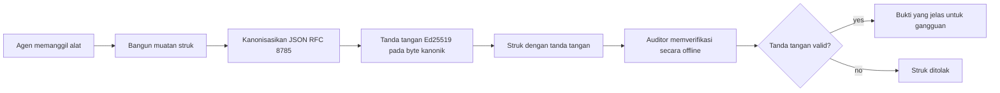
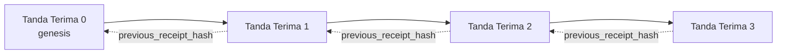

[Tonton video pelajaran: Mengamankan Agen AI dengan Resi Kriptografi](https://youtu.be/PLACEHOLDER_VIDEO_ID)

> _(Video pelajaran dan thumbnail akan ditambahkan oleh tim konten Microsoft setelah penggabungan, mengikuti pola pelajaran 14 / 15.)_

# Mengamankan Agen AI dengan Resi Kriptografi

## Pendahuluan

Pelajaran ini akan membahas:

- Mengapa jejak audit untuk agen AI penting untuk kepatuhan, debugging, dan kepercayaan.
- Apa itu resi kriptografi dan bagaimana perbedaannya dengan baris log yang tidak ditandatangani.
- Cara membuat resi bertanda tangan untuk panggilan alat agen dalam Python biasa.
- Cara memverifikasi resi secara offline dan mendeteksi pemalsuan.
- Cara menghubungkan rantai resi sehingga menghapus atau mengubah urutan salah satunya memutus rantai.
- Apa yang dibuktikan oleh resi dan apa yang secara eksplisit tidak dibuktikan.

## Tujuan Pembelajaran

Setelah menyelesaikan pelajaran ini, Anda akan tahu cara:

- Mengidentifikasi mode kegagalan yang memotivasi asal usul kriptografi untuk tindakan agen.
- Membuat resi bertanda tangan Ed25519 atas payload JSON kanonis.
- Memverifikasi resi secara independen hanya menggunakan kunci publik penandatangan.
- Mendeteksi pemalsuan dengan menjalankan ulang verifikasi pada resi yang dimodifikasi.
- Membangun urutan resi berantai hash dan menjelaskan mengapa rantainya penting.
- Mengenali batas antara apa yang dibuktikan resi (atribusi, integritas, pengurutan) dan apa yang tidak (kebenaran tindakan, ketepatan kebijakan).

## Masalah: Jejak Audit Agen Anda

Bayangkan Anda telah men-deploy agen AI untuk Contoso Travel. Agen membaca permintaan pelanggan, memanggil API penerbangan untuk mencari pilihan, dan memesan tempat duduk atas nama pelanggan. Kuartal lalu, agen memproses 50.000 pemesanan.

Hari ini seorang auditor datang. Mereka mengajukan pertanyaan sederhana: "Tunjukkan apa yang dilakukan agen Anda."

Anda menyerahkan file log Anda. Auditor melihatnya dan mengajukan pertanyaan yang lebih sulit: "Bagaimana saya tahu log ini tidak diedit?"

Ini adalah masalah jejak audit. Sebagian besar deployment agen saat ini mengandalkan:

- **Log aplikasi**: ditulis oleh agen sendiri, dapat diedit siapa saja yang memiliki akses ke sistem berkas.
- **Layanan logging cloud**: tahan terhadap pemalsuan pada level platform tapi hanya jika auditor mempercayai operator platform.
- **Log transaksi database**: cocok untuk perubahan database tapi tidak untuk panggilan alat arbitrer.

Tidak ada yang bisa menjawab pertanyaan auditor tanpa mengharuskan auditor mempercayai seseorang (Anda, penyedia cloud Anda, vendor database Anda). Untuk penggunaan internal, kepercayaan ini sering dapat diterima. Untuk beban kerja yang diatur (keuangan, kesehatan, apa pun yang tunduk pada Undang-Undang AI Uni Eropa), tidak bisa.

Resi kriptografi menyelesaikan ini dengan membuat setiap tindakan agen dapat diverifikasi secara independen. Auditor tidak perlu mempercayai Anda. Mereka hanya membutuhkan kunci publik Anda dan resinya itu sendiri.

## Apa itu Resi Kriptografi?

Resi adalah objek JSON yang merekam apa yang dilakukan agen, yang ditandatangani dengan tanda tangan digital.


```mermaid
flowchart LR
    A[Agen memanggil alat] --> B[Bangun muatan struk]
    B --> C[Kanonisasikan JSON RFC 8785]
    C --> E[Tanda tangan Ed25519 pada byte kanonik]
    E --> F[Struk dengan tanda tangan]
    F --> G[Auditor memverifikasi secara offline]
    G --> H{Tanda tangan valid?}
    H -- yes --> I[Bukti yang jelas untuk gangguan]
    H -- no --> J[Struk ditolak]
```

Resi minimal terlihat seperti ini:

```json
{
  "type": "agent.tool_call.v1",
  "agent_id": "contoso-travel-bot",
  "tool_name": "lookup_flights",
  "tool_args_hash": "sha256:a3f9c1...",
  "result_hash": "sha256:7b2e1d...",
  "policy_id": "contoso-travel-policy-v3",
  "timestamp": "2026-04-25T14:30:00Z",
  "sequence": 47,
  "previous_receipt_hash": "sha256:9d4e6a...",
  "signature": {
    "alg": "EdDSA",
    "sig": "c5af83...",
    "public_key": "8f3b2c..."
  }
}
```

Tiga properti ini melakukan pekerjaannya:

1. **Tanda tangan**. Resi ditandatangani oleh gateway agen menggunakan kunci privat Ed25519. Siapa pun yang memiliki kunci publik terkait dapat memverifikasi tanda tangan secara offline. Pemalsuan pada bidang apa pun membatalkan tanda tangan.

2. **Enkoding kanonis**. Sebelum ditandatangani, resi diserialisasi menggunakan JSON Canonicalization Scheme (JCS, RFC 8785). Ini memastikan dua implementasi yang menghasilkan resi logis yang sama menghasilkan output byte-identik. Tanpa kanonisasi, serialisasi JSON yang berbeda akan menghasilkan tanda tangan berbeda untuk konten yang sama.

3. **Penghubungan hash**. Bidang `previous_receipt_hash` menghubungkan setiap resi dengan yang sebelumnya. Menghapus atau mengubah urutan resi memutus setiap resi yang datang setelahnya. Pemalsuan terlihat di tingkat rantai bahkan jika tanda tangan individu dilewati.

Bersama-sama properti ini memberikan tiga jaminan:

- **Atribusi**: kunci ini menandatangani konten ini.
- **Integritas**: konten tidak berubah sejak ditandatangani.
- **Pengurutan**: resi ini datang setelah resi itu dalam rantai.

## Membuat Resi dalam Python

Anda tidak memerlukan perpustakaan khusus untuk membuat resi. Primitif kriptografi tersedia luas dan logikanya hanya beberapa puluh baris Python.

Latihan langsung di `code_samples/18-signed-receipts.ipynb` menguraikan alur lengkapnya. Versi ringkas:

```python
import json
import hashlib
import base64
from nacl import signing
from jcs import canonicalize  # RFC 8785 JSON kanonik

def b64url_nopad(data: bytes) -> str:
    return base64.urlsafe_b64encode(data).decode("ascii").rstrip("=")

def sha256_canonical(obj) -> str:
    """SHA-256 of a Python object's JCS-canonical JSON form."""
    return f"sha256:{hashlib.sha256(canonicalize(obj)).hexdigest()}"

# Hasilkan atau muat kunci penandatanganan (di produksi, simpan di vault kunci)
signing_key = signing.SigningKey.generate()
verify_key = signing_key.verify_key

# Bangun payload tanda terima (belum ada tanda tangan)
tool_args = {"origin": "SYD", "destination": "LAX"}
tool_result = [{"flight": "QF11", "price": 1850, "stops": 0}]

payload = {
    "type": "agent.tool_call.v1",
    "agent_id": "contoso-travel-bot",
    "tool_name": "lookup_flights",
    "tool_args_hash": sha256_canonical(tool_args),
    "result_hash": sha256_canonical(tool_result),
    "policy_id": "contoso-travel-policy-v3",
    "timestamp": "2026-04-25T14:30:00Z",
    "sequence": 0,
    "previous_receipt_hash": None,
}

# Kanonisasikan dan tanda tangani byte JCS secara langsung. PureEdDSA melakukan hashing secara internal.
canonical_bytes = canonicalize(payload)
signature_bytes = signing_key.sign(canonical_bytes).signature

# Lampirkan objek tanda tangan terstruktur.
receipt = {
    **payload,
    "signature": {
        "alg": "EdDSA",
        "sig": b64url_nopad(signature_bytes),
        "public_key": b64url_nopad(bytes(verify_key)),
    },
}
```

Itu adalah seluruh pipeline penandatanganan. Latihan di notebook menjelaskan setiap langkah.

## Memverifikasi Resi dan Mendeteksi Pemalsuan

Verifikasi adalah operasi terbalik:

```python
import base64
import hashlib
from nacl import signing
from nacl.exceptions import BadSignatureError
from jcs import canonicalize

def b64url_decode(s: str) -> bytes:
    padding = "=" * ((4 - len(s) % 4) % 4)
    return base64.urlsafe_b64decode(s + padding)

def verify_receipt(receipt: dict) -> bool:
    # Tanda tangan adalah objek terstruktur: {"alg", "sig", "public_key"}.
    sig_obj = receipt.get("signature")
    if not sig_obj or sig_obj.get("alg") != "EdDSA":
        return False

    # Bangun kembali payload yang sebenarnya ditandatangani (semua kecuali tanda tangan).
    payload = {k: v for k, v in receipt.items() if k != "signature"}

    canonical_bytes = canonicalize(payload)

    try:
        verify_key = signing.VerifyKey(b64url_decode(sig_obj["public_key"]))
        verify_key.verify(canonical_bytes, b64url_decode(sig_obj["sig"]))
        return True
    except BadSignatureError:
        return False
```

Fungsi ini mengambil sebuah resi dan mengembalikan `True` jika tanda tangan valid, `False` jika tidak. Tidak ada panggilan jaringan, tidak ada dependensi layanan, tidak perlu mempercayai pihak ketiga manapun.

Untuk melihat deteksi pemalsuan secara nyata, notebook memandu:

1. Membuat resi valid dan memastikan ia terverifikasi.
2. Mengubah satu byte pada bidang `tool_args_hash`.
3. Menjalankan verifikasi ulang dan melihatnya gagal.

Ini adalah demonstrasi praktis bahwa resi tahan terhadap pemalsuan: setiap modifikasi, sekecil apa pun, memutus tanda tangan.

## Menghubungkan Resi untuk Agen Multi-Langkah

Satu resi bertanda tangan melindungi satu tindakan. Rantai resi melindungi urutan tindakan.


```mermaid
flowchart LR
    R0[Tanda Terima 0<br/>genesis] --> R1[Tanda Terima 1]
    R1 --> R2[Tanda Terima 2]
    R2 --> R3[Tanda Terima 3]
    R1 -. previous_receipt_hash .-> R0
    R2 -. previous_receipt_hash .-> R1
    R3 -. previous_receipt_hash .-> R2
```

Setiap resi mencatat hash dari resi sebelumnya. Untuk menghapus resi 2 tanpa jejak, penyerang harus:

- Mengubah bidang `previous_receipt_hash` pada resi 3 (memutus tanda tangan resi 3), ATAU
- Memalsukan tanda tangan baru pada resi 3 yang dimodifikasi (membutuhkan kunci privat agen).

Jika kunci privat berada dalam vault kunci perangkat keras dan Anda mempublikasikan kunci publik dengan setiap resi, kedua serangan ini tidak mungkin tanpa terdeteksi.

Notebook menjelaskan:

1. Membangun rantai tiga resi.
2. Memverifikasi bahwa `previous_receipt_hash` setiap resi cocok dengan hash resi sebelumnya yang sebenarnya.
3. Memalsukan satu resi di tengah dan melihat rantai putus tepat pada titik itu.

Inilah cara membuat jejak audit yang auditor eksternal dapat verifikasi tanpa harus mempercayai Anda.

## Apa yang Dibuktikan Resi (dan Apa yang Tidak)

Ini adalah bagian terpenting dari pelajaran ini. Resi sangat kuat tetapi kekuatannya terbatas.

**Resi membuktikan tiga hal:**

1. **Atribusi**: kunci tertentu menandatangani payload tertentu.
2. **Integritas**: payload tidak berubah sejak ditandatangani.
3. **Pengurutan**: resi ini datang setelah resi itu dalam rantai hash.

**Resi TIDAK membuktikan:**

1. **Kebenaran**: bahwa tindakan agen adalah tindakan yang benar. Resi dapat ditandatangani untuk jawaban yang salah sama bersihnya seperti untuk jawaban yang benar.
2. **Kepatuhan kebijakan**: bahwa kebijakan yang dirujuk dalam `policy_id` benar-benar dievaluasi, atau bahwa kebijakan itu akan mengizinkan tindakan ini jika diperiksa. Resi mencatat apa yang diklaim, bukan apa yang ditegakkan.
3. **Identitas di luar kunci**: resi mengatakan "kunci ini menandatangani konten ini." Ia tidak mengatakan "manusia ini mengotorisasi ini." Menghubungkan kunci dengan orang atau organisasi membutuhkan infrastruktur identitas terpisah (direktori, registri kunci publik, dll.).
4. **Kejujuran input**: jika agen menerima prompt yang dimanipulasi dan bertindak berdasarkan itu, resi merekam tindakan dengan setia. Resi berada di hilir validasi input, bukan pengganti validasi itu.

Batas ini penting karena dua alasan:

- Menjelaskan untuk apa resi berguna: membuat perilaku agen dapat diaudit dan tahan pemalsuan, bahkan lintas batas organisasi.
- Menjelaskan lapisan tambahan apa yang masih Anda butuhkan: validasi input (Pelajaran 6), penegakan kebijakan (dibahas singkat di bawah), dan infrastruktur identitas (di luar ruang lingkup pelajaran ini).

Kesalahan umum adalah menganggap "kami punya resi" berarti "kami diatur." Tidak demikian. Resi adalah fondasi. Tata kelola adalah sistem yang Anda bangun di atasnya.

## Membuktikan Seorang Manusia Mengesahkan Tindakan yang Tepat

Poin 3 di atas layak mendapat bagian sendiri: resi tindakan mengatakan "kunci ini menandatangani konten ini," bukan "manusia mengotorisasi ini." Untuk tindakan berisiko tinggi (pengembalian dana, penghapusan, transfer dana), kerangka tata kelola semakin mensyaratkan pernyataan yang hilang tersebut, dan hal itu dapat dibuat dengan primitif yang sama yang sudah Anda bangun dalam pelajaran ini.

Notebook lanjutan `code_samples/human-authorization-receipts.ipynb` menambahkan jenis resi kedua, `human.approval.v1`, dalam bentuk amplop yang sama seperti resi pelajaran ini (payload bertipe yang ditandatangani dengan Ed25519 melalui byte JCS kanonisnya, dengan objek `signature` berada di luar byte yang ditandatangani). Seorang pemberi persetujuan bernama menandatangani **aksi kanonis penuh dan digest-nya** sebelum eksekusi; resi tindakan agen memuat **digest aksi yang sama** dan `parent_approval_ref`, `receipt_hash` dari persetujuan, konvensi yang sama seperti `previous_receipt_hash` dalam rantai yang Anda buat di atas. Satu `verify_chain` memeriksa kedua artefak di bawah **registri kunci yang dipin secara terpisah** (kunci pemberi persetujuan vs kunci agen), jadi jalur kode dibagi tetapi otoritas tidak pernah sama.

Properti yang diperoleh dengan hati-hati: *manusia mengesahkan tindakan ini secara tepat, dan agen mengeksekusi tepat tindakan yang disahkan itu.* Penyangkalan di notebook adalah yang membuat properti ini nyata dan bukan sekadar pernyataan:

- kumpulan klasik: pemalsuan, deputi bingung, pemutaran ulang, pemalsuan kunci di kedua sisi, input cacat;
- **otoritas ketinggalan zaman**: tanda tangan yang masih dapat diverifikasi, tetap ditolak karena versi kebijakan berubah, kunci pemberi persetujuan diputar keluar dari registri yang dipin, atau persetujuan kedaluwarsa sebelum eksekusi;
- **penggantian digest**: resi tindakan bertanda tangan yang valid menunjuk pada persetujuan *nyata* yang mengikat tindakan kanonis *berbeda*.

Setiap kegagalan menolak dengan alasan berbeda, jadi auditor yang membaca penolakan dapat tahu apakah otoritas sudah kedaluwarsa atau tindakan dieksekusi telah berubah. Aturan yang diajarkan notebook: persetujuan bertanda tangan bukan otoritas sendirian. Otoritas hanya ada jika kedua resi masih mengikat pada tindakan kanonis yang sama saat eksekusi. Resi persetujuan manusia adalah komposisi edukasional yang didefinisikan oleh pelajaran ini, bukan tipe resi yang didefinisikan oleh `draft-farley-acta-signed-receipts`.

## Referensi Produksi

Kode Python dalam pelajaran ini sengaja dibuat minimal agar Anda dapat membaca setiap baris dan benar-benar memahami apa yang terjadi. Dalam produksi, Anda memiliki dua opsi:

1. **Bangun langsung di atas primitif kriptografi.** 50 baris yang Anda lihat di atas sudah cukup untuk banyak kasus penggunaan. PyNaCl (Ed25519) dan paket `jcs` (JSON kanonis) adalah perpustakaan yang terawat dan diaudit dengan baik.

2. **Gunakan perpustakaan resi produksi.** Beberapa proyek open-source mengimplementasikan pola yang sama dengan fitur tambahan (rotasi kunci, verifikasi batch, distribusi Set JWK, integrasi dengan mesin kebijakan):
   - Pipeline penandatanganan menggunakan konvensi JCS dan scope signature dalam Internet-Draft IETF independen ([`draft-farley-acta-signed-receipts`](https://datatracker.ietf.org/doc/draft-farley-acta-signed-receipts/), revisi 02). Resi edukasional pelajaran ini berbeda dengan amplop `{payload, signature}` pada draft dan tidak disajikan sebagai implementasi yang konform. Draft menerbitkan suite konformitas bersama ([agent-governance-testvectors](https://github.com/ScopeBlind/agent-governance-testvectors)) untuk implementasi yang menargetkan format wire-nya.
   - Microsoft Agent Governance Toolkit mengompilasi resi dengan keputusan kebijakan berbasis Cedar; lihat Tutorial 33 pada repositori itu untuk contoh ujung-ke-ujung.
   - Paket `protect-mcp` (npm) dan `@veritasacta/verify` (npm) menyediakan implementasi berbasis Node untuk penandatanganan resi dan verifikasi offline, dimaksudkan untuk membungkus server MCP apa pun dengan jejak audit tahan pemalsuan, termasuk alur tahan-tanda tangan di mana tindakan yang dihentikan mengeluarkan resi persetujuan yang terikat pada digest tindakan (ditopang WebAuthn dalam alur desktop), pola resi persetujuan yang sama seperti notebook otorisasi manusia di atas.
   - SDK Python **[nobulex](https://github.com/arian-gogani/nobulex)** (`pip install nobulex`) menyediakan pola penandatanganan Ed25519 + JCS yang sama dalam Python dengan integrasi LangChain dan CrewAI, termasuk vektor uji silang yang diterbitkan dan pemetaan kepatuhan yang disumbangkan lewat [OWASP PR #2210](https://github.com/OWASP/CheatSheetSeries/pull/2210).

Keputusan antara membuat sendiri dan menggunakan perpustakaan mencerminkan keputusan antara menulis perpustakaan JWT sendiri atau menggunakan yang telah diuji: keduanya masuk akal; perpustakaan menghemat waktu dan memperkecil permukaan audit; pendekatan dari awal memaksa Anda memahami setiap primitif. Pelajaran ini mengajarkan dari awal agar Anda memiliki dasar untuk kedua pilihan.

## Pemeriksaan Pengetahuan

Uji pemahaman Anda sebelum beralih ke latihan praktik.

**1. Resi ditandatangani dengan kunci privat Ed25519 agen. Auditor hanya memiliki kunci publik. Dapatkah auditor memverifikasi resi secara offline?**

<details>
<summary>Jawaban</summary>

Ya. Verifikasi Ed25519 hanya memerlukan kunci publik dan byte yang ditandatangani. Tidak ada panggilan jaringan, tidak ada dependensi layanan. Ini adalah properti yang membuat resi berguna dalam pengaturan audit terputus jaringan, multi-organisasi, atau dengan kepercayaan rendah.
</details>

**2. Penyerang memodifikasi bidang `policy_id` pada resi untuk mengklaim bahwa itu diatur oleh kebijakan yang lebih permisif. Tanda tangan dilakukan pada payload asli. Apa yang terjadi saat verifikasi?**

<details>
<summary>Jawaban</summary>


Verifikasi gagal. Tanda tangan dihitung atas byte kanonik dari payload asli; mengubah bidang apa pun mengubah byte tersebut, sehingga tanda tangan menjadi tidak valid. Penyerang harus memiliki kunci privat untuk menghasilkan tanda tangan valid baru, yang tidak mereka miliki.
</details>

**3. Mengapa struk tanda terima menyertakan `tool_args_hash` dan `result_hash` daripada argumen mentah dan hasilnya?**

<details>
<summary>Jawaban</summary>

Dua alasan. Pertama, struk tanda terima mungkin perlu diarsipkan atau dikirimkan di lingkungan di mana kebocoran konten mentah (PII, data bisnis) menjadi masalah. Hash menjaga struk tetap kecil dan konten tetap privat; auditor memverifikasi bahwa hash cocok dengan salinan terpisah dari konten aktual. Kedua, hash memiliki ukuran tetap; struk dengan hash dibatasi ukurannya terlepas dari seberapa besar input dan outputnya.
</details>

**4. Bidang `previous_receipt_hash` menghubungkan setiap struk ke pendahulunya. Jika penyerang diam-diam menghapus satu struk dari tengah rantai, apa yang menjadi tidak valid?**

<details>
<summary>Jawaban</summary>

Setiap struk setelah yang dihapus. Bidang `previous_receipt_hash` mereka tidak lagi cocok dengan rantai yang sebenarnya (karena struk yang dirujuk tidak ada lagi, atau rantai sekarang menunjuk ke pendahulu berbeda). Untuk menyembunyikan penghapusan, penyerang harus menandatangani ulang setiap struk berikutnya, yang memerlukan kunci privat.
</details>

**5. Sebuah struk diverifikasi dengan bersih. Apakah itu membuktikan tindakan agen benar, valid, atau mematuhi kebijakan?**

<details>
<summary>Jawaban</summary>

Tidak. Struk valid membuktikan tiga hal: atribusi (kunci ini menandatangani konten ini), integritas (konten tidak berubah), dan pengurutan (struk ini datang setelah struk itu). Ini TIDAK membuktikan bahwa tindakannya benar, bahwa kebijakan yang dinamakan dalam `policy_id` benar-benar dievaluasi, atau bahwa agen mematuhi setiap aturan. Struk membuat perilaku agen dapat diaudit, tapi tidak selalu benar. Ini adalah batasan terpenting dalam pelajaran ini.
</details>

## Latihan Praktik

Buka `code_samples/18-signed-receipts.ipynb` dan selesaikan keempat bagiannya:

1. **Bagian 1**: Tandatangani struk pertama Anda dan verifikasi.
2. **Bagian 2**: Ganggu struk dan amati kegagalan verifikasi.
3. **Bagian 3**: Bangun rantai tiga struk dan verifikasi integritas rantai.
4. **Bagian 4**: Terapkan pola ke agen yang dibangun dengan Microsoft Agent Framework: bungkus panggilan alat dalam penandatanganan struk, lalu verifikasi struk secara mandiri.

**Tantangan tambahan 1:** perluas skema struk dengan bidang tambahan yang Anda pilih sendiri (misalnya ID permintaan untuk pelacakan), perbarui logika penandatanganan kanonik untuk menyertakannya, dan konfirmasi struk masih dapat melewati verifikasi. Kemudian ubah bidang setelah penandatanganan dan konfirmasi verifikasi gagal. Ini memaksa Anda memahami bagaimana setiap byte encoding kanonik berkontribusi pada tanda tangan.

**Tantangan tambahan 2:** Hash SHA-256 dua struk Anda bersama-sama (gabungkan byte kanonik mereka dalam urutan deterministik) dan sematkan hasil digest sebagai bidang baru pada struk ketiga sebelum menandatanganinya. Verifikasi bahwa ketiga struk masih dapat melewati verifikasi. Anda baru saja membangun bukti inklusi satu langkah: siapa pun yang memegang struk ketiga dapat membuktikan bahwa dua struk pertama ada pada waktu ditandatangani, tanpa perlu mengungkapkan isi mereka. Ini adalah pola yang digunakan struk pengungkapan selektif secara luas (komitmen Merkle, RFC 6962).

## Kesimpulan

Struk kriptografis memberi agen AI jejak audit yang:

- **Dapat diverifikasi secara mandiri**: pihak mana pun dengan kunci publik dapat memverifikasi, tanpa ketergantungan layanan.
- **Terbukti gangguan**: setiap modifikasi membatalkan tanda tangan.
- **Portabel**: struk adalah file JSON kecil; dapat diarsipkan, dikirim, dan diverifikasi di mana saja.
- **Sesuai standar**: dibangun di atas Ed25519 (RFC 8032), JCS (RFC 8785), dan SHA-256, semua primitif yang luas digunakan.

Mereka bukan pengganti validasi input, penegakan kebijakan, atau infrastruktur identitas. Mereka adalah fondasi untuk lapisan tersebut. Saat Anda menerjunkan agen ke beban kerja yang diatur, alur kerja multi-organisasi, atau lingkungan yang auditor masa depan tidak otomatis mempercayai Anda, struk adalah cara membuat jejak audit jujur.

Takeaway terpenting: struk membuktikan siapa yang mengatakan apa, kapan. Mereka tidak membuktikan bahwa apa yang dikatakan itu benar atau tepat. Jaga perbedaan itu ketat. Ini adalah perbedaan antara sistem asal-usul yang jujur dan yang menyesatkan.

## Daftar Periksa Produksi

Saat Anda siap naik dari pelajaran ini ke penerapan agen dengan tanda tangan struk di lingkungan nyata:

- [ ] **Pindahkan kunci penandatanganan dari laptop pengembang.** Gunakan Azure Key Vault, AWS KMS, atau modul keamanan perangkat keras. Kunci privat yang menandatangani struk Anda tidak boleh pernah ada di kontrol sumber atau dalam bentuk teks biasa di mesin aplikasi.
- [ ] **Publikasikan kunci publik verifikasi.** Auditor membutuhkannya untuk verifikasi offline. Pola standar adalah JWK Set di URL yang dikenal (RFC 7517), misalnya, `https://your-org.example.com/.well-known/agent-keys.json`.
- [ ] **Tautkan rantai secara eksternal.** Secara berkala tulis hash kepala rantai terbaru ke log transparansi (Sigstore Rekor, otoritas cap waktu RFC 3161, atau sistem internal kedua) agar pihak eksternal dapat mengonfirmasi "rantai ini ada pada waktu ini."
- [ ] **Simpan struk secara tidak dapat diubah.** Penyimpanan blob hanya tambahan (Azure Storage dengan kebijakan imutabilitas, AWS S3 Object Lock) mencegah orang dalam menulis ulang sejarah di lapisan penyimpanan.
- [ ] **Tentukan kebijakan retensi.** Banyak rezim kepatuhan memerlukan retensi multi-tahun. Rencanakan pertumbuhan struk (setiap struk sekitar 500 byte; agen dengan 10.000 panggilan per hari menghasilkan sekitar 1,8 GB per tahun).
- [ ] **Dokumentasikan apa yang tidak dicakup struk.** Struk membuktikan atribusi, integritas, dan pengurutan. Runbook Anda harus secara eksplisit mencantumkan kontrol tambahan apa (validasi input, penegakan kebijakan, pembatasan laju, infrastruktur identitas) yang berdampingan dengan struk dalam sikap tata kelola Anda.

### Punya Pertanyaan Lebih Lanjut tentang Mengamankan Agen AI?

Bergabunglah dengan [Microsoft Foundry Discord](https://aka.ms/ai-agents/discord) untuk bertemu pelajar lain, menghadiri jam kantor, dan dapatkan jawaban atas pertanyaan AI Agents Anda.

## Di Luar Pelajaran Ini

Pelajaran ini mencakup penandatanganan struk tunggal dan urutan rantai hash. Primitif yang sama membentuk beberapa pola lebih lanjut yang mungkin Anda temui saat sikap tata kelola Anda matang:

- **Pengungkapan selektif.** Saat bidang suatu struk dikomit secara independen (pohon Merkle gaya RFC 6962), Anda dapat mengungkap bidang tertentu ke auditor tertentu dan membuktikan sisanya tidak berubah tanpa mengeksposnya. Berguna saat struk yang sama harus memenuhi audit menyeluruh (yang menginginkan kelengkapan) dan peraturan minimalisasi data seperti GDPR (yang ingin auditor melihat sesedikit mungkin).
- **Pencabutan struk.** Jika kunci penandatanganan diretas, Anda perlu cara untuk menandai semua struk yang ditandatangani kunci itu sebagai tidak dipercaya dari titik waktu tertentu ke depan. Pola standar: kunci tanda tangan masa berlaku pendek plus daftar pencabutan yang dipublikasikan, atau log transparansi dengan entri pencabutan.
- **Struk tanda tangan bilateral / terbagi.** Beberapa implementasi membagi payload yang ditandatangani menjadi pre-eksekusi (`authorization_*`) dan pasca-eksekusi (`result_*`) dengan tanda tangan independen, berguna saat keputusan otorisasi dan hasil yang diamati diproduksi oleh aktor berbeda atau waktu berbeda. Ini membentuk lapisan tambahan di atas format struk yang diajarkan dalam pelajaran ini.
- **Komposisi payload.** Struk menyegel byte apa pun yang Anda letakkan di `result_hash`. Payload dunia nyata sering lebih kaya daripada hasil panggilan alat tunggal: pemikiran pra-keputusan (prediksi model, opsi yang dipertimbangkan, bukti dan kelengkapannya, sikap risiko, rantai akuntabilitas, hasil gerbang) semuanya dapat berada dalam payload, disegel oleh satu struk tunggal. Ini menjaga format struk minimal sambil membiarkan skema payload berkembang domain demi domain.
- **Kesesuaian lintas implementasi.** Beberapa implementasi independen dari format struk yang sama (Python, TypeScript, Rust, Go) saling memverifikasi terhadap vektor tes bersama. Jika Anda membuat implementasi sendiri, validasi terhadap vektor yang diterbitkan mengonfirmasi kompatibilitas protokol.
- **Migrasi pasca-kuantum.** Ed25519 saat ini banyak digunakan tapi tidak tahan-kuantum. Format struk bersifat algoritmik luwes: bidang `signature.alg` dapat membawa `ML-DSA-65` (standar tanda tangan pasca-kuantum NIST) saat Anda perlu bermigrasi. Rencanakan periode transisi di mana struk ditandatangani ganda.

## Sumber Daya Tambahan

- <a href="https://datatracker.ietf.org/doc/draft-farley-acta-signed-receipts/" target="_blank">IETF Internet-Draft: Tanda Terima Keputusan yang Ditandatangani untuk Kontrol Akses Mesin ke Mesin</a>
- <a href="https://learn.microsoft.com/azure/ai-studio/responsible-use-of-ai-overview" target="_blank">Ikhtisar AI Bertanggung Jawab (Azure AI)</a>
- <a href="https://datatracker.ietf.org/doc/html/rfc8032" target="_blank">RFC 8032: Algoritma Tanda Tangan Digital Kurva Edwards (EdDSA)</a>
- <a href="https://datatracker.ietf.org/doc/html/rfc8785" target="_blank">RFC 8785: Skema Kanonisasi JSON (JCS)</a>
- <a href="https://datatracker.ietf.org/doc/html/rfc6962" target="_blank">RFC 6962: Transparansi Sertifikat</a> (konstruksi pohon Merkle yang digunakan oleh struk pengungkapan selektif)
- <a href="https://github.com/microsoft/agent-governance-toolkit/blob/main/docs/tutorials/33-offline-verifiable-receipts.md" target="_blank">Microsoft Agent Governance Toolkit, Tutorial 33: Struk Keputusan Verifikasi Offline</a>
- <a href="https://github.com/ScopeBlind/agent-governance-testvectors" target="_blank">Vektor Tes Kesesuaian Lintas Implementasi</a> untuk format struk yang digunakan dalam pelajaran ini (Apache-2.0)
- <a href="https://pynacl.readthedocs.io/" target="_blank">Dokumentasi PyNaCl</a> (Ed25519 di Python)

## Pelajaran Sebelumnya

[Membuat Agen AI Lokal](../17-creating-local-ai-agents/README.md)

---

<!-- CO-OP TRANSLATOR DISCLAIMER START -->
**Penafian**:
Dokumen ini telah diterjemahkan menggunakan layanan terjemahan AI [Co-op Translator](https://github.com/Azure/co-op-translator). Meskipun kami berupaya untuk mencapai akurasi, harap diketahui bahwa terjemahan otomatis mungkin mengandung kesalahan atau ketidakakuratan. Dokumen asli dalam bahasa aslinya harus dianggap sebagai sumber yang sah. Untuk informasi penting, disarankan menggunakan terjemahan profesional oleh manusia. Kami tidak bertanggung jawab atas kesalahpahaman atau penafsiran yang keliru yang timbul dari penggunaan terjemahan ini.
<!-- CO-OP TRANSLATOR DISCLAIMER END -->