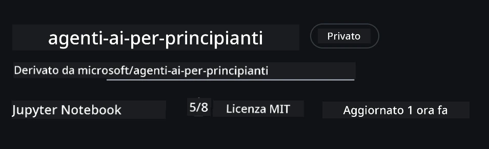
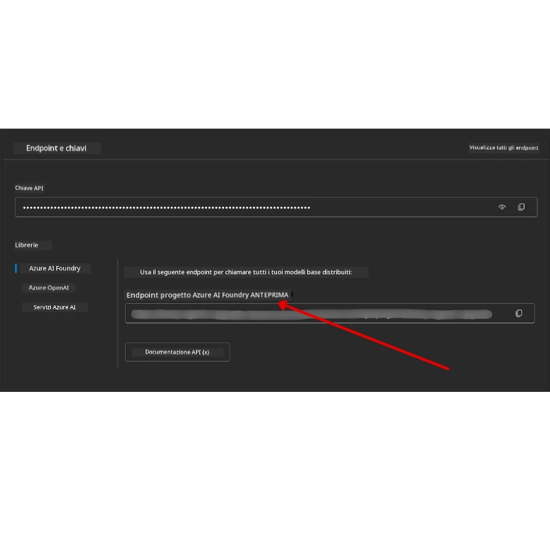

# Configurazione del corso

## Introduzione

Questa lezione spiegherà come eseguire gli esempi di codice di questo corso.

## Unisciti ad altri partecipanti e ottieni aiuto

Prima di iniziare a clonare il tuo repo, unisciti al [Canale Discord AI Agents For Beginners](https://aka.ms/ai-agents/discord) per ottenere aiuto con la configurazione, porre domande sul corso o connetterti con altri partecipanti.

## Clona o fai il fork di questo repository

Per iniziare, clona o crea un fork del repository GitHub. Questo creerà la tua versione del materiale del corso in modo da poter eseguire, testare e modificare il codice!

This can be done by clicking the link to <a href="https://github.com/microsoft/ai-agents-for-beginners/fork" target="_blank">fai il fork del repository</a>

You should now have your own forked version of this course in the following link:



### Shallow Clone (consigliato per workshop / Codespaces)

  >Il repository completo può essere grande (~3 GB) quando scarichi tutta la history e tutti i file. Se stai partecipando solo al workshop o hai bisogno di poche cartelle delle lezioni, una clonazione superficiale (o una clonazione sparse) evita la maggior parte di quel download accorciando la history e/o saltando i blob.

#### Clonazione superficiale rapida — cronologia minima, tutti i file

Replace `<your-username>` in the below commands with your fork URL (or the upstream URL if you prefer).

To clone only the latest commit history (small download):

```bash|powershell
git clone --depth 1 https://github.com/<your-username>/ai-agents-for-beginners.git
```

To clone a specific branch:

```bash|powershell
git clone --depth 1 --branch <branch-name> https://github.com/<your-username>/ai-agents-for-beginners.git
```

#### Clonazione parziale (sparse) — blob minimi + solo cartelle selezionate

This uses partial clone and sparse-checkout (requires Git 2.25+ and recommended modern Git with partial clone support):

```bash|powershell
git clone --depth 1 --filter=blob:none --sparse https://github.com/<your-username>/ai-agents-for-beginners.git
```

Traverse into the repo folder:

```bash|powershell
cd ai-agents-for-beginners
```

Then specify which folders you want (example below shows two folders):

```bash|powershell
git sparse-checkout set 00-course-setup 01-intro-to-ai-agents
```

After cloning and verifying the files, if you only need files and want to free space (no git history), please delete the repository metadata (💀irreversible — you will lose all Git functionality: no commits, pulls, pushes, or history access).

```bash
# zsh/bash
rm -rf .git
```

```powershell
# PowerShell
Remove-Item -Recurse -Force .git
```

#### Utilizzo di GitHub Codespaces (consigliato per evitare grandi download locali)

- Create a new Codespace for this repo via the [GitHub UI](https://github.com/codespaces).  

- In the terminal of the newly created codespace, run one of the shallow/sparse clone commands above to bring only the lesson folders you need into the Codespace workspace.
- Optional: after cloning inside Codespaces, remove .git to reclaim extra space (see removal commands above).
- Note: If you prefer to open the repo directly in Codespaces (without an extra clone), be aware Codespaces will construct the devcontainer environment and may still provision more than you need. Cloning a shallow copy inside a fresh Codespace gives you more control over disk usage.

#### Suggerimenti

- Always replace the clone URL with your fork if you want to edit/commit.
- If you later need more history or files, you can fetch them or adjust sparse-checkout to include additional folders.

## Eseguire il codice

Questo corso offre una serie di Jupyter Notebook che puoi eseguire per ottenere esperienza pratica nella costruzione di AI Agents.

The code samples use **Microsoft Agent Framework (MAF)** with the `AzureAIProjectAgentProvider`, which connects to **Azure AI Agent Service V2** (the Responses API) through **Microsoft Foundry**.

All Python notebooks are labelled `*-python-agent-framework.ipynb`.

## Requisiti

- Python 3.12+
  - **NOTA**: Se non hai Python3.12 installato, assicurati di installarlo. Poi crea il tuo venv usando python3.12 per assicurarti che le versioni corrette vengano installate dal file requirements.txt.
  
    >Esempio

    Create Python venv directory:

    ```bash|powershell
    python -m venv venv
    ```

    Then activate venv environment for:

    ```bash
    # zsh/bash
    source venv/bin/activate
    ```
  
    ```dos
    # Command Prompt for Windows
    venv\Scripts\activate
    ```

- .NET 10+: For the sample codes using .NET, ensure you install [.NET 10 SDK](https://dotnet.microsoft.com/download/dotnet/10.0) or later. Then, check your installed .NET SDK version:

    ```bash|powershell
    dotnet --list-sdks
    ```

- **Azure CLI** — Richiesto per l'autenticazione. Installalo da [aka.ms/installazurecli](https://aka.ms/installazurecli).
- **Azure Subscription** — Per l'accesso a Microsoft Foundry e Azure AI Agent Service.
- **Microsoft Foundry Project** — Un progetto con un modello distribuito (ad es., `gpt-4o`). Vedi [Passo 1](../../../00-course-setup) sotto.

Abbiamo incluso un file `requirements.txt` nella root di questo repository che contiene tutti i pacchetti Python necessari per eseguire gli esempi di codice.

Puoi installarli eseguendo il seguente comando nel terminale alla radice del repository:

```bash|powershell
pip install -r requirements.txt
```

Raccomandiamo di creare un ambiente virtuale Python per evitare conflitti e problemi.

## Configura VSCode

Assicurati di utilizzare la versione corretta di Python in VSCode.


## Configurare Microsoft Foundry e Azure AI Agent Service

### Passo 1: Crea un progetto Microsoft Foundry

Hai bisogno di un **hub** e un **project** in Azure AI Foundry con un modello distribuito per eseguire i notebook.

1. Vai su [ai.azure.com](https://ai.azure.com) e accedi con il tuo account Azure.
2. Crea un **hub** (o usa uno esistente). Vedi: [Hub resources overview](https://learn.microsoft.com/azure/ai-foundry/concepts/ai-resources).
3. All'interno dell'hub, crea un **project**.
4. Distribuisci un modello (ad es., `gpt-4o`) da **Models + Endpoints** → **Deploy model**.

### Passo 2: Recupera l'endpoint del progetto e il nome della distribuzione del modello

Dal tuo progetto nel portale Microsoft Foundry:

- **Project Endpoint** — Vai alla pagina **Overview** e copia l'URL dell'endpoint.



- **Model Deployment Name** — Vai su **Models + Endpoints**, seleziona il modello distribuito e annota il **Deployment name** (ad es., `gpt-4o`).

### Passo 3: Accedi ad Azure con `az login`

Tutti i notebook utilizzano **`AzureCliCredential`** per l'autenticazione — nessuna chiave API da gestire. Questo richiede che tu sia autenticato tramite Azure CLI.

1. **Installa l'Azure CLI** se non l'hai già fatto: [aka.ms/installazurecli](https://aka.ms/installazurecli)

2. **Accedi** eseguendo:

    ```bash|powershell
    az login
    ```

    Or if you're in a remote/Codespace environment without a browser:

    ```bash|powershell
    az login --use-device-code
    ```

3. **Seleziona la sottoscrizione** se richiesto — scegli quella che contiene il tuo progetto Foundry.

4. **Verifica** di essere connesso:

    ```bash|powershell
    az account show
    ```

> **Perché `az login`?** I notebook si autenticano usando `AzureCliCredential` dal pacchetto `azure-identity`. Questo significa che la tua sessione Azure CLI fornisce le credenziali — nessuna chiave API o secret nel tuo file `.env`. Questa è una [buona pratica di sicurezza](https://learn.microsoft.com/azure/developer/ai/keyless-connections).

### Passo 4: Crea il tuo file `.env`

Copia il file di esempio:

```bash
# zsh/bash
cp .env.example .env
```

```powershell
# PowerShell
Copy-Item .env.example .env
```

Apri `.env` e compila questi due valori:

```env
AZURE_AI_PROJECT_ENDPOINT=https://<your-project>.services.ai.azure.com/api/projects/<your-project-id>
AZURE_AI_MODEL_DEPLOYMENT_NAME=gpt-4o
```

| Variabile | Dove trovarla |
|----------|-----------------|
| `AZURE_AI_PROJECT_ENDPOINT` | Foundry portal → your project → **Overview** page |
| `AZURE_AI_MODEL_DEPLOYMENT_NAME` | Foundry portal → **Models + Endpoints** → your deployed model's name |

Questo è tutto per la maggior parte delle lezioni! I notebook si autenticheranno automaticamente tramite la tua sessione `az login`.

### Passo 5: Installa le dipendenze Python

```bash|powershell
pip install -r requirements.txt
```

Consigliamo di eseguire questo all'interno dell'ambiente virtuale che hai creato in precedenza.

## Configurazione aggiuntiva per la Lezione 5 (Agentic RAG)

La Lezione 5 utilizza **Azure AI Search** per la generazione aumentata dal retrieval. Se prevedi di eseguire quella lezione, aggiungi queste variabili al tuo file `.env`:

| Variabile | Dove trovarla |
|----------|-----------------|
| `AZURE_SEARCH_SERVICE_ENDPOINT` | Azure portal → your **Azure AI Search** resource → **Overview** → URL |
| `AZURE_SEARCH_API_KEY` | Azure portal → your **Azure AI Search** resource → **Settings** → **Keys** → primary admin key |

## Configurazione aggiuntiva per le Lezioni 6 e 8 (Modelli GitHub)

Alcuni notebook nelle lezioni 6 e 8 utilizzano **GitHub Models** invece di Azure AI Foundry. Se prevedi di eseguire quegli esempi, aggiungi queste variabili al tuo file `.env`:

| Variabile | Dove trovarla |
|----------|-----------------|
| `GITHUB_TOKEN` | GitHub → **Settings** → **Developer settings** → **Personal access tokens** |
| `GITHUB_ENDPOINT` | Use `https://models.inference.ai.azure.com` (default value) |
| `GITHUB_MODEL_ID` | Model name to use (e.g. `gpt-4o-mini`) |

## Configurazione aggiuntiva per la Lezione 8 (Bing Grounding Workflow)

Il notebook del workflow condizionale nella lezione 8 utilizza il **Bing grounding** tramite Azure AI Foundry. Se prevedi di eseguire quell'esempio, aggiungi questa variabile al tuo file `.env`:

| Variabile | Dove trovarla |
|----------|-----------------|
| `BING_CONNECTION_ID` | Azure AI Foundry portal → your project → **Management** → **Connected resources** → your Bing connection → copy the connection ID |

## Risoluzione dei problemi

### Errori di verifica del certificato SSL su macOS

Se sei su macOS e incontri un errore come:

```plaintext
ssl.SSLCertVerificationError: [SSL: CERTIFICATE_VERIFY_FAILED] certificate verify failed: self-signed certificate in certificate chain
```

Questo è un problema noto con Python su macOS in cui i certificati SSL del sistema non sono automaticamente considerati attendibili. Prova le seguenti soluzioni in ordine:

**Opzione 1: Esegui lo script Install Certificates di Python (consigliato)**

```bash
# Sostituisci 3.XX con la versione di Python installata (es. 3.12 o 3.13):
/Applications/Python\ 3.XX/Install\ Certificates.command
```

**Opzione 2: Usa `connection_verify=False` nel tuo notebook (solo per i notebook dei Modelli GitHub)**

Nel notebook della Lezione 6 (`06-building-trustworthy-agents/code_samples/06-system-message-framework.ipynb`), è già incluso un workaround commentato. Decommenta `connection_verify=False` quando crei il client:

```python
client = ChatCompletionsClient(
    endpoint=endpoint,
    credential=AzureKeyCredential(token),
    connection_verify=False,  # Disabilita la verifica SSL se riscontri errori di certificato
)
```

> **⚠️ Avviso:** Disabilitare la verifica SSL (`connection_verify=False`) riduce la sicurezza saltando la validazione del certificato. Usa questo solo come soluzione temporanea in ambienti di sviluppo, mai in produzione.

**Opzione 3: Installa e usa `truststore`**

```bash
pip install truststore
```

Poi aggiungi quanto segue all'inizio del notebook o dello script prima di effettuare chiamate di rete:

```python
import truststore
truststore.inject_into_ssl()
```

## Bloccato da qualche parte?

Se hai problemi nell'eseguire questa configurazione, entra nel <a href="https://discord.gg/kzRShWzttr" target="_blank">Discord della community Azure AI</a> o <a href="https://github.com/microsoft/ai-agents-for-beginners/issues?WT.mc_id=academic-105485-koreyst" target="_blank">apri un'issue</a>.

## Lezione successiva

Ora sei pronto per eseguire il codice di questo corso. Buon apprendimento nel mondo degli AI Agents! 

[Introduzione agli AI Agents e casi d'uso](../01-intro-to-ai-agents/README.md)

---

<!-- CO-OP TRANSLATOR DISCLAIMER START -->
Dichiarazione di non responsabilità:
Questo documento è stato tradotto utilizzando il servizio di traduzione automatica con intelligenza artificiale Co-op Translator (https://github.com/Azure/co-op-translator). Sebbene ci impegniamo per l'accuratezza, si tenga presente che le traduzioni automatiche possono contenere errori o imprecisioni. Il documento originale nella sua lingua nativa dovrebbe essere considerato la fonte autorevole. Per informazioni critiche, si consiglia di ricorrere a una traduzione professionale eseguita da un traduttore umano. Non siamo responsabili per eventuali malintesi o interpretazioni errate derivanti dall'uso di questa traduzione.
<!-- CO-OP TRANSLATOR DISCLAIMER END -->