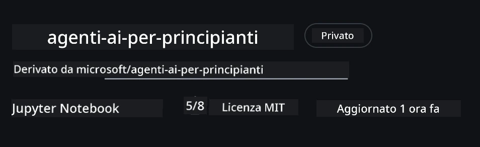
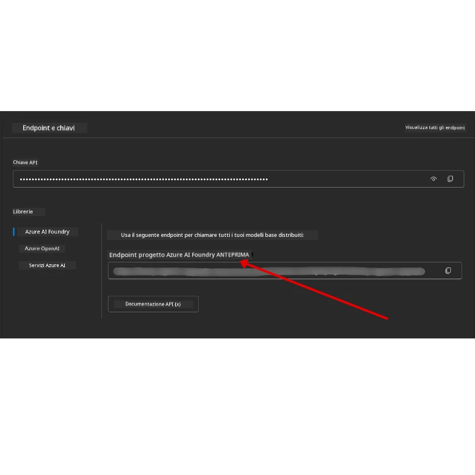

# Configurazione del Corso

## Introduzione

Questa lezione spiegherà come eseguire gli esempi di codice di questo corso.

## Unisciti ad Altri Studenti e Ricevi Aiuto

Prima di iniziare a clonare il tuo repository, unisciti al [canale Discord AI Agents For Beginners](https://aka.ms/ai-agents/discord) per ricevere aiuto con la configurazione, porre domande sul corso o connetterti con altri studenti.

## Clona o Fai il Fork di questo Repo

Per iniziare, clona o fai il fork del repository GitHub. In questo modo avrai la tua versione del materiale del corso per poter eseguire, testare e modificare il codice!

Puoi farlo cliccando sul link per <a href="https://github.com/microsoft/ai-agents-for-beginners/fork" target="_blank">fare il fork del repo</a>

Ora dovresti avere la tua versione forkata di questo corso al seguente link:



### Clonazione superficiale (consigliata per workshop / Codespaces)

  >Il repository completo può essere grande (~3 GB) se scarichi tutta la cronologia e tutti i file. Se partecipi solo al workshop o hai bisogno solo di alcune cartelle di lezione, una clonazione superficiale (o clone sparso) scarica molto meno.

#### Clonazione superficiale veloce — cronologia minima, tutti i file

Sostituisci `<your-username>` nei comandi sottostanti con l'URL del tuo fork (o l'URL upstream se preferisci).

Per clonare solo la cronologia del commit più recente (download ridotto):

```bash
git clone --depth 1 https://github.com/<your-username>/ai-agents-for-beginners.git
```

Per clonare un ramo specifico:

```bash
git clone --depth 1 --branch <branch-name> https://github.com/<your-username>/ai-agents-for-beginners.git
```

#### Clonazione parziale (sparsa) — blob minimi + solo cartelle selezionate

Questo usa clonazione parziale e sparse-checkout (richiede Git 2.25+ e un Git moderno con supporto clonazione parziale):

```bash
git clone --depth 1 --filter=blob:none --sparse https://github.com/<your-username>/ai-agents-for-beginners.git
```

Spostati nella cartella del repo:

```bash
cd ai-agents-for-beginners
```

Poi specifica quali cartelle vuoi (l'esempio sotto mostra due cartelle):

```bash
git sparse-checkout set 00-course-setup 01-intro-to-ai-agents
```

Dopo aver clonato e verificato i file, se hai bisogno solo dei file e vuoi liberare spazio (niente cronologia git), elimina i metadati del repository (💀irreversibile — perderai tutte le funzionalità Git):

```bash
# zsh/bash
rm -rf .git
```

```powershell
# PowerShell
Remove-Item -Recurse -Force .git
```

#### Usare GitHub Codespaces (consigliato per evitare grandi download locali)

- Crea un nuovo Codespace per questo repo tramite l'[interfaccia GitHub](https://github.com/codespaces).  

- Nel terminale del codespace appena creato, esegui uno dei comandi di clonazione superficiale/sparsa sopra per portare solo le cartelle delle lezioni che ti servono nello spazio di lavoro Codespace.
- Opzionale: dopo la clonazione in Codespaces, rimuovi .git per recuperare spazio extra (vedi i comandi di rimozione sopra).
- Nota: se preferisci aprire il repo direttamente in Codespaces (senza ulteriore clonazione), considera che Codespaces costruirà l'ambiente devcontainer e potrebbe comunque predisporre più di quanto ti serve.

#### Suggerimenti

- Sostituisci sempre l'URL di clonazione con il tuo fork se vuoi modificare/commitare.
- Se in seguito ti servono più cronologia o file, puoi recuperarli o modificare sparse-checkout per includere cartelle aggiuntive.

## Esecuzione del Codice

Questo corso offre una serie di Jupyter Notebooks che puoi eseguire per fare esperienza pratica nella costruzione di AI Agents.

Gli esempi di codice utilizzano **Microsoft Agent Framework (MAF)** con `FoundryChatClient`, che si collega a **Microsoft Foundry Agent Service V2** (l'API Responses) tramite **Microsoft Foundry**.

Tutti i notebook Python sono etichettati `*-python-agent-framework.ipynb`.

## Requisiti

- Python 3.12+
  - **NOTA**: Se non hai Python3.12 installato, assicurati di installarlo. Poi crea il tuo venv usando python3.12 per garantire che vengano installate le versioni corrette dal file requirements.txt.
  
    >Esempio

    Crea la directory venv Python:

    ```bash
    python -m venv venv
    ```

    Poi attiva l'ambiente venv per:

    ```bash
    # zsh/bash
    source venv/bin/activate
    ```
  
    ```dos
    # Command Prompt for Windows
    venv\Scripts\activate
    ```

- .NET 10+: Per i codici di esempio che usano .NET, assicurati di installare [.NET 10 SDK](https://dotnet.microsoft.com/download/dotnet/10.0) o versione successiva. Poi, verifica la versione del SDK .NET installata:

    ```bash
    dotnet --list-sdks
    ```

- **Azure CLI** — Necessaria per l'autenticazione. Installa da [aka.ms/installazurecli](https://aka.ms/installazurecli).
- **Sottoscrizione Azure** — Per l'accesso a Microsoft Foundry e Microsoft Foundry Agent Service.
- **Progetto Microsoft Foundry** — Un progetto con un modello distribuito (es. `gpt-5-mini`). Vedi [Passo 1](#passo-1-crea-un-progetto-microsoft-foundry) sotto.

Abbiamo incluso un file `requirements.txt` nella root di questo repository che contiene tutti i pacchetti Python necessari per eseguire gli esempi di codice.

Puoi installarli eseguendo il seguente comando nel terminale alla root del repository:

```bash
pip install -r requirements.txt
```

Consigliamo di creare un ambiente virtuale Python per evitare conflitti e problemi.

## Configura VSCode

Assicurati di usare la versione corretta di Python in VSCode.


## Configura Microsoft Foundry e Microsoft Foundry Agent Service

### Passo 1: Crea un Progetto Microsoft Foundry

Hai bisogno di un **hub** e di un **progetto** Microsoft Foundry con un modello distribuito per eseguire i notebook.

1. Vai su [ai.azure.com](https://ai.azure.com) e accedi con il tuo account Azure.
2. Crea un **hub** (o usa uno esistente). Vedi: [Panoramica delle risorse hub](https://learn.microsoft.com/azure/ai-foundry/concepts/ai-resources).
3. All'interno dell'hub, crea un **progetto**.
4. Distribuisci un modello (es. `gpt-5-mini`) da **Models + Endpoints** → **Deploy model**.

### Passo 2: Recupera l'Endpoint del Progetto e il Nome della Distribuzione del Modello

Dal tuo progetto nel portale Microsoft Foundry:

- **Endpoint del Progetto** — Vai alla pagina **Overview** e copia l'URL dell'endpoint.



- **Nome della Distribuzione del Modello** — Vai a **Models + Endpoints**, seleziona il tuo modello distribuito e annota il **Deployment name** (es. `gpt-5-mini`).

### Passo 3: Accedi ad Azure con `az login`

La maggior parte dei notebook si autentica tramite il **login Azure CLI** — usando `AzureCliCredential` o `DefaultAzureCredential` (entrambi usano la sessione `az login`) dal pacchetto `azure-identity` — quindi non richiedono chiavi API. Alcune lezioni e integrazioni opzionali usano chiavi API; verifica i prerequisiti di ciascuna lezione per eventuali variabili ambientali aggiuntive. È necessario essere autenticati tramite Azure CLI.

1. **Installa Azure CLI** se non l'hai fatto: [aka.ms/installazurecli](https://aka.ms/installazurecli)

2. **Accedi** eseguendo:

    ```bash
    az login
    ```

    Oppure se sei in un ambiente remoto/Codespace senza browser:

    ```bash
    az login --use-device-code
    ```

3. **Seleziona la tua sottoscrizione** se richiesto — scegli quella con il progetto Foundry.

4. **Verifica** che sei autenticato:

    ```bash
    az account show
    ```

> **Perché `az login`?** I notebook si autenticano usando `AzureCliCredential` (o `DefaultAzureCredential`, che usa anche il login Azure CLI) dal pacchetto `azure-identity`. Questo significa che la sessione Azure CLI fornisce le credenziali — nessuna chiave API o segreto nel file `.env`. Questa è una [buona pratica di sicurezza](https://learn.microsoft.com/azure/developer/ai/keyless-connections).

### Passo 4: Crea il file `.env`

Copia il file di esempio:

```bash
# zsh/bash
cp .env.example .env
```

```powershell
# PowerShell
Copy-Item .env.example .env
```

Apri `.env` e compila questi due valori:

```env
AZURE_AI_PROJECT_ENDPOINT=https://<your-project>.services.ai.azure.com/api/projects/<your-project-id>
AZURE_AI_MODEL_DEPLOYMENT_NAME=gpt-5-mini
```

| Variabile | Dove trovarla |
|----------|-----------------|
| `AZURE_AI_PROJECT_ENDPOINT` | Portale Foundry → il tuo progetto → pagina **Overview** |
| `AZURE_AI_MODEL_DEPLOYMENT_NAME` | Portale Foundry → **Models + Endpoints** → nome del modello distribuito |

Questo è tutto per la maggior parte delle lezioni! I notebook si autenticheranno automaticamente tramite la sessione `az login`.

### Passo 5: Installa le Dipendenze Python

```bash
pip install -r requirements.txt
```

Consigliamo di eseguire questo dentro l'ambiente virtuale che hai creato prima.

## Configurazione Opzionale: Azure AI Search (Lezioni 5 e 16)

Le lezioni 5 (Agentic RAG) e 16 funzionano immediatamente con una **base di conoscenza in memoria** — nessuna risorsa Azure extra necessaria. Se vuoi supportarle con un vero indice **Azure AI Search**, nota che il **notebook della Lezione 16 al momento usa l'autenticazione con chiave API**: passa dalla ricerca in memoria ad Azure AI Search solo se **entrambi** `AZURE_SEARCH_SERVICE_ENDPOINT` **e** `AZURE_SEARCH_API_KEY` sono impostati, altrimenti resta alla ricerca in memoria — quindi per usarlo con un indice reale devi impostare anche la chiave di amministratore. L'autenticazione senza chiavi con Microsoft Entra ID (RBAC) è l'approccio consigliato per il tuo codice di produzione, coerente con il flusso `az login` usato in tutto il corso.

I passaggi RBAC seguenti si applicano agli esempi della guida di installazione e al tuo codice personale. Non abilitano l'autenticazione senza chiavi nel notebook della Lezione 16; questa lezione richiede ancora endpoint e chiave amministratore per usare Azure AI Search.

1. **Abilita l'accesso basato sui ruoli** sul tuo servizio di ricerca:

    ```bash
    az search service update --name <service-name> --resource-group <resource-group> --auth-options aadOrApiKey
    ```

2. **Assegna a te stesso i ruoli richiesti** (creare/caricare indici e interrogare):

    ```bash
    az role assignment create --assignee <your-user-or-principal-id> --role "Search Service Contributor" --scope $(az search service show -g <resource-group> -n <service-name> --query id -o tsv)
    az role assignment create --assignee <your-user-or-principal-id> --role "Search Index Data Contributor" --scope $(az search service show -g <resource-group> -n <service-name> --query id -o tsv)
    ```

3. **Aggiungi l'endpoint** al tuo file `.env`:

| Variabile | Dove trovarla |
|----------|-----------------|
| `AZURE_SEARCH_SERVICE_ENDPOINT` | Portale Azure → tua risorsa **Azure AI Search** → **Overview** → URL |
| `AZURE_SEARCH_API_KEY` | Necessaria (insieme all'endpoint) per abilitare Azure AI Search nel notebook Lezione 16 che usa autenticazione con chiave. Portale Azure → **Settings** → **Keys** → chiave amministratore primaria |

> **Perché senza chiavi?** Le chiavi amministratore concedono pieno accesso in scrittura al servizio di ricerca e possono fuoriuscire tramite i file `.env`. Con RBAC viene usata invece la tua identità di `az login` — lo stesso schema Entra ID senza chiavi usato nei notebook del corso (tramite `AzureCliCredential` / `DefaultAzureCredential`). Vedi [Connettersi ad Azure AI Search usando i ruoli](https://learn.microsoft.com/azure/search/search-security-rbac).

Vedi la [guida di configurazione Azure AI Search](./AzureSearch.md) per esempi completi di creazione indici in Python e .NET.

## Configurazione Aggiuntiva per Lezioni che Chiamano Direttamente Azure OpenAI (Lezioni 6 e 8)

Alcuni notebook nelle lezioni 6 e 8 chiamano **Azure OpenAI** direttamente (usando la **Responses API**) invece di passare da un progetto Microsoft Foundry. Questi esempi usavano precedentemente GitHub Models, che è deprecato e non supporta la Responses API. Aggiungi queste variabili al file `.env`:

| Variabile | Dove trovarla |
|----------|-----------------|
| `AZURE_OPENAI_ENDPOINT` | Portale Azure → tua risorsa **Azure OpenAI** → **Keys and Endpoint** → Endpoint (es. `https://<your-resource>.openai.azure.com`) |
| `AZURE_OPENAI_DEPLOYMENT` | Nome del modello distribuito (es. `gpt-5-mini`) che supporta Responses API |
| `AZURE_OPENAI_API_KEY` | Opzionale — solo se usi autenticazione con chiave invece di `az login` / Entra ID |

> La Responses API usa l'endpoint stabile `/openai/v1/`, quindi non serve `api-version`. Accedi con `az login` per usare l'autenticazione Entra ID senza chiavi.

## Provider Alternativo: MiniMax (Compatibile OpenAI)

[MiniMax](https://platform.minimaxi.com/) offre modelli a contesto ampio (fino a 204K token) tramite un'API compatibile OpenAI. Poiché il `OpenAIChatClient` del Microsoft Agent Framework funziona con qualsiasi endpoint compatibile OpenAI, puoi usare MiniMax come alternativa diretta per le lezioni che usano `OpenAIChatClient`.

Aggiungi queste variabili al file `.env`:

| Variabile | Dove trovarla |
|----------|-----------------|
| `MINIMAX_API_KEY` | [Piattaforma MiniMax](https://platform.minimaxi.com/) → Chiavi API |
| `MINIMAX_BASE_URL` | Usa `https://api.minimax.io/v1` (valore predefinito) |
| `MINIMAX_MODEL_ID` | Nome modello da usare (es. `MiniMax-M3`) |

**Modelli di esempio**: `MiniMax-M3` (consigliato), `MiniMax-M2.7`, `MiniMax-M2.7-highspeed` (risposte più veloci). I nomi modelli e disponibilità possono cambiare nel tempo e l'accesso a un modello può dipendere dal tuo account.

Gli esempi che usano `OpenAIChatClient` (es. flusso di prenotazione hotel della Lezione 14) rileveranno automaticamente e useranno la tua configurazione MiniMax se `MINIMAX_API_KEY` è impostato.


## Fornitore Alternativo: Foundry Local (Esegui Modelli sul Dispositivo)

[Foundry Local](https://foundrylocal.ai) è un runtime leggero che scarica, gestisce e serve modelli di linguaggio **interamente sul tuo computer** tramite un'API compatibile con OpenAI — senza bisogno del cloud.

Poiché `OpenAIChatClient` del Microsoft Agent Framework funziona con qualsiasi endpoint compatibile OpenAI, Foundry Local è un'alternativa locale pronta all'uso ad Azure OpenAI.

**1. Installa Foundry Local**

```bash
# Windows
winget install Microsoft.FoundryLocal

# macOS
brew install foundrylocal
```

**2. Scarica ed esegui un modello** (questo avvia anche il servizio locale):

```bash
foundry model list          # vedi modelli disponibili
foundry model run phi-4-mini
```

**3. Installa lo SDK Python** usato per scoprire l'endpoint locale:

```bash
pip install foundry-local-sdk
```

**4. Punta il Microsoft Agent Framework al tuo modello locale:**

```python
from foundry_local import FoundryLocalManager
from agent_framework.openai import OpenAIChatClient

# Scarica (se necessario) e serve il modello localmente, poi scopre l'endpoint/porta.
manager = FoundryLocalManager("phi-4-mini")

chat_client = OpenAIChatClient(
    base_url=manager.endpoint,      # es. http://localhost:<port>/v1
    api_key=manager.api_key,        # sempre "non richiesto" per Foundry Local
    model_id=manager.get_model_info("phi-4-mini").id,
)

agent = chat_client.as_agent(
    name="LocalAgent",
    instructions="You are a helpful assistant running fully on-device.",
)
```

> **Nota:** Foundry Local espone un endpoint **Chat Completions** compatibile con OpenAI. Usalo per sviluppo locale e scenari offline. Per l'intera gamma di funzionalità della **Responses API** (conversazioni stateful, ecc.), usa Azure OpenAI o un progetto Microsoft Foundry.

## Configurazione Aggiuntiva per la Lezione 8 (Workflow di Bing Grounding)

Il notebook del workflow condizionale nella lezione 8 usa il **Bing grounding** tramite Microsoft Foundry. Se intendi eseguire quell'esempio, aggiungi questa variabile al tuo file `.env`:

| Variabile | Dove trovarla |
|----------|--------------|
| `BING_CONNECTION_ID` | Portale Microsoft Foundry → il tuo progetto → **Management** → **Connected resources** → la tua connessione Bing → copia l'ID della connessione |

## Risoluzione dei Problemi

### Errori di Verifica Certificato SSL su macOS

Se sei su macOS e incontri un errore come:

```plaintext
ssl.SSLCertVerificationError: [SSL: CERTIFICATE_VERIFY_FAILED] certificate verify failed: self-signed certificate in certificate chain
```

Questo è un problema noto con Python su macOS dove i certificati SSL di sistema non sono automaticamente considerati affidabili. Prova le seguenti soluzioni in ordine:

**Opzione 1: Esegui lo script Install Certificates di Python (consigliato)**

```bash
# Sostituisci 3.XX con la versione di Python installata (es. 3.12 o 3.13):
/Applications/Python\ 3.XX/Install\ Certificates.command
```

**Opzione 2: Usa `connection_verify=False` nel tuo notebook (solo per notebook GitHub Models)**

Nel notebook della Lezione 6 (`06-building-trustworthy-agents/code_samples/06-system-message-framework.ipynb`), è già incluso un workaround commentato. Decommenta `connection_verify=False` quando incontri errori di certificato:

```python
client = ChatCompletionsClient(
    endpoint=endpoint,
    credential=AzureKeyCredential(token),
    connection_verify=False,  # Disabilita la verifica SSL se incontri errori di certificato
)
```

> **⚠️ Attenzione:** Disabilitare la verifica SSL (`connection_verify=False`) riduce la sicurezza saltando la validazione del certificato. Usalo solo come soluzione temporanea in ambienti di sviluppo. Non usarlo mai in produzione.

**Opzione 3: Installa e usa `truststore`**

```bash
pip install truststore
```

Poi aggiungi quanto segue all'inizio del tuo notebook o script prima di fare qualunque chiamata di rete:

```python
import truststore
truststore.inject_into_ssl()
```

## Bloccato da qualche parte?

Se hai problemi a eseguire questa configurazione, entra nel nostro <a href="https://discord.gg/kzRShWzttr" target="_blank">Azure AI Community Discord</a> o <a href="https://github.com/microsoft/ai-agents-for-beginners/issues?WT.mc_id=academic-105485-koreyst" target="_blank">crea un issue</a>.

## Prossima Lezione

Ora sei pronto per eseguire il codice di questo corso. Buono studio nel mondo degli AI Agents!

[Introduzione agli AI Agents e Casi d'Uso degli Agent](../01-intro-to-ai-agents/README.md)

---

<!-- CO-OP TRANSLATOR DISCLAIMER START -->
**Disclaimer**:
Questo documento è stato tradotto utilizzando il servizio di traduzione AI [Co-op Translator](https://github.com/Azure/co-op-translator). Sebbene ci impegniamo per garantire la precisione, si prega di notare che le traduzioni automatizzate possono contenere errori o imprecisioni. Il documento originale nella sua lingua nativa deve essere considerato la fonte autorevole. Per informazioni critiche, si raccomanda una traduzione professionale effettuata da un essere umano. Non siamo responsabili per eventuali malintesi o interpretazioni errate derivanti dall’uso di questa traduzione.
<!-- CO-OP TRANSLATOR DISCLAIMER END -->