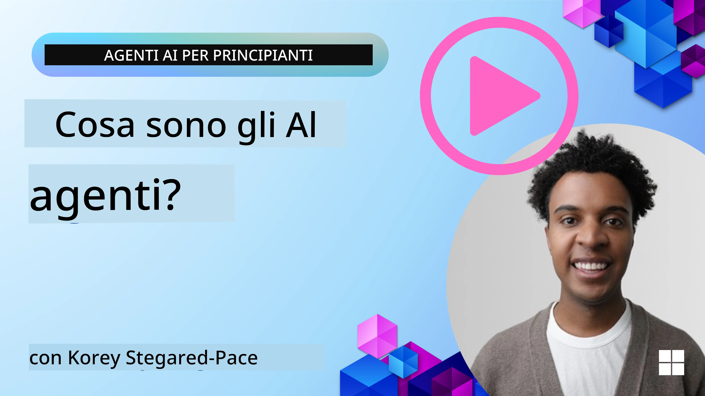
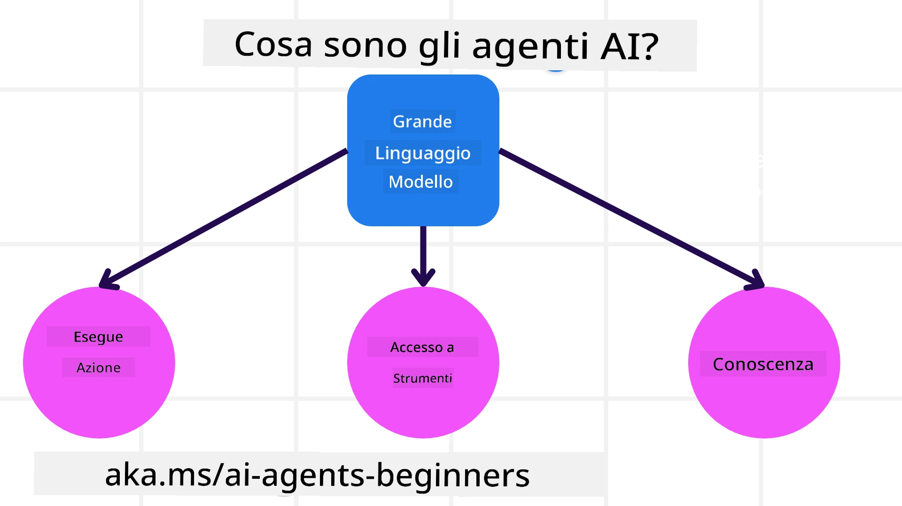
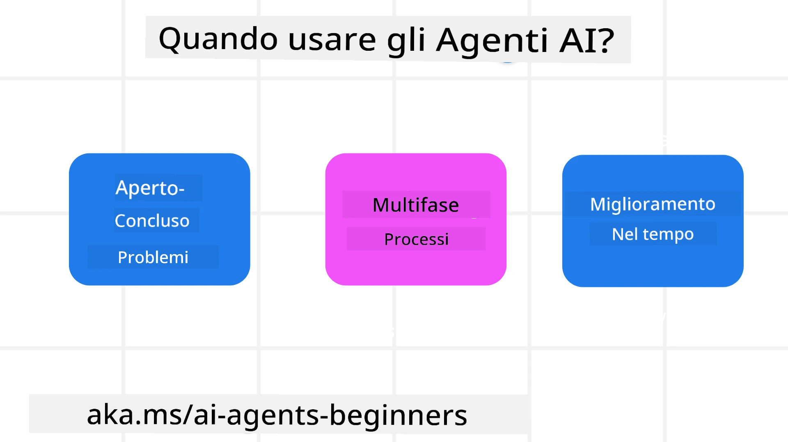

> _(Fai clic sull'immagine sopra per visualizzare il video di questa lezione)_

# Introduzione agli agenti AI e casi d'uso degli agenti

Benvenuto nel corso "AI Agents for Beginners"! Questo corso fornisce conoscenze fondamentali e esempi applicati per costruire agenti AI.

Unisciti alla <a href="https://discord.gg/kzRShWzttr" target="_blank">Community Discord di Azure AI</a> per incontrare altri studenti e sviluppatori di agenti AI e porre qualsiasi domanda tu abbia su questo corso.

Per iniziare questo corso, cominciamo col comprendere meglio cosa sono gli agenti AI e come possiamo usarli nelle applicazioni e nei flussi di lavoro che costruiamo.

## Introduzione

Questa lezione copre:

- Cosa sono gli agenti AI e quali sono i diversi tipi di agenti?
- Quali casi d'uso sono più adatti per gli agenti AI e in che modo possono aiutarci?
- Quali sono alcuni dei blocchi di base nella progettazione di soluzioni agentiche?

## Obiettivi di apprendimento
Dopo aver completato questa lezione dovresti essere in grado di:

- Comprendere i concetti degli agenti AI e come si differenziano da altre soluzioni AI.
- Applicare gli agenti AI nel modo più efficiente.
- Progettare soluzioni agentiche in modo produttivo sia per gli utenti che per i clienti.

## Definizione di agenti AI e tipologie di agenti AI

### Cosa sono gli agenti AI?

Gli agenti AI sono **sistemi** che consentono ai **Large Language Models (LLMs)** di **eseguire azioni** estendendo le loro capacità dando ai LLM **accesso a strumenti** e **conoscenze**.

Scomponiamo questa definizione in parti più piccole:

- **Sistema** - È importante considerare gli agenti non come un singolo componente ma come un sistema di molti componenti. Al livello base, i componenti di un agente AI sono:
  - **Ambiente** - Lo spazio definito in cui l'agente AI opera. Per esempio, se avessimo un agente di prenotazione viaggi, l'ambiente potrebbe essere il sistema di prenotazione di viaggi che l'agente AI usa per completare le attività.
  - **Sensori** - Gli ambienti hanno informazioni e forniscono feedback. Gli agenti AI usano i sensori per raccogliere e interpretare queste informazioni sullo stato corrente dell'ambiente. Nell'esempio dell'agente di prenotazione viaggi, il sistema di prenotazione può fornire informazioni come la disponibilità degli hotel o i prezzi dei voli.
  - **Attuatori** - Una volta che l'agente AI riceve lo stato corrente dell'ambiente, per il compito attuale l'agente determina quale azione eseguire per modificare l'ambiente. Per l'agente di prenotazione viaggi, potrebbe trattarsi di prenotare una stanza disponibile per l'utente.

**Modelli di Linguaggio di Grandi Dimensioni (LLMs)** - Il concetto di agenti esisteva prima della creazione dei LLM. Il vantaggio di costruire agenti AI con i LLM è la loro capacità di interpretare il linguaggio umano e i dati. Questa capacità permette ai LLM di interpretare le informazioni ambientali e definire un piano per modificare l'ambiente.

**Eseguire Azioni** - Al di fuori dei sistemi di agenti AI, i LLM sono limitati a situazioni in cui l'azione è generare contenuti o informazioni basate sul prompt dell'utente. All'interno di sistemi agentici, i LLM possono portare a termine compiti interpretando la richiesta dell'utente e utilizzando strumenti disponibili nel loro ambiente.

**Accesso agli Strumenti** - Quali strumenti il LLM può usare è definito da 1) l'ambiente in cui opera e 2) lo sviluppatore dell'agente AI. Per il nostro esempio dell'agente di viaggio, gli strumenti dell'agente sono limitati dalle operazioni disponibili nel sistema di prenotazione e/o lo sviluppatore può limitare l'accesso dell'agente agli strumenti relativi ai voli.

**Memoria+Conoscenza** - La memoria può essere a breve termine nel contesto della conversazione tra l'utente e l'agente. A lungo termine, al di fuori delle informazioni fornite dall'ambiente, gli agenti AI possono anche recuperare conoscenze da altri sistemi, servizi, strumenti e persino altri agenti. Nell'esempio dell'agente di viaggio, questa conoscenza potrebbe essere l'informazione sulle preferenze di viaggio dell'utente situata in un database clienti.

### I diversi tipi di agenti

Ora che abbiamo una definizione generale di agenti AI, esaminiamo alcuni tipi specifici di agenti e come si applicherebbero a un agente di prenotazione viaggi.

| **Tipo di agente**           | **Descrizione**                                                                                                                       | **Esempio**                                                                                                                                                                                                                   |
| ----------------------------- | ------------------------------------------------------------------------------------------------------------------------------------- | ----------------------------------------------------------------------------------------------------------------------------------------------------------------------------------------------------------------------------- |
| **Agenti a riflesso semplice**      | Eseguono azioni immediate basate su regole predefinite.                                                                                  | L'agente di viaggio interpreta il contesto dell'email e inoltra i reclami di viaggio al servizio clienti.                                                                                                                          |
| **Agenti a riflesso basati su modello** | Eseguono azioni basate su un modello del mondo e sulle modifiche a quel modello.                                                              | L'agente di viaggio dà priorità agli itinerari con variazioni significative di prezzo basandosi sull'accesso a dati storici sui prezzi.                                                                                                             |
| **Agenti basati su obiettivi**         | Creano piani per raggiungere obiettivi specifici interpretando l'obiettivo e determinando le azioni per raggiungerlo.                                  | L'agente di viaggio prenota un viaggio determinando gli accordi di viaggio necessari (auto, trasporto pubblico, voli) dalla posizione corrente alla destinazione.                                                                                |
| **Agenti basati sull'utilità**      | Considerano le preferenze e ponderano i compromessi numericamente per determinare come raggiungere gli obiettivi.                                               | L'agente di viaggio massimizza l'utilità pesando comodità vs. costo durante la prenotazione del viaggio.                                                                                                                                          |
| **Agenti che apprendono**           | Migliorano nel tempo rispondendo al feedback e regolando di conseguenza le azioni.                                                        | L'agente di viaggio migliora utilizzando il feedback dei clienti proveniente dai sondaggi post-viaggio per apportare modifiche alle prenotazioni future.                                                                                                               |
| **Agenti gerarchici**       | Presentano più agenti in un sistema a livelli, con agenti di livello superiore che suddividono i compiti in sottocompiti per agenti di livello inferiore. | L'agente di viaggio annulla un viaggio dividendo il compito in sottocompiti (ad esempio, annullare prenotazioni specifiche) e facendo eseguire i compiti dagli agenti di livello inferiore, che riportano allo agente di livello superiore.                                     |
| **Sistemi multi-agente (MAS)** | Gli agenti completano i compiti indipendentemente, in modo cooperativo o competitivo.                                                           | Cooperativo: Più agenti prenotano specifici servizi di viaggio come hotel, voli e intrattenimento. Competitivo: Più agenti gestiscono e competono su un calendario di prenotazioni alberghiere condiviso per inserire i clienti nell'hotel. |

## Quando usare gli agenti AI

Nella sezione precedente abbiamo utilizzato il caso d'uso dell'agente di viaggio per spiegare come i diversi tipi di agenti possono essere usati in differenti scenari di prenotazione viaggi. Continueremo a usare questa applicazione durante il corso.

Esaminiamo i tipi di casi d'uso per i quali gli agenti AI sono più adatti:

- **Problemi aperti** - consentire al LLM di determinare i passaggi necessari per completare un compito perché non sempre può essere codificato rigidamente in un flusso di lavoro.
- **Processi multi-step** - attività che richiedono un livello di complessità in cui l'agente AI deve utilizzare strumenti o informazioni su più turni invece di un singolo recupero.  
- **Miglioramento nel tempo** - attività in cui l'agente può migliorare nel tempo ricevendo feedback dall'ambiente o dagli utenti al fine di fornire una migliore utilità.

Tratteremo ulteriori considerazioni sull'uso degli agenti AI nella lezione Costruire agenti AI affidabili.

## Nozioni di base sulle soluzioni agentiche

### Sviluppo degli agenti

Il primo passo nella progettazione di un sistema agente AI è definire gli strumenti, le azioni e i comportamenti. In questo corso ci concentriamo sull'uso del servizio Azure AI Agent Service per definire i nostri agenti. Offre funzionalità come:

- Selezione di Open Models come OpenAI, Mistral e Llama
- Utilizzo di dati con licenza tramite provider come Tripadvisor
- Utilizzo di strumenti OpenAPI 3.0 standardizzati

### Pattern agentici

La comunicazione con i LLM avviene tramite prompt. Dato il carattere semi-autonomo degli agenti AI, non è sempre possibile o necessario ripromptare manualmente il LLM dopo una modifica nell'ambiente. Utilizziamo **pattern agentici** che ci consentono di inviare prompt al LLM su più passaggi in modo più scalabile.

Questo corso è suddiviso in alcuni degli attuali pattern agentici più diffusi.

### Framework agentici

I framework agentici consentono agli sviluppatori di implementare pattern agentici tramite codice. Questi framework offrono template, plugin e strumenti per una migliore collaborazione tra agenti AI. Questi vantaggi forniscono capacità per una migliore osservabilità e risoluzione dei problemi dei sistemi agentici AI.

In questo corso esploreremo il Microsoft Agent Framework (MAF) per costruire agenti AI pronti per la produzione.

## Esempi di codice

- Python: [Agent Framework](./code_samples/01-python-agent-framework.ipynb)
- .NET: [Agent Framework](./code_samples/01-dotnet-agent-framework.md)

## Hai altre domande sugli agenti AI?

Iscriviti al [Microsoft Foundry Discord](https://aka.ms/ai-agents/discord) per incontrare altri studenti, partecipare alle ore di ricevimento e ottenere risposte alle tue domande sugli agenti AI.

## Lezione precedente

[Course Setup](../00-course-setup/README.md)

## Lezione successiva

[Exploring Agentic Frameworks](../02-explore-agentic-frameworks/README.md)

---

<!-- CO-OP TRANSLATOR DISCLAIMER START -->
Esclusione di responsabilità:
Questo documento è stato tradotto utilizzando il servizio di traduzione automatica basato su IA Co-op Translator (https://github.com/Azure/co-op-translator). Pur facendo il possibile per garantire l'accuratezza, si prega di notare che le traduzioni automatiche possono contenere errori o imprecisioni. Il documento originale nella sua lingua nativa deve essere considerato la fonte autorevole. Per informazioni critiche, si raccomanda di ricorrere a una traduzione professionale effettuata da un traduttore umano. Non siamo responsabili per eventuali malintesi o interpretazioni errate derivanti dall'uso di questa traduzione.
<!-- CO-OP TRANSLATOR DISCLAIMER END -->