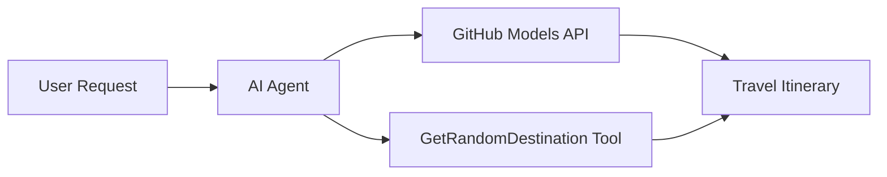

# 🌍 Agente di Viaggi AI con Microsoft Agent Framework (.NET)

## 📋 Panoramica dello Scenario

Questo notebook dimostra come costruire un agente intelligente per la pianificazione di viaggi utilizzando il Microsoft Agent Framework per .NET. L'agente può generare automaticamente itinerari personalizzati per gite giornaliere verso destinazioni casuali in tutto il mondo.

**Capacità principali:**
- 🎲 **Selezione Casuale della Destinazione**: Utilizza uno strumento personalizzato per scegliere luoghi di vacanza
- 🗺️ **Pianificazione Intelligente del Viaggio**: Crea itinerari dettagliati giorno per giorno
- 🔄 **Streaming in Tempo Reale**: Supporta risposte immediate e in streaming
- 🛠️ **Integrazione di Strumenti Personalizzati**: Dimostra come estendere le capacità dell'agente

## 🔧 Architettura Tecnica

### Tecnologie Principali
- **Microsoft Agent Framework**: Ultima implementazione .NET per lo sviluppo di agenti AI
- **Integrazione con Modelli GitHub**: Utilizza il servizio di inferenza dei modelli AI di GitHub
- **Compatibilità con OpenAI API**: Sfrutta le librerie client di OpenAI con endpoint personalizzati
- **Configurazione Sicura**: Gestione delle chiavi API basata sull'ambiente

### Componenti Chiave
1. **AIAgent**: L'orchestratore principale dell'agente che gestisce il flusso della conversazione
2. **Strumenti Personalizzati**: Funzione `GetRandomDestination()` disponibile per l'agente
3. **Chat Client**: Interfaccia di conversazione supportata dai modelli GitHub
4. **Supporto Streaming**: Capacità di generazione di risposte in tempo reale

### Modello di Integrazione


## 🚀 Per Iniziare

**Prerequisiti:**
- .NET 9.0 o superiore
- Token di accesso API per i modelli GitHub
- Variabili d'ambiente configurate nel file `.env`

**Variabili d'Ambiente Necessarie:**
```env
GITHUB_TOKEN=your_github_token
GITHUB_ENDPOINT=https://models.inference.ai.azure.com
GITHUB_MODEL_ID=gpt-4o-mini
```

Esegui le celle qui sotto in sequenza per vedere l'agente di viaggi in azione!

---

## .NET Single File App: AI Travel Agent Example

See `01-dotnet-agent-framework.cs` for the complete runnable code sample.

Esegui il campione di codice qui sotto:

```bash
dotnet run 01-dotnet-agent-framework.cs
```

### Sample Code

```csharp
static string GetRandomDestination()
{
    var destinations = new List<string>
    {
        "Paris, France",
        "Tokyo, Japan",
        "New York City, USA",
        "Sydney, Australia",
        "Rome, Italy",
        "Barcelona, Spain",
        "Cape Town, South Africa",
        "Rio de Janeiro, Brazil",
        "Bangkok, Thailand",
        "Vancouver, Canada"
    };
    var random = new Random();
    int index = random.Next(destinations.Count);
    return destinations[index];
}

// Extract configuration from environment variables
var github_endpoint = Environment.GetEnvironmentVariable("GITHUB_ENDPOINT") ?? throw new InvalidOperationException("GITHUB_ENDPOINT is not set.");
var github_model_id = Environment.GetEnvironmentVariable("GITHUB_MODEL_ID") ?? "gpt-4o-mini";
var github_token = Environment.GetEnvironmentVariable("GITHUB_TOKEN") ?? throw new InvalidOperationException("GITHUB_TOKEN is not set.");

// Configure OpenAI Client Options
var openAIOptions = new OpenAIClientOptions()
{
    Endpoint = new Uri(github_endpoint)
};

// Initialize OpenAI Client with GitHub Models Configuration
var openAIClient = new OpenAIClient(new ApiKeyCredential(github_token), openAIOptions);

// Create AI Agent with Travel Planning Capabilities
AIAgent agent = openAIClient
    .GetChatClient(github_model_id)
    .CreateAIAgent(
        instructions: "You are a helpful AI Agent that can help plan vacations for customers at random destinations",
        tools: [AIFunctionFactory.Create(GetRandomDestination)]
    );

// Execute Agent: Plan a Day Trip (Non-Streaming)
Console.WriteLine(await agent.RunAsync("Plan me a day trip"));

// Execute Agent: Plan a Day Trip (Streaming Response)
await foreach (var update in agent.RunStreamingAsync("Plan me a day trip"))
{
    Console.Write(update);
}
```
