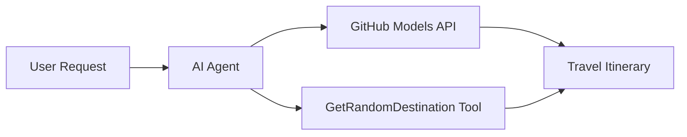

<!--
CO_OP_TRANSLATOR_METADATA:
{
  "original_hash": "23afd9be7b6ba5b69a44c3b6a78e07f6",
  "translation_date": "2025-11-06T10:03:48+00:00",
  "source_file": "01-intro-to-ai-agents/code_samples/01-dotnet-agent-framework.md",
  "language_code": "it"
}
-->
# 🌍 Agente di Viaggio AI con Microsoft Agent Framework (.NET)

## 📋 Panoramica dello Scenario

Questo notebook dimostra come costruire un agente intelligente per la pianificazione di viaggi utilizzando il Microsoft Agent Framework per .NET. L'agente può generare automaticamente itinerari personalizzati per gite giornaliere verso destinazioni casuali in tutto il mondo.

**Capacità principali:**
- 🎲 **Selezione casuale della destinazione**: Utilizza uno strumento personalizzato per scegliere mete di vacanza
- 🗺️ **Pianificazione intelligente del viaggio**: Crea itinerari dettagliati giorno per giorno
- 🔄 **Streaming in tempo reale**: Supporta risposte immediate e in streaming
- 🛠️ **Integrazione di strumenti personalizzati**: Dimostra come estendere le capacità dell'agente

## 🔧 Architettura Tecnica

### Tecnologie principali
- **Microsoft Agent Framework**: Ultima implementazione .NET per lo sviluppo di agenti AI
- **Integrazione con i modelli GitHub**: Utilizza il servizio di inferenza dei modelli AI di GitHub
- **Compatibilità con OpenAI API**: Sfrutta le librerie client di OpenAI con endpoint personalizzati
- **Configurazione sicura**: Gestione delle chiavi API basata sull'ambiente

### Componenti principali
1. **AIAgent**: L'orchestratore principale dell'agente che gestisce il flusso della conversazione
2. **Strumenti personalizzati**: Funzione `GetRandomDestination()` disponibile per l'agente
3. **Chat Client**: Interfaccia di conversazione supportata dai modelli GitHub
4. **Supporto per lo streaming**: Capacità di generazione di risposte in tempo reale

### Modello di integrazione


## 🚀 Per iniziare

**Prerequisiti:**
- .NET 10.0 o superiore
- Token di accesso API per i modelli GitHub
- Variabili d'ambiente configurate nel file `.env`

**Variabili d'ambiente richieste:**
```env
GITHUB_TOKEN=your_github_token
GITHUB_ENDPOINT=https://models.inference.ai.azure.com
GITHUB_MODEL_ID=gpt-4o-mini
```

Esegui il codice di esempio qui sotto in sequenza per vedere l'agente di viaggio in azione!

---

## App Singola .NET: Esempio di Agente di Viaggio AI

Consulta `01-dotnet-agent-framework.cs` per il codice di esempio completo eseguibile.

```bash
dotnet run 01-dotnet-agent-framework.cs
```

### Codice di esempio

```csharp
static string GetRandomDestination()
{
    var destinations = new List<string>
    {
        "Paris, France",
        "Tokyo, Japan",
        "New York City, USA",
        "Sydney, Australia",
        "Rome, Italy",
        "Barcelona, Spain",
        "Cape Town, South Africa",
        "Rio de Janeiro, Brazil",
        "Bangkok, Thailand",
        "Vancouver, Canada"
    };
    var random = new Random();
    int index = random.Next(destinations.Count);
    return destinations[index];
}

// Extract configuration from environment variables
var github_endpoint = Environment.GetEnvironmentVariable("GITHUB_ENDPOINT") ?? throw new InvalidOperationException("GITHUB_ENDPOINT is not set.");
var github_model_id = Environment.GetEnvironmentVariable("GITHUB_MODEL_ID") ?? "gpt-4o-mini";
var github_token = Environment.GetEnvironmentVariable("GITHUB_TOKEN") ?? throw new InvalidOperationException("GITHUB_TOKEN is not set.");

// Configure OpenAI Client Options
var openAIOptions = new OpenAIClientOptions()
{
    Endpoint = new Uri(github_endpoint)
};

// Initialize OpenAI Client with GitHub Models Configuration
var openAIClient = new OpenAIClient(new ApiKeyCredential(github_token), openAIOptions);

// Create AI Agent with Travel Planning Capabilities
AIAgent agent = openAIClient
    .GetChatClient(github_model_id)
    .CreateAIAgent(
        instructions: "You are a helpful AI Agent that can help plan vacations for customers at random destinations",
        tools: [AIFunctionFactory.Create(GetRandomDestination)]
    );

// Execute Agent: Plan a Day Trip (Non-Streaming)
Console.WriteLine(await agent.RunAsync("Plan me a day trip"));

// Execute Agent: Plan a Day Trip (Streaming Response)
await foreach (var update in agent.RunStreamingAsync("Plan me a day trip"))
{
    Console.Write(update);
}
```

---

**Disclaimer**:  
Questo documento è stato tradotto utilizzando il servizio di traduzione AI [Co-op Translator](https://github.com/Azure/co-op-translator). Sebbene ci impegniamo per garantire l'accuratezza, si prega di notare che le traduzioni automatiche possono contenere errori o imprecisioni. Il documento originale nella sua lingua nativa dovrebbe essere considerato la fonte autorevole. Per informazioni critiche, si raccomanda una traduzione professionale umana. Non siamo responsabili per eventuali incomprensioni o interpretazioni errate derivanti dall'uso di questa traduzione.