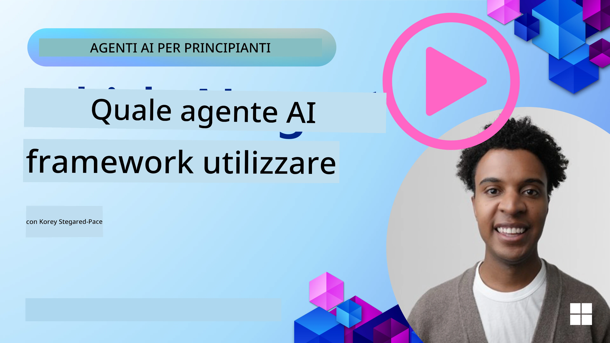

[](https://youtu.be/ODwF-EZo_O8?si=1xoy_B9RNQfrYdF7)

> _(Fai clic sull'immagine sopra per vedere il video di questa lezione)_

# Esplora i framework per agenti AI

I framework per agenti AI sono piattaforme software progettate per semplificare la creazione, il deployment e la gestione degli agenti AI. Questi framework forniscono agli sviluppatori componenti predefiniti, astrazioni e strumenti che facilitano lo sviluppo di sistemi AI complessi.

Questi framework aiutano gli sviluppatori a concentrarsi sugli aspetti unici delle loro applicazioni fornendo approcci standardizzati alle sfide comuni nello sviluppo di agenti AI. Migliorano scalabilità, accessibilità ed efficienza nella costruzione di sistemi AI.

## Introduzione 

Questa lezione coprirà:

- Cosa sono i framework per agenti AI e cosa consentono agli sviluppatori di realizzare?
- Come possono i team usare questi strumenti per prototipare rapidamente, iterare e migliorare le capacità del loro agente?
- Quali sono le differenze tra i framework e gli strumenti creati da Microsoft (<a href="https://aka.ms/ai-agents-beginners/ai-agent-service" target="_blank">Servizio Azure AI Agent</a> e il <a href="https://learn.microsoft.com/azure/ai-services/openai/how-to/responses" target="_blank">Framework per agenti Microsoft</a>)?
- Posso integrare direttamente i miei strumenti dell'ecosistema Azure esistenti, o ho bisogno di soluzioni autonome?
- Cos'è il servizio Azure AI Agents e come può aiutarmi?

## Obiettivi di apprendimento

Gli obiettivi di questa lezione sono aiutarti a comprendere:

- Il ruolo dei framework per agenti AI nello sviluppo dell'intelligenza artificiale.
- Come sfruttare i framework per agenti AI per costruire agenti intelligenti.
- Le capacità chiave abilitate dai framework per agenti AI.
- Le differenze tra il Microsoft Agent Framework e l'Azure AI Agent Service.

## Cosa sono i framework per agenti AI e cosa consentono agli sviluppatori di fare?

I tradizionali framework per l'IA possono aiutarti a integrare l'IA nelle tue app e migliorare queste applicazioni nei seguenti modi:

- **Personalization**: l'IA può analizzare il comportamento e le preferenze degli utenti per fornire raccomandazioni, contenuti ed esperienze personalizzate.
Example: Streaming services like Netflix use AI to suggest movies and shows based on viewing history, enhancing user engagement and satisfaction.
- **Automation and Efficiency**: l'IA può automatizzare compiti ripetitivi, semplificare i flussi di lavoro e migliorare l'efficienza operativa.
Example: Customer service apps use AI-powered chatbots to handle common inquiries, reducing response times and freeing up human agents for more complex issues.
- **Enhanced User Experience**: l'IA può migliorare l'esperienza complessiva offrendo funzionalità intelligenti come riconoscimento vocale, elaborazione del linguaggio naturale e testo predittivo.
Example: Virtual assistants like Siri and Google Assistant use AI to understand and respond to voice commands, making it easier for users to interact with their devices.

### That all sounds great right, so why do we need the AI Agent Framework?

I framework per agenti AI rappresentano qualcosa in più rispetto ai semplici framework per l'IA. Sono progettati per consentire la creazione di agenti intelligenti che possono interagire con gli utenti, altri agenti e l'ambiente per raggiungere obiettivi specifici. Questi agenti possono mostrare comportamenti autonomi, prendere decisioni e adattarsi a condizioni mutevoli. Esaminiamo alcune capacità chiave abilitate dai framework per agenti AI:

- **Agent Collaboration and Coordination**: consentono la creazione di più agenti AI che possono lavorare insieme, comunicare e coordinarsi per risolvere compiti complessi.
- **Task Automation and Management**: forniscono meccanismi per automatizzare flussi di lavoro multi-step, delega dei compiti e gestione dinamica delle attività tra gli agenti.
- **Contextual Understanding and Adaptation**: dotano gli agenti della capacità di comprendere il contesto, adattarsi a condizioni in cambiamento e prendere decisioni basate su informazioni in tempo reale.

In sintesi, gli agenti ti permettono di fare di più, di portare l'automazione a un livello superiore e di creare sistemi più intelligenti che possono adattarsi e apprendere dall'ambiente.

## How to quickly prototype, iterate, and improve the agent’s capabilities?

Questo è un panorama in rapida evoluzione, ma ci sono alcuni elementi comuni alla maggior parte dei framework per agenti AI che possono aiutarti a prototipare e iterare rapidamente, in particolare componenti modulari, strumenti collaborativi e apprendimento in tempo reale. Esaminiamoli:

- **Use Modular Components**: gli SDK per l'IA offrono componenti predefiniti come connettori AI e di memoria, chiamata di funzioni tramite linguaggio naturale o plugin di codice, template di prompt e altro.
- **Leverage Collaborative Tools**: progetta agenti con ruoli e compiti specifici, consentendo loro di testare e perfezionare i flussi di lavoro collaborativi.
- **Learn in Real-Time**: implementa loop di feedback in cui gli agenti apprendono dalle interazioni e adeguano dinamicamente il loro comportamento.

### Use Modular Components

SDK come il Microsoft Agent Framework offrono componenti predefiniti come connettori AI, definizioni di strumenti e gestione degli agenti.

**How teams can use these**: I team possono assemblare rapidamente questi componenti per creare un prototipo funzionale senza partire da zero, permettendo sperimentazione e iterazione rapide.

**How it works in practice**: Puoi usare un parser predefinito per estrarre informazioni dall'input dell'utente, un modulo di memoria per memorizzare e recuperare dati e un generatore di prompt per interagire con gli utenti, tutto senza dover costruire questi componenti da zero.

**Example code**. Let's look at an example of how you can use the Microsoft Agent Framework with `AzureAIProjectAgentProvider` to have the model respond to user input with tool calling:

``` python
# Esempio di Microsoft Agent Framework in Python

import asyncio
import os
from typing import Annotated

from agent_framework.azure import AzureAIProjectAgentProvider
from azure.identity import AzureCliCredential


# Definisci una funzione strumento di esempio per prenotare un viaggio
def book_flight(date: str, location: str) -> str:
    """Book travel given location and date."""
    return f"Travel was booked to {location} on {date}"


async def main():
    provider = AzureAIProjectAgentProvider(credential=AzureCliCredential())
    agent = await provider.create_agent(
        name="travel_agent",
        instructions="Help the user book travel. Use the book_flight tool when ready.",
        tools=[book_flight],
    )

    response = await agent.run("I'd like to go to New York on January 1, 2025")
    print(response)
    # Esempio di output: Il tuo volo per New York il 1° gennaio 2025 è stato prenotato con successo. Buon viaggio! ✈️🗽


if __name__ == "__main__":
    asyncio.run(main())
```

What you can see from this example is how you can leverage a pre-built parser to extract key information from user input, such as the origin, destination, and date of a flight booking request. This modular approach allows you to focus on the high-level logic.

### Leverage Collaborative Tools

Frameworks like the Microsoft Agent Framework facilitate the creation of multiple agents that can work together.

**How teams can use these**: I team possono progettare agenti con ruoli e compiti specifici, permettendo di testare e perfezionare i flussi di lavoro collaborativi e migliorare l'efficienza complessiva del sistema.

**How it works in practice**: Puoi creare un team di agenti in cui ogni agente ha una funzione specializzata, come recupero dati, analisi o presa di decisioni. Questi agenti possono comunicare e condividere informazioni per raggiungere un obiettivo comune, ad esempio rispondere a una query dell'utente o completare un'attività.

**Example code (Microsoft Agent Framework)**:

```python
# Creazione di più agenti che lavorano insieme utilizzando il Microsoft Agent Framework

import os
from agent_framework.azure import AzureAIProjectAgentProvider
from azure.identity import AzureCliCredential

provider = AzureAIProjectAgentProvider(credential=AzureCliCredential())

# Agente di Recupero Dati
agent_retrieve = await provider.create_agent(
    name="dataretrieval",
    instructions="Retrieve relevant data using available tools.",
    tools=[retrieve_tool],
)

# Agente di Analisi Dati
agent_analyze = await provider.create_agent(
    name="dataanalysis",
    instructions="Analyze the retrieved data and provide insights.",
    tools=[analyze_tool],
)

# Eseguire gli agenti in sequenza su un compito
retrieval_result = await agent_retrieve.run("Retrieve sales data for Q4")
analysis_result = await agent_analyze.run(f"Analyze this data: {retrieval_result}")
print(analysis_result)
```

What you see in the previous code is how you can create a task that involves multiple agents working together to analyze data. Each agent performs a specific function, and the task is executed by coordinating the agents to achieve the desired outcome. By creating dedicated agents with specialized roles, you can improve task efficiency and performance.

### Learn in Real-Time

Advanced frameworks provide capabilities for real-time context understanding and adaptation.

**How teams can use these**: I team possono implementare loop di feedback in cui gli agenti apprendono dalle interazioni e adeguano dinamicamente il loro comportamento, portando a un miglioramento continuo e a una raffinazione delle capacità.

**How it works in practice**: Gli agenti possono analizzare il feedback degli utenti, i dati ambientali e i risultati delle attività per aggiornare la loro base di conoscenza, regolare gli algoritmi di decisione e migliorare le prestazioni nel tempo. Questo processo di apprendimento iterativo consente agli agenti di adattarsi a condizioni in evoluzione e alle preferenze degli utenti, migliorando l'efficacia complessiva del sistema.

## What are the differences between the Microsoft Agent Framework and Azure AI Agent Service?

Ci sono molti modi per confrontare questi approcci, ma esaminiamo alcune differenze chiave in termini di progettazione, capacità e casi d'uso target:

## Microsoft Agent Framework (MAF)

The Microsoft Agent Framework provides a streamlined SDK for building AI agents using `AzureAIProjectAgentProvider`. It enables developers to create agents that leverage Azure OpenAI models with built-in tool calling, conversation management, and enterprise-grade security through Azure identity.

**Use Cases**: Creazione di agenti AI pronti per la produzione con utilizzo di strumenti, flussi di lavoro multi-step e scenari di integrazione aziendale.

Here are some important core concepts of the Microsoft Agent Framework:

- **Agents**. An agent is created via `AzureAIProjectAgentProvider` and configured with a name, instructions, and tools. The agent can:
  - **Process user messages** and generate responses using Azure OpenAI models.
  - **Call tools** automatically based on the conversation context.
  - **Maintain conversation state** across multiple interactions.

  Here is a code snippet showing how to create an agent:

    ```python
    import os
    from agent_framework.azure import AzureAIProjectAgentProvider
    from azure.identity import AzureCliCredential

    provider = AzureAIProjectAgentProvider(credential=AzureCliCredential())
    agent = await provider.create_agent(
        name="my_agent",
        instructions="You are a helpful assistant.",
    )

    response = await agent.run("Hello, World!")
    print(response)
    ```

- **Tools**. The framework supports defining tools as Python functions that the agent can invoke automatically. Tools are registered when creating the agent:

    ```python
    def get_weather(location: str) -> str:
        """Get the current weather for a location."""
        return f"The weather in {location} is sunny, 72\u00b0F."

    agent = await provider.create_agent(
        name="weather_agent",
        instructions="Help users check the weather.",
        tools=[get_weather],
    )
    ```

- **Multi-Agent Coordination**. You can create multiple agents with different specializations and coordinate their work:

    ```python
    planner = await provider.create_agent(
        name="planner",
        instructions="Break down complex tasks into steps.",
    )

    executor = await provider.create_agent(
        name="executor",
        instructions="Execute the planned steps using available tools.",
        tools=[execute_tool],
    )

    plan = await planner.run("Plan a trip to Paris")
    result = await executor.run(f"Execute this plan: {plan}")
    ```

- **Azure Identity Integration**. The framework uses `AzureCliCredential` (or `DefaultAzureCredential`) for secure, keyless authentication, eliminating the need to manage API keys directly.

## Azure AI Agent Service

Azure AI Agent Service is a more recent addition, introduced at Microsoft Ignite 2024. It allows for the development and deployment of AI agents with more flexible models, such as directly calling open-source LLMs like Llama 3, Mistral, and Cohere.

Azure AI Agent Service provides stronger enterprise security mechanisms and data storage methods, making it suitable for enterprise applications. 

It works out-of-the-box with the Microsoft Agent Framework for building and deploying agents.

This service is currently in Public Preview and supports Python and C# for building agents.

Using the Azure AI Agent Service Python SDK, we can create an agent with a user-defined tool:

```python
import asyncio
from azure.identity import DefaultAzureCredential
from azure.ai.projects import AIProjectClient

# Definire le funzioni degli strumenti
def get_specials() -> str:
    """Provides a list of specials from the menu."""
    return """
    Special Soup: Clam Chowder
    Special Salad: Cobb Salad
    Special Drink: Chai Tea
    """

def get_item_price(menu_item: str) -> str:
    """Provides the price of the requested menu item."""
    return "$9.99"


async def main() -> None:
    credential = DefaultAzureCredential()
    project_client = AIProjectClient.from_connection_string(
        credential=credential,
        conn_str="your-connection-string",
    )

    agent = project_client.agents.create_agent(
        model="gpt-4o-mini",
        name="Host",
        instructions="Answer questions about the menu.",
        tools=[get_specials, get_item_price],
    )

    thread = project_client.agents.create_thread()

    user_inputs = [
        "Hello",
        "What is the special soup?",
        "How much does that cost?",
        "Thank you",
    ]

    for user_input in user_inputs:
        print(f"# User: '{user_input}'")
        message = project_client.agents.create_message(
            thread_id=thread.id,
            role="user",
            content=user_input,
        )
        run = project_client.agents.create_and_process_run(
            thread_id=thread.id, agent_id=agent.id
        )
        messages = project_client.agents.list_messages(thread_id=thread.id)
        print(f"# Agent: {messages.data[0].content[0].text.value}")


if __name__ == "__main__":
    asyncio.run(main())
```

### Core concepts

Azure AI Agent Service has the following core concepts:

- **Agent**. Azure AI Agent Service integrates with Microsoft Foundry. Within AI Foundry, an AI Agent acts as a "smart" microservice that can be used to answer questions (RAG), perform actions, or completely automate workflows. It achieves this by combining the power of generative AI models with tools that allow it to access and interact with real-world data sources. Here's an example of an agent:

    ```python
    agent = project_client.agents.create_agent(
        model="gpt-4o-mini",
        name="my-agent",
        instructions="You are helpful agent",
        tools=code_interpreter.definitions,
        tool_resources=code_interpreter.resources,
    )
    ```

    In this example, an agent is created with the model `gpt-4o-mini`, a name `my-agent`, and instructions `You are helpful agent`. The agent is equipped with tools and resources to perform code interpretation tasks.

- **Thread and messages**. The thread is another important concept. It represents a conversation or interaction between an agent and a user. Threads can be used to track the progress of a conversation, store context information, and manage the state of the interaction. Here's an example of a thread:

    ```python
    thread = project_client.agents.create_thread()
    message = project_client.agents.create_message(
        thread_id=thread.id,
        role="user",
        content="Could you please create a bar chart for the operating profit using the following data and provide the file to me? Company A: $1.2 million, Company B: $2.5 million, Company C: $3.0 million, Company D: $1.8 million",
    )
    
    # Ask the agent to perform work on the thread
    run = project_client.agents.create_and_process_run(thread_id=thread.id, agent_id=agent.id)
    
    # Fetch and log all messages to see the agent's response
    messages = project_client.agents.list_messages(thread_id=thread.id)
    print(f"Messages: {messages}")
    ```

    In the previous code, a thread is created. Thereafter, a message is sent to the thread. By calling `create_and_process_run`, the agent is asked to perform work on the thread. Finally, the messages are fetched and logged to see the agent's response. The messages indicate the progress of the conversation between the user and the agent. It's also important to understand that the messages can be of different types such as text, image, or file, that is the agents work has resulted in for example an image or a text response for example. As a developer, you can then use this information to further process the response or present it to the user.

- **Integrates with the Microsoft Agent Framework**. Azure AI Agent Service works seamlessly with the Microsoft Agent Framework, which means you can build agents using `AzureAIProjectAgentProvider` and deploy them through the Agent Service for production scenarios.

**Use Cases**: Azure AI Agent Service is designed for enterprise applications that require secure, scalable, and flexible AI agent deployment.

## What's the difference between these approaches?
 
It does sound like there is overlap, but there are some key differences in terms of their design, capabilities, and target use cases:
 
- **Microsoft Agent Framework (MAF)**: è un SDK pronto per la produzione per la costruzione di agenti AI. Fornisce un'API semplificata per creare agenti con chiamata di strumenti, gestione delle conversazioni e integrazione con Azure Identity.
- **Azure AI Agent Service**: è una piattaforma e un servizio di deployment in Azure Foundry per agenti. Offre connettività integrata a servizi come Azure OpenAI, Azure AI Search, Bing Search ed esecuzione di codice.
 
Still not sure which one to choose?

### Use Cases
 
Let's see if we can help you by going through some common use cases:
 
> Q: I'm building production AI agent applications and want to get started quickly
>
>A: The Microsoft Agent Framework is a great choice. It provides a simple, Pythonic API via `AzureAIProjectAgentProvider` that lets you define agents with tools and instructions in just a few lines of code.

>Q: I need enterprise-grade deployment with Azure integrations like Search and code execution
>
> A: Azure AI Agent Service is the best fit. It's a platform service that provides built-in capabilities for multiple models, Azure AI Search, Bing Search and Azure Functions. It makes it easy to build your agents in the Foundry Portal and deploy them at scale.
 
> Q: I'm still confused, just give me one option
>
> A: Start with the Microsoft Agent Framework to build your agents, and then use Azure AI Agent Service when you need to deploy and scale them in production. This approach lets you iterate quickly on your agent logic while having a clear path to enterprise deployment.
 
Riepiloghiamo le differenze chiave in una tabella:

| Framework | Focus | Core Concepts | Use Cases |
| --- | --- | --- | --- |
| Microsoft Agent Framework | Streamlined agent SDK with tool calling | Agents, Tools, Azure Identity | Building AI agents, tool use, multi-step workflows |
| Azure AI Agent Service | Flexible models, enterprise security, Code generation, Tool calling | Modularity, Collaboration, Process Orchestration | Secure, scalable, and flexible AI agent deployment |

## Posso integrare direttamente i miei strumenti dell'ecosistema Azure esistenti, o ho bisogno di soluzioni autonome?
La risposta è sì, puoi integrare i tuoi strumenti dell'ecosistema Azure esistenti direttamente con Azure AI Agent Service, soprattutto perché è stato progettato per funzionare perfettamente con gli altri servizi Azure. Ad esempio, potresti integrare Bing, Azure AI Search e Azure Functions. C'è anche un'integrazione profonda con Microsoft Foundry.

Il Microsoft Agent Framework si integra anche con i servizi Azure tramite `AzureAIProjectAgentProvider` e Azure identity, permettendoti di chiamare i servizi Azure direttamente dagli strumenti del tuo agente.

## Sample Codes

- Python: [Framework degli agenti](./code_samples/02-python-agent-framework.ipynb)
- .NET: [Framework degli agenti](./code_samples/02-dotnet-agent-framework.md)

## Got More Questions about AI Agent Frameworks?

Unisciti al [Microsoft Foundry Discord](https://aka.ms/ai-agents/discord) per incontrare altri apprendenti, partecipare alle ore di ricevimento e ottenere risposte alle tue domande sugli agenti AI.

## References

- <a href="https://techcommunity.microsoft.com/blog/azure-ai-services-blog/introducing-azure-ai-agent-service/4298357" target="_blank">Servizio Azure Agent</a>
- <a href="https://learn.microsoft.com/azure/ai-services/openai/how-to/responses" target="_blank">Microsoft Agent Framework - Risposte Azure OpenAI</a>
- <a href="https://learn.microsoft.com/azure/ai-services/agents/overview" target="_blank">Servizio Azure AI Agent</a>

## Previous Lesson

[Introduzione agli agenti AI e ai casi d'uso](../01-intro-to-ai-agents/README.md)

## Next Lesson

[Comprendere i pattern di progettazione agentica](../03-agentic-design-patterns/README.md)

---

<!-- CO-OP TRANSLATOR DISCLAIMER START -->
Esclusione di responsabilità:
Questo documento è stato tradotto utilizzando il servizio di traduzione automatica AI [Co-op Translator](https://github.com/Azure/co-op-translator). Pur impegnandoci a garantire l'accuratezza, si prega di notare che le traduzioni automatiche possono contenere errori o inesattezze. Il documento originale nella sua lingua madre deve essere considerato la fonte autorevole. Per informazioni critiche si raccomanda una traduzione professionale effettuata da un traduttore umano. Non siamo responsabili per eventuali malintesi o interpretazioni errate derivanti dall'uso di questa traduzione.
<!-- CO-OP TRANSLATOR DISCLAIMER END -->