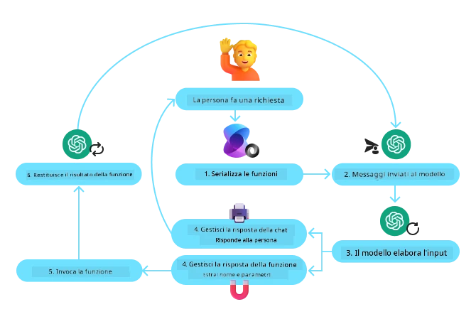
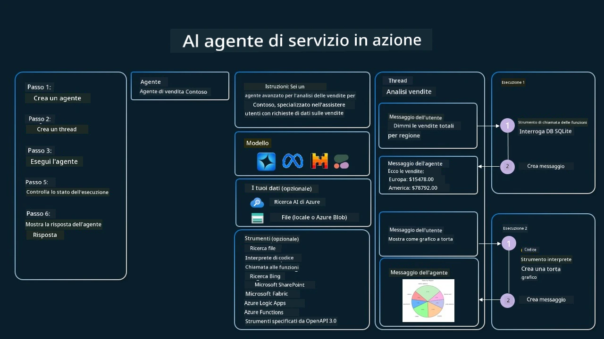

[](https://youtu.be/vieRiPRx-gI?si=cEZ8ApnT6Sus9rhn)

> _(Clicca sull'immagine sopra per vedere il video di questa lezione)_

# Pattern di Progettazione per l'Uso degli Strumenti

Gli strumenti sono interessanti perché permettono agli agenti AI di avere una gamma più ampia di capacità. Invece di avere un set limitato di azioni che l’agente può eseguire, aggiungendo uno strumento, l’agente può ora eseguire un’ampia varietà di azioni. In questo capitolo, esamineremo il Pattern di Progettazione per l'Uso degli Strumenti, che descrive come gli agenti AI possono usare specifici strumenti per raggiungere i loro obiettivi.

## Introduzione

In questa lezione, cerchiamo di rispondere alle seguenti domande:

- Cos’è il pattern di progettazione per l’uso degli strumenti?
- In quali casi d’uso può essere applicato?
- Quali sono gli elementi/blocchi costitutivi necessari per implementare il pattern di progettazione?
- Quali sono le considerazioni speciali per usare il Pattern di Progettazione per l'Uso degli Strumenti per costruire agenti AI affidabili?

## Obiettivi di Apprendimento

Dopo aver completato questa lezione, sarai in grado di:

- Definire il Pattern di Progettazione per l'Uso degli Strumenti e il suo scopo.
- Identificare i casi d’uso in cui il Pattern di Progettazione per l'Uso degli Strumenti è applicabile.
- Comprendere gli elementi chiave necessari per implementare il pattern di progettazione.
- Riconoscere le considerazioni per garantire l’affidabilità negli agenti AI che utilizzano questo pattern di progettazione.

## Cos’è il Pattern di Progettazione per l'Uso degli Strumenti?

Il **Pattern di Progettazione per l'Uso degli Strumenti** si concentra nel dare ai LLM la capacità di interagire con strumenti esterni per raggiungere obiettivi specifici. Gli strumenti sono codice che può essere eseguito da un agente per svolgere azioni. Uno strumento può essere una funzione semplice come una calcolatrice, oppure una chiamata API a un servizio terzo come la ricerca di prezzi azionari o le previsioni meteo. Nel contesto degli agenti AI, gli strumenti sono progettati per essere eseguiti dagli agenti in risposta a **chiamate di funzione generate dal modello**.

## In quali casi d’uso può essere applicato?

Gli agenti AI possono sfruttare gli strumenti per completare compiti complessi, recuperare informazioni o prendere decisioni. Il pattern di progettazione per l’uso degli strumenti è spesso usato in scenari che richiedono un’interazione dinamica con sistemi esterni, come database, servizi web o interpreti di codice. Questa capacità è utile per diversi casi d’uso tra cui:

- **Recupero Dinamico di Informazioni:** Gli agenti possono interrogare API esterne o database per ottenere dati aggiornati (ad esempio interrogare un database SQLite per l’analisi dati, recuperare prezzi azionari o informazioni meteorologiche).
- **Esecuzione e Interpretazione del Codice:** Gli agenti possono eseguire codice o script per risolvere problemi matematici, generare report o effettuare simulazioni.
- **Automazione dei Flussi di Lavoro:** Automatizzare flussi di lavoro ripetitivi o multi-step integrando strumenti come scheduler di attività, servizi email o pipeline di dati.
- **Assistenza Clienti:** Gli agenti possono interagire con sistemi CRM, piattaforme di ticketing o basi di conoscenza per risolvere le richieste degli utenti.
- **Generazione e Modifica di Contenuti:** Gli agenti possono sfruttare strumenti come correttori grammaticali, sintetizzatori di testo o valutatori di sicurezza dei contenuti per assistere nella creazione dei contenuti.

## Quali sono gli elementi/blocchi costitutivi necessari per implementare il pattern di progettazione per l’uso degli strumenti?

Questi blocchi costitutivi consentono all’agente AI di svolgere una gamma ampia di compiti. Vediamo gli elementi chiave necessari per implementare il Pattern di Progettazione per l'Uso degli Strumenti:

- **Schemi di Funzione/Strumento**: Definizioni dettagliate degli strumenti disponibili, inclusi nome della funzione, scopo, parametri richiesti e output attesi. Questi schemi consentono al LLM di capire quali strumenti sono disponibili e come costruire richieste valide.

- **Logica di Esecuzione delle Funzioni**: Regola come e quando gli strumenti vengono invocati in base all’intento dell’utente e al contesto della conversazione. Può includere moduli di pianificazione, meccanismi di instradamento o flussi condizionali che determinano l’uso degli strumenti dinamicamente.

- **Sistema di Gestione dei Messaggi**: Componenti che gestiscono il flusso conversazionale tra input dell’utente, risposte del LLM, chiamate agli strumenti e output degli strumenti.

- **Framework di Integrazione degli Strumenti**: Infrastruttura che connette l’agente a vari strumenti, siano essi funzioni semplici o servizi esterni complessi.

- **Gestione degli Errori e Validazione**: Meccanismi per gestire i fallimenti nell’esecuzione degli strumenti, validare i parametri e gestire risposte inattese.

- **Gestione dello Stato**: Tiene traccia del contesto della conversazione, delle precedenti interazioni con gli strumenti e dei dati persistenti per assicurare coerenza nelle interazioni su più turni.

Successivamente, esaminiamo in dettaglio la Chiamata a Funzione/Strumento.
 
### Chiamata a Funzione/Strumento

La chiamata a funzione è il modo principale con cui permettiamo ai Large Language Models (LLM) di interagire con gli strumenti. Spesso vedrai i termini 'Funzione' e 'Strumento' usati in modo intercambiabile perché le 'funzioni' (blocchi di codice riutilizzabile) sono gli 'strumenti' che gli agenti usano per svolgere compiti. Per poter invocare il codice di una funzione, un LLM deve confrontare la richiesta dell’utente con la descrizione della funzione. A questo scopo, uno schema contenente le descrizioni di tutte le funzioni disponibili viene inviato al LLM. Il LLM quindi seleziona la funzione più appropriata per il compito e restituisce il suo nome e gli argomenti. La funzione selezionata viene invocata, la sua risposta viene inviata al LLM, che usa l'informazione per rispondere alla richiesta dell’utente.

Per gli sviluppatori, per implementare la chiamata a funzione per gli agenti, serve:

1. Un modello LLM che supporti la chiamata a funzione
2. Uno schema contenente le descrizioni delle funzioni
3. Il codice per ogni funzione descritta

Usiamo l’esempio di ottenere l’ora corrente in una città per illustrare:

1. **Inizializzare un LLM che supporti la chiamata a funzione:**

    Non tutti i modelli supportano la chiamata a funzione, quindi è importante verificare che il LLM che stai utilizzando lo faccia. <a href="https://learn.microsoft.com/azure/ai-services/openai/how-to/function-calling" target="_blank">Azure OpenAI</a> supporta la chiamata a funzione. Possiamo iniziare istanziando il client Azure OpenAI.

    ```python
    # Inizializza il client Azure OpenAI
    client = AzureOpenAI(
        azure_endpoint = os.getenv("AZURE_AI_PROJECT_ENDPOINT"), 
        api_key=os.getenv("AZURE_OPENAI_API_KEY"),  
        api_version="2024-05-01-preview"
    )
    ```

1. **Creare uno Schema di Funzione**:

    Successivamente definiremo uno schema JSON che contiene il nome della funzione, la descrizione di cosa fa la funzione, e i nomi e descrizioni dei parametri della funzione.
    Passeremo poi questo schema al client creato in precedenza, insieme alla richiesta dell’utente per trovare l’ora a San Francisco. È importante notare che viene restituita una **chiamata a strumento**, **non** la risposta finale della domanda. Come detto prima, il LLM restituisce il nome della funzione selezionata per il compito e gli argomenti da passargli.

    ```python
    # Descrizione della funzione per il modello da leggere
    tools = [
        {
            "type": "function",
            "function": {
                "name": "get_current_time",
                "description": "Get the current time in a given location",
                "parameters": {
                    "type": "object",
                    "properties": {
                        "location": {
                            "type": "string",
                            "description": "The city name, e.g. San Francisco",
                        },
                    },
                    "required": ["location"],
                },
            }
        }
    ]
    ```
   
    ```python
  
    # Messaggio iniziale dell'utente
    messages = [{"role": "user", "content": "What's the current time in San Francisco"}] 
  
    # Prima chiamata API: Chiedi al modello di usare la funzione
      response = client.chat.completions.create(
          model=deployment_name,
          messages=messages,
          tools=tools,
          tool_choice="auto",
      )
  
      # Elabora la risposta del modello
      response_message = response.choices[0].message
      messages.append(response_message)
  
      print("Model's response:")  

      print(response_message)
  
    ```

    ```bash
    Model's response:
    ChatCompletionMessage(content=None, role='assistant', function_call=None, tool_calls=[ChatCompletionMessageToolCall(id='call_pOsKdUlqvdyttYB67MOj434b', function=Function(arguments='{"location":"San Francisco"}', name='get_current_time'), type='function')])
    ```
  
1. **Il codice della funzione necessario per svolgere il compito:**

    Ora che il LLM ha scelto quale funzione deve essere eseguita, il codice che svolge il compito deve essere implementato ed eseguito.
    Possiamo implementare il codice per ottenere l’ora corrente in Python. Dovremo anche scrivere il codice per estrarre il nome e gli argomenti dal response_message per ottenere il risultato finale.

    ```python
      def get_current_time(location):
        """Get the current time for a given location"""
        print(f"get_current_time called with location: {location}")  
        location_lower = location.lower()
        
        for key, timezone in TIMEZONE_DATA.items():
            if key in location_lower:
                print(f"Timezone found for {key}")  
                current_time = datetime.now(ZoneInfo(timezone)).strftime("%I:%M %p")
                return json.dumps({
                    "location": location,
                    "current_time": current_time
                })
      
        print(f"No timezone data found for {location_lower}")  
        return json.dumps({"location": location, "current_time": "unknown"})
    ```

     ```python
     # Gestire le chiamate di funzione
      if response_message.tool_calls:
          for tool_call in response_message.tool_calls:
              if tool_call.function.name == "get_current_time":
     
                  function_args = json.loads(tool_call.function.arguments)
     
                  time_response = get_current_time(
                      location=function_args.get("location")
                  )
     
                  messages.append({
                      "tool_call_id": tool_call.id,
                      "role": "tool",
                      "name": "get_current_time",
                      "content": time_response,
                  })
      else:
          print("No tool calls were made by the model.")  
  
      # Seconda chiamata API: Ottenere la risposta finale dal modello
      final_response = client.chat.completions.create(
          model=deployment_name,
          messages=messages,
      )
  
      return final_response.choices[0].message.content
     ```

     ```bash
      get_current_time called with location: San Francisco
      Timezone found for san francisco
      The current time in San Francisco is 09:24 AM.
     ```

La Chiamata a Funzione è al centro della maggior parte, se non di tutto, il design per l’uso degli strumenti negli agenti, tuttavia implementarla da zero può essere talvolta complesso.
Come abbiamo appreso nella [Lezione 2](../../../02-explore-agentic-frameworks), i framework agentici ci forniscono blocchi costitutivi predefiniti per implementare l’uso degli strumenti.
 
## Esempi di Uso degli Strumenti con Framework Agentici

Ecco alcuni esempi di come puoi implementare il Pattern di Progettazione per l'Uso degli Strumenti usando diversi framework agentici:

### Microsoft Agent Framework

<a href="https://learn.microsoft.com/azure/ai-services/agents/overview" target="_blank">Microsoft Agent Framework</a> è un framework AI open-source per costruire agenti AI. Semplifica il processo di uso della chiamata a funzione permettendoti di definire gli strumenti come funzioni Python con il decoratore `@tool`. Il framework gestisce la comunicazione avanti e indietro tra il modello e il tuo codice. Fornisce anche accesso a strumenti predefiniti come Ricerca File e Interprete di Codice tramite `AzureAIProjectAgentProvider`.

Il diagramma seguente illustra il processo di chiamata a funzione con il Microsoft Agent Framework:



Nel Microsoft Agent Framework, gli strumenti sono definiti come funzioni decorate. Possiamo convertire la funzione `get_current_time` vista prima in uno strumento usando il decoratore `@tool`. Il framework serializzerà automaticamente la funzione e i suoi parametri, creando lo schema da inviare al LLM.

```python
from agent_framework import tool
from agent_framework.azure import AzureAIProjectAgentProvider
from azure.identity import AzureCliCredential

@tool
def get_current_time(location: str) -> str:
    """Get the current time for a given location"""
    ...

# Crea il client
provider = AzureAIProjectAgentProvider(credential=AzureCliCredential())

# Crea un agente e eseguilo con lo strumento
agent = await provider.create_agent(name="TimeAgent", instructions="Use available tools to answer questions.", tools=get_current_time)
response = await agent.run("What time is it?")
```
  
### Azure AI Agent Service

<a href="https://learn.microsoft.com/azure/ai-services/agents/overview" target="_blank">Azure AI Agent Service</a> è un framework agentico più recente progettato per permettere agli sviluppatori di costruire, distribuire e scalare agenti AI di alta qualità ed estendibili in sicurezza senza dover gestire le risorse di calcolo e storage sottostanti. È particolarmente utile per applicazioni enterprise poiché è un servizio completamente gestito con sicurezza di livello enterprise.

Rispetto allo sviluppo diretto con l’API LLM, Azure AI Agent Service offre alcuni vantaggi, tra cui:

- Chiamata automatica agli strumenti – non serve analizzare una chiamata strumento, invocare lo strumento e gestire la risposta; tutto questo viene fatto lato server
- Dati gestiti in sicurezza – invece di gestire lo stato della conversazione, puoi affidarti ai thread che memorizzano tutte le informazioni necessarie
- Strumenti pronti all’uso – strumenti che puoi usare per interagire con le tue fonti dati, come Bing, Azure AI Search e Azure Functions.

Gli strumenti disponibili in Azure AI Agent Service si dividono in due categorie:

1. Strumenti di Conoscenza:
    - <a href="https://learn.microsoft.com/azure/ai-services/agents/how-to/tools/bing-grounding?tabs=python&pivots=overview" target="_blank">Background con Bing Search</a>
    - <a href="https://learn.microsoft.com/azure/ai-services/agents/how-to/tools/file-search?tabs=python&pivots=overview" target="_blank">Ricerca File</a>
    - <a href="https://learn.microsoft.com/azure/ai-services/agents/how-to/tools/azure-ai-search?tabs=azurecli%2Cpython&pivots=overview-azure-ai-search" target="_blank">Azure AI Search</a>

2. Strumenti di Azione:
    - <a href="https://learn.microsoft.com/azure/ai-services/agents/how-to/tools/function-calling?tabs=python&pivots=overview" target="_blank">Chiamata a Funzione</a>
    - <a href="https://learn.microsoft.com/azure/ai-services/agents/how-to/tools/code-interpreter?tabs=python&pivots=overview" target="_blank">Interprete di Codice</a>
    - <a href="https://learn.microsoft.com/azure/ai-services/agents/how-to/tools/openapi-spec?tabs=python&pivots=overview" target="_blank">Strumenti definiti da OpenAPI</a>
    - <a href="https://learn.microsoft.com/azure/ai-services/agents/how-to/tools/azure-functions?pivots=overview" target="_blank">Azure Functions</a>

Il servizio agent consente di usare insieme questi strumenti come un `toolset`. Utilizza anche i `thread` che tengono traccia della cronologia dei messaggi di una particolare conversazione.

Immagina di essere un agente di vendita in un'azienda chiamata Contoso. Vuoi sviluppare un agente conversazionale che risponda a domande sui dati di vendita.

L’immagine seguente illustra come potresti usare Azure AI Agent Service per analizzare i tuoi dati di vendita:



Per usare uno qualsiasi di questi strumenti con il servizio, possiamo creare un client e definire uno strumento o un insieme di strumenti. Per implementarlo praticamente possiamo usare il seguente codice Python. Il LLM potrà guardare al toolset e decidere se usare la funzione creata dall’utente, `fetch_sales_data_using_sqlite_query`, o l’Interprete di Codice predefinito a seconda della richiesta dell’utente.

```python 
import os
from azure.ai.projects import AIProjectClient
from azure.identity import DefaultAzureCredential
from fetch_sales_data_functions import fetch_sales_data_using_sqlite_query # funzione fetch_sales_data_using_sqlite_query che può essere trovata in un file fetch_sales_data_functions.py.
from azure.ai.projects.models import ToolSet, FunctionTool, CodeInterpreterTool

project_client = AIProjectClient.from_connection_string(
    credential=DefaultAzureCredential(),
    conn_str=os.environ["PROJECT_CONNECTION_STRING"],
)

# Inizializza il set di strumenti
toolset = ToolSet()

# Inizializza l'agente di chiamata delle funzioni con la funzione fetch_sales_data_using_sqlite_query e aggiungila al set di strumenti
fetch_data_function = FunctionTool(fetch_sales_data_using_sqlite_query)
toolset.add(fetch_data_function)

# Inizializza lo strumento Code Interpreter e aggiungilo al set di strumenti.
code_interpreter = code_interpreter = CodeInterpreterTool()
toolset.add(code_interpreter)

agent = project_client.agents.create_agent(
    model="gpt-4o-mini", name="my-agent", instructions="You are helpful agent", 
    toolset=toolset
)
```

## Quali sono le considerazioni speciali per usare il Pattern di Progettazione per l'Uso degli Strumenti per costruire agenti AI affidabili?

Una preoccupazione comune con SQL generato dinamicamente da LLM è la sicurezza, in particolare il rischio di SQL injection o azioni dannose, come il drop o manomissione del database. Sebbene queste preoccupazioni siano valide, possono essere efficacemente mitigate configurando correttamente i permessi di accesso al database. Per la maggior parte dei database ciò comporta configurare il database in sola lettura. Per servizi di database come PostgreSQL o Azure SQL, all’app dovrebbe essere assegnato un ruolo in sola lettura (SELECT).

Eseguire l’app in un ambiente sicuro aumenta ulteriormente la protezione. In scenari enterprise, i dati sono tipicamente estratti e trasformati da sistemi operativi in un database o data warehouse in sola lettura con uno schema user-friendly. Questo approccio garantisce che i dati siano sicuri, ottimizzati per performance e accessibilità, e che l’app abbia accesso ristretto e in sola lettura.

## Codici di Esempio

- Python: [Agent Framework](./code_samples/04-python-agent-framework.ipynb)
- .NET: [Agent Framework](./code_samples/04-dotnet-agent-framework.md)

## Hai altre domande sui Pattern di Progettazione per l'Uso degli Strumenti?

Unisciti al [Microsoft Foundry Discord](https://aka.ms/ai-agents/discord) per incontrare altri studenti, partecipare a sessioni di supporto e ottenere risposte alle tue domande sugli agenti AI.

## Risorse Aggiuntive

- <a href="https://microsoft.github.io/build-your-first-agent-with-azure-ai-agent-service-workshop/" target="_blank">Workshop Azure AI Agents Service</a>
- <a href="https://github.com/Azure-Samples/contoso-creative-writer/tree/main/docs/workshop" target="_blank">Workshop Contoso Creative Writer Multi-Agent</a>
- <a href="https://learn.microsoft.com/azure/ai-services/agents/overview" target="_blank">Panoramica Microsoft Agent Framework</a>

## Lezione Precedente

[Comprendere i Pattern di Progettazione Agentici](../03-agentic-design-patterns/README.md)

## Lezione Successiva
[Agentic RAG](../05-agentic-rag/README.md)

---

<!-- CO-OP TRANSLATOR DISCLAIMER START -->
**Disclaimer**:
Questo documento è stato tradotto utilizzando il servizio di traduzione automatica [Co-op Translator](https://github.com/Azure/co-op-translator). Pur impegnandoci per garantire l’accuratezza, si prega di notare che le traduzioni automatiche potrebbero contenere errori o imprecisioni. Il documento originale nella lingua originale deve essere considerato la fonte autorevole. Per informazioni critiche, si raccomanda una traduzione professionale umana. Non siamo responsabili per eventuali malintesi o interpretazioni errate derivanti dall’uso di questa traduzione.
<!-- CO-OP TRANSLATOR DISCLAIMER END -->