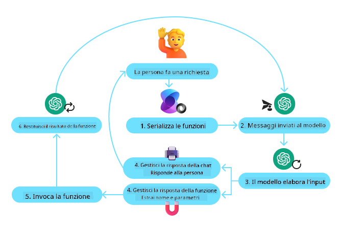
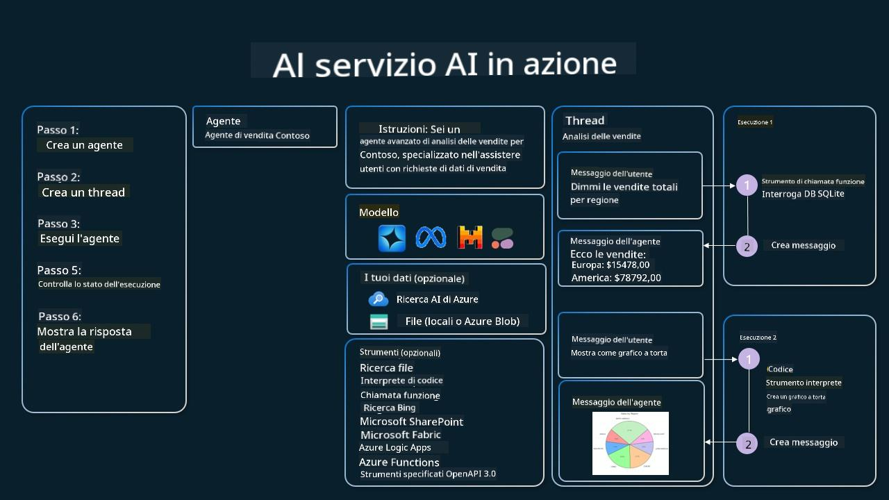

<!--
CO_OP_TRANSLATOR_METADATA:
{
  "original_hash": "e056335d729ba6e49571db7a6533825d",
  "translation_date": "2025-09-30T06:59:17+00:00",
  "source_file": "04-tool-use/README.md",
  "language_code": "it"
}
-->
[](https://youtu.be/vieRiPRx-gI?si=cEZ8ApnT6Sus9rhn)

> _(Clicca sull'immagine sopra per vedere il video di questa lezione)_

# Modello di progettazione per l'uso degli strumenti

Gli strumenti sono interessanti perché permettono agli agenti AI di avere una gamma più ampia di capacità. Invece di avere un set limitato di azioni che l'agente può eseguire, aggiungendo uno strumento, l'agente può ora eseguire una vasta gamma di azioni. In questo capitolo, esamineremo il modello di progettazione per l'uso degli strumenti, che descrive come gli agenti AI possono utilizzare strumenti specifici per raggiungere i loro obiettivi.

## Introduzione

In questa lezione cercheremo di rispondere alle seguenti domande:

- Cos'è il modello di progettazione per l'uso degli strumenti?
- Quali sono i casi d'uso a cui può essere applicato?
- Quali sono gli elementi/blocchi costitutivi necessari per implementare il modello di progettazione?
- Quali sono le considerazioni speciali per utilizzare il modello di progettazione per l'uso degli strumenti per costruire agenti AI affidabili?

## Obiettivi di apprendimento

Dopo aver completato questa lezione, sarai in grado di:

- Definire il modello di progettazione per l'uso degli strumenti e il suo scopo.
- Identificare i casi d'uso in cui il modello di progettazione per l'uso degli strumenti è applicabile.
- Comprendere gli elementi chiave necessari per implementare il modello di progettazione.
- Riconoscere le considerazioni per garantire l'affidabilità degli agenti AI che utilizzano questo modello di progettazione.

## Cos'è il modello di progettazione per l'uso degli strumenti?

Il **modello di progettazione per l'uso degli strumenti** si concentra sul dare ai LLM la capacità di interagire con strumenti esterni per raggiungere obiettivi specifici. Gli strumenti sono codice che può essere eseguito da un agente per svolgere azioni. Uno strumento può essere una funzione semplice, come una calcolatrice, o una chiamata API a un servizio di terze parti, come la ricerca dei prezzi delle azioni o le previsioni meteorologiche. Nel contesto degli agenti AI, gli strumenti sono progettati per essere eseguiti dagli agenti in risposta a **chiamate di funzione generate dal modello**.

## Quali sono i casi d'uso a cui può essere applicato?

Gli agenti AI possono sfruttare gli strumenti per completare compiti complessi, recuperare informazioni o prendere decisioni. Il modello di progettazione per l'uso degli strumenti è spesso utilizzato in scenari che richiedono interazioni dinamiche con sistemi esterni, come database, servizi web o interpreti di codice. Questa capacità è utile per una serie di casi d'uso diversi, tra cui:

- **Recupero dinamico di informazioni:** Gli agenti possono interrogare API esterne o database per ottenere dati aggiornati (ad esempio, interrogare un database SQLite per analisi dei dati, recuperare prezzi delle azioni o informazioni meteorologiche).
- **Esecuzione e interpretazione del codice:** Gli agenti possono eseguire codice o script per risolvere problemi matematici, generare report o eseguire simulazioni.
- **Automazione dei flussi di lavoro:** Automatizzare flussi di lavoro ripetitivi o multi-step integrando strumenti come pianificatori di attività, servizi email o pipeline di dati.
- **Supporto clienti:** Gli agenti possono interagire con sistemi CRM, piattaforme di ticketing o basi di conoscenza per risolvere le richieste degli utenti.
- **Generazione e modifica di contenuti:** Gli agenti possono sfruttare strumenti come correttori grammaticali, riassuntori di testo o valutatori di sicurezza dei contenuti per assistere nei compiti di creazione di contenuti.

## Quali sono gli elementi/blocchi costitutivi necessari per implementare il modello di progettazione per l'uso degli strumenti?

Questi blocchi costitutivi permettono all'agente AI di svolgere una vasta gamma di compiti. Esaminiamo gli elementi chiave necessari per implementare il modello di progettazione per l'uso degli strumenti:

- **Schemi di funzione/strumento:** Definizioni dettagliate degli strumenti disponibili, inclusi nome della funzione, scopo, parametri richiesti e output previsti. Questi schemi permettono al LLM di comprendere quali strumenti sono disponibili e come costruire richieste valide.

- **Logica di esecuzione delle funzioni:** Regola come e quando gli strumenti vengono invocati in base all'intento dell'utente e al contesto della conversazione. Questo può includere moduli di pianificazione, meccanismi di instradamento o flussi condizionali che determinano l'uso degli strumenti in modo dinamico.

- **Sistema di gestione dei messaggi:** Componenti che gestiscono il flusso conversazionale tra input dell'utente, risposte del LLM, chiamate agli strumenti e output degli strumenti.

- **Framework di integrazione degli strumenti:** Infrastruttura che collega l'agente a vari strumenti, siano essi funzioni semplici o servizi esterni complessi.

- **Gestione degli errori e validazione:** Meccanismi per gestire i fallimenti nell'esecuzione degli strumenti, validare i parametri e gestire risposte inattese.

- **Gestione dello stato:** Tiene traccia del contesto della conversazione, delle interazioni precedenti con gli strumenti e dei dati persistenti per garantire la coerenza nelle interazioni multi-turn.

Passiamo ora a esaminare più nel dettaglio la chiamata di funzione/strumento.

### Chiamata di funzione/strumento

La chiamata di funzione è il modo principale per permettere ai modelli di linguaggio di grandi dimensioni (LLM) di interagire con gli strumenti. Spesso vedrai i termini 'Funzione' e 'Strumento' usati in modo intercambiabile perché le 'funzioni' (blocchi di codice riutilizzabile) sono gli 'strumenti' che gli agenti usano per svolgere i compiti. Affinché il codice di una funzione venga invocato, un LLM deve confrontare la richiesta dell'utente con la descrizione della funzione. Per fare ciò, uno schema contenente le descrizioni di tutte le funzioni disponibili viene inviato al LLM. Il LLM seleziona quindi la funzione più appropriata per il compito e restituisce il suo nome e i suoi argomenti. La funzione selezionata viene invocata, la sua risposta viene inviata al LLM, che utilizza le informazioni per rispondere alla richiesta dell'utente.

Per implementare la chiamata di funzione per gli agenti, i sviluppatori avranno bisogno di:

1. Un modello LLM che supporti la chiamata di funzione
2. Uno schema contenente le descrizioni delle funzioni
3. Il codice per ciascuna funzione descritta

Usiamo l'esempio di ottenere l'ora corrente in una città per illustrare:

1. **Inizializzare un LLM che supporta la chiamata di funzione:**

    Non tutti i modelli supportano la chiamata di funzione, quindi è importante verificare che il LLM utilizzato lo faccia. <a href="https://learn.microsoft.com/azure/ai-services/openai/how-to/function-calling" target="_blank">Azure OpenAI</a> supporta la chiamata di funzione. Possiamo iniziare avviando il client Azure OpenAI.

    ```python
    # Initialize the Azure OpenAI client
    client = AzureOpenAI(
        azure_endpoint = os.getenv("AZURE_OPENAI_ENDPOINT"), 
        api_key=os.getenv("AZURE_OPENAI_API_KEY"),  
        api_version="2024-05-01-preview"
    )
    ```

1. **Creare uno schema di funzione:**

    Successivamente definiremo uno schema JSON che contiene il nome della funzione, la descrizione di ciò che la funzione fa e i nomi e le descrizioni dei parametri della funzione. 
    Prenderemo quindi questo schema e lo passeremo al client creato in precedenza, insieme alla richiesta dell'utente di trovare l'ora a San Francisco. È importante notare che ciò che viene restituito è una **chiamata allo strumento**, **non** la risposta finale alla domanda. Come menzionato in precedenza, il LLM restituisce il nome della funzione che ha selezionato per il compito e gli argomenti che verranno passati ad essa.

    ```python
    # Function description for the model to read
    tools = [
        {
            "type": "function",
            "function": {
                "name": "get_current_time",
                "description": "Get the current time in a given location",
                "parameters": {
                    "type": "object",
                    "properties": {
                        "location": {
                            "type": "string",
                            "description": "The city name, e.g. San Francisco",
                        },
                    },
                    "required": ["location"],
                },
            }
        }
    ]
    ```
   
    ```python
  
    # Initial user message
    messages = [{"role": "user", "content": "What's the current time in San Francisco"}] 
  
    # First API call: Ask the model to use the function
      response = client.chat.completions.create(
          model=deployment_name,
          messages=messages,
          tools=tools,
          tool_choice="auto",
      )
  
      # Process the model's response
      response_message = response.choices[0].message
      messages.append(response_message)
  
      print("Model's response:")  

      print(response_message)
  
    ```

    ```bash
    Model's response:
    ChatCompletionMessage(content=None, role='assistant', function_call=None, tool_calls=[ChatCompletionMessageToolCall(id='call_pOsKdUlqvdyttYB67MOj434b', function=Function(arguments='{"location":"San Francisco"}', name='get_current_time'), type='function')])
    ```
  
1. **Il codice della funzione necessario per svolgere il compito:**

    Ora che il LLM ha scelto quale funzione deve essere eseguita, il codice che svolge il compito deve essere implementato ed eseguito. 
    Possiamo implementare il codice per ottenere l'ora corrente in Python. Dovremo anche scrivere il codice per estrarre il nome e gli argomenti dal response_message per ottenere il risultato finale.

    ```python
      def get_current_time(location):
        """Get the current time for a given location"""
        print(f"get_current_time called with location: {location}")  
        location_lower = location.lower()
        
        for key, timezone in TIMEZONE_DATA.items():
            if key in location_lower:
                print(f"Timezone found for {key}")  
                current_time = datetime.now(ZoneInfo(timezone)).strftime("%I:%M %p")
                return json.dumps({
                    "location": location,
                    "current_time": current_time
                })
      
        print(f"No timezone data found for {location_lower}")  
        return json.dumps({"location": location, "current_time": "unknown"})
    ```

     ```python
     # Handle function calls
      if response_message.tool_calls:
          for tool_call in response_message.tool_calls:
              if tool_call.function.name == "get_current_time":
     
                  function_args = json.loads(tool_call.function.arguments)
     
                  time_response = get_current_time(
                      location=function_args.get("location")
                  )
     
                  messages.append({
                      "tool_call_id": tool_call.id,
                      "role": "tool",
                      "name": "get_current_time",
                      "content": time_response,
                  })
      else:
          print("No tool calls were made by the model.")  
  
      # Second API call: Get the final response from the model
      final_response = client.chat.completions.create(
          model=deployment_name,
          messages=messages,
      )
  
      return final_response.choices[0].message.content
     ```

     ```bash
      get_current_time called with location: San Francisco
      Timezone found for san francisco
      The current time in San Francisco is 09:24 AM.
     ```

La chiamata di funzione è al centro della maggior parte, se non di tutti, i progetti di utilizzo degli strumenti da parte degli agenti, tuttavia implementarla da zero può talvolta essere impegnativo. 
Come abbiamo appreso nella [Lezione 2](../../../02-explore-agentic-frameworks), i framework agentici ci forniscono blocchi pre-costruiti per implementare l'uso degli strumenti.

## Esempi di utilizzo degli strumenti con framework agentici

Ecco alcuni esempi di come puoi implementare il modello di progettazione per l'uso degli strumenti utilizzando diversi framework agentici:

### Semantic Kernel

<a href="https://learn.microsoft.com/azure/ai-services/agents/overview" target="_blank">Semantic Kernel</a> è un framework AI open-source per sviluppatori .NET, Python e Java che lavorano con modelli di linguaggio di grandi dimensioni (LLM). Semplifica il processo di utilizzo della chiamata di funzione descrivendo automaticamente le tue funzioni e i loro parametri al modello attraverso un processo chiamato <a href="https://learn.microsoft.com/semantic-kernel/concepts/ai-services/chat-completion/function-calling/?pivots=programming-language-python#1-serializing-the-functions" target="_blank">serializzazione</a>. Gestisce anche la comunicazione tra il modello e il tuo codice. Un altro vantaggio dell'utilizzo di un framework agentico come Semantic Kernel è che ti permette di accedere a strumenti pre-costruiti come <a href="https://github.com/microsoft/semantic-kernel/blob/main/python/samples/getting_started_with_agents/openai_assistant/step4_assistant_tool_file_search.py" target="_blank">File Search</a> e <a href="https://github.com/microsoft/semantic-kernel/blob/main/python/samples/getting_started_with_agents/openai_assistant/step3_assistant_tool_code_interpreter.py" target="_blank">Code Interpreter</a>.

Il seguente diagramma illustra il processo di chiamata di funzione con Semantic Kernel:



In Semantic Kernel le funzioni/strumenti sono chiamati <a href="https://learn.microsoft.com/semantic-kernel/concepts/plugins/?pivots=programming-language-python" target="_blank">Plugin</a>. Possiamo convertire la funzione `get_current_time` che abbiamo visto in precedenza in un plugin trasformandola in una classe con la funzione al suo interno. Possiamo anche importare il decoratore `kernel_function`, che accetta la descrizione della funzione. Quando crei un kernel con il GetCurrentTimePlugin, il kernel serializzerà automaticamente la funzione e i suoi parametri, creando lo schema da inviare al LLM nel processo.

```python
from semantic_kernel.functions import kernel_function

class GetCurrentTimePlugin:
    async def __init__(self, location):
        self.location = location

    @kernel_function(
        description="Get the current time for a given location"
    )
    def get_current_time(location: str = ""):
        ...

```

```python 
from semantic_kernel import Kernel

# Create the kernel
kernel = Kernel()

# Create the plugin
get_current_time_plugin = GetCurrentTimePlugin(location)

# Add the plugin to the kernel
kernel.add_plugin(get_current_time_plugin)
```
  
### Azure AI Agent Service

<a href="https://learn.microsoft.com/azure/ai-services/agents/overview" target="_blank">Azure AI Agent Service</a> è un framework agentico più recente progettato per consentire agli sviluppatori di costruire, distribuire e scalare in modo sicuro agenti AI di alta qualità ed estensibili senza dover gestire le risorse di calcolo e archiviazione sottostanti. È particolarmente utile per applicazioni aziendali poiché è un servizio completamente gestito con sicurezza di livello enterprise.

Rispetto allo sviluppo diretto con l'API LLM, Azure AI Agent Service offre alcuni vantaggi, tra cui:

- Chiamata automatica degli strumenti – non è necessario analizzare una chiamata allo strumento, invocare lo strumento e gestire la risposta; tutto questo ora viene fatto lato server
- Gestione sicura dei dati – invece di gestire il proprio stato di conversazione, è possibile fare affidamento sui thread per memorizzare tutte le informazioni necessarie
- Strumenti predefiniti – Strumenti che puoi utilizzare per interagire con le tue fonti di dati, come Bing, Azure AI Search e Azure Functions.

Gli strumenti disponibili in Azure AI Agent Service possono essere suddivisi in due categorie:

1. Strumenti di conoscenza:
    - <a href="https://learn.microsoft.com/azure/ai-services/agents/how-to/tools/bing-grounding?tabs=python&pivots=overview" target="_blank">Grounding con Bing Search</a>
    - <a href="https://learn.microsoft.com/azure/ai-services/agents/how-to/tools/file-search?tabs=python&pivots=overview" target="_blank">File Search</a>
    - <a href="https://learn.microsoft.com/azure/ai-services/agents/how-to/tools/azure-ai-search?tabs=azurecli%2Cpython&pivots=overview-azure-ai-search" target="_blank">Azure AI Search</a>

2. Strumenti di azione:
    - <a href="https://learn.microsoft.com/azure/ai-services/agents/how-to/tools/function-calling?tabs=python&pivots=overview" target="_blank">Chiamata di funzione</a>
    - <a href="https://learn.microsoft.com/azure/ai-services/agents/how-to/tools/code-interpreter?tabs=python&pivots=overview" target="_blank">Code Interpreter</a>
    - <a href="https://learn.microsoft.com/azure/ai-services/agents/how-to/tools/openapi-spec?tabs=python&pivots=overview" target="_blank">Strumenti definiti da OpenAPI</a>
    - <a href="https://learn.microsoft.com/azure/ai-services/agents/how-to/tools/azure-functions?pivots=overview" target="_blank">Azure Functions</a>

Il servizio Agent Service ci permette di utilizzare questi strumenti insieme come un `toolset`. Utilizza anche i `thread` che tengono traccia della cronologia dei messaggi di una particolare conversazione.

Immagina di essere un agente di vendita in un'azienda chiamata Contoso. Vuoi sviluppare un agente conversazionale che possa rispondere a domande sui tuoi dati di vendita.

La seguente immagine illustra come potresti utilizzare Azure AI Agent Service per analizzare i tuoi dati di vendita:



Per utilizzare uno di questi strumenti con il servizio possiamo creare un client e definire uno strumento o un set di strumenti. Per implementarlo praticamente possiamo utilizzare il seguente codice Python. Il LLM sarà in grado di esaminare il set di strumenti e decidere se utilizzare la funzione creata dall'utente, `fetch_sales_data_using_sqlite_query`, o il Code Interpreter predefinito a seconda della richiesta dell'utente.

```python 
import os
from azure.ai.projects import AIProjectClient
from azure.identity import DefaultAzureCredential
from fetch_sales_data_functions import fetch_sales_data_using_sqlite_query # fetch_sales_data_using_sqlite_query function which can be found in a fetch_sales_data_functions.py file.
from azure.ai.projects.models import ToolSet, FunctionTool, CodeInterpreterTool

project_client = AIProjectClient.from_connection_string(
    credential=DefaultAzureCredential(),
    conn_str=os.environ["PROJECT_CONNECTION_STRING"],
)

# Initialize function calling agent with the fetch_sales_data_using_sqlite_query function and adding it to the toolset
fetch_data_function = FunctionTool(fetch_sales_data_using_sqlite_query)
toolset = ToolSet()
toolset.add(fetch_data_function)

# Initialize Code Interpreter tool and adding it to the toolset. 
code_interpreter = code_interpreter = CodeInterpreterTool()
toolset = ToolSet()
toolset.add(code_interpreter)

agent = project_client.agents.create_agent(
    model="gpt-4o-mini", name="my-agent", instructions="You are helpful agent", 
    toolset=toolset
)
```

## Quali sono le considerazioni speciali per utilizzare il modello di progettazione per l'uso degli strumenti per costruire agenti AI affidabili?

Una preoccupazione comune con SQL generato dinamicamente dai LLM è la sicurezza, in particolare il rischio di SQL injection o azioni dannose, come eliminare o manomettere il database. Sebbene queste preoccupazioni siano valide, possono essere efficacemente mitigate configurando correttamente i permessi di accesso al database. Per la maggior parte dei database ciò comporta la configurazione del database come read-only. Per servizi di database come PostgreSQL o Azure SQL, all'app dovrebbe essere assegnato un ruolo di sola lettura (SELECT).
Eseguire l'app in un ambiente sicuro migliora ulteriormente la protezione. In scenari aziendali, i dati vengono tipicamente estratti e trasformati dai sistemi operativi in un database o data warehouse in sola lettura con uno schema intuitivo. Questo approccio garantisce che i dati siano sicuri, ottimizzati per le prestazioni e l'accessibilità, e che l'app abbia un accesso limitato e in sola lettura.

### Hai altre domande sui modelli di progettazione degli strumenti?

Unisciti al [Discord di Azure AI Foundry](https://aka.ms/ai-agents/discord) per incontrare altri studenti, partecipare agli orari di ricevimento e ottenere risposte alle tue domande sugli AI Agents.

## Risorse aggiuntive

- <a href="https://microsoft.github.io/build-your-first-agent-with-azure-ai-agent-service-workshop/" target="_blank">Workshop sul servizio Azure AI Agents</a>
- <a href="https://github.com/Azure-Samples/contoso-creative-writer/tree/main/docs/workshop" target="_blank">Workshop Multi-Agent di Contoso Creative Writer</a>
- <a href="https://learn.microsoft.com/semantic-kernel/concepts/ai-services/chat-completion/function-calling/?pivots=programming-language-python#1-serializing-the-functions" target="_blank">Tutorial sulla chiamata di funzioni del Semantic Kernel</a>
- <a href="https://github.com/microsoft/semantic-kernel/blob/main/python/samples/getting_started_with_agents/openai_assistant/step3_assistant_tool_code_interpreter.py" target="_blank">Interprete di codice del Semantic Kernel</a>
- <a href="https://microsoft.github.io/autogen/dev/user-guide/core-user-guide/components/tools.html" target="_blank">Strumenti Autogen</a>

## Lezione precedente

[Comprendere i modelli di progettazione agentica](../03-agentic-design-patterns/README.md)

## Prossima lezione

[Agentic RAG](../05-agentic-rag/README.md)

---

**Disclaimer (Avvertenza)**:  
Questo documento è stato tradotto utilizzando il servizio di traduzione automatica [Co-op Translator](https://github.com/Azure/co-op-translator). Sebbene ci impegniamo per garantire l'accuratezza, si prega di notare che le traduzioni automatiche possono contenere errori o imprecisioni. Il documento originale nella sua lingua nativa dovrebbe essere considerato la fonte autorevole. Per informazioni critiche, si raccomanda una traduzione professionale effettuata da un esperto umano. Non siamo responsabili per eventuali incomprensioni o interpretazioni errate derivanti dall'uso di questa traduzione.