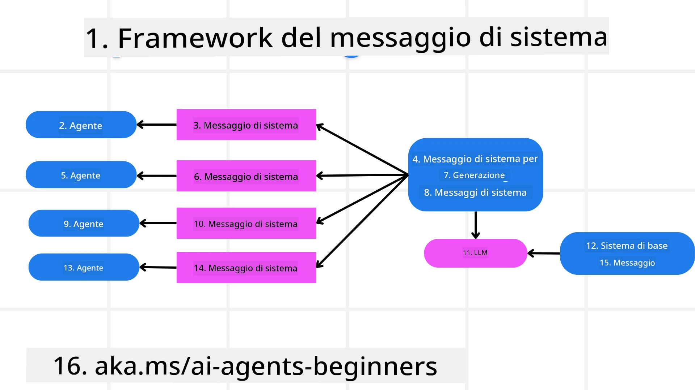
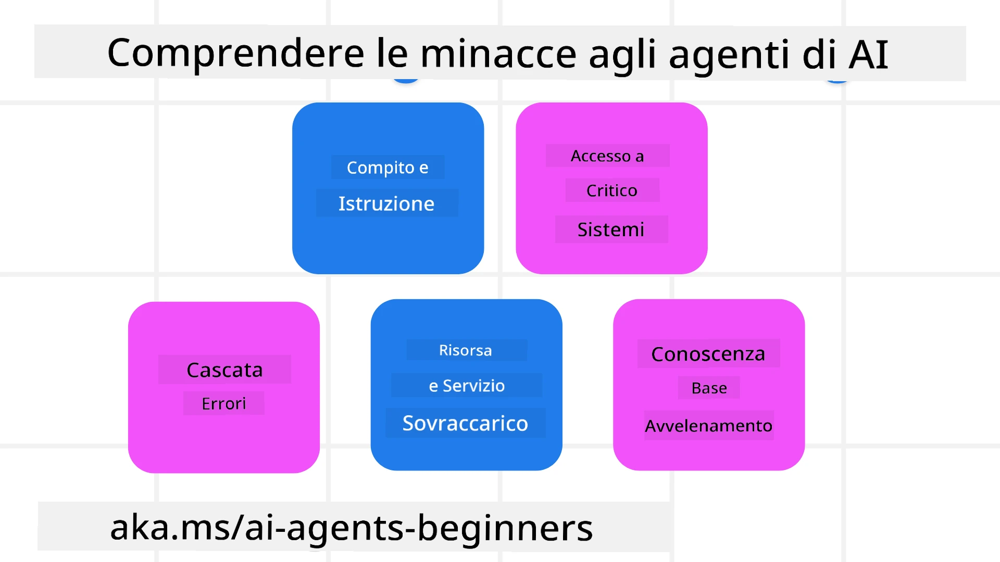
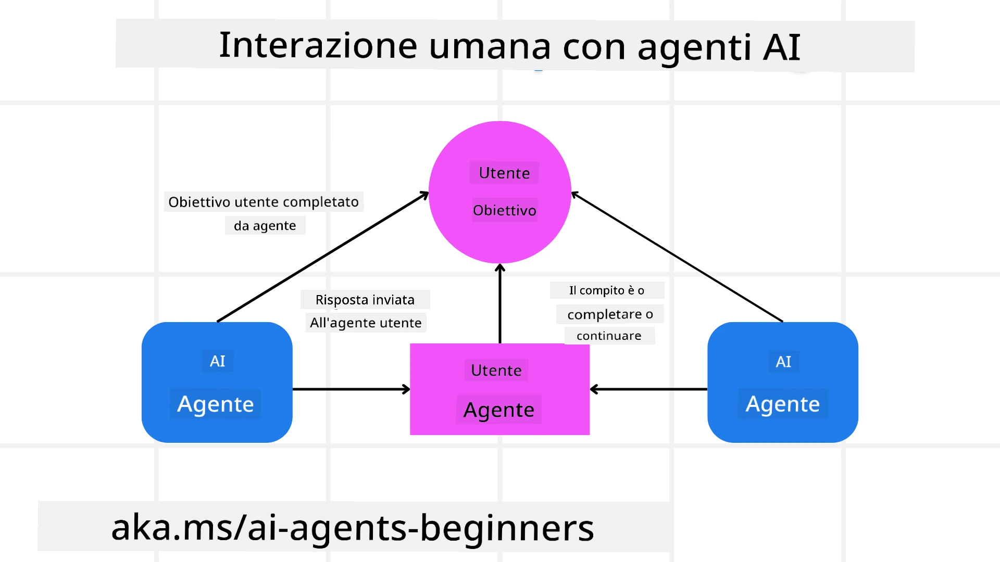

[](https://youtu.be/iZKkMEGBCUQ?si=Q-kEbcyHUMPoHp8L)

> _(Fai clic sull'immagine sopra per visualizzare il video di questa lezione)_

# Costruire agenti AI affidabili

## Introduzione

Questa lezione tratterà:

- Come costruire e distribuire agenti AI sicuri ed efficaci
- Considerazioni importanti sulla sicurezza nello sviluppo di agenti AI.
- Come mantenere la privacy dei dati e degli utenti nello sviluppo di agenti AI.

## Obiettivi di apprendimento

Dopo aver completato questa lezione, saprai come:

- Identificare e mitigare i rischi nella creazione di agenti AI.
- Implementare misure di sicurezza per garantire che dati e accessi siano gestiti correttamente.
- Creare agenti AI che mantengano la privacy dei dati e offrano un'esperienza utente di qualità.

## Sicurezza

Iniziamo esaminando come costruire applicazioni agentiche sicure. Sicurezza significa che l'agente AI si comporta come previsto. Come costruttori di applicazioni agentiche, abbiamo metodi e strumenti per massimizzare la sicurezza:

### Costruire un framework per messaggi di sistema

Se hai mai costruito un'applicazione AI usando grandi modelli di linguaggio (LLM), conosci l'importanza di progettare un prompt di sistema robusto o un messaggio di sistema. Questi prompt stabiliscono le regole meta, le istruzioni e le linee guida per come l'LLM interagirà con l'utente e i dati.

Per gli agenti AI, il prompt di sistema è ancora più importante poiché gli agenti AI avranno bisogno di istruzioni altamente specifiche per completare i compiti che abbiamo progettato per loro.

Per creare prompt di sistema scalabili, possiamo usare un framework di messaggi di sistema per costruire uno o più agenti nella nostra applicazione:



#### Passo 1: Creare un messaggio meta di sistema

Il prompt meta sarà usato da un LLM per generare i prompt di sistema per gli agenti che creiamo. Lo progettiamo come un template per poter creare efficacemente più agenti se necessario.

Ecco un esempio di messaggio meta di sistema che forniremmo all'LLM:

```plaintext
You are an expert at creating AI agent assistants. 
You will be provided a company name, role, responsibilities and other
information that you will use to provide a system prompt for.
To create the system prompt, be descriptive as possible and provide a structure that a system using an LLM can better understand the role and responsibilities of the AI assistant. 
```

#### Passo 2: Creare un prompt di base

Il passo successivo è creare un prompt di base per descrivere l'agente AI. Dovresti includere il ruolo dell'agente, i compiti che l'agente completerà e qualsiasi altra responsabilità dell'agente.

Ecco un esempio:

```plaintext
You are a travel agent for Contoso Travel that is great at booking flights for customers. To help customers you can perform the following tasks: lookup available flights, book flights, ask for preferences in seating and times for flights, cancel any previously booked flights and alert customers on any delays or cancellations of flights.  
```

#### Passo 3: Fornire il messaggio di sistema di base all'LLM

Ora possiamo ottimizzare questo messaggio di sistema fornendo il messaggio meta di sistema come messaggio di sistema e il nostro messaggio di sistema di base.

Questo produrrà un messaggio di sistema meglio progettato per guidare i nostri agenti AI:

```markdown
**Company Name:** Contoso Travel  
**Role:** Travel Agent Assistant

**Objective:**  
You are an AI-powered travel agent assistant for Contoso Travel, specializing in booking flights and providing exceptional customer service. Your main goal is to assist customers in finding, booking, and managing their flights, all while ensuring that their preferences and needs are met efficiently.

**Key Responsibilities:**

1. **Flight Lookup:**
    
    - Assist customers in searching for available flights based on their specified destination, dates, and any other relevant preferences.
    - Provide a list of options, including flight times, airlines, layovers, and pricing.
2. **Flight Booking:**
    
    - Facilitate the booking of flights for customers, ensuring that all details are correctly entered into the system.
    - Confirm bookings and provide customers with their itinerary, including confirmation numbers and any other pertinent information.
3. **Customer Preference Inquiry:**
    
    - Actively ask customers for their preferences regarding seating (e.g., aisle, window, extra legroom) and preferred times for flights (e.g., morning, afternoon, evening).
    - Record these preferences for future reference and tailor suggestions accordingly.
4. **Flight Cancellation:**
    
    - Assist customers in canceling previously booked flights if needed, following company policies and procedures.
    - Notify customers of any necessary refunds or additional steps that may be required for cancellations.
5. **Flight Monitoring:**
    
    - Monitor the status of booked flights and alert customers in real-time about any delays, cancellations, or changes to their flight schedule.
    - Provide updates through preferred communication channels (e.g., email, SMS) as needed.

**Tone and Style:**

- Maintain a friendly, professional, and approachable demeanor in all interactions with customers.
- Ensure that all communication is clear, informative, and tailored to the customer's specific needs and inquiries.

**User Interaction Instructions:**

- Respond to customer queries promptly and accurately.
- Use a conversational style while ensuring professionalism.
- Prioritize customer satisfaction by being attentive, empathetic, and proactive in all assistance provided.

**Additional Notes:**

- Stay updated on any changes to airline policies, travel restrictions, and other relevant information that could impact flight bookings and customer experience.
- Use clear and concise language to explain options and processes, avoiding jargon where possible for better customer understanding.

This AI assistant is designed to streamline the flight booking process for customers of Contoso Travel, ensuring that all their travel needs are met efficiently and effectively.

```

#### Passo 4: Iterare e migliorare

Il valore di questo framework per messaggi di sistema è la possibilità di scalare facilmente la creazione di messaggi di sistema per più agenti e di migliorare nel tempo i tuoi messaggi di sistema. È raro che tu abbia un messaggio di sistema che funzioni perfettamente al primo tentativo per il tuo caso d'uso completo. Essere in grado di fare piccoli aggiustamenti e miglioramenti cambiando il messaggio di sistema di base e passandolo attraverso il sistema ti permetterà di confrontare e valutare i risultati.

## Comprendere le minacce

Per costruire agenti AI affidabili, è importante capire e mitigare i rischi e le minacce al tuo agente AI. Vediamo solo alcune delle diverse minacce agli agenti AI e come puoi pianificare e prepararti meglio.



### Compito e Istruzioni

**Descrizione:** Gli attaccanti cercano di cambiare le istruzioni o gli obiettivi dell'agente AI tramite prompting o manipolando gli input.

**Mitigazione**: Eseguire controlli di validazione e filtri sugli input per rilevare prompt potenzialmente pericolosi prima che vengano elaborati dall'agente AI. Poiché questi attacchi normalmente richiedono interazioni frequenti con l'agente, limitare il numero di turni in una conversazione è un altro modo per prevenire questi tipi di attacchi.

### Accesso a sistemi critici

**Descrizione**: Se un agente AI ha accesso a sistemi e servizi che memorizzano dati sensibili, gli attaccanti possono compromettere la comunicazione tra l'agente e questi servizi. Questi possono essere attacchi diretti o tentativi indiretti di ottenere informazioni su questi sistemi tramite l'agente.

**Mitigazione**: Gli agenti AI dovrebbero avere accesso ai sistemi solo su base necessaria per prevenire questi tipi di attacchi. La comunicazione tra agente e sistema dovrebbe inoltre essere sicura. Implementare autenticazione e controllo degli accessi è un altro modo per proteggere queste informazioni.

### Sovraccarico di risorse e servizi

**Descrizione:** Gli agenti AI possono accedere a diversi strumenti e servizi per completare attività. Gli attaccanti possono usare questa capacità per attaccare questi servizi inviando un alto volume di richieste tramite l'agente AI, il che potrebbe causare guasti di sistema o costi elevati.

**Mitigazione:** Implementa politiche per limitare il numero di richieste che un agente AI può fare a un servizio. Limitare il numero di turni di conversazione e richieste al tuo agente AI è un altro modo per prevenire questi tipi di attacchi.

### Avvelenamento della base di conoscenza

**Descrizione:** Questo tipo di attacco non mira direttamente all'agente AI ma alla base di conoscenza e ad altri servizi che l'agente AI utilizzerà. Ciò potrebbe comportare la corruzione dei dati o delle informazioni che l'agente AI userà per completare un compito, portando a risposte parziali o non intenzionali all'utente.

**Mitigazione:** Esegui verifiche regolari sui dati che l'agente AI userà nei suoi flussi di lavoro. Assicurati che l'accesso a questi dati sia sicuro e che possano essere modificati solo da persone fidate per evitare questo tipo di attacco.

### Errori a cascata

**Descrizione:** Gli agenti AI accedono a vari strumenti e servizi per completare compiti. Errori causati da attaccanti possono portare al guasto di altri sistemi a cui l'agente AI è connesso, causando un attacco più diffuso e difficile da risolvere.

**Mitigazione**: Un metodo per evitare questo è far operare l'agente AI in un ambiente limitato, come eseguire compiti in un contenitore Docker, per prevenire attacchi diretti al sistema. Creare meccanismi di fallback e logiche di ritentativo quando certi sistemi rispondono con un errore è un altro modo per prevenire guasti più gravi.

## Human-in-the-Loop

Un altro modo efficace per costruire sistemi di agenti AI affidabili è usare un Human-in-the-loop. Questo crea un flusso dove gli utenti possono fornire feedback agli agenti durante l'esecuzione. Gli utenti agiscono essenzialmente come agenti in un sistema multi-agente e fornendo approvazione o terminazione del processo in corso.



Ecco uno snippet di codice che utilizza il Microsoft Agent Framework per mostrare come questo concetto è implementato:

```python
import os
from agent_framework.azure import AzureAIProjectAgentProvider
from azure.identity import AzureCliCredential

# Crea il provider con approvazione umana in ciclo
provider = AzureAIProjectAgentProvider(
    credential=AzureCliCredential(),
)

# Crea l'agente con un passaggio di approvazione umana
response = provider.create_response(
    input="Write a 4-line poem about the ocean.",
    instructions="You are a helpful assistant. Ask for user approval before finalizing.",
)

# L'utente può rivedere e approvare la risposta
print(response.output_text)
user_input = input("Do you approve? (APPROVE/REJECT): ")
if user_input == "APPROVE":
    print("Response approved.")
else:
    print("Response rejected. Revising...")
```

## Conclusione

Costruire agenti AI affidabili richiede un design accurato, misure di sicurezza robuste e iterazioni continue. Implementando sistemi strutturati di meta prompting, comprendendo le potenziali minacce e applicando strategie di mitigazione, gli sviluppatori possono creare agenti AI sicuri ed efficaci. Inoltre, incorporare un approccio human-in-the-loop assicura che gli agenti AI rimangano allineati alle esigenze degli utenti riducendo al minimo i rischi. Con l'evoluzione continua dell'AI, mantenere un atteggiamento proattivo su sicurezza, privacy e considerazioni etiche sarà fondamentale per favorire fiducia e affidabilità nei sistemi basati su AI.

### Hai altre domande sulla costruzione di agenti AI affidabili?

Partecipa al [Microsoft Foundry Discord](https://aka.ms/ai-agents/discord) per incontrare altri studenti, partecipare alle office hours e ottenere risposte alle tue domande sugli agenti AI.

## Risorse aggiuntive

- <a href="https://learn.microsoft.com/azure/ai-studio/responsible-use-of-ai-overview" target="_blank">Panoramica sull’AI responsabile</a>
- <a href="https://learn.microsoft.com/azure/ai-studio/concepts/evaluation-approach-gen-ai" target="_blank">Valutazione di modelli AI generativi e applicazioni AI</a>
- <a href="https://learn.microsoft.com/azure/ai-services/openai/concepts/system-message?context=%2Fazure%2Fai-studio%2Fcontext%2Fcontext&tabs=top-techniques" target="_blank">Messaggi di sistema per la sicurezza</a>
- <a href="https://blogs.microsoft.com/wp-content/uploads/prod/sites/5/2022/06/Microsoft-RAI-Impact-Assessment-Template.pdf?culture=en-us&country=us" target="_blank">Modello di valutazione del rischio</a>

## Lezione precedente

[Agentic RAG](../05-agentic-rag/README.md)

## Prossima lezione

[Planning Design Pattern](../07-planning-design/README.md)

---

<!-- CO-OP TRANSLATOR DISCLAIMER START -->
**Avvertenza**:
Questo documento è stato tradotto utilizzando il servizio di traduzione automatica AI [Co-op Translator](https://github.com/Azure/co-op-translator). Pur impegnandoci per l’accuratezza, si prega di considerare che le traduzioni automatiche possono contenere errori o imprecisioni. Il documento originale nella sua lingua madre deve essere considerato la fonte autorevole. Per informazioni critiche, si raccomanda una traduzione professionale effettuata da traduttori umani. Non ci assumiamo responsabilità per eventuali malintesi o interpretazioni errate derivanti dall’uso di questa traduzione.
<!-- CO-OP TRANSLATOR DISCLAIMER END -->