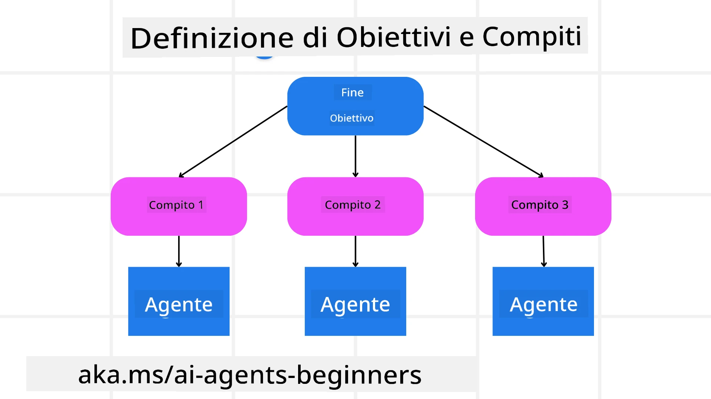

[](https://youtu.be/kPfJ2BrBCMY?si=9pYpPXp0sSbK91Dr)

> _(Clicca sull'immagine sopra per vedere il video di questa lezione)_

# Progettazione della Pianificazione

## Introduzione

Questa lezione tratterà

* Definire un obiettivo chiaro e generale e suddividere un compito complesso in attività gestibili.
* Sfruttare un output strutturato per risposte più affidabili e leggibili dalle macchine.
* Applicare un approccio basato su eventi per gestire compiti dinamici e input imprevedibili.

## Obiettivi di Apprendimento

Dopo aver completato questa lezione, avrai una comprensione di:

* Identificare e stabilire un obiettivo generale per un agente AI, assicurandosi che sappia chiaramente cosa deve essere raggiunto.
* Decomporre un compito complesso in sottoattività gestibili e organizzarle in una sequenza logica.
* Fornire agli agenti gli strumenti giusti (ad esempio, strumenti di ricerca o di analisi dati), decidere quando e come usarli e gestire situazioni impreviste che si presentano.
* Valutare i risultati delle sottoattività, misurare le prestazioni e iterare sulle azioni per migliorare il risultato finale.

## Definizione dell'Obiettivo Generale e Scomposizione del Compito



La maggior parte dei compiti del mondo reale è troppo complessa per essere affrontata in un unico passaggio. Un agente AI ha bisogno di un obiettivo conciso per guidare la sua pianificazione e azioni. Per esempio, considera l'obiettivo:

    "Generare un itinerario di viaggio di 3 giorni."

Sebbene sia semplice da enunciare, necessita comunque di affinamenti. Più chiaro è l'obiettivo, meglio l’agente (e qualsiasi collaboratore umano) può concentrarsi sul conseguire il risultato giusto, come creare un itinerario completo con opzioni di volo, raccomandazioni alberghiere e suggerimenti per attività.

### Scomposizione del Compito

Compiti grandi o intricati diventano più gestibili se suddivisi in sottoattività più piccole, orientate all'obiettivo.
Per l’esempio dell’itinerario di viaggio, potresti scomporre l’obiettivo in:

* Prenotazione voli
* Prenotazione hotel
* Noleggio auto
* Personalizzazione

Ciascuna sottoattività può quindi essere gestita da agenti o processi dedicati. Un agente potrebbe specializzarsi nella ricerca delle migliori offerte di volo, un altro concentrarsi sulle prenotazioni alberghiere, e così via. Un agente coordinatore o “downstream” può quindi compilare questi risultati in un unico itinerario coerente per l'utente finale.

Questo approccio modulare consente anche miglioramenti incrementali. Ad esempio, puoi aggiungere agenti specializzati per consigli alimentari o suggerimenti di attività locali e perfezionare l’itinerario nel tempo.

### Output strutturato

I Large Language Models (LLM) possono generare output strutturati (ad esempio JSON) più facili da analizzare e processare per agenti o servizi downstream. Questo è particolarmente utile in un contesto multi-agente, dove possiamo agire su questi compiti dopo aver ricevuto l’output di pianificazione.

Lo snippet Python seguente dimostra un agente di pianificazione semplice che scompone un obiettivo in sottoattività e genera un piano strutturato:

```python
from pydantic import BaseModel
from enum import Enum
from typing import List, Optional, Union
import json
import os
from typing import Optional
from pprint import pprint
from agent_framework.azure import AzureAIProjectAgentProvider
from azure.identity import AzureCliCredential

class AgentEnum(str, Enum):
    FlightBooking = "flight_booking"
    HotelBooking = "hotel_booking"
    CarRental = "car_rental"
    ActivitiesBooking = "activities_booking"
    DestinationInfo = "destination_info"
    DefaultAgent = "default_agent"
    GroupChatManager = "group_chat_manager"

# Modello di SubTask di Viaggio
class TravelSubTask(BaseModel):
    task_details: str
    assigned_agent: AgentEnum  # vogliamo assegnare il compito all'agente

class TravelPlan(BaseModel):
    main_task: str
    subtasks: List[TravelSubTask]
    is_greeting: bool

provider = AzureAIProjectAgentProvider(credential=AzureCliCredential())

# Definire il messaggio dell'utente
system_prompt = """You are a planner agent.
    Your job is to decide which agents to run based on the user's request.
    Provide your response in JSON format with the following structure:
{'main_task': 'Plan a family trip from Singapore to Melbourne.',
 'subtasks': [{'assigned_agent': 'flight_booking',
               'task_details': 'Book round-trip flights from Singapore to '
                               'Melbourne.'}
    Below are the available agents specialised in different tasks:
    - FlightBooking: For booking flights and providing flight information
    - HotelBooking: For booking hotels and providing hotel information
    - CarRental: For booking cars and providing car rental information
    - ActivitiesBooking: For booking activities and providing activity information
    - DestinationInfo: For providing information about destinations
    - DefaultAgent: For handling general requests"""

user_message = "Create a travel plan for a family of 2 kids from Singapore to Melbourne"

response = client.create_response(input=user_message, instructions=system_prompt)

response_content = response.output_text
pprint(json.loads(response_content))
```

### Agente di Pianificazione con Orchestrazione Multi-Agente

In questo esempio, un Semantic Router Agent riceve una richiesta utente (ad esempio, "Ho bisogno di un piano alberghiero per il mio viaggio.").

Il pianificatore quindi:

* Riceve il Piano Alberghiero: Il pianificatore prende il messaggio dell'utente e, basandosi su un prompt di sistema (inclusi i dettagli degli agenti disponibili), genera un piano di viaggio strutturato.
* Elenca Agenti e i loro Strumenti: Il registro degli agenti contiene un elenco di agenti (ad esempio, per voli, hotel, noleggio auto e attività) insieme alle funzioni o strumenti che offrono.
* Indirizza il Piano agli Agenti Rispettivi: A seconda del numero di sottoattività, il pianificatore invia il messaggio direttamente a un agente dedicato (per scenari a singolo compito) o coordina tramite un gestore di chat di gruppo per la collaborazione multi-agente.
* Riepiloga il Risultato: Infine, il pianificatore riassume il piano generato per chiarezza.
Il seguente esempio di codice Python illustra questi passaggi:

```python

from pydantic import BaseModel

from enum import Enum
from typing import List, Optional, Union

class AgentEnum(str, Enum):
    FlightBooking = "flight_booking"
    HotelBooking = "hotel_booking"
    CarRental = "car_rental"
    ActivitiesBooking = "activities_booking"
    DestinationInfo = "destination_info"
    DefaultAgent = "default_agent"
    GroupChatManager = "group_chat_manager"

# Modello di Sottoattività di Viaggio

class TravelSubTask(BaseModel):
    task_details: str
    assigned_agent: AgentEnum # vogliamo assegnare il compito all'agente

class TravelPlan(BaseModel):
    main_task: str
    subtasks: List[TravelSubTask]
    is_greeting: bool
import json
import os
from typing import Optional

from agent_framework.azure import AzureAIProjectAgentProvider
from azure.identity import AzureCliCredential

# Crea il client

provider = AzureAIProjectAgentProvider(credential=AzureCliCredential())

from pprint import pprint

# Definisci il messaggio utente

system_prompt = """You are a planner agent.
    Your job is to decide which agents to run based on the user's request.
    Below are the available agents specialized in different tasks:
    - FlightBooking: For booking flights and providing flight information
    - HotelBooking: For booking hotels and providing hotel information
    - CarRental: For booking cars and providing car rental information
    - ActivitiesBooking: For booking activities and providing activity information
    - DestinationInfo: For providing information about destinations
    - DefaultAgent: For handling general requests"""

user_message = "Create a travel plan for a family of 2 kids from Singapore to Melbourne"

response = client.create_response(input=user_message, instructions=system_prompt)

response_content = response.output_text

# Stampa il contenuto della risposta dopo averlo caricato come JSON

pprint(json.loads(response_content))
```

Quello che segue è l'output dal codice precedente e puoi usare questo output strutturato per indirizzare all'`assigned_agent` e riassumere il piano di viaggio all'utente finale.

```json
{
    "is_greeting": "False",
    "main_task": "Plan a family trip from Singapore to Melbourne.",
    "subtasks": [
        {
            "assigned_agent": "flight_booking",
            "task_details": "Book round-trip flights from Singapore to Melbourne."
        },
        {
            "assigned_agent": "hotel_booking",
            "task_details": "Find family-friendly hotels in Melbourne."
        },
        {
            "assigned_agent": "car_rental",
            "task_details": "Arrange a car rental suitable for a family of four in Melbourne."
        },
        {
            "assigned_agent": "activities_booking",
            "task_details": "List family-friendly activities in Melbourne."
        },
        {
            "assigned_agent": "destination_info",
            "task_details": "Provide information about Melbourne as a travel destination."
        }
    ]
}
```

Un esempio di notebook con il codice precedente è disponibile [qui](07-python-agent-framework.ipynb).

### Pianificazione Iterativa

Alcuni compiti richiedono un processo di andirivieni o una ripianificazione, dove il risultato di una sottoattività influenza la successiva. Per esempio, se l’agente scopre un formato di dati imprevisto durante la prenotazione dei voli, potrebbe dover adattare la sua strategia prima di passare alla prenotazione degli hotel.

Inoltre, il feedback dell’utente (ad esempio, un umano che decide di preferire un volo anticipato) può innescare una ripianificazione parziale. Questo approccio dinamico e iterativo assicura che la soluzione finale sia allineata con vincoli reali ed evoluzioni delle preferenze dell’utente.

es. codice esempio

```python
from agent_framework.azure import AzureAIProjectAgentProvider
from azure.identity import AzureCliCredential
#.. come il codice precedente e passa la cronologia dell'utente, il piano corrente

system_prompt = """You are a planner agent to optimize the
    Your job is to decide which agents to run based on the user's request.
    Below are the available agents specialized in different tasks:
    - FlightBooking: For booking flights and providing flight information
    - HotelBooking: For booking hotels and providing hotel information
    - CarRental: For booking cars and providing car rental information
    - ActivitiesBooking: For booking activities and providing activity information
    - DestinationInfo: For providing information about destinations
    - DefaultAgent: For handling general requests"""

user_message = "Create a travel plan for a family of 2 kids from Singapore to Melbourne"

response = client.create_response(
    input=user_message,
    instructions=system_prompt,
    context=f"Previous travel plan - {TravelPlan}",
)
# .. riorganizza e invia i compiti agli agenti rispettivi
```

Per una pianificazione più completa consulta il Blogpost <a href="https://www.microsoft.com/research/articles/magentic-one-a-generalist-multi-agent-system-for-solving-complex-tasks" target="_blank">Magnetic One</a> per la risoluzione di compiti complessi.

## Riepilogo

In questo articolo abbiamo esaminato un esempio di come possiamo creare un pianificatore che può selezionare dinamicamente gli agenti disponibili definiti. L’output del Pianificatore scompone i compiti e assegna gli agenti affinché possano essere eseguiti. Si presuppone che gli agenti abbiano accesso alle funzioni/strumenti necessari per svolgere il compito. In aggiunta agli agenti puoi includere altri pattern come reflection, summarizer e round robin chat per personalizzare ulteriormente.

## Risorse Aggiuntive

Magnetic One - Un sistema multi-agente generalista per risolvere compiti complessi che ha raggiunto risultati impressionanti su molteplici benchmark agentici sfidanti. Riferimento: <a href="https://www.microsoft.com/research/articles/magentic-one-a-generalist-multi-agent-system-for-solving-complex-tasks" target="_blank">Magnetic One</a>. In questa implementazione l’orchestratore crea piani specifici per i compiti e delega queste attività agli agenti disponibili. Oltre alla pianificazione, l’orchestratore impiega anche un meccanismo di tracciamento per monitorare il progresso del compito e ripianificare se necessario.

### Hai altre domande sul Pattern di Progettazione della Pianificazione?

Unisciti al [Microsoft Foundry Discord](https://aka.ms/ai-agents/discord) per incontrare altri studenti, partecipare a ore di supporto e ricevere risposte alle tue domande sugli Agenti AI.

## Lezione Precedente

[Costruire Agenti AI Affidabili](../06-building-trustworthy-agents/README.md)

## Lezione Successiva

[Pattern di Progettazione Multi-Agente](../08-multi-agent/README.md)

---

<!-- CO-OP TRANSLATOR DISCLAIMER START -->
**Disclaimer**:  
Questo documento è stato tradotto utilizzando il servizio di traduzione automatica AI [Co-op Translator](https://github.com/Azure/co-op-translator). Pur impegnandoci per garantire l’accuratezza, si prega di considerare che le traduzioni automatiche possono contenere errori o imprecisioni. Il documento originale nella sua lingua nativa deve essere considerato la fonte autorevole. Per informazioni di carattere critico, si consiglia una traduzione professionale umana. Non ci assumiamo alcuna responsabilità per eventuali fraintendimenti o interpretazioni errate derivanti dall’uso di questa traduzione.
<!-- CO-OP TRANSLATOR DISCLAIMER END -->