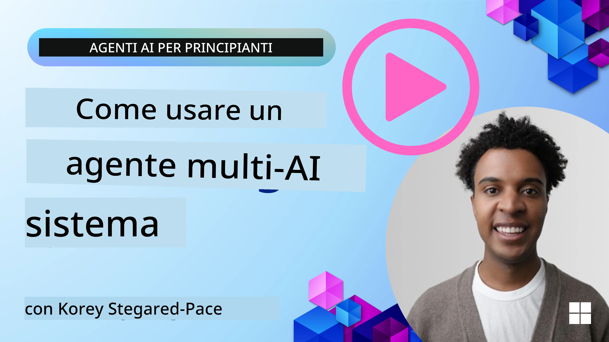
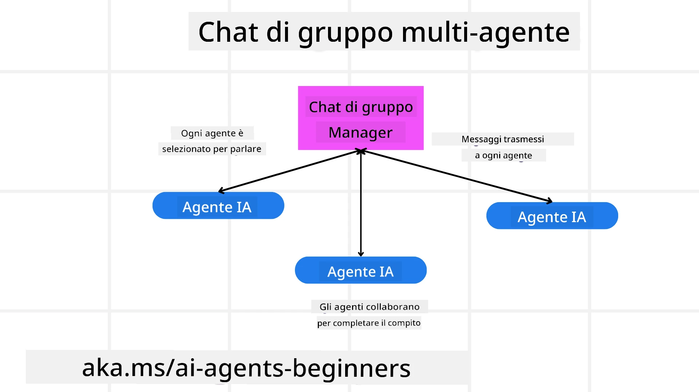
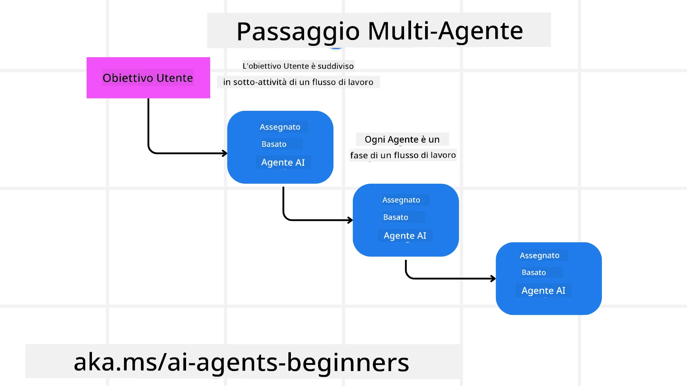
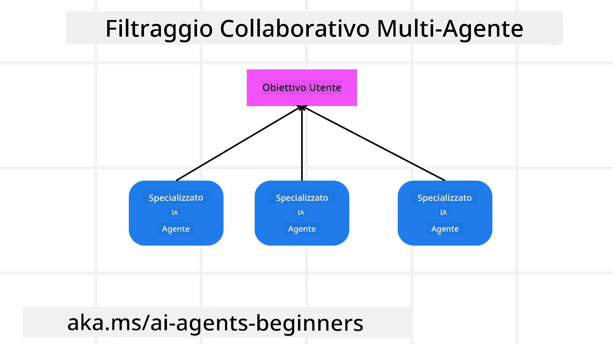

> _(Clicca sull'immagine sopra per visualizzare il video di questa lezione)_

# Modelli di progettazione multi-agente

Non appena inizi a lavorare su un progetto che coinvolge più agenti, dovrai considerare il modello di progettazione multi-agente. Tuttavia, potrebbe non essere immediatamente chiaro quando passare a più agenti e quali siano i vantaggi.

## Introduzione

In questa lezione, cerchiamo di rispondere alle seguenti domande:

- Quali sono gli scenari in cui i multi-agenti sono applicabili?
- Quali sono i vantaggi di usare più agenti rispetto a un singolo agente che svolge molteplici compiti?
- Quali sono i blocchi costitutivi per implementare il modello di progettazione multi-agente?
- Come possiamo avere visibilità su come i molteplici agenti interagiscono tra loro?

## Obiettivi di apprendimento

Dopo questa lezione, dovresti essere in grado di:

- Identificare scenari in cui i multi-agenti sono applicabili
- Riconoscere i vantaggi dell'uso di più agenti rispetto a un agente singolo
- Comprendere i blocchi costitutivi per l’implementazione del modello di progettazione multi-agente

Qual è il quadro generale?

*I multi-agenti sono un modello di progettazione che permette a molteplici agenti di lavorare insieme per raggiungere un obiettivo comune*.

Questo modello è ampiamente utilizzato in vari campi, tra cui la robotica, i sistemi autonomi e il calcolo distribuito.

## Scenari in cui i Multi-Agenti sono Applicabili

Quali scenari sono un buon caso d'uso per l'adozione dei multi-agenti? La risposta è che esistono molti scenari in cui impiegare più agenti è vantaggioso, specialmente nei seguenti casi:

- **Carichi di lavoro elevati**: Grandi carichi di lavoro possono essere divisi in compiti più piccoli e assegnati a diversi agenti, permettendo l'elaborazione parallela e un completamento più veloce. Un esempio è nel caso di un grande compito di elaborazione dati.
- **Compiti complessi**: Come per i carichi di lavoro elevati, i compiti complessi possono essere suddivisi in sotto-compiti più piccoli e assegnati a agenti diversi, ognuno specializzato in un aspetto specifico del compito. Un buon esempio è nel caso dei veicoli autonomi dove diversi agenti gestiscono la navigazione, il rilevamento degli ostacoli e la comunicazione con altri veicoli.
- **Competenze diverse**: Diversi agenti possono possedere competenze diverse, permettendo loro di gestire vari aspetti di un compito in modo più efficace rispetto a un singolo agente. A questo riguardo, un buon esempio è nel settore sanitario dove agenti possono gestire diagnosi, piani di trattamento e monitoraggio dei pazienti.

## Vantaggi dell'Utilizzo di Multi-Agenti rispetto a un Agente Singolo

Un sistema con un singolo agente potrebbe funzionare bene per compiti semplici, ma per compiti più complessi, l'uso di molteplici agenti può offrire diversi vantaggi:

- **Specializzazione**: Ogni agente può essere specializzato per un compito specifico. La mancanza di specializzazione in un singolo agente significa avere un agente che può fare tutto ma potrebbe confondersi su cosa fare quando si trova di fronte a un compito complesso. Potrebbe per esempio finire per fare un compito per cui non è il più adatto.
- **Scalabilità**: È più facile scalare i sistemi aggiungendo altri agenti piuttosto che sovraccaricare un singolo agente.
- **Tolleranza ai guasti**: Se un agente fallisce, gli altri possono continuare a funzionare, garantendo l'affidabilità del sistema.

Facciamo un esempio, prenotiamo un viaggio per un utente. Un sistema con un solo agente dovrebbe gestire tutti gli aspetti del processo di prenotazione, dalla ricerca dei voli alla prenotazione di hotel e auto a noleggio. Per ottenere questo con un singolo agente, l’agente dovrebbe avere strumenti per gestire tutti questi compiti. Ciò potrebbe portare a un sistema complesso e monolitico difficile da mantenere e scalare. Un sistema multi-agente, invece, potrebbe avere agenti diversi specializzati nella ricerca voli, nella prenotazione di hotel e di auto a noleggio. Ciò renderebbe il sistema più modulare, più facile da mantenere e scalabile.

Confronta questo con un'agenzia viaggi gestita come un negozio a conduzione familiare rispetto a un’agenzia viaggi gestita come una franchigia. Il negozio a conduzione familiare avrebbe un singolo agente che gestisce tutti gli aspetti del processo di prenotazione, mentre la franchigia avrebbe agenti diversi che gestiscono vari aspetti del processo di prenotazione.

## Blocchi Costitutivi per l'Implementazione del Modello di Progettazione Multi-Agente

Prima di poter implementare il modello multi-agente, devi comprendere i blocchi costitutivi che compongono il modello.

Rendiamo tutto più concreto riprendendo l'esempio della prenotazione di un viaggio per un utente. In questo caso, i blocchi costitutivi includerebbero:

- **Comunicazione tra agenti**: Gli agenti per la ricerca voli, la prenotazione degli hotel e delle auto a noleggio devono comunicare e condividere informazioni sulle preferenze e i vincoli dell’utente. Devi decidere i protocolli e i metodi per questa comunicazione. Questo significa in concreto che l'agente per la ricerca voli deve comunicare con l'agente per la prenotazione degli hotel per garantire che l'hotel sia prenotato per le stesse date del volo. Ciò implica che gli agenti devono condividere informazioni sulle date di viaggio dell’utente, il che significa che devi decidere *quali agenti condividono le informazioni e come le condividono*.
- **Meccanismi di coordinamento**: Gli agenti devono coordinare le loro azioni per assicurarsi che le preferenze e i vincoli dell’utente siano rispettati. Una preferenza dell’utente potrebbe essere quella di voler un hotel vicino all’aeroporto mentre un vincolo potrebbe essere che le auto a noleggio sono disponibili solo all’aeroporto. Ciò significa che l’agente per la prenotazione degli hotel deve coordinarsi con l’agente per la prenotazione delle auto a noleggio per garantire che le preferenze e i vincoli dell’utente siano rispettati. Devi decidere *come gli agenti stanno coordinando le loro azioni*.
- **Architettura degli agenti**: Gli agenti devono avere una struttura interna per prendere decisioni e imparare dalle interazioni con l’utente. Ciò significa che l’agente per la ricerca voli deve avere una struttura interna per prendere decisioni su quali voli raccomandare all’utente. Devi decidere *come gli agenti prendono decisioni e imparano dalle interazioni con l’utente*. Esempi di come un agente apprende e migliora possono essere che l’agente per la ricerca voli utilizzi un modello di machine learning per raccomandare voli all’utente sulla base delle preferenze passate.
- **Visibilità nelle interazioni multi-agente**: Devi avere visibilità su come i molteplici agenti interagiscono tra loro. Ciò significa che devi avere strumenti e tecniche per tracciare le attività e le interazioni degli agenti. Questo potrebbe essere sotto forma di strumenti di logging e monitoraggio, strumenti di visualizzazione e metriche di performance.
- **Modelli multi-agente**: Esistono diversi modelli per implementare sistemi multi-agente, come architetture centralizzate, decentralizzate e ibride. Devi decidere quale modello si adatta meglio al tuo caso d’uso.
- **Umano in the loop**: Nella maggior parte dei casi, avrai un umano nel ciclo e devi istruire gli agenti su quando chiedere l'intervento umano. Questo potrebbe avvenire sotto forma di un utente che chiede un hotel o un volo specifico che gli agenti non hanno raccomandato oppure chiedendo conferma prima di prenotare un volo o un hotel.

## Visibilità nelle Interazioni Multi-Agente

È importante che tu abbia visibilità su come i molteplici agenti interagiscono tra loro. Questa visibilità è essenziale per il debug, l'ottimizzazione e per garantire l’efficacia complessiva del sistema. Per ottenere ciò, devi avere strumenti e tecniche per tracciare le attività e le interazioni degli agenti. Questo potrebbe essere sotto forma di strumenti di logging e monitoraggio, strumenti di visualizzazione e metriche di performance.

Per esempio, nel caso della prenotazione di un viaggio per un utente, potresti avere una dashboard che mostra lo stato di ogni agente, le preferenze e i vincoli dell’utente e le interazioni tra agenti. Questa dashboard potrebbe mostrare le date di viaggio dell’utente, i voli raccomandati dall’agente voli, gli hotel raccomandati dall’agente hotel e le auto a noleggio raccomandate dall’agente noleggio auto. Questo ti darebbe una chiara visione di come gli agenti stanno interagendo tra loro e se le preferenze e i vincoli dell’utente vengono rispettati.

Analizziamo ciascuno di questi aspetti più nel dettaglio.

- **Strumenti di logging e monitoraggio**: Vuoi avere un logging per ogni azione intrapresa da un agente. Una voce di log potrebbe memorizzare informazioni sull’agente che ha svolto l’azione, l’azione compiuta, il momento in cui l’azione è stata svolta e il risultato dell’azione. Queste informazioni poi possono essere utilizzate per il debug, l’ottimizzazione e altro.
- **Strumenti di visualizzazione**: Gli strumenti di visualizzazione possono aiutarti a vedere le interazioni tra agenti in modo più intuitivo. Per esempio, potresti avere un grafo che mostra il flusso di informazioni tra gli agenti. Questo potrebbe aiutarti a identificare colli di bottiglia, inefficienze e altri problemi nel sistema.
- **Metriche di performance**: Le metriche di performance possono aiutarti a monitorare l’efficacia del sistema multi-agente. Per esempio, potresti tracciare il tempo impiegato per completare un compito, il numero di compiti completati per unità di tempo e la precisione delle raccomandazioni fatte dagli agenti. Queste informazioni possono aiutarti a identificare aree di miglioramento e a ottimizzare il sistema.

## Modelli Multi-Agente

Addentriamoci in alcuni modelli concreti che possiamo usare per creare app multi-agente. Ecco alcuni modelli interessanti da considerare:

### Chat di gruppo

Questo modello è utile quando vuoi creare un'applicazione di chat di gruppo in cui molteplici agenti possono comunicare tra loro. I casi d'uso tipici per questo modello includono la collaborazione di team, il supporto clienti e i social network.

In questo modello, ogni agente rappresenta un utente nella chat di gruppo, e i messaggi vengono scambiati tra agenti usando un protocollo di messaggistica. Gli agenti possono inviare messaggi alla chat di gruppo, ricevere messaggi dalla chat di gruppo e rispondere ai messaggi di altri agenti.

Questo modello può essere implementato usando un’architettura centralizzata in cui tutti i messaggi vengono instradati attraverso un server centrale, oppure un’architettura decentralizzata in cui i messaggi vengono scambiati direttamente.

### Passaggio di consegne

Questo modello è utile quando vuoi creare un'applicazione in cui molteplici agenti possano passarsi compiti tra loro.

I casi d'uso tipici includono il supporto clienti, la gestione dei compiti e l'automazione dei flussi di lavoro.

In questo modello, ogni agente rappresenta un compito o una fase di un flusso di lavoro, e gli agenti possono passare i compiti ad altri agenti in base a regole predefinite.

### Filtraggio collaborativo

Questo modello è utile quando vuoi creare un'applicazione dove molti agenti collaborano per fornire raccomandazioni agli utenti.

Il motivo per cui vorresti che più agenti collaborino è che ogni agente può avere esperienze diverse e può contribuire al processo di raccomandazione in modi differenti.

Facciamo un esempio in cui un utente vuole una raccomandazione sul miglior titolo azionario da acquistare nel mercato azionario.

- **Esperto di settore**: Un agente potrebbe essere un esperto in uno specifico settore industriale.
- **Analisi tecnica**: Un altro agente potrebbe essere un esperto in analisi tecnica.
- **Analisi fondamentale**: Un altro agente potrebbe essere un esperto in analisi fondamentale. Collaborando, questi agenti possono fornire una raccomandazione più completa all’utente.

## Scenario: Processo di rimborso

Considera uno scenario in cui un cliente cerca di ottenere un rimborso per un prodotto. Possono esserci diversi agenti coinvolti in questo processo, ma dividiamoli tra agenti specifici per questo processo e agenti generali che possono essere usati in altri processi.

**Agenti specifici per il processo di rimborso**:

Ecco alcuni agenti che potrebbero essere coinvolti nel processo di rimborso:

- **Agente cliente**: Questo agente rappresenta il cliente ed è responsabile di avviare il processo di rimborso.
- **Agente venditore**: Questo agente rappresenta il venditore ed è responsabile di elaborare il rimborso.
- **Agente pagamento**: Questo agente rappresenta il processo di pagamento ed è responsabile di rimborsare il pagamento al cliente.
- **Agente risoluzione**: Questo agente rappresenta il processo di risoluzione ed è responsabile di risolvere eventuali problemi che sorgono durante il processo di rimborso.
- **Agente conformità**: Questo agente rappresenta il processo di conformità ed è responsabile di assicurare che il processo di rimborso rispetti regolamenti e politiche.

**Agenti generali**:

Questi agenti possono essere impiegati in altre aree della tua attività.

- **Agente spedizioni**: Questo agente rappresenta il processo di spedizione ed è responsabile di spedire il prodotto indietro al venditore. Questo agente può essere usato sia per il processo di rimborso, sia per la spedizione generale di un prodotto acquistato, per esempio.
- **Agente feedback**: Questo agente rappresenta il processo di feedback ed è responsabile di raccogliere il feedback dal cliente. Il feedback può essere raccolto in qualsiasi momento e non solo durante il processo di rimborso.
- **Agente escalation**: Questo agente rappresenta il processo di escalation ed è responsabile di elevare i problemi a un livello superiore di supporto. Puoi usare questo tipo di agente per qualsiasi processo in cui sia necessario un escalation di un problema.
- **Agente notifiche**: Questo agente rappresenta il processo di notifiche ed è responsabile di inviare notifiche al cliente in varie fasi del processo di rimborso.
- **Agente analisi**: Questo agente rappresenta il processo di analisi ed è responsabile dell’analisi dei dati relativi al processo di rimborso.
- **Agente audit**: Questo agente rappresenta il processo di audit ed è responsabile di monitorare il processo di rimborso per assicurare che venga eseguito correttamente.
- **Agente report**: Questo agente rappresenta il processo di reportistica ed è responsabile di generare report sul processo di rimborso.
- **Agente conoscenza**: Questo agente rappresenta il processo di gestione della conoscenza ed è responsabile di mantenere una base di conoscenza relativa al processo di rimborso. Questo agente potrebbe essere esperto sia nei rimborsi che in altre parti della tua attività.
- **Agente sicurezza**: Questo agente rappresenta il processo di sicurezza ed è responsabile di garantire la sicurezza del processo di rimborso.
- **Agente qualità**: Questo agente rappresenta il processo di qualità ed è responsabile di assicurare la qualità del processo di rimborso.

Sono elencati parecchi agenti sia per il processo specifico di rimborso sia per gli agenti generali che possono essere impiegati in altre parti della tua attività. Speriamo che questo ti dia un’idea di come puoi decidere quali agenti usare nel tuo sistema multi-agente.

## Compito

Progetta un sistema multi-agente per un processo di supporto clienti. Identifica gli agenti coinvolti nel processo, i loro ruoli e responsabilità, e come interagiscono tra loro. Considera sia agenti specifici al processo di supporto clienti, sia agenti generali che possono essere usati in altre parti della tua attività.
> Rifletti prima di leggere la seguente soluzione, potresti aver bisogno di più agenti di quanto pensi.

> SUGGERIMENTO: Pensa alle diverse fasi del processo di supporto clienti e considera anche gli agenti necessari per qualsiasi sistema.

## Soluzione

[Solution](./solution/solution.md)

## Verifiche di conoscenza

Domanda: Quando dovresti considerare l'uso di multi-agenti?

- [ ] A1: Quando hai un carico di lavoro piccolo e un compito semplice.
- [ ] A2: Quando hai un carico di lavoro elevato
- [ ] A3: Quando hai un compito semplice.

[Solution quiz](./solution/solution-quiz.md)

## Riepilogo

In questa lezione, abbiamo esaminato il design pattern multi-agente, inclusi gli scenari in cui è applicabile, i vantaggi dell'utilizzo di multi-agenti rispetto a un singolo agente, i componenti fondamentali per implementare il design pattern multi-agente e come avere visibilità su come i molteplici agenti interagiscono tra loro.

### Hai altre domande sul design pattern Multi-Agente?

Unisciti al [Microsoft Foundry Discord](https://aka.ms/ai-agents/discord) per incontrare altri studenti, partecipare alle ore di consulenza e ricevere risposte alle tue domande sugli AI Agents.

## Risorse aggiuntive

- <a href="https://learn.microsoft.com/azure/ai-services/agents/overview" target="_blank">Documentazione Microsoft Agent Framework</a>
- <a href="https://www.analyticsvidhya.com/blog/2024/10/agentic-design-patterns/" target="_blank">Agentic design patterns</a>

## Lezione precedente

[Planning Design](../07-planning-design/README.md)

## Prossima lezione

[Metacognition in AI Agents](../09-metacognition/README.md)

---

<!-- CO-OP TRANSLATOR DISCLAIMER START -->
**Disclaimer**:  
Questo documento è stato tradotto utilizzando il servizio di traduzione automatica [Co-op Translator](https://github.com/Azure/co-op-translator). Pur impegnandoci per garantire l’accuratezza, si prega di notare che le traduzioni automatiche possono contenere errori o imprecisioni. Il documento originale nella sua lingua nativa deve essere considerato la fonte autorevole. Per informazioni critiche, si raccomanda la traduzione professionale effettuata da un umano. Non ci assumiamo alcuna responsabilità per eventuali malintesi o interpretazioni errate derivanti dall’uso di questa traduzione.
<!-- CO-OP TRANSLATOR DISCLAIMER END -->