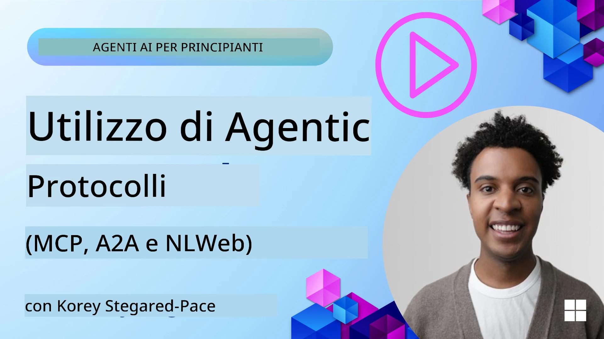
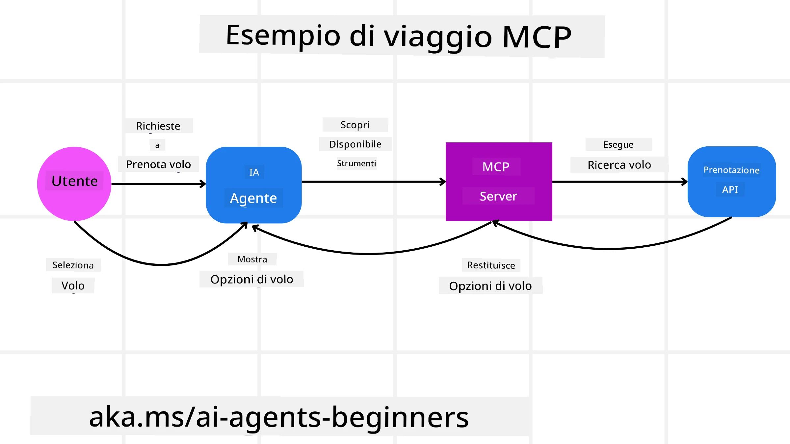
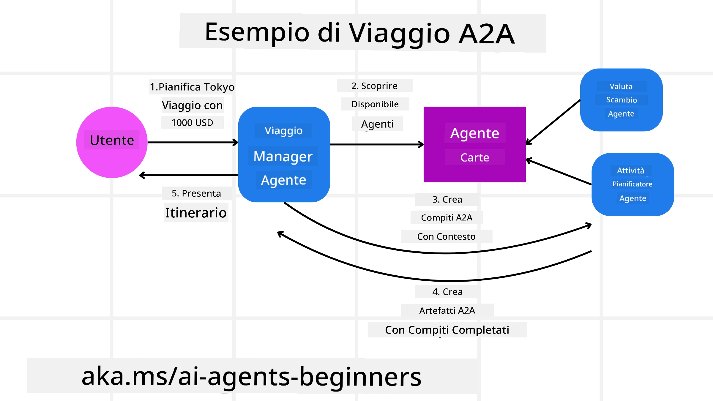
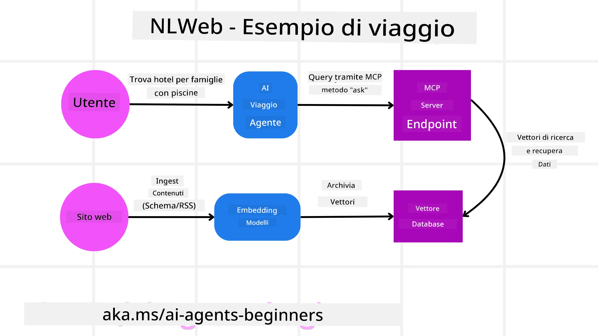

# Uso dei protocolli agentici (MCP, A2A e NLWeb)

> _(Clicca sull'immagine sopra per visualizzare il video di questa lezione)_

Con l'aumento dell'uso degli agenti AI, cresce anche la necessità di protocolli che assicurino standardizzazione, sicurezza e supportino l'innovazione aperta. In questa lezione, copriremo 3 protocolli che mirano a soddisfare questa esigenza - Model Context Protocol (MCP), Agent to Agent (A2A) e Natural Language Web (NLWeb).

## Introduzione

In questa lezione, tratteremo:

• Come **MCP** consente agli agenti AI di accedere a strumenti e dati esterni per completare i compiti degli utenti.

•  Come **A2A** abilita la comunicazione e la collaborazione tra diversi agenti AI.

• Come **NLWeb** porta interfacce in linguaggio naturale a qualsiasi sito web, permettendo agli agenti AI di scoprire e interagire con i contenuti.

## Obiettivi di apprendimento

• **Identificare** lo scopo principale e i benefici di MCP, A2A e NLWeb nel contesto degli agenti AI.

• **Spiegare** come ciascun protocollo facilita la comunicazione e l'interazione tra LLM, strumenti e altri agenti.

• **Riconoscere** i ruoli distinti che ciascun protocollo svolge nella costruzione di sistemi agentici complessi.

## Protocollo Model Context

Il **Model Context Protocol (MCP)** è uno standard aperto che fornisce un modo standardizzato per le applicazioni di fornire contesto e strumenti agli LLM. Ciò abilita un "adattatore universale" verso diverse fonti di dati e strumenti a cui gli agenti AI possono collegarsi in modo coerente.

Esaminiamo i componenti di MCP, i benefici rispetto all'uso diretto delle API e un esempio di come gli agenti AI potrebbero utilizzare un server MCP.

### Componenti principali di MCP

MCP opera su un'**architettura client-server** e i componenti principali sono:

• **Hosts** sono applicazioni LLM (per esempio un editor di codice come VSCode) che avviano le connessioni a un Server MCP.

• **Clients** sono componenti all'interno dell'applicazione host che mantengono connessioni one-to-one con i server.

• **Servers** sono programmi leggeri che espongono capacità specifiche.

Inclusi nel protocollo ci sono tre primitive principali che costituiscono le capacità di un Server MCP:

• **Tools**: Si tratta di azioni discrete o funzioni che un agente AI può chiamare per eseguire un'operazione. Per esempio, un servizio meteo potrebbe esporre uno strumento "get weather", oppure un server di e-commerce potrebbe esporre uno strumento "purchase product". I server MCP pubblicizzano il nome di ciascuno strumento, la descrizione e lo schema di input/output nella loro lista di capacità.

• **Resources**: Questi sono elementi di dati o documenti in sola lettura che un server MCP può fornire, e i client possono recuperarli su richiesta. Esempi includono contenuti di file, record di database o file di log. Le risorse possono essere testo (come codice o JSON) o binarie (come immagini o PDF).

• **Prompts**: Sono modelli predefiniti che forniscono prompt suggeriti, consentendo flussi di lavoro più complessi.

### Benefici di MCP

MCP offre vantaggi significativi per gli agenti AI:

• **Dynamic Tool Discovery**: Gli agenti possono ricevere dinamicamente da un server un elenco di strumenti disponibili insieme alle descrizioni di ciò che fanno. Questo contrasta con le API tradizionali, che spesso richiedono integrazioni codificate staticamente, il che significa che qualsiasi cambiamento dell'API richiede aggiornamenti del codice. MCP offre un approccio "integra una sola volta", portando a una maggiore adattabilità.

• **Interoperability Across LLMs**: MCP funziona con diversi LLM, fornendo la flessibilità di cambiare i modelli principali per valutare migliori prestazioni.

• **Standardized Security**: MCP include un metodo di autenticazione standard, migliorando la scalabilità quando si aggiunge l'accesso a server MCP aggiuntivi. Questo è più semplice rispetto alla gestione di chiavi e tipi di autenticazione diversi per varie API tradizionali.

### Esempio MCP

Immagina che un utente voglia prenotare un volo usando un assistente AI alimentato da MCP.

1. **Connection**: L'assistente AI (il client MCP) si connette a un server MCP fornito da una compagnia aerea.

2. **Tool Discovery**: Il client chiede al server MCP della compagnia aerea: "Quali strumenti avete disponibili?" Il server risponde con strumenti come "search flights" e "book flights".

3. **Tool Invocation**: Poi chiedi all'assistente AI: "Per favore cerca un volo da Portland a Honolulu." L'assistente AI, usando il suo LLM, identifica che deve chiamare lo strumento "search flights" e passa i parametri rilevanti (origine, destinazione) al server MCP.

4. **Execution and Response**: Il server MCP, agendo come wrapper, effettua la chiamata reale all'API interna di prenotazione della compagnia aerea. Successivamente riceve le informazioni sui voli (ad esempio dati JSON) e le invia all'assistente AI.

5. **Further Interaction**: L'assistente AI presenta le opzioni di volo. Una volta che selezioni un volo, l'assistente potrebbe invocare lo strumento "book flight" sullo stesso server MCP, completando la prenotazione.

## Protocollo Agent-to-Agent (A2A)

Mentre MCP si concentra sul collegamento degli LLM agli strumenti, il **protocollo Agent-to-Agent (A2A)** va un passo oltre consentendo la comunicazione e la collaborazione tra diversi agenti AI.  A2A collega agenti AI attraverso diverse organizzazioni, ambienti e stack tecnologici per completare un'attività condivisa.

Esamineremo i componenti e i benefici di A2A, insieme a un esempio di come potrebbe essere applicato nella nostra applicazione di viaggio.

### Componenti principali di A2A

A2A si concentra sull'abilitare la comunicazione tra agenti e farli lavorare insieme per completare un sottocompito dell'utente. Ogni componente del protocollo contribuisce a questo:

#### Scheda Agente

Simile a come un server MCP condivide un elenco di strumenti, una Scheda Agente ha:
- Il nome dell'agente .
- Una **descrizione dei compiti generali** che svolge.
- Un **elenco di competenze specifiche** con descrizioni per aiutare altri agenti (o anche utenti umani) a capire quando e perché potrebbero voler chiamare quell'agente.
- L'**URL dell'Endpoint corrente** dell'agente
- La **versione** e le **capacità** dell'agente come risposte in streaming e notifiche push.

#### Esecutore Agente

L'Esecutore Agente è responsabile di **passare il contesto della chat dell'utente all'agente remoto**, l'agente remoto ha bisogno di questo per comprendere il compito che deve essere completato. In un server A2A, un agente usa il proprio Large Language Model (LLM) per analizzare le richieste in arrivo ed eseguire i compiti utilizzando i propri strumenti interni.

#### Artefatto

Una volta che un agente remoto ha completato il compito richiesto, il suo prodotto di lavoro viene creato come un artefatto.  Un artefatto **contiene il risultato del lavoro dell'agente**, una **descrizione di ciò che è stato completato**, e il **contesto testuale** che viene inviato tramite il protocollo. Dopo che l'artefatto è inviato, la connessione con l'agente remoto viene chiusa fino a quando non è nuovamente necessaria.

#### Coda di eventi

Questo componente viene usato per **gestire aggiornamenti e passare messaggi**. È particolarmente importante in produzione per i sistemi agentici per evitare che la connessione tra agenti venga chiusa prima che un compito sia completato, specialmente quando i tempi di completamento possono essere lunghi.

### Benefici di A2A

• **Enhanced Collaboration**: Permette ad agenti di diversi fornitori e piattaforme di interagire, condividere contesto e lavorare insieme, facilitando l'automazione senza soluzione di continuità tra sistemi tradizionalmente scollegati.

• **Model Selection Flexibility**: Ogni agente A2A può decidere quale LLM usare per servire le sue richieste, consentendo modelli ottimizzati o fine-tuned per agente, a differenza di una singola connessione LLM in alcuni scenari MCP.

• **Built-in Authentication**: L'autenticazione è integrata direttamente nel protocollo A2A, fornendo un robusto framework di sicurezza per le interazioni tra agenti.

### Esempio A2A

Espandiamo il nostro scenario di prenotazione di viaggio, ma questa volta usando A2A.

1. **User Request to Multi-Agent**: Un utente interagisce con un agente/client A2A "Travel Agent", magari dicendo: "Per favore prenota un intero viaggio a Honolulu per la settimana prossima, inclusi voli, hotel e auto a noleggio".

2. **Orchestration by Travel Agent**: Il Travel Agent riceve questa richiesta complessa. Usa il suo LLM per ragionare sul compito e determinare che deve interagire con altri agenti specializzati.

3. **Inter-Agent Communication**: Il Travel Agent utilizza quindi il protocollo A2A per connettersi ad agenti a valle, come un "Airline Agent", un "Hotel Agent" e un "Car Rental Agent" creati da diverse aziende.

4. **Delegated Task Execution**: Il Travel Agent invia compiti specifici a questi agenti specializzati (ad esempio, "Cerca voli per Honolulu", "Prenota un hotel", "Noleggia un'auto"). Ciascuno di questi agenti specializzati, eseguendo i propri LLM e utilizzando i propri strumenti (che potrebbero essere a loro volta server MCP), svolge la sua parte specifica della prenotazione.

5. **Consolidated Response**: Una volta che tutti gli agenti a valle completano i loro compiti, il Travel Agent compila i risultati (dettagli del volo, conferma dell'hotel, prenotazione del noleggio auto) e invia una risposta completa in formato chat all'utente.

## Natural Language Web (NLWeb)

I siti web sono da lungo tempo il principale modo per gli utenti di accedere a informazioni e dati su Internet.

Vediamo i diversi componenti di NLWeb, i benefici di NLWeb e un esempio di come funziona il nostro NLWeb guardando alla nostra applicazione di viaggio.

### Componenti di NLWeb

- **NLWeb Application (Core Service Code)**: Il sistema che elabora le domande in linguaggio naturale. Collega le diverse parti della piattaforma per creare risposte. Puoi pensarlo come il **motore che alimenta le funzionalità in linguaggio naturale** di un sito web.

- **NLWeb Protocol**: Questo è un **insieme di regole di base per l'interazione in linguaggio naturale** con un sito web. Restituisce risposte in formato JSON (spesso utilizzando Schema.org). Il suo scopo è creare una base semplice per il "Web AI", nello stesso modo in cui HTML ha reso possibile condividere documenti online.

- **MCP Server (Model Context Protocol Endpoint)**: Ogni installazione NLWeb funziona anche come **server MCP**. Ciò significa che può **condividere strumenti (come un metodo "ask") e dati** con altri sistemi AI. In pratica, questo rende i contenuti e le capacità del sito utilizzabili dagli agenti AI, permettendo al sito di diventare parte del più ampio "ecosistema degli agenti".

- **Embedding Models**: Questi modelli vengono utilizzati per **convertire i contenuti del sito web in rappresentazioni numeriche chiamate vettori** (embeddings). Questi vettori catturano il significato in un modo che i computer possono confrontare e cercare. Vengono memorizzati in un database speciale, e gli utenti possono scegliere quale modello di embedding desiderano utilizzare.

- **Vector Database (Retrieval Mechanism)**: Questo database **memorizza gli embeddings dei contenuti del sito web**. Quando qualcuno fa una domanda, NLWeb consulta il database vettoriale per trovare rapidamente le informazioni più rilevanti. Fornisce un elenco rapido di possibili risposte, ordinate per similarità. NLWeb funziona con diversi sistemi di archiviazione vettoriale come Qdrant, Snowflake, Milvus, Azure AI Search e Elasticsearch.

### NLWeb con un esempio

Considera di nuovo il nostro sito di prenotazione di viaggi, ma questa volta è alimentato da NLWeb.

1. **Data Ingestion**: I cataloghi di prodotti esistenti del sito di viaggi (es. elenchi di voli, descrizioni degli hotel, pacchetti turistici) vengono formattati usando Schema.org o caricati tramite feed RSS. Gli strumenti di NLWeb acquisiscono questi dati strutturati, creano embeddings e li memorizzano in un database vettoriale locale o remoto.

2. **Natural Language Query (Human)**: Un utente visita il sito e, invece di navigare nei menu, digita in un'interfaccia chat: "Trova un hotel per famiglie a Honolulu con piscina per la settimana prossima".

3. **NLWeb Processing**: L'applicazione NLWeb riceve questa query. Invia la query a un LLM per l'interpretazione e contemporaneamente cerca nel suo database vettoriale gli elenchi di hotel rilevanti.

4. **Accurate Results**: Il LLM aiuta a interpretare i risultati della ricerca dal database, identifica le corrispondenze migliori basate sui criteri "adatto alle famiglie", "piscina" e "Honolulu", e poi formatta una risposta in linguaggio naturale. Fondamentalmente, la risposta fa riferimento ad hotel reali presenti nel catalogo del sito, evitando informazioni inventate.

5. **AI Agent Interaction**: Poiché NLWeb funge da server MCP, un agente di viaggio AI esterno potrebbe anche connettersi all'istanza NLWeb di questo sito. L'agente AI potrebbe quindi usare il metodo MCP `ask("Are there any vegan-friendly restaurants in the Honolulu area recommended by the hotel?")`. L'istanza NLWeb elaborerebbe questa richiesta, sfruttando il suo database di informazioni sui ristoranti (se caricato), e restituirebbe una risposta JSON strutturata.

### Hai altre domande su MCP/A2A/NLWeb?

Unisciti al [Microsoft Foundry Discord](https://aka.ms/ai-agents/discord) per incontrare altri studenti, partecipare alle ore di ricevimento e ottenere risposte alle tue domande sugli agenti AI.

## Risorse

- [MCP per principianti](https://aka.ms/mcp-for-beginners)  
- [Documentazione MCP](https://learn.microsoft.com/python/api/overview/azure/ai-projects-readme)
- [Repository NLWeb](https://github.com/nlweb-ai/NLWeb)
- [Framework per agenti Microsoft](https://aka.ms/ai-agents-beginners/agent-framewrok)

---

<!-- CO-OP TRANSLATOR DISCLAIMER START -->
**Esclusione di responsabilità**:
Questo documento è stato tradotto utilizzando il servizio di traduzione automatica [Co-op Translator](https://github.com/Azure/co-op-translator). Pur impegnandoci per l'accuratezza, si prega di notare che le traduzioni automatiche possono contenere errori o imprecisioni. Il documento originale nella sua lingua originaria deve essere considerato la fonte autorevole. Per informazioni critiche, si raccomanda una traduzione professionale effettuata da un traduttore umano. Non siamo responsabili per eventuali incomprensioni o interpretazioni errate derivanti dall'uso di questa traduzione.
<!-- CO-OP TRANSLATOR DISCLAIMER END -->