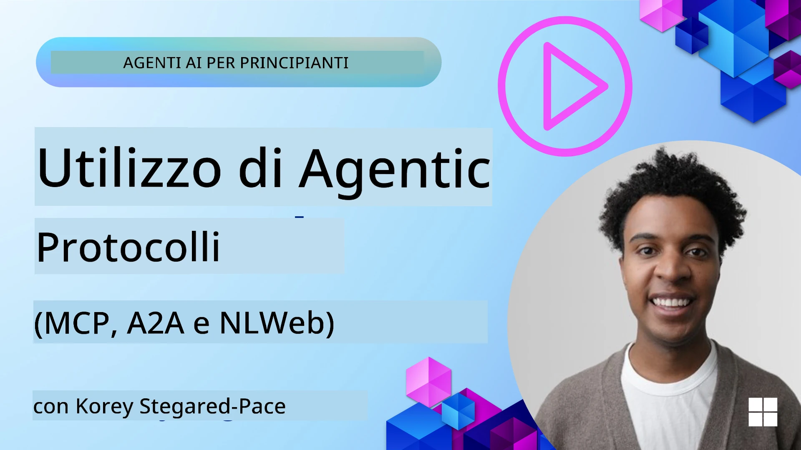
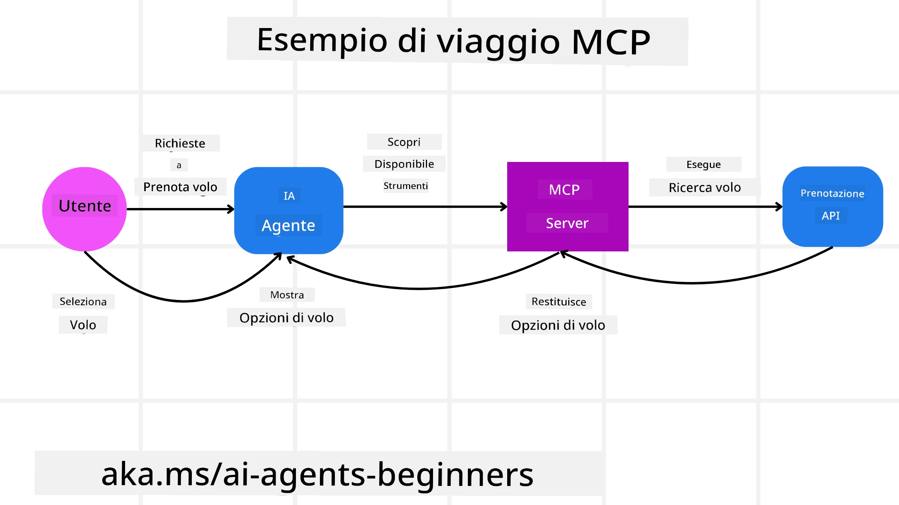
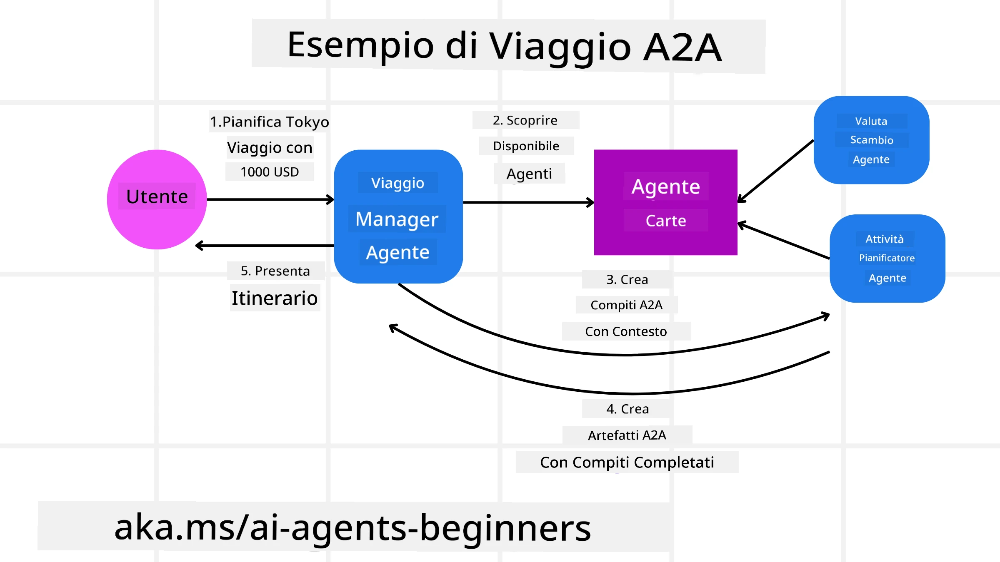
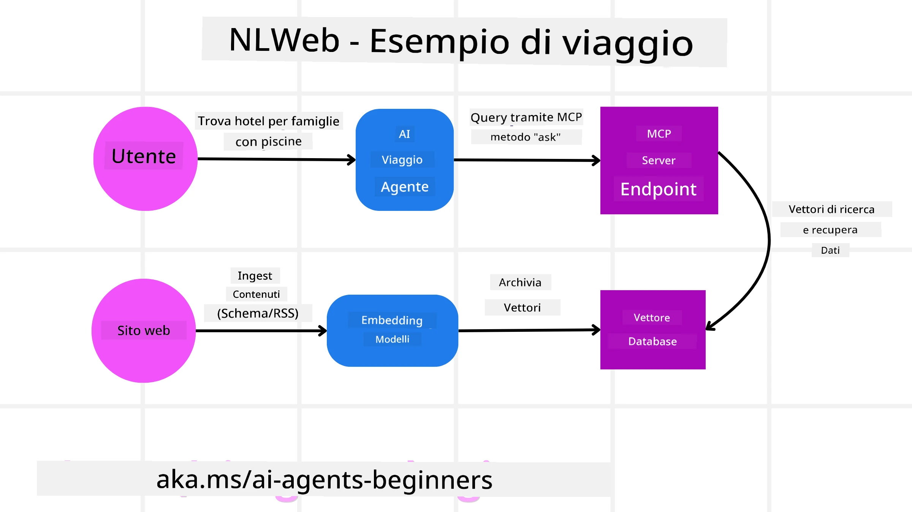

# Utilizzo dei Protocolli Agentici (MCP, A2A e NLWeb)

> _(Clicca sull'immagine sopra per guardare il video di questa lezione)_

Con la crescita dell'uso degli agenti AI, cresce anche la necessità di protocolli che garantiscano la standardizzazione, la sicurezza e supportino l'innovazione aperta. In questa lezione, tratteremo 3 protocolli che cercano di soddisfare questa esigenza - Model Context Protocol (MCP), Agent to Agent (A2A) e Natural Language Web (NLWeb).

## Introduzione

In questa lezione tratteremo:

• Come **MCP** permette agli Agenti AI di accedere a strumenti e dati esterni per completare i compiti degli utenti.

• Come **A2A** abilita la comunicazione e collaborazione tra differenti agenti AI.

• Come **NLWeb** porta interfacce in linguaggio naturale a qualsiasi sito web permettendo agli Agenti AI di scoprire e interagire con i contenuti.

## Obiettivi di apprendimento

• **Identificare** lo scopo principale e i benefici di MCP, A2A e NLWeb nel contesto degli agenti AI.

• **Spiegare** come ciascun protocollo facilita la comunicazione e l'interazione tra LLM, strumenti e altri agenti.

• **Riconoscere** i ruoli distinti che ogni protocollo svolge nella costruzione di sistemi agentici complessi.

## Model Context Protocol

Il **Model Context Protocol (MCP)** è uno standard aperto che fornisce un modo standardizzato per le applicazioni di fornire contesto e strumenti agli LLM. Questo abilita un "adattatore universale" a diverse fonti di dati e strumenti a cui gli Agenti AI possono connettersi in modo coerente.

Analizziamo i componenti di MCP, i vantaggi rispetto all’uso diretto delle API e un esempio di come gli agenti AI potrebbero usare un server MCP.

### Componenti principali di MCP

MCP opera con un'**architettura client-server** e i componenti principali sono:

• **Host** sono applicazioni LLM (per esempio un editor di codice come VSCode) che avviano le connessioni a un server MCP.

• **Client** sono componenti all’interno dell'applicazione host che mantengono connessioni uno-a-uno con i server.

• **Server** sono programmi leggeri che espongono specifiche capacità.

Inclusi nel protocollo ci sono tre primitive principali che sono le capacità di un server MCP:

• **Strumenti**: Sono azioni o funzioni discrete che un agente AI può invocare per eseguire un'azione. Per esempio, un servizio meteorologico può esporre uno strumento "get weather", oppure un server e-commerce può esporre uno strumento "acquista prodotto". I server MCP pubblicizzano il nome, la descrizione e lo schema input/output di ogni strumento nella loro lista di capacità.

• **Risorse**: Sono elementi di dati o documenti in sola lettura che un server MCP può fornire, e i client possono recuperarli su richiesta. Esempi includono contenuti di file, record di database o file di log. Le risorse possono essere testo (come codice o JSON) o binarie (come immagini o PDF).

• **Prompt**: Sono modelli predefiniti che forniscono prompt suggeriti, permettendo flussi di lavoro più complessi.

### Vantaggi di MCP

MCP offre vantaggi significativi per gli Agenti AI:

• **Scoperta Dinamica degli Strumenti**: Gli agenti possono ricevere dinamicamente una lista degli strumenti disponibili da un server insieme a descrizioni di ciò che fanno. Questo contrasta con le API tradizionali, che spesso richiedono codifica statica per integrazioni, significando che ogni cambiamento API necessita aggiornamenti di codice. MCP offre un approccio "integra una volta", portando maggiore adattabilità.

• **Interoperabilità tra LLM**: MCP funziona su diversi LLM, fornendo flessibilità per cambiare modelli core per valutare migliori prestazioni.

• **Sicurezza Standardizzata**: MCP include un metodo di autenticazione standard, migliorando la scalabilità nell'aggiungere accesso a server MCP aggiuntivi. Questo è più semplice rispetto a gestire diverse chiavi e tipi di autenticazione per varie API tradizionali.

### Esempio MCP

Immagina che un utente voglia prenotare un volo usando un assistente AI supportato da MCP.

1. **Connessione**: L'assistente AI (client MCP) si connette a un server MCP fornito da una compagnia aerea.

2. **Scoperta degli Strumenti**: Il client chiede al server MCP della compagnia aerea: "Quali strumenti avete disponibili?" Il server risponde con strumenti come "ricerca voli" e "prenota voli".

3. **Invocazione dello Strumento**: L'utente chiede all'assistente AI: "Per favore cerca un volo da Portland a Honolulu." L'assistente AI, usando il suo LLM, identifica che deve chiamare lo strumento "ricerca voli" e passa i parametri rilevanti (origine, destinazione) al server MCP.

4. **Esecuzione e Risposta**: Il server MCP, agendo come wrapper, fa la chiamata reale all'API interna di prenotazione della compagnia aerea. Riceve poi le informazioni sul volo (per esempio dati JSON) e le invia all'assistente AI.

5. **Ulteriore Interazione**: L'assistente AI presenta le opzioni di volo. Una volta selezionato un volo, l'assistente può invocare lo strumento "prenota volo" sullo stesso server MCP, completando la prenotazione.

## Protocollo Agent-to-Agent (A2A)

Mentre MCP si concentra sul collegare gli LLM agli strumenti, il **protocollo Agent-to-Agent (A2A)** fa un passo avanti abilitando la comunicazione e collaborazione tra diversi agenti AI. A2A connette agenti AI attraverso diverse organizzazioni, ambienti e stack tecnologici per completare un compito condiviso.

Esamineremo i componenti e i vantaggi di A2A, insieme a un esempio di come potrebbe essere applicato nella nostra applicazione di viaggio.

### Componenti principali di A2A

A2A si concentra nel permettere la comunicazione tra agenti e farli lavorare insieme per completare un sotto-compito dell'utente. Ogni componente del protocollo contribuisce a questo:

#### Agent Card

Simile a come un server MCP condivide una lista di strumenti, una Agent Card ha:
- Il Nome dell’Agente.
- Una **descrizione dei compiti generali** che completa.
- Una **lista di competenze specifiche** con descrizioni per aiutare altri agenti (o anche utenti umani) a capire quando e perché vorrebbero chiamare quell’agente.
- L'**URL di Endpoint corrente** dell'agente
- La **versione** e le **capacità** dell'agente, come risposte in streaming e notifiche push.

#### Agent Executor

L'Agent Executor è responsabile di **passare il contesto della chat utente all'agente remoto**, l'agente remoto ne ha bisogno per capire il compito da completare. In un server A2A, un agente usa il proprio Large Language Model (LLM) per analizzare le richieste in ingresso ed eseguire compiti usando i propri strumenti interni.

#### Artefatto

Una volta che un agente remoto ha completato il compito richiesto, il suo prodotto di lavoro viene creato come artefatto. Un artefatto **contiene il risultato del lavoro dell'agente**, una **descrizione di ciò che è stato completato** e il **contesto testuale** che viene spedito attraverso il protocollo. Dopo che l'artefatto è inviato, la connessione con l'agente remoto viene chiusa fino a quando non serve nuovamente.

#### Coda di Eventi

Questa componente è usata per **gestire aggiornamenti e passare messaggi**. È particolarmente importante in ambienti di produzione per sistemi agentici per prevenire che la connessione tra agenti venga chiusa prima che un compito sia completato, specialmente quando i tempi di completamento possono essere lunghi.

### Vantaggi di A2A

• **Collaborazione Potenziata**: Permette agli agenti di diversi fornitori e piattaforme di interagire, condividere contesto e lavorare insieme, facilitando l’automazione fluida tra sistemi tradizionalmente disconnessi.

• **Flessibilità nella Selezione del Modello**: Ogni agente A2A può scegliere quale LLM utilizzare per servire le sue richieste, permettendo modelli ottimizzati o fine-tuned per agente, diversamente da una singola connessione LLM in alcuni scenari MCP.

• **Autenticazione Integrata**: L'autenticazione è integrata direttamente nel protocollo A2A, fornendo un robusto framework di sicurezza per le interazioni tra agenti.

### Esempio A2A

Espandiamo il nostro scenario di prenotazione viaggi, ma questa volta usando A2A.

1. **Richiesta Utente al Multi-Agente**: Un utente interagisce con un agente/client A2A chiamato "Travel Agent", per esempio dicendo: "Per favore prenota un viaggio completo per Honolulu la prossima settimana, inclusi voli, hotel e auto a noleggio".

2. **Orchestrazione da parte del Travel Agent**: Il Travel Agent riceve questa richiesta complessa. Usa il proprio LLM per riflettere sul compito e determina che deve interagire con altri agenti specializzati.

3. **Comunicazione tra Agenti**: Il Travel Agent usa quindi il protocollo A2A per connettersi agli agenti a valle, come un "Airline Agent", un "Hotel Agent" e un "Car Rental Agent" creati da diverse aziende.

4. **Esecuzione Delegata dei Compiti**: Il Travel Agent manda compiti specifici a questi agenti specializzati (es. "Trova voli per Honolulu", "Prenota un hotel", "Noleggia un'auto"). Ognuno di questi agenti specializzati, che eseguono i propri LLM e utilizzano i propri strumenti (che potrebbero essere a loro volta server MCP), svolgono la loro parte specifica della prenotazione.

5. **Risposta Consolidata**: Quando tutti gli agenti a valle completano i loro compiti, il Travel Agent compila i risultati (dettagli voli, conferma hotel, prenotazione auto) e invia una risposta completa, in stile chat, all’utente.

## Natural Language Web (NLWeb)

I siti web sono da tempo il modo principale con cui gli utenti accedono a informazioni e dati su Internet.

Esaminiamo i diversi componenti di NLWeb, i vantaggi di NLWeb e un esempio di come funziona il nostro NLWeb osservando la nostra applicazione di viaggio.

### Componenti di NLWeb

- **Applicazione NLWeb (Codice Servizio Core)**: Il sistema che processa domande in linguaggio naturale. Connette le diverse parti della piattaforma per creare risposte. Puoi pensarlo come il **motore che alimenta le funzionalità in linguaggio naturale** di un sito web.

- **Protocollo NLWeb**: Questo è un **insieme base di regole per l'interazione in linguaggio naturale** con un sito web. Ritorna risposte in formato JSON (spesso utilizzando Schema.org). Lo scopo è creare una base semplice per il “Web AI”, nello stesso modo in cui HTML ha reso possibile condividere documenti online.

- **Server MCP (Endpoint Model Context Protocol)**: Ogni setup NLWeb funziona anche come un **server MCP**. Ciò significa che può **condividere strumenti (come un metodo “ask”) e dati** con altri sistemi AI. In pratica, questo rende il contenuto e le capacità del sito web utilizzabili dagli agenti AI, permettendo al sito di diventare parte del più ampio “ecosistema agentico.”

- **Modelli di Embedding**: Questi modelli sono usati per **convertire il contenuto del sito web in rappresentazioni numeriche chiamate vettori** (embedding). Questi vettori catturano il significato in modo che i computer possano confrontare e cercare. Sono memorizzati in un database speciale, e gli utenti possono scegliere quale modello di embedding usare.

- **Database Vettoriale (Meccanismo di Recupero)**: Questo database **memorizza gli embedding del contenuto del sito web**. Quando qualcuno fa una domanda, NLWeb controlla il database vettoriale per trovare velocemente le informazioni più rilevanti. Fornisce una lista rapida di possibili risposte, ordinate per similarità. NLWeb funziona con diversi sistemi di storage vettoriale come Qdrant, Snowflake, Milvus, Azure AI Search e Elasticsearch.

### NLWeb con un Esempio

Considera di nuovo il nostro sito di prenotazione viaggi, ma questa volta, è alimentato da NLWeb.

1. **Ingestione Dati**: I cataloghi prodotti esistenti del sito di viaggi (es. liste voli, descrizioni hotel, pacchetti tour) sono formattati usando Schema.org o caricati tramite feed RSS. Gli strumenti di NLWeb ingeriscono questi dati strutturati, creano embedding e li memorizzano in un database vettoriale locale o remoto.

2. **Query in Linguaggio Naturale (Umano)**: Un utente visita il sito e, invece di navigare i menu, digita in un’interfaccia chat: "Trova un hotel per famiglie a Honolulu con piscina per la prossima settimana".

3. **Elaborazione NLWeb**: L'applicazione NLWeb riceve questa query. La invia a un LLM per comprensione e contemporaneamente ricerca nel proprio database vettoriale gli elenchi hotel pertinenti.

4. **Risultati Precisi**: L'LLM aiuta a interpretare i risultati di ricerca dal database, identifica le migliori corrispondenze basate sui criteri "family-friendly," "piscina," e "Honolulu", quindi formatta una risposta in linguaggio naturale. Fondamentalmente, la risposta si riferisce ad hotel reali dal catalogo del sito, evitando informazioni inventate.

5. **Interazione Agente AI**: Poiché NLWeb funziona come server MCP, un agente AI di viaggio esterno potrebbe connettersi a questa istanza NLWeb del sito. L'agente AI potrebbe quindi usare il metodo MCP `ask` per interrogare direttamente il sito: `ask("Ci sono ristoranti vegani nella zona di Honolulu consigliati dall’hotel?")`. L'istanza NLWeb elaborerebbe questa richiesta, sfruttando il suo database di informazioni sui ristoranti (se caricato) e restituirebbe una risposta JSON strutturata.

### Hai altre domande su MCP/A2A/NLWeb?

Unisciti al [Microsoft Foundry Discord](https://discord.com/invite/ATgtXmAS5D) per incontrare altri studenti, partecipare a ore di ufficio e ottenere risposte alle tue domande sugli Agenti AI.

## Risorse

- [MCP per Principianti](https://aka.ms/mcp-for-beginners)  
- [Documentazione MCP](https://learn.microsoft.com/python/api/overview/azure/ai-projects-readme)
- [Repositorio NLWeb](https://github.com/nlweb-ai/NLWeb)
- [Microsoft Agent Framework](https://learn.microsoft.com/en-us/agent-framework/overview/?wt.mc_id=youtube_26688_organicsocial_reactor&pivots=programming-language-python)

## Lezione Precedente

[Agenti AI in Produzione](../10-ai-agents-production/README.md)

## Lezione Successiva

[Ingegneria del Contesto per Agenti AI](../12-context-engineering/README.md)

---

<!-- CO-OP TRANSLATOR DISCLAIMER START -->
**Disclaimer**:
Questo documento è stato tradotto utilizzando il servizio di traduzione AI [Co-op Translator](https://github.com/Azure/co-op-translator). Sebbene ci impegniamo per garantire la precisione, si prega di notare che le traduzioni automatizzate possono contenere errori o imprecisioni. Il documento originale nella sua lingua nativa deve essere considerato la fonte autorevole. Per informazioni critiche, si raccomanda una traduzione professionale effettuata da un essere umano. Non siamo responsabili per eventuali malintesi o interpretazioni errate derivanti dall’uso di questa traduzione.
<!-- CO-OP TRANSLATOR DISCLAIMER END -->