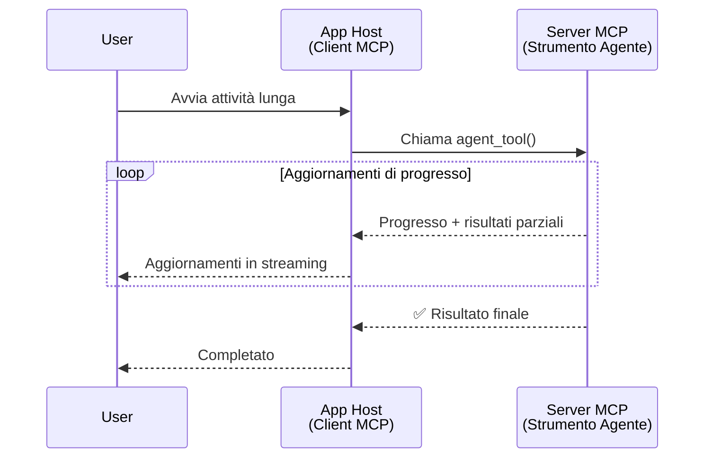
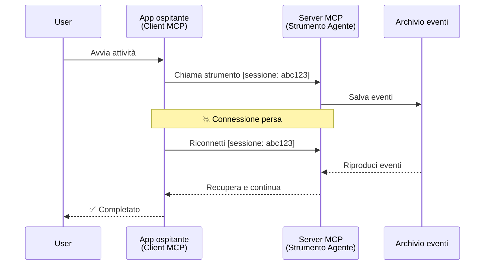
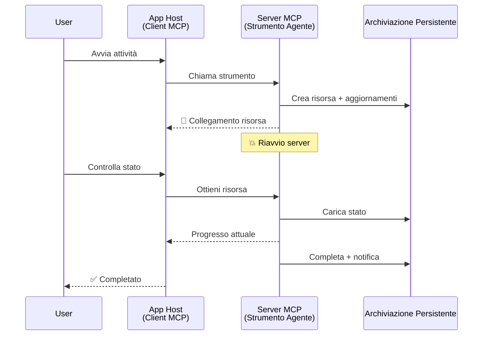
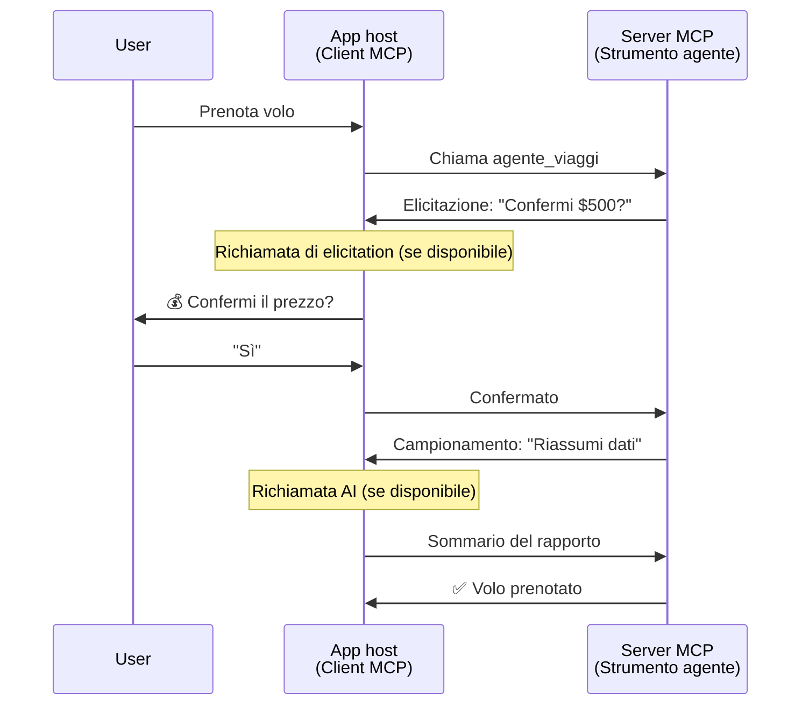
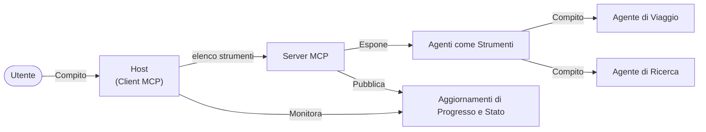

# Costruire Sistemi di Comunicazione Agent-to-Agent con MCP

> TL;DR - Puoi costruire una comunicazione Agent2Agent su MCP? Sì!

MCP si è evoluto significativamente oltre il suo obiettivo originale di "fornire contesto agli LLM". Con recenti miglioramenti che includono [flussi riavviabili](https://modelcontextprotocol.io/docs/concepts/transports#resumability-and-redelivery), [elicitazione](https://modelcontextprotocol.io/specification/2025-06-18/client/elicitation), [sampling](https://modelcontextprotocol.io/specification/2025-06-18/client/sampling) e notifiche ([progressi](https://modelcontextprotocol.io/specification/2025-06-18/basic/utilities/progress) e [risorse](https://modelcontextprotocol.io/specification/2025-06-18/schema#resourceupdatednotification)), MCP ora fornisce una base solida per costruire sistemi complessi di comunicazione agent-to-agent.

## Il Malinteso Agente/Strumento

Man mano che più sviluppatori esplorano strumenti con comportamenti agentici (che funzionano per lunghi periodi, possono richiedere input aggiuntivi durante l’esecuzione, ecc.), un malinteso comune è che MCP non sia adatto principalmente perché i primi esempi delle sue primitive di strumenti si concentravano su schemi semplici di richiesta-risposta.

Questa percezione è superata. La specifica MCP è stata significativamente ampliata negli ultimi mesi con capacità che colmano il divario per costruire comportamenti agentici a lunga durata:

- **Streaming & Risultati Parziali**: Aggiornamenti in tempo reale durante l’esecuzione
- **Riavviabilità**: I client possono riconnettersi e continuare dopo la disconnessione
- **Durabilità**: I risultati sopravvivono ai riavvii del server (es. tramite link a risorse)
- **Interazioni Multi-turno**: Input interattivi durante l’esecuzione tramite elicitazione e sampling

Queste caratteristiche possono essere combinate per abilitare applicazioni agentiche complesse e multi-agente, tutte implementate sul protocollo MCP.

Per riferimento, ci riferiremo a un agente come a un "strumento" disponibile su un server MCP. Ciò implica l'esistenza di un’applicazione host che implementa un client MCP che stabilisce una sessione con il server MCP e può chiamare l’agente.

## Cosa Rende uno Strumento MCP "Agentico"?

Prima di immergerci nell’implementazione, definiamo quali capacità infrastrutturali sono necessarie per supportare agenti a lunga durata.

> Definiremo un agente come un'entità che può operare autonomamente per periodi estesi, capace di gestire compiti complessi che possono richiedere molteplici interazioni o aggiustamenti basati sul feedback in tempo reale.

### 1. Streaming & Risultati Parziali

I classici schemi di richiesta-risposta non funzionano per compiti a lunga durata. Gli agenti devono fornire:

- Aggiornamenti di progresso in tempo reale
- Risultati intermedi

**Supporto MCP**: Le notifiche di aggiornamento delle risorse consentono lo streaming di risultati parziali, anche se ciò richiede un design attento per evitare conflitti con il modello 1:1 richiesta/risposta di JSON-RPC.

| Caratteristica             | Caso d'Uso                                                                                                                                                                     | Supporto MCP                                                                              |
| ------------------------- | ----------------------------------------------------------------------------------------------------------------------------------------------------------------------------- | ----------------------------------------------------------------------------------------- |
| Aggiornamenti di Progresso in Tempo Reale | L’utente richiede un compito di migrazione del codice. L’agente trasmette in streaming il progresso: "10% - Analisi dipendenze... 25% - Conversione file TypeScript... 50% - Aggiornamento import..." | ✅ Notifiche di progresso                                                                 |
| Risultati Parziali        | Il compito "Genera un libro" restituisce risultati parziali in streaming, ad es., 1) Schema dell’arco narrativo, 2) Elenco capitoli, 3) Ciascun capitolo completato. L’host può ispezionare, annullare o reindirizzare a qualsiasi punto. | ✅ Notifiche possono essere "estese" per includere risultati parziali, vedere proposte PR 383, 776 |

<div align="center" style="font-style: italic; font-size: 0.95em; margin-bottom: 0.5em;">
<strong>Figura 1:</strong> Questo diagramma illustra come un agente MCP trasmette in streaming aggiornamenti di progresso in tempo reale e risultati parziali all’applicazione host durante un compito a lunga durata, permettendo all’utente di monitorare l’esecuzione in tempo reale.
</div>



### 2. Riavviabilità

Gli agenti devono gestire interruzioni di rete con garbo:

- Riconnettersi dopo una disconnessione (lato client)
- Continuare da dove erano rimasti (ri-consegna messaggi)

**Supporto MCP**: Oggi il trasporto MCP StreamableHTTP supporta la ripresa della sessione e la riconsegna dei messaggi con ID sessione e ID ultimo evento. Nota importante è che il server deve implementare un EventStore che permetta la riproduzione degli eventi al momento della riconnessione del client.  
Si segnala anche una proposta della community (PR #975) che esplora flussi riavviabili indipendenti dal trasporto.

| Caratteristica | Caso d'Uso                                                                                                                                              | Supporto MCP                                                              |
| ------------- | ------------------------------------------------------------------------------------------------------------------------------------------------------- | ------------------------------------------------------------------------ |
| Riavviabilità | Il client si disconnette durante un compito a lunga durata. Alla riconnessione, la sessione riprende con gli eventi mancati riprodotti, continuando senza interruzioni. | ✅ Trasporto StreamableHTTP con ID sessione, replay eventi e EventStore  |

<div align="center" style="font-style: italic; font-size: 0.95em; margin-bottom: 0.5em;">
<strong>Figura 2:</strong> Questo diagramma mostra come il trasporto MCP StreamableHTTP e l’event store permettono una ripresa senza interruzioni della sessione: se il client si disconnette, può riconnettersi e riprodurre gli eventi persi, continuando il compito senza perdita di progresso.
</div>



### 3. Durabilità

Gli agenti a lunga durata necessitano di uno stato persistente:

- I risultati resistono ai riavvii del server
- Lo stato può essere recuperato separatamente
- Tracciamento del progresso attraverso le sessioni

**Supporto MCP**: MCP ora supporta un tipo di ritorno link a risorsa per le chiamate agli strumenti. Oggi, uno schema possibile è progettare uno strumento che crea una risorsa e restituisce immediatamente un link a risorsa. Lo strumento può continuare a gestire il compito in background e aggiornare la risorsa. A sua volta, il client può decidere di interrogare lo stato di questa risorsa per ottenere risultati parziali o completi (basati sugli aggiornamenti di risorsa forniti dal server) o sottoscriversi alla risorsa per ricevere notifiche di aggiornamento.

Una limitazione qui è che interrogare ripetutamente risorse o sottoscriversi agli aggiornamenti può consumare risorse con implicazioni su larga scala. Esiste una proposta comunitaria aperta (inclusa #992) che esplora la possibilità di includere webhook o trigger che il server può chiamare per notificare il client/app host degli aggiornamenti.

| Caratteristica | Caso d'Uso                                                                                                                                     | Supporto MCP                                                    |
| ------------- | ---------------------------------------------------------------------------------------------------------------------------------------------- | ---------------------------------------------------------------- |
| Durabilità    | Il server si blocca durante un compito di migrazione dati. I risultati e il progresso resistono al riavvio, il client può controllare lo stato e continuare dalla risorsa persistente. | ✅ Link a risorse con memorizzazione persistente e notifiche di stato |

Oggi, uno schema comune è progettare uno strumento che crea una risorsa e restituisce immediatamente un link a risorsa. Lo strumento può in background gestire il compito, inviare notifiche di risorsa che fungono da aggiornamenti di progressi o includono risultati parziali, e aggiornare il contenuto della risorsa secondo necessità.

<div align="center" style="font-style: italic; font-size: 0.95em; margin-bottom: 0.5em;">
<strong>Figura 3:</strong> Questo diagramma dimostra come gli agenti MCP usano risorse persistenti e notifiche di stato per garantire che i compiti a lunga durata sopravvivano ai riavvii del server, permettendo ai client di controllare i progressi e recuperare i risultati anche dopo guasti.
</div>



### 4. Interazioni Multi-Turno

Gli agenti spesso necessitano di input addizionale durante l’esecuzione:

- Chiarimenti o approvazioni umane
- Assistenza AI per decisioni complesse
- Regolazione dinamica dei parametri

**Supporto MCP**: Completamente supportato tramite sampling (per input AI) ed elicitazione (per input umano).

| Caratteristica          | Caso d'Uso                                                                                                                                                  | Supporto MCP                                             |
| ---------------------- | ----------------------------------------------------------------------------------------------------------------------------------------------------------- | --------------------------------------------------------- |
| Interazioni Multi-Turno | Un agente di prenotazione viaggi richiede conferma prezzi dall’utente, quindi chiede all’AI di riassumere i dati di viaggio prima di completare la prenotazione. | ✅ Elicitazione per input umano, sampling per input AI      |

<div align="center" style="font-style: italic; font-size: 0.95em; margin-bottom: 0.5em;">
<strong>Figura 4:</strong> Questo diagramma mostra come gli agenti MCP possono interattivamente sollecitare input umano o richiedere assistenza AI durante l’esecuzione, supportando workflow complessi multi-turno come conferme e decisioni dinamiche.
</div>



## Implementare Agenti a Lunga Durata su MCP - Panoramica del Codice

Come parte di questo articolo, forniamo un [repository di codice](https://github.com/victordibia/ai-tutorials/tree/main/MCP%20Agents) che contiene un’implementazione completa di agenti a lunga durata usando l’SDK Python MCP con trasporto StreamableHTTP per ripresa della sessione e riconsegna dei messaggi. L’implementazione dimostra come le capacità MCP possano essere combinate per abilitare comportamenti sofisticati simili a quelli agentici.

Specificamente, implementiamo un server con due strumenti agent principali:

- **Agente Viaggi** - Simula un servizio di prenotazione viaggi con conferma prezzi tramite elicitazione
- **Agente Ricerca** - Esegue compiti di ricerca con riassunti assistiti da AI tramite sampling

Entrambi gli agenti dimostrano aggiornamenti di progresso in tempo reale, conferme interattive e piena capacità di ripresa della sessione.

### Concetti Chiave di Implementazione

Le sezioni seguenti mostrano l’implementazione lato server degli agenti e la gestione lato client dell’host per ogni capacità:

#### Streaming & Aggiornamenti di Progresso - Stato del Compito in Tempo Reale

Lo streaming permette agli agenti di fornire aggiornamenti di progresso in tempo reale durante compiti a lunga durata, mantenendo l’utente informato sullo stato del compito e sui risultati intermedi.

**Implementazione Server (l’agente invia notifiche di progresso):**

```python
# Da server/server.py - Agente di viaggio che invia aggiornamenti sul progresso
for i, step in enumerate(steps):
    await ctx.session.send_progress_notification(
        progress_token=ctx.request_id,
        progress=i * 25,
        total=100,
        message=step,
        related_request_id=str(ctx.request_id)
    )
    await anyio.sleep(2)  # Simula il lavoro

# Alternativa: Registrare messaggi per aggiornamenti dettagliati passo dopo passo
await ctx.session.send_log_message(
    level="info",
    data=f"Processing step {current_step}/{steps} ({progress_percent}%)",
    logger="long_running_agent",
    related_request_id=ctx.request_id,
)
```

**Implementazione Client (l’host riceve aggiornamenti di progresso):**

```python
# Da client/client.py - Gestione client delle notifiche in tempo reale
async def message_handler(message) -> None:
    if isinstance(message, types.ServerNotification):
        if isinstance(message.root, types.LoggingMessageNotification):
            console.print(f"📡 [dim]{message.root.params.data}[/dim]")
        elif isinstance(message.root, types.ProgressNotification):
            progress = message.root.params
            console.print(f"🔄 [yellow]{progress.message} ({progress.progress}/{progress.total})[/yellow]")

# Registra il gestore dei messaggi durante la creazione della sessione
async with ClientSession(
    read_stream, write_stream,
    message_handler=message_handler
) as session:
```

#### Elicitazione - Richiedere Input Utente

L’elicitazione permette agli agenti di richiedere input utente durante l’esecuzione. È essenziale per conferme, chiarimenti o approvazioni durante compiti a lungo termine.

**Implementazione Server (l’agente richiede conferma):**

```python
# Dall'agente/server.py - Agente di viaggio che richiede la conferma del prezzo
elicit_result = await ctx.session.elicit(
    message=f"Please confirm the estimated price of $1200 for your trip to {destination}",
    requestedSchema=PriceConfirmationSchema.model_json_schema(),
    related_request_id=ctx.request_id,
)

if elicit_result and elicit_result.action == "accept":
    # Continua con la prenotazione
    logger.info(f"User confirmed price: {elicit_result.content}")
elif elicit_result and elicit_result.action == "decline":
    # Annulla la prenotazione
    booking_cancelled = True
```

**Implementazione Client (l’host fornisce callback di elicitazione):**

```python
# Da client/client.py - Gestione client delle richieste di elicitazione
async def elicitation_callback(context, params):
    console.print(f"💬 Server is asking for confirmation:")
    console.print(f"   {params.message}")

    response = console.input("Do you accept? (y/n): ").strip().lower()

    if response in ['y', 'yes']:
        return types.ElicitResult(
            action="accept",
            content={"confirm": True, "notes": "Confirmed by user"}
        )
    else:
        return types.ElicitResult(
            action="decline",
            content={"confirm": False, "notes": "Declined by user"}
        )

# Registra la callback durante la creazione della sessione
async with ClientSession(
    read_stream, write_stream,
    elicitation_callback=elicitation_callback
) as session:
```

#### Sampling - Richiedere Assistenza AI

Il sampling consente agli agenti di richiedere assistenza LLM per decisioni complesse o generazione di contenuto durante l’esecuzione. Ciò abilita workflow ibridi umano-AI.

**Implementazione Server (l’agente richiede assistenza AI):**

```python
# Dal server/server.py - Agente di ricerca che richiede un riassunto AI
sampling_result = await ctx.session.create_message(
    messages=[
        SamplingMessage(
            role="user",
            content=TextContent(type="text", text=f"Please summarize the key findings for research on: {topic}")
        )
    ],
    max_tokens=100,
    related_request_id=ctx.request_id,
)

if sampling_result and sampling_result.content:
    if sampling_result.content.type == "text":
        sampling_summary = sampling_result.content.text
        logger.info(f"Received sampling summary: {sampling_summary}")
```

**Implementazione Client (l’host fornisce callback di sampling):**

```python
# Da client/client.py - Gestione delle richieste di campionamento del client
async def sampling_callback(context, params):
    message_text = params.messages[0].content.text if params.messages else 'No message'
    console.print(f"🧠 Server requested sampling: {message_text}")

    # In un'applicazione reale, questo potrebbe chiamare un'API LLM
    # Per scopi dimostrativi, forniamo una risposta fittizia
    mock_response = "Based on current research, MCP has evolved significantly..."

    return types.CreateMessageResult(
        role="assistant",
        content=types.TextContent(type="text", text=mock_response),
        model="interactive-client",
        stopReason="endTurn"
    )

# Registra la callback quando si crea la sessione
async with ClientSession(
    read_stream, write_stream,
    sampling_callback=sampling_callback,
    elicitation_callback=elicitation_callback
) as session:
```

#### Riavviabilità - Continuità della Sessione Attraverso Disconnessioni

La riavviabilità garantisce che i compiti agentici a lunga durata possano sopravvivere a disconnessioni del client e continuare senza interruzioni alla riconnessione. Ciò è implementato tramite event store e token di ripresa.

**Implementazione Event Store (il server mantiene lo stato della sessione):**

```python
# Da server/event_store.py - Semplice archivio eventi in memoria
class SimpleEventStore(EventStore):
    def __init__(self):
        self._events: list[tuple[StreamId, EventId, JSONRPCMessage]] = []
        self._event_id_counter = 0

    async def store_event(self, stream_id: StreamId, message: JSONRPCMessage) -> EventId:
        """Store an event and return its ID."""
        self._event_id_counter += 1
        event_id = str(self._event_id_counter)
        self._events.append((stream_id, event_id, message))
        return event_id

    async def replay_events_after(self, last_event_id: EventId, send_callback: EventCallback) -> StreamId | None:
        """Replay events after the specified ID for resumption."""
        start_index = None
        stream_id = None
        for index, (event_stream_id, event_id, _) in enumerate(self._events):
            if event_id == last_event_id:
                start_index = index + 1
                stream_id = event_stream_id
                break

        if start_index is None:
            return None

        # Riproduci solo eventi successivi dallo stream originale della sessione.
        for event_stream_id, event_id, message in self._events[start_index:]:
            if event_stream_id != stream_id:
                continue
            await send_callback(EventMessage(message, event_id))

        return stream_id

# Da server/server.py - Passaggio dell'archivio eventi al gestore delle sessioni
def create_server_app(event_store: Optional[EventStore] = None) -> Starlette:
    server = ResumableServer()

    # Crea un gestore della sessione con archivio eventi per la ripresa
    session_manager = StreamableHTTPSessionManager(
        app=server,
        event_store=event_store,  # L'archivio eventi consente la ripresa della sessione
        json_response=False,
        security_settings=security_settings,
    )

    return Starlette(routes=[Mount("/mcp", app=session_manager.handle_request)])

# Uso: Inizializza con archivio eventi
event_store = SimpleEventStore()
app = create_server_app(event_store)
```

**Metadati Client con Token di Ripresa (il client si riconnette usando stato memorizzato):**

```python
# Da client/client.py - Ripresa del client con metadati
if existing_tokens and existing_tokens.get("resumption_token"):
    # Usa il token di ripresa esistente per continuare da dove abbiamo interrotto
    metadata = ClientMessageMetadata(
        resumption_token=existing_tokens["resumption_token"],
    )
else:
    # Crea callback per salvare il token di ripresa quando ricevuto
    def enhanced_callback(token: str):
        protocol_version = getattr(session, 'protocol_version', None)
        token_manager.save_tokens(session_id, token, protocol_version, command, args)

    metadata = ClientMessageMetadata(
        on_resumption_token_update=enhanced_callback,
    )

# Invia richiesta con metadati di ripresa
result = await session.send_request(
    types.ClientRequest(
        types.CallToolRequest(
            method="tools/call",
            params=types.CallToolRequestParams(name=command, arguments=args)
        )
    ),
    types.CallToolResult,
    metadata=metadata,
)
```

L’applicazione host mantiene localmente ID sessione e token di ripresa, permettendo di riconnettersi a sessioni esistenti senza perdere progresso o stato.

### Organizzazione del Codice

<div align="center" style="font-style: italic; font-size: 0.95em; margin-bottom: 0.5em;">
<strong>Figura 5:</strong> Architettura del sistema agent basato su MCP
</div>



**File Chiave:**

- **`server/server.py`** - Server MCP riavviabile con agenti viaggi e ricerca che dimostrano elicitazione, sampling e aggiornamenti di progresso
- **`client/client.py`** - Applicazione host interattiva con supporto alla ripresa, gestori callback e gestione token
- **`server/event_store.py`** - Implementazione event store che abilita la ripresa delle sessioni e la riconsegna dei messaggi

## Estendere alla Comunicazione Multi-Agente su MCP

L’implementazione sopra può essere estesa a sistemi multi-agente migliorando l’intelligenza e l’ambito dell’applicazione host:

- **Decomposizione Intelligente del Compito**: L’host analizza richieste complesse dell’utente e le divide in sottocompiti per agenti specializzati diversi
- **Coordinamento Multi-Server**: L’host mantiene connessioni a più server MCP, ognuno con caratteristiche agent diverse
- **Gestione dello Stato del Compito**: L’host traccia progresso attraverso molteplici compiti agent concorrenti, gestendo dipendenze e sequenze
- **Resilienza & Riprova**: L’host gestisce guasti, implementa logica di retry e riassegna compiti quando agenti diventano non disponibili
- **Sintesi dei Risultati**: L’host combina output da più agenti in risultati finali coerenti

L’host si evolve da semplice client a orchestratore intelligente, coordinando capacità agent distribuite mantenendo la stessa base protocollare MCP.

## Conclusione

Le capacità ampliate di MCP - notifiche di risorsa, elicitazione/sampling, flussi riavviabili e risorse persistenti - abilitano interazioni complesse agent-to-agent mantenendo la semplicità del protocollo.

## Per Iniziare

Pronto per costruire il tuo sistema agent2agent? Segui questi passaggi:

### 1. Esegui la Demo

```bash
# Avvia il server con l'event store per la ripresa
python -m server.server --port 8006

# In un altro terminale, esegui il client interattivo
python -m client.client --url http://127.0.0.1:8006/mcp
```

**Comandi disponibili in modalità interattiva:**

- `travel_agent` - Prenota viaggi con conferma prezzo tramite elicitazione
- `research_agent` - Ricerca argomenti con riassunti assistiti da AI tramite sampling
- `list` - Mostra tutti gli strumenti disponibili
- `clean-tokens` - Pulisce i token di ripresa
- `help` - Mostra aiuto dettagliato sui comandi
- `quit` - Esci dal client

### 2. Testa le Capacità di Ripresa

- Avvia un agente a lunga durata (es. `travel_agent`)
- Interrompi il client durante l’esecuzione (Ctrl+C)
- Riavvia il client - riprenderà automaticamente da dove era rimasto

### 3. Esplora ed Estendi

- **Esplora gli esempi**: Dai un’occhiata a questo [mcp-agents](https://github.com/victordibia/ai-tutorials/tree/main/MCP%20Agents)
- **Unisciti alla community**: Partecipa alle discussioni MCP su GitHub
- **Sperimenta**: Parti da un compito semplice a lunga durata e aggiungi gradualmente streaming, riavviabilità e coordinamento multi-agente

Questo dimostra come MCP abiliti comportamenti intelligenti di agenti mantenendo la semplicità basata sugli strumenti.

In generale, la specifica del protocollo MCP sta evolvendo rapidamente; si consiglia di consultare il sito ufficiale della documentazione per gli aggiornamenti più recenti - https://modelcontextprotocol.io/introduction

---

<!-- CO-OP TRANSLATOR DISCLAIMER START -->
**Disclaimer**:
Questo documento è stato tradotto utilizzando il servizio di traduzione AI [Co-op Translator](https://github.com/Azure/co-op-translator). Sebbene ci impegniamo per garantire la precisione, si prega di notare che le traduzioni automatizzate possono contenere errori o imprecisioni. Il documento originale nella sua lingua nativa deve essere considerato la fonte autorevole. Per informazioni critiche, si raccomanda una traduzione professionale effettuata da un essere umano. Non siamo responsabili per eventuali malintesi o interpretazioni errate derivanti dall’uso di questa traduzione.
<!-- CO-OP TRANSLATOR DISCLAIMER END -->